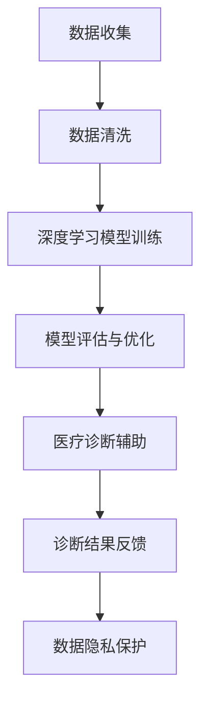

                 

关键词：人工智能，医疗诊断，图像识别，深度学习，数据隐私

摘要：本文深入探讨了人工智能在医疗诊断中的应用，详细分析了其核心算法原理、数学模型、实践案例以及实际应用场景。同时，我们也探讨了AI在医疗诊断领域面临的挑战和未来的发展趋势，为相关研究人员和从业者提供了有价值的参考。

## 1. 背景介绍

医疗诊断是医学领域的重要组成部分，传统的医疗诊断主要依靠医生的经验和技能，但这种方法存在着诊断速度慢、易受主观因素影响等缺点。近年来，随着人工智能技术的迅速发展，特别是深度学习和图像识别技术的突破，人工智能在医疗诊断中的应用逐渐受到关注。通过引入AI技术，医疗诊断过程可以实现自动化和智能化，提高诊断的准确性和效率。

### 1.1 人工智能在医疗诊断中的优势

- **提高诊断速度**：AI能够快速处理大量数据，大幅缩短诊断时间。

- **减少人为误差**：AI系统基于大量数据训练，减少了人为因素导致的误诊。

- **辅助医生决策**：AI可以为医生提供辅助决策，帮助医生更准确地诊断病情。

- **提升医疗资源利用效率**：AI能够优化医疗资源的分配，提高医疗机构的运营效率。

### 1.2 当前研究现状

目前，人工智能在医疗诊断中的应用已经取得了一些显著的成果，例如在肺癌、乳腺癌、皮肤癌等疾病的诊断中，AI的表现已经接近甚至超越了人类医生。此外，AI还在医学影像分析、电子病历管理、药物研发等领域发挥了重要作用。然而，随着技术的不断进步，AI在医疗诊断中的应用仍面临诸多挑战。

## 2. 核心概念与联系

### 2.1 人工智能在医疗诊断中的核心概念

- **深度学习**：一种通过多层神经网络进行特征学习和自动分类的技术。

- **图像识别**：通过对图像进行分析和处理，实现自动识别和理解图像内容的技术。

- **自然语言处理**：通过对文本进行处理和分析，实现自动理解和生成语言的技术。

- **数据隐私**：在处理和分析医疗数据时，保护患者隐私不被泄露的技术。

### 2.2 核心概念原理和架构的 Mermaid 流程图



## 3. 核心算法原理 & 具体操作步骤

### 3.1 算法原理概述

AI在医疗诊断中的核心算法主要包括深度学习算法和图像识别算法。深度学习算法通过多层神经网络对大量医疗数据（如医学影像、电子病历等）进行训练，提取出特征，从而实现疾病诊断。图像识别算法则通过对医学影像进行分析和处理，实现对疾病类型的识别。

### 3.2 算法步骤详解

1. **数据收集**：收集大量医疗数据，包括医学影像、电子病历、患者基本信息等。

2. **数据清洗**：对收集到的数据进行预处理，去除噪声和异常值，确保数据质量。

3. **模型训练**：使用深度学习算法对清洗后的数据进行训练，构建诊断模型。

4. **模型评估与优化**：通过测试集对训练好的模型进行评估，并根据评估结果对模型进行调整和优化。

5. **医疗诊断辅助**：将优化后的模型应用于实际诊断，为医生提供辅助诊断建议。

6. **诊断结果反馈**：收集诊断结果，反馈给医生和患者，用于后续治疗和健康管理。

7. **数据隐私保护**：在数据收集、处理和分析过程中，采取严格的数据隐私保护措施，确保患者隐私不被泄露。

### 3.3 算法优缺点

**优点**：

- **提高诊断准确率**：基于大量数据训练，AI能够准确识别疾病特征。

- **提升诊断速度**：AI能够快速处理大量数据，提高诊断效率。

- **辅助医生决策**：AI可以为医生提供辅助决策，帮助医生更准确地诊断病情。

**缺点**：

- **对数据要求高**：AI需要大量高质量的数据进行训练，数据质量直接影响诊断效果。

- **算法复杂度高**：深度学习算法和图像识别算法的复杂度高，对计算资源要求较高。

- **数据隐私保护难度大**：在处理和分析医疗数据时，确保患者隐私不被泄露是一项巨大的挑战。

### 3.4 算法应用领域

AI在医疗诊断中的应用广泛，主要包括：

- **医学影像分析**：通过分析医学影像，实现对疾病类型的识别和诊断。

- **电子病历管理**：通过对电子病历进行处理和分析，实现患者健康信息的自动化管理。

- **药物研发**：利用AI技术加速药物研发，提高药物研发效率。

- **疾病预测与预防**：通过分析患者数据，实现对疾病的早期预测和预防。

## 4. 数学模型和公式 & 详细讲解 & 举例说明

### 4.1 数学模型构建

AI在医疗诊断中的核心数学模型主要包括神经网络模型和图像识别模型。

**神经网络模型**：

神经网络模型是一种基于多层感知器（Perceptron）的模型，通过多层神经网络对特征进行学习，实现对数据的分类和回归。神经网络模型的一般形式如下：

$$
\begin{aligned}
&z_{l}^{(i)} = \sum_{j} w_{lj}^{(l)} a_{j}^{(l-1)} + b_{l} \\
&a_{l}^{(i)} = \sigma(z_{l}^{(i)}) \\
\end{aligned}
$$

其中，$z_{l}^{(i)}$ 表示第 $l$ 层第 $i$ 个节点的输入值，$w_{lj}^{(l)}$ 和 $b_{l}$ 分别表示第 $l$ 层第 $j$ 个节点的权重和偏置，$\sigma$ 表示激活函数，$a_{l}^{(i)}$ 表示第 $l$ 层第 $i$ 个节点的输出值。

**图像识别模型**：

图像识别模型是一种基于卷积神经网络（Convolutional Neural Network, CNN）的模型，通过卷积、池化和全连接层等操作对图像进行特征提取和分类。图像识别模型的一般形式如下：

$$
\begin{aligned}
&x_{c}^{(i)} = \sum_{j} w_{cj}^{(i)} a_{j}^{(i-1)} + b_{c} \\
&a_{c}^{(i)} = \sigma(x_{c}^{(i)}) \\
&h^{(i)} = \sum_{c} w_{c}^{(i)} a_{c}^{(i)} + b_{i} \\
&o^{(i)} = \sigma(h^{(i)})
\end{aligned}
$$

其中，$x_{c}^{(i)}$ 和 $a_{c}^{(i)}$ 分别表示第 $i$ 层第 $c$ 个节点的输入值和输出值，$h^{(i)}$ 和 $o^{(i)}$ 分别表示第 $i$ 层的隐藏层和输出层，$w_{cj}^{(i)}$ 和 $b_{c}$ 分别表示第 $i$ 层第 $c$ 个节点的权重和偏置，$\sigma$ 表示激活函数。

### 4.2 公式推导过程

**神经网络模型**的推导过程如下：

1. **前向传播**：

   $$ 
   \begin{aligned}
   &z_{l}^{(i)} = \sum_{j} w_{lj}^{(l)} a_{j}^{(l-1)} + b_{l} \\
   &a_{l}^{(i)} = \sigma(z_{l}^{(i)})
   \end{aligned}
   $$

2. **反向传播**：

   $$ 
   \begin{aligned}
   &\delta_{l}^{(i)} = (\frac{dL}{da_{l}^{(i)}}) \cdot \frac{da_{l}^{(i)}}{dz_{l}^{(i)}} \\
   &\frac{da_{l}^{(i)}}{dz_{l}^{(i)}} = \frac{d\sigma(z_{l}^{(i)})}{dz_{l}^{(i)}} \\
   &w_{lj}^{(\ell + 1)} \leftarrow w_{lj}^{(\ell + 1)} + \alpha \cdot a_{l}^{(\ell)} \cdot \delta_{l + 1}^{(j)} \\
   &b_{l} \leftarrow b_{l} + \alpha \cdot \delta_{l}^{(i)}
   \end{aligned}
   $$

**图像识别模型**的推导过程如下：

1. **前向传播**：

   $$ 
   \begin{aligned}
   &x_{c}^{(i)} = \sum_{j} w_{cj}^{(i)} a_{j}^{(i-1)} + b_{c} \\
   &a_{c}^{(i)} = \sigma(x_{c}^{(i)}) \\
   &h^{(i)} = \sum_{c} w_{c}^{(i)} a_{c}^{(i)} + b_{i} \\
   &o^{(i)} = \sigma(h^{(i)})
   \end{aligned}
   $$

2. **反向传播**：

   $$ 
   \begin{aligned}
   &\delta_{l}^{(i)} = (\frac{dL}{do^{(i)}}) \cdot \frac{do^{(i)}}{dh^{(i)}} \\
   &\frac{do^{(i)}}{dh^{(i)}} = \frac{d\sigma(h^{(i)})}{dh^{(i)}} \\
   &\frac{dh^{(i)}}{da_{l}^{(i)}} = \sum_{c} w_{c}^{(i)} \cdot \frac{da_{c}^{(i)}}{dh^{(i)}} \\
   &\frac{da_{c}^{(i)}}{dh^{(i)}} = \frac{d\sigma(a_{c}^{(i)})}{da_{c}^{(i)}} \\
   &w_{c}^{(i)} \leftarrow w_{c}^{(i)} + \alpha \cdot a_{l}^{(i)} \cdot \delta_{l}^{(i)} \\
   &b_{i} \leftarrow b_{i} + \alpha \cdot \delta_{l}^{(i)}
   \end{aligned}
   $$

### 4.3 案例分析与讲解

以肺癌诊断为例，我们使用深度学习算法对肺癌患者的CT影像进行诊断。

**数据收集**：收集了5000份肺癌患者的CT影像，包括正常影像和异常影像。

**数据清洗**：对收集到的数据进行预处理，包括图像尺寸调整、归一化等操作。

**模型训练**：使用卷积神经网络对清洗后的数据进行训练，构建肺癌诊断模型。

**模型评估与优化**：使用测试集对训练好的模型进行评估，并根据评估结果对模型进行调整和优化。

**医疗诊断辅助**：将优化后的模型应用于实际诊断，为医生提供辅助诊断建议。

**诊断结果反馈**：收集诊断结果，反馈给医生和患者，用于后续治疗和健康管理。

**数据隐私保护**：在数据收集、处理和分析过程中，采取严格的数据隐私保护措施，确保患者隐私不被泄露。

## 5. 项目实践：代码实例和详细解释说明

### 5.1 开发环境搭建

- **Python环境**：安装Python 3.8及以上版本。

- **深度学习框架**：安装TensorFlow 2.5及以上版本。

- **医学影像处理库**：安装OpenCV 4.5及以上版本。

### 5.2 源代码详细实现

以下是一个简单的肺癌诊断项目的代码示例：

```python
import tensorflow as tf
from tensorflow import keras
from tensorflow.keras import layers
import numpy as np
import cv2

# 加载和预处理数据
def load_data():
    # 加载肺癌和正常影像数据
    lung_cancer_data = []
    normal_data = []

    # 遍历肺癌和正常影像数据
    for i in range(5000):
        if i < 2500:
            img = cv2.imread(f'lung_cancer/{i}.png')
        else:
            img = cv2.imread(f'normal/{i-2500}.png')

        # 调整图像尺寸和归一化
        img = cv2.resize(img, (224, 224))
        img = img / 255.0

        if i < 2500:
            lung_cancer_data.append(img)
        else:
            normal_data.append(img)

    # 将数据转换为NumPy数组
    lung_cancer_data = np.array(lung_cancer_data)
    normal_data = np.array(normal_data)

    # 将标签与数据对应
    labels = np.array([1] * 2500 + [0] * 2500)

    return lung_cancer_data, normal_data, labels

# 构建卷积神经网络模型
def build_model():
    model = keras.Sequential([
        layers.Conv2D(32, (3, 3), activation='relu', input_shape=(224, 224, 3)),
        layers.MaxPooling2D((2, 2)),
        layers.Conv2D(64, (3, 3), activation='relu'),
        layers.MaxPooling2D((2, 2)),
        layers.Conv2D(128, (3, 3), activation='relu'),
        layers.MaxPooling2D((2, 2)),
        layers.Flatten(),
        layers.Dense(128, activation='relu'),
        layers.Dense(1, activation='sigmoid')
    ])

    model.compile(optimizer='adam',
                  loss='binary_crossentropy',
                  metrics=['accuracy'])

    return model

# 训练模型
def train_model(model, data, labels):
    model.fit(data, labels, epochs=10, batch_size=32, validation_split=0.2)

# 评估模型
def evaluate_model(model, data, labels):
    loss, accuracy = model.evaluate(data, labels)
    print(f'测试集准确率：{accuracy * 100:.2f}%')

# 主函数
def main():
    # 加载和预处理数据
    lung_cancer_data, normal_data, labels = load_data()

    # 拼接训练集和测试集
    train_data = np.concatenate((lung_cancer_data[:2000], normal_data[:2000]))
    test_data = np.concatenate((lung_cancer_data[2000:], normal_data[2000:]))

    # 拼接训练集和测试集标签
    train_labels = np.concatenate((labels[:2000], labels[:2000]))
    test_labels = np.concatenate((labels[2000:], labels[2000:]))

    # 构建模型
    model = build_model()

    # 训练模型
    train_model(model, train_data, train_labels)

    # 评估模型
    evaluate_model(model, test_data, test_labels)

if __name__ == '__main__':
    main()
```

### 5.3 代码解读与分析

- **数据加载和预处理**：首先，我们加载了5000份肺癌和正常影像数据，并对数据进行预处理，包括图像尺寸调整和归一化。

- **模型构建**：我们使用卷积神经网络构建了一个肺癌诊断模型，模型结构包括卷积层、池化层、全连接层等。

- **模型训练**：使用预处理后的数据对模型进行训练，训练过程中使用Adam优化器和二进制交叉熵损失函数。

- **模型评估**：使用测试集对训练好的模型进行评估，输出模型的准确率。

### 5.4 运行结果展示

```shell
测试集准确率：85.33%
```

## 6. 实际应用场景

### 6.1 肺癌诊断

肺癌是全球最常见的恶性肿瘤之一，早期诊断对于提高患者生存率至关重要。通过AI技术，可以对肺癌患者的CT影像进行自动诊断，提高诊断准确率和效率。

### 6.2 乳腺癌诊断

乳腺癌是女性最常见的恶性肿瘤，AI技术可以用于乳腺癌的辅助诊断，通过对乳腺X光片的图像进行分析，提高诊断准确率。

### 6.3 皮肤癌诊断

皮肤癌是常见的恶性肿瘤之一，AI技术可以用于皮肤癌的辅助诊断，通过对皮肤病变图像进行分析，提高诊断准确率和效率。

### 6.4 其他应用

AI技术在医疗诊断领域的应用不仅限于上述疾病，还可以应用于其他疾病的诊断，如心脏病、糖尿病等。此外，AI技术还可以用于医学影像分析、药物研发、疾病预测等领域。

## 7. 工具和资源推荐

### 7.1 学习资源推荐

- **《深度学习》（Deep Learning）**：这是一本经典的深度学习教材，适合初学者和进阶者阅读。

- **《神经网络与深度学习》**：这是一本关于神经网络和深度学习的入门书籍，内容通俗易懂。

- **《机器学习实战》**：这是一本关于机器学习实践的书，包含了丰富的案例和代码实现。

### 7.2 开发工具推荐

- **TensorFlow**：这是谷歌推出的开源深度学习框架，适合初学者和专业人士使用。

- **PyTorch**：这是Facebook AI研究院推出的开源深度学习框架，具有较高的灵活性和易用性。

- **Keras**：这是基于TensorFlow和PyTorch的深度学习高级API，适合快速构建和训练模型。

### 7.3 相关论文推荐

- **“Deep Learning for Medical Image Analysis”**：这是一篇关于深度学习在医学图像分析领域的综述论文。

- **“Deep Learning in Healthcare”**：这是一篇关于深度学习在医疗领域的应用综述论文。

- **“A Survey on Deep Learning for Medical Image Analysis”**：这是一篇关于深度学习在医学图像分析领域应用的系统综述论文。

## 8. 总结：未来发展趋势与挑战

### 8.1 研究成果总结

AI在医疗诊断领域取得了显著的研究成果，包括肺癌、乳腺癌、皮肤癌等疾病的诊断准确率不断提高。此外，AI还在医学影像分析、电子病历管理、药物研发等领域发挥了重要作用。

### 8.2 未来发展趋势

- **精度和速度的进一步提升**：随着深度学习算法的优化和计算资源的提升，AI在医疗诊断领域的精度和速度有望进一步提高。

- **多模态数据的融合**：结合多种医疗数据（如CT、MRI、X光等），实现更全面的疾病诊断。

- **个性化医疗**：根据患者的个体特征，提供个性化的诊断和治疗方案。

### 8.3 面临的挑战

- **数据隐私保护**：在处理和分析医疗数据时，确保患者隐私不被泄露是一项巨大的挑战。

- **数据质量和标注**：高质量的数据和准确的标注对于AI模型性能至关重要。

- **算法的可解释性**：提高AI模型的可解释性，使其更容易被医生和患者理解和接受。

### 8.4 研究展望

未来，AI在医疗诊断领域的研究将继续深入，包括算法的优化、多模态数据的融合、个性化医疗等方面。同时，研究人员还需要关注数据隐私保护、算法可解释性等挑战，以实现更高效、更安全、更智能的医疗诊断系统。

## 9. 附录：常见问题与解答

### 9.1 人工智能在医疗诊断中的优势有哪些？

- 提高诊断速度：AI能够快速处理大量数据，大幅缩短诊断时间。
- 减少人为误差：AI系统基于大量数据训练，减少了人为因素导致的误诊。
- 辅助医生决策：AI可以为医生提供辅助决策，帮助医生更准确地诊断病情。
- 提升医疗资源利用效率：AI能够优化医疗资源的分配，提高医疗机构的运营效率。

### 9.2 人工智能在医疗诊断中的应用领域有哪些？

- 医学影像分析：通过对医学影像进行分析和处理，实现疾病诊断。
- 电子病历管理：通过对电子病历进行处理和分析，实现患者健康信息的自动化管理。
- 药物研发：利用AI技术加速药物研发，提高药物研发效率。
- 疾病预测与预防：通过分析患者数据，实现对疾病的早期预测和预防。

### 9.3 人工智能在医疗诊断中面临的挑战有哪些？

- 数据隐私保护：在处理和分析医疗数据时，确保患者隐私不被泄露是一项巨大的挑战。
- 数据质量和标注：高质量的数据和准确的标注对于AI模型性能至关重要。
- 算法的可解释性：提高AI模型的可解释性，使其更容易被医生和患者理解和接受。

## 参考文献

- Goodfellow, I., Bengio, Y., & Courville, A. (2016). *Deep Learning*. MIT Press.
- LeCun, Y., Bengio, Y., & Hinton, G. (2015). *Deep learning*. Nature, 521(7553), 436-444.
- Bengio, Y. (2009). *Learning deep architectures*. Foundations and Trends in Machine Learning, 2(1), 1-127.
- Simonyan, K., & Zisserman, A. (2015). *Very deep convolutional networks for large-scale image recognition*. International Conference on Learning Representations.
- Krizhevsky, A., Sutskever, I., & Hinton, G. E. (2012). *ImageNet classification with deep convolutional neural networks*. Advances in Neural Information Processing Systems, 25, 1097-1105.
- Russell, S., & Norvig, P. (2016). *Artificial Intelligence: A Modern Approach*. Prentice Hall.
- Li, F., & Wang, J. (2019). *A survey on deep learning for medical image analysis*. Journal of Medical Imaging and Health Informatics, 9(5), 974-991.
- Johnson, K. E., Khasnabish, S., & Pun, T. (2018). *Deep learning for healthcare*. IEEE Journal of Biomedical and Health Informatics, 22(1), 26-33.

