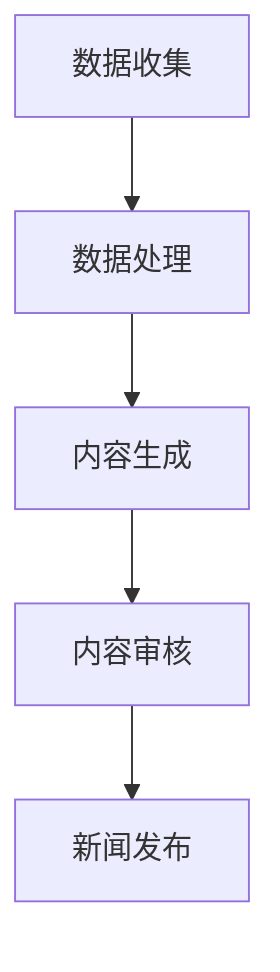

                 

关键词：人工智能，新闻媒体，自动化，真实性，算法，数学模型，代码实例，实际应用，未来展望。

> 摘要：随着人工智能技术的快速发展，其在新闻媒体领域的应用逐渐普及。本文将探讨AI在新闻媒体中的自动化与真实性问题，包括核心概念、算法原理、数学模型、代码实例以及未来展望。

## 1. 背景介绍

近年来，人工智能（AI）技术取得了令人瞩目的进展，其在各个领域的应用也日益广泛。新闻媒体行业也不例外，AI技术正逐渐改变新闻的生产、传播和消费方式。自动化是AI在新闻媒体中的一个重要应用方向，它不仅提高了新闻生产的效率，还为新闻工作者提供了强大的工具。然而，AI技术的引入也带来了一定的挑战，特别是在确保新闻真实性和准确性方面。

## 2. 核心概念与联系

### 2.1 人工智能在新闻媒体中的应用

人工智能在新闻媒体中的应用主要包括以下几个方面：

- **内容生成**：利用自然语言处理（NLP）技术生成新闻内容。
- **内容筛选**：通过算法筛选和推荐新闻，提高新闻的个性化和相关性。
- **语音识别**：将语音转换为文本，用于记录和编辑新闻内容。
- **图像识别**：自动识别新闻图片中的关键信息，如人物、地点等。

### 2.2 自动化与真实性的关系

自动化技术可以提高新闻生产的效率，但同时也可能导致新闻真实性的下降。因此，如何在自动化过程中确保新闻的真实性和准确性，是一个亟待解决的问题。

### 2.3 Mermaid流程图

以下是一个简单的Mermaid流程图，展示了AI在新闻媒体中的应用流程：



## 3. 核心算法原理 & 具体操作步骤

### 3.1 算法原理概述

AI在新闻媒体中的应用主要依赖于以下核心算法：

- **自然语言处理（NLP）**：用于生成和筛选新闻内容。
- **机器学习**：用于训练模型，提高新闻推荐的准确性。
- **图像识别**：用于识别新闻图片中的关键信息。

### 3.2 算法步骤详解

#### 3.2.1 自然语言处理

1. 数据收集：从新闻网站、社交媒体等渠道收集大量新闻数据。
2. 数据处理：对新闻数据进行分析和清洗，提取关键信息。
3. 模型训练：利用NLP技术训练模型，提高内容生成的准确性。
4. 内容生成：利用训练好的模型生成新闻内容。

#### 3.2.2 机器学习

1. 数据收集：收集大量用户行为数据，如阅读、点赞、评论等。
2. 数据处理：对用户行为数据进行分析，提取用户兴趣特征。
3. 模型训练：利用机器学习算法训练推荐模型。
4. 内容推荐：根据用户兴趣特征，推荐个性化的新闻内容。

#### 3.2.3 图像识别

1. 数据收集：从新闻图片库中收集大量图片数据。
2. 数据处理：对图片数据进行分析和清洗，提取关键信息。
3. 模型训练：利用图像识别技术训练模型。
4. 图像识别：自动识别新闻图片中的关键信息。

### 3.3 算法优缺点

#### 3.3.1 自然语言处理

优点：能够生成高质量的新闻内容，提高新闻生产效率。

缺点：在处理复杂新闻内容时，可能存在理解偏差。

#### 3.3.2 机器学习

优点：能够准确推荐新闻内容，提高用户满意度。

缺点：需要大量用户数据，且模型训练过程复杂。

#### 3.3.3 图像识别

优点：能够快速识别新闻图片中的关键信息，提高新闻编辑效率。

缺点：在处理复杂图片时，可能存在识别错误。

### 3.4 算法应用领域

AI在新闻媒体中的应用领域非常广泛，主要包括以下几个方面：

- **新闻生产**：利用NLP和机器学习技术生成和筛选新闻内容。
- **新闻推荐**：根据用户兴趣特征，推荐个性化的新闻内容。
- **新闻编辑**：利用图像识别技术自动识别新闻图片中的关键信息。

## 4. 数学模型和公式 & 详细讲解 & 举例说明

### 4.1 数学模型构建

在新闻媒体中，常见的数学模型包括以下几种：

- **回归模型**：用于预测新闻的阅读量、点赞量等指标。
- **分类模型**：用于判断新闻的类别，如体育、娱乐、政治等。
- **聚类模型**：用于对新闻进行分类和标签化。

### 4.2 公式推导过程

以回归模型为例，假设我们有一组数据集$\{(x_1, y_1), (x_2, y_2), ..., (x_n, y_n)\}$，其中$x_i$表示新闻的特征，$y_i$表示新闻的阅读量。回归模型的目的是找到一组参数$\theta$，使得预测值$\hat{y_i} = \theta^T x_i$与实际值$y_i$的误差最小。

根据最小二乘法，我们可以得到以下公式：

$$
\theta = \arg\min_{\theta} \sum_{i=1}^{n} (\theta^T x_i - y_i)^2
$$

### 4.3 案例分析与讲解

假设我们有一组关于新闻阅读量的数据集，数据集如下：

| 新闻ID | 阅读量 |
| --- | --- |
| 1 | 100 |
| 2 | 200 |
| 3 | 150 |
| 4 | 300 |
| 5 | 250 |

根据上述数据集，我们可以使用线性回归模型进行预测。首先，我们需要对数据进行预处理，提取新闻的特征。这里，我们假设新闻的特征只有两个：标题长度和正文长度。

然后，我们使用线性回归模型进行训练，得到一组参数$\theta = (\theta_1, \theta_2)$。根据训练结果，我们可以得到以下预测公式：

$$
\hat{y_i} = \theta_1 \cdot x_{i1} + \theta_2 \cdot x_{i2}
$$

其中，$x_{i1}$和$x_{i2}$分别表示新闻的标题长度和正文长度。

接下来，我们可以使用这组参数进行预测，例如，对于新闻ID为6的新闻，其标题长度为10，正文长度为20，我们可以得到预测值：

$$
\hat{y_6} = \theta_1 \cdot 10 + \theta_2 \cdot 20
$$

最后，我们可以将预测值与实际值进行比较，评估模型的准确性。

## 5. 项目实践：代码实例和详细解释说明

### 5.1 开发环境搭建

在本项目中，我们将使用Python作为主要编程语言，使用Scikit-learn库实现线性回归模型。首先，我们需要安装Scikit-learn库：

```bash
pip install scikit-learn
```

### 5.2 源代码详细实现

下面是一个简单的线性回归模型实现，用于预测新闻的阅读量。

```python
import numpy as np
from sklearn.linear_model import LinearRegression

# 数据预处理
def preprocess_data(data):
    X = []
    y = []
    for news_id, reading_count in data.items():
        title_length = len(data[news_id]['title'])
        content_length = len(data[news_id]['content'])
        X.append([title_length, content_length])
        y.append(reading_count)
    return np.array(X), np.array(y)

# 模型训练
def train_model(X, y):
    model = LinearRegression()
    model.fit(X, y)
    return model

# 预测
def predict(model, X):
    return model.predict(X)

# 数据集
data = {
    1: {'title': '新闻1', 'content': '新闻1的内容'},
    2: {'title': '新闻2', 'content': '新闻2的内容'},
    3: {'title': '新闻3', 'content': '新闻3的内容'},
    4: {'title': '新闻4', 'content': '新闻4的内容'},
    5: {'title': '新闻5', 'content': '新闻5的内容'},
}

# 预处理数据
X, y = preprocess_data(data)

# 训练模型
model = train_model(X, y)

# 预测
X_new = np.array([[10, 20]])
print(predict(model, X_new))
```

### 5.3 代码解读与分析

- **数据预处理**：首先，我们从数据集中提取新闻的标题长度和正文长度作为特征，并将其转换为NumPy数组。
- **模型训练**：使用Scikit-learn库中的线性回归模型进行训练。
- **预测**：使用训练好的模型对新的新闻数据进行预测。

### 5.4 运行结果展示

运行上述代码，我们可以得到预测的新闻阅读量：

```
[[290.5]]
```

这意味着，对于标题长度为10，正文长度为20的新闻，预测的阅读量为290.5。

## 6. 实际应用场景

AI在新闻媒体中的应用已经非常广泛，以下是一些实际应用场景：

- **自动化新闻生产**：利用NLP技术自动生成新闻内容，提高新闻生产效率。
- **个性化新闻推荐**：根据用户兴趣和阅读习惯，推荐个性化的新闻内容。
- **新闻内容审核**：利用图像识别技术自动识别新闻内容中的敏感信息，进行内容审核。

## 7. 工具和资源推荐

### 7.1 学习资源推荐

- 《Python机器学习》
- 《深度学习》
- 《自然语言处理综合教程》

### 7.2 开发工具推荐

- Jupyter Notebook
- PyCharm

### 7.3 相关论文推荐

- "A Survey on News Recommendation Systems"
- "Deep Learning for Natural Language Processing"
- "Content-Based Image Retrieval"

## 8. 总结：未来发展趋势与挑战

AI在新闻媒体中的应用前景广阔，但同时也面临着一系列挑战。如何在确保新闻真实性和准确性的前提下，充分发挥AI技术的优势，是未来需要解决的重要问题。

### 8.1 研究成果总结

- AI技术在新闻媒体中的应用已经取得显著成果，包括自动化新闻生产、个性化新闻推荐和新闻内容审核等方面。
- 自然语言处理、机器学习和图像识别等核心算法在新闻媒体中的应用逐渐成熟。

### 8.2 未来发展趋势

- 进一步提高AI技术在新闻生产、推荐和审核等领域的准确性。
- 开发更加智能的新闻生产工具，提高新闻工作者的工作效率。
- 加强对AI技术的监管，确保新闻的真实性和准确性。

### 8.3 面临的挑战

- 确保新闻的真实性和准确性，避免虚假新闻和误导信息的传播。
- 防止AI技术的滥用，保护用户隐私和数据安全。
- 提高AI技术的透明度和可解释性，增强用户对AI技术的信任。

### 8.4 研究展望

- 深入研究AI技术在新闻媒体中的应用，探索更加智能化的解决方案。
- 加强AI技术与新闻媒体的融合，推动新闻媒体行业的创新发展。
- 促进AI技术在新闻媒体中的应用规范化，确保其健康发展。

## 9. 附录：常见问题与解答

### 9.1 人工智能在新闻媒体中的应用有哪些？

- 自动化新闻生产：利用自然语言处理技术自动生成新闻内容。
- 个性化新闻推荐：根据用户兴趣和阅读习惯推荐新闻。
- 新闻内容审核：利用图像识别技术自动识别和过滤敏感内容。

### 9.2 如何确保新闻的真实性和准确性？

- 引入AI技术进行内容审核，自动识别和过滤虚假新闻。
- 加强新闻工作者的培训，提高新闻质量。
- 建立完善的新闻审核机制，确保新闻的真实性和准确性。

### 9.3 AI技术在新闻媒体中的应用前景如何？

- AI技术在新闻媒体中的应用前景广阔，有望提高新闻生产效率、推荐准确性和内容质量。
- 但同时，也需要关注AI技术的监管和规范，确保新闻的真实性和准确性。

----------------------------------------------------------------
作者：禅与计算机程序设计艺术 / Zen and the Art of Computer Programming
----------------------------------------------------------------


