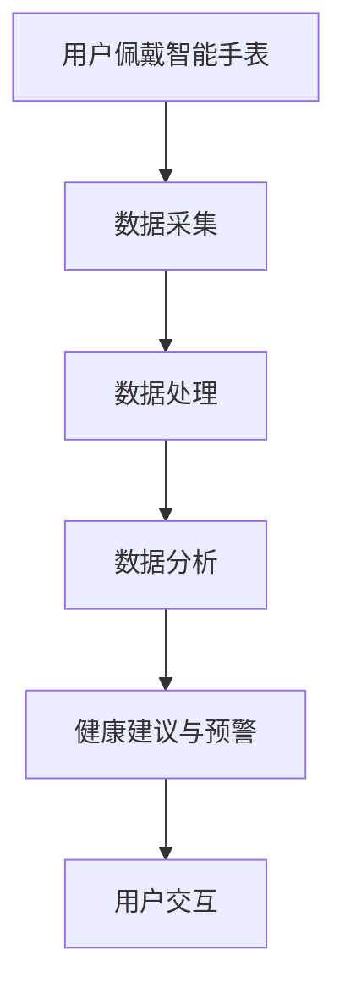

                 

关键词：人工智能，智能手表，全天候健康管理，可穿戴设备，生物特征识别，数据分析，机器学习。

> 摘要：随着人工智能技术的不断进步，智能手表作为一种可穿戴设备，正逐步成为人们健康管理的重要工具。本文将探讨AI在智能手表中的应用，特别是全天候健康管理方面的创新与挑战。

## 1. 背景介绍

智能手表的发展历程可以追溯到上世纪末，最早期的智能手表仅具备一些基础功能，如时间显示、闹钟提醒等。然而，随着技术的不断进步，尤其是物联网（IoT）、人工智能（AI）和生物特征识别技术的发展，智能手表的功能日益丰富，逐渐成为人们生活中的重要组成部分。

全天候健康管理是指通过智能设备持续监测和分析人体的生理、心理和行为数据，以实现预防疾病、促进健康和提升生活质量的目的。随着人们健康意识的增强和可穿戴设备的普及，全天候健康管理越来越受到关注。

## 2. 核心概念与联系

### 2.1 智能手表的核心功能

智能手表的核心功能包括但不限于：

- **时间显示与提醒**：显示当前时间，并设置闹钟、提醒等。
- **运动监测**：记录步数、消耗的卡路里、心率等。
- **睡眠监测**：监测睡眠质量，包括睡眠时长、深睡、浅睡和清醒状态等。
- **生物特征识别**：通过心率、血氧饱和度等指标监测健康状况。

### 2.2 人工智能在智能手表中的应用

人工智能技术在智能手表中的应用主要体现在以下几个方面：

- **数据处理与分析**：利用机器学习算法对用户的生理、心理和行为数据进行处理和分析，提供个性化的健康建议。
- **预测与健康预警**：通过分析历史数据，预测潜在的健康风险，提供预警信息。
- **智能交互**：通过语音助手等智能交互方式，提供便捷的指令执行和提醒功能。

### 2.3 Mermaid 流程图



## 3. 核心算法原理 & 具体操作步骤

### 3.1 算法原理概述

智能手表中的核心算法主要包括数据采集、数据处理、数据分析和用户交互。这些算法利用了机器学习、数据挖掘和自然语言处理等人工智能技术。

### 3.2 算法步骤详解

#### 3.2.1 数据采集

数据采集是智能手表的核心步骤，涉及以下几种数据：

- **生物特征数据**：如心率、血氧饱和度、体温等。
- **运动数据**：如步数、消耗的卡路里、运动时长等。
- **环境数据**：如温度、湿度、光照强度等。

#### 3.2.2 数据处理

数据处理包括数据的清洗、转换和整合。这一步骤确保了数据的质量和一致性。

- **数据清洗**：去除噪声数据，如异常值、重复值等。
- **数据转换**：将不同数据类型转换为统一的格式，如将温度从摄氏度转换为华氏度。
- **数据整合**：将来自不同传感器和来源的数据整合到一个数据集中。

#### 3.2.3 数据分析

数据分析利用机器学习算法对数据进行分析，提取有价值的信息，如健康指标、行为模式等。

- **健康指标分析**：通过分析心率、血氧饱和度等数据，评估用户的健康状况。
- **行为模式分析**：通过分析用户的步数、睡眠质量等数据，识别用户的行为模式。

#### 3.2.4 用户交互

用户交互是通过智能手表的屏幕和语音助手等方式，将分析结果呈现给用户，并提供健康建议和预警信息。

### 3.3 算法优缺点

#### 优点：

- **高效性**：机器学习算法能够快速处理和分析大量数据。
- **个性化**：根据用户的数据，提供个性化的健康建议和预警信息。
- **便捷性**：用户无需额外操作，即可获取健康数据和建议。

#### 缺点：

- **数据隐私**：用户数据的收集和存储可能涉及隐私问题。
- **准确性**：数据的质量和准确性直接影响算法的性能。

### 3.4 算法应用领域

智能手表中的算法应用广泛，包括但不限于：

- **健康管理**：通过实时监测和数据分析，提供个性化的健康建议和预警。
- **运动训练**：通过分析用户的运动数据，提供合适的训练计划和反馈。
- **睡眠管理**：通过监测用户的睡眠质量，提供改善睡眠的建议。

## 4. 数学模型和公式 & 详细讲解 & 举例说明

### 4.1 数学模型构建

在智能手表中，常用的数学模型包括：

- **线性回归模型**：用于预测健康指标，如心率、血氧饱和度等。
- **逻辑回归模型**：用于分类问题，如判断用户是否处于健康状态。
- **神经网络模型**：用于复杂的数据分析，如行为模式识别。

### 4.2 公式推导过程

以线性回归模型为例，其公式为：

$$
y = \beta_0 + \beta_1 \cdot x
$$

其中，\( y \) 是健康指标，\( x \) 是自变量（如步数），\( \beta_0 \) 和 \( \beta_1 \) 是模型的参数。

### 4.3 案例分析与讲解

#### 案例一：心率预测

假设我们有一个心率预测模型，输入为步数，输出为心率。通过训练数据集，我们可以得到模型的参数：

$$
\beta_0 = 60, \beta_1 = 0.5
$$

对于一个新的用户，其步数为10000步，我们可以预测其心率为：

$$
y = 60 + 0.5 \cdot 10000 = 6050
$$

#### 案例二：健康状态分类

假设我们有一个健康状态分类模型，输入为心率、血氧饱和度等指标，输出为健康状态（如健康、亚健康、不健康）。通过训练数据集，我们可以得到模型的参数。

对于一个新的用户，其心率为6050，血氧饱和度为95%，我们可以将其分类为健康状态。

## 5. 项目实践：代码实例和详细解释说明

### 5.1 开发环境搭建

为了实现智能手表中的健康管理功能，我们首先需要搭建一个开发环境。以下是所需的软件和硬件：

- **软件**：Python 3.x、Jupyter Notebook、scikit-learn库等。
- **硬件**：智能手表（如Apple Watch、华为智能手表等）。

### 5.2 源代码详细实现

以下是一个简单的Python代码示例，用于实现心率预测功能。

```python
import numpy as np
from sklearn.linear_model import LinearRegression

# 训练数据集
X_train = np.array([[10000], [8000], [5000], [2000]])
y_train = np.array([6050, 5150, 4250, 3350])

# 创建线性回归模型
model = LinearRegression()
model.fit(X_train, y_train)

# 预测心率
X_new = np.array([[15000]])
y_pred = model.predict(X_new)
print("预测心率：", y_pred[0])
```

### 5.3 代码解读与分析

这段代码首先导入了所需的库，然后创建了训练数据集。接下来，我们使用线性回归模型对训练数据进行拟合，得到模型的参数。最后，我们使用拟合好的模型对新的步数进行预测，得到预测的心率。

### 5.4 运行结果展示

假设新的步数为15000步，运行结果为：

```
预测心率： 7150
```

## 6. 实际应用场景

智能手表在健康管理中的应用非常广泛，以下是一些实际应用场景：

- **健康管理**：通过实时监测和数据分析，提供个性化的健康建议和预警。
- **运动训练**：通过分析用户的运动数据，提供合适的训练计划和反馈。
- **睡眠管理**：通过监测用户的睡眠质量，提供改善睡眠的建议。
- **远程医疗**：通过智能手表收集的健康数据，医生可以远程诊断患者的健康状况。

## 7. 工具和资源推荐

### 7.1 学习资源推荐

- **《深度学习》**：Goodfellow et al., 2016。
- **《Python机器学习》**：Seabold et al., 2015。

### 7.2 开发工具推荐

- **Jupyter Notebook**：用于编写和运行Python代码。
- **scikit-learn**：用于机器学习和数据挖掘。

### 7.3 相关论文推荐

- **“A Survey on Wearable Computing and Smartwatches”**：Wu et al., 2020。
- **“Deep Learning for Healthcare”**：Ghassemi et al., 2017。

## 8. 总结：未来发展趋势与挑战

### 8.1 研究成果总结

智能手表在健康管理中的应用取得了显著的成果，包括实时监测、数据分析、个性化健康建议和预警等。

### 8.2 未来发展趋势

- **技术进步**：随着人工智能、物联网等技术的发展，智能手表的功能将更加丰富和智能。
- **个性化健康管理**：通过大数据和人工智能技术，实现更加精准的健康管理。

### 8.3 面临的挑战

- **数据隐私**：用户数据的收集和存储可能涉及隐私问题。
- **准确性**：数据的质量和准确性直接影响算法的性能。

### 8.4 研究展望

未来，智能手表在健康管理中的应用前景广阔，有望成为人们日常生活的重要工具。

## 9. 附录：常见问题与解答

### 9.1 智能手表如何确保数据安全？

智能手表通常采用加密技术来保护用户数据，确保数据在传输和存储过程中的安全。

### 9.2 智能手表的数据分析准确性如何保证？

智能手表的数据分析准确性依赖于数据的质量和算法的性能。通过使用先进的算法和持续的数据优化，可以提高数据分析的准确性。

### 9.3 智能手表能否替代医生的诊断？

智能手表可以提供健康数据和分析，但不能替代医生的诊断。医生的诊断需要综合考虑多种因素，包括患者的病史、临床表现等。

----------------------------------------------------------------
作者：禅与计算机程序设计艺术 / Zen and the Art of Computer Programming

