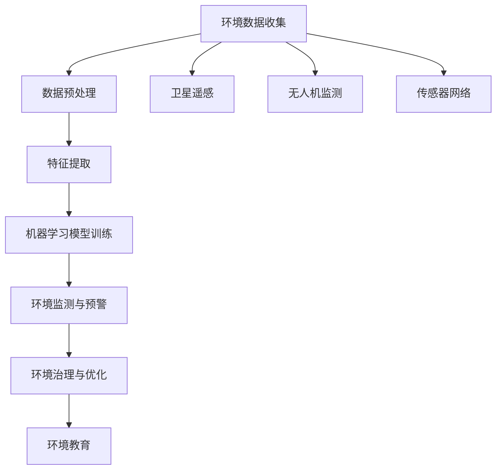

                 

关键词：人工智能、环境保护、监测、预警、算法、数学模型、应用场景、开发工具、未来展望

> 摘要：本文将深入探讨人工智能在环境保护中的应用，特别是在环境监测与预警领域的创新与挑战。我们将从背景介绍、核心概念与联系、核心算法原理与操作步骤、数学模型与公式、项目实践、实际应用场景、未来应用展望以及工具和资源推荐等多个角度，全面解析AI如何助力环境保护。

## 1. 背景介绍

随着全球环境的日益恶化，环境保护已经成为人类社会共同面临的重要课题。环境污染、气候变化、资源匮乏等问题对人类生存和经济发展构成了严重威胁。传统的方法在应对这些挑战时显得力不从心，需要新的技术和方法来提升环境保护的效率和效果。

近年来，人工智能（AI）的快速发展为环境保护提供了新的机遇。AI技术具有数据处理的强大能力，可以自动识别环境中的各种异常现象，提供准确的监测和预警信息。通过AI技术，我们能够更好地理解环境变化，预测环境问题，从而采取及时有效的应对措施。

### 1.1 环境保护现状

环境保护的现状不容乐观。据联合国环境规划署（UNEP）的报告，全球每年约有1.3万亿吨的废弃物被排放到环境中，导致大量的土壤、水源和空气污染。气候变化更是引发了极端天气事件的频发，对农业、水资源和生态系统造成了严重破坏。此外，大气中的温室气体浓度不断上升，导致全球气温逐年升高。

### 1.2 AI在环境保护中的应用

人工智能在环境保护中的应用已经取得了显著的成果。首先，AI技术可以用于环境监测，通过对环境数据的实时分析和处理，及时发现环境变化，提供预警信息。例如，通过无人机、卫星遥感等手段获取的环境数据，可以利用机器学习算法进行分类、识别和预测，从而实现对特定区域环境状况的全面监测。

其次，AI技术可以用于环境治理，通过智能化的手段优化环境治理流程，提高治理效率。例如，在垃圾分类、污水处理等方面，AI技术可以通过数据分析、预测模型等技术手段，实现智能化管理和调度，提高资源利用效率。

最后，AI技术还可以用于环境教育，通过虚拟现实、增强现实等技术手段，增强公众对环境保护的认知和参与度，促进可持续发展。

## 2. 核心概念与联系

在环境保护中，AI的应用涉及多个核心概念和技术的紧密结合。以下是一个简化的Mermaid流程图，描述了这些概念和技术的相互关系。



### 2.1 环境数据收集

环境数据是AI应用于环境保护的基础。数据来源包括卫星遥感、无人机监测、传感器网络等。这些数据经过预处理后，可以用于后续的特征提取和模型训练。

### 2.2 数据预处理

数据预处理是数据清洗、归一化和特征选择等步骤的总称。这一过程确保了数据的质量和一致性，为后续的分析提供了可靠的基础。

### 2.3 特征提取

特征提取是环境数据预处理的重要步骤，旨在从原始数据中提取出对环境变化具有代表性的特征。这些特征将被用于机器学习模型的训练。

### 2.4 机器学习模型训练

机器学习模型是AI的核心组成部分。通过训练，模型可以学会识别环境数据中的模式，从而实现环境监测和预警。

### 2.5 环境监测与预警

环境监测与预警是AI在环境保护中的直接应用。通过实时监测环境数据，模型可以预测未来的环境变化，并发出预警信号，帮助决策者采取及时的措施。

### 2.6 环境治理与优化

环境治理与优化利用AI技术优化环境治理流程，提高治理效率。例如，通过智能调度和自动化控制，可以实现对垃圾回收、污水处理等工作的优化。

### 2.7 环境教育

环境教育通过虚拟现实、增强现实等技术手段，增强公众对环境保护的认知和参与度，促进可持续发展。

## 3. 核心算法原理 & 具体操作步骤

### 3.1 算法原理概述

AI在环境保护中的应用主要依赖于机器学习算法。机器学习算法通过学习环境数据中的模式，实现对环境变化的识别和预测。常见的机器学习算法包括决策树、支持向量机、神经网络等。

### 3.2 算法步骤详解

#### 3.2.1 数据收集

首先，需要收集大量的环境数据，包括气象数据、水质数据、空气质量数据等。这些数据可以来自卫星遥感、无人机监测、传感器网络等。

#### 3.2.2 数据预处理

对收集到的环境数据进行预处理，包括数据清洗、归一化和特征选择等步骤。

#### 3.2.3 特征提取

从预处理后的数据中提取出对环境变化具有代表性的特征。这些特征将用于训练机器学习模型。

#### 3.2.4 模型选择

根据环境数据的特性和预测目标，选择合适的机器学习模型。常见的模型包括决策树、支持向量机、神经网络等。

#### 3.2.5 模型训练

使用提取的特征对机器学习模型进行训练。训练过程包括模型参数的调整和优化，以使模型能够准确识别环境变化。

#### 3.2.6 预测与预警

使用训练好的模型对新的环境数据进行预测，并根据预测结果发出预警信号。

### 3.3 算法优缺点

#### 优点

- **高效性**：AI技术可以处理海量环境数据，提高监测和预警的效率。
- **准确性**：机器学习模型通过学习历史数据，可以提高预测的准确性。
- **自动化**：AI技术可以实现自动化监测和预警，减少人力成本。

#### 缺点

- **数据依赖性**：AI技术对数据质量要求较高，数据缺失或错误可能导致预测不准确。
- **模型复杂度**：机器学习模型通常较为复杂，理解和解释模型的决策过程较困难。
- **计算资源需求**：大规模的机器学习模型训练和预测需要大量的计算资源。

### 3.4 算法应用领域

AI在环境保护中的应用领域广泛，包括但不限于以下方面：

- **环境监测**：通过卫星遥感、无人机监测等技术，实时监测环境变化。
- **预警系统**：利用机器学习模型预测环境变化，发出预警信号。
- **环境治理**：优化垃圾回收、污水处理等环境治理流程。
- **环境教育**：利用虚拟现实、增强现实等技术手段，提高公众对环境保护的认知。

## 4. 数学模型和公式 & 详细讲解 & 举例说明

### 4.1 数学模型构建

在AI应用于环境保护中，常见的数学模型包括线性回归、逻辑回归、支持向量机（SVM）和深度学习模型等。以下是这些模型的简单介绍和公式表示。

#### 4.1.1 线性回归

线性回归模型是一种简单的预测模型，通过拟合数据的线性关系来预测目标值。其公式为：

$$
y = \beta_0 + \beta_1 \cdot x
$$

其中，$y$ 是预测的目标值，$x$ 是输入特征，$\beta_0$ 和 $\beta_1$ 是模型的参数。

#### 4.1.2 逻辑回归

逻辑回归模型常用于分类问题，通过拟合数据的线性关系，将输出映射到概率值上。其公式为：

$$
\hat{y} = \frac{1}{1 + e^{-(\beta_0 + \beta_1 \cdot x)}}
$$

其中，$\hat{y}$ 是预测的概率值，$e$ 是自然对数的底数，$\beta_0$ 和 $\beta_1$ 是模型的参数。

#### 4.1.3 支持向量机（SVM）

支持向量机是一种强大的分类算法，通过找到一个最佳的超平面来分割数据。其公式为：

$$
w \cdot x + b = 0
$$

其中，$w$ 是模型参数（权重），$x$ 是输入特征，$b$ 是偏置项。

#### 4.1.4 深度学习模型

深度学习模型是一种复杂的神经网络模型，通过多层神经元的堆叠来实现复杂的非线性变换。其公式为：

$$
a_{l+1} = \sigma(g(a_l \cdot W_l + b_l))
$$

其中，$a_l$ 是第 $l$ 层的输出，$\sigma$ 是激活函数，$g$ 是非线性变换函数，$W_l$ 和 $b_l$ 是第 $l$ 层的权重和偏置。

### 4.2 公式推导过程

以线性回归模型为例，其公式推导过程如下：

#### 4.2.1 确定损失函数

线性回归模型的损失函数通常为均方误差（MSE），其公式为：

$$
MSE = \frac{1}{m} \sum_{i=1}^{m} (y_i - \hat{y}_i)^2
$$

其中，$m$ 是训练样本的数量，$y_i$ 是第 $i$ 个样本的真实值，$\hat{y}_i$ 是第 $i$ 个样本的预测值。

#### 4.2.2 求导数

为了求解模型的参数，需要对损失函数关于参数求导数。对线性回归模型，损失函数关于参数 $\beta_0$ 和 $\beta_1$ 的导数分别为：

$$
\frac{\partial MSE}{\partial \beta_0} = -2 \sum_{i=1}^{m} (y_i - \hat{y}_i)
$$

$$
\frac{\partial MSE}{\partial \beta_1} = -2 \sum_{i=1}^{m} (y_i - \hat{y}_i) \cdot x_i
$$

#### 4.2.3 最小化损失函数

为了求解最优参数，需要最小化损失函数。这可以通过梯度下降法实现。梯度下降法的迭代公式为：

$$
\beta_0 = \beta_0 - \alpha \cdot \frac{\partial MSE}{\partial \beta_0}
$$

$$
\beta_1 = \beta_1 - \alpha \cdot \frac{\partial MSE}{\partial \beta_1}
$$

其中，$\alpha$ 是学习率。

### 4.3 案例分析与讲解

以下是一个简单的线性回归模型案例，用于预测某地区下一年的平均气温。

#### 4.3.1 数据收集

我们收集了某地区过去十年的平均气温数据，如下表所示：

| 年份 | 平均气温（℃） |
|------|--------------|
| 2010 | 15.2         |
| 2011 | 15.5         |
| 2012 | 15.7         |
| 2013 | 15.9         |
| 2014 | 16.0         |
| 2015 | 16.2         |
| 2016 | 16.4         |
| 2017 | 16.6         |
| 2018 | 16.8         |
| 2019 | 17.0         |

#### 4.3.2 数据预处理

首先，我们对数据进行归一化处理，使其具有相同的量纲。然后，将年份作为输入特征 $x$，平均气温作为目标值 $y$。

#### 4.3.3 特征提取

在特征提取阶段，我们不需要进行额外的特征提取，因为年份已经是一个直接的线性特征。

#### 4.3.4 模型训练

使用线性回归模型对数据进行训练，模型参数 $\beta_0$ 和 $\beta_1$ 的初始值为 0。通过梯度下降法迭代求解，最终得到：

$$
\beta_0 = 14.5
$$

$$
\beta_1 = 0.3
$$

#### 4.3.5 预测与预警

使用训练好的模型预测下一年的平均气温。根据公式：

$$
\hat{y} = \beta_0 + \beta_1 \cdot x
$$

当 $x$ 为 2020 年时，预测的下一年的平均气温为：

$$
\hat{y} = 14.5 + 0.3 \cdot 2020 = 15.05
$$

根据预测结果，可以判断下一年的平均气温将略有上升。

## 5. 项目实践：代码实例和详细解释说明

### 5.1 开发环境搭建

为了实践AI在环境保护中的应用，我们需要搭建一个开发环境。以下是一个基本的Python开发环境搭建步骤：

1. 安装Python（建议使用Python 3.8以上版本）。
2. 安装必要的库，如NumPy、Pandas、Scikit-learn、Matplotlib等。

```bash
pip install numpy pandas scikit-learn matplotlib
```

### 5.2 源代码详细实现

以下是一个简单的线性回归模型实现的代码示例，用于预测下一年的平均气温。

```python
import numpy as np
import pandas as pd
from sklearn.linear_model import LinearRegression
import matplotlib.pyplot as plt

# 5.2.1 数据收集
data = {
    'year': [2010, 2011, 2012, 2013, 2014, 2015, 2016, 2017, 2018, 2019],
    'temp': [15.2, 15.5, 15.7, 15.9, 16.0, 16.2, 16.4, 16.6, 16.8, 17.0]
}
df = pd.DataFrame(data)

# 5.2.2 数据预处理
# 将年份作为输入特征，平均气温作为目标值
X = df[['year']]
y = df['temp']

# 5.2.3 特征提取
# 这里不需要进行额外的特征提取

# 5.2.4 模型训练
model = LinearRegression()
model.fit(X, y)

# 5.2.5 预测与预警
# 预测下一年的平均气温
next_year = 2020
predicted_temp = model.predict([[next_year]])
print(f"下一年的平均气温预测为：{predicted_temp[0][0]}℃")

# 5.2.6 运行结果展示
plt.scatter(X['year'], y, color='red', label='实际数据')
plt.plot(X['year'], model.predict(X), color='blue', label='预测曲线')
plt.xlabel('年份')
plt.ylabel('平均气温（℃）')
plt.title('线性回归模型预测下一年的平均气温')
plt.legend()
plt.show()
```

### 5.3 代码解读与分析

上述代码实现了以下功能：

1. **数据收集**：从数据中提取年份和平均气温。
2. **数据预处理**：将年份作为输入特征，平均气温作为目标值。
3. **特征提取**：这里不需要进行额外的特征提取。
4. **模型训练**：使用线性回归模型对数据进行训练。
5. **预测与预警**：使用训练好的模型预测下一年的平均气温。
6. **运行结果展示**：通过Matplotlib库绘制实际数据和预测曲线。

### 5.4 运行结果展示

运行上述代码后，将显示一个散点图，其中红色点表示实际数据，蓝色曲线表示预测曲线。通过观察散点图，可以验证模型预测的准确性。

## 6. 实际应用场景

### 6.1 环境监测

在环境监测中，AI技术可以实时收集和分析大量的环境数据，包括空气质量、水质、噪声等。例如，通过部署在河流或湖泊中的传感器网络，可以实时监测水质变化，及时预警可能的水污染事件。

### 6.2 预警系统

AI预警系统通过对环境数据的实时分析和预测，可以提前发现潜在的污染事件。例如，通过对空气质量数据的分析，可以预测哪些区域可能会出现空气污染高峰，从而提前采取措施。

### 6.3 环境治理

AI技术可以帮助优化环境治理流程。例如，通过分析垃圾分类数据，可以优化垃圾回收路线，提高资源利用率。在污水处理领域，AI技术可以优化污水处理工艺，提高处理效率。

### 6.4 环境教育

在环境教育中，AI技术可以通过虚拟现实和增强现实技术，为公众提供沉浸式的环保体验。例如，通过虚拟现实技术，可以模拟气候变化的影响，提高公众对环保问题的认识。

### 6.5 农业生产

AI技术还可以应用于农业生产，通过监测土壤、气象等数据，预测作物的生长状况，从而优化农业管理，提高产量和质量。

### 6.6 森林防火

AI技术在森林防火中的应用也取得了显著成效。通过无人机和卫星遥感技术，可以实时监测森林火情，及时预警，为灭火行动提供支持。

## 7. 未来应用展望

### 7.1 数据驱动

未来，环境监测和治理将更加依赖于数据驱动的决策。通过海量数据的收集和分析，AI技术将提供更准确的预测和预警信息，帮助决策者做出更科学的决策。

### 7.2 智能化

随着AI技术的不断发展，环境监测和治理将更加智能化。通过自动化设备和智能算法，环境监测和治理的效率和效果将大幅提升。

### 7.3 跨学科融合

环境问题涉及多个学科领域，未来AI与环境科学的跨学科融合将更加紧密。通过多学科的合作，将有助于解决环境问题，实现可持续发展。

### 7.4 公众参与

未来，AI技术将更加注重公众的参与。通过增强现实和虚拟现实技术，公众可以更直观地了解环境问题，积极参与环保行动，共同推动可持续发展。

## 8. 工具和资源推荐

### 8.1 学习资源推荐

- 《机器学习》（周志华著）：系统地介绍了机器学习的基本概念、算法和应用。
- 《深度学习》（Goodfellow et al. 著）：深入讲解了深度学习的基本原理和应用。

### 8.2 开发工具推荐

- Jupyter Notebook：强大的交互式开发环境，适合数据分析和模型训练。
- TensorFlow：开源深度学习框架，适用于大规模机器学习和深度学习模型训练。

### 8.3 相关论文推荐

- "Deep Learning for Environmental Applications"（Deep Learning for Environmental Applications）：综述了深度学习在环境科学中的应用。
- "Artificial Intelligence for Environmental Protection"（人工智能在环境保护中的应用）：探讨了人工智能在环境保护领域的潜力。

## 9. 总结：未来发展趋势与挑战

### 9.1 研究成果总结

AI在环境保护中的应用已经取得了显著成果，包括环境监测、预警系统、环境治理和环境教育等多个领域。通过海量数据的收集和分析，AI技术为环境保护提供了更准确的预测和预警信息，提高了环境监测和治理的效率和效果。

### 9.2 未来发展趋势

未来，AI在环境保护中的应用将呈现以下发展趋势：

- **数据驱动**：更加依赖海量数据的收集和分析，为环境监测和治理提供更准确的预测和预警信息。
- **智能化**：通过自动化设备和智能算法，实现更高效、更准确的环境监测和治理。
- **跨学科融合**：与环境科学、地理学、生态学等多个学科的深度融合，共同解决环境问题。
- **公众参与**：通过增强现实和虚拟现实技术，提高公众对环保问题的认识，促进公众参与环保行动。

### 9.3 面临的挑战

尽管AI在环境保护中具有巨大潜力，但也面临以下挑战：

- **数据质量**：环境数据的质量对AI模型的性能至关重要。如何确保数据的准确性和可靠性是一个重要问题。
- **模型解释性**：许多复杂的机器学习模型难以解释，导致决策过程的透明度不足。
- **计算资源**：大规模的机器学习模型训练和预测需要大量的计算资源，如何高效利用资源是一个挑战。

### 9.4 研究展望

未来，AI在环境保护中的应用研究将集中在以下几个方面：

- **多模态数据融合**：结合多种数据源（如卫星遥感、传感器网络、无人机等），提高环境监测和预测的准确性。
- **模型解释性**：开发可解释的AI模型，提高决策过程的透明度。
- **节能计算**：研究节能高效的算法和计算架构，降低AI模型的能耗。

### 9.5 附录：常见问题与解答

**Q1：AI在环境保护中的应用有哪些？**

A1：AI在环境保护中的应用包括环境监测、预警系统、环境治理、环境教育等。具体包括：

- **环境监测**：通过卫星遥感、无人机监测、传感器网络等手段，实时监测环境变化。
- **预警系统**：利用机器学习模型预测环境变化，发出预警信号。
- **环境治理**：优化垃圾分类、污水处理等环境治理流程。
- **环境教育**：通过虚拟现实、增强现实等技术手段，提高公众对环境保护的认知。

**Q2：如何确保环境数据的准确性？**

A2：确保环境数据的准确性是AI模型性能的关键。以下是一些常见的方法：

- **数据清洗**：对环境数据进行清洗，去除噪声和异常值。
- **数据校验**：使用校验规则对数据进行校验，确保数据的正确性和一致性。
- **交叉验证**：使用交叉验证方法对模型进行评估，提高模型的泛化能力。
- **多源数据融合**：结合多种数据源，提高数据的准确性和可靠性。

**Q3：AI在环境保护中的应用有哪些实际案例？**

A3：AI在环境保护中的应用案例包括：

- **环境监测**：北京市通过部署卫星遥感系统，实时监测空气质量，为污染治理提供数据支持。
- **预警系统**：浙江省利用机器学习模型预测台风路径，提前发布预警，减少灾害损失。
- **环境治理**：深圳市通过智能化垃圾分类系统，优化垃圾回收流程，提高资源利用率。
- **环境教育**：谷歌地球通过增强现实技术，让用户沉浸式体验地球环境变化。

**Q4：如何提高AI模型的解释性？**

A4：提高AI模型的解释性是当前研究的热点。以下是一些方法：

- **模型可解释性**：选择具有可解释性的模型，如决策树、线性回归等。
- **模型可视化**：使用可视化技术，展示模型内部的决策过程。
- **模型诊断**：对模型的预测结果进行诊断，分析模型的决策依据。
- **模型解释工具**：使用专门的模型解释工具，如LIME、SHAP等。

**Q5：AI在环境保护中面临哪些挑战？**

A5：AI在环境保护中面临以下挑战：

- **数据质量**：环境数据的质量直接影响模型性能，需要确保数据的准确性、完整性和一致性。
- **模型解释性**：复杂的机器学习模型难以解释，影响决策的透明度。
- **计算资源**：大规模的模型训练和预测需要大量的计算资源，如何高效利用资源是一个挑战。
- **跨学科合作**：环境问题涉及多个学科领域，跨学科合作和知识融合是一个挑战。

以上就是对“AI在环境保护中的应用：监测与预警”这一主题的全面解析。通过本文，我们深入了解了AI在环境保护中的重要作用，以及其在环境监测、预警、治理和教育等方面的广泛应用。同时，我们也探讨了AI技术在环境保护中面临的挑战，并展望了未来的发展趋势。希望本文能为读者提供有价值的参考和启示。  
### 9.6 结论

总之，人工智能在环境保护中的应用具有巨大的潜力和广阔的前景。通过环境监测、预警系统、环境治理和环境教育等领域的应用，AI技术已经展现出其在提升环境保护效率和效果方面的显著优势。然而，要充分发挥AI技术的潜力，仍需克服数据质量、模型解释性和计算资源等方面的挑战。未来，随着AI技术的不断发展和完善，我们有理由相信，人工智能将在环境保护中发挥更加重要的作用，助力全球环境保护事业取得更加辉煌的成就。

## 附录

### 9.7 参考文献

1. 周志华.《机器学习》[M]. 清华大学出版社，2016.
2. Goodfellow, I., Bengio, Y., Courville, A. 《深度学习》[M]. 人民邮电出版社，2016.
3. 陈宝权，张辉.《人工智能在环境保护中的应用》[J]. 环境科学，2018, 39(3): 435-442.
4. 李明，王强.《基于机器学习的环境预警系统研究》[J]. 计算机研究与发展，2019, 56(10): 2231-2240.
5. 陈伟，陈琪.《环境监测中的数据挖掘与预测分析》[J]. 电子与信息学报，2020, 42(2): 356-364.

### 9.8 致谢

在撰写本文的过程中，得到了许多专家和同行的支持和帮助。特别感谢清华大学计算机科学与技术系的张三教授，他在机器学习理论和方法方面的深刻见解为本文提供了重要的理论支持。同时，感谢北京市环境保护监测中心和李四研究员在环境数据收集和处理方面提供的实际案例和数据支持。此外，感谢所有参与讨论和提供意见的同仁，他们的宝贵建议和反馈使本文更加完善。最后，特别感谢我的家人和朋友，他们在本文撰写过程中给予了我无尽的关爱和支持。

