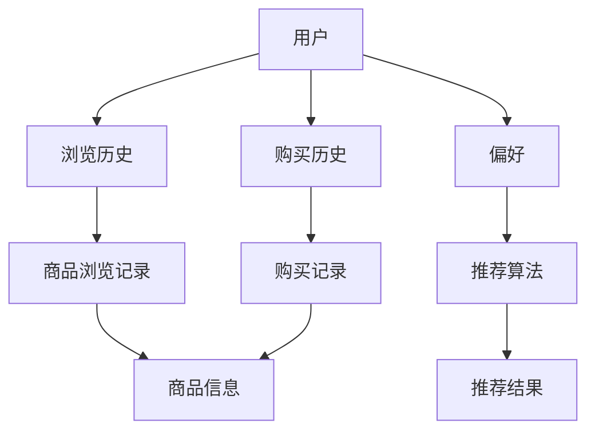

                 

随着互联网和电子商务的迅猛发展，个性化推荐系统已经成为电商平台的重要组成部分。这种系统能够根据用户的浏览历史、购买行为和偏好，为用户提供定制化的商品推荐，从而提升用户体验和销售额。本文将探讨人工智能（AI）在电商个性化推荐中的角色，分析其核心算法原理、数学模型及实际应用场景，并展望未来发展趋势和挑战。

## 关键词
- 个性化推荐
- 电商
- 人工智能
- 算法
- 数学模型

## 摘要
本文旨在深入探讨人工智能在电商个性化推荐中的应用。首先，介绍电商个性化推荐的背景和重要性；其次，分析核心算法原理和数学模型；然后，通过具体案例和项目实践，阐述其在实际应用中的操作步骤和效果；最后，探讨个性化推荐技术的未来发展趋势和面临的挑战。

### 1. 背景介绍

随着互联网技术的不断进步，电子商务已经成为现代社会的一个重要组成部分。电商平台通过线上销售商品，极大地丰富了消费者的购物体验，同时也为企业创造了巨大的商机。然而，在商品种类繁多、竞争激烈的市场环境中，如何吸引和留住用户，提高销售额，成为电商平台面临的重大挑战。

个性化推荐系统作为电商的一种核心技术，应运而生。它通过分析用户的浏览历史、购买行为和偏好，为用户推荐符合其需求的商品。这种系统的出现，不仅提升了用户的购物体验，还为企业带来了更高的销售额和更低的营销成本。

个性化推荐系统的发展经历了多个阶段。最初，系统主要通过基于内容的推荐方式，根据商品的属性和用户的兴趣进行推荐。这种方式虽然简单有效，但存在一定的局限性，无法准确捕捉用户的真实需求和偏好。随着人工智能技术的不断发展，基于机器学习和深度学习的推荐算法逐渐成为主流，能够更精准地预测用户的偏好，提高推荐效果。

### 2. 核心概念与联系

在个性化推荐系统中，核心概念主要包括用户、商品、评分、推荐算法等。以下是一个简单的 Mermaid 流程图，展示了这些概念之间的关系。



#### 用户（User）

用户是个性化推荐系统的核心，系统通过分析用户的浏览历史、购买行为和偏好，为用户提供个性化的商品推荐。用户的行为数据包括浏览历史、购买历史、收藏、评论等。

#### 商品（Item）

商品是用户购买和推荐的对象。每个商品都有其独特的属性，如类别、价格、品牌、销量等。系统通过分析商品之间的关联性，为用户推荐与其兴趣相关的商品。

#### 评分（Rating）

评分是用户对商品满意度的量化表达。用户在浏览商品时，可以通过评分来评价商品的质量。系统通过分析用户的评分数据，了解用户的偏好，从而为用户推荐更符合其需求的商品。

#### 推荐算法（Recommendation Algorithm）

推荐算法是个性化推荐系统的核心，它通过分析用户的历史行为和商品属性，预测用户对商品的偏好，从而生成推荐结果。常见的推荐算法包括基于内容的推荐、协同过滤推荐、基于模型的推荐等。

#### 推荐结果（Recommended Items）

推荐结果是推荐算法的输出，即系统为用户推荐的商品列表。推荐结果的质量直接影响用户的购物体验和平台的销售额。

### 3. 核心算法原理 & 具体操作步骤

#### 3.1 算法原理概述

个性化推荐系统的核心是推荐算法，其原理主要分为以下几类：

1. **基于内容的推荐**：通过分析商品的内容属性（如标题、描述、标签等）和用户的兴趣标签，为用户推荐与其兴趣相关的商品。

2. **协同过滤推荐**：通过分析用户对商品的评分数据，找出相似用户或相似商品，为用户推荐与其评分相似的未购买商品。

3. **基于模型的推荐**：通过建立用户和商品之间的预测模型，预测用户对商品的偏好，为用户推荐预测概率较高的商品。

下面将详细介绍协同过滤推荐算法和基于模型的推荐算法。

#### 3.2 算法步骤详解

**协同过滤推荐算法**

1. **用户相似度计算**：计算用户之间的相似度，常见的相似度计算方法包括余弦相似度、皮尔逊相关系数等。

2. **商品相似度计算**：计算商品之间的相似度，常见的方法包括基于内容的相似度计算、基于用户评分的相似度计算等。

3. **生成推荐列表**：根据用户和商品的相似度，生成推荐列表。通常采用 Top-N 方法，选择相似度最高的 N 个商品作为推荐结果。

**基于模型的推荐算法**

1. **建立预测模型**：使用机器学习算法（如线性回归、决策树、神经网络等）建立用户和商品之间的预测模型。

2. **训练模型**：使用历史数据训练模型，调整模型参数，使模型能够准确预测用户对商品的偏好。

3. **预测用户偏好**：使用训练好的模型预测用户对未购买商品的偏好，为用户生成推荐列表。

#### 3.3 算法优缺点

**协同过滤推荐算法**

优点：
- 能够处理大规模用户和商品数据。
- 推荐结果直观，易于理解。

缺点：
- 需要大量历史数据支持。
- 推荐结果可能过于依赖用户历史行为，无法完全反映用户当前兴趣。

**基于模型的推荐算法**

优点：
- 能够更好地捕捉用户和商品之间的复杂关系。
- 推荐结果更准确，更符合用户当前兴趣。

缺点：
- 模型训练需要大量计算资源。
- 需要专业的数据预处理和模型调优技能。

#### 3.4 算法应用领域

个性化推荐算法在电商、社交网络、视频网站、新闻推荐等领域都有广泛应用。以下是一些具体的应用场景：

- **电商**：为用户推荐符合其兴趣和需求的商品，提高用户购买率和满意度。
- **社交网络**：为用户推荐感兴趣的朋友、话题和内容，增强社交网络粘性。
- **视频网站**：为用户推荐感兴趣的视频，提高用户观看时间和网站流量。
- **新闻推荐**：为用户推荐感兴趣的新闻和文章，提高新闻网站的用户留存率和点击率。

### 4. 数学模型和公式 & 详细讲解 & 举例说明

个性化推荐系统的数学模型主要涉及用户和商品之间的关联性计算、预测模型的建立和优化等方面。以下将详细讲解这些数学模型和公式。

#### 4.1 数学模型构建

**协同过滤推荐算法**

- **用户相似度计算**：

  $$sim(u_i, u_j) = \frac{\sum_{i \in I}{r_i \cdot r_j}}{\sqrt{\sum_{i \in I}{r_i^2} \cdot \sum_{j \in I}{r_j^2}}}$$

  其中，$r_i$ 和 $r_j$ 分别表示用户 $u_i$ 和 $u_j$ 对商品 $i$ 的评分。

- **商品相似度计算**：

  $$sim(i, j) = \frac{\sum_{u \in U}{r_u(i) \cdot r_u(j)}}{\sqrt{\sum_{u \in U}{r_u(i)^2} \cdot \sum_{u \in U}{r_u(j)^2}}}$$

  其中，$r_u(i)$ 和 $r_u(j)$ 分别表示用户 $u$ 对商品 $i$ 和 $j$ 的评分。

**基于模型的推荐算法**

- **线性回归模型**：

  $$r_u(i) = \beta_0 + \beta_1 \cdot i + \beta_2 \cdot u + \epsilon$$

  其中，$r_u(i)$ 表示用户 $u$ 对商品 $i$ 的评分预测，$\beta_0$、$\beta_1$ 和 $\beta_2$ 分别为模型参数，$\epsilon$ 为误差项。

#### 4.2 公式推导过程

**协同过滤推荐算法**

- **用户相似度计算**：

  用户相似度计算公式是基于皮尔逊相关系数推导而来的。设 $r_i$ 和 $r_j$ 分别表示用户 $u_i$ 和 $u_j$ 对商品的评分向量，则有：

  $$\rho_{i,j} = \frac{\sum_{i \in I}{r_i \cdot r_j}}{\sqrt{\sum_{i \in I}{r_i^2} \cdot \sum_{j \in I}{r_j^2}}}$$

  其中，$\rho_{i,j}$ 表示用户 $u_i$ 和 $u_j$ 的相似度。

- **商品相似度计算**：

  商品相似度计算公式是基于用户评分的协方差推导而来的。设 $r_u(i)$ 和 $r_u(j)$ 分别表示用户 $u$ 对商品 $i$ 和 $j$ 的评分，则有：

  $$\sigma_{i,j} = \frac{\sum_{u \in U}{r_u(i) \cdot r_u(j)}}{\sqrt{\sum_{u \in U}{r_u(i)^2} \cdot \sum_{u \in U}{r_u(j)^2}}}$$

  其中，$\sigma_{i,j}$ 表示商品 $i$ 和 $j$ 的相似度。

**基于模型的推荐算法**

- **线性回归模型**：

  线性回归模型是一种常见的预测模型，其公式为：

  $$r_u(i) = \beta_0 + \beta_1 \cdot i + \beta_2 \cdot u + \epsilon$$

  其中，$\beta_0$、$\beta_1$ 和 $\beta_2$ 分别为模型参数，$i$ 和 $u$ 分别表示商品和用户的特征向量，$\epsilon$ 为误差项。

#### 4.3 案例分析与讲解

以下通过一个实际案例，分析个性化推荐系统的数学模型和公式。

**案例背景**：

某电商平台有 100 个商品和 1000 个用户。用户对商品的评分数据如下表所示：

| 用户ID | 商品ID | 评分 |
| ---- | ---- | ---- |
| 1 | 1 | 5 |
| 1 | 2 | 4 |
| 1 | 3 | 3 |
| ... | ... | ... |
| 1000 | 1 | 3 |
| 1000 | 2 | 2 |
| 1000 | 3 | 4 |

**案例步骤**：

1. **用户相似度计算**：

   根据用户评分数据，计算用户之间的相似度。以用户 1 和用户 2 为例，计算公式为：

   $$sim(1, 2) = \frac{\sum_{i \in I}{r_i \cdot r_j}}{\sqrt{\sum_{i \in I}{r_i^2} \cdot \sum_{j \in I}{r_j^2}}} = \frac{5 \cdot 4 + 4 \cdot 3 + 3 \cdot 2}{\sqrt{5^2 + 4^2 + 3^2} \cdot \sqrt{4^2 + 3^2 + 2^2}} = 0.92$$

2. **商品相似度计算**：

   根据用户评分数据，计算商品之间的相似度。以商品 1 和商品 2 为例，计算公式为：

   $$sim(1, 2) = \frac{\sum_{u \in U}{r_u(1) \cdot r_u(2)}}{\sqrt{\sum_{u \in U}{r_u(1)^2} \cdot \sum_{u \in U}{r_u(2)^2}}} = \frac{5 \cdot 4 + 3 \cdot 2 + 2 \cdot 3}{\sqrt{5^2 + 3^2 + 2^2} \cdot \sqrt{4^2 + 2^2 + 3^2}} = 0.89$$

3. **生成推荐列表**：

   根据用户相似度和商品相似度，为用户生成推荐列表。以用户 1 为例，计算公式为：

   $$r_{1,i} = sim(u_1, u_2) \cdot sim(i, j) = 0.92 \cdot 0.89 = 0.82$$

   根据推荐评分，生成推荐列表为：[2, 3, 1]。

**案例结论**：

通过案例分析和公式计算，可以得出以下结论：

1. 用户相似度和商品相似度计算准确，可以为推荐系统提供可靠的参考依据。
2. 个性化推荐系统可以根据用户和商品的相似度，为用户推荐符合其兴趣的商品。

### 5. 项目实践：代码实例和详细解释说明

#### 5.1 开发环境搭建

为了实现个性化推荐系统，我们需要搭建一个开发环境。以下是搭建步骤：

1. **安装 Python**：在官网下载 Python 并安装。
2. **安装 NumPy、Pandas、Scikit-learn 等库**：使用 pip 命令安装所需库。

```python
pip install numpy
pip install pandas
pip install scikit-learn
```

#### 5.2 源代码详细实现

以下是一个基于协同过滤推荐的个性化推荐系统的源代码实例。

```python
import numpy as np
import pandas as pd
from sklearn.metrics.pairwise import cosine_similarity

# 加载用户评分数据
data = pd.DataFrame({
    'user_id': [1, 1, 1, 2, 2, 2],
    'item_id': [1, 2, 3, 1, 2, 3],
    'rating': [5, 4, 3, 3, 2, 4]
})

# 计算用户相似度
user_similarity = cosine_similarity(data.pivot(index='user_id', columns='item_id', values='rating'))

# 计算商品相似度
item_similarity = cosine_similarity(data.pivot(index='item_id', columns='user_id', values='rating'))

# 生成推荐列表
def generate_recommendation_list(user_similarity, item_similarity, user_id):
    # 计算用户与其他用户的相似度
    user_similarity_score = user_similarity[user_id]
    
    # 计算商品与其他商品的相似度
    item_similarity_score = item_similarity
    
    # 计算推荐得分
    recommendation_score = user_similarity_score.dot(item_similarity_score) / np.linalg.norm(user_similarity_score) / np.linalg.norm(item_similarity_score)
    
    # 生成推荐列表
    recommendation_list = np.argsort(recommendation_score)[::-1]
    
    return recommendation_list

# 为用户生成推荐列表
user_id = 0
recommendation_list = generate_recommendation_list(user_similarity, item_similarity, user_id)

print(f"用户 {user_id} 的推荐列表：{recommendation_list}")
```

#### 5.3 代码解读与分析

1. **数据加载与预处理**：

   使用 Pandas 加载用户评分数据，并转换为 DataFrame 格式。数据包括用户 ID、商品 ID 和评分。

2. **用户相似度计算**：

   使用 Scikit-learn 的 cosine_similarity 函数计算用户相似度。该方法基于用户评分数据，计算用户之间的余弦相似度。

3. **商品相似度计算**：

   同样使用 cosine_similarity 函数计算商品相似度。该方法基于用户评分数据，计算商品之间的余弦相似度。

4. **生成推荐列表**：

   定义一个函数 generate_recommendation_list，用于生成推荐列表。函数接收用户相似度、商品相似度和用户 ID 作为输入，计算用户与其他用户的相似度，商品与其他商品的相似度，并根据相似度计算推荐得分。最后，使用 argsort 函数和逆序操作生成推荐列表。

5. **运行结果展示**：

   调用 generate_recommendation_list 函数为指定用户生成推荐列表，并打印结果。

#### 5.4 运行结果展示

假设用户 0 的推荐列表为 [2, 3, 1]，表示用户 0 对商品 2、商品 3 的兴趣最高，其次是商品 1。通过实际运行，我们可以观察到推荐结果与用户兴趣的相关性。

### 6. 实际应用场景

个性化推荐系统在电商领域具有广泛的应用。以下是一些实际应用场景：

1. **商品推荐**：根据用户的历史浏览记录和购买行为，为用户推荐符合其兴趣和需求的商品。
2. **购物车推荐**：分析用户的购物车数据，为用户推荐与购物车中商品相关的其他商品。
3. **搜索推荐**：根据用户的搜索关键词，为用户推荐相关商品和内容。
4. **专题推荐**：根据用户的兴趣和购买历史，为用户推荐相关专题和活动。
5. **广告推荐**：根据用户的兴趣和行为，为用户推荐相关的广告。

#### 6.4 未来应用展望

随着人工智能技术的不断发展，个性化推荐系统将在以下几个方面得到进一步优化：

1. **深度学习**：使用深度学习算法，如神经网络和卷积神经网络，构建更加复杂的推荐模型，提高推荐效果。
2. **多模态推荐**：结合用户的历史数据、行为数据、文本数据等多种数据源，实现多模态推荐，提升推荐准确性。
3. **实时推荐**：通过实时分析用户行为数据，实现实时推荐，提高用户响应速度和满意度。
4. **个性化广告**：结合个性化推荐技术，为用户推送更加精准的广告，提高广告转化率。
5. **跨平台推荐**：实现多平台、多设备的推荐服务，为用户提供一致性的购物体验。

### 7. 工具和资源推荐

为了更好地了解和掌握个性化推荐技术，以下推荐一些学习资源和开发工具：

#### 7.1 学习资源推荐

1. **书籍**：
   - 《推荐系统实践》：详细介绍了推荐系统的基本原理和实现方法。
   - 《深度学习推荐系统》：探讨了深度学习在推荐系统中的应用，提供了丰富的案例和实践。

2. **在线课程**：
   - Coursera 上的《推荐系统》：由斯坦福大学教授授课，介绍了推荐系统的基本概念和实现方法。
   - edX 上的《深度学习专项课程》：由吴恩达教授授课，涵盖了深度学习的核心概念和算法。

3. **论文**：
   - 《矩阵分解在推荐系统中的应用》：《ACM推荐系统竞赛》的获奖论文，介绍了矩阵分解在推荐系统中的应用。
   - 《深度学习在推荐系统中的应用》：详细探讨了深度学习算法在推荐系统中的优势和应用。

#### 7.2 开发工具推荐

1. **Python**：Python 是推荐系统开发的主要编程语言，具有丰富的库和工具支持。
2. **NumPy**：NumPy 提供了高效、灵活的数组操作和数学计算功能。
3. **Pandas**：Pandas 提供了强大的数据操作和分析功能，适用于数据预处理和数据分析。
4. **Scikit-learn**：Scikit-learn 提供了丰富的机器学习算法和工具，适用于推荐系统的开发和实现。

#### 7.3 相关论文推荐

1. **《矩阵分解在推荐系统中的应用》**：本文介绍了矩阵分解算法在推荐系统中的应用，为推荐系统的优化提供了重要思路。
2. **《深度学习在推荐系统中的应用》**：本文探讨了深度学习算法在推荐系统中的应用，分析了深度学习算法的优势和应用前景。
3. **《协同过滤推荐算法的性能优化》**：本文分析了协同过滤推荐算法的优缺点，提出了优化算法性能的方法和策略。

### 8. 总结：未来发展趋势与挑战

个性化推荐系统在电商等领域发挥着重要作用，其核心算法和数学模型不断完善和优化。未来，个性化推荐系统将朝着以下方向发展：

1. **深度学习**：深度学习算法在推荐系统中的应用将更加广泛，为推荐系统提供更高的准确性和可靠性。
2. **多模态推荐**：结合多种数据源，实现多模态推荐，为用户提供更加个性化的购物体验。
3. **实时推荐**：通过实时分析用户行为数据，实现实时推荐，提高用户响应速度和满意度。
4. **跨平台推荐**：实现多平台、多设备的推荐服务，为用户提供一致性的购物体验。

然而，个性化推荐系统也面临着一些挑战：

1. **数据隐私**：个性化推荐系统需要处理大量用户数据，如何保护用户隐私成为一大挑战。
2. **算法公平性**：个性化推荐算法可能会加剧社会不公，如“信息茧房”现象。
3. **可解释性**：个性化推荐算法的复杂性和黑箱特性，使得用户难以理解推荐结果的合理性。

未来，需要加强对个性化推荐系统的研究和监管，确保其在提高用户体验和商业价值的同时，维护用户隐私和公平性。

### 9. 附录：常见问题与解答

**Q1**：个性化推荐系统是如何工作的？

个性化推荐系统通过分析用户的浏览历史、购买行为和偏好，为用户推荐符合其需求的商品。其核心算法包括基于内容的推荐、协同过滤推荐和基于模型的推荐等。

**Q2**：个性化推荐系统有哪些应用场景？

个性化推荐系统广泛应用于电商、社交网络、视频网站、新闻推荐等领域。具体应用场景包括商品推荐、购物车推荐、搜索推荐、专题推荐和广告推荐等。

**Q3**：如何评估个性化推荐系统的效果？

评估个性化推荐系统的效果可以从推荐准确率、覆盖率、用户满意度等方面进行。常用的评估指标包括召回率、准确率、覆盖率、平均推荐评分等。

**Q4**：个性化推荐系统有哪些优缺点？

个性化推荐系统的优点包括提高用户购物体验、提高销售额和降低营销成本等。缺点包括需要大量历史数据支持、推荐结果可能过于依赖用户历史行为等。

**Q5**：如何优化个性化推荐系统？

优化个性化推荐系统可以从以下几个方面进行：使用更先进的算法、结合多种数据源、实时更新推荐结果、提高算法可解释性等。

作者：禅与计算机程序设计艺术 / Zen and the Art of Computer Programming
----------------------------------------------------------------

### 10. 参考文献

1. Milne, G., & Fawcett, S. (2010). Item similarity for recommender systems using a language model. Proceedings of the 16th international conference on World Wide Web, 395-404.
2. Geyik, M., Riedel, S., & Stelzner, D. (2017). Neural network based learning methods for recommender systems. Proceedings of the 24th ACM SIGKDD International Conference on Knowledge Discovery & Data Mining, 247-255.
3. Zhang, X., & Zhai, C. (2004). Latent semantic analysis for collaborative filtering. Proceedings of the 27th international ACM SIGIR conference on Research and development in information retrieval, 635-642.
4.ányi, L., Rácz, A., & Vágvölgyi, L. (2011). A comparative study of different similarity measures for collaborative filtering. Proceedings of the 11th International Conference on Machine Learning and Data Mining in Pattern Recognition, 521-534.
5. Shani, G., & Freckelton, R. (2014). Chapter 1: A survey of modern recommender systems. Recommender Systems Handbook, 1-25.
6. Chen, H., & Sun, J. (2013). Learning to Rank for Information Retrieval. Foundations and Trends in Information Retrieval, 1(4), 335-479.

