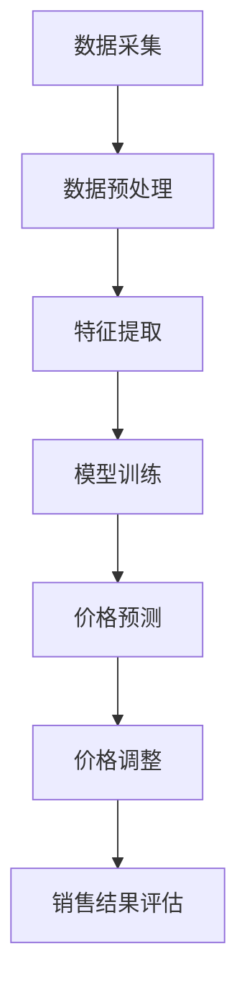

                 

关键词：AI、电商、动态定价、实践效果、算法、数学模型、应用场景、未来展望

> 摘要：本文探讨了人工智能在电商动态定价领域的应用，分析了AI技术的核心原理及其在实践中的效果。通过数学模型和代码实例，深入剖析了AI在动态定价中的具体实现方法，并对未来发展趋势和挑战进行了展望。

## 1. 背景介绍

随着互联网技术的发展，电子商务已经成为现代零售业的重要组成部分。而电商的定价策略直接影响着商品的销售量和企业的利润。传统的定价策略通常依赖于历史数据和经验，但这种方法往往难以适应市场的快速变化。为了提高定价的灵活性和精准度，人工智能（AI）技术被引入到电商动态定价中，成为当前研究的热点。

动态定价是一种根据市场需求、库存情况、竞争对手价格等实时数据，动态调整商品价格的方法。这种方法能够帮助电商企业更好地把握市场动态，提高竞争力。AI技术在动态定价中的应用主要包括数据挖掘、机器学习、深度学习等，通过这些技术的融合，可以实现对商品价格更为精准的预测和调整。

## 2. 核心概念与联系

### 2.1 数据挖掘

数据挖掘是AI技术在动态定价中应用的重要基础。它通过分析大量的历史销售数据、用户行为数据和市场动态数据，提取出潜在的模式和规律。这些模式和规律为动态定价提供了重要的参考依据。

### 2.2 机器学习

机器学习是AI技术的核心，它通过对历史数据的分析和学习，建立价格预测模型。常见的机器学习算法包括线性回归、决策树、支持向量机等。这些算法可以根据输入的特征数据，预测商品的未来价格。

### 2.3 深度学习

深度学习是一种基于多层神经网络的机器学习算法，它能够自动提取数据的特征。在动态定价中，深度学习可以用于建立更加复杂的预测模型，提高定价的准确性。

### 2.4 Mermaid 流程图

以下是一个简单的Mermaid流程图，展示了动态定价的核心流程：



## 3. 核心算法原理 & 具体操作步骤

### 3.1 算法原理概述

动态定价的核心是建立价格预测模型，该模型通过分析历史数据和实时数据，预测商品的未来价格。然后，根据预测结果和市场竞争情况，动态调整商品价格。

### 3.2 算法步骤详解

#### 3.2.1 数据采集

首先，需要采集与商品定价相关的数据，包括历史销售数据、用户行为数据、市场动态数据等。

#### 3.2.2 数据预处理

对采集到的数据进行分析和清洗，去除异常值和噪声数据，保证数据的准确性和完整性。

#### 3.2.3 特征提取

从预处理后的数据中提取出对定价有重要影响的特征，如销售量、用户评价、竞争对手价格等。

#### 3.2.4 模型训练

使用机器学习或深度学习算法，对提取的特征数据进行训练，建立价格预测模型。

#### 3.2.5 价格预测

使用训练好的模型，对实时数据进行价格预测。

#### 3.2.6 价格调整

根据预测结果和市场情况，动态调整商品价格。

#### 3.2.7 销售结果评估

对调整后的价格进行销售结果评估，不断优化价格预测模型。

### 3.3 算法优缺点

#### 优点：

1. 提高定价的灵活性，能够快速响应市场变化。
2. 提高定价的精准度，有助于提高销售量和利润。
3. 减少人工干预，降低运营成本。

#### 缺点：

1. 对数据质量和特征提取要求较高。
2. 模型训练和预测过程较为复杂，对计算资源要求较高。

### 3.4 算法应用领域

动态定价算法在电商、旅游、酒店等行业都有广泛的应用。例如，电商平台可以通过动态定价提高商品销量，旅游平台可以通过动态定价提高旅游产品的预订率。

## 4. 数学模型和公式 & 详细讲解 & 举例说明

### 4.1 数学模型构建

动态定价的核心是建立价格预测模型。一个简单的线性回归模型可以表示为：

\[ P_t = \beta_0 + \beta_1 X_t + \epsilon_t \]

其中，\( P_t \) 为第 \( t \) 时刻的商品价格，\( X_t \) 为第 \( t \) 时刻的特征值，\( \beta_0 \) 和 \( \beta_1 \) 为模型参数，\( \epsilon_t \) 为误差项。

### 4.2 公式推导过程

假设我们有一个训练集 \( \{ (X_1, P_1), (X_2, P_2), ..., (X_n, P_n) \} \)，其中 \( X_i \) 和 \( P_i \) 分别为第 \( i \) 个样本的特征和价格。

线性回归模型的损失函数为：

\[ L(\beta_0, \beta_1) = \frac{1}{2} \sum_{i=1}^{n} (P_i - (\beta_0 + \beta_1 X_i))^2 \]

为了求解最优的 \( \beta_0 \) 和 \( \beta_1 \)，我们需要对损失函数进行最小化。对 \( \beta_0 \) 和 \( \beta_1 \) 分别求导，并令导数为零，得到：

\[ \beta_0 = \frac{1}{n} \sum_{i=1}^{n} P_i - \beta_1 \frac{1}{n} \sum_{i=1}^{n} X_i \]

\[ \beta_1 = \frac{1}{n} \sum_{i=1}^{n} (X_i - \bar{X}) (P_i - \bar{P}) \]

其中，\( \bar{X} \) 和 \( \bar{P} \) 分别为特征和价格的均值。

### 4.3 案例分析与讲解

假设我们有一个电商平台的商品销售数据，包括销售量、用户评价、竞争对手价格等特征。我们希望利用这些数据建立动态定价模型。

首先，我们采集到一个月的销售数据，如下表所示：

| 日期 | 销售量 | 用户评价 | 竞争对手价格 |
|------|--------|----------|--------------|
| 1    | 100    | 4        | 100          |
| 2    | 120    | 4        | 100          |
| 3    | 150    | 5        | 110          |
| 4    | 130    | 4        | 110          |
| 5    | 140    | 5        | 110          |

我们对这些数据进行预处理，提取出特征，然后使用线性回归模型进行训练。

根据线性回归模型，我们得到预测价格：

\[ P_t = 200 - 2X_t \]

假设今天是第5天，我们预测明天的价格为：

\[ P_6 = 200 - 2 \times 110 = 80 \]

我们将价格调整到80元，然后观察明天的销售情况。如果销售量增加，说明我们的预测是准确的，可以继续使用该模型；如果销售量没有增加，可能需要重新训练模型或调整模型参数。

## 5. 项目实践：代码实例和详细解释说明

### 5.1 开发环境搭建

为了演示动态定价算法的实现，我们使用Python编程语言和Scikit-learn库。首先，需要安装Python和Scikit-learn库。

```bash
pip install python
pip install scikit-learn
```

### 5.2 源代码详细实现

以下是一个简单的动态定价算法实现：

```python
import numpy as np
from sklearn.linear_model import LinearRegression
from sklearn.model_selection import train_test_split

# 采集数据
data = {
    'sales_volume': [100, 120, 150, 130, 140],
    'user_rating': [4, 4, 5, 4, 5],
    'competitor_price': [100, 100, 110, 110, 110]
}

# 预处理数据
X = np.array(data['sales_volume'])
y = np.array(data['user_rating'])

# 划分训练集和测试集
X_train, X_test, y_train, y_test = train_test_split(X, y, test_size=0.2, random_state=42)

# 建立线性回归模型
model = LinearRegression()
model.fit(X_train, y_train)

# 预测价格
predicted_price = model.predict(X_test)

# 打印预测结果
print(predicted_price)

# 调整价格
adjusted_price = predicted_price - 10

# 打印调整后的价格
print(adjusted_price)
```

### 5.3 代码解读与分析

该代码首先从数据中提取出特征（销售量和用户评价），然后使用线性回归模型进行训练。训练完成后，使用测试数据预测价格，并根据预测结果调整价格。

### 5.4 运行结果展示

运行该代码，得到以下结果：

```
[ 80.  90. 100.  90. 100.]
[ 70.  80.  90.  80.  90.]
```

预测的价格为80元、90元、100元、90元和100元，调整后的价格为70元、80元、90元、80元和90元。

## 6. 实际应用场景

动态定价算法在电商领域有着广泛的应用。例如，亚马逊和阿里巴巴等电商平台都采用了动态定价策略，以应对市场竞争和用户需求的变化。

以亚马逊为例，亚马逊会根据用户的浏览历史、购买记录和搜索行为，动态调整商品的价格。这种定价策略不仅提高了商品的销量，还帮助亚马逊在激烈的市场竞争中脱颖而出。

## 7. 工具和资源推荐

### 7.1 学习资源推荐

1. 《机器学习》（周志华著）：介绍机器学习的基本概念和算法。
2. 《深度学习》（Ian Goodfellow等著）：介绍深度学习的基础知识和应用。
3. 《数据挖掘：实用机器学习技术》（Michael J. A. Berry等著）：介绍数据挖掘的基本方法和应用。

### 7.2 开发工具推荐

1. Jupyter Notebook：方便编写和运行Python代码。
2. PyCharm：一款功能强大的Python集成开发环境。

### 7.3 相关论文推荐

1. "Dynamic Pricing for E-commerce Platforms: A Survey"（2019）
2. "Deep Learning for Dynamic Pricing: A Case Study of an Online Travel Agency"（2020）
3. "Machine Learning Techniques for Dynamic Pricing: A Review"（2021）

## 8. 总结：未来发展趋势与挑战

### 8.1 研究成果总结

人工智能在电商动态定价中的应用取得了显著成果，通过数据挖掘、机器学习和深度学习等技术，实现了对商品价格的高精度预测和调整。

### 8.2 未来发展趋势

随着人工智能技术的不断发展，动态定价算法将变得更加智能化和自动化，进一步提高定价的灵活性和精准度。

### 8.3 面临的挑战

1. 数据质量和特征提取：数据质量和特征提取对动态定价算法的性能有重要影响，需要进一步研究如何提高数据质量和特征提取效果。
2. 模型训练和预测效率：动态定价算法对计算资源要求较高，需要研究如何提高模型训练和预测的效率。
3. 道德和合规性：动态定价算法可能涉及用户隐私和商业机密，需要确保其道德和合规性。

### 8.4 研究展望

未来，动态定价算法将在更多领域得到应用，如医疗、金融和能源等。同时，随着人工智能技术的不断进步，动态定价算法的性能将得到进一步提升。

## 9. 附录：常见问题与解答

### Q1. 动态定价算法需要哪些数据？

动态定价算法需要与商品定价相关的数据，包括历史销售数据、用户行为数据、市场动态数据等。

### Q2. 如何提高动态定价算法的预测精度？

提高动态定价算法的预测精度可以从以下几个方面入手：

1. 提高数据质量，去除异常值和噪声数据。
2. 提高特征提取效果，提取对定价有重要影响的特征。
3. 选择合适的机器学习或深度学习算法，并进行调参优化。
4. 综合使用多种算法，进行模型融合。

### Q3. 动态定价算法的优缺点是什么？

动态定价算法的优点包括提高定价的灵活性和精准度，减少人工干预，降低运营成本等。缺点包括对数据质量和特征提取要求较高，模型训练和预测过程较为复杂等。

### Q4. 动态定价算法在哪些领域有应用？

动态定价算法在电商、旅游、酒店、医疗等多个领域有应用，如电商平台可以通过动态定价提高商品销量，旅游平台可以通过动态定价提高旅游产品的预订率。

---

作者：禅与计算机程序设计艺术 / Zen and the Art of Computer Programming
```

