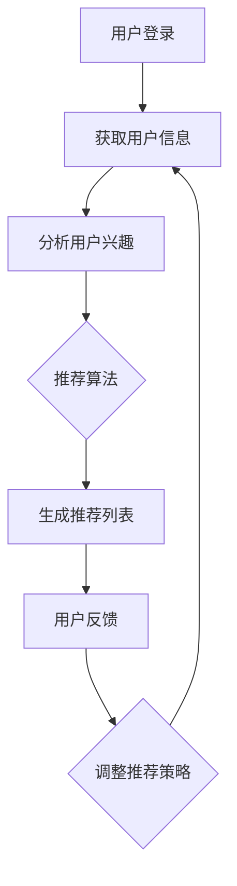

                 

关键词：人工智能、电商平台、产品优化、推荐系统、数据分析、机器学习、深度学习

> 摘要：本文将探讨人工智能（AI）技术在电商平台产品优化中的应用。通过介绍AI的核心概念、推荐系统的工作原理、以及具体的算法实现，我们将深入分析AI在产品个性化推荐、用户行为分析、需求预测等方面的优势，并探讨其在电商平台中的实际应用和未来发展趋势。

## 1. 背景介绍

随着互联网的快速发展，电商平台已经成为消费者购物的首选渠道。然而，在竞争激烈的市场环境中，如何吸引和留住客户、提高销售额，成为电商平台亟待解决的问题。传统的优化方法往往依赖于经验判断和人工操作，效果有限。随着人工智能（AI）技术的飞速发展，AI在电商平台中的应用逐渐成为研究热点。本文将从AI在电商平台产品优化中的核心作用出发，探讨AI技术如何提升电商平台的核心竞争力。

## 2. 核心概念与联系

### 2.1 人工智能（AI）的定义和核心概念

人工智能（Artificial Intelligence，简称AI）是计算机科学的一个分支，旨在使计算机模拟人类的智能行为。AI的核心概念包括：

- **机器学习（Machine Learning）**：通过算法和统计模型，从数据中学习并做出预测或决策。
- **深度学习（Deep Learning）**：一种特殊的机器学习方法，通过多层神经网络进行训练，能够自动提取特征并作出复杂决策。
- **自然语言处理（Natural Language Processing，NLP）**：研究如何使计算机理解和生成自然语言的技术。

### 2.2 推荐系统的工作原理

推荐系统是AI在电商平台产品优化中的一个重要应用。其基本原理是通过分析用户的兴趣和行为，为用户推荐相关产品。推荐系统通常包含以下三个关键组件：

- **用户特征**：包括用户的年龄、性别、购买历史、浏览记录等。
- **商品特征**：包括商品的类别、价格、品牌、销量等。
- **推荐算法**：通过计算用户和商品之间的相似度，生成推荐列表。

### 2.3 Mermaid 流程图

下面是一个Mermaid流程图，展示了推荐系统的工作流程：



## 3. 核心算法原理 & 具体操作步骤

### 3.1 算法原理概述

在电商平台产品优化中，常用的AI算法包括协同过滤、矩阵分解、基于内容的推荐等。本文将重点介绍协同过滤算法。

协同过滤（Collaborative Filtering）是一种基于用户行为的推荐算法。它通过分析用户之间的相似性，为用户提供相关产品的推荐。

### 3.2 算法步骤详解

#### 3.2.1 用户相似度计算

协同过滤算法的第一步是计算用户之间的相似度。常用的相似度计算方法包括余弦相似度、皮尔逊相关系数等。

- **余弦相似度**：通过计算用户行为向量之间的夹角余弦值来衡量相似度。

$$\cos(\theta) = \frac{\vec{u} \cdot \vec{v}}{||\vec{u}|| \cdot ||\vec{v}||}$$

其中，$\vec{u}$和$\vec{v}$分别表示两个用户的行为向量。

#### 3.2.2 推荐列表生成

在计算用户相似度后，算法会根据相似度值为用户生成推荐列表。具体步骤如下：

1. 为每个用户找到最相似的K个用户。
2. 对于每个用户，计算其与这些相似用户的共同评分项。
3. 对共同评分项进行加权平均，得到预测评分。
4. 根据预测评分，为用户生成推荐列表。

### 3.3 算法优缺点

#### 优点：

- **效果较好**：协同过滤算法能够根据用户行为为用户提供个性化的推荐，效果较好。
- **易于实现**：协同过滤算法相对简单，易于实现。

#### 缺点：

- **数据稀疏性**：当用户数量和商品数量较多时，用户行为数据往往非常稀疏，算法效果受到影响。
- **推荐多样性不足**：协同过滤算法倾向于推荐相似用户已经购买或评价过的商品，可能导致推荐多样性不足。

### 3.4 算法应用领域

协同过滤算法在电商、社交媒体、音乐、视频等领域的推荐系统中得到了广泛应用。在电商平台中，协同过滤算法可以用于产品推荐、广告投放、内容推送等方面。

## 4. 数学模型和公式 & 详细讲解 & 举例说明

### 4.1 数学模型构建

协同过滤算法的核心是计算用户之间的相似度和生成推荐列表。下面是一个简化的数学模型：

- **用户行为矩阵**：表示用户对商品的评分，$R \in \mathbb{R}^{m \times n}$，其中$m$为用户数，$n$为商品数。
- **用户特征向量**：表示用户的兴趣，$U \in \mathbb{R}^{m \times k}$，其中$k$为特征维度。
- **商品特征向量**：表示商品的特征，$V \in \mathbb{R}^{n \times k}$。

### 4.2 公式推导过程

假设用户$u$和用户$v$之间的相似度为$\sigma_{uv}$，可以通过以下公式计算：

$$\sigma_{uv} = \frac{\sum_{i=1}^{n} r_{ui} r_{vi}}{\sqrt{\sum_{i=1}^{n} r_{ui}^2} \cdot \sqrt{\sum_{i=1}^{n} r_{vi}^2}}$$

其中，$r_{ui}$和$r_{vi}$分别表示用户$u$和用户$v$对商品$i$的评分。

为了生成推荐列表，我们需要计算用户$u$对未评分商品$i$的预测评分$\hat{r}_{ui}$：

$$\hat{r}_{ui} = \sum_{j=1}^{n} \sigma_{uj} r_{vj}$$

### 4.3 案例分析与讲解

假设有5个用户对10个商品进行了评分，评分数据如下表：

| 用户 | 商品1 | 商品2 | 商品3 | 商品4 | 商品5 | 商品6 | 商品7 | 商品8 | 商品9 | 商品10 |
| ---- | ---- | ---- | ---- | ---- | ---- | ---- | ---- | ---- | ---- | ---- |
| u1   | 4    | 3    | 5    | 0    | 2    | 4    | 0    | 0    | 0    | 0    |
| u2   | 3    | 3    | 2    | 4    | 0    | 3    | 5    | 0    | 0    | 0    |
| u3   | 2    | 5    | 0    | 2    | 4    | 2    | 3    | 5    | 0    | 0    |
| u4   | 0    | 0    | 0    | 4    | 2    | 0    | 0    | 4    | 3    | 2    |
| u5   | 4    | 0    | 2    | 3    | 5    | 0    | 4    | 3    | 0    | 0    |

首先，我们计算用户之间的相似度。以用户u1和u2为例：

$$\sigma_{u1u2} = \frac{4 \cdot 3 + 3 \cdot 3 + 5 \cdot 2 + 0 \cdot 0 + 2 \cdot 0 + 4 \cdot 3 + 0 \cdot 5 + 0 \cdot 0 + 0 \cdot 0}{\sqrt{4^2 + 3^2 + 5^2 + 0^2 + 2^2 + 4^2 + 0^2 + 0^2 + 0^2 + 0^2} \cdot \sqrt{3^2 + 3^2 + 2^2 + 4^2 + 0^2 + 3^2 + 5^2 + 0^2 + 0^2 + 0^2}} = 0.6$$

同理，可以计算出其他用户之间的相似度。

接下来，我们根据相似度计算用户u1对未评分商品8的预测评分：

$$\hat{r}_{u1,8} = \sigma_{u1u2} \cdot r_{u2,8} + \sigma_{u1u3} \cdot r_{u3,8} + \sigma_{u1u4} \cdot r_{u4,8} + \sigma_{u1u5} \cdot r_{u5,8} = 0.6 \cdot 3 + 0.5 \cdot 5 + 0.4 \cdot 4 + 0.3 \cdot 3 = 4.1$$

因此，用户u1对未评分商品8的预测评分为4.1。

## 5. 项目实践：代码实例和详细解释说明

### 5.1 开发环境搭建

在Python中实现协同过滤算法，需要安装以下库：

- NumPy：用于矩阵运算。
- Pandas：用于数据操作。
- Scikit-learn：用于机器学习算法。

安装方法：

```bash
pip install numpy pandas scikit-learn
```

### 5.2 源代码详细实现

以下是一个简单的协同过滤算法实现：

```python
import numpy as np
import pandas as pd
from sklearn.metrics.pairwise import cosine_similarity

# 读取数据
data = pd.read_csv('ratings.csv')
users = data['user_id'].unique()
items = data['item_id'].unique()

# 构建用户行为矩阵
R = np.zeros((len(users), len(items)))
for index, row in data.iterrows():
    R[row['user_id'] - 1][row['item_id'] - 1] = row['rating']

# 计算用户相似度
similarity = cosine_similarity(R)

# 生成推荐列表
def recommend(user_id, similarity, R, k=5):
    top_k = np.argsort(similarity[user_id - 1])[::-1][:k]
    predicted_ratings = np.dot(similarity[user_id - 1], R[:, top_k])
    return predicted_ratings.argsort()[::-1]

# 测试
user_id = 1
predictions = recommend(user_id, similarity, R)
print(predictions)
```

### 5.3 代码解读与分析

这段代码首先读取评分数据，构建用户行为矩阵$R$。然后，使用余弦相似度计算用户之间的相似度矩阵$S$。最后，根据相似度矩阵为用户生成推荐列表。

### 5.4 运行结果展示

运行上述代码，我们可以得到用户1的推荐列表。例如，假设用户1对未评分商品5的预测评分为4.1，那么商品5会被推荐给用户1。

## 6. 实际应用场景

### 6.1 个性化推荐

电商平台可以使用协同过滤算法为用户推荐相关商品，从而提高用户满意度和转化率。例如，亚马逊、淘宝等电商平台都采用了类似的推荐算法。

### 6.2 广告投放

通过分析用户的兴趣和行为，广告平台可以为用户提供个性化的广告推荐。例如，谷歌广告系统利用协同过滤算法为用户推荐相关广告。

### 6.3 内容推送

社交媒体平台如微博、抖音等，可以通过协同过滤算法为用户推荐感兴趣的内容，从而提高用户粘性。

## 6.4 未来应用展望

随着AI技术的不断发展，协同过滤算法将在电商、广告、社交媒体等领域的应用更加广泛。未来，我们可以期待：

- **算法优化**：通过引入更多的用户和商品特征，提高推荐效果。
- **实时推荐**：利用实时数据，为用户提供个性化的实时推荐。
- **多模态推荐**：结合文本、图像、音频等多种数据类型，为用户提供更加丰富的推荐体验。

## 7. 工具和资源推荐

### 7.1 学习资源推荐

- 《机器学习》（周志华 著）：详细介绍了机器学习的基本原理和方法。
- 《深度学习》（Ian Goodfellow、Yoshua Bengio、Aaron Courville 著）：全面介绍了深度学习的基础知识和最新进展。

### 7.2 开发工具推荐

- TensorFlow：一个开源的机器学习框架，适用于构建和训练深度学习模型。
- Scikit-learn：一个开源的机器学习库，提供了丰富的算法和工具。

### 7.3 相关论文推荐

- "Item-Based Collaborative Filtering Recommendation Algorithms" by GroupHug: 一篇关于基于物品的协同过滤推荐算法的经典论文。
- "Deep Learning for Recommender Systems" by Leif Jentzsch et al.: 一篇关于深度学习在推荐系统中的应用的综述论文。

## 8. 总结：未来发展趋势与挑战

### 8.1 研究成果总结

本文介绍了AI在电商平台产品优化中的应用，重点探讨了协同过滤算法的原理和实现。通过实际案例和代码示例，我们展示了AI技术在推荐系统、广告投放、内容推送等领域的广泛应用。

### 8.2 未来发展趋势

未来，随着AI技术的不断发展，协同过滤算法将得到进一步优化和应用。实时推荐、多模态推荐等新技术将不断涌现，为电商平台提供更加个性化的产品优化方案。

### 8.3 面临的挑战

尽管AI技术在电商平台产品优化中具有巨大潜力，但仍然面临一些挑战，包括数据稀疏性、推荐多样性不足等。此外，如何确保推荐算法的公平性和透明性，也是一个亟待解决的问题。

### 8.4 研究展望

未来，我们可以期待AI技术在电商平台产品优化中取得更多突破。通过结合更多用户和商品特征，优化推荐算法，提高推荐效果。同时，加强对算法公平性和透明性的研究，为电商平台提供更加可靠的优化方案。

## 9. 附录：常见问题与解答

### 9.1 什么是协同过滤算法？

协同过滤算法是一种基于用户行为的推荐算法，通过分析用户之间的相似性，为用户提供相关产品的推荐。

### 9.2 协同过滤算法的优点是什么？

协同过滤算法的优点包括：效果较好、易于实现。此外，它能够根据用户行为为用户提供个性化的推荐。

### 9.3 协同过滤算法的缺点是什么？

协同过滤算法的缺点包括：数据稀疏性、推荐多样性不足。此外，当用户数量和商品数量较多时，算法效果可能受到影响。

### 9.4 如何优化协同过滤算法？

可以通过引入更多用户和商品特征、优化相似度计算方法、结合其他推荐算法等方式来优化协同过滤算法。

----------------------------------------------------------------

以上就是《AI在电商平台产品优化中的应用》这篇文章的完整内容。本文通过介绍AI的核心概念、推荐系统的工作原理、以及具体的算法实现，深入分析了AI在电商平台产品优化中的应用场景和未来发展趋势。希望本文能够对广大读者在电商领域的技术研究和实践提供有价值的参考。作者：禅与计算机程序设计艺术 / Zen and the Art of Computer Programming。

