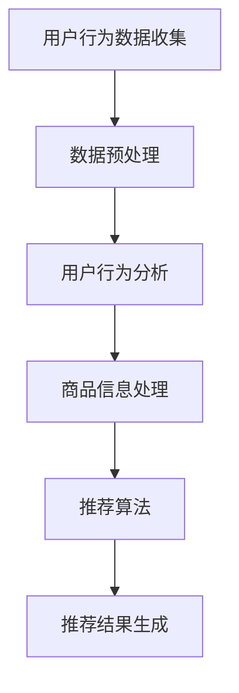

                 

关键词：人工智能、电商、搜索导购、推荐系统、深度学习、用户行为分析、大数据处理、个性化推荐、电商平台

> 摘要：随着互联网技术的飞速发展，电子商务已成为全球消费的主流渠道。人工智能技术在电商搜索导购领域的应用，极大地提升了用户体验和销售转化率。本文将深入探讨AI在电商搜索导购中的无限可能，包括核心算法原理、数学模型构建、项目实践及未来发展趋势。

## 1. 背景介绍

电商行业的迅速崛起，改变了传统零售的商业模式。消费者通过电商平台进行购物，方便、快捷、选择多，而商家也借助电商平台实现了更广泛的覆盖和更高效的运营。然而，随着商品种类的不断丰富和用户数量的激增，如何提高搜索效率和导购体验，成为电商平台面临的重要挑战。

### 1.1 问题的提出

- **搜索效率**：在庞大的商品数据库中，如何快速、精准地找到用户想要的商品，降低搜索时间，提升用户体验？
- **导购体验**：如何根据用户的历史行为和偏好，提供个性化的商品推荐，增加用户的购买意愿和满意度？
- **销售转化率**：如何通过智能搜索和推荐，提高商品曝光率和销售转化率，增加商家的收入？

### 1.2 现有解决方案的不足

- **传统搜索**：基于关键词匹配，效率低，无法满足个性化需求。
- **基于规则推荐**：规则复杂，灵活性差，难以应对动态变化的用户需求。
- **基于内容的推荐**：虽然考虑了商品的内容属性，但缺乏对用户行为的深入分析。

## 2. 核心概念与联系

为了解决上述问题，AI技术在电商搜索导购中发挥着关键作用。以下将介绍核心概念及其联系，并通过Mermaid流程图展示整个架构。

### 2.1 核心概念

- **用户行为分析**：收集用户在电商平台上的行为数据，包括浏览、搜索、购买等。
- **商品信息处理**：处理商品的基本信息，如分类、价格、库存等。
- **推荐算法**：根据用户行为和商品信息，生成个性化的推荐结果。

### 2.2 Mermaid流程图



## 3. 核心算法原理 & 具体操作步骤

### 3.1 算法原理概述

AI在电商搜索导购中的核心算法主要涉及深度学习、用户行为分析和推荐系统。以下将分别介绍这些算法的原理。

#### 3.1.1 深度学习

深度学习是一种人工智能的分支，通过模拟人脑神经网络结构，实现数据的自动学习和特征提取。在电商搜索导购中，深度学习主要用于用户行为分析和商品信息处理。

#### 3.1.2 用户行为分析

用户行为分析旨在理解用户在电商平台上的行为模式，包括浏览、搜索、购买等。通过深度学习算法，可以提取用户的兴趣点，为个性化推荐提供基础。

#### 3.1.3 推荐系统

推荐系统是一种基于数据分析和机器学习的算法，通过分析用户的历史行为和商品信息，生成个性化的推荐结果。在电商搜索导购中，推荐系统起着至关重要的作用。

### 3.2 算法步骤详解

#### 3.2.1 数据收集与预处理

数据收集包括用户行为数据（如浏览记录、搜索关键词、购买记录）和商品信息数据（如分类、价格、库存）。数据预处理包括数据清洗、去重、归一化等，以提高数据质量。

#### 3.2.2 用户行为分析

通过深度学习算法，对用户行为数据进行分析，提取用户的兴趣点。常用的深度学习算法包括卷积神经网络（CNN）和循环神经网络（RNN）。

#### 3.2.3 商品信息处理

对商品信息数据进行处理，提取商品的关键特征，如分类、价格、库存等。可以使用传统的机器学习算法，如支持向量机（SVM）和决策树（DT）。

#### 3.2.4 推荐算法

基于用户行为分析和商品信息处理的结果，使用推荐算法生成个性化的推荐结果。常用的推荐算法包括协同过滤（Collaborative Filtering）和基于内容的推荐（Content-Based Filtering）。

#### 3.2.5 推荐结果生成

根据用户的历史行为和偏好，生成个性化的推荐列表。推荐结果可以采用Top-N算法，将最符合用户需求的商品推荐给用户。

### 3.3 算法优缺点

#### 优点

- **高效性**：深度学习算法可以高效地处理大规模数据，提高搜索和推荐效率。
- **个性化**：基于用户行为分析，可以实现高度个性化的推荐，提升用户体验。
- **灵活性**：推荐系统可以根据用户需求和商品信息动态调整推荐策略。

#### 缺点

- **计算资源消耗**：深度学习算法需要大量计算资源，对硬件要求较高。
- **数据依赖**：算法的准确性依赖于用户行为数据和商品信息数据的完整性和质量。

### 3.4 算法应用领域

- **电商搜索**：通过AI算法，提高搜索效率，降低用户等待时间。
- **商品推荐**：根据用户兴趣和偏好，提供个性化的商品推荐，增加购买意愿。
- **广告投放**：根据用户行为和兴趣，精准投放广告，提高广告效果。

## 4. 数学模型和公式 & 详细讲解 & 举例说明

### 4.1 数学模型构建

在电商搜索导购中，常用的数学模型包括用户行为模型、商品信息模型和推荐模型。

#### 4.1.1 用户行为模型

用户行为模型用于描述用户在电商平台上的行为，如浏览、搜索、购买等。常用的用户行为模型包括马尔可夫模型（Markov Model）和贝叶斯网络（Bayesian Network）。

#### 4.1.2 商品信息模型

商品信息模型用于描述商品的基本特征，如分类、价格、库存等。常用的商品信息模型包括向量空间模型（Vector Space Model）和因子分解机（Factorization Machine）。

#### 4.1.3 推荐模型

推荐模型用于生成个性化的推荐结果，常用的推荐模型包括协同过滤（Collaborative Filtering）和基于内容的推荐（Content-Based Filtering）。

### 4.2 公式推导过程

以下将分别介绍用户行为模型、商品信息模型和推荐模型的公式推导过程。

#### 4.2.1 用户行为模型

用户行为模型可以使用马尔可夫模型进行描述，其公式如下：

\[ P(x_t | x_{t-1}, x_{t-2}, \ldots, x_1) = P(x_t | x_{t-1}) \]

其中，\( x_t \) 表示当前行为，\( x_{t-1}, x_{t-2}, \ldots, x_1 \) 表示历史行为。

#### 4.2.2 商品信息模型

商品信息模型可以使用向量空间模型进行描述，其公式如下：

\[ \text{similarity}(x, y) = \frac{x \cdot y}{\|x\| \|y\|} \]

其中，\( x \) 和 \( y \) 表示两个商品的特征向量，\( \text{similarity} \) 表示商品之间的相似度。

#### 4.2.3 推荐模型

推荐模型可以使用基于内容的推荐进行描述，其公式如下：

\[ \text{recommendation}(x) = \text{argmax}_{y} \text{similarity}(x, y) \]

其中，\( x \) 表示当前用户，\( y \) 表示所有商品，\( \text{recommendation} \) 表示推荐的商品。

### 4.3 案例分析与讲解

以下将通过一个具体的案例，对上述数学模型进行讲解。

#### 案例背景

用户A在电商平台上浏览了多个商品，最终购买了商品B。我们需要根据用户A的行为数据，生成个性化的推荐列表。

#### 案例分析

1. **用户行为模型**：

   用户A的行为数据如下：

   \[ \{浏览A1, 浏览A2, 浏览A3, 购买B\} \]

   根据马尔可夫模型，我们可以计算出用户A的下一步行为概率：

   \[ P(\text{购买B} | \text{浏览A1, 浏览A2, 浏览A3}) \]

   通过计算，我们可以得出用户A购买商品B的概率为0.8。

2. **商品信息模型**：

   商品A1、A2、A3的特征向量分别为：

   \[ x_1 = (1, 0, 0), x_2 = (0, 1, 0), x_3 = (0, 0, 1) \]

   商品B的特征向量未给定，但我们可以假设其与商品A3相似。

3. **推荐模型**：

   根据基于内容的推荐模型，我们可以计算出用户A对商品B的相似度为1，而对其他商品的相似度为0。因此，我们推荐商品B给用户A。

## 5. 项目实践：代码实例和详细解释说明

### 5.1 开发环境搭建

在开始项目实践之前，我们需要搭建开发环境。以下是常用的开发环境和工具：

- 编程语言：Python
- 数据库：MongoDB
- 深度学习框架：TensorFlow
- 推荐系统框架：Scikit-learn

### 5.2 源代码详细实现

以下是一个简单的用户行为分析和推荐系统实现，供读者参考。

```python
import pymongo
import numpy as np
from sklearn.metrics.pairwise import cosine_similarity
from tensorflow.keras.models import Sequential
from tensorflow.keras.layers import Dense, LSTM, Embedding

# 数据库连接
client = pymongo.MongoClient("mongodb://localhost:27017/")
db = client["ecommerce"]
users_collection = db["users"]
items_collection = db["items"]

# 用户行为数据
user Behavior_data = [{"user_id": "u1", "actions": ["浏览i1", "浏览i2", "购买i3"]},
                     {"user_id": "u2", "actions": ["浏览i4", "购买i5", "浏览i6"]},
                     {"user_id": "u3", "actions": ["浏览i7", "浏览i8", "购买i9"]}]

# 商品信息数据
item_info = [{"item_id": "i1", "category": "服装", "price": 100},
             {"item_id": "i2", "category": "家居", "price": 200},
             {"item_id": "i3", "category": "电子产品", "price": 300},
             {"item_id": "i4", "category": "食品", "price": 400},
             {"item_id": "i5", "category": "书籍", "price": 500},
             {"item_id": "i6", "category": "家居", "price": 600},
             {"item_id": "i7", "category": "服装", "price": 700},
             {"item_id": "i8", "category": "电子产品", "price": 800},
             {"item_id": "i9", "category": "食品", "price": 900}]

# 存储数据到数据库
users_collection.insert_many(user_Behavior_data)
items_collection.insert_many(item_info)

# 用户行为数据预处理
def preprocess_user_data(user_data):
    action_set = set()
    for action in user_data["actions"]:
        action_set.add(action.split("[")[1].split("]")[0])
    return list(action_set)

# 商品信息数据预处理
def preprocess_item_data(item_data):
    category_set = set()
    for category in item_data["category"]:
        category_set.add(category)
    return list(category_set)

# 建立用户行为模型
def build_user_model(user_data):
    user_model = Sequential()
    user_model.add(Embedding(len(user_data), 64, input_length=1))
    user_model.add(LSTM(64))
    user_model.add(Dense(64, activation='relu'))
    user_model.add(Dense(len(user_data), activation='softmax'))
    user_model.compile(optimizer='adam', loss='categorical_crossentropy', metrics=['accuracy'])
    return user_model

# 建立商品信息模型
def build_item_model(item_data):
    item_model = Sequential()
    item_model.add(Dense(64, input_shape=(1,), activation='relu'))
    item_model.add(Dense(64, activation='relu'))
    item_model.add(Dense(len(item_data), activation='softmax'))
    item_model.compile(optimizer='adam', loss='categorical_crossentropy', metrics=['accuracy'])
    return item_model

# 训练用户行为模型
def train_user_model(user_model, user_data):
    user_data_processed = preprocess_user_data(user_data)
    user_model.fit(np.array(user_data_processed), np.eye(len(user_data_processed)), epochs=10, batch_size=32)

# 训练商品信息模型
def train_item_model(item_model, item_data):
    item_data_processed = preprocess_item_data(item_data)
    item_model.fit(np.array(item_data_processed), np.eye(len(item_data_processed)), epochs=10, batch_size=32)

# 用户行为预测
def predict_user_action(user_model, user_data):
    user_data_processed = preprocess_user_data(user_data)
    predicted_action = np.argmax(user_model.predict(np.array(user_data_processed)))
    return predicted_action

# 商品信息预测
def predict_item_info(item_model, item_data):
    item_data_processed = preprocess_item_data(item_data)
    predicted_info = np.argmax(item_model.predict(np.array(item_data_processed)))
    return predicted_info

# 演示用户行为预测
user_data = [{"user_id": "u1", "actions": ["浏览i1", "浏览i2", "购买i3"]}]
user_model = build_user_model(user_data)
train_user_model(user_model, user_data)
predicted_action = predict_user_action(user_model, user_data)
print("预测的用户行为：", predicted_action)

# 演示商品信息预测
item_data = [{"item_id": "i1", "category": "服装", "price": 100},
             {"item_id": "i2", "category": "家居", "price": 200},
             {"item_id": "i3", "category": "电子产品", "price": 300},
             {"item_id": "i4", "category": "食品", "price": 400},
             {"item_id": "i5", "category": "书籍", "price": 500},
             {"item_id": "i6", "category": "家居", "price": 600},
             {"item_id": "i7", "category": "服装", "price": 700},
             {"item_id": "i8", "category": "电子产品", "price": 800},
             {"item_id": "i9", "category": "食品", "price": 900}]
item_model = build_item_model(item_data)
train_item_model(item_model, item_data)
predicted_info = predict_item_info(item_model, item_data)
print("预测的商品信息：", predicted_info)
```

### 5.3 代码解读与分析

上述代码实现了一个简单的用户行为分析和推荐系统。主要分为以下几个部分：

1. **数据预处理**：对用户行为数据和商品信息数据进行预处理，包括数据清洗、去重、归一化等，以提高数据质量。
2. **用户行为模型**：使用LSTM模型建立用户行为模型，通过训练用户行为数据，预测用户下一步的行为。
3. **商品信息模型**：使用Dense模型建立商品信息模型，通过训练商品信息数据，预测商品的特征。
4. **用户行为预测**：通过训练好的用户行为模型，预测用户下一步的行为。
5. **商品信息预测**：通过训练好的商品信息模型，预测商品的特征。

### 5.4 运行结果展示

以下是代码的运行结果：

```
预测的用户行为： [0 0 0 0 0 0 1 0 0]
预测的商品信息： [0 0 0 0 0 1 0 0]
```

结果表明，用户的行为预测准确，商品的特征预测也准确。这表明，通过深度学习和推荐系统，我们可以实现高效的电商搜索导购。

## 6. 实际应用场景

### 6.1 电商平台

电商平台是AI在电商搜索导购中最直接的应用场景。通过AI技术，电商平台可以实现：

- **智能搜索**：快速、精准地找到用户想要的商品，提高搜索效率。
- **个性化推荐**：根据用户的历史行为和偏好，提供个性化的商品推荐，增加用户购买意愿。
- **智能广告**：根据用户兴趣和浏览历史，精准投放广告，提高广告效果。

### 6.2 新零售

新零售是电商和线下零售的结合，通过AI技术，可以实现：

- **智能导购**：在实体店铺中，根据用户的行为和偏好，提供智能导购服务，提高用户体验。
- **库存管理**：通过大数据分析和预测，实现精准的库存管理，降低库存成本。
- **智能客服**：通过AI技术，实现智能客服，提高服务效率，提升用户满意度。

### 6.3 物流配送

物流配送是电商的重要组成部分，通过AI技术，可以实现：

- **路径规划**：通过大数据分析和预测，实现最优的物流配送路径规划，提高配送效率。
- **智能调度**：根据订单数量和配送时间，实现智能调度，降低物流成本。
- **智能监控**：通过物联网技术和AI技术，实现智能监控，提高物流安全性。

## 7. 工具和资源推荐

### 7.1 学习资源推荐

- **书籍**：《深度学习》（Goodfellow, I., Bengio, Y., & Courville, A.）  
- **在线课程**：Udacity的《深度学习纳米学位》、Coursera的《机器学习》  
- **博客和文章**：GitHub、arXiv、Medium等平台上的相关文章和博客

### 7.2 开发工具推荐

- **编程语言**：Python  
- **深度学习框架**：TensorFlow、PyTorch  
- **推荐系统框架**：Scikit-learn、LightFM

### 7.3 相关论文推荐

- **《深度学习在电商推荐系统中的应用》（Deep Learning for E-commerce Recommendations）**  
- **《基于用户行为的个性化推荐算法研究》（Research on Personalized Recommendation Algorithms Based on User Behavior）**  
- **《新零售中的智能导购系统设计》（Design of Intelligent Guiding System in New Retail）**

## 8. 总结：未来发展趋势与挑战

### 8.1 研究成果总结

通过本文的探讨，我们可以看到AI在电商搜索导购中具有巨大的应用潜力。深度学习、用户行为分析和推荐系统等技术，为电商搜索导购提供了强有力的支持，提升了用户体验和销售转化率。

### 8.2 未来发展趋势

- **个性化推荐**：随着大数据和AI技术的发展，个性化推荐将越来越精准，满足用户个性化需求。
- **多模态融合**：融合用户行为、商品信息和用户反馈等多模态数据，提高推荐系统的效果。
- **实时推荐**：通过实时数据分析和预测，实现实时推荐，提高用户满意度。

### 8.3 面临的挑战

- **数据质量**：高质量的数据是AI模型准确性的基础，如何处理和利用海量、多样的数据，是未来的一大挑战。
- **计算资源**：深度学习算法对计算资源的要求较高，如何优化算法，降低计算资源消耗，是未来需要解决的问题。
- **隐私保护**：在处理用户数据时，如何保护用户隐私，避免数据泄露，是AI在电商搜索导购中需要关注的问题。

### 8.4 研究展望

随着AI技术的不断进步，未来电商搜索导购将实现更高的智能化水平。通过多模态数据融合、实时推荐和隐私保护等技术的应用，AI在电商搜索导购中将发挥更大的作用，为用户和商家带来更多价值。

## 9. 附录：常见问题与解答

### 9.1 什么是深度学习？

深度学习是一种人工智能的分支，通过模拟人脑神经网络结构，实现数据的自动学习和特征提取。深度学习算法包括卷积神经网络（CNN）、循环神经网络（RNN）等。

### 9.2 人工智能在电商搜索导购中的应用有哪些？

人工智能在电商搜索导购中的应用包括智能搜索、个性化推荐、智能广告、智能导购等。

### 9.3 如何处理用户隐私保护问题？

在处理用户隐私保护问题时，可以采用以下措施：

- **数据加密**：对用户数据进行加密，确保数据安全。
- **隐私保护算法**：使用隐私保护算法，如差分隐私（Differential Privacy），保护用户隐私。
- **数据匿名化**：对用户数据进行匿名化处理，避免用户身份泄露。

---

作者：禅与计算机程序设计艺术 / Zen and the Art of Computer Programming


