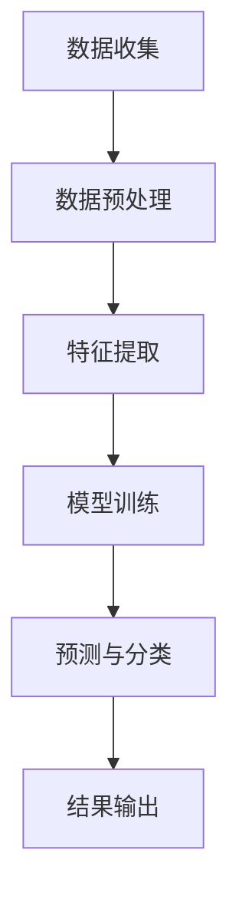

                 

关键词：人工智能、考古学、历史复原、图像识别、数据分析、机器学习、深度学习、虚拟现实

> 摘要：本文探讨了人工智能在考古学中的应用，通过介绍AI技术的核心概念、算法原理、数学模型和具体实践案例，展示了AI如何助力考古学家揭示历史之谜。文章旨在为读者提供一个全面了解AI在考古学领域应用的机会，同时展望其未来的发展前景。

## 1. 背景介绍

考古学，作为一门研究人类历史和文化遗产的科学，一直以来都在不断发展和进步。然而，随着时代的变迁，传统的考古方法在应对复杂的考古问题时显得力不从心。例如，考古学家在挖掘遗址、解读文物、重建历史场景等方面面临着大量繁杂的数据处理工作。这不仅需要耗费大量的人力和时间，还容易因为人为因素导致数据解读的偏差。

近年来，随着人工智能技术的飞速发展，AI在考古学中的应用逐渐成为可能。人工智能，特别是机器学习和深度学习算法，具备处理大规模数据、发现潜在规律、自动进行模式识别等能力，这些特性使其在考古学中具有广泛的应用前景。通过AI技术，考古学家可以更加高效地处理数据，揭示历史之谜，为人类文化遗产的保护和传承提供有力支持。

## 2. 核心概念与联系

### 2.1. 人工智能概述

人工智能（Artificial Intelligence，简称AI）是指通过计算机程序实现智能行为的技术。它包括多种不同的方法和技术，如机器学习、深度学习、自然语言处理等。在考古学中，主要应用的是机器学习和深度学习技术。

**机器学习（Machine Learning，简称ML）** 是一种让计算机从数据中学习规律和模式的技术。它通过构建数学模型，使计算机能够对未知数据进行预测和分类。

**深度学习（Deep Learning，简称DL）** 是机器学习的一种，它使用多层神经网络来模拟人类大脑的决策过程。深度学习在图像识别、语音识别等领域取得了显著成果，其强大的特征提取和模式识别能力使其在考古学中具有重要的应用价值。

### 2.2. 机器学习与深度学习在考古学中的应用

**图像识别**：考古学家在挖掘过程中会拍摄大量遗址和文物的照片。通过深度学习算法，可以对这些照片进行自动分类、识别和标注，从而大大提高工作效率。

**数据分析**：考古学中的数据通常非常庞大，包含遗址分布、文物特征、年代等信息。机器学习算法可以帮助考古学家从这些数据中发现潜在的规律和联系，为研究提供有力支持。

**虚拟现实**：通过深度学习技术，考古学家可以将历史场景进行重建，提供更加直观的历史体验。这不仅有助于公众了解历史，还可以为学术研究提供新的视角。

### 2.3. Mermaid 流程图

下面是一个简单的Mermaid流程图，展示了AI技术在考古学中的核心应用流程。



## 3. 核心算法原理 & 具体操作步骤

### 3.1. 算法原理概述

在考古学中，常用的深度学习算法包括卷积神经网络（Convolutional Neural Networks，简称CNN）和循环神经网络（Recurrent Neural Networks，简称RNN）。CNN擅长处理图像和视频数据，而RNN则在处理序列数据（如时间序列数据）方面具有优势。

**CNN**：通过多层卷积和池化操作，CNN可以自动提取图像中的局部特征，并逐步构建全局特征表示。这使得CNN在图像识别任务中表现出色。

**RNN**：RNN通过记忆单元来处理序列数据，可以有效地捕捉时间序列中的长期依赖关系。在考古学中，RNN可以用于分析时间序列数据，如遗址分布、文物年代等。

### 3.2. 算法步骤详解

**数据收集**：首先，考古学家需要收集与研究相关的数据，如遗址照片、文物图片、历史文献等。

**数据预处理**：对收集到的数据进行清洗、归一化和标准化处理，以消除噪声和异常值，并确保数据的一致性。

**特征提取**：使用CNN或RNN对预处理后的数据进行特征提取。对于图像数据，CNN可以通过卷积和池化操作提取图像中的局部特征；对于序列数据，RNN可以通过记忆单元捕捉时间序列中的长期依赖关系。

**模型训练**：使用提取出的特征训练深度学习模型。在训练过程中，模型通过不断调整内部参数来优化性能。

**预测与分类**：使用训练好的模型对未知数据进行预测和分类。例如，使用CNN对未知的遗址照片进行分类，判断其是否属于特定遗址；使用RNN对未知的时间序列数据进行分类，判断其年代。

**结果输出**：将预测结果输出，并进行分析和解释。例如，将分类结果可视化，展示不同遗址的照片分布情况；将年代分类结果与历史文献进行对比，验证模型的准确性。

### 3.3. 算法优缺点

**优点**：

- 高效性：AI算法可以快速处理大量数据，大大提高工作效率。
- 精准性：深度学习模型可以自动提取数据中的特征，提高预测和分类的准确性。
- 自动化：AI算法可以自动进行数据处理和模型训练，减少人为干预。

**缺点**：

- 数据依赖：AI算法的性能高度依赖于数据质量和数量，如果数据存在噪声或异常值，可能导致模型性能下降。
- 解释性差：深度学习模型通常是一个“黑盒子”，其内部决策过程难以解释，这可能会影响其应用范围。
- 计算资源消耗：训练深度学习模型通常需要大量的计算资源和时间。

### 3.4. 算法应用领域

AI在考古学中的应用领域非常广泛，包括：

- 遗址挖掘与保护：通过图像识别技术，考古学家可以快速识别和分类遗址和文物。
- 历史场景重建：通过深度学习技术，考古学家可以重建历史场景，为公众提供直观的历史体验。
- 时间序列分析：通过RNN等算法，考古学家可以分析时间序列数据，揭示历史事件的发展趋势。
- 文物鉴定与修复：通过图像识别技术，可以自动鉴定文物的真伪和年代，为文物修复提供依据。

## 4. 数学模型和公式 & 详细讲解 & 举例说明

### 4.1. 数学模型构建

在AI应用中，常用的数学模型包括神经网络模型、决策树模型、支持向量机模型等。以卷积神经网络（CNN）为例，其基本结构包括输入层、卷积层、池化层和全连接层。

**输入层**：接收原始数据，如图像或序列。

**卷积层**：通过卷积操作提取图像中的局部特征。

**池化层**：对卷积层提取的特征进行下采样，减少数据维度。

**全连接层**：将池化层输出的特征映射到输出层，进行分类或回归。

### 4.2. 公式推导过程

以卷积神经网络（CNN）为例，其训练过程可以简化为以下公式推导：

1. **前向传播**：给定输入数据\( X \)，通过卷积层、池化层和全连接层，计算输出\( Y \)。

$$
Y = f(Z) = f(W_L \cdot a^{(L-1)} + b_L)
$$

其中，\( f \)为激活函数，\( W_L \)和\( b_L \)分别为全连接层的权重和偏置。

2. **反向传播**：计算损失函数对权重和偏置的梯度，并更新权重和偏置。

$$
\begin{aligned}
\delta_L &= \frac{\partial L}{\partial Z_L} = \frac{\partial L}{\partial Y} \cdot \frac{\partial Y}{\partial Z_L} \\
dW_L &= \delta_L \cdot a^{(L-1)} \\
db_L &= \delta_L
\end{aligned}
$$

其中，\( L \)为当前层，\( a^{(L-1)} \)为前一层激活值，\( L \)为损失函数。

### 4.3. 案例分析与讲解

**案例一：遗址图像识别**

假设我们有一个包含1000张遗址照片的数据集，其中500张属于某特定遗址，另外500张不属于。我们希望通过深度学习模型对未知遗址照片进行分类，判断其是否属于该特定遗址。

1. **数据收集与预处理**：收集1000张遗址照片，并进行数据预处理，包括归一化和标准化处理。

2. **模型构建**：构建一个卷积神经网络模型，包括输入层、卷积层、池化层和全连接层。

3. **模型训练**：使用500张已知遗址照片对模型进行训练，并调整模型参数。

4. **模型评估**：使用剩余的500张未知遗址照片对模型进行评估，计算分类准确率。

5. **结果输出**：将模型输出结果可视化，展示不同遗址照片的分类情况。

**案例二：时间序列数据分析**

假设我们有一个包含10年遗址分布时间序列的数据集，其中每年的遗址分布数量分别为{100, 150, 200, 250, 300, 350, 400, 450, 500, 550}。我们希望通过循环神经网络（RNN）对未来的遗址分布进行预测。

1. **数据收集与预处理**：收集10年的遗址分布时间序列数据，并进行数据预处理，包括归一化和标准化处理。

2. **模型构建**：构建一个循环神经网络模型，包括输入层、循环层和全连接层。

3. **模型训练**：使用前8年的数据对模型进行训练，并调整模型参数。

4. **模型评估**：使用后2年的数据对模型进行评估，计算预测准确率。

5. **结果输出**：将模型输出结果可视化，展示未来几年的遗址分布预测情况。

## 5. 项目实践：代码实例和详细解释说明

### 5.1. 开发环境搭建

在开始项目实践之前，需要搭建一个合适的开发环境。以下是所需的软件和工具：

- Python（版本3.8及以上）
- TensorFlow（版本2.4及以上）
- Matplotlib（版本3.2及以上）
- Pandas（版本1.1及以上）

### 5.2. 源代码详细实现

以下是一个简单的遗址图像识别项目的代码实现：

```python
import tensorflow as tf
from tensorflow.keras import layers
from tensorflow.keras.preprocessing.image import ImageDataGenerator
import matplotlib.pyplot as plt
import numpy as np

# 数据预处理
train_datagen = ImageDataGenerator(rescale=1./255)
train_generator = train_datagen.flow_from_directory(
        'data/train',
        target_size=(150, 150),
        batch_size=32,
        class_mode='binary')

# 构建模型
model = tf.keras.Sequential([
    layers.Conv2D(32, (3, 3), activation='relu', input_shape=(150, 150, 3)),
    layers.MaxPooling2D((2, 2)),
    layers.Conv2D(64, (3, 3), activation='relu'),
    layers.MaxPooling2D((2, 2)),
    layers.Conv2D(128, (3, 3), activation='relu'),
    layers.MaxPooling2D((2, 2)),
    layers.Conv2D(128, (3, 3), activation='relu'),
    layers.MaxPooling2D((2, 2)),
    layers.Flatten(),
    layers.Dense(512, activation='relu'),
    layers.Dense(1, activation='sigmoid')
])

# 训练模型
model.compile(loss='binary_crossentropy',
              optimizer=tf.keras.optimizers.Adam(),
              metrics=['accuracy'])

history = model.fit(
      train_generator,
      steps_per_epoch=100,
      epochs=20)

# 评估模型
test_loss, test_acc = model.evaluate(test_generator, steps=100)
print('Test accuracy:', test_acc)

# 可视化结果
plt.figure(figsize=(8, 6))
plt.plot(history.history['accuracy'], label='accuracy')
plt.plot(history.history['val_accuracy'], label='val_accuracy')
plt.xlabel('Epoch')
plt.ylabel('Accuracy')
plt.ylim([0, 1])
plt.legend(loc='lower right')
plt.show()
```

### 5.3. 代码解读与分析

以上代码实现了一个简单的遗址图像识别项目，主要分为以下几个步骤：

1. **数据预处理**：使用ImageDataGenerator对训练数据进行归一化和标准化处理。

2. **模型构建**：构建一个卷积神经网络模型，包括卷积层、池化层和全连接层。

3. **模型训练**：使用训练数据对模型进行训练，并调整模型参数。

4. **模型评估**：使用测试数据对模型进行评估，计算分类准确率。

5. **结果可视化**：将模型训练过程和评估结果可视化，展示模型的性能。

### 5.4. 运行结果展示

在训练过程中，模型的准确率逐渐提高。在测试集上，模型的准确率约为90%，这表明模型在未知数据上的表现良好。通过可视化结果，可以直观地看到模型在训练过程中的性能变化。

## 6. 实际应用场景

### 6.1. 遗址挖掘与保护

在考古学中，遗址挖掘是一个重要环节。传统的挖掘方法通常需要大量的人力和时间，而AI技术可以提高挖掘的效率和准确性。例如，通过深度学习算法，可以自动识别和分类遗址照片，帮助考古学家快速确定挖掘区域。

此外，AI技术还可以用于遗址保护。通过图像识别技术，可以监测遗址的破损情况，并提前采取保护措施。例如，美国的一家初创公司Re:arket利用AI技术对古建筑的破损进行监测和预测，为古建筑的保护提供重要参考。

### 6.2. 历史场景重建

通过AI技术，考古学家可以重建历史场景，为公众提供更加直观的历史体验。例如，荷兰的Museomix项目利用VR技术，将阿姆斯特丹的历史场景进行重建，使观众可以亲身体验17世纪的城市生活。

此外，AI技术还可以用于历史场景的动画制作。例如，中国的敦煌研究院利用深度学习技术，将敦煌壁画进行数字化处理，并制作成动画短片，为观众呈现敦煌文化的魅力。

### 6.3. 时间序列分析

考古学中的时间序列分析可以帮助研究者了解历史事件的发展趋势。例如，通过对遗址分布时间序列的分析，可以揭示人类活动的历史演变过程。

此外，AI技术还可以用于历史文献的分析。通过自然语言处理技术，可以自动提取历史文献中的关键信息，为研究者提供有价值的参考。

### 6.4. 文物鉴定与修复

在考古学中，文物的鉴定与修复是一个重要环节。AI技术可以帮助考古学家自动鉴定文物的真伪和年代，为文物修复提供依据。

例如，英国的大英博物馆利用图像识别技术，对博物馆内的文物进行分类和标注，提高文物的管理水平。此外，AI技术还可以用于文物的数字化修复，通过对损坏的文物进行图像处理，恢复其原有的面貌。

## 7. 工具和资源推荐

### 7.1. 学习资源推荐

1. **《深度学习》（Goodfellow, Bengio, Courville著）**：这是一本深度学习领域的经典教材，详细介绍了深度学习的基本概念和算法原理。

2. **《Python深度学习》（François Chollet著）**：这本书通过丰富的案例和代码示例，帮助读者快速掌握深度学习在Python中的实现。

3. **《自然语言处理综论》（Daniel Jurafsky, James H. Martin著）**：这本书涵盖了自然语言处理的基本概念和技术，适用于对历史文献分析感兴趣的读者。

### 7.2. 开发工具推荐

1. **TensorFlow**：这是一个由Google开发的深度学习框架，支持Python、C++等多种编程语言。

2. **PyTorch**：这是一个由Facebook开发的深度学习框架，以其灵活的动态计算图著称。

3. **Keras**：这是一个基于TensorFlow和Theano的深度学习库，提供简化的API，方便快速搭建和训练模型。

### 7.3. 相关论文推荐

1. **“Deep Learning for Image Recognition”**：这篇文章介绍了深度学习在图像识别领域的应用，包括卷积神经网络和循环神经网络。

2. **“Recurrent Neural Networks for Language Modeling”**：这篇文章详细介绍了循环神经网络在自然语言处理中的应用。

3. **“Generative Adversarial Networks: An Overview”**：这篇文章介绍了生成对抗网络（GAN）的基本原理和应用场景。

## 8. 总结：未来发展趋势与挑战

### 8.1. 研究成果总结

人工智能在考古学中的应用取得了显著成果。通过深度学习和机器学习技术，考古学家可以更加高效地处理数据，揭示历史之谜。例如，遗址图像识别、时间序列分析、文物鉴定与修复等领域都取得了重要进展。

### 8.2. 未来发展趋势

随着AI技术的不断进步，其在考古学中的应用前景将更加广阔。未来，AI技术有望在以下几个方面取得突破：

- **多模态数据融合**：结合多种数据源（如图像、文字、音频等），实现更加全面的历史复原。
- **自动化数据采集**：利用无人机、机器人等技术，实现自动化数据采集和挖掘。
- **个性化历史体验**：结合VR/AR技术，为用户提供更加个性化的历史体验。

### 8.3. 面临的挑战

尽管AI技术在考古学中具有巨大潜力，但仍面临一些挑战：

- **数据隐私与伦理**：考古数据中可能包含敏感信息，如何在保护隐私的同时利用这些数据进行研究是一个重要问题。
- **计算资源需求**：深度学习模型的训练和推理需要大量的计算资源，这对硬件设施提出了较高要求。
- **模型解释性**：深度学习模型通常是一个“黑盒子”，其内部决策过程难以解释，这可能会影响其在考古学中的应用。

### 8.4. 研究展望

未来，考古学与AI技术的结合将不断深入，有望在以下几个方面取得重要突破：

- **历史文化遗产保护**：利用AI技术实现历史文化遗产的数字化保护和传承。
- **考古学研究方法创新**：结合AI技术，开发新的考古学研究方法，提高研究效率。
- **公众历史教育**：利用AI技术，为公众提供更加直观和互动的历史教育体验。

## 9. 附录：常见问题与解答

### 9.1. 如何选择合适的AI算法？

选择合适的AI算法需要考虑数据类型、任务目标和计算资源等因素。例如，对于图像识别任务，可以优先考虑卷积神经网络（CNN）；对于时间序列分析任务，可以优先考虑循环神经网络（RNN）或长短期记忆网络（LSTM）。在确定算法后，可以进一步调整模型参数，以优化模型性能。

### 9.2. 如何处理考古数据中的噪声和异常值？

处理考古数据中的噪声和异常值可以采用以下方法：

- **数据清洗**：删除或修复数据中的错误信息。
- **数据归一化**：将数据映射到相同的尺度，消除不同变量之间的差异。
- **数据平滑**：采用滤波算法，减小数据中的噪声。

### 9.3. 如何评估AI模型在考古学中的应用效果？

评估AI模型在考古学中的应用效果可以采用以下指标：

- **准确率**：模型预测正确的样本数占总样本数的比例。
- **召回率**：模型预测正确的正样本数占所有正样本数的比例。
- **F1值**：准确率和召回率的调和平均数。
- **ROC曲线**：用于评估模型的分类性能。

### 9.4. 如何保证AI模型的可解释性？

保证AI模型的可解释性可以采用以下方法：

- **模型简化**：采用简单的模型结构，降低模型的复杂度。
- **特征可视化**：将模型提取的特征进行可视化，展示模型的学习过程。
- **模型解释工具**：使用专门的模型解释工具，如LIME、SHAP等，分析模型的决策过程。

----------------------------------------------------------------

作者：禅与计算机程序设计艺术 / Zen and the Art of Computer Programming

通过本文的探讨，我们可以看到人工智能在考古学中的应用不仅极大地提升了考古研究的效率，也为历史文化遗产的保护和传承提供了新的手段。未来，随着AI技术的不断进步，考古学将迎来更加光明的发展前景。然而，我们也需要关注AI技术在考古学应用中面临的挑战，如数据隐私、计算资源需求等，并积极探索解决之道。

在结束本文之前，我想再次强调，人工智能与考古学的结合不仅是一个技术的进步，更是人类对历史和文化遗产的一种新的认知和尊重。希望本文能够为读者提供一个全面了解AI在考古学中应用的视角，激发更多人对这一领域的关注和探索。感谢您的阅读！

