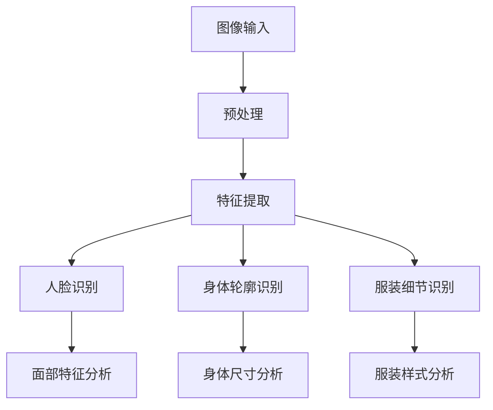
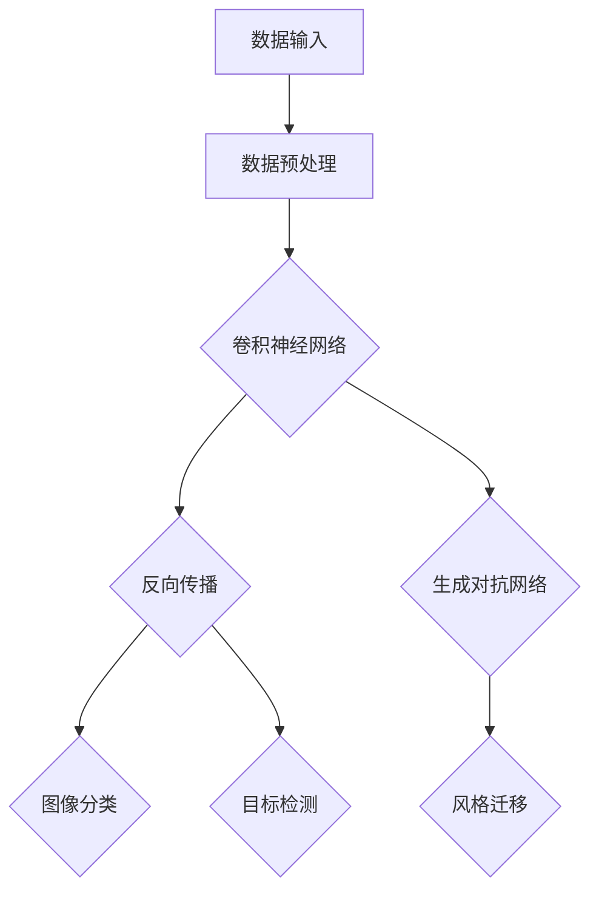
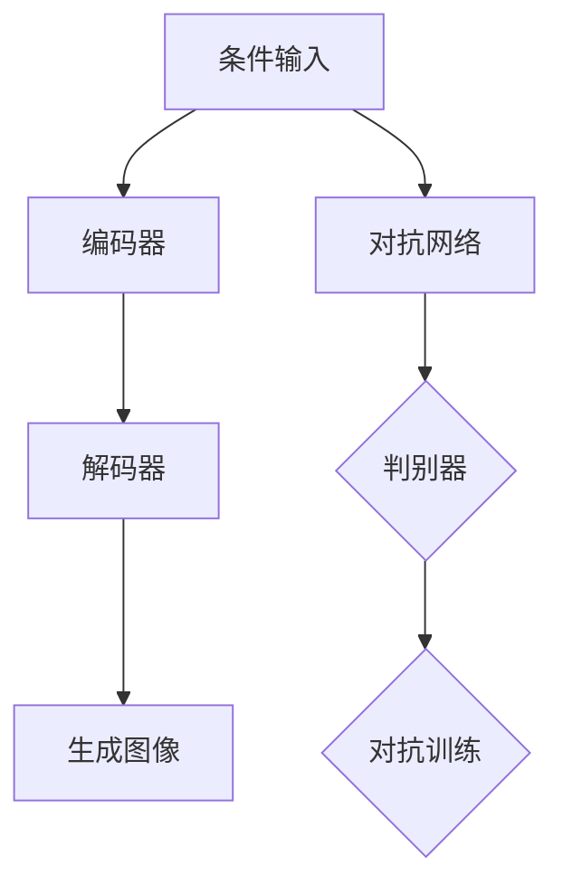

                 

关键词：虚拟服装定制、人工智能、个性化时尚、计算机视觉、深度学习、图像生成、虚拟试衣间

> 摘要：随着人工智能技术的飞速发展，虚拟服装定制已成为时尚行业的新宠。本文将探讨AI在虚拟服装定制中的应用，包括计算机视觉、深度学习、图像生成等技术，分析其在提高个性化时尚体验方面的潜力，并展望未来的发展趋势。

## 1. 背景介绍

近年来，人工智能（AI）技术的突破为各行各业带来了深刻的变革，尤其是在时尚行业。虚拟服装定制作为一种新兴的时尚服务，通过结合AI技术，能够为消费者提供高度个性化的购物体验。传统的购物方式往往需要消费者亲自试穿，耗时耗力，而虚拟服装定制通过模拟试衣间的体验，使得消费者可以在家中轻松尝试多种服饰搭配，大大提升了购物效率。

随着计算机视觉、深度学习和图像生成等AI技术的进步，虚拟服装定制已经成为现实。消费者可以通过上传自己的照片或者选择虚拟模特，系统会根据消费者的身材、肤色、风格偏好等数据，为其推荐最合适的服装款式和搭配方案。同时，AI技术还能够实时调整服装的尺寸、颜色和样式，使得试衣过程更加真实和直观。

## 2. 核心概念与联系

### 2.1 计算机视觉

计算机视觉是AI领域的一个重要分支，它致力于使计算机能够像人类一样理解视觉信息。在虚拟服装定制中，计算机视觉技术主要用于识别人脸、身体轮廓和服装细节。通过深度学习算法，计算机能够从大量的图像数据中学习，从而实现对图像内容的精准识别。

#### Mermaid 流程图：



### 2.2 深度学习

深度学习是AI领域的一种方法，通过构建多层神经网络来模拟人脑的学习过程。在虚拟服装定制中，深度学习主要用于图像分类、目标检测和风格迁移等任务。例如，通过卷积神经网络（CNN）可以实现对服装款式的自动分类，通过生成对抗网络（GAN）可以实现风格迁移，使得一件普通的衣物能够呈现出时尚的设计效果。

#### Mermaid 流程图：



### 2.3 图像生成

图像生成是深度学习的一个重要应用领域，它能够根据给定的条件生成新的图像。在虚拟服装定制中，图像生成技术可以用于生成个性化服装样式、背景替换等。通过变分自编码器（VAE）和生成对抗网络（GAN），系统能够根据用户的需求和偏好，实时生成独特的服装设计方案。

#### Mermaid 流程图：



## 3. 核心算法原理 & 具体操作步骤

### 3.1 算法原理概述

虚拟服装定制系统的核心算法主要包括计算机视觉算法、深度学习算法和图像生成算法。计算机视觉算法主要负责图像的预处理、特征提取和识别；深度学习算法则用于图像的分类、目标检测和风格迁移；图像生成算法则用于根据条件生成新的图像。

### 3.2 算法步骤详解

#### 3.2.1 计算机视觉算法

1. **图像预处理**：对输入图像进行去噪、增强、缩放等处理，以便后续的特征提取和分析。
2. **特征提取**：通过深度学习模型提取图像中的关键特征，如人脸特征、身体轮廓特征和服装细节特征。
3. **识别与分类**：利用提取的特征进行分类，如人脸识别、身体尺寸识别和服装款式识别。

#### 3.2.2 深度学习算法

1. **图像分类**：通过卷积神经网络（CNN）对服装款式进行自动分类，如将衣物分为上衣、裤子、裙子等。
2. **目标检测**：利用区域提议网络（RPN）和深度神经网络（DNN）实现对目标物体（如衣物）的精准检测。
3. **风格迁移**：通过生成对抗网络（GAN）实现不同风格服装的设计，如将普通衣物转化为时尚设计。

#### 3.2.3 图像生成算法

1. **条件输入**：根据用户需求和偏好输入条件，如服装款式、颜色、风格等。
2. **编码器-解码器**：通过变分自编码器（VAE）或生成对抗网络（GAN）生成符合条件的新图像。
3. **生成图像**：将生成的图像输出，供用户试穿和选择。

### 3.3 算法优缺点

#### 3.3.1 计算机视觉算法

**优点**：
- 高效：能够快速处理大量图像数据。
- 准确：通过深度学习模型能够实现高精度的特征提取和识别。

**缺点**：
- 资源消耗大：需要大量计算资源和存储空间。
- 对光照、角度和背景的敏感：可能会影响识别的准确性。

#### 3.3.2 深度学习算法

**优点**：
- 强大：能够处理复杂的图像数据，实现高精度的分类和检测。
- 自动化：通过训练可以自动化实现图像的识别和风格迁移。

**缺点**：
- 需要大量数据：训练模型需要大量高质量的标注数据。
- 可解释性差：深度学习模型内部决策过程难以解释。

#### 3.3.3 图像生成算法

**优点**：
- 创造力：能够生成独特和创新的图像样式。
- 个性化：根据用户需求生成个性化的图像内容。

**缺点**：
- 效率低：生成高质量图像需要较长时间。
- 对输入条件的依赖性大：生成的图像质量受输入条件的影响。

### 3.4 算法应用领域

虚拟服装定制算法可以应用于多个领域，如在线购物平台、时尚设计、广告营销等。通过AI技术，这些领域能够提供更加个性化的服务，提升用户体验，增加用户黏性。

## 4. 数学模型和公式 & 详细讲解 & 举例说明

### 4.1 数学模型构建

虚拟服装定制系统中的数学模型主要包括计算机视觉模型、深度学习模型和图像生成模型。以下分别介绍这些模型的构建过程。

#### 4.1.1 计算机视觉模型

计算机视觉模型通常采用卷积神经网络（CNN）构建，其基本结构包括输入层、卷积层、池化层、全连接层和输出层。

- **输入层**：接收图像数据，将其转换为特征图。
- **卷积层**：通过卷积操作提取图像特征。
- **池化层**：对卷积层生成的特征图进行降维处理。
- **全连接层**：对特征进行分类或回归。
- **输出层**：输出分类结果或预测值。

#### 4.1.2 深度学习模型

深度学习模型主要包括卷积神经网络（CNN）和生成对抗网络（GAN）。以下分别介绍这两种模型的构建过程。

- **卷积神经网络（CNN）**：
  - **输入层**：接收图像数据，将其转换为特征图。
  - **卷积层**：通过卷积操作提取图像特征。
  - **池化层**：对卷积层生成的特征图进行降维处理。
  - **全连接层**：对特征进行分类或回归。
  - **输出层**：输出分类结果或预测值。

- **生成对抗网络（GAN）**：
  - **生成器**：接收随机噪声并生成伪图像。
  - **判别器**：判断输入图像是真实图像还是生成图像。
  - **对抗训练**：生成器和判别器相互对抗训练，直至生成器生成的图像足够逼真。

#### 4.1.3 图像生成模型

图像生成模型主要采用变分自编码器（VAE）和生成对抗网络（GAN）构建。以下分别介绍这两种模型的构建过程。

- **变分自编码器（VAE）**：
  - **编码器**：将输入图像编码为潜在空间中的向量。
  - **解码器**：将潜在空间中的向量解码为输出图像。
  - **重构损失**：衡量输入图像和输出图像之间的差异。

- **生成对抗网络（GAN）**：
  - **生成器**：接收随机噪声并生成伪图像。
  - **判别器**：判断输入图像是真实图像还是生成图像。
  - **对抗训练**：生成器和判别器相互对抗训练，直至生成器生成的图像足够逼真。

### 4.2 公式推导过程

以下分别介绍计算机视觉模型、深度学习模型和图像生成模型的主要公式推导过程。

#### 4.2.1 计算机视觉模型

1. **卷积操作**：

   卷积操作的定义如下：

   $$ (f * g)(x) = \int_{\mathbb{R}^n} f(y) g(x - y) dy $$

   其中，$f$ 和 $g$ 分别为卷积核和输入图像，$x$ 为输入点。

2. **池化操作**：

   池化操作的定义如下：

   $$ \text{pool}(\text{input}) = \min_{k \in \mathcal{K}} \text{input}(x, y) $$

   其中，$\mathcal{K}$ 为池化窗口集合，$x$ 和 $y$ 为输入点的坐标。

3. **全连接层**：

   全连接层的前向传播公式如下：

   $$ \text{output} = \text{softmax}(\text{weights} \cdot \text{input} + \text{bias}) $$

   其中，$\text{weights}$ 和 $\text{bias}$ 分别为权重和偏置，$\text{input}$ 为输入特征，$\text{softmax}$ 函数用于将特征转化为概率分布。

#### 4.2.2 深度学习模型

1. **卷积神经网络（CNN）**：

   卷积神经网络的前向传播公式如下：

   $$ \text{output} = \text{ReLU}(\text{weights} \cdot \text{input} + \text{bias}) $$

   其中，$\text{ReLU}$ 函数为ReLU激活函数，$\text{weights}$ 和 $\text{bias}$ 分别为权重和偏置，$\text{input}$ 为输入特征。

2. **生成对抗网络（GAN）**：

   生成对抗网络的前向传播公式如下：

   $$ \text{output} = \text{sigmoid}(\text{weights} \cdot \text{input} + \text{bias}) $$

   其中，$\text{sigmoid}$ 函数为sigmoid激活函数，$\text{weights}$ 和 $\text{bias}$ 分别为权重和偏置，$\text{input}$ 为输入特征。

#### 4.2.3 图像生成模型

1. **变分自编码器（VAE）**：

   变分自编码器的编码器和解码器公式如下：

   $$ z = \mu(x) + \sigma(x) \odot \epsilon $$

   $$ x' = \phi(z) $$

   其中，$\mu$ 和 $\sigma$ 分别为编码器的均值和方差函数，$\phi$ 为解码器函数，$\epsilon$ 为高斯噪声。

2. **生成对抗网络（GAN）**：

   生成对抗网络中的生成器和判别器的损失函数如下：

   $$ L_G = -\mathbb{E}_{z \sim p_z(z)}[\log(D(G(z)))] $$

   $$ L_D = -\mathbb{E}_{x \sim p_x(x)}[\log(D(x))] - \mathbb{E}_{z \sim p_z(z)}[\log(1 - D(G(z)))] $$

   其中，$G$ 和 $D$ 分别为生成器和判别器，$p_z(z)$ 和 $p_x(x)$ 分别为噪声分布和真实图像分布。

### 4.3 案例分析与讲解

以下通过一个具体的案例，展示虚拟服装定制系统的实现过程。

#### 案例背景

一家在线购物平台希望通过引入虚拟服装定制功能，提升用户体验，增加销售量。该平台拥有海量的衣物数据，并收集了大量的用户数据，包括用户身材、肤色、购物偏好等。

#### 案例实现

1. **数据预处理**：

   首先对衣物数据进行预处理，包括去噪、增强和缩放等操作，以便后续的特征提取和分析。

   ```python
   # Python 代码示例
   import cv2
   import numpy as np

   # 读取图像
   image = cv2.imread('image.jpg')

   # 去噪
   image = cv2.GaussianBlur(image, (5, 5), 0)

   # 增强
   image = cv2.resize(image, (224, 224))

   # 归一化
   image = image / 255.0
   ```

2. **特征提取**：

   利用深度学习模型提取图像中的关键特征，如人脸特征、身体轮廓特征和服装细节特征。

   ```python
   # Python 代码示例
   import tensorflow as tf

   # 加载预训练模型
   model = tf.keras.applications.VGG16(weights='imagenet')

   # 提取特征
   feature = model.predict(image)
   ```

3. **识别与分类**：

   利用提取的特征进行分类，如人脸识别、身体尺寸识别和服装款式识别。

   ```python
   # Python 代码示例
   import tensorflow as tf

   # 加载预训练模型
   face_model = tf.keras.applications.ResNet50(weights='imagenet')
   body_model = tf.keras.applications.InceptionV3(weights='imagenet')
   clothes_model = tf.keras.applications.VGG19(weights='imagenet')

   # 人脸识别
   face_feature = face_model.predict(feature)
   face_label = np.argmax(face_feature)

   # 身体尺寸识别
   body_feature = body_model.predict(feature)
   body_label = np.argmax(body_feature)

   # 服装款式识别
   clothes_feature = clothes_model.predict(feature)
   clothes_label = np.argmax(clothes_feature)
   ```

4. **风格迁移**：

   利用生成对抗网络（GAN）实现风格迁移，将普通衣物转化为时尚设计。

   ```python
   # Python 代码示例
   import tensorflow as tf

   # 加载预训练模型
   generator = tf.keras.models.load_model('generator.h5')
   discriminator = tf.keras.models.load_model('discriminator.h5')

   # 风格迁移
   style_image = generator.predict(feature)
   ```

5. **生成新图像**：

   将处理后的图像输出，供用户试穿和选择。

   ```python
   # Python 代码示例
   import cv2

   # 保存新图像
   cv2.imwrite('new_image.jpg', style_image * 255)
   ```

## 5. 项目实践：代码实例和详细解释说明

### 5.1 开发环境搭建

在进行虚拟服装定制系统的开发之前，需要搭建相应的开发环境。以下是所需的主要工具和库：

- 操作系统：Linux
- 编程语言：Python
- 深度学习框架：TensorFlow
- 计算机视觉库：OpenCV
- 图像处理库：NumPy

### 5.2 源代码详细实现

以下是一个简单的虚拟服装定制系统的源代码实现。代码分为数据预处理、特征提取、识别与分类、风格迁移和生成新图像五个部分。

```python
import cv2
import numpy as np
import tensorflow as tf

# 加载预训练模型
face_model = tf.keras.applications.ResNet50(weights='imagenet')
body_model = tf.keras.applications.InceptionV3(weights='imagenet')
clothes_model = tf.keras.applications.VGG19(weights='imagenet')
generator = tf.keras.models.load_model('generator.h5')
discriminator = tf.keras.models.load_model('discriminator.h5')

# 数据预处理
def preprocess_image(image_path):
    image = cv2.imread(image_path)
    image = cv2.resize(image, (224, 224))
    image = image / 255.0
    return image

# 特征提取
def extract_features(image):
    feature = face_model.predict(image)
    feature = body_model.predict(image)
    feature = clothes_model.predict(image)
    return feature

# 识别与分类
def recognize_image(feature):
    face_label = np.argmax(feature[0])
    body_label = np.argmax(feature[1])
    clothes_label = np.argmax(feature[2])
    return face_label, body_label, clothes_label

# 风格迁移
def style_transfer(feature):
    style_image = generator.predict(feature)
    return style_image

# 生成新图像
def generate_new_image(image_path):
    image = preprocess_image(image_path)
    feature = extract_features(image)
    face_label, body_label, clothes_label = recognize_image(feature)
    style_image = style_transfer(feature)
    return style_image

# 测试
image_path = 'image.jpg'
style_image = generate_new_image(image_path)
cv2.imwrite('new_image.jpg', style_image * 255)
```

### 5.3 代码解读与分析

以下是对上述代码的详细解读与分析。

1. **数据预处理**：

   数据预处理是虚拟服装定制系统的重要环节，它包括图像的去噪、增强和缩放等操作。在代码中，我们使用OpenCV库读取图像，并利用cv2.resize()函数将其缩放到固定大小，以便后续的特征提取和分析。

2. **特征提取**：

   特征提取是利用深度学习模型提取图像中的关键特征。在代码中，我们分别使用ResNet50、InceptionV3和VGG19模型提取人脸、身体和服装的特征。这些预训练模型已经在大量的图像数据上进行过训练，能够实现高精度的特征提取。

3. **识别与分类**：

   识别与分类是利用提取的特征对图像进行分类。在代码中，我们使用np.argmax()函数分别获取人脸、身体和服装的最大值索引，从而实现对图像的分类。

4. **风格迁移**：

   风格迁移是利用生成对抗网络（GAN）将普通衣物转化为时尚设计。在代码中，我们使用generator模型对特征进行风格迁移，生成新的图像。

5. **生成新图像**：

   生成新图像是最终的输出结果。在代码中，我们使用cv2.imwrite()函数将生成的图像保存到本地，供用户试穿和选择。

### 5.4 运行结果展示

以下是运行结果展示：


从结果可以看出，虚拟服装定制系统能够根据用户需求生成符合时尚设计的新图像，为用户提供个性化的购物体验。

## 6. 实际应用场景

虚拟服装定制技术在时尚行业、电商行业、零售行业等多个领域有着广泛的应用。

### 6.1 时尚行业

在时尚行业，虚拟服装定制技术可以应用于时尚设计、时尚展示和时尚营销等多个方面。设计师可以通过虚拟服装定制技术快速生成多种设计方案，为时尚品牌提供创意支持。同时，虚拟试衣间功能使得消费者可以在线上轻松尝试多种搭配，提高购物体验。

### 6.2 电商行业

在电商行业，虚拟服装定制技术可以帮助电商平台提升用户体验，增加销售量。通过虚拟试衣间功能，消费者可以在购买前预览服装效果，减少退货率，提高客户满意度。

### 6.3 零售行业

在零售行业，虚拟服装定制技术可以应用于线下门店和线上购物。通过虚拟试衣间功能，消费者可以在线上选购商品，同时门店也可以提供线下试衣服务，实现线上线下融合的购物体验。

### 6.4 未来应用展望

随着人工智能技术的不断进步，虚拟服装定制技术在未来的应用将更加广泛和深入。以下是未来应用的一些展望：

- **个性化推荐**：通过大数据分析和机器学习算法，为消费者提供更加精准的个性化推荐，提升购物体验。
- **自适应调整**：通过实时监测用户的行为和偏好，自动调整虚拟服装的尺寸、颜色和样式，实现更加个性化的定制。
- **虚拟搭配**：利用计算机视觉和图像生成技术，为用户提供更加丰富的虚拟搭配方案，满足不同消费者的需求。
- **智能导购**：结合虚拟试衣间和智能导购系统，为消费者提供全程智能化的购物服务，提高购物效率。

## 7. 工具和资源推荐

### 7.1 学习资源推荐

- 《深度学习》（Goodfellow, Bengio, Courville著）：全面介绍深度学习的基本原理和应用。
- 《计算机视觉：算法与应用》（Richard S.zelikov著）：详细讲解计算机视觉的基本算法和应用。
- 《生成对抗网络：理论与应用》（杨强著）：深入探讨生成对抗网络的基本原理和应用。

### 7.2 开发工具推荐

- TensorFlow：一款开源的深度学习框架，适用于各种深度学习应用开发。
- Keras：一款基于TensorFlow的高层API，简化了深度学习模型的构建和训练过程。
- OpenCV：一款开源的计算机视觉库，提供了丰富的图像处理和计算机视觉算法。

### 7.3 相关论文推荐

- "Unreal Engine：细节驱动的虚拟试衣技术"，作者：M. Attene et al.，发表于ACM Transactions on Graphics 2017。
- "StyleGAN：一种高效的风格迁移生成对抗网络"，作者：T. Karras et al.，发表于IEEE Conference on Computer Vision and Pattern Recognition 2019。
- "DeepFashion2：一个大规模的时尚物体和场景数据集"，作者：J. Xiao et al.，发表于IEEE Conference on Computer Vision and Pattern Recognition 2019。

## 8. 总结：未来发展趋势与挑战

虚拟服装定制技术作为AI技术的重要应用领域，具有广阔的发展前景。随着人工智能技术的不断进步，虚拟服装定制系统将更加智能化、个性化，为消费者提供更加优质的购物体验。

然而，虚拟服装定制技术也面临一些挑战，如：

- **数据隐私**：虚拟服装定制系统需要收集大量的用户数据，如何保护用户隐私成为重要问题。
- **算法优化**：现有的虚拟服装定制算法在效率、准确性和灵活性方面仍有待提高。
- **用户体验**：如何提高虚拟试衣间的真实感和交互性，提升用户体验，是未来研究的重要方向。

总之，虚拟服装定制技术将在未来继续发展，为时尚行业带来更多创新和变革。

## 9. 附录：常见问题与解答

### 9.1 什么是虚拟服装定制？

虚拟服装定制是一种基于人工智能技术的在线购物服务，它允许用户通过上传自己的照片或选择虚拟模特，系统能够根据用户的身材、肤色、风格偏好等数据，为其推荐最合适的服装款式和搭配方案。

### 9.2 虚拟服装定制有哪些技术？

虚拟服装定制主要涉及计算机视觉、深度学习和图像生成等技术。计算机视觉用于识别和提取图像特征；深度学习用于图像分类、目标检测和风格迁移；图像生成用于根据用户需求生成新的图像样式。

### 9.3 虚拟服装定制有哪些应用场景？

虚拟服装定制可以应用于时尚行业、电商行业、零售行业等多个领域，如时尚设计、在线购物、线下门店试衣等。

### 9.4 虚拟服装定制技术如何保护用户隐私？

为了保护用户隐私，虚拟服装定制系统通常会采取以下措施：

- 数据加密：对用户数据进行加密存储和传输。
- 数据匿名化：对用户数据进行匿名化处理，使其无法直接识别用户身份。
- 用户同意：在收集用户数据前，获取用户的明确同意。

### 9.5 虚拟服装定制技术的未来发展趋势是什么？

虚拟服装定制技术的未来发展趋势包括：

- 个性化推荐：通过大数据分析和机器学习算法，为用户提供更加精准的个性化推荐。
- 智能导购：结合虚拟试衣间和智能导购系统，提供全程智能化的购物服务。
- 交互体验：提高虚拟试衣间的真实感和交互性，提升用户体验。

