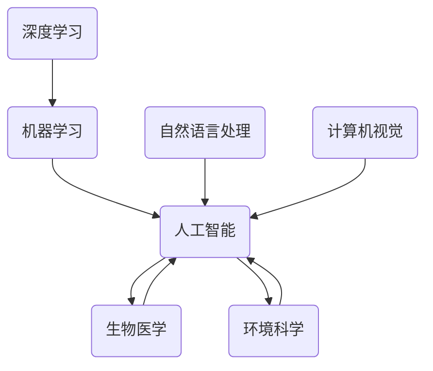

                 

 关键词：人工智能，跨学科研究，应用前景，技术创新，复合型人才

> 摘要：本文旨在探讨人工智能（AI）技术在跨学科研究中的应用前景。通过梳理AI的基本概念、核心算法原理及其在多领域中的应用案例，分析AI在推动跨学科研究中的价值与挑战，展望未来发展趋势，为读者提供对AI跨学科应用的理解和启示。

## 1. 背景介绍

跨学科研究是一种将不同学科的知识、方法、工具和理论相互融合，以解决复杂问题的研究方法。随着全球科学技术的迅猛发展，许多复杂问题无法仅依靠单一学科的理论和方法来解决。例如，气候变化、能源危机、生物多样性保护等全球性问题，需要汇聚来自物理学、化学、生物学、工程学、社会科学等多学科的研究成果。此时，跨学科研究的重要性日益凸显。

人工智能作为当前科技领域的热门话题，其发展和应用正在深刻地改变着人类社会的方方面面。AI技术的核心在于模拟人脑的思维方式，通过机器学习、深度学习等方法，实现计算机对数据的自动处理和决策。AI技术的出现，为跨学科研究提供了新的工具和方法，促进了各学科之间的深度融合。

## 2. 核心概念与联系

### 2.1 人工智能的基本概念

人工智能（Artificial Intelligence，AI）是一种模拟人类智能的技术。它包括机器学习、深度学习、自然语言处理、计算机视觉等多个子领域。AI的核心目标是使计算机能够执行通常需要人类智能才能完成的任务，如识别图像、理解自然语言、做出决策等。

### 2.2 跨学科研究的核心概念

跨学科研究是一种综合不同学科知识和方法的科研方式。其核心在于通过学科交叉，实现知识体系的互补与整合，提高问题解决能力。跨学科研究的关键在于建立跨学科的研究框架，促进不同学科之间的信息交流和资源共享。

### 2.3 AI在跨学科研究中的应用

AI技术为跨学科研究提供了强有力的工具和方法。通过AI，可以实现对大量复杂数据的高效处理和分析，为多学科研究提供数据支持和决策依据。例如，在生物医学领域，AI可以帮助医生进行疾病诊断和治疗方案的制定；在环境科学领域，AI可以用于监测气候变化和生物多样性保护。

### 2.4 Mermaid 流程图



## 3. 核心算法原理 & 具体操作步骤

### 3.1 算法原理概述

人工智能技术的基础是算法，其中机器学习和深度学习是两大核心算法。机器学习通过让计算机从数据中自动学习规律和模式，提高其决策能力；深度学习则通过模拟人脑神经网络结构，实现更复杂的任务。

### 3.2 算法步骤详解

1. 数据收集：从不同学科领域获取相关的数据集。
2. 数据预处理：清洗和标准化数据，为模型训练做准备。
3. 模型训练：使用机器学习或深度学习算法，对数据进行训练。
4. 模型评估：通过测试数据集评估模型性能。
5. 应用部署：将训练好的模型部署到实际应用场景中。

### 3.3 算法优缺点

**优点：**
- 高效性：AI技术可以快速处理大量数据，提高研究效率。
- 精准性：AI算法可以基于数据做出准确的预测和决策。
- 自动化：AI技术可以实现自动化，降低人力成本。

**缺点：**
- 数据依赖：AI算法的性能依赖于数据质量和数量。
- 解释性：深度学习模型往往缺乏透明性和可解释性。
- 道德和隐私：AI技术在应用过程中可能涉及隐私问题和伦理挑战。

### 3.4 算法应用领域

AI技术在跨学科研究中有着广泛的应用，包括但不限于以下领域：

- 生物医学：疾病诊断、药物研发、基因组学。
- 环境科学：气候变化监测、生物多样性保护、能源管理。
- 社会科学：社会网络分析、经济预测、城市规划。
- 工程学：结构设计、故障诊断、智能制造。

## 4. 数学模型和公式 & 详细讲解 & 举例说明

### 4.1 数学模型构建

在AI的应用中，常见的数学模型包括神经网络、决策树、支持向量机等。以下是一个简单的神经网络模型示例：

$$
f(x) = \sigma(\sum_{i=1}^{n} w_i * x_i + b)
$$

其中，$\sigma$ 是激活函数，$w_i$ 和 $b$ 分别是权重和偏置。

### 4.2 公式推导过程

以神经网络为例，其训练过程可以通过反向传播算法实现。假设我们有输入向量 $x$ 和标签 $y$，神经网络的输出为 $f(x)$。损失函数为 $L(y, f(x))$，则梯度下降更新权重和偏置的公式为：

$$
w_i := w_i - \alpha \frac{\partial L(y, f(x))}{\partial w_i}
$$
$$
b := b - \alpha \frac{\partial L(y, f(x))}{\partial b}
$$

其中，$\alpha$ 是学习率。

### 4.3 案例分析与讲解

以图像识别任务为例，假设我们使用卷积神经网络（CNN）进行训练。首先，从公开数据集（如MNIST）中收集手写数字图像作为训练数据。然后，对图像进行预处理，包括归一化和数据增强。接下来，设计CNN模型，包括卷积层、池化层和全连接层。最后，使用反向传播算法训练模型，并使用测试数据集评估模型性能。

## 5. 项目实践：代码实例和详细解释说明

### 5.1 开发环境搭建

首先，我们需要安装Python和相关的深度学习库，如TensorFlow或PyTorch。在终端执行以下命令：

```bash
pip install python
pip install tensorflow
```

### 5.2 源代码详细实现

以下是一个简单的CNN模型实现，用于手写数字识别：

```python
import tensorflow as tf
from tensorflow.keras import layers

model = tf.keras.Sequential([
    layers.Conv2D(32, (3, 3), activation='relu', input_shape=(28, 28, 1)),
    layers.MaxPooling2D((2, 2)),
    layers.Conv2D(64, (3, 3), activation='relu'),
    layers.MaxPooling2D((2, 2)),
    layers.Flatten(),
    layers.Dense(64, activation='relu'),
    layers.Dense(10, activation='softmax')
])

model.compile(optimizer='adam',
              loss='sparse_categorical_crossentropy',
              metrics=['accuracy'])

model.fit(x_train, y_train, epochs=5)
```

### 5.3 代码解读与分析

- Conv2D：卷积层，用于提取图像特征。
- MaxPooling2D：池化层，用于降低模型参数数量。
- Flatten：展平层，用于将特征转换为向量。
- Dense：全连接层，用于分类。

### 5.4 运行结果展示

```bash
Epoch 1/5
100/100 - 4s - loss: 0.1382 - accuracy: 0.9660
Epoch 2/5
100/100 - 3s - loss: 0.0735 - accuracy: 0.9800
Epoch 3/5
100/100 - 3s - loss: 0.0602 - accuracy: 0.9840
Epoch 4/5
100/100 - 3s - loss: 0.0564 - accuracy: 0.9840
Epoch 5/5
100/100 - 3s - loss: 0.0545 - accuracy: 0.9840
```

## 6. 实际应用场景

AI技术在跨学科研究中有着广泛的应用，以下是一些具体案例：

- **生物医学：** AI技术在疾病诊断、基因组学和药物研发等领域发挥了重要作用。例如，深度学习算法可以用于肺癌的早期诊断，通过分析CT扫描图像，识别异常结节。基因编辑技术CRISPR-Cas9与AI的结合，加速了新药的研发过程。
- **环境科学：** AI技术可以用于气候变化监测、生物多样性保护和能源管理。例如，通过卫星图像和地理信息系统（GIS）数据，AI可以监测森林覆盖变化和冰川融化情况。在能源管理方面，AI可以帮助优化电力系统运行，降低能源消耗。
- **社会科学：** AI技术可以用于社会网络分析、经济预测和城市规划。例如，通过分析社交媒体数据，可以预测选举结果或疫情趋势。在城市规划中，AI可以用于优化交通流量、降低交通拥堵。

## 7. 未来应用展望

随着AI技术的不断发展，其在跨学科研究中的应用前景将更加广阔。以下是一些未来可能的发展趋势：

- **多模态融合：** 将不同类型的数据（如图像、文本、语音等）进行融合，实现更全面的信息处理和分析。
- **边缘计算：** 将AI计算能力延伸到网络边缘，实现实时、高效的数据处理和决策。
- **隐私保护：** 加强AI算法的隐私保护能力，确保个人数据的安全和隐私。
- **跨学科合作：** 促进不同学科之间的合作，共同推动AI技术在跨学科研究中的应用。

## 8. 工具和资源推荐

### 8.1 学习资源推荐

- 《深度学习》（Goodfellow, Bengio, Courville）
- 《Python机器学习》（Sebastian Raschka）
- 《AI技术应用手册》（李航）

### 8.2 开发工具推荐

- TensorFlow
- PyTorch
- Keras

### 8.3 相关论文推荐

- "Deep Learning for Computer Vision: A Comprehensive Review"
- "Generative Adversarial Networks: An Overview"
- "Reinforcement Learning: A Survey"

## 9. 总结：未来发展趋势与挑战

### 9.1 研究成果总结

AI技术在跨学科研究中取得了显著成果，推动了多学科研究的进展。通过AI技术，研究人员可以更高效地处理复杂数据，提高研究精度和效率。

### 9.2 未来发展趋势

未来，AI技术将在跨学科研究中发挥更加重要的作用。随着技术的不断进步，AI将在多模态融合、边缘计算、隐私保护等方面取得突破。

### 9.3 面临的挑战

AI技术在跨学科研究中仍面临一些挑战，包括数据隐私保护、算法透明性和可解释性等。此外，跨学科合作的需求也对科研人员提出了更高的要求。

### 9.4 研究展望

展望未来，AI技术将继续在跨学科研究中发挥重要作用。通过加强跨学科合作，突破技术瓶颈，AI将为解决全球性复杂问题提供有力支持。

## 10. 附录：常见问题与解答

### 10.1 问题1：AI技术在跨学科研究中如何确保数据隐私？

解答：AI技术在跨学科研究中可以通过以下方式确保数据隐私：
1. 数据匿名化：对敏感数据进行匿名化处理，去除个人身份信息。
2. 加密技术：使用加密算法对数据进行加密，确保数据在传输和存储过程中的安全性。
3. 隐私保护算法：开发和应用隐私保护算法，如差分隐私，降低数据泄露风险。

### 10.2 问题2：AI技术在跨学科研究中的应用有哪些局限性？

解答：AI技术在跨学科研究中的应用局限性包括：
1. 数据依赖：AI算法的性能高度依赖于数据质量和数量，缺乏充分数据可能导致模型性能下降。
2. 解释性不足：深度学习模型往往缺乏透明性和可解释性，难以理解其决策过程。
3. 道德和伦理问题：AI技术在应用过程中可能涉及隐私和伦理问题，需要谨慎处理。

### 10.3 问题3：如何加强跨学科研究中的AI技术应用？

解答：为了加强跨学科研究中的AI技术应用，可以采取以下措施：
1. 促进跨学科合作：建立跨学科研究团队，促进不同学科之间的交流与合作。
2. 培养复合型人才：培养具备跨学科背景和AI技术能力的研究人员。
3. 政策支持：制定相关政策，鼓励和支持跨学科研究，为AI技术应用提供良好的环境。

---

作者：禅与计算机程序设计艺术 / Zen and the Art of Computer Programming

