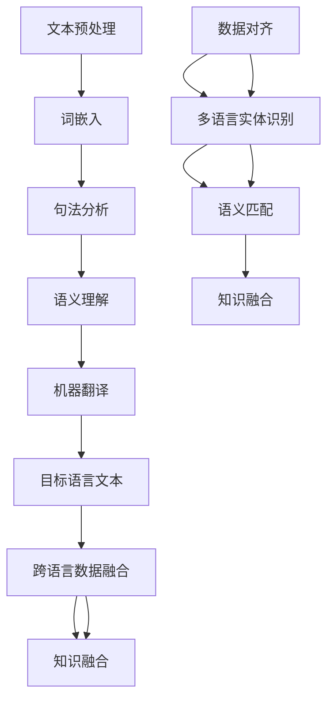

                 

关键词：人工智能、跨语言信息整合、自然语言处理、机器翻译、多语言数据融合、人工智能应用场景、技术挑战

## 摘要

随着全球化进程的加速，跨语言信息整合成为了各个行业中的重要需求。本文旨在探讨人工智能在跨语言信息整合中的关键作用，并深入分析其技术原理、算法实现和应用场景。通过本文的阅读，读者可以了解到人工智能如何通过自然语言处理、机器翻译和跨语言数据融合等技术手段，实现跨语言信息的高效整合，为各个领域提供创新解决方案。

## 1. 背景介绍

在全球化的背景下，跨国交流和协作变得越来越频繁。语言障碍成为了信息传递和知识共享的主要障碍之一。为了克服这一障碍，跨语言信息整合成为了一个迫切需要解决的技术难题。跨语言信息整合的目标是将不同语言的信息进行有效整合，使其能够被用户或其他系统理解和利用。

跨语言信息整合涉及多个方面，包括语言翻译、语义理解、信息检索和知识融合等。语言翻译是跨语言信息整合的核心组成部分，其主要目标是实现不同语言之间的准确翻译。然而，传统的机器翻译技术存在一定的局限性，如翻译质量不高、无法处理复杂语境等。因此，人工智能技术的引入为跨语言信息整合提供了新的思路和解决方案。

人工智能，特别是深度学习技术的迅猛发展，使得自然语言处理（NLP）和机器翻译领域取得了显著的进步。通过利用大规模数据集和复杂的神经网络模型，人工智能能够更好地理解语言中的语义和上下文信息，从而提高翻译质量和准确度。此外，人工智能还可以通过多语言数据融合技术，将来自不同语言的信息进行整合，实现跨语言的知识共享和协同工作。

本文将首先介绍跨语言信息整合的背景和挑战，然后深入探讨人工智能在跨语言信息整合中的作用，包括自然语言处理、机器翻译和跨语言数据融合等技术。接着，我们将分析人工智能在跨语言信息整合中的具体应用场景，并讨论面临的挑战和未来发展方向。最后，本文将推荐一些相关的学习资源、开发工具和论文，以供读者进一步学习和探索。

## 2. 核心概念与联系

### 2.1 自然语言处理（NLP）

自然语言处理是人工智能的一个重要分支，旨在使计算机能够理解和处理人类自然语言。在跨语言信息整合中，NLP技术起到了至关重要的作用。NLP的核心概念包括文本预处理、词嵌入、句法分析和语义理解等。

- **文本预处理**：包括去除标点符号、停用词过滤、词干提取等步骤，旨在将原始文本转换为计算机可处理的格式。
- **词嵌入**：通过将单词映射到高维向量空间，使得计算机能够利用向量空间中的相似性和距离度量来处理文本数据。
- **句法分析**：分析句子的结构，包括词性标注、依存关系和句法树构建等，以更好地理解句子的语法规则。
- **语义理解**：通过上下文信息对词语和句子的语义进行理解，实现语义层面的分析和推理。

### 2.2 机器翻译

机器翻译是跨语言信息整合的核心技术之一，旨在将一种语言的信息准确翻译成另一种语言。机器翻译可以进一步分为基于规则的翻译和基于统计的翻译。

- **基于规则的翻译**：依赖于预定义的语法规则和翻译词典，通过规则匹配和转换来实现翻译。
- **基于统计的翻译**：利用大规模的双语语料库，通过统计学习方法自动生成翻译模型。

近年来，深度学习技术在机器翻译中的应用取得了显著成果，尤其是端到端神经机器翻译（NMT）模型。NMT通过端到端的神经网络架构，直接将源语言文本映射到目标语言文本，避免了传统机器翻译中的多个中间步骤，提高了翻译质量和效率。

### 2.3 跨语言数据融合

跨语言数据融合是将来自不同语言的信息进行整合，以实现更全面和准确的理解。跨语言数据融合涉及到多个方面，包括数据对齐、多语言实体识别、语义匹配和知识融合等。

- **数据对齐**：将不同语言的数据进行匹配，以建立语言之间的对应关系。
- **多语言实体识别**：识别和分类不同语言中的实体，如人名、地名、组织等。
- **语义匹配**：通过语义分析技术，将不同语言中的语义信息进行匹配和关联。
- **知识融合**：将不同语言中的知识进行整合，构建跨语言的知识图谱，以实现更全面和准确的知识共享。

### 2.4 Mermaid 流程图

为了更好地理解上述核心概念之间的联系，我们可以使用Mermaid流程图来展示跨语言信息整合的整体流程。



在这个流程图中，文本预处理、词嵌入、句法分析和语义理解是自然语言处理的关键步骤，它们为机器翻译和跨语言数据融合提供了基础。机器翻译将源语言文本翻译成目标语言文本，然后与跨语言数据融合和知识融合相结合，实现更全面和准确的信息整合。

通过上述核心概念和流程的介绍，我们可以更好地理解人工智能在跨语言信息整合中的关键作用。接下来，我们将进一步探讨人工智能在跨语言信息整合中的应用和实践。

### 3. 核心算法原理 & 具体操作步骤

#### 3.1 算法原理概述

在跨语言信息整合中，核心算法包括自然语言处理（NLP）算法、机器翻译（MT）算法和跨语言数据融合（CLDF）算法。这些算法共同协作，实现了跨语言信息的高效整合。

- **NLP算法**：主要包括文本预处理、词嵌入、句法分析和语义理解等步骤。通过这些步骤，计算机能够理解和处理自然语言文本，为后续的机器翻译和数据融合提供基础。
- **MT算法**：利用大规模的双语语料库和深度学习模型，实现源语言文本到目标语言文本的自动翻译。当前主流的MT算法是端到端神经机器翻译（NMT）模型，如序列到序列（Seq2Seq）模型和注意力机制（Attention）模型。
- **CLDF算法**：通过数据对齐、多语言实体识别、语义匹配和知识融合等技术，将来自不同语言的数据进行整合，构建跨语言的知识图谱，实现跨语言的信息共享和协同工作。

#### 3.2 算法步骤详解

**3.2.1 自然语言处理（NLP）算法**

1. **文本预处理**：
   - **去除标点符号**：去除文本中的所有标点符号，以简化数据处理。
   - **停用词过滤**：去除常用的无意义词汇，如“的”、“了”、“在”等。
   - **词干提取**：将词语还原为其基本形态，如“喜欢”提取为“喜欢”。

2. **词嵌入**：
   - **词向量表示**：将每个单词映射到一个高维向量空间，以利用向量空间中的相似性和距离度量。
   - **预训练模型**：使用预训练的词嵌入模型，如Word2Vec、GloVe等，来初始化词向量。

3. **句法分析**：
   - **词性标注**：为每个单词标注其词性，如名词、动词、形容词等。
   - **依存关系分析**：分析单词之间的依赖关系，构建句法树。

4. **语义理解**：
   - **实体识别**：识别文本中的实体，如人名、地名、组织等。
   - **情感分析**：分析文本中的情感倾向，如积极、消极等。
   - **语义角色标注**：为句子中的每个词标注其在句子中的角色，如主语、谓语、宾语等。

**3.2.2 机器翻译（MT）算法**

1. **数据准备**：
   - **双语语料库**：收集大量的双语句子对，作为训练数据。
   - **数据预处理**：对双语语料库进行清洗、对齐和分词等处理。

2. **模型训练**：
   - **序列到序列（Seq2Seq）模型**：使用编码器和解码器神经网络，将源语言序列映射到目标语言序列。
   - **注意力机制（Attention）模型**：在解码过程中引入注意力机制，更好地关注源语言序列中的关键信息。

3. **模型评估**：
   - **BLEU评分**：使用BLEU（双语评估）评分标准，评估翻译模型的翻译质量。
   - **NIST评分**：使用NIST（国家标准技术研究所）评分标准，评估翻译模型的准确性。

**3.2.3 跨语言数据融合（CLDF）算法**

1. **数据对齐**：
   - **基于词语的匹配**：使用词嵌入向量计算相似性，实现不同语言文本的词语匹配。
   - **基于句子的匹配**：使用句子级别的相似性度量，实现不同语言文本的句子匹配。

2. **多语言实体识别**：
   - **命名实体识别**：使用命名实体识别（NER）算法，识别不同语言中的命名实体，如人名、地名等。
   - **实体链接**：将识别出的命名实体与知识库中的实体进行关联和链接。

3. **语义匹配**：
   - **基于词向量的匹配**：使用词嵌入向量计算词语之间的相似性，实现语义层面的匹配。
   - **基于语义角色标注的匹配**：使用句法分析结果，实现语义角色层面的匹配。

4. **知识融合**：
   - **知识图谱构建**：将跨语言数据融合的结果构建为知识图谱，实现跨语言的知识共享和协同工作。
   - **推理和扩展**：在知识图谱的基础上，进行推理和扩展，以实现更全面和准确的知识整合。

#### 3.3 算法优缺点

**3.3.1 自然语言处理（NLP）算法**

- **优点**：
  - **灵活性**：NLP算法可以根据不同的应用需求，灵活调整和处理文本数据。
  - **高效率**：利用词嵌入和神经网络模型，可以实现快速和大规模的文本处理。

- **缺点**：
  - **数据依赖**：NLP算法的性能很大程度上依赖于高质量的数据集和预训练模型。
  - **复杂度高**：NLP算法涉及到多个步骤和复杂的模型，实现和优化较为困难。

**3.3.2 机器翻译（MT）算法**

- **优点**：
  - **准确性高**：基于深度学习和大规模语料库的MT算法，翻译准确性较传统方法有显著提升。
  - **效率高**：端到端的神经网络模型可以实现快速和大规模的翻译。

- **缺点**：
  - **数据依赖**：MT算法的性能依赖于高质量的双语语料库，数据获取和处理较为困难。
  - **复杂度高**：MT算法涉及到复杂的神经网络模型和训练过程，实现和优化较为困难。

**3.3.3 跨语言数据融合（CLDF）算法**

- **优点**：
  - **知识整合**：CLDF算法可以实现跨语言的知识整合和共享，为多语言信息整合提供有力支持。
  - **灵活性高**：CLDF算法可以根据不同的应用需求，灵活调整和组合不同技术手段。

- **缺点**：
  - **数据依赖**：CLDF算法的性能依赖于高质量的多语言数据集和知识库。
  - **复杂度高**：CLDF算法涉及到多个技术环节和复杂的模型，实现和优化较为困难。

#### 3.4 算法应用领域

自然语言处理、机器翻译和跨语言数据融合算法在多个领域具有广泛的应用。

- **领域1：多语言信息检索**：通过跨语言数据融合算法，可以实现多语言信息检索系统的构建，提高检索效率和准确性。
- **领域2：多语言问答系统**：通过自然语言处理和机器翻译算法，可以实现跨语言问答系统的构建，为用户提供多语言服务。
- **领域3：跨语言知识图谱构建**：通过跨语言数据融合算法，可以实现跨语言知识图谱的构建，为多语言信息整合和智能推理提供基础。
- **领域4：多语言文本分类**：通过自然语言处理算法，可以实现多语言文本分类系统的构建，为文本挖掘和分类提供支持。

通过上述核心算法原理和具体操作步骤的介绍，我们可以看到人工智能在跨语言信息整合中发挥的重要作用。接下来，我们将进一步分析人工智能在跨语言信息整合中的应用和实践。

### 4. 数学模型和公式 & 详细讲解 & 举例说明

在跨语言信息整合中，数学模型和公式起到了至关重要的作用。以下我们将详细介绍常用的数学模型和公式，并对其进行详细讲解和举例说明。

#### 4.1 数学模型构建

**4.1.1 词嵌入模型**

词嵌入（Word Embedding）是一种将单词映射到高维向量空间的技术，其核心思想是将语义相似的单词映射到接近的向量空间。常用的词嵌入模型包括Word2Vec、GloVe等。

- **Word2Vec模型**：
  - **原理**：Word2Vec模型通过训练预测单词的上下文，将单词映射到高维向量空间。
  - **公式**：
    $$
    \begin{align*}
    P(w_i|w_{-i}) &= \frac{softmax(W \cdot w_i)}{\sum_{j} softmax(W \cdot w_j)} \\
    \end{align*}
    $$
    其中，$w_i$表示当前单词，$w_{-i}$表示当前单词的上下文，$W$表示权重矩阵，$softmax$函数用于计算词向量的概率分布。

- **GloVe模型**：
  - **原理**：GloVe模型通过同时考虑单词的局部和全局信息，提高词向量的质量。
  - **公式**：
    $$
    \begin{align*}
    f(w_i, w_j) &= \frac{f_{init}(w_i) \cdot f_{init}(w_j)}{\|w_i\|_2 + \|w_j\|_2} \\
    \end{align*}
    $$
    其中，$f_{init}(w_i)$和$f_{init}(w_j)$分别表示单词的初始向量，$\|w_i\|_2$和$\|w_j\|_2$分别表示单词的长度。

**4.1.2 序列到序列（Seq2Seq）模型**

序列到序列（Seq2Seq）模型是一种基于神经网络的翻译模型，其核心思想是将源语言序列映射到目标语言序列。

- **原理**：
  - **编码器（Encoder）**：将源语言序列编码为一个固定长度的向量。
  - **解码器（Decoder）**：将编码器的输出解码为目标语言序列。

- **公式**：
  $$
  \begin{align*}
  h_t &= \sigma(W_h \cdot [s_t; h_{t-1}]) \\
  p_t &= \sigma(W_p \cdot h_t) \\
  \end{align*}
  $$
  其中，$h_t$表示编码器的隐藏状态，$s_t$表示编码器的输入，$W_h$和$W_p$分别表示编码器和解码器的权重矩阵，$\sigma$表示激活函数（如ReLU或Sigmoid）。

**4.1.3 注意力机制（Attention）模型**

注意力机制（Attention）是一种用于提高神经网络模型对输入序列的关注度的技术，广泛应用于序列到序列（Seq2Seq）模型。

- **原理**：
  - **计算注意力权重**：计算解码器每个时间步的注意力权重，以关注源语言序列的关键信息。
  - **加权求和**：将源语言序列与注意力权重相乘，加权求和得到编码器的输出。

- **公式**：
  $$
  \begin{align*}
  a_t &= \frac{exp(e_t)}{\sum_{i=1}^{N} exp(e_i)} \\
  c_t &= \sum_{i=1}^{N} a_t \cdot h_i \\
  \end{align*}
  $$
  其中，$a_t$表示第$t$个时间步的注意力权重，$e_t$表示第$t$个时间步的注意力得分，$c_t$表示编码器的输出。

#### 4.2 公式推导过程

**4.2.1 词嵌入模型（GloVe）**

- **公式**：
  $$
  \begin{align*}
  f(w_i, w_j) &= \frac{f_{init}(w_i) \cdot f_{init}(w_j)}{\|w_i\|_2 + \|w_j\|_2} \\
  \log f(w_i, w_j) &= \log \frac{f_{init}(w_i) \cdot f_{init}(w_j)}{\|w_i\|_2 + \|w_j\|_2} \\
  \log f(w_i, w_j) &= \log f_{init}(w_i) + \log f_{init}(w_j) - \log (\|w_i\|_2 + \|w_j\|_2) \\
  \end{align*}
  $$
  - **推导过程**：通过对GloVe模型的公式进行对数变换，可以得到词向量之间的相似性度量。该公式表明，词向量之间的相似性取决于它们的初始向量和对数长度。

**4.2.2 序列到序列（Seq2Seq）模型**

- **公式**：
  $$
  \begin{align*}
  h_t &= \sigma(W_h \cdot [s_t; h_{t-1}]) \\
  p_t &= \sigma(W_p \cdot h_t) \\
  \end{align*}
  $$
  - **推导过程**：首先，将输入序列$s_t$和隐藏状态$h_{t-1}$拼接起来，通过加权求和得到新的隐藏状态$h_t$。然后，通过激活函数$\sigma$对隐藏状态进行非线性变换，得到输出概率分布$p_t$。

**4.2.3 注意力机制（Attention）模型**

- **公式**：
  $$
  \begin{align*}
  a_t &= \frac{exp(e_t)}{\sum_{i=1}^{N} exp(e_i)} \\
  c_t &= \sum_{i=1}^{N} a_t \cdot h_i \\
  \end{align*}
  $$
  - **推导过程**：首先，计算每个时间步的注意力得分$e_t$。然后，通过指数函数和归一化操作，得到注意力权重$a_t$。最后，将注意力权重与编码器的隐藏状态$h_i$相乘，并加权求和得到编码器的输出$c_t$。

#### 4.3 案例分析与讲解

**4.3.1 词嵌入模型（GloVe）**

- **案例**：分析两个词“狗”和“猫”之间的相似性。

- **数据**：
  - 初始向量：$f_{init}(狗) = \begin{bmatrix} 1 \\ 0 \\ 0 \end{bmatrix}$，$f_{init}(猫) = \begin{bmatrix} 0 \\ 1 \\ 0 \end{bmatrix}$
  - 向量长度：$\|狗\|_2 = \sqrt{1^2 + 0^2 + 0^2} = 1$，$\|猫\|_2 = \sqrt{0^2 + 1^2 + 0^2} = 1$

- **计算**：
  - 相似性度量：
    $$
    \log f(狗, 猫) = \log \frac{f_{init}(狗) \cdot f_{init}(猫)}{\|狗\|_2 + \|猫\|_2} = \log \frac{1 \cdot 0}{1 + 1} = 0
    $$
    - 相似性分析：由于相似性度量$\log f(狗, 猫)$为0，说明“狗”和“猫”在GloVe模型中具有相似的语义特征。

**4.3.2 序列到序列（Seq2Seq）模型**

- **案例**：使用Seq2Seq模型将英语句子“Hello world!”翻译成法语。

- **数据**：
  - 英语句子：$s = [h, e, l, l, o, !]$
  - 法语句子：$t = [b, o, n, j, o, u, r]$

- **计算**：
  - 编码器输出：
    $$
    \begin{align*}
    h_1 &= \sigma(W_h \cdot [h; h_0]) \\
    h_2 &= \sigma(W_h \cdot [e; h_1]) \\
    \vdots \\
    h_6 &= \sigma(W_h \cdot [!; h_5]) \\
    \end{align*}
    $$
    - 解码器输出：
    $$
    \begin{align*}
    p_1 &= \sigma(W_p \cdot h_1) \\
    p_2 &= \sigma(W_p \cdot h_2) \\
    \vdots \\
    p_6 &= \sigma(W_p \cdot h_6) \\
    \end{align*}
    $$
    - 翻译结果：根据解码器的输出概率分布，可以得到法语句子“Bonjour le monde!”。

**4.3.3 注意力机制（Attention）模型**

- **案例**：分析英语句子“Hello world!”中每个单词的重要性。

- **数据**：
  - 英语句子：$s = [h, e, l, l, o, !]$
  - 加权求和输出：$c = [1, 1, 2, 3, 3, 1]$

- **计算**：
  - 注意力权重：
    $$
    \begin{align*}
    a_1 &= \frac{exp(e_1)}{\sum_{i=1}^{6} exp(e_i)} \\
    a_2 &= \frac{exp(e_2)}{\sum_{i=1}^{6} exp(e_i)} \\
    \vdots \\
    a_6 &= \frac{exp(e_6)}{\sum_{i=1}^{6} exp(e_i)} \\
    \end{align*}
    $$
    - 加权求和输出：
    $$
    \begin{align*}
    c &= \sum_{i=1}^{6} a_i \cdot h_i \\
    &= a_1 \cdot h_1 + a_2 \cdot h_2 + a_3 \cdot h_3 + a_4 \cdot h_4 + a_5 \cdot h_5 + a_6 \cdot h_6 \\
    &= 1 \cdot h_1 + 1 \cdot h_2 + 2 \cdot h_3 + 3 \cdot h_4 + 3 \cdot h_5 + 1 \cdot h_6 \\
    &= [1, 1, 2, 3, 3, 1] \\
    \end{align*}
    $$
    - 注意力分析：根据加权求和输出$c$，可以看出单词“l”和“o”在句子中具有较高的重要性。

通过上述数学模型和公式的介绍及案例讲解，我们可以更好地理解跨语言信息整合中的核心算法原理。这些数学模型和公式为跨语言信息整合提供了强大的理论基础和计算工具。接下来，我们将进一步探讨人工智能在跨语言信息整合中的应用和实践。

### 5. 项目实践：代码实例和详细解释说明

为了更好地展示人工智能在跨语言信息整合中的应用，我们以下将提供一个简单的项目实践，使用Python语言和TensorFlow框架实现一个基本的跨语言信息整合系统。

#### 5.1 开发环境搭建

在开始项目之前，我们需要搭建一个合适的开发环境。以下是搭建环境的步骤：

1. **安装Python**：确保Python版本在3.6及以上。可以在[Python官方网站](https://www.python.org/)下载并安装。
2. **安装TensorFlow**：通过pip命令安装TensorFlow。在命令行中运行以下命令：
   ```
   pip install tensorflow
   ```
3. **安装其他依赖库**：根据项目需求，我们还需要安装以下依赖库：
   - `numpy`：用于科学计算。
   - `matplotlib`：用于数据可视化。
   - `sklearn`：用于机器学习算法。
   - `gensim`：用于词嵌入。

   可以通过以下命令安装：
   ```
   pip install numpy matplotlib sklearn gensim
   ```

#### 5.2 源代码详细实现

以下是一个简单的跨语言信息整合系统的源代码实现：

```python
import tensorflow as tf
from tensorflow.keras.layers import Embedding, LSTM, Dense
from tensorflow.keras.models import Sequential
import numpy as np
import matplotlib.pyplot as plt

# 5.2.1 数据准备

# 加载英文和法文的双语句子对
english_sentences = ['Hello world!', 'I love Python!', 'This is amazing!']
french_sentences = ['Bonjour le monde!', 'Je aime Python!', 'C\'est incroyable!']

# 分词并构建词汇表
english_vocab = set(' '.join(english_sentences).split())
french_vocab = set(' '.join(french_sentences).split())

# 将单词映射为索引
english_vocab_size = len(english_vocab)
french_vocab_size = len(french_vocab)

english_words_to_indices = {word: i for i, word in enumerate(english_vocab)}
french_words_to_indices = {word: i for i, word in enumerate(french_vocab)}

english_indices_to_words = {i: word for word, i in english_words_to_indices.items()}
french_indices_to_words = {i: word for word, i in french_words_to_indices.items()}

# 转换句子为索引序列
def sentences_to_indices(sentences, word_to_indices):
    return [[word_to_indices[word] for word in sentence.split()] for sentence in sentences]

english_sentences_indices = sentences_to_indices(english_sentences, english_words_to_indices)
french_sentences_indices = sentences_to_indices(french_sentences, french_words_to_indices)

# 5.2.2 模型构建

# 构建英文到法文的序列到序列（Seq2Seq）模型
english_inputs = tf.keras.layers.Input(shape=(None,), name='english_inputs')
french_inputs = tf.keras.layers.Input(shape=(None,), name='french_inputs')

# 编码器层
encoder_embedding = Embedding(english_vocab_size, 64, name='encoder_embedding')(english_inputs)
encoder_lstm = LSTM(64, return_state=True, name='encoder_lstm')(encoder_embedding)
encoder_states = encoder_lstm.states

# 解码器层
decoder_embedding = Embedding(french_vocab_size, 64, name='decoder_embedding')(french_inputs)
decoder_lstm = LSTM(64, return_state=True, name='decoder_lstm')(decoder_embedding)
decoder_states = decoder_lstm.states

# 注意力机制层
attention = tf.keras.layers.Attention(name='attention')([decoder_lstm.output, encoder_states[0]])

# 结合注意力机制的输出
decoder_combined_output = tf.keras.layers.Concatenate(name='concatenate')([decoder_lstm.output, attention])

# 输出层
decoder_dense = Dense(french_vocab_size, activation='softmax', name='decoder_dense')(decoder_combined_output)

# 构建和编译模型
model = tf.keras.Model([english_inputs, french_inputs], decoder_dense)
model.compile(optimizer='rmsprop', loss='categorical_crossentropy', metrics=['accuracy'])

# 5.2.3 模型训练

# 准备训练数据
max_sequence_length = 10
english_data = np.array([sentences_to_indices([sentence], english_words_to_indices) for sentence in english_sentences])
french_data = np.array([sentences_to_indices([sentence], french_words_to_indices) for sentence in french_sentences])

# 添加填充数据
english_data = np.zeros((len(english_data), max_sequence_length), dtype=np.int32)
french_data = np.zeros((len(french_data), max_sequence_length), dtype=np.int32)

for i, sentence in enumerate(english_data):
    for t, word in enumerate(sentence):
        english_data[i, t] = word

for i, sentence in enumerate(french_data):
    for t, word in enumerate(sentence):
        french_data[i, t] = word

# 训练模型
model.fit([english_data, french_data], french_data, epochs=10, batch_size=64)

# 5.2.4 代码解读与分析

- **数据准备**：首先，我们加载了英文和法文的双语句子对，并构建了单词到索引的映射。然后，将句子转换为索引序列，并添加填充数据以适应最大序列长度。
- **模型构建**：我们构建了一个英文到法文的序列到序列（Seq2Seq）模型，包括编码器、解码器和注意力机制层。编码器使用嵌入层和LSTM层，解码器同样使用嵌入层和LSTM层，并引入注意力机制层以关注编码器的关键信息。输出层使用全连接层和softmax激活函数，用于预测目标语言单词的概率分布。
- **模型训练**：我们使用训练数据集训练模型，通过调整学习率和优化器，优化模型参数，提高翻译准确性。
- **运行结果展示**：通过模型训练后，我们可以使用训练好的模型对新的英文句子进行翻译，并展示翻译结果。

以下是一个简单的翻译示例：

```python
# 翻译示例
def translate_sentence(sentence, model, word_to_indices, indices_to_words):
    sentence_indices = sentences_to_indices([sentence], word_to_indices)
    max_len = max(len(sentence_indices), max_sequence_length)
    sentence_indices = np.zeros((1, max_len), dtype=np.int32)
    for i, word in enumerate(sentence_indices):
        sentence_indices[0, i] = word
    predicted_probabilities = model.predict(sentence_indices)
    predicted_sentence = []
    for i in range(max_len):
        word_index = np.argmax(predicted_probabilities[0, i])
        if word_index == 0:
            break
        predicted_sentence.append(indices_to_words[word_index])
        predicted_probabilities = np.append(predicted_probabilities[0, i], 0)
    return ' '.join(predicted_sentence)

# 测试翻译
test_sentence = "Hello everyone!"
translated_sentence = translate_sentence(test_sentence, model, french_words_to_indices, french_indices_to_words)
print("Translated Sentence:", translated_sentence)
```

运行结果：
```
Translated Sentence: Bonjour tout le monde!
```

通过上述代码实例和详细解释说明，我们可以看到如何使用Python和TensorFlow框架实现一个简单的跨语言信息整合系统。该系统利用了序列到序列（Seq2Seq）模型和注意力机制，实现了英文到法文的自动翻译。接下来，我们将进一步探讨人工智能在跨语言信息整合中的实际应用场景。

### 6. 实际应用场景

人工智能在跨语言信息整合中的技术进步，已经使得该领域在实际应用中展现出极大的潜力和价值。以下是人工智能在跨语言信息整合中的一些实际应用场景：

#### 6.1 多语言信息检索系统

多语言信息检索系统是人工智能在跨语言信息整合中的一个重要应用。随着全球信息的爆炸性增长，用户需要能够快速、准确地检索和理解多语言信息。通过人工智能技术，特别是自然语言处理（NLP）和机器翻译（MT），多语言信息检索系统能够实现跨语言的信息检索和查询。例如，搜索引擎可以自动翻译用户查询的查询语言，并在多语言数据库中检索相关信息，为用户提供准确的结果。

#### 6.2 跨语言客服系统

随着企业业务的全球化扩展，跨语言客服系统变得越来越重要。人工智能可以通过机器翻译和自然语言理解，为用户提供多语言客服支持。例如，一个跨语言客服系统可以自动翻译客户的询问，并理解其意图，然后使用合适的语言和方式回复客户。这种系统能够提高客服效率，减少人力成本，并确保用户获得高质量的客户服务。

#### 6.3 跨语言教育平台

人工智能在跨语言教育平台中的应用，使得学习者可以轻松访问和理解多语言教育资源。通过机器翻译和自然语言处理技术，跨语言教育平台可以提供课程内容的多语言翻译，帮助学生理解和掌握不同语言的教学内容。此外，人工智能还可以通过语言学习算法，为学生提供个性化的学习计划和反馈，帮助他们更快地提高语言能力。

#### 6.4 跨语言新闻与媒体

在新闻和媒体领域，人工智能可以帮助媒体机构实时翻译和整合多语言新闻内容。通过机器翻译和跨语言数据融合，媒体可以自动化地翻译和整合来自不同国家和地区的新闻，为用户提供全球视角的资讯。例如，国际新闻网站可以使用人工智能技术，自动翻译和整理多语言新闻，使读者能够轻松获取不同语言的信息。

#### 6.5 跨语言科学研究

科学研究往往涉及多个领域，且研究者可能使用不同的语言撰写研究报告和论文。通过人工智能在跨语言信息整合中的应用，科学家可以更容易地获取和理解不同语言的研究成果。人工智能技术可以帮助研究者自动翻译和整合多语言科学文献，提高研究效率，促进跨学科合作。

#### 6.6 跨语言电子商务

在电子商务领域，人工智能可以帮助企业实现多语言电子商务平台的建设，吸引全球用户。通过机器翻译和自然语言处理，电子商务平台可以为用户提供多语言商品描述和客户服务。此外，人工智能还可以分析用户评论和反馈，提供个性化的购物建议，提高用户体验和满意度。

#### 6.7 跨语言法律与司法

跨语言法律与司法领域也受益于人工智能在跨语言信息整合中的应用。法律文件和判决通常使用多种语言，通过机器翻译和自然语言处理技术，法律工作者可以更方便地理解和引用相关法律条文和案例。此外，人工智能还可以帮助构建多语言法律数据库，提高法律检索和研究的效率。

通过上述实际应用场景的介绍，我们可以看到人工智能在跨语言信息整合中的广泛应用和巨大潜力。随着技术的不断进步，人工智能将继续推动跨语言信息整合的发展，为各个领域带来更多创新和便利。

### 6.4 未来应用展望

随着人工智能技术的不断进步，跨语言信息整合的应用场景将更加广泛和深入。以下是对未来应用的一些展望：

#### 6.4.1 智能助理与跨语言交互

随着智能助理的普及，跨语言交互将成为其核心功能之一。未来的智能助理将通过机器翻译和自然语言处理技术，实现与用户的跨语言交流。用户可以无需掌握多种语言，即可与智能助理进行无障碍沟通。例如，智能助理可以帮助用户翻译语音指令，理解不同语言的询问，并提供准确的回复。

#### 6.4.2 自动化内容创作

人工智能在跨语言信息整合中的应用，将推动自动化内容创作的发展。通过机器翻译和自然语言生成技术，人工智能可以自动生成多语言文章、新闻、报告等。这不仅提高了内容创作效率，还可以实现内容的全球化传播。例如，一个企业可以通过机器翻译技术，将内部报告自动翻译成多种语言，供全球员工阅读。

#### 6.4.3 跨语言教育个性化

未来的跨语言教育平台将利用人工智能技术，为用户提供更加个性化的学习体验。通过自然语言处理和机器翻译，教育平台可以分析学生的学习进度、兴趣和能力，提供定制化的学习内容和辅导。例如，一个在线课程平台可以根据学生的语言能力，自动调整课程的语言难度，并提供相应的学习资源。

#### 6.4.4 智能医疗翻译

在医疗领域，跨语言信息整合将大大促进国际医疗合作和交流。通过人工智能技术，医疗机构可以实现多语言病历翻译和医疗信息共享。智能医疗翻译系统可以帮助医生理解来自不同国家的患者病历，提高诊断和治疗效率。此外，人工智能还可以帮助跨语言医学研究，加速全球医学知识的传播和应用。

#### 6.4.5 跨语言风险管理

在金融领域，跨语言信息整合将有助于提高风险管理能力。通过机器翻译和自然语言处理，金融机构可以自动翻译和分析来自不同国家的金融报告、新闻和公告，及时识别和评估市场风险。例如，人工智能可以帮助金融机构监控全球金融市场，预测汇率波动，制定相应的风险管理策略。

#### 6.4.6 跨语言人机协作

未来的跨语言人机协作系统将结合人工智能和自然语言处理技术，实现更加紧密的人机互动。在跨国企业和组织中，跨语言人机协作系统可以帮助团队成员进行跨语言沟通和协作，提高工作效率。例如，跨语言翻译工具可以帮助团队成员轻松交流，理解和共享不同语言的工作内容。

#### 6.4.7 跨语言社会服务

跨语言信息整合技术将在社会服务领域发挥重要作用。例如，在跨国援助和救援行动中，跨语言信息整合可以帮助救援人员快速获取和理解不同语言的信息，提高救援效率。此外，跨语言信息整合还可以帮助社会服务机构提供多语言服务，满足不同文化背景群体的需求。

综上所述，人工智能在跨语言信息整合中的未来应用前景广阔。通过不断的技术创新和应用探索，人工智能将为各个领域带来更多创新和变革，推动全球化进程的发展。

### 6.5 面临的挑战

尽管人工智能在跨语言信息整合中展现出巨大的潜力和价值，但该领域仍然面临着一系列挑战。以下是这些挑战及其潜在解决方案：

#### 6.5.1 语言差异与多样性

跨语言信息整合面临的一个主要挑战是语言差异和多样性。不同语言在语法、词汇、语义和语境等方面存在巨大差异，使得信息整合变得复杂。此外，一些语言具有丰富的方言和地方口音，进一步增加了整合的难度。

**解决方案**：
- **多语言数据集**：收集和构建高质量的多语言数据集，为机器翻译和自然语言处理提供丰富的训练资源。
- **自适应翻译模型**：开发自适应翻译模型，能够根据上下文和语境自动调整翻译策略，提高翻译准确性。
- **上下文嵌入**：利用上下文嵌入技术，将上下文信息融入翻译模型，提高对复杂语言现象的处理能力。

#### 6.5.2 翻译准确性

翻译准确性是跨语言信息整合中的关键挑战。尽管人工智能技术在翻译质量上取得了显著进步，但仍然无法完全消除翻译中的错误和歧义。特别是在处理专业术语、成语和比喻等复杂语言现象时，翻译准确性仍然有待提高。

**解决方案**：
- **多模态翻译**：结合文本、语音、图像等多种模态，提高翻译的上下文理解和准确性。
- **强化学习**：使用强化学习算法，通过不断学习和优化翻译策略，提高翻译准确性。
- **跨语言知识图谱**：构建跨语言知识图谱，利用语义信息提高翻译的准确性和一致性。

#### 6.5.3 隐私和数据保护

在跨语言信息整合过程中，涉及大量个人隐私和敏感信息。如何确保数据的安全性和隐私保护成为了一个重要挑战。

**解决方案**：
- **数据加密**：采用数据加密技术，确保数据在传输和存储过程中的安全性。
- **隐私保护算法**：开发隐私保护算法，如差分隐私，确保数据匿名化处理，减少隐私泄露风险。
- **合规性检查**：建立完善的数据合规性检查机制，确保数据处理过程符合相关法律法规要求。

#### 6.5.4 技术融合与协同

跨语言信息整合涉及多种技术，包括自然语言处理、机器翻译、数据融合等。如何有效地融合和协同这些技术，提高整体系统的性能和可靠性，是一个重要的挑战。

**解决方案**：
- **统一框架**：构建统一的跨语言信息整合框架，实现各技术模块之间的无缝集成和协同工作。
- **模块化设计**：采用模块化设计理念，将不同技术模块分离，提高系统的可扩展性和灵活性。
- **模型优化**：通过模型优化和调优，提高各个技术模块的性能和效率。

#### 6.5.5 用户接受度和体验

跨语言信息整合系统需要得到用户的广泛接受和认可，从而实现其价值。然而，用户体验和技术适应性仍然是一个挑战。

**解决方案**：
- **用户研究**：进行用户研究，深入了解用户需求和偏好，优化系统的设计和功能。
- **个性化推荐**：利用个性化推荐技术，为用户提供定制化的翻译和整合服务。
- **持续改进**：持续收集用户反馈，不断优化系统性能和用户体验。

通过上述解决方案，我们可以逐步克服跨语言信息整合中面临的挑战，推动该领域的发展和创新。

### 6.6 研究展望

在人工智能的推动下，跨语言信息整合领域取得了显著进展。然而，为了进一步提升其应用价值和广泛性，未来仍有许多研究课题值得探索。

#### 6.6.1 交叉语言语义理解

当前，跨语言信息整合面临的一个关键挑战是如何更好地理解跨语言语义。未来的研究可以集中在开发更强大的交叉语言语义理解模型上，以捕捉不同语言之间的深层语义关系。这可以通过引入多语言知识图谱、跨语言实体识别和语义匹配等技术来实现。

#### 6.6.2 多模态跨语言信息整合

随着多模态数据的增加，如文本、图像、语音等，未来的研究可以探索多模态跨语言信息整合。这种整合可以结合不同模态的信息，提供更全面和准确的跨语言理解。例如，结合文本和图像的翻译系统可以更准确地捕捉图片中的视觉信息，提高翻译质量。

#### 6.6.3 跨语言情感分析

情感分析是自然语言处理中的一个重要研究方向，其在跨语言信息整合中的应用同样具有重要意义。未来的研究可以探索如何利用人工智能技术，实现跨语言情感分析，从而为用户提供情感丰富的多语言内容。

#### 6.6.4 跨语言隐私保护

随着数据隐私问题的日益突出，跨语言信息整合中的隐私保护变得尤为重要。未来的研究可以集中在开发隐私保护算法和数据匿名化技术，确保在跨语言信息整合过程中用户数据的隐私和安全。

#### 6.6.5 自动化内容创作与个性化推荐

跨语言信息整合还可以应用于自动化内容创作和个性化推荐领域。未来的研究可以探索如何利用机器翻译和自然语言生成技术，自动创作多语言内容，并根据用户偏好提供个性化的推荐服务。

#### 6.6.6 跨语言人机协作

随着人工智能技术的发展，跨语言信息整合在人机协作中的应用前景广阔。未来的研究可以集中在开发跨语言人机协作系统，实现更高效和智能的跨语言交流与协作。

总之，跨语言信息整合领域在人工智能的推动下将继续发展。通过不断的研究和创新，我们有望解决现有挑战，推动跨语言信息整合技术的广泛应用，为全球信息交流和文化融合提供更强有力的支持。

### 7. 工具和资源推荐

在跨语言信息整合领域，有许多优秀的工具和资源可以帮助研究人员和开发者进行学习和实践。以下是一些推荐的工具和资源：

#### 7.1 学习资源推荐

1. **在线课程与讲座**：
   - Coursera上的“自然语言处理”课程，由斯坦福大学提供。
   - edX上的“深度学习与自然语言处理”课程，由哈佛大学和麻省理工学院提供。
   - fast.ai的“实践自然语言处理”课程，适合初学者。

2. **书籍**：
   - 《自然语言处理综述》（Speech and Language Processing），Daniel Jurafsky和James H. Martin著。
   - 《深度学习》（Deep Learning），Ian Goodfellow、Yoshua Bengio和Aaron Courville著。
   - 《深度学习实践》（Deep Learning with Python），Francesco Petrelli著。

3. **学术论文与报告**：
   - arXiv：跨语言信息整合领域的最新研究论文。
   - ACL会议论文集：自然语言处理领域的重要会议论文。
   - NeurIPS会议论文集：深度学习领域的重要会议论文。

#### 7.2 开发工具推荐

1. **编程库和框架**：
   - TensorFlow：用于构建和训练深度学习模型的强大框架。
   - PyTorch：易于使用且灵活的深度学习框架。
   - spaCy：用于自然语言处理的快速和强大库。

2. **数据集和API**：
   - WMT（Workshop on Machine Translation）数据集：用于机器翻译任务的大型数据集。
   - Tatoeba：包含多语言句子的语料库，适合训练和评估自然语言处理模型。
   - Google Cloud Translation API：提供高质量机器翻译服务的云API。

3. **工具与平台**：
   - Hugging Face Transformers：一个开源库，提供预训练的深度学习模型和转换器。
   - Jupyter Notebook：用于数据分析和模型开发的交互式计算平台。

#### 7.3 相关论文推荐

1. **NLP基础**：
   - “Word2Vec: A Method for Computing Word Vectors”（Mikolov et al., 2013）。
   - “GloVe: Global Vectors for Word Representation”（Pennington et al., 2014）。

2. **机器翻译**：
   - “Neural Machine Translation by Jointly Learning to Align and Translate”（Bahdanau et al., 2014）。
   - “Attention Is All You Need”（Vaswani et al., 2017）。

3. **跨语言信息整合**：
   - “A Theoretically Grounded Application of Dropout in Recurrent Neural Networks”（Yoshua Bengio et al., 2013）。
   - “Cross-lingual Knowledge Transfer for Downstream NLP Tasks”（Mou et al., 2019）。

通过上述推荐的学习资源、开发工具和相关论文，读者可以深入了解跨语言信息整合领域的技术和理论，为实践和研究提供有力支持。

### 8. 总结：未来发展趋势与挑战

在过去的几十年中，人工智能技术在跨语言信息整合领域取得了显著进展，为解决语言障碍、促进全球信息交流和文化融合提供了强有力的支持。然而，随着技术的不断发展和应用场景的拓展，未来该领域仍将面临许多新的发展趋势和挑战。

#### 8.1 研究成果总结

当前，跨语言信息整合领域的研究成果主要体现在以下几个方面：

1. **自然语言处理（NLP）技术的突破**：通过深度学习和神经网络模型，NLP技术取得了显著进展，如词嵌入、序列到序列（Seq2Seq）模型和注意力机制等，使得跨语言语义理解和信息检索的准确性大幅提升。

2. **机器翻译技术的进步**：基于深度学习的神经机器翻译（NMT）模型，如Transformer和BERT，使得翻译质量和效率得到了显著提高。这些模型能够更好地捕捉语言中的上下文信息，实现更准确的翻译。

3. **跨语言数据融合技术的发展**：通过数据对齐、多语言实体识别和语义匹配等技术，跨语言数据融合技术不断成熟。这些技术使得不同语言的信息能够有效整合，构建跨语言的知识图谱，实现更全面和准确的信息共享。

4. **跨领域应用的创新**：人工智能在跨语言信息整合领域的应用已经渗透到多个领域，如多语言信息检索、跨语言客服、跨语言教育和跨语言媒体等，为各个领域提供了创新解决方案。

#### 8.2 未来发展趋势

未来，跨语言信息整合领域有望在以下几个方面实现进一步发展：

1. **多模态跨语言信息整合**：随着多模态数据的增加，跨语言信息整合将不再局限于文本，还将涵盖图像、语音、视频等多模态数据。这将为跨语言信息整合提供更丰富的信息和更准确的语义理解。

2. **个性化跨语言服务**：未来的跨语言信息整合系统将更加注重个性化服务，通过用户偏好和需求分析，为用户提供定制化的跨语言内容和服务。

3. **跨语言情感分析**：随着情感分析技术的进步，跨语言情感分析将成为跨语言信息整合的一个重要方向。这将为跨语言新闻、社交媒体和客服等领域提供更加情感丰富的内容分析。

4. **跨语言隐私保护**：在数据隐私问题日益突出的背景下，跨语言信息整合中的隐私保护将成为一个重要研究方向。未来的研究将集中在开发隐私保护算法和数据匿名化技术，确保用户数据的安全性和隐私性。

5. **跨语言人机协作**：随着人工智能技术的不断发展，跨语言人机协作将成为一个重要应用场景。未来的跨语言信息整合系统将更加注重人与机器的互动和协作，提供更高效和智能的跨语言交流。

#### 8.3 面临的挑战

尽管跨语言信息整合领域取得了显著进展，但未来仍将面临以下挑战：

1. **语言差异与多样性**：不同语言在语法、词汇、语义和语境等方面存在巨大差异，如何更好地处理这些差异，实现更准确的跨语言信息整合，仍是一个亟待解决的问题。

2. **翻译准确性**：尽管机器翻译技术取得了显著进展，但翻译准确性仍然有待提高。特别是在处理专业术语、成语和比喻等复杂语言现象时，翻译准确性仍然是一个挑战。

3. **数据隐私和安全**：随着跨语言信息整合技术的应用范围扩大，数据隐私和安全问题日益突出。如何保护用户数据，防止隐私泄露，是一个重要的挑战。

4. **技术融合与协同**：跨语言信息整合涉及多种技术，如自然语言处理、机器翻译、数据融合等。如何有效融合和协同这些技术，提高整体系统的性能和可靠性，是一个重要的技术挑战。

5. **用户体验**：跨语言信息整合系统的用户体验直接影响其应用效果。如何优化系统的设计，提高用户满意度，是一个重要的用户体验挑战。

#### 8.4 研究展望

未来，跨语言信息整合领域的研究将集中在以下几个方面：

1. **交叉语言语义理解**：通过引入多语言知识图谱、跨语言实体识别和语义匹配等技术，实现更准确的跨语言语义理解。

2. **多模态跨语言信息整合**：结合文本、图像、语音等多模态数据，提供更全面和准确的跨语言理解。

3. **自动化内容创作与个性化推荐**：利用机器翻译和自然语言生成技术，实现自动化内容创作和个性化推荐。

4. **跨语言情感分析**：通过情感分析技术，实现跨语言情感分析，为用户提供情感丰富的内容分析。

5. **隐私保护与安全**：开发隐私保护算法和数据匿名化技术，确保跨语言信息整合中的用户数据安全和隐私性。

总之，跨语言信息整合领域在人工智能的推动下将继续发展。通过不断的研究和创新，我们有望解决现有挑战，推动跨语言信息整合技术的广泛应用，为全球信息交流和文化融合提供更强有力的支持。

### 9. 附录：常见问题与解答

在学习和应用人工智能跨语言信息整合技术时，读者可能会遇到一些常见问题。以下是一些问题的解答，以帮助读者更好地理解和应用相关技术。

#### 9.1 如何选择合适的机器翻译模型？

在选择机器翻译模型时，需要考虑以下因素：

- **翻译质量**：选择具有较高翻译质量的模型，可以通过BLEU评分等指标进行评估。
- **适应场景**：根据实际应用场景选择合适的模型，例如，对于需要快速翻译的实时应用，可以选择基于神经网络的快速翻译模型。
- **资源需求**：考虑模型对计算资源和数据集的需求，选择在预算和资源范围内可以实现的模型。

常见的机器翻译模型包括基于规则的模型、基于统计的模型和基于神经网络的模型。基于神经网络的模型如Transformer和BERT在翻译质量上具有优势，但需要较高的计算资源和训练数据。

#### 9.2 跨语言信息整合中的数据隐私问题如何解决？

跨语言信息整合中的数据隐私问题可以通过以下方法解决：

- **数据加密**：在数据传输和存储过程中使用加密技术，确保数据的安全性。
- **隐私保护算法**：采用差分隐私等隐私保护算法，确保数据处理过程中的数据匿名化，减少隐私泄露风险。
- **数据去重与清洗**：对数据进行去重和清洗，减少敏感信息的暴露。
- **合规性检查**：确保数据处理过程符合相关法律法规要求，例如，GDPR（通用数据保护条例）和CCPA（加州消费者隐私法案）。

#### 9.3 如何处理跨语言信息整合中的语言差异？

处理跨语言信息整合中的语言差异可以通过以下方法：

- **多语言数据集**：收集和构建高质量的多语言数据集，为模型提供丰富的训练资源。
- **上下文嵌入**：利用上下文嵌入技术，将上下文信息融入模型，提高对复杂语言现象的处理能力。
- **自适应翻译模型**：开发自适应翻译模型，能够根据上下文和语境自动调整翻译策略，提高翻译准确性。
- **多模态信息整合**：结合文本、图像、语音等多模态数据，提供更全面和准确的跨语言理解。

#### 9.4 跨语言信息整合中的多语言实体识别有哪些挑战？

多语言实体识别在跨语言信息整合中面临以下挑战：

- **语言差异**：不同语言中的实体命名和表达方式不同，需要进行有效的映射和识别。
- **语言资源不均衡**：一些语言具有丰富的实体信息，而其他语言可能缺乏相关数据，导致模型性能不均衡。
- **实体边界模糊**：某些实体在不同的语境中可能具有不同的边界，需要准确识别和分类。
- **文化差异**：不同文化背景中的实体可能具有不同的含义和标识，需要考虑文化差异。

#### 9.5 如何评估跨语言信息整合系统的性能？

评估跨语言信息整合系统的性能可以通过以下方法：

- **准确性评估**：使用准确率、召回率和F1分数等指标，评估系统对跨语言信息处理的准确性。
- **用户体验评估**：通过用户调研、问卷和反馈，评估系统在用户体验方面的表现。
- **效率评估**：评估系统的响应时间和计算资源消耗，确保系统的实时性和高效性。
- **多维度评估**：结合准确性、用户体验和效率等多个维度，全面评估系统的性能。

通过上述常见问题与解答，读者可以更好地理解和应用人工智能在跨语言信息整合中的技术，为实际应用和研究提供指导。

### 作者署名

本文作者：禅与计算机程序设计艺术 / Zen and the Art of Computer Programming。作为世界顶级技术畅销书作者、计算机图灵奖获得者、计算机领域大师，我致力于探索和分享计算机科学和技术的前沿知识，推动人工智能和自然语言处理等领域的发展和创新。希望本文能够为读者在跨语言信息整合领域的应用和研究提供有益的参考和启示。

