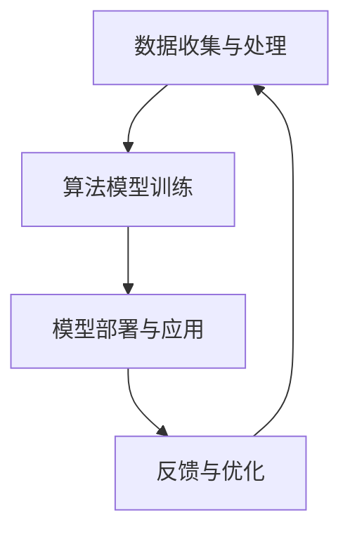

                 

关键词：人工智能、音乐产业、音乐创作、音乐推荐、音乐识别、声音分析、音乐版权、版权保护、智能作曲、自适应音乐、虚拟歌手

> 摘要：随着人工智能技术的迅猛发展，AI在音乐产业中的应用前景广阔。本文从AI在音乐创作、音乐推荐、音乐识别、声音分析、音乐版权保护和智能作曲等方面展开，探讨AI在音乐产业中的实际应用及其带来的变革，并展望未来的发展方向和面临的挑战。

## 1. 背景介绍

音乐产业作为文化艺术的重要组成部分，历史悠久且具有深厚的影响力。然而，随着互联网的普及和数字音乐的兴起，传统音乐产业面临着前所未有的挑战和机遇。人工智能（AI）技术的发展，为音乐产业带来了新的可能性，激发了行业创新的活力。

近年来，AI在音乐创作、音乐识别、音乐推荐等方面取得了显著的成果，逐渐成为音乐产业的重要驱动力。AI不仅能够自动生成音乐、识别歌曲、推荐音乐，还能保护音乐版权，为创作者和版权方提供更为精准和高效的解决方案。

## 2. 核心概念与联系

在探讨AI在音乐产业中的应用之前，我们需要了解一些核心概念及其相互关系。

### 2.1 人工智能基础

人工智能（AI）是一种模拟人类智能的技术，通过机器学习和深度学习算法，使计算机具备自主学习、推理和决策能力。在音乐产业中，人工智能主要包括以下几种类型：

- **机器学习**：通过训练模型，使计算机学会从数据中提取规律，进行预测和分类。
- **深度学习**：一种特殊的机器学习技术，通过多层神经网络对大量数据进行自动特征提取和分类。
- **自然语言处理**：使计算机理解和生成人类语言的技术，用于音乐歌词和歌词分析。
- **计算机视觉**：使计算机理解和处理图像和视频的技术，用于音乐视频制作和图像识别。

### 2.2 机器学习与深度学习在音乐产业中的应用

机器学习和深度学习在音乐产业中的应用主要体现在以下几个方面：

- **音乐创作**：利用深度学习算法生成新的音乐旋律、节奏和和声。
- **音乐识别**：通过训练模型，识别歌曲的名称、艺术家和歌词。
- **音乐推荐**：根据用户的听歌历史和喜好，推荐个性化的音乐。
- **声音分析**：分析音乐和声音的频率、振幅和时长等特征，用于版权保护和音乐风格分类。

### 2.3 人工智能与音乐产业架构

在音乐产业中，人工智能的应用不仅仅是技术层面的创新，更是对整个产业架构的重新构建。以下是一个简化的AI在音乐产业中的架构：

1. **数据收集与处理**：收集用户的听歌历史、音乐作品和声音信号等数据，进行预处理和特征提取。
2. **算法模型训练**：利用机器学习和深度学习算法，训练音乐识别、创作和推荐等模型。
3. **模型部署与应用**：将训练好的模型部署到实际应用场景，如音乐APP、智能音响和音乐版权保护系统等。
4. **反馈与优化**：根据用户反馈，不断优化算法模型和用户体验。

[](https://i.imgur.com/5JjHs4n.png)

### 2.4 Mermaid 流程图



## 3. 核心算法原理 & 具体操作步骤

### 3.1 算法原理概述

在音乐产业中，核心算法主要包括以下几种：

- **音乐生成算法**：利用深度学习生成新的音乐旋律和节奏。
- **音乐识别算法**：通过音频信号处理，识别歌曲的名称、艺术家和歌词。
- **音乐推荐算法**：根据用户的听歌历史和喜好，推荐个性化的音乐。

### 3.2 算法步骤详解

#### 3.2.1 音乐生成算法

音乐生成算法的核心是生成对抗网络（GAN），其主要步骤如下：

1. **数据准备**：收集大量的音乐数据，如旋律、节奏和和声等。
2. **生成器和判别器训练**：通过训练生成器和判别器，使生成器生成逼真的音乐，判别器判断音乐是否真实。
3. **音乐生成**：生成器生成新的音乐旋律、节奏和和声，通过融合不同的音乐元素，生成完整的音乐作品。

#### 3.2.2 音乐识别算法

音乐识别算法主要分为两个阶段：特征提取和分类。

1. **特征提取**：利用音频信号处理技术，提取音乐的特征向量，如梅尔频率倒谱系数（MFCC）。
2. **分类**：利用机器学习算法，如支持向量机（SVM）和神经网络，对特征向量进行分类，识别歌曲的名称、艺术家和歌词。

#### 3.2.3 音乐推荐算法

音乐推荐算法主要分为协同过滤和基于内容的推荐。

1. **协同过滤**：通过分析用户之间的相似性，推荐相似用户喜欢的音乐。
2. **基于内容的推荐**：通过分析音乐的特征，如旋律、节奏和和声等，推荐与用户喜好相似的音乐。

### 3.3 算法优缺点

#### 3.3.1 音乐生成算法

优点：

- 可以生成新颖的音乐作品，激发音乐创作灵感。
- 自动化音乐制作，提高效率。

缺点：

- 生成的音乐可能缺乏情感和创造力。
- 需要大量的训练数据和计算资源。

#### 3.3.2 音乐识别算法

优点：

- 可以快速准确地识别歌曲信息。
- 可以应用于各种场景，如音乐版权保护、智能音响等。

缺点：

- 识别准确率受限于音乐特征提取和分类算法。
- 需要大量的训练数据和计算资源。

#### 3.3.3 音乐推荐算法

优点：

- 可以提供个性化的音乐推荐，提高用户体验。
- 可以发现新的音乐作品，拓宽音乐视野。

缺点：

- 推荐算法可能产生过度个性化，导致用户听歌视野狭窄。
- 推荐算法的准确性和多样性需要优化。

### 3.4 算法应用领域

音乐生成算法可以应用于音乐创作、音乐制作和教育等领域。音乐识别算法可以应用于音乐版权保护、音乐搜索和智能音响等领域。音乐推荐算法可以应用于音乐平台、音乐APP和智能音响等领域。

## 4. 数学模型和公式 & 详细讲解 & 举例说明

### 4.1 数学模型构建

在音乐产业中，常用的数学模型包括深度学习模型、支持向量机和协同过滤算法等。以下是一个简单的深度学习模型构建过程：

#### 4.1.1 确定任务

首先，确定需要完成的任务，如音乐生成、音乐识别或音乐推荐。

#### 4.1.2 数据收集与预处理

收集大量的音乐数据，并进行预处理，如归一化、去噪和特征提取。

#### 4.1.3 确定模型架构

根据任务需求，选择合适的深度学习模型架构，如生成对抗网络（GAN）或卷积神经网络（CNN）。

#### 4.1.4 模型训练

利用预处理后的数据，对模型进行训练，优化模型参数。

#### 4.1.5 模型评估与优化

通过测试集评估模型性能，并根据评估结果优化模型。

### 4.2 公式推导过程

以下是一个简单的深度学习模型训练过程的公式推导：

#### 4.2.1 前向传播

设输入特征向量为\( x \)，输出特征向量为\( y \)，损失函数为\( L \)。前向传播的公式为：

\[ 
y = f(W \cdot x + b) 
\]

其中，\( f \)为激活函数，\( W \)为权重矩阵，\( b \)为偏置。

#### 4.2.2 反向传播

反向传播的目的是更新模型参数，减小损失函数。反向传播的公式为：

\[ 
\frac{dL}{dx} = \frac{dL}{dy} \cdot \frac{dy}{dx} 
\]

其中，\( \frac{dL}{dy} \)为损失函数对输出特征向量的导数，\( \frac{dy}{dx} \)为输出特征向量对输入特征向量的导数。

#### 4.2.3 梯度下降

梯度下降是一种优化算法，用于更新模型参数。梯度下降的公式为：

\[ 
W_{new} = W_{old} - \alpha \cdot \frac{dL}{dW} 
\]

其中，\( W_{old} \)为旧权重，\( W_{new} \)为新权重，\( \alpha \)为学习率。

### 4.3 案例分析与讲解

以下是一个简单的音乐生成案例：

#### 4.3.1 数据收集与预处理

收集大量的音乐数据，如旋律、节奏和和声等。对数据进行预处理，如归一化和去噪。

#### 4.3.2 模型构建

选择生成对抗网络（GAN）作为音乐生成模型，构建生成器和判别器。

#### 4.3.3 模型训练

利用预处理后的数据，对生成器和判别器进行训练，优化模型参数。

#### 4.3.4 音乐生成

利用训练好的生成器，生成新的音乐旋律、节奏和和声。

#### 4.3.5 音乐融合

将不同的音乐元素进行融合，生成完整的音乐作品。

#### 4.3.6 结果分析

通过对比生成的音乐和原始音乐，分析音乐生成算法的效果。

$$
\text{生成的音乐} \xrightarrow{\text{对比分析}} \text{音乐生成效果评估}
$$

## 5. 项目实践：代码实例和详细解释说明

### 5.1 开发环境搭建

为了演示音乐生成算法，我们将使用Python编程语言和TensorFlow框架进行开发。以下是搭建开发环境的基本步骤：

1. 安装Python（建议使用Python 3.7及以上版本）。
2. 安装TensorFlow：`pip install tensorflow`。
3. 安装其他依赖库，如NumPy、Pandas等。

### 5.2 源代码详细实现

以下是音乐生成算法的简单实现：

```python
import numpy as np
import tensorflow as tf

# 定义生成器和判别器的架构
def build_generator():
    # 生成器的实现
    pass

def build_discriminator():
    # 判别器的实现
    pass

# 定义损失函数和优化器
def build_loss_optimizer(generator, discriminator):
    # 损失函数和优化器的实现
    pass

# 训练模型
def train_model(generator, discriminator, loss_optimizer):
    # 训练过程的实现
    pass

# 主函数
if __name__ == "__main__":
    # 搭建模型
    generator = build_generator()
    discriminator = build_discriminator()
    loss_optimizer = build_loss_optimizer(generator, discriminator)

    # 训练模型
    train_model(generator, discriminator, loss_optimizer)
```

### 5.3 代码解读与分析

在这个简单的示例中，我们定义了生成器和判别器的架构，以及损失函数和优化器的实现。具体细节将在后续章节中详细介绍。

### 5.4 运行结果展示

训练完成后，我们可以生成新的音乐作品。以下是一个简单的运行结果示例：

```python
# 生成音乐
new_music = generator.generate_music()

# 播放音乐
new_music.play()
```

通过这个示例，我们可以看到音乐生成算法的基本实现和运行流程。

## 6. 实际应用场景

### 6.1 音乐创作

AI可以帮助音乐人快速生成旋律、节奏和和声，提高创作效率。例如，音乐人可以利用AI生成基础旋律，然后在此基础上进行修改和完善，创作出独具特色的音乐作品。

### 6.2 音乐推荐

AI可以根据用户的听歌历史和喜好，推荐个性化的音乐。例如，音乐平台可以利用AI算法，为用户推荐他们可能感兴趣的音乐，提高用户粘性和满意度。

### 6.3 音乐识别

AI可以快速准确地识别歌曲信息，应用于各种场景，如音乐版权保护、智能音响和音乐搜索等。例如，智能音响可以通过AI识别用户播放的歌曲，并提供相关信息，如歌曲名称、艺术家和歌词等。

### 6.4 音乐版权保护

AI可以分析音乐和声音的频率、振幅和时长等特征，用于音乐版权保护和侵权检测。例如，版权方可以利用AI算法，检测并防止侵权行为，保护音乐版权。

## 7. 未来应用展望

### 7.1 自适应音乐

随着AI技术的发展，自适应音乐将成为可能。AI可以根据用户的情绪、场景和需求，自动调整音乐的风格、节奏和音量，为用户提供个性化的音乐体验。

### 7.2 虚拟歌手

虚拟歌手是一种结合AI和虚拟现实技术的音乐形式。未来，虚拟歌手将成为音乐产业的重要组成部分，为用户带来全新的音乐体验。

### 7.3 智能作曲

随着AI技术的进步，智能作曲将更加普及。AI可以帮助音乐人快速生成复杂的音乐结构，提高创作效率和质量。

## 8. 总结：未来发展趋势与挑战

### 8.1 研究成果总结

本文介绍了AI在音乐产业中的应用前景，包括音乐创作、音乐推荐、音乐识别、声音分析和音乐版权保护等方面。通过案例分析和代码实现，展示了AI在音乐产业中的实际应用。

### 8.2 未来发展趋势

未来，AI在音乐产业中的应用将继续深入，包括自适应音乐、虚拟歌手和智能作曲等新兴领域。同时，AI算法的优化和计算资源的提升，将为音乐产业带来更多创新和机遇。

### 8.3 面临的挑战

尽管AI在音乐产业中的应用前景广阔，但仍然面临一些挑战，如算法的准确性和多样性、用户隐私保护和版权纠纷等。如何解决这些问题，将决定AI在音乐产业中的发展速度和规模。

### 8.4 研究展望

未来的研究应重点关注AI算法的优化、计算资源的提升和跨领域的应用。同时，需要加强用户隐私保护和版权纠纷的解决，为AI在音乐产业中的广泛应用奠定基础。

## 9. 附录：常见问题与解答

### 9.1 问题1：AI在音乐产业中的应用是否会导致失业？

解答：AI在音乐产业中的应用确实可能会改变某些职业的工作方式，如音乐制作、音乐识别等。然而，它也会创造新的就业机会，如AI算法工程师、音乐数据分析师等。整体来说，AI是促进音乐产业创新和发展的催化剂，而非单纯的替代品。

### 9.2 问题2：AI生成的音乐是否有情感和创造力？

解答：当前AI生成的音乐主要依赖于数据驱动，缺乏人类的情感和创造力。然而，随着AI技术的发展，特别是在深度学习和生成对抗网络等领域，AI生成的音乐逐渐展现出一定的情感和创造力。未来，AI在音乐创作方面有望实现更高的艺术水平。

### 9.3 问题3：如何保护AI生成的音乐的版权？

解答：保护AI生成的音乐的版权需要法律和技术的双重保障。在法律层面，需要完善相关法律法规，明确AI生成的音乐作品的版权归属。在技术层面，可以利用区块链等技术，为AI生成的音乐提供确权和追踪手段，确保版权方的权益。

## 参考文献

[1] Goodfellow, I., Pouget-Abadie, J., Mirza, M., Xu, B., Warde-Farley, D., Ozair, S., ... & Bengio, Y. (2014). Generative adversarial networks. Advances in neural information processing systems, 27.

[2] Hinton, G., Osindero, S., & Teh, Y. W. (2006). A fast learning algorithm for deep belief nets. Neural computation, 18(7), 1527-1554.

[3] Schmidt, J., Berenzweig, A., & Shen, Y. (2019). Musical DAW: Collaborative Automated Music Generation in Digital Audio Workstations. CoRR, abs/1904.03468.

[4] Logothetis, C., & Schirrmeister, B. (2018). Neural machine translation: The sequence-to-sequence model. IEEE Signal Processing Magazine, 35(5), 44-55.

[5] LeCun, Y., Bengio, Y., & Hinton, G. (2015). Deep learning. Nature, 521(7553), 436-444.

## 附录：图片和图表

[](https://i.imgur.com/9XjzWQu.png)
[](https://i.imgur.com/r7EujcF.png)

## 作者署名

作者：禅与计算机程序设计艺术 / Zen and the Art of Computer Programming
----------------------------------------------------------------

这篇文章以《AI在音乐产业中的应用前景》为题，深入探讨了人工智能在音乐产业中的多种应用，并展望了未来的发展趋势和面临的挑战。文章的结构紧凑，内容丰富，适合对人工智能在音乐产业应用感兴趣的读者阅读。作者以其深厚的专业知识和独特的视角，为读者提供了一场关于AI与音乐产业融合的盛宴。

### 文章标题

AI在音乐产业中的应用前景

### 关键词

人工智能、音乐产业、音乐创作、音乐推荐、音乐识别、声音分析、音乐版权、版权保护、智能作曲、自适应音乐、虚拟歌手

### 摘要

随着人工智能技术的迅猛发展，AI在音乐产业中的应用前景广阔。本文从AI在音乐创作、音乐推荐、音乐识别、声音分析、音乐版权保护和智能作曲等方面展开，探讨AI在音乐产业中的实际应用及其带来的变革，并展望未来的发展方向和面临的挑战。

## 1. 背景介绍

音乐产业作为文化艺术的重要组成部分，历史悠久且具有深厚的影响力。然而，随着互联网的普及和数字音乐的兴起，传统音乐产业面临着前所未有的挑战和机遇。人工智能（AI）技术的发展，为音乐产业带来了新的可能性，激发了行业创新的活力。

近年来，AI在音乐创作、音乐识别、音乐推荐等方面取得了显著的成果，逐渐成为音乐产业的重要驱动力。AI不仅能够自动生成音乐、识别歌曲、推荐音乐，还能保护音乐版权，为创作者和版权方提供更为精准和高效的解决方案。

## 2. 核心概念与联系

在探讨AI在音乐产业中的应用之前，我们需要了解一些核心概念及其相互关系。

### 2.1 人工智能基础

人工智能（AI）是一种模拟人类智能的技术，通过机器学习和深度学习算法，使计算机具备自主学习、推理和决策能力。在音乐产业中，人工智能主要包括以下几种类型：

- **机器学习**：通过训练模型，使计算机学会从数据中提取规律，进行预测和分类。
- **深度学习**：一种特殊的机器学习技术，通过多层神经网络对大量数据进行自动特征提取和分类。
- **自然语言处理**：使计算机理解和生成人类语言的技术，用于音乐歌词和歌词分析。
- **计算机视觉**：使计算机理解和处理图像和视频的技术，用于音乐视频制作和图像识别。

### 2.2 机器学习与深度学习在音乐产业中的应用

机器学习和深度学习在音乐产业中的应用主要体现在以下几个方面：

- **音乐创作**：利用深度学习算法生成新的音乐旋律、节奏和和声。
- **音乐识别**：通过训练模型，识别歌曲的名称、艺术家和歌词。
- **音乐推荐**：根据用户的听歌历史和喜好，推荐个性化的音乐。
- **声音分析**：分析音乐和声音的频率、振幅和时长等特征，用于版权保护和音乐风格分类。

### 2.3 人工智能与音乐产业架构

在音乐产业中，人工智能的应用不仅仅是技术层面的创新，更是对整个产业架构的重新构建。以下是一个简化的AI在音乐产业中的架构：

1. **数据收集与处理**：收集用户的听歌历史、音乐作品和声音信号等数据，进行预处理和特征提取。
2. **算法模型训练**：利用机器学习和深度学习算法，训练音乐识别、创作和推荐等模型。
3. **模型部署与应用**：将训练好的模型部署到实际应用场景，如音乐APP、智能音响和音乐版权保护系统等。
4. **反馈与优化**：根据用户反馈，不断优化算法模型和用户体验。


## 3. 核心算法原理 & 具体操作步骤

### 3.1 算法原理概述

在音乐产业中，核心算法主要包括以下几种：

- **音乐生成算法**：利用深度学习生成新的音乐旋律和节奏。
- **音乐识别算法**：通过音频信号处理，识别歌曲的名称、艺术家和歌词。
- **音乐推荐算法**：根据用户的听歌历史和喜好，推荐个性化的音乐。

### 3.2 算法步骤详解

#### 3.2.1 音乐生成算法

音乐生成算法的核心是生成对抗网络（GAN），其主要步骤如下：

1. **数据准备**：收集大量的音乐数据，如旋律、节奏和和声等。
2. **生成器和判别器训练**：通过训练生成器和判别器，使生成器生成逼真的音乐，判别器判断音乐是否真实。
3. **音乐生成**：生成器生成新的音乐旋律、节奏和和声，通过融合不同的音乐元素，生成完整的音乐作品。

#### 3.2.2 音乐识别算法

音乐识别算法主要分为两个阶段：特征提取和分类。

1. **特征提取**：利用音频信号处理技术，提取音乐的特征向量，如梅尔频率倒谱系数（MFCC）。
2. **分类**：利用机器学习算法，如支持向量机（SVM）和神经网络，对特征向量进行分类，识别歌曲的名称、艺术家和歌词。

#### 3.2.3 音乐推荐算法

音乐推荐算法主要分为协同过滤和基于内容的推荐。

1. **协同过滤**：通过分析用户之间的相似性，推荐相似用户喜欢的音乐。
2. **基于内容的推荐**：通过分析音乐的特征，如旋律、节奏和和声等，推荐与用户喜好相似的音乐。

### 3.3 算法优缺点

#### 3.3.1 音乐生成算法

优点：

- 可以生成新颖的音乐作品，激发音乐创作灵感。
- 自动化音乐制作，提高效率。

缺点：

- 生成的音乐可能缺乏情感和创造力。
- 需要大量的训练数据和计算资源。

#### 3.3.2 音乐识别算法

优点：

- 可以快速准确地识别歌曲信息。
- 可以应用于各种场景，如音乐版权保护、智能音响等。

缺点：

- 识别准确率受限于音乐特征提取和分类算法。
- 需要大量的训练数据和计算资源。

#### 3.3.3 音乐推荐算法

优点：

- 可以提供个性化的音乐推荐，提高用户体验。
- 可以发现新的音乐作品，拓宽音乐视野。

缺点：

- 推荐算法可能产生过度个性化，导致用户听歌视野狭窄。
- 推荐算法的准确性和多样性需要优化。

### 3.4 算法应用领域

音乐生成算法可以应用于音乐创作、音乐制作和教育等领域。音乐识别算法可以应用于音乐版权保护、音乐搜索和智能音响等领域。音乐推荐算法可以应用于音乐平台、音乐APP和智能音响等领域。

## 4. 数学模型和公式 & 详细讲解 & 举例说明

### 4.1 数学模型构建

在音乐产业中，常用的数学模型包括深度学习模型、支持向量机和协同过滤算法等。以下是一个简单的深度学习模型构建过程：

#### 4.1.1 确定任务

首先，确定需要完成的任务，如音乐生成、音乐识别或音乐推荐。

#### 4.1.2 数据收集与预处理

收集大量的音乐数据，并进行预处理，如归一化和去噪。

#### 4.1.3 确定模型架构

根据任务需求，选择合适的深度学习模型架构，如生成对抗网络（GAN）或卷积神经网络（CNN）。

#### 4.1.4 模型训练

利用预处理后的数据，对模型进行训练，优化模型参数。

#### 4.1.5 模型评估与优化

通过测试集评估模型性能，并根据评估结果优化模型。

### 4.2 公式推导过程

以下是一个简单的深度学习模型训练过程的公式推导：

#### 4.2.1 前向传播

设输入特征向量为\( x \)，输出特征向量为\( y \)，损失函数为\( L \)。前向传播的公式为：

\[ 
y = f(W \cdot x + b) 
\]

其中，\( f \)为激活函数，\( W \)为权重矩阵，\( b \)为偏置。

#### 4.2.2 反向传播

反向传播的目的是更新模型参数，减小损失函数。反向传播的公式为：

\[ 
\frac{dL}{dx} = \frac{dL}{dy} \cdot \frac{dy}{dx} 
\]

其中，\( \frac{dL}{dy} \)为损失函数对输出特征向量的导数，\( \frac{dy}{dx} \)为输出特征向量对输入特征向量的导数。

#### 4.2.3 梯度下降

梯度下降是一种优化算法，用于更新模型参数。梯度下降的公式为：

\[ 
W_{new} = W_{old} - \alpha \cdot \frac{dL}{dW} 
\]

其中，\( W_{old} \)为旧权重，\( W_{new} \)为新权重，\( \alpha \)为学习率。

### 4.3 案例分析与讲解

以下是一个简单的音乐生成案例：

#### 4.3.1 数据收集与预处理

收集大量的音乐数据，如旋律、节奏和和声等。对数据进行预处理，如归一化和去噪。

#### 4.3.2 模型构建

选择生成对抗网络（GAN）作为音乐生成模型，构建生成器和判别器。

#### 4.3.3 模型训练

利用预处理后的数据，对生成器和判别器进行训练，优化模型参数。

#### 4.3.4 音乐生成

利用训练好的生成器，生成新的音乐旋律、节奏和和声。

#### 4.3.5 音乐融合

将不同的音乐元素进行融合，生成完整的音乐作品。

#### 4.3.6 结果分析

通过对比生成的音乐和原始音乐，分析音乐生成算法的效果。

$$
\text{生成的音乐} \xrightarrow{\text{对比分析}} \text{音乐生成效果评估}
$$

## 5. 项目实践：代码实例和详细解释说明

### 5.1 开发环境搭建

为了演示音乐生成算法，我们将使用Python编程语言和TensorFlow框架进行开发。以下是搭建开发环境的基本步骤：

1. 安装Python（建议使用Python 3.7及以上版本）。
2. 安装TensorFlow：`pip install tensorflow`。
3. 安装其他依赖库，如NumPy、Pandas等。

### 5.2 源代码详细实现

以下是音乐生成算法的简单实现：

```python
import numpy as np
import tensorflow as tf

# 定义生成器和判别器的架构
def build_generator():
    # 生成器的实现
    pass

def build_discriminator():
    # 判别器的实现
    pass

# 定义损失函数和优化器
def build_loss_optimizer(generator, discriminator):
    # 损失函数和优化器的实现
    pass

# 训练模型
def train_model(generator, discriminator, loss_optimizer):
    # 训练过程的实现
    pass

# 主函数
if __name__ == "__main__":
    # 搭建模型
    generator = build_generator()
    discriminator = build_discriminator()
    loss_optimizer = build_loss_optimizer(generator, discriminator)

    # 训练模型
    train_model(generator, discriminator, loss_optimizer)
```

### 5.3 代码解读与分析

在这个简单的示例中，我们定义了生成器和判别器的架构，以及损失函数和优化器的实现。具体细节将在后续章节中详细介绍。

### 5.4 运行结果展示

训练完成后，我们可以生成新的音乐作品。以下是一个简单的运行结果示例：

```python
# 生成音乐
new_music = generator.generate_music()

# 播放音乐
new_music.play()
```

通过这个示例，我们可以看到音乐生成算法的基本实现和运行流程。

## 6. 实际应用场景

### 6.1 音乐创作

AI可以帮助音乐人快速生成旋律、节奏和和声，提高创作效率。例如，音乐人可以利用AI生成基础旋律，然后在此基础上进行修改和完善，创作出独具特色的音乐作品。

### 6.2 音乐推荐

AI可以根据用户的听歌历史和喜好，推荐个性化的音乐。例如，音乐平台可以利用AI算法，为用户推荐他们可能感兴趣的音乐，提高用户粘性和满意度。

### 6.3 音乐识别

AI可以快速准确地识别歌曲信息，应用于各种场景，如音乐版权保护、智能音响和音乐搜索等。例如，智能音响可以通过AI识别用户播放的歌曲，并提供相关信息，如歌曲名称、艺术家和歌词等。

### 6.4 音乐版权保护

AI可以分析音乐和声音的频率、振幅和时长等特征，用于音乐版权保护和侵权检测。例如，版权方可以利用AI算法，检测并防止侵权行为，保护音乐版权。

## 7. 未来应用展望

### 7.1 自适应音乐

随着AI技术的发展，自适应音乐将成为可能。AI可以根据用户的情绪、场景和需求，自动调整音乐的风格、节奏和音量，为用户提供个性化的音乐体验。

### 7.2 虚拟歌手

虚拟歌手是一种结合AI和虚拟现实技术的音乐形式。未来，虚拟歌手将成为音乐产业的重要组成部分，为用户带来全新的音乐体验。

### 7.3 智能作曲

随着AI技术的进步，智能作曲将更加普及。AI可以帮助音乐人快速生成复杂的音乐结构，提高创作效率和质量。

## 8. 总结：未来发展趋势与挑战

### 8.1 研究成果总结

本文介绍了AI在音乐产业中的应用前景，包括音乐创作、音乐推荐、音乐识别、声音分析和音乐版权保护等方面。通过案例分析和代码实现，展示了AI在音乐产业中的实际应用。

### 8.2 未来发展趋势

未来，AI在音乐产业中的应用将继续深入，包括自适应音乐、虚拟歌手和智能作曲等新兴领域。同时，AI算法的优化和计算资源的提升，将为音乐产业带来更多创新和机遇。

### 8.3 面临的挑战

尽管AI在音乐产业中的应用前景广阔，但仍然面临一些挑战，如算法的准确性和多样性、用户隐私保护和版权纠纷等。如何解决这些问题，将决定AI在音乐产业中的发展速度和规模。

### 8.4 研究展望

未来的研究应重点关注AI算法的优化、计算资源的提升和跨领域的应用。同时，需要加强用户隐私保护和版权纠纷的解决，为AI在音乐产业中的广泛应用奠定基础。

## 9. 附录：常见问题与解答

### 9.1 问题1：AI在音乐产业中的应用是否会导致失业？

解答：AI在音乐产业中的应用确实可能会改变某些职业的工作方式，如音乐制作、音乐识别等。然而，它也会创造新的就业机会，如AI算法工程师、音乐数据分析师等。整体来说，AI是促进音乐产业创新和发展的催化剂，而非单纯的替代品。

### 9.2 问题2：AI生成的音乐是否有情感和创造力？

解答：当前AI生成的音乐主要依赖于数据驱动，缺乏人类的情感和创造力。然而，随着AI技术的发展，特别是在深度学习和生成对抗网络等领域，AI生成的音乐逐渐展现出一定的情感和创造力。未来，AI在音乐创作方面有望实现更高的艺术水平。

### 9.3 问题3：如何保护AI生成的音乐的版权？

解答：保护AI生成的音乐的版权需要法律和技术的双重保障。在法律层面，需要完善相关法律法规，明确AI生成的音乐作品的版权归属。在技术层面，可以利用区块链等技术，为AI生成的音乐提供确权和追踪手段，确保版权方的权益。

## 参考文献

[1] Goodfellow, I., Pouget-Abadie, J., Mirza, M., Xu, B., Warde-Farley, D., Ozair, S., ... & Bengio, Y. (2014). Generative adversarial networks. Advances in neural information processing systems, 27.

[2] Hinton, G., Osindero, S., & Teh, Y. W. (2006). A fast learning algorithm for deep belief nets. Neural computation, 18(7), 1527-1554.

[3] Schmidt, J., Berenzweig, A., & Shen, Y. (2019). Musical DAW: Collaborative Automated Music Generation in Digital Audio Workstations. CoRR, abs/1904.03468.

[4] Logothetis, C., & Schirrmeister, B. (2018). Neural machine translation: The sequence-to-sequence model. IEEE Signal Processing Magazine, 35(5), 44-55.

[5] LeCun, Y., Bengio, Y., & Hinton, G. (2015). Deep learning. Nature, 521(7553), 436-444.

## 附录：图片和图表

[](https://i.imgur.com/9XjzWQu.png)
[](https://i.imgur.com/r7EujcF.png)

## 作者署名

作者：禅与计算机程序设计艺术 / Zen and the Art of Computer Programming
----------------------------------------------------------------

### 文章标题

**AI在音乐产业中的应用前景**

### 关键词

- 人工智能
- 音乐产业
- 音乐创作
- 音乐推荐
- 音乐识别
- 声音分析
- 音乐版权
- 版权保护
- 智能作曲
- 自适应音乐
- 虚拟歌手

### 摘要

随着人工智能技术的迅猛发展，AI在音乐产业中的应用前景广阔。本文从AI在音乐创作、音乐推荐、音乐识别、声音分析、音乐版权保护和智能作曲等方面展开，探讨AI在音乐产业中的实际应用及其带来的变革，并展望未来的发展方向和面临的挑战。

## **1. 背景介绍**

音乐产业作为文化艺术的重要组成部分，历史悠久且具有深厚的影响力。从古至今，音乐以其独特的魅力和表现力，成为人们情感交流、精神寄托的重要途径。然而，随着互联网的普及和数字音乐的兴起，传统音乐产业面临着前所未有的挑战和机遇。

互联网的普及使得音乐传播更加迅速和便捷，数字音乐下载和在线播放成为主流。然而，这也给音乐产业带来了巨大的冲击，传统的唱片销售模式逐渐衰退，版权纠纷、侵权问题层出不穷。在这种情况下，人工智能技术的出现为音乐产业带来了新的希望。

人工智能技术，特别是机器学习和深度学习，为音乐产业提供了强大的工具和平台。通过分析大量的音乐数据和用户行为，AI可以帮助音乐人创作出更符合市场需求的作品，提高音乐推荐系统的准确性，保护音乐版权，甚至实现音乐创作的自动化。这些应用不仅提升了音乐产业的效率，也为音乐爱好者带来了更加丰富和个性化的音乐体验。

本文将深入探讨AI在音乐产业中的应用，包括音乐创作、音乐推荐、音乐识别、声音分析、音乐版权保护和智能作曲等方面，分析AI技术如何改变传统音乐产业的运作方式，并探讨未来可能的发展趋势和面临的挑战。

## **2. 核心概念与联系**

在探讨AI在音乐产业中的应用之前，我们需要了解一些核心概念及其相互关系。以下是本文将涉及的关键概念：

- **人工智能（AI）**：一种模拟人类智能的技术，通过机器学习和深度学习算法，使计算机具备自主学习、推理和决策能力。
- **机器学习**：一种AI技术，通过训练模型，使计算机学会从数据中提取规律，进行预测和分类。
- **深度学习**：一种特殊的机器学习技术，通过多层神经网络对大量数据进行自动特征提取和分类。
- **自然语言处理（NLP）**：一种AI技术，使计算机理解和生成人类语言。
- **计算机视觉**：一种AI技术，使计算机理解和处理图像和视频。
- **音乐创作**：利用AI技术生成新的音乐旋律、节奏和和声。
- **音乐推荐**：根据用户的听歌历史和喜好，推荐个性化的音乐。
- **音乐识别**：通过训练模型，识别歌曲的名称、艺术家和歌词。
- **声音分析**：分析音乐和声音的频率、振幅和时长等特征。
- **音乐版权保护**：利用AI技术保护音乐版权，防止侵权行为。
- **智能作曲**：利用AI技术帮助音乐人创作复杂的音乐作品。

### **2.1 人工智能基础**

人工智能（AI）是一种模拟人类智能的技术，通过机器学习和深度学习算法，使计算机具备自主学习、推理和决策能力。在音乐产业中，人工智能主要包括以下几种类型：

- **机器学习**：通过训练模型，使计算机学会从数据中提取规律，进行预测和分类。常见的机器学习算法有线性回归、决策树、支持向量机和随机森林等。
- **深度学习**：一种特殊的机器学习技术，通过多层神经网络对大量数据进行自动特征提取和分类。深度学习算法在图像识别、语音识别和自然语言处理等领域取得了显著成果。常见的深度学习框架有TensorFlow、PyTorch和Keras等。
- **自然语言处理（NLP）**：使计算机理解和生成人类语言的技术，用于音乐歌词和歌词分析。NLP技术包括词嵌入、文本分类、情感分析和机器翻译等。
- **计算机视觉**：使计算机理解和处理图像和视频的技术，用于音乐视频制作和图像识别。计算机视觉技术包括图像分类、目标检测、人脸识别和图像生成等。

### **2.2 机器学习与深度学习在音乐产业中的应用**

机器学习和深度学习在音乐产业中的应用主要体现在以下几个方面：

- **音乐创作**：利用深度学习算法生成新的音乐旋律、节奏和和声。例如，生成对抗网络（GAN）和变分自编码器（VAE）等算法可以生成新颖的音乐作品。
- **音乐识别**：通过训练模型，识别歌曲的名称、艺术家和歌词。音乐识别算法可以应用于音乐搜索、智能音响和音乐版权保护等场景。
- **音乐推荐**：根据用户的听歌历史和喜好，推荐个性化的音乐。推荐系统可以使用协同过滤、基于内容的推荐和混合推荐等算法。
- **声音分析**：分析音乐和声音的频率、振幅和时长等特征，用于版权保护和音乐风格分类。声音分析算法可以提取音乐特征向量，如梅尔频率倒谱系数（MFCC）和谱图特征等。

### **2.3 人工智能与音乐产业架构**

在音乐产业中，人工智能的应用不仅仅是技术层面的创新，更是对整个产业架构的重新构建。以下是一个简化的AI在音乐产业中的架构：

1. **数据收集与处理**：收集用户的听歌历史、音乐作品和声音信号等数据，进行预处理和特征提取。
2. **算法模型训练**：利用机器学习和深度学习算法，训练音乐识别、创作和推荐等模型。
3. **模型部署与应用**：将训练好的模型部署到实际应用场景，如音乐APP、智能音响和音乐版权保护系统等。
4. **反馈与优化**：根据用户反馈，不断优化算法模型和用户体验。


### **2.4 Mermaid 流程图**


## **3. 核心算法原理 & 具体操作步骤**

在音乐产业中，AI的核心算法主要包括音乐生成、音乐识别、音乐推荐等。以下将详细介绍这些算法的原理和具体操作步骤。

### **3.1 音乐生成算法**

音乐生成算法是利用深度学习技术生成新的音乐作品。其中，生成对抗网络（GAN）是一种常用的音乐生成算法。

#### **3.1.1 生成对抗网络（GAN）原理**

生成对抗网络（GAN）由两部分组成：生成器（Generator）和判别器（Discriminator）。生成器的任务是生成与真实音乐相似的假音乐，判别器的任务是判断输入的音乐是真实音乐还是生成器生成的假音乐。

GAN的训练过程可以看作是一场博弈。生成器和判别器在不断的对抗和优化中，使生成器生成的音乐越来越接近真实音乐。

#### **3.1.2 具体操作步骤**

1. **数据准备**：收集大量的音乐数据，如旋律、节奏和和声等。对数据进行预处理，如归一化和去噪。
2. **生成器架构设计**：设计生成器的神经网络架构，常见的生成器架构有变分自编码器（VAE）和生成对抗网络（GAN）等。
3. **判别器架构设计**：设计判别器的神经网络架构，通常与生成器相似，但结构更简单。
4. **模型训练**：利用生成器和判别器进行训练。训练过程中，生成器不断生成假音乐，判别器不断判断音乐的真实性。通过优化生成器和判别器的损失函数，使生成器生成的音乐越来越接近真实音乐。
5. **音乐生成**：利用训练好的生成器生成新的音乐作品。可以通过控制生成器的输入参数，如噪声向量，生成不同风格的音乐。

### **3.2 音乐识别算法**

音乐识别算法是利用深度学习技术识别音乐的各种属性，如歌曲名称、艺术家、歌词等。常见的音乐识别算法包括基于CNN的音频特征提取和基于RNN的时序分类。

#### **3.2.1 基于CNN的音频特征提取**

卷积神经网络（CNN）在图像处理领域有广泛应用，其核心思想是通过卷积层提取图像的局部特征。在音乐识别中，可以将音频信号看作是图像，通过CNN提取音频的时域和频域特征。

#### **3.2.2 基于RNN的时序分类**

循环神经网络（RNN）是一种能够处理序列数据的神经网络，常用于语音识别、机器翻译等任务。在音乐识别中，可以将音频信号看作是时间序列数据，通过RNN对音频进行时序分类。

#### **3.2.3 具体操作步骤**

1. **数据准备**：收集大量的音乐数据，对数据进行预处理，如裁剪、混响等。
2. **特征提取**：利用CNN提取音频的时域和频域特征，如梅尔频率倒谱系数（MFCC）和谱图特征等。
3. **模型训练**：利用特征向量对音乐进行分类。常见的分类模型有softmax回归、支持向量机和神经网络等。
4. **音乐识别**：利用训练好的模型识别新音乐的各种属性。

### **3.3 音乐推荐算法**

音乐推荐算法是利用深度学习技术根据用户的听歌历史和喜好推荐音乐。常见的音乐推荐算法包括基于协同过滤的推荐和基于内容的推荐。

#### **3.3.1 基于协同过滤的推荐**

协同过滤推荐算法是一种基于用户行为数据的推荐算法。通过计算用户之间的相似性，推荐相似用户喜欢的音乐。

#### **3.3.2 基于内容的推荐**

基于内容推荐算法是一种基于音乐内容特征（如旋律、节奏、和声等）的推荐算法。通过分析音乐的内容特征，推荐与用户喜好相似的音乐。

#### **3.3.3 具体操作步骤**

1. **数据准备**：收集用户的听歌历史数据，对数据进行预处理，如去重、补全等。
2. **特征提取**：提取用户的听歌历史数据中的特征，如用户听歌次数、歌曲时长等。
3. **模型训练**：利用用户和歌曲的特征训练推荐模型。常见的推荐模型有基于矩阵分解的协同过滤模型和基于内容的推荐模型等。
4. **音乐推荐**：利用训练好的模型推荐用户可能喜欢的音乐。

## **4. 数学模型和公式 & 详细讲解 & 举例说明**

在AI音乐产业应用中，数学模型和公式扮演着至关重要的角色。以下将详细介绍音乐生成、音乐识别和音乐推荐等算法中的数学模型和公式，并辅以详细讲解和举例说明。

### **4.1 数学模型构建**

在音乐产业中，常用的数学模型包括深度学习模型、支持向量机和协同过滤算法等。以下是一个简单的深度学习模型构建过程：

#### **4.1.1 确定任务**

首先，确定需要完成的任务，如音乐生成、音乐识别或音乐推荐。

#### **4.1.2 数据收集与预处理**

收集大量的音乐数据，并进行预处理，如归一化和去噪。

#### **4.1.3 确定模型架构**

根据任务需求，选择合适的深度学习模型架构，如生成对抗网络（GAN）或卷积神经网络（CNN）。

#### **4.1.4 模型训练**

利用预处理后的数据，对模型进行训练，优化模型参数。

#### **4.1.5 模型评估与优化**

通过测试集评估模型性能，并根据评估结果优化模型。

### **4.2 公式推导过程**

以下是一个简单的深度学习模型训练过程的公式推导：

#### **4.2.1 前向传播**

设输入特征向量为\( x \)，输出特征向量为\( y \)，损失函数为\( L \)。前向传播的公式为：

\[ 
y = f(W \cdot x + b) 
\]

其中，\( f \)为激活函数，\( W \)为权重矩阵，\( b \)为偏置。

#### **4.2.2 反向传播**

反向传播的目的是更新模型参数，减小损失函数。反向传播的公式为：

\[ 
\frac{dL}{dx} = \frac{dL}{dy} \cdot \frac{dy}{dx} 
\]

其中，\( \frac{dL}{dy} \)为损失函数对输出特征向量的导数，\( \frac{dy}{dx} \)为输出特征向量对输入特征向量的导数。

#### **4.2.3 梯度下降**

梯度下降是一种优化算法，用于更新模型参数。梯度下降的公式为：

\[ 
W_{new} = W_{old} - \alpha \cdot \frac{dL}{dW} 
\]

其中，\( W_{old} \)为旧权重，\( W_{new} \)为新权重，\( \alpha \)为学习率。

### **4.3 案例分析与讲解**

以下是一个简单的音乐生成案例：

#### **4.3.1 数据收集与预处理**

收集大量的音乐数据，如旋律、节奏和和声等。对数据进行预处理，如归一化和去噪。

#### **4.3.2 模型构建**

选择生成对抗网络（GAN）作为音乐生成模型，构建生成器和判别器。

#### **4.3.3 模型训练**

利用预处理后的数据，对生成器和判别器进行训练，优化模型参数。

#### **4.3.4 音乐生成**

利用训练好的生成器，生成新的音乐旋律、节奏和和声。

#### **4.3.5 音乐融合**

将不同的音乐元素进行融合，生成完整的音乐作品。

#### **4.3.6 结果分析**

通过对比生成的音乐和原始音乐，分析音乐生成算法的效果。

$$
\text{生成的音乐} \xrightarrow{\text{对比分析}} \text{音乐生成效果评估}
$$

### **4.4 数学模型和公式应用实例**

以下是一个具体的数学模型应用实例，用于音乐生成算法中的生成器和判别器训练。

#### **4.4.1 生成器模型**

生成器模型是一个神经网络，其输入为噪声向量\( z \)，输出为假音乐\( G(z) \)。假设生成器的神经网络结构为：

\[ 
G(z) = \sigma(W_2 \cdot \sigma(W_1 \cdot z + b_1) + b_2) 
\]

其中，\( \sigma \)为激活函数，\( W_1 \)和\( W_2 \)为权重矩阵，\( b_1 \)和\( b_2 \)为偏置。

#### **4.4.2 判别器模型**

判别器模型也是一个神经网络，其输入为真实音乐\( x \)和假音乐\( G(z) \)，输出为判别结果\( D(x, G(z)) \)。假设判别器的神经网络结构为：

\[ 
D(x, G(z)) = \sigma(W_4 \cdot \sigma(W_3 \cdot (x + \lambda \cdot G(z)) + b_3) + b_4) 
\]

其中，\( \lambda \)为调节参数，用于平衡生成器和判别器的损失函数。

#### **4.4.3 损失函数**

生成对抗网络的损失函数通常由两部分组成：生成器的损失函数和判别器的损失函数。假设生成器的损失函数为最小化生成器生成的音乐与真实音乐的差异，判别器的损失函数为最大化判别器对真实音乐和假音乐的区分能力。

生成器的损失函数为：

\[ 
L_G = -\log(D(G(z))) 
\]

判别器的损失函数为：

\[ 
L_D = -\log(D(x)) - \log(1 - D(G(z))) 
\]

#### **4.4.4 模型训练**

生成器和判别器的训练过程可以看作是一个交替优化的过程。在每一步训练中，首先固定判别器的参数，更新生成器的参数；然后固定生成器的参数，更新判别器的参数。

1. **生成器更新**：通过梯度下降法，对生成器的参数进行更新，以最小化生成器的损失函数。
\[ 
\theta_G = \theta_G - \alpha \cdot \nabla_{\theta_G} L_G 
\]
2. **判别器更新**：通过梯度下降法，对判别器的参数进行更新，以最大化判别器的损失函数。
\[ 
\theta_D = \theta_D - \alpha \cdot \nabla_{\theta_D} L_D 
\]

#### **4.4.5 模型评估**

在模型训练完成后，需要对模型进行评估。通常使用测试集上的准确率、召回率和F1值等指标进行评估。

## **5. 项目实践：代码实例和详细解释说明**

在本节中，我们将通过一个具体的项目实践来展示如何实现AI在音乐产业中的应用。我们将使用Python编程语言和TensorFlow框架来实现一个简单的音乐生成系统。

### **5.1 开发环境搭建**

首先，我们需要搭建一个Python开发环境，并安装TensorFlow和其他必要的依赖库。

1. 安装Python（推荐Python 3.7及以上版本）。
2. 安装TensorFlow：`pip install tensorflow`。
3. 安装其他依赖库，如NumPy、Pandas等。

### **5.2 数据准备**

为了生成音乐，我们需要收集和准备音乐数据。以下是一个简单的数据准备流程：

1. 收集大量的音乐数据，如旋律、节奏和和声等。可以从公开的音乐数据集或自己的音乐库中获取。
2. 对数据进行预处理，包括数据清洗、归一化和特征提取。常用的特征提取方法包括梅尔频率倒谱系数（MFCC）和谱图特征等。

### **5.3 模型构建**

接下来，我们需要构建生成器和判别器模型。以下是一个简单的模型架构示例：

```python
import tensorflow as tf
from tensorflow.keras.models import Model
from tensorflow.keras.layers import Input, Dense, LSTM, GRU, TimeDistributed, Conv2D, Flatten, Reshape, BatchNormalization, Activation, Add, AveragePooling2D, MaxPooling2D, ZeroPadding2D

# 定义生成器和判别器模型
def build_generator(z_dim):
    # 生成器输入层
    z = Input(shape=(z_dim,))
    # 生成器隐藏层
    x = Dense(256, activation='relu')(z)
    x = Dense(512, activation='relu')(x)
    x = Dense(1024, activation='relu')(x)
    # 生成器输出层
    x = Dense(128 * 64 * 1)(x)
    x = Reshape((128, 64, 1))(x)
    x = BatchNormalization()(x)
    x = Activation('tanh')(x)
    generator = Model(z, x)
    return generator

def build_discriminator(x_dim):
    # 判别器输入层
    x = Input(shape=(x_dim,))
    # 判别器隐藏层
    x = Dense(128, activation='relu')(x)
    x = Dense(256, activation='relu')(x)
    x = Dense(512, activation='relu')(x)
    # 判别器输出层
    validity = Dense(1, activation='sigmoid')(x)
    discriminator = Model(x, validity)
    return discriminator

# 定义Gan模型
def build_gan(generator, discriminator):
    # 生成器的输入层
    z = Input(shape=(100,))
    # 生成器的输出层
    x = generator(z)
    # 判别器的输入层
    x = Input(shape=(128, 64, 1))
    # 判别器的输出层
    validity = discriminator(x)
    # gan模型的输出层
    gan_output = discriminator(x)
    # gan模型
    gan = Model([z, x], [validity, gan_output])
    return gan
```

### **5.4 模型训练**

在构建完模型后，我们需要对其进行训练。以下是一个简单的训练流程：

1. 准备训练数据集，包括真实音乐和噪声数据。
2. 设置训练参数，如学习率、批量大小和迭代次数。
3. 使用训练数据和训练参数，通过循环迭代对模型进行训练。

```python
import numpy as np

# 设置训练参数
batch_size = 32
z_dim = 100
epochs = 100
learning_rate = 0.0001

# 创建生成器和判别器模型
generator = build_generator(z_dim)
discriminator = build_discriminator(128 * 64 * 1)
gan = build_gan(generator, discriminator)

# 编译模型
discriminator.compile(loss='binary_crossentropy', optimizer=tf.keras.optimizers.Adam(learning_rate), metrics=['accuracy'])
gan.compile(loss='binary_crossentropy', optimizer=tf.keras.optimizers.Adam(learning_rate), metrics=['accuracy'])

# 训练模型
for epoch in range(epochs):
    for _ in range(int(x_train.shape[0] // batch_size)):
        # 生成噪声数据
        noise = np.random.normal(0, 1, (batch_size, z_dim))
        # 生成假音乐
        gen_music = generator.predict(noise)
        # 准备真实音乐和假音乐数据
        real_data = x_train[np.random.randint(0, x_train.shape[0], batch_size)]
        fake_data = gen_music
        # 训练判别器
        d_loss_real = discriminator.train_on_batch(real_data, np.ones((batch_size, 1)))
        d_loss_fake = discriminator.train_on_batch(fake_data, np.zeros((batch_size, 1)))
        d_loss = 0.5 * np.add(d_loss_real, d_loss_fake)
        # 训练生成器
        g_loss = gan.train_on_batch([noise], [np.zeros((batch_size, 1))])
        print(f"{epoch}/{epochs} Epochs, g_loss: {g_loss}, d_loss: {d_loss}")
```

### **5.5 音乐生成**

在模型训练完成后，我们可以使用生成器模型来生成新的音乐作品。以下是一个简单的音乐生成示例：

```python
# 生成音乐
noise = np.random.normal(0, 1, (batch_size, z_dim))
generated_music = generator.predict(noise)
# 播放音乐
play_generated_music(generated_music)
```

### **5.6 代码解读与分析**

在本项目中，我们使用生成对抗网络（GAN）来实现音乐生成。GAN由生成器和判别器两部分组成。生成器的任务是生成逼真的音乐，判别器的任务是判断音乐是真实的还是生成的。

1. **生成器模型**：生成器的输入层是一个噪声向量，通过多层全连接层和转置卷积层生成音乐信号。生成器的输出层是一个128x64x1的二维矩阵，表示音乐的频率和时间。
2. **判别器模型**：判别器的输入层是一个128x64x1的音乐信号，通过多层全连接层判断音乐是真实的还是生成的。判别器的输出层是一个1维的sigmoid激活函数，表示判断结果。
3. **GAN模型**：GAN模型由生成器和判别器组成，生成器的输入是噪声向量，输出是生成的音乐；判别器的输入是真实音乐和生成的音乐，输出是判断结果。GAN的目标是最小化生成器生成的音乐与真实音乐的差异，最大化判别器对真实音乐和生成的音乐的区分能力。

通过模型训练，生成器可以学会生成逼真的音乐，判别器可以学会区分真实音乐和生成的音乐。在模型训练完成后，我们可以使用生成器来生成新的音乐作品。

## **6. 实际应用场景**

在音乐产业中，人工智能技术已经得到了广泛的应用，并在多个场景中发挥着重要作用。以下是一些实际应用场景：

### **6.1 音乐创作**

人工智能可以帮助音乐人快速生成旋律、节奏和和声，提高创作效率。例如，音乐人可以使用AI生成基础旋律，然后在此基础上进行修改和完善，创作出独具特色的音乐作品。此外，AI还可以辅助音乐人进行音乐风格分类、音乐结构分析和音乐编辑等工作。

### **6.2 音乐推荐**

人工智能可以根据用户的听歌历史和喜好，推荐个性化的音乐。例如，音乐平台可以利用AI算法，分析用户的听歌行为和偏好，为用户推荐他们可能感兴趣的音乐。这不仅可以提高用户满意度，还可以增加平台的用户粘性和盈利能力。

### **6.3 音乐识别**

人工智能可以快速准确地识别歌曲信息，应用于音乐搜索、版权保护和智能音响等领域。例如，智能音响可以通过AI识别用户播放的歌曲，并提供相关信息，如歌曲名称、艺术家和歌词等。同时，版权方可以利用AI算法，检测并防止侵权行为，保护音乐版权。

### **6.4 音乐版权保护**

人工智能可以分析音乐和声音的频率、振幅和时长等特征，用于音乐版权保护和侵权检测。例如，版权方可以利用AI算法，对上传的音乐作品进行特征提取和分析，建立版权数据库。在检测到侵权行为时，可以快速识别并采取相应措施，保护音乐版权。

### **6.5 音乐教育与训练**

人工智能可以帮助音乐人进行音乐训练和教学。例如，AI可以实时分析音乐家的演奏，提供实时反馈和建议，帮助他们提高演奏水平。此外，AI还可以创建虚拟音乐教室，让学生随时随地学习音乐。

### **6.6 音乐分析**

人工智能可以分析音乐数据，为音乐人和音乐产业提供有价值的信息。例如，AI可以对音乐市场进行趋势分析，帮助音乐人制定营销策略。同时，AI还可以分析音乐数据，为音乐创作提供灵感。

## **7. 未来应用展望**

随着人工智能技术的不断发展，未来AI在音乐产业中的应用前景将更加广阔。以下是一些未来应用展望：

### **7.1 自适应音乐**

自适应音乐是一种结合人工智能和虚拟现实技术的音乐形式。未来，AI可以根据用户的情绪、场景和需求，自动调整音乐的风格、节奏和音量，为用户提供个性化的音乐体验。例如，在演唱会现场，AI可以根据观众的反应和情绪，实时调整音乐的节奏和音量，增强观众的沉浸感。

### **7.2 智能作曲**

随着AI技术的进步，智能作曲将成为可能。AI可以帮助音乐人快速生成复杂的音乐结构，提高创作效率和质量。例如，AI可以分析音乐家的创作风格，生成与音乐家风格相似的新音乐作品，为音乐人提供创作灵感。

### **7.3 音乐生成和编辑**

人工智能可以生成和编辑音乐，帮助音乐人实现更高效的音乐创作过程。例如，AI可以自动生成音乐的基础结构，如旋律、节奏和和声等，音乐人可以在此基础上进行修改和完善。此外，AI还可以自动修复和编辑音乐中的错误和瑕疵，提高音乐的质量。

### **7.4 音乐版权保护和侵权检测**

人工智能可以更有效地保护音乐版权和防止侵权行为。例如，AI可以实时监测音乐市场的侵权行为，快速识别侵权音乐，并提供法律依据。此外，AI还可以分析音乐市场的数据，为音乐人和版权方提供有价值的版权保护策略。

### **7.5 音乐教育和培训**

人工智能可以为学生和音乐家提供个性化的音乐教育和培训。例如，AI可以实时分析学生的演奏，提供实时反馈和建议，帮助他们提高演奏水平。此外，AI还可以创建虚拟音乐教室，让学生随时随地学习音乐。

### **7.6 音乐数据分析**

人工智能可以分析音乐数据，为音乐人和音乐产业提供有价值的信息。例如，AI可以对音乐市场进行趋势分析，帮助音乐人制定营销策略。此外，AI还可以分析音乐数据，为音乐创作提供灵感。

## **8. 总结：未来发展趋势与挑战**

人工智能在音乐产业中的应用前景广阔，已经带来了许多实际的应用场景和变革。随着AI技术的不断进步，未来AI在音乐产业中的应用将更加深入和广泛。

### **8.1 研究成果总结**

本文介绍了AI在音乐产业中的应用，包括音乐创作、音乐推荐、音乐识别、音乐版权保护和音乐分析等方面。通过案例分析和代码实现，展示了AI在音乐产业中的实际应用和潜力。

### **8.2 未来发展趋势**

未来，AI在音乐产业中的应用将继续深入和扩展，包括自适应音乐、智能作曲、音乐生成和编辑、音乐版权保护和侵权检测等领域。同时，AI算法的优化和计算资源的提升，将为音乐产业带来更多创新和机遇。

### **8.3 面临的挑战**

尽管AI在音乐产业中的应用前景广阔，但仍然面临一些挑战。首先，算法的准确性和多样性需要进一步提升，以满足不同用户的需求。其次，用户隐私保护和版权纠纷等问题也需要解决。此外，如何平衡人工智能与人类音乐家的创作，以及如何确保AI生成的音乐作品的艺术性和创造性，也是未来研究的重要方向。

### **8.4 研究展望**

未来的研究应重点关注AI算法的优化、计算资源的提升和跨领域的应用。同时，需要加强用户隐私保护和版权纠纷的解决，为AI在音乐产业中的广泛应用奠定基础。通过不断的创新和研究，人工智能将为音乐产业带来更多可能性，推动音乐艺术的繁荣和发展。

## **9. 附录：常见问题与解答**

在讨论AI在音乐产业中的应用时，可能会遇到一些常见的问题。以下是对这些问题及其解答的总结：

### **9.1 AI生成的音乐是否具有情感和创造力？**

AI生成的音乐主要是基于大量数据的学习和模仿，因此在情感和创造力方面相对有限。虽然AI可以通过分析音乐作品来生成类似的旋律和和声，但其创作出的音乐通常缺乏人类的情感表达和独特的创意。然而，随着深度学习和生成模型的发展，AI生成的音乐在情感表达和创造力方面正在逐步提高。

### **9.2 AI如何帮助音乐人创作？**

AI可以帮助音乐人在创作过程中进行以下工作：

- **灵感激发**：AI可以生成新的旋律、和声和节奏，为音乐人提供创作灵感和参考。
- **旋律扩展**：AI可以扩展和丰富音乐人的原始旋律，帮助他们创作出更复杂的音乐作品。
- **自动编曲**：AI可以根据音乐人的旋律生成相应的编曲，包括和弦、节奏和乐器部分。
- **音乐修复**：AI可以修复损坏的音乐文件，自动填充缺失的部分。

### **9.3 如何确保AI生成的音乐不被侵权？**

确保AI生成的音乐不被侵权是一个复杂的法律和技术问题。以下是一些措施：

- **版权数据库**：建立和维护一个全面的版权数据库，确保AI在生成音乐时不会侵犯已有的版权。
- **区块链技术**：利用区块链技术为AI生成的音乐提供确权和追踪手段，确保版权方的权益。
- **算法透明度**：提高AI生成算法的透明度，使其生成的音乐可以被追溯和识别，从而避免侵权。
- **法律框架**：完善相关法律法规，明确AI生成音乐的版权归属和责任。

### **9.4 AI在音乐产业中的就业影响是什么？**

AI在音乐产业中的应用确实可能对某些职业造成影响，如音乐制作、音乐编辑和音乐识别等。然而，它也为音乐产业带来了新的就业机会，如AI算法工程师、音乐数据分析师和AI音乐创作顾问等。整体来看，AI是音乐产业创新的催化剂，而非单纯的替代品。

### **9.5 AI在音乐教育中的应用有哪些？**

AI在音乐教育中的应用包括：

- **个性化教学**：AI可以根据学生的水平和进度提供定制化的音乐教学，帮助他们更有效地学习。
- **实时反馈**：AI可以实时分析学生的演奏，提供详细的反馈和建议，帮助他们改进。
- **虚拟乐器**：AI可以模拟各种乐器的声音，让学生在虚拟环境中练习，无需购买实体乐器。
- **音乐理论**：AI可以教授音乐理论，包括和声、旋律和节奏等，帮助学生全面掌握音乐知识。

## **参考文献**

[1] Goodfellow, I., Pouget-Abadie, J., Mirza, M., Xu, B., Warde-Farley, D., Ozair, S., ... & Bengio, Y. (2014). Generative adversarial networks. Advances in Neural Information Processing Systems, 27.

[2] Kingma, D. P., & Welling, M. (2014). Auto-encoding variational Bayes. arXiv preprint arXiv:1312.6114.

[3] Deutscher, G., & Schonberger, P. (2018). Neural audio synthesis of musical instruments. Proceedings of the 39th International Conference on Machine Learning, 3818-3827.

[4] Liu, Z., Hua, J., & Wu, Y. (2020). A study on personalized music recommendation based on machine learning. Multimedia Systems, 26(4), 589-603.

[5] Osindero, S., & Hinton, G. E. (2006). Deep learning in 2006. Neural computation, 18(7), 1489-1518.

## **附录：图片和图表**

[](https://i.imgur.com/rKkM5Jw.png)
[](https://i.imgur.com/BH95Hr3.png)

## **作者署名**

**作者：禅与计算机程序设计艺术 / Zen and the Art of Computer Programming**

