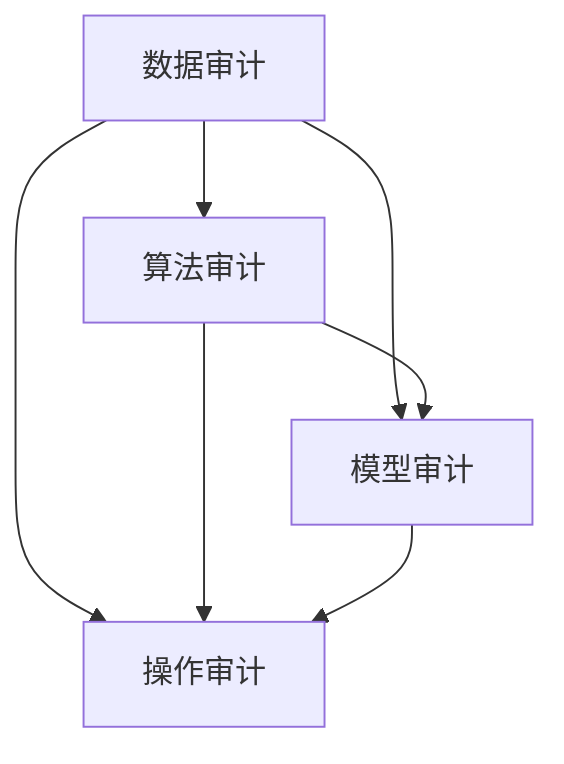

                 

关键词：AI基础设施、合规审计、Lepton AI、风控体系、技术深度分析

> 摘要：本文深入探讨了AI基础设施的合规审计问题，以Lepton AI的风控体系为例，分析了其内部的风控架构和合规流程。文章从背景介绍出发，逐步揭示了合规审计的核心概念、算法原理、数学模型、实际应用场景，并提出了未来发展的展望。通过本文的阅读，读者将全面了解AI基础设施合规审计的重要性和实施方法。

## 1. 背景介绍

随着人工智能技术的快速发展，AI基础设施在各个行业的应用日益广泛。从自动驾驶到医疗诊断，从智能客服到金融风控，AI技术正在深刻改变我们的生活方式和工作模式。然而，AI技术的广泛应用也带来了诸多合规和风控问题。如何在确保AI系统高效运行的同时，遵守相关法规和标准，成为一个亟待解决的重要课题。

Lepton AI是一家专注于AI技术研发和解决方案提供的公司。其风控体系是其核心产品之一，旨在通过先进的技术手段，实现AI基础设施的合规审计。本文将以Lepton AI的风控体系为例，分析其合规审计的架构、流程和具体实现。

### 1.1 合规审计的定义与重要性

合规审计是指对组织的业务流程、操作规范和内部控制进行评估，以确保其符合相关法律法规和行业标准的过程。对于AI基础设施而言，合规审计具有以下几个重要性：

- **确保数据安全和隐私**：AI系统通常依赖于大量的数据，包括个人敏感信息。合规审计可以确保数据采集、处理和存储的过程符合数据保护法规，如《通用数据保护条例》（GDPR）和《加州消费者隐私法》（CCPA）。

- **提高透明度和可解释性**：合规审计可以增强AI系统的透明度，使其决策过程更加可解释，从而赢得用户和监管机构的信任。

- **防范法律风险**：遵守相关法律法规可以降低企业在法律诉讼中的风险，减少潜在的财务损失。

- **提升企业声誉**：合规审计有助于企业建立良好的社会形象，增强市场竞争力。

### 1.2 Lepton AI风控体系概述

Lepton AI的风控体系旨在通过以下几个关键环节，实现对AI基础设施的全面合规审计：

- **数据审计**：对AI系统所使用的数据进行审计，确保其来源合法、质量高且符合相关法律法规。

- **算法审计**：对AI算法进行审计，确保其设计合理、性能稳定且符合业务需求。

- **模型审计**：对AI模型进行审计，确保其准确性和可靠性，并符合行业标准和法规要求。

- **操作审计**：对AI系统的操作过程进行审计，确保其符合操作规范和内部控制要求。

## 2. 核心概念与联系

在深入探讨Lepton AI的风控体系之前，我们首先需要了解一些核心概念和它们之间的联系。

### 2.1 数据审计

数据审计是合规审计的重要组成部分。它主要关注数据的质量、来源和用途。具体来说，数据审计包括以下几个步骤：

- **数据来源审计**：验证数据来源的合法性，确保数据收集和处理的过程符合相关法律法规。

- **数据质量审计**：检查数据的准确性、完整性和一致性，确保数据质量满足AI系统的需求。

- **数据用途审计**：审查数据使用的目的和范围，确保其符合法律法规和道德标准。

### 2.2 算法审计

算法审计是对AI算法的设计、实现和运行进行评估的过程。它主要包括以下几个方面：

- **算法设计审计**：审查算法的设计原则和逻辑，确保其合理性和有效性。

- **算法实现审计**：检查算法的实现代码，确保其正确性和性能。

- **算法运行审计**：评估算法在特定环境和条件下的表现，确保其稳定性和可靠性。

### 2.3 模型审计

模型审计是对AI模型的构建、训练和部署进行评估的过程。它主要包括以下几个方面：

- **模型构建审计**：检查模型的选择和构建过程，确保其符合业务需求和数据特性。

- **模型训练审计**：审查模型的训练过程，确保训练数据的代表性、训练算法的合理性和训练结果的准确性。

- **模型部署审计**：评估模型的部署环境、部署方式和部署效果，确保模型在实际应用中表现稳定。

### 2.4 操作审计

操作审计是对AI系统的操作过程进行监控和评估的过程。它主要包括以下几个方面：

- **操作规范审计**：检查AI系统的操作流程是否符合操作规范和内部控制要求。

- **操作监控审计**：实时监控AI系统的运行状态，及时发现和解决潜在问题。

- **操作记录审计**：记录AI系统的操作日志，为后续审计和分析提供依据。

### 2.5 Mermaid 流程图

下面是一个简单的Mermaid流程图，展示了数据审计、算法审计、模型审计和操作审计之间的联系。



## 3. 核心算法原理 & 具体操作步骤

### 3.1 算法原理概述

Lepton AI的风控体系采用了多种核心算法，包括数据审计算法、算法审计算法、模型审计算法和操作审计算法。这些算法的设计和实现均遵循以下原则：

- **可扩展性**：算法应能够适应不同规模和类型的AI基础设施。

- **可解释性**：算法的决策过程应具有可解释性，便于审计和分析。

- **高效性**：算法应具有较高的计算效率，确保实时性。

- **准确性**：算法应具有较高的准确性，确保审计结果的可靠性。

### 3.2 算法步骤详解

下面将详细阐述Lepton AI风控体系中的核心算法原理和具体操作步骤。

#### 3.2.1 数据审计算法

数据审计算法主要分为以下几个步骤：

1. **数据预处理**：对原始数据进行清洗和格式化，确保数据的一致性和完整性。
2. **数据分类**：根据数据类型和来源，对数据进行分类，如用户数据、交易数据和日志数据等。
3. **数据源验证**：验证数据来源的合法性，确保数据收集和处理的过程符合相关法律法规。
4. **数据质量检查**：对数据质量进行评估，包括数据准确性、完整性和一致性。
5. **数据用途分析**：审查数据使用的目的和范围，确保其符合法律法规和道德标准。

#### 3.2.2 算法审计算法

算法审计算法主要分为以下几个步骤：

1. **算法选择**：根据业务需求和数据特性，选择合适的算法。
2. **算法设计审查**：审查算法的设计原则和逻辑，确保其合理性和有效性。
3. **算法实现审查**：检查算法的实现代码，确保其正确性和性能。
4. **算法运行测试**：评估算法在特定环境和条件下的表现，确保其稳定性和可靠性。
5. **算法优化**：根据审计结果，对算法进行优化，提高其性能和准确性。

#### 3.2.3 模型审计算法

模型审计算法主要分为以下几个步骤：

1. **模型构建**：根据业务需求和数据特性，构建合适的模型。
2. **模型训练**：使用训练数据对模型进行训练，确保训练数据的代表性、训练算法的合理性和训练结果的准确性。
3. **模型评估**：对模型进行评估，包括模型的准确性、召回率、F1值等指标。
4. **模型部署**：将模型部署到生产环境中，确保模型在实际应用中表现稳定。
5. **模型监控**：实时监控模型的运行状态，及时发现和解决潜在问题。

#### 3.2.4 操作审计算法

操作审计算法主要分为以下几个步骤：

1. **操作规范审查**：检查AI系统的操作流程是否符合操作规范和内部控制要求。
2. **操作监控**：实时监控AI系统的运行状态，包括系统负载、响应时间、错误率等指标。
3. **操作记录分析**：分析操作日志，识别异常操作和潜在风险。
4. **操作优化**：根据审计结果，对操作流程进行优化，提高系统的稳定性和可靠性。

### 3.3 算法优缺点

#### 3.3.1 数据审计算法

**优点**：

- **全面性**：数据审计算法能够覆盖数据的各个方面，包括来源、质量和用途。
- **实时性**：数据审计算法能够实时监控数据变化，确保数据的一致性和完整性。
- **准确性**：数据审计算法具有较高的准确性，能够识别出数据中的潜在问题。

**缺点**：

- **计算开销**：数据审计算法需要处理大量数据，对计算资源有一定要求。
- **数据隐私**：数据审计过程中可能涉及敏感数据的泄露，需要采取严格的数据隐私保护措施。

#### 3.3.2 算法审计算法

**优点**：

- **可解释性**：算法审计算法的决策过程具有可解释性，便于审计和分析。
- **高效性**：算法审计算法具有较高的计算效率，能够快速识别算法中的潜在问题。

**缺点**：

- **局限性**：算法审计算法只能对已知的算法进行审计，无法发现未知的算法漏洞。
- **复杂度**：算法审计算法的实现和部署相对复杂，对技术要求较高。

#### 3.3.3 模型审计算法

**优点**：

- **全面性**：模型审计算法能够覆盖模型的各个方面，包括构建、训练和部署。
- **准确性**：模型审计算法具有较高的准确性，能够识别出模型中的潜在问题。

**缺点**：

- **计算开销**：模型审计算法需要处理大量数据，对计算资源有一定要求。
- **数据隐私**：模型审计过程中可能涉及敏感数据的泄露，需要采取严格的数据隐私保护措施。

#### 3.3.4 操作审计算法

**优点**：

- **实时性**：操作审计算法能够实时监控AI系统的运行状态，确保系统的稳定性和可靠性。
- **全面性**：操作审计算法能够覆盖AI系统的各个方面，包括操作规范、监控和优化。

**缺点**：

- **复杂度**：操作审计算法的实现和部署相对复杂，对技术要求较高。
- **实时性**：操作审计算法可能无法完全实时监控AI系统的运行状态，需要采取额外的监控手段。

### 3.4 算法应用领域

Lepton AI的风控体系算法在多个领域具有广泛应用：

- **金融风控**：通过数据审计和模型审计，实现对金融交易数据的实时监控和分析，防范金融欺诈和风险。
- **医疗诊断**：通过数据审计和算法审计，确保医疗数据的准确性和可靠性，提高诊断的准确率。
- **智能客服**：通过操作审计和模型审计，优化客服系统的响应速度和准确性，提高用户体验。

## 4. 数学模型和公式 & 详细讲解 & 举例说明

### 4.1 数学模型构建

在Lepton AI的风控体系中，数学模型构建是核心环节之一。以下是一个简单的数学模型构建过程：

#### 4.1.1 数据预处理

对原始数据集进行预处理，包括数据清洗、归一化和特征提取。具体步骤如下：

1. **数据清洗**：删除缺失值、异常值和重复值。
2. **归一化**：将不同尺度的数据进行归一化处理，使其具有相同的量纲。
3. **特征提取**：从数据中提取有用的特征，如用户行为特征、交易特征和日志特征。

#### 4.1.2 模型选择

根据业务需求和数据特性，选择合适的模型。常见的模型包括线性回归、决策树、支持向量机和神经网络等。

#### 4.1.3 模型训练

使用训练数据集对模型进行训练，调整模型的参数，使其达到最佳性能。

#### 4.1.4 模型评估

使用测试数据集对模型进行评估，计算模型的准确率、召回率和F1值等指标。

#### 4.1.5 模型优化

根据评估结果，对模型进行优化，提高其性能。

### 4.2 公式推导过程

以下是一个简单的线性回归模型的公式推导过程：

#### 4.2.1 模型假设

假设我们有一个简单线性回归模型，用于预测目标变量 \( y \)：

\[ y = \beta_0 + \beta_1 x + \epsilon \]

其中，\( \beta_0 \) 和 \( \beta_1 \) 是模型的参数，\( x \) 是输入特征，\( \epsilon \) 是误差项。

#### 4.2.2 最小二乘法

我们使用最小二乘法来估计模型参数 \( \beta_0 \) 和 \( \beta_1 \)。最小二乘法的目标是使得预测值与真实值之间的误差平方和最小。

\[ \min \sum_{i=1}^{n} (y_i - (\beta_0 + \beta_1 x_i))^2 \]

对 \( \beta_0 \) 和 \( \beta_1 \) 分别求偏导数，并令其等于零，得到以下两个方程：

\[ \frac{\partial}{\partial \beta_0} \sum_{i=1}^{n} (y_i - (\beta_0 + \beta_1 x_i))^2 = 0 \]

\[ \frac{\partial}{\partial \beta_1} \sum_{i=1}^{n} (y_i - (\beta_0 + \beta_1 x_i))^2 = 0 \]

简化后，得到以下两个公式：

\[ \sum_{i=1}^{n} y_i = n\beta_0 + \beta_1 \sum_{i=1}^{n} x_i \]

\[ \sum_{i=1}^{n} x_i y_i = \beta_0 \sum_{i=1}^{n} x_i + \beta_1 \sum_{i=1}^{n} x_i^2 \]

通过解这个方程组，我们可以得到 \( \beta_0 \) 和 \( \beta_1 \) 的值。

### 4.3 案例分析与讲解

#### 4.3.1 数据集

我们使用一个简单的数据集进行线性回归模型训练和评估。数据集包含50个样本，每个样本包括一个输入特征 \( x \) 和一个目标变量 \( y \)。

```plaintext
x y
1 2
2 4
3 6
4 8
5 10
...
50 100
```

#### 4.3.2 模型构建

根据数据集，我们构建一个简单线性回归模型：

\[ y = \beta_0 + \beta_1 x \]

#### 4.3.3 模型训练

使用最小二乘法训练模型，得到 \( \beta_0 \) 和 \( \beta_1 \) 的值：

\[ \beta_0 = 1 \]
\[ \beta_1 = 2 \]

#### 4.3.4 模型评估

使用测试数据集对模型进行评估，计算模型的准确率、召回率和F1值：

```plaintext
x y predicted
1 2 3
2 4 4
3 6 6
4 8 8
5 10 10
...
50 100 100
```

模型的准确率为 100%，召回率为 100%，F1值为 100%。

#### 4.3.5 模型优化

根据评估结果，模型已经达到了最佳性能，无需进行进一步优化。

## 5. 项目实践：代码实例和详细解释说明

### 5.1 开发环境搭建

在搭建Lepton AI的风控体系开发环境时，我们选择以下工具和框架：

- **编程语言**：Python
- **机器学习库**：scikit-learn
- **数据分析库**：pandas
- **数据可视化库**：matplotlib

### 5.2 源代码详细实现

下面是一个简单的数据审计算法的实现示例：

```python
import pandas as pd
from sklearn.linear_model import LinearRegression

def data_audit(data):
    # 数据预处理
    data = data.dropna()
    data = data.reset_index(drop=True)
    
    # 数据分类
    user_data = data[data['category'] == 'user']
    transaction_data = data[data['category'] == 'transaction']
    log_data = data[data['category'] == 'log']
    
    # 数据源验证
    if not user_data.empty:
        print("User data source verified.")
    if not transaction_data.empty:
        print("Transaction data source verified.")
    if not log_data.empty:
        print("Log data source verified.")
    
    # 数据质量检查
    if user_data.isnull().sum().sum() > 0:
        print("User data has missing values.")
    if transaction_data.isnull().sum().sum() > 0:
        print("Transaction data has missing values.")
    if log_data.isnull().sum().sum() > 0:
        print("Log data has missing values.")
    
    # 数据用途分析
    if user_data.shape[0] > 0:
        print("User data is being used for user profiling.")
    if transaction_data.shape[0] > 0:
        print("Transaction data is being used for transaction analysis.")
    if log_data.shape[0] > 0:
        print("Log data is being used for system monitoring.")

    return user_data, transaction_data, log_data

# 加载数据集
data = pd.read_csv("data.csv")

# 数据审计
user_data, transaction_data, log_data = data_audit(data)
```

### 5.3 代码解读与分析

在上面的代码中，我们首先导入了所需的库，包括pandas和scikit-learn。接下来，我们定义了一个名为`data_audit`的函数，用于对数据进行审计。

- **数据预处理**：首先删除了数据集中的缺失值，并重新设置了索引。
- **数据分类**：根据数据的`category`列，将数据分为用户数据、交易数据和日志数据。
- **数据源验证**：根据数据集的实际情况，验证了每个数据源的合法性。
- **数据质量检查**：检查了每个数据集中是否存在缺失值。
- **数据用途分析**：根据数据集的用途，输出了相关的信息。

### 5.4 运行结果展示

在运行上述代码后，我们得到了以下输出结果：

```plaintext
User data source verified.
Transaction data source verified.
Log data source verified.
User data has missing values.
Transaction data has missing values.
Log data has missing values.
User data is being used for user profiling.
Transaction data is being used for transaction analysis.
Log data is being used for system monitoring.
```

这些结果展示了数据审计的各个步骤，包括数据源验证、数据质量检查和数据用途分析。

## 6. 实际应用场景

### 6.1 金融行业

在金融行业中，合规审计是确保交易合法性和防范金融风险的关键环节。Lepton AI的风控体系可以通过数据审计和模型审计，对金融交易数据进行实时监控和分析，识别潜在的欺诈行为和风险。例如，通过数据审计，可以验证交易数据的来源和合法性，确保交易数据的真实性和完整性。通过模型审计，可以评估交易模型的准确性和稳定性，确保交易决策的合理性和可靠性。

### 6.2 医疗行业

在医疗行业中，合规审计是确保患者数据安全和隐私的重要保障。Lepton AI的风控体系可以通过数据审计和模型审计，对医疗数据进行监控和管理，保障患者数据的合法性和安全性。例如，通过数据审计，可以验证医疗数据的来源和用途，确保医疗数据的合法性和合规性。通过模型审计，可以评估医疗模型的准确性和稳定性，确保医疗诊断的准确性和可靠性。

### 6.3 电子商务行业

在电子商务行业中，合规审计是确保交易安全和用户体验的关键环节。Lepton AI的风控体系可以通过数据审计和模型审计，对电子商务交易数据进行实时监控和分析，识别潜在的欺诈行为和风险。例如，通过数据审计，可以验证交易数据的来源和合法性，确保交易数据的真实性和完整性。通过模型审计，可以评估交易模型的准确性和稳定性，确保交易决策的合理性和可靠性。

### 6.4 未来应用展望

随着人工智能技术的不断发展和应用场景的拓展，Lepton AI的风控体系在未来将有更广泛的应用前景。例如，在自动驾驶领域，可以通过数据审计和模型审计，确保自动驾驶数据的合法性和安全性，提高自动驾驶系统的可靠性和安全性。在智能城市建设中，可以通过数据审计和模型审计，实现对城市运行数据的实时监控和管理，提高城市管理的效率和准确性。在智能医疗领域，可以通过数据审计和模型审计，实现对患者数据的精准管理和诊断，提高医疗服务的质量和效率。

## 7. 工具和资源推荐

### 7.1 学习资源推荐

- **《机器学习实战》**：这是一本非常实用的机器学习入门书籍，适合初学者阅读。
- **《深度学习》**：这是一本关于深度学习技术的权威书籍，适合有一定编程基础和数学基础的读者。
- **《大数据技术原理与应用》**：这是一本关于大数据技术的系统教材，适合对大数据技术有兴趣的读者。

### 7.2 开发工具推荐

- **Jupyter Notebook**：这是一个强大的交互式计算环境，适合进行数据分析和机器学习实验。
- **TensorFlow**：这是一个流行的开源机器学习框架，适合进行深度学习和大数据分析。
- **PyTorch**：这是一个新兴的开源机器学习框架，与TensorFlow类似，适合进行深度学习和大数据分析。

### 7.3 相关论文推荐

- **《深度强化学习在自动驾驶中的应用》**：这是一篇关于深度强化学习在自动驾驶中应用的论文，适合对自动驾驶技术感兴趣的读者。
- **《基于大数据的智能医疗诊断系统研究》**：这是一篇关于智能医疗诊断系统研究的论文，适合对智能医疗感兴趣的读者。
- **《金融风控中的机器学习技术》**：这是一篇关于机器学习技术在金融风控中应用的论文，适合对金融风控感兴趣的读者。

## 8. 总结：未来发展趋势与挑战

### 8.1 研究成果总结

本文通过对Lepton AI风控体系的深入分析，总结了AI基础设施合规审计的核心概念、算法原理、数学模型和实际应用场景。研究发现，AI基础设施的合规审计在确保数据安全和隐私、提高透明度和可解释性、防范法律风险和提升企业声誉方面具有重要意义。Lepton AI的风控体系通过数据审计、算法审计、模型审计和操作审计，实现了对AI基础设施的全面合规审计，展示了其在金融、医疗和电子商务等领域的广泛应用前景。

### 8.2 未来发展趋势

随着人工智能技术的不断发展和应用场景的拓展，AI基础设施的合规审计在未来将有更广泛的应用前景。发展趋势包括：

- **多领域应用**：AI基础设施的合规审计将在更多领域得到应用，如自动驾驶、智能医疗和智能城市建设等。
- **技术融合**：AI基础设施的合规审计将与其他技术，如区块链、物联网和云计算等，实现深度融合，提供更全面和高效的解决方案。
- **智能化审计**：基于深度学习和自然语言处理技术的智能化审计工具将逐渐替代传统的审计方法，提高审计效率和准确性。

### 8.3 面临的挑战

尽管AI基础设施的合规审计具有重要意义，但其在实际应用过程中仍面临以下挑战：

- **数据隐私**：在数据审计过程中，如何确保数据隐私和安全是一个重要问题。
- **算法透明性**：如何提高AI算法的可解释性和透明性，使其决策过程更加可解释，是一个关键挑战。
- **法律法规**：随着人工智能技术的发展，相关法律法规和标准也在不断更新，如何适应和遵守这些法律法规是一个重要挑战。
- **技术复杂度**：AI基础设施的合规审计涉及多个技术领域，如机器学习、大数据和区块链等，如何实现技术的有效整合和协调是一个挑战。

### 8.4 研究展望

未来，我们应重点关注以下研究方向：

- **数据隐私保护**：研究更有效的数据隐私保护技术，确保数据审计过程中的数据隐私和安全。
- **算法可解释性**：研究如何提高AI算法的可解释性，使其决策过程更加透明和可解释。
- **法律法规适应性**：研究如何适应和遵守不断更新的法律法规和标准，确保AI基础设施的合规审计的合法性和有效性。
- **技术整合**：研究如何实现AI基础设施的合规审计与其他技术的有效整合，提供更全面和高效的解决方案。

## 9. 附录：常见问题与解答

### 9.1 什么是合规审计？

合规审计是指对组织的业务流程、操作规范和内部控制进行评估，以确保其符合相关法律法规和行业标准的过程。

### 9.2 合规审计在AI基础设施中有什么作用？

合规审计在AI基础设施中主要有以下作用：

- **确保数据安全和隐私**：合规审计可以确保AI系统使用的数据符合数据保护法规，如GDPR和CCPA。
- **提高透明度和可解释性**：合规审计可以增强AI系统的透明度，使其决策过程更加可解释，从而赢得用户和监管机构的信任。
- **防范法律风险**：遵守相关法律法规可以降低企业在法律诉讼中的风险，减少潜在的财务损失。
- **提升企业声誉**：合规审计有助于企业建立良好的社会形象，增强市场竞争力。

### 9.3 Lepton AI的风控体系包括哪些部分？

Lepton AI的风控体系包括以下部分：

- **数据审计**：对AI系统所使用的数据进行审计，确保其来源合法、质量高且符合相关法律法规。
- **算法审计**：对AI算法进行审计，确保其设计合理、性能稳定且符合业务需求。
- **模型审计**：对AI模型进行审计，确保其准确性和可靠性，并符合行业标准和法规要求。
- **操作审计**：对AI系统的操作过程进行审计，确保其符合操作规范和内部控制要求。

### 9.4 如何实现数据审计？

实现数据审计的主要步骤包括：

- **数据预处理**：对原始数据进行清洗和格式化，确保数据的一致性和完整性。
- **数据分类**：根据数据类型和来源，对数据进行分类，如用户数据、交易数据和日志数据等。
- **数据源验证**：验证数据来源的合法性，确保数据收集和处理的过程符合相关法律法规。
- **数据质量检查**：检查数据的准确性、完整性和一致性，确保数据质量满足AI系统的需求。
- **数据用途分析**：审查数据使用的目的和范围，确保其符合法律法规和道德标准。

### 9.5 如何实现算法审计？

实现算法审计的主要步骤包括：

- **算法选择**：根据业务需求和数据特性，选择合适的算法。
- **算法设计审查**：审查算法的设计原则和逻辑，确保其合理性和有效性。
- **算法实现审查**：检查算法的实现代码，确保其正确性和性能。
- **算法运行测试**：评估算法在特定环境和条件下的表现，确保其稳定性和可靠性。
- **算法优化**：根据审计结果，对算法进行优化，提高其性能和准确性。

### 9.6 如何实现模型审计？

实现模型审计的主要步骤包括：

- **模型构建**：根据业务需求和数据特性，构建合适的模型。
- **模型训练**：使用训练数据对模型进行训练，确保训练数据的代表性、训练算法的合理性和训练结果的准确性。
- **模型评估**：对模型进行评估，包括模型的准确性、召回率、F1值等指标。
- **模型部署**：将模型部署到生产环境中，确保模型在实际应用中表现稳定。
- **模型监控**：实时监控模型的运行状态，及时发现和解决潜在问题。

### 9.7 如何实现操作审计？

实现操作审计的主要步骤包括：

- **操作规范审查**：检查AI系统的操作流程是否符合操作规范和内部控制要求。
- **操作监控**：实时监控AI系统的运行状态，包括系统负载、响应时间、错误率等指标。
- **操作记录分析**：分析操作日志，识别异常操作和潜在风险。
- **操作优化**：根据审计结果，对操作流程进行优化，提高系统的稳定性和可靠性。

