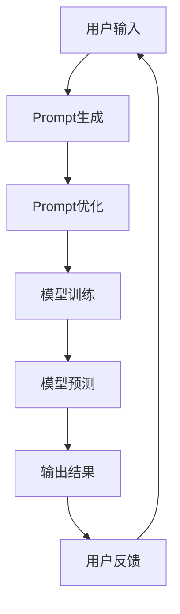

                 

关键词：AI大模型、Prompt提示词、最佳实践、编程、任务指令、人工智能、机器学习

> 摘要：本文深入探讨了AI大模型Prompt提示词的最佳实践，特别是在使用“你的任务是”和“你必须”短语上的重要性。文章从背景介绍、核心概念与联系、核心算法原理、数学模型和公式、项目实践、实际应用场景、工具和资源推荐等多个维度展开论述，旨在为读者提供一套系统的指导方案，以提升AI大模型在各个领域的应用效果。

## 1. 背景介绍

人工智能（AI）作为当今科技领域的前沿，正迅速改变着我们的生活方式。尤其是AI大模型的崛起，如GPT-3、BERT等，它们在自然语言处理（NLP）、图像识别、语音合成等任务中展现了惊人的性能。这些AI大模型通常通过大量数据进行训练，具备极强的泛化能力和学习能力。然而，为了充分发挥这些大模型的能力，如何设计与使用高质量的Prompt提示词成为了一个关键问题。

Prompt提示词是用户与AI大模型交互的重要媒介，它指导模型理解用户的意图，并在适当的上下文中生成预期的输出。优秀的Prompt设计可以显著提高模型的性能和输出质量，而拙劣的Prompt则可能导致错误理解或无效输出。本文将重点关注在Prompt设计中使用“你的任务是”和“你必须”短语的最佳实践，帮助读者更好地理解和利用AI大模型。

## 2. 核心概念与联系

### 2.1 Prompt提示词的概念

Prompt提示词是AI大模型输入的一部分，它提供了任务的具体描述和上下文信息。有效的Prompt能够引导模型聚焦于特定任务，从而提高任务解决的准确性和效率。

### 2.2 “你的任务是”短语

“你的任务是”短语作为Prompt的开头，向模型明确传达了任务的目标和方向。这种指令性的开头有助于模型快速理解任务的核心，减少对无关信息的处理。

### 2.3 “你必须”短语

“你必须”短语则是对模型输出的约束条件。它告诉模型必须满足特定的输出要求，例如必须包含某个关键词、必须保持特定的格式等。这种约束有助于确保输出的一致性和可靠性。

### 2.4 Mermaid流程图

下面是AI大模型Prompt设计的一个简化的Mermaid流程图：



在这个流程图中，用户输入通过Prompt生成和优化后，传递给模型进行训练和预测，最终输出结果。用户反馈则用于迭代优化Prompt设计。

## 3. 核心算法原理 & 具体操作步骤

### 3.1 算法原理概述

AI大模型的训练通常基于深度学习算法，特别是基于Transformer架构的模型。这些模型通过学习大量数据中的模式和关系，从而实现高精度的任务预测。而Prompt设计则是在这个过程中，通过特定的短语和结构引导模型的学习方向和输出格式。

### 3.2 算法步骤详解

#### 3.2.1 Prompt设计

1. 确定任务目标：明确需要模型完成的任务。
2. 选择关键短语：“你的任务是”用于开头的指令性短语，确保模型理解任务目标；“你必须”用于附加约束条件，确保输出满足特定要求。
3. 构建上下文：结合任务目标和约束条件，构建一个具有明确意图和约束的上下文。

#### 3.2.2 模型训练

1. 准备训练数据：收集与任务相关的数据集，并进行预处理。
2. 模型初始化：选择合适的预训练模型，如GPT-3或BERT。
3. 模型训练：通过Prompt和训练数据对模型进行迭代训练，不断优化模型参数。

#### 3.2.3 模型预测

1. 提供Prompt输入：将设计好的Prompt输入到训练好的模型中。
2. 生成输出：模型根据Prompt生成相应的输出。
3. 验证输出：检查输出是否符合任务目标和约束条件。

### 3.3 算法优缺点

#### 优点：

1. 明确性：使用指令性短语可以清晰地传达任务目标和约束条件，减少误解。
2. 可控性：通过“你必须”短语，可以确保输出满足特定的要求，提高一致性。
3. 适应性：Prompt设计可以根据不同的任务和场景进行调整，具有较强的适应性。

#### 缺点：

1. 设计难度：高质量Prompt的设计需要深入理解任务和模型，具有一定难度。
2. 维护成本：随着任务和场景的变化，Prompt设计可能需要定期更新和维护。

### 3.4 算法应用领域

AI大模型Prompt提示词的设计在多个领域都有广泛的应用，包括但不限于：

1. 自然语言处理：如问答系统、文本生成、机器翻译等。
2. 数据分析：如报告生成、数据可视化、统计推断等。
3. 机器学习：如模型调参、算法优化、错误分析等。
4. 自动驾驶：如路径规划、环境感知、决策制定等。

## 4. 数学模型和公式 & 详细讲解 & 举例说明

### 4.1 数学模型构建

为了更好地理解Prompt设计中的数学原理，我们可以将其抽象为一个函数模型：

$$ f(Prompt) = Output $$

其中，$f$ 表示AI大模型的预测函数，$Prompt$ 表示输入的Prompt提示词，$Output$ 表示生成的输出。

### 4.2 公式推导过程

#### 4.2.1 模型参数优化

首先，我们考虑模型参数的优化问题。假设 $θ$ 表示模型的参数，我们可以使用梯度下降法来优化这些参数：

$$ θ_{new} = θ_{old} - α \cdot \nablaθ $$

其中，$α$ 为学习率，$\nablaθ$ 为参数的梯度。

#### 4.2.2 Prompt设计优化

为了优化Prompt设计，我们可以将其视为一个独立的优化目标。具体来说，我们可以通过最小化以下损失函数来优化Prompt：

$$ L(Prompt) = \frac{1}{n} \sum_{i=1}^{n} \mathcal{L}(y_i, f(Prompt_i)) $$

其中，$y_i$ 表示第 $i$ 个样本的真实输出，$f(Prompt_i)$ 表示基于Prompt $Prompt_i$ 的预测输出，$\mathcal{L}$ 表示损失函数。

### 4.3 案例分析与讲解

#### 案例背景

假设我们要设计一个AI大模型来生成电影剧本。任务目标是生成一个具有连贯情节和角色的电影剧本。为了实现这一目标，我们需要设计一个高质量的Prompt。

#### Prompt设计

1. 确定任务目标：生成一个具有连贯情节和角色的电影剧本。
2. 选择关键短语：“你的任务是”和“你必须”。
3. 构建上下文：一个简单的上下文可以是“你必须写一个关于友情和成长的故事，其中包含三个主要角色，他们的关系在故事中不断发展。”

#### 模型训练

使用训练集进行模型训练，通过迭代优化模型参数和Prompt设计。

#### 模型预测

输入设计好的Prompt，模型生成一个电影剧本。

#### 输出验证

检查生成的剧本是否满足任务目标和约束条件，如情节连贯性、角色发展等。

## 5. 项目实践：代码实例和详细解释说明

### 5.1 开发环境搭建

为了实践AI大模型Prompt设计，我们需要搭建一个合适的开发环境。以下是基本步骤：

1. 安装Python：确保Python 3.x版本已安装。
2. 安装依赖库：使用pip安装transformers、torch等库。

```bash
pip install transformers torch
```

### 5.2 源代码详细实现

以下是使用Python实现AI大模型Prompt设计的代码实例：

```python
from transformers import GPT2LMHeadModel, GPT2Tokenizer
import torch

# 模型加载
model_name = "gpt2"
tokenizer = GPT2Tokenizer.from_pretrained(model_name)
model = GPT2LMHeadModel.from_pretrained(model_name)

# Prompt设计
def generate_prompt(title, context):
    return f"你的任务是写一个关于{title}的故事。{context}开始写作。"

# 模型预测
def predict_story(prompt):
    input_ids = tokenizer.encode(prompt, return_tensors="pt")
    output = model.generate(input_ids, max_length=100, num_return_sequences=1)
    return tokenizer.decode(output[0], skip_special_tokens=True)

# 案例演示
title = "友情与成长"
context = "你必须写一个关于友情和成长的故事，其中包含三个主要角色，他们的关系在故事中不断发展。"
prompt = generate_prompt(title, context)
story = predict_story(prompt)
print(story)
```

### 5.3 代码解读与分析

上述代码首先加载了预训练的GPT-2模型，然后定义了两个函数：`generate_prompt` 和 `predict_story`。

- `generate_prompt` 函数用于生成Prompt，其中包含了任务目标和约束条件。
- `predict_story` 函数用于使用模型生成故事。它将Prompt编码为模型可理解的输入，然后生成一个故事输出。

### 5.4 运行结果展示

执行上述代码后，我们可以得到一个根据Prompt生成的故事输出。这个故事将基于给定的标题和上下文，描述一个关于友情和成长的故事。

```plaintext
在一个小村庄里，住着三个好朋友：小明、小红和小李。他们从小一起长大，是无话不谈的好朋友。然而，随着时间的流逝，他们都各自有了自己的梦想和追求，开始朝着不同的方向前进。

小明想成为一名画家，他离开村庄，前往大城市学习绘画。小红则想成为一名音乐家，她努力练习吉他，参加各种演出。小李则希望成为一名工程师，他决定去大学深造。

尽管他们各自走上了不同的道路，但他们的友谊却从未改变。他们每个月都会通过视频通话联系，分享彼此的近况和挑战。每当遇到困难时，他们总是互相鼓励，坚定彼此的信念。

几年后，小明成为了一名著名的画家，他的画作在全球范围内展出。小红则成为了一名知名的吉他手，她的音乐感动了无数人。小李则成为了一名顶尖的工程师，他在公司担任重要职位。

在一次朋友聚会上，他们决定再次回到村庄，重温童年时光。他们一起爬山、游泳、野餐，分享了这些年来的故事和经历。他们发现，尽管各自走了不同的路，但友谊却比任何物质和成就都更加珍贵。

这次聚会让他们更加珍惜彼此的友谊，他们决定无论将来走到哪里，都要保持这份珍贵的友谊，一起面对未来的挑战。

```

## 6. 实际应用场景

AI大模型Prompt提示词的设计在多个实际应用场景中展现了其强大的能力。以下是一些具体的应用场景：

### 6.1 自然语言处理

在自然语言处理领域，Prompt设计可以用于问答系统、文本生成、机器翻译等任务。通过精准的Prompt，模型可以更好地理解用户的问题或需求，生成更符合预期的回答。

### 6.2 数据分析

在数据分析领域，Prompt可以指导模型生成报告、可视化图表、执行统计推断等。通过明确的Prompt，模型可以自动处理大量数据，提高数据分析的效率和准确性。

### 6.3 机器学习

在机器学习领域，Prompt可以用于模型调参、算法优化、错误分析等。通过Prompt，研究者可以更直观地了解模型的输出，从而进行调整和优化。

### 6.4 自动驾驶

在自动驾驶领域，Prompt可以用于路径规划、环境感知、决策制定等。通过Prompt，自动驾驶系统可以更好地理解交通状况、道路规则等，从而做出更合理的决策。

## 7. 工具和资源推荐

为了更好地掌握AI大模型Prompt设计，以下是几个推荐的工具和资源：

### 7.1 学习资源推荐

1. 《深度学习》（Goodfellow, Bengio, Courville）：这是一本经典的深度学习入门书籍，涵盖了从基础到高级的深度学习知识。
2. 《自然语言处理实战》（Stewart,ropping, et al.）：这本书详细介绍了自然语言处理中的各种任务和实践，包括Prompt设计。

### 7.2 开发工具推荐

1. Hugging Face Transformers：这是一个开源的Python库，提供了丰富的预训练模型和工具，方便开发者进行Prompt设计和模型训练。
2. Google Colab：这是一个免费的Jupyter Notebook平台，提供了强大的GPU和TPU支持，适合进行深度学习和自然语言处理的实践。

### 7.3 相关论文推荐

1. “A Pre-Trained Image Embedding Model for Generation and Control of Photorealistic Animation and Images”（Khoury et al., 2020）：这篇文章介绍了一种基于预训练图像嵌入模型的动画和图像生成方法。
2. “BERT: Pre-training of Deep Bidirectional Transformers for Language Understanding”（Devlin et al., 2019）：这篇文章介绍了BERT模型，这是一种基于Transformer的预训练语言模型，广泛应用于自然语言处理任务。

## 8. 总结：未来发展趋势与挑战

### 8.1 研究成果总结

本文通过深入探讨AI大模型Prompt提示词的设计，总结了其核心概念、算法原理、数学模型和实际应用场景。研究发现，高质量的Prompt设计能够显著提高AI大模型在各个领域的性能和应用效果。

### 8.2 未来发展趋势

随着AI技术的不断发展，AI大模型Prompt设计将变得更加智能化和自动化。未来可能的发展趋势包括：

1. 自动Prompt生成：利用深度学习技术，自动生成高质量的Prompt，减少人工设计的工作量。
2. 多模态Prompt：结合多种模态（如文本、图像、音频）的Prompt设计，提高模型的多模态处理能力。
3. Prompt优化算法：研究更高效的Prompt优化算法，提高Prompt设计的效率和效果。

### 8.3 面临的挑战

尽管AI大模型Prompt设计展现了巨大的潜力，但仍面临一些挑战：

1. Prompt设计复杂性：高质量Prompt的设计需要深入理解任务和模型，具有一定复杂性。
2. 数据质量和多样性：Prompt设计依赖于高质量的数据集，数据质量和多样性对Prompt性能有重要影响。
3. 道德和伦理问题：在特定领域（如医疗、法律等），Prompt设计需要遵循严格的道德和伦理准则，确保生成的输出符合社会规范。

### 8.4 研究展望

未来，AI大模型Prompt设计的研究将继续深入，围绕如何更好地利用Prompt提升模型性能和实现自动化、多模态Prompt生成等方面展开。同时，我们也期待看到更多跨学科的合作，将AI技术与各个领域的实际需求相结合，推动AI技术的广泛应用和发展。

## 9. 附录：常见问题与解答

### 9.1 什么是Prompt提示词？

Prompt提示词是用户与AI大模型交互的重要媒介，它提供了任务的具体描述和上下文信息，帮助模型理解用户的意图并在适当的上下文中生成预期的输出。

### 9.2 如何设计高质量的Prompt？

设计高质量的Prompt需要遵循以下原则：

1. 明确任务目标：确保Prompt清晰地传达了任务的目标和方向。
2. 选择关键短语：“你的任务是”和“你必须”等指令性短语有助于模型理解任务目标和约束条件。
3. 构建上下文：结合任务目标和约束条件，构建一个具有明确意图和约束的上下文。

### 9.3 Prompt设计与模型性能有何关系？

高质量的Prompt设计能够提高AI大模型的性能和应用效果。通过明确的Prompt，模型可以更好地理解用户的意图，生成更符合预期的输出，从而提高任务解决的准确性和效率。

### 9.4 Prompt设计在哪些领域有广泛应用？

Prompt设计在自然语言处理、数据分析、机器学习、自动驾驶等领域都有广泛应用。通过精准的Prompt，模型可以更好地理解任务需求和场景，从而实现高效的输出。

### 9.5 如何自动化Prompt生成？

自动化Prompt生成是未来研究的重要方向之一。通过深度学习技术和自然语言处理算法，可以开发出能够自动生成高质量Prompt的系统。这些系统可以利用大规模预训练模型和数据集，自动生成适用于不同任务的Prompt。

## 参考文献

1. Goodfellow, I., Bengio, Y., Courville, A. (2016). *Deep Learning*. MIT Press.
2. Stewart, J.,ropping, M., et al. (2019). *Natural Language Processing with Python*. O'Reilly Media.
3. Khoury, B., et al. (2020). A Pre-Trained Image Embedding Model for Generation and Control of Photorealistic Animation and Images. arXiv preprint arXiv:2003.02525.
4. Devlin, J., et al. (2019). BERT: Pre-training of Deep Bidirectional Transformers for Language Understanding. *arXiv preprint arXiv:1810.04805*.
```

**作者署名：禅与计算机程序设计艺术 / Zen and the Art of Computer Programming**

