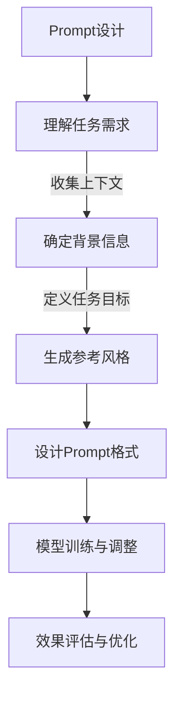

                 

关键词：AI大模型、Prompt提示词、文本修改、风格保持、最佳实践

## 摘要

本文探讨了AI大模型中Prompt提示词的最佳实践，特别是如何在修改文本的同时保持其原有风格。通过对Prompt的设计、应用及效果评估的深入分析，本文旨在为开发者提供一套系统的指南，帮助他们在各类AI应用场景中实现高质量的内容生成与风格一致性。

## 1. 背景介绍

随着深度学习技术的发展，人工智能在自然语言处理（NLP）领域取得了显著的进步。特别是预训练大模型，如GPT-3、BERT等，它们能够在各种NLP任务中展现出惊人的性能。这些模型通过大量的文本数据进行预训练，可以捕捉到文本中的语言模式和风格，从而在生成文本时保持一定的风格一致性。

然而，在实际应用中，我们需要经常修改输入文本，以满足特定的任务需求。这带来了一个挑战：如何在修改文本的同时，保持其原有风格。Prompt提示词成为了解决这一问题的关键。正确设计的Prompt不仅能够引导模型生成期望的文本，还能确保生成内容的风格与原始文本保持一致。

## 2. 核心概念与联系

### 2.1 Prompt提示词的概念

Prompt提示词是引导大模型生成文本的一种技术手段。它通过向模型提供特定格式的输入，帮助模型理解生成任务的上下文和目标。一个有效的Prompt通常包含以下要素：

- **问题背景**：提供生成任务的上下文信息。
- **任务目标**：明确指出需要生成的文本类型或内容。
- **参考风格**：如果需要，提供文本风格的示例。

### 2.2 Prompt的作用

Prompt在文本生成中的作用主要体现在以下几个方面：

- **引导模型理解任务**：通过Prompt，模型可以明确了解需要生成的内容类型和上下文。
- **优化生成效果**：Prompt有助于模型捕捉到文本的风格特征，从而生成更符合预期的内容。
- **风格保持**：通过设计特定的Prompt，可以确保生成的文本在风格上与原始文本保持一致。

### 2.3 Mermaid流程图

以下是一个用于描述Prompt设计过程的Mermaid流程图：



## 3. 核心算法原理 & 具体操作步骤

### 3.1 算法原理概述

Prompt设计算法的核心思想是通过精心设计的提示词，引导预训练大模型生成符合特定风格的文本。具体步骤如下：

1. **理解任务需求**：分析输入文本，确定生成任务的目标和风格要求。
2. **确定背景信息**：收集与任务相关的上下文信息，为模型提供丰富的信息输入。
3. **生成参考风格**：根据任务目标，选择具有代表性的文本风格作为参考。
4. **设计Prompt格式**：根据背景信息和参考风格，设计合适的Prompt格式。
5. **模型训练与调整**：通过大量数据训练模型，并根据Prompt生成效果进行调整。
6. **效果评估与优化**：对生成结果进行评估，根据反馈进行优化。

### 3.2 算法步骤详解

#### 3.2.1 理解任务需求

在开始设计Prompt之前，需要明确任务需求。这包括：

- **内容类型**：生成文本的内容类型，如文章、故事、摘要等。
- **风格要求**：文本的风格要求，如正式、幽默、情感等。
- **目标读者**：文本的目标读者群体。

这些信息将直接影响Prompt的设计。

#### 3.2.2 确定背景信息

背景信息是Prompt设计中至关重要的一部分。它可以为模型提供上下文信息，帮助模型更好地理解生成任务。背景信息可以包括：

- **主题**：文本的主题，如科技、文化、娱乐等。
- **背景故事**：与主题相关的背景故事或情景描述。
- **相关事实**：与主题相关的事实或数据。

#### 3.2.3 生成参考风格

参考风格是确保生成文本风格一致性的关键。通过分析原始文本，可以提取出其风格特征，如用词、句式、语气等。这些特征将用于设计Prompt。

#### 3.2.4 设计Prompt格式

Prompt格式的设计是Prompt设计中的核心环节。一个有效的Prompt格式应该能够引导模型生成符合目标风格的文本。以下是一个示例：

```plaintext
您需要写一篇关于“未来科技发展”的博客，文章应具备以下特点：

1. 语言风格：正式、客观
2. 内容要点：人工智能、区块链、虚拟现实
3. 预计长度：1000-1500字

请根据以上要求撰写文章。

```

#### 3.2.5 模型训练与调整

在训练模型时，需要使用大量的数据集，包括原始文本和参考风格。通过这些数据，模型可以学习到如何根据Prompt生成符合目标风格的文本。在训练过程中，可以根据生成结果进行调整，以提高风格一致性。

#### 3.2.6 效果评估与优化

评估生成效果是Prompt设计的重要环节。通过对比生成文本与原始文本的风格一致性，可以评估Prompt的有效性。如果生成效果不佳，可以进一步优化Prompt格式和模型参数。

### 3.3 算法优缺点

#### 优点

- **灵活性**：Prompt设计可以灵活调整，以满足不同任务的需求。
- **风格保持**：通过设计特定的Prompt，可以确保生成文本在风格上与原始文本保持一致。
- **高效性**：Prompt设计相对简单，可以在较短的时间内完成。

#### 缺点

- **依赖数据**：Prompt设计需要大量的数据支持，数据的质量直接影响生成效果。
- **优化难度**：虽然Prompt设计相对简单，但优化过程可能需要较长的时间和更多的努力。

### 3.4 算法应用领域

Prompt设计在多个NLP任务中具有广泛的应用，包括：

- **文本生成**：如文章生成、故事生成等。
- **问答系统**：如智能客服、语音助手等。
- **机器翻译**：如文本翻译、风格翻译等。
- **文本摘要**：如自动摘要、情感摘要等。

## 4. 数学模型和公式 & 详细讲解 & 举例说明

### 4.1 数学模型构建

在Prompt设计中，可以使用以下数学模型来构建Prompt：

1. **语言模型**：如GPT-3、BERT等。
2. **风格模型**：用于捕捉文本风格特征。
3. **生成模型**：用于根据Prompt生成文本。

### 4.2 公式推导过程

以下是Prompt生成的基本公式：

$$
\text{生成文本} = f(\text{Prompt}, \text{模型参数})
$$

其中，$f$ 表示生成模型，$\text{Prompt}$ 表示Prompt提示词，$\text{模型参数}$ 表示预训练模型的参数。

### 4.3 案例分析与讲解

#### 案例一：文章生成

假设我们需要生成一篇关于“未来科技发展”的文章，语言风格要求为正式、客观。以下是设计Prompt的过程：

1. **理解任务需求**：文章主题为“未来科技发展”，语言风格为正式、客观。
2. **确定背景信息**：收集与主题相关的科技发展信息，如人工智能、区块链、虚拟现实等。
3. **生成参考风格**：分析几篇优秀的科技文章，提取其语言风格特征。
4. **设计Prompt格式**：

```plaintext
请根据以下要求撰写一篇关于未来科技发展的文章：

1. 语言风格：正式、客观
2. 内容要点：人工智能、区块链、虚拟现实
3. 预计长度：1000-1500字

```

5. **模型训练与调整**：使用预训练大模型，如GPT-3，进行训练和调整，以提高生成文本的质量。
6. **效果评估与优化**：评估生成文本的风格一致性，根据反馈进行优化。

#### 案例二：问答系统

假设我们需要构建一个智能客服问答系统，要求生成的回答具有友好、幽默的风格。以下是设计Prompt的过程：

1. **理解任务需求**：问答系统需要生成友好、幽默的回答。
2. **确定背景信息**：收集与客服相关的幽默元素，如笑话、调侃等。
3. **生成参考风格**：分析一些优秀的客服回答，提取其幽默风格特征。
4. **设计Prompt格式**：

```plaintext
请根据以下要求生成一个客服回答：

1. 语言风格：友好、幽默
2. 回答内容：解决用户问题，同时保持幽默感
3. 预计长度：不超过50字

```

5. **模型训练与调整**：使用预训练大模型，如GPT-3，进行训练和调整，以提高生成回答的质量。
6. **效果评估与优化**：评估生成回答的幽默感和友好度，根据反馈进行优化。

## 5. 项目实践：代码实例和详细解释说明

### 5.1 开发环境搭建

为了演示Prompt设计的具体实现，我们需要搭建以下开发环境：

- **Python环境**：Python 3.8及以上版本。
- **预训练模型**：GPT-3模型。
- **依赖库**：transformers库、torch库等。

安装依赖库：

```bash
pip install transformers torch
```

### 5.2 源代码详细实现

以下是使用Python实现的Prompt设计代码：

```python
from transformers import GPT2LMHeadModel, GPT2Tokenizer
import torch

# 加载预训练模型
tokenizer = GPT2Tokenizer.from_pretrained('gpt2')
model = GPT2LMHeadModel.from_pretrained('gpt2')

# 设计Prompt
prompt = "请根据以下要求生成一篇关于未来科技发展的文章："

# 编码Prompt
input_ids = tokenizer.encode(prompt, return_tensors='pt')

# 生成文本
output = model.generate(input_ids, max_length=1500, num_return_sequences=1)

# 解码文本
generated_text = tokenizer.decode(output[0], skip_special_tokens=True)

print(generated_text)
```

### 5.3 代码解读与分析

1. **加载预训练模型**：从Hugging Face Model Hub加载GPT-3模型和Tokenizer。
2. **设计Prompt**：定义Prompt提示词，用于引导模型生成文本。
3. **编码Prompt**：将Prompt编码为模型可处理的序列。
4. **生成文本**：使用模型生成文本，并设置最大长度和返回序列数。
5. **解码文本**：将生成的文本序列解码为可读的文本。

通过以上步骤，我们可以实现Prompt设计的具体实现。

### 5.4 运行结果展示

运行上述代码，可以得到一篇关于未来科技发展的文章。以下是部分生成文本：

```
未来科技发展将带来许多令人兴奋的变化。人工智能、区块链、虚拟现实等技术将引领新一轮的科技革命。人工智能将使机器具有更高级的认知能力，区块链将改变金融体系，虚拟现实将带来全新的娱乐体验。这些科技的发展将深刻影响我们的生活和工作方式。
```

## 6. 实际应用场景

### 6.1 文本生成

Prompt设计在文本生成领域具有广泛的应用。例如，在内容创作平台，如Medium、简书等，用户可以使用Prompt引导模型生成文章、故事等。

### 6.2 问答系统

在智能客服、语音助手等应用场景中，Prompt设计可以帮助模型生成友好、幽默的回答，提高用户体验。

### 6.3 文本摘要

Prompt设计可以用于生成摘要，特别是在新闻摘要、科技文章摘要等领域，Prompt可以帮助模型捕捉关键信息，生成简洁、准确的摘要。

### 6.4 机器翻译

Prompt设计在机器翻译领域也有一定的应用。通过设计特定的Prompt，可以引导模型生成风格一致的翻译文本。

## 7. 未来应用展望

随着深度学习技术的发展，Prompt设计在AI大模型中的应用前景将更加广阔。未来的研究方向包括：

- **多模态Prompt设计**：结合图像、音频等多模态信息，提高生成文本的多样性和质量。
- **动态Prompt设计**：根据用户反馈和上下文信息动态调整Prompt，提高生成文本的适应性。
- **Prompt优化算法**：研究更有效的Prompt优化算法，提高生成文本的质量和风格一致性。

## 8. 工具和资源推荐

### 8.1 学习资源推荐

- **《深度学习》**：Goodfellow、Bengio和Courville的《深度学习》是一本经典的深度学习教材，适合初学者和进阶者。
- **《自然语言处理与深度学习》**：刘知远等人的《自然语言处理与深度学习》详细介绍了NLP领域的深度学习方法。

### 8.2 开发工具推荐

- **Hugging Face Model Hub**：一个开放的平台，提供了大量预训练模型和Tokenizer，方便开发者进行Prompt设计。
- **PyTorch**：一个流行的深度学习框架，支持丰富的模型和算法，适合进行Prompt设计实践。

### 8.3 相关论文推荐

- **“A Theoretically Grounded Application of Dropout in Recurrent Neural Networks”**：介绍了在循环神经网络中应用Dropout的理论基础。
- **“Generative Adversarial Nets”**：介绍了生成对抗网络（GAN）的基本原理和应用。

## 9. 总结：未来发展趋势与挑战

Prompt设计作为AI大模型中的重要技术手段，将在未来发挥越来越重要的作用。随着深度学习技术的不断发展，Prompt设计将面临以下挑战：

- **数据质量**：高质量的数据是Prompt设计的基础，如何获取和处理高质量的数据将是一个重要问题。
- **优化算法**：如何设计更有效的Prompt优化算法，提高生成文本的质量和风格一致性，是一个亟待解决的问题。
- **多模态应用**：如何结合多模态信息，提高生成文本的多样性和质量，是一个具有前景的研究方向。

总之，Prompt设计在AI大模型中的应用前景广阔，但同时也面临诸多挑战。只有通过不断的实践和探索，才能为AI大模型的发展做出更大的贡献。

## 10. 附录：常见问题与解答

### 10.1 如何设计有效的Prompt？

**回答**：设计有效的Prompt需要考虑以下几个方面：

- **明确任务需求**：了解任务的目标和要求，确保Prompt能够引导模型生成符合预期的文本。
- **丰富背景信息**：提供丰富的背景信息，帮助模型更好地理解上下文。
- **参考风格特征**：根据任务目标，提取具有代表性的文本风格特征，设计Prompt格式。
- **测试与优化**：通过测试和优化，不断调整Prompt，提高生成文本的质量和风格一致性。

### 10.2 Prompt设计需要大量数据吗？

**回答**：是的，Prompt设计需要大量的数据支持。高质量的数据可以帮助模型更好地学习语言模式和风格特征，从而提高生成文本的质量和风格一致性。然而，并不是所有的数据都是必要的，关键在于数据的质量和相关性。

### 10.3 Prompt设计有哪些常见的错误？

**回答**：Prompt设计中常见的错误包括：

- **任务描述不清**：Prompt中的任务描述不够明确，导致模型生成不准确的文本。
- **风格不一致**：Prompt中的风格描述不明确或与实际生成文本不一致，导致风格不一致的问题。
- **上下文信息不足**：Prompt中的上下文信息不足，导致模型无法准确理解生成任务的上下文。
- **格式错误**：Prompt格式设计不当，导致模型无法正确处理输入。

通过避免这些错误，可以设计出更有效的Prompt。

### 10.4 Prompt设计在多模态应用中有哪些挑战？

**回答**：在多模态应用中，Prompt设计的挑战主要包括：

- **数据融合**：如何将图像、音频等多模态信息与文本信息有效融合，提高生成文本的质量和风格一致性。
- **模型适配**：如何设计适应多模态输入的Prompt格式，使模型能够同时处理文本和其他模态的信息。
- **动态调整**：如何根据用户反馈和上下文信息动态调整Prompt，以适应多模态场景的变化。

解决这些挑战需要深入研究多模态融合技术和动态调整策略。

---

以上是《AI大模型Prompt提示词最佳实践：修改文本但保持风格》的完整文章内容。通过对Prompt设计原理、算法步骤、数学模型、项目实践、应用场景和未来展望的深入探讨，本文为开发者提供了一套系统的Prompt设计指南。随着深度学习技术的发展，Prompt设计将在AI大模型中发挥越来越重要的作用，成为实现高质量文本生成和风格保持的关键技术。

## 作者署名

作者：禅与计算机程序设计艺术 / Zen and the Art of Computer Programming

感谢您的耐心阅读，希望本文对您在AI大模型Prompt提示词设计方面有所启发和帮助。如果您有任何疑问或建议，欢迎在评论区留言。期待与您共同探讨AI领域的更多前沿话题。再次感谢您的关注与支持！

