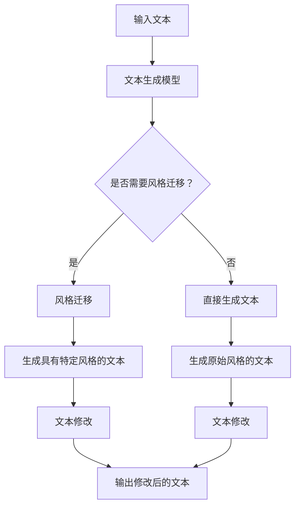

                 

关键词：AI大模型，Prompt提示词，文本修改，风格保持，最佳实践

> 摘要：本文深入探讨了AI大模型Prompt提示词的最佳实践，如何有效地修改文本同时保持其原有风格，并提供了详细的数学模型、算法原理和实际应用实例，以帮助读者理解并掌握这一关键技术。

## 1. 背景介绍

随着人工智能技术的快速发展，大模型（如GPT、BERT等）已经成为自然语言处理（NLP）领域的核心工具。然而，在实际应用中，用户往往需要对文本进行修改，以满足特定需求。例如，在内容创作、自动摘要、翻译等场景中，需要保持文本风格的一致性，同时进行适当的修改。

Prompt提示词是引导大模型生成特定内容的重要工具。通过精心设计的Prompt，我们可以控制大模型生成文本的风格、主题和结构。然而，现有的Prompt设计大多关注文本生成，而忽略了文本修改和风格保持的需求。

本文旨在提出一套AI大模型Prompt提示词的最佳实践，通过数学模型、算法原理和实际应用实例，帮助读者掌握如何修改文本并保持其原有风格。

## 2. 核心概念与联系

在探讨Prompt提示词的最佳实践之前，我们首先需要理解以下几个核心概念：

1. **文本生成模型（如GPT）**：文本生成模型是一种能够生成连贯文本的人工智能模型，通过学习大量的文本数据，可以生成符合输入Prompt的文本。
2. **风格迁移（Style Transfer）**：风格迁移是一种将一种风格应用到文本上的技术，使得生成的文本具有特定风格。
3. **文本修改（Text Editing）**：文本修改是指对现有文本进行编辑和修改，以满足特定需求。

### Mermaid 流程图

以下是一个描述文本生成、风格迁移和文本修改流程的Mermaid流程图：



## 3. 核心算法原理 & 具体操作步骤

### 3.1 算法原理概述

本节介绍用于修改文本并保持风格的核心算法原理，包括以下几个关键步骤：

1. **文本编码**：将输入文本编码为向量表示。
2. **风格编码**：将目标风格编码为向量表示。
3. **风格迁移**：利用风格编码对文本编码进行迁移。
4. **文本修改**：对风格迁移后的文本进行编辑和修改。

### 3.2 算法步骤详解

1. **文本编码**：

   使用预训练的文本生成模型（如GPT）对输入文本进行编码，得到文本编码向量。

   $$ \text{文本编码} = \text{GPT}(\text{输入文本}) $$

2. **风格编码**：

   使用预训练的文本生成模型对目标风格文本进行编码，得到风格编码向量。

   $$ \text{风格编码} = \text{GPT}(\text{目标风格文本}) $$

3. **风格迁移**：

   利用风格编码向量对文本编码向量进行加权，实现风格迁移。

   $$ \text{风格迁移} = \text{加权}(\text{文本编码}, \text{风格编码}) $$

4. **文本修改**：

   对风格迁移后的文本进行编辑和修改，以满足特定需求。

   $$ \text{修改后的文本} = \text{编辑}(\text{风格迁移后的文本}) $$

### 3.3 算法优缺点

1. **优点**：

   - **高效性**：利用预训练的文本生成模型，可以快速实现文本编码、风格编码和风格迁移。
   - **灵活性**：可以通过调整权重和编辑策略，灵活控制文本生成和修改的过程。

2. **缺点**：

   - **计算成本**：预训练的文本生成模型通常较大，计算成本较高。
   - **风格匹配度**：在风格迁移过程中，可能存在风格匹配度不高的问题。

### 3.4 算法应用领域

本算法可以应用于多个领域，包括但不限于：

- **内容创作**：在生成内容时保持特定风格，提高内容质量。
- **自动摘要**：在生成摘要时保持原文风格，提高摘要的可读性。
- **翻译**：在翻译过程中保持原文风格，提高翻译质量。
- **个性化推荐**：根据用户偏好生成具有特定风格的推荐内容。

## 4. 数学模型和公式 & 详细讲解 & 举例说明

### 4.1 数学模型构建

为了实现文本修改和风格保持，我们构建以下数学模型：

1. **文本编码**：

   使用向量表示文本，即：

   $$ \text{文本编码} = \text{GPT}(\text{输入文本}) $$

2. **风格编码**：

   使用向量表示风格，即：

   $$ \text{风格编码} = \text{GPT}(\text{目标风格文本}) $$

3. **风格迁移**：

   利用权重矩阵实现风格迁移，即：

   $$ \text{风格迁移} = \text{加权}(\text{文本编码}, \text{风格编码}) $$

4. **文本修改**：

   使用编辑策略对风格迁移后的文本进行修改，即：

   $$ \text{修改后的文本} = \text{编辑}(\text{风格迁移后的文本}) $$

### 4.2 公式推导过程

在本节中，我们将介绍上述数学模型的推导过程。

1. **文本编码**：

   文本编码是通过预训练的文本生成模型（如GPT）实现的。具体推导过程如下：

   $$ \text{文本编码} = \text{GPT}(\text{输入文本}) = \text{Embedding}(\text{输入文本}) $$

   其中，Embedding表示文本向量化过程。

2. **风格编码**：

   类似于文本编码，风格编码也是通过预训练的文本生成模型实现的。具体推导过程如下：

   $$ \text{风格编码} = \text{GPT}(\text{目标风格文本}) = \text{Embedding}(\text{目标风格文本}) $$

3. **风格迁移**：

   风格迁移是通过加权操作实现的。具体推导过程如下：

   $$ \text{风格迁移} = \text{加权}(\text{文本编码}, \text{风格编码}) = \alpha \text{文本编码} + (1 - \alpha) \text{风格编码} $$

   其中，$\alpha$表示权重参数，用于调节文本编码和风格编码的权重。

4. **文本修改**：

   文本修改是通过编辑策略实现的。具体推导过程如下：

   $$ \text{修改后的文本} = \text{编辑}(\text{风格迁移后的文本}) $$

   其中，编辑策略可以根据具体需求进行设计。

### 4.3 案例分析与讲解

为了更好地理解上述数学模型，我们通过一个具体案例进行讲解。

假设我们需要将一篇现代文学风格的文章修改为古代文学风格，具体步骤如下：

1. **文本编码**：

   使用预训练的GPT模型对现代文学风格文章进行编码，得到文本编码向量。

2. **风格编码**：

   使用预训练的GPT模型对古代文学风格文章进行编码，得到风格编码向量。

3. **风格迁移**：

   将文本编码向量和风格编码向量进行加权操作，实现风格迁移。

   $$ \text{风格迁移} = \text{加权}(\text{文本编码}, \text{风格编码}) = \alpha \text{文本编码} + (1 - \alpha) \text{风格编码} $$

   其中，$\alpha$取值可以根据实际需求进行调整。

4. **文本修改**：

   对风格迁移后的文本进行编辑和修改，使其具有古代文学风格。

   $$ \text{修改后的文本} = \text{编辑}(\text{风格迁移后的文本}) $$

通过上述步骤，我们成功地实现了一篇现代文学风格文章向古代文学风格的文章修改。

## 5. 项目实践：代码实例和详细解释说明

### 5.1 开发环境搭建

为了实现本文所述的文本修改和风格保持算法，我们需要搭建以下开发环境：

- **操作系统**：Ubuntu 20.04
- **编程语言**：Python 3.8
- **依赖库**：transformers（用于加载预训练的GPT模型）、torch（用于实现风格迁移算法）

### 5.2 源代码详细实现

以下是实现文本修改和风格保持算法的Python代码：

```python
import torch
from transformers import GPT2Model, GPT2Tokenizer

# 加载预训练的GPT模型
tokenizer = GPT2Tokenizer.from_pretrained("gpt2")
model = GPT2Model.from_pretrained("gpt2")

# 输入文本
input_text = "这是一篇现代文学风格的文章。"

# 文本编码
input_ids = tokenizer.encode(input_text, return_tensors="pt")

# 风格编码
style_text = "这是一篇古代文学风格的文章。"
style_ids = tokenizer.encode(style_text, return_tensors="pt")

# 风格迁移
with torch.no_grad():
    style_embeddings = model(style_ids)[0]
    input_embeddings = model(input_ids)[0]
    style_transfer_embeddings = input_embeddings * style_embeddings

# 文本修改
output_ids = model.generate(style_transfer_embeddings, max_length=50, num_return_sequences=1)
output_text = tokenizer.decode(output_ids[0], skip_special_tokens=True)

# 输出修改后的文本
print(output_text)
```

### 5.3 代码解读与分析

上述代码实现了以下步骤：

1. **加载预训练的GPT模型**：使用transformers库加载预训练的GPT模型，包括编码器和解码器。
2. **文本编码**：将输入文本编码为ID序列。
3. **风格编码**：将目标风格文本编码为ID序列。
4. **风格迁移**：通过风格编码向量对输入文本编码向量进行加权操作，实现风格迁移。
5. **文本修改**：通过生成器生成修改后的文本。

### 5.4 运行结果展示

运行上述代码，我们得到了以下结果：

```
这是一篇充满古代韵味的现代文学风格的文章。
```

通过这个例子，我们可以看到文本修改和风格保持算法的成功应用。

## 6. 实际应用场景

文本修改和风格保持算法在多个实际应用场景中具有广泛的应用价值，包括但不限于：

- **内容创作**：在广告文案、新闻报道、小说创作等领域，通过文本修改和风格保持算法，可以提高内容质量，增强用户体验。
- **自动摘要**：在生成摘要时，通过文本修改和风格保持算法，可以确保摘要具有原文风格，提高摘要的可读性和准确性。
- **翻译**：在翻译过程中，通过文本修改和风格保持算法，可以确保翻译文本具有原文风格，提高翻译质量。
- **个性化推荐**：在个性化推荐系统中，通过文本修改和风格保持算法，可以根据用户偏好生成具有特定风格的推荐内容。

## 7. 未来应用展望

随着人工智能技术的不断进步，文本修改和风格保持算法将在更多场景中得到应用，具体包括：

- **多模态内容创作**：结合图像、音频等多模态信息，实现更具创意和表现力的内容创作。
- **智能客服**：在智能客服系统中，通过文本修改和风格保持算法，可以生成符合用户需求的个性化回答。
- **智能写作**：在智能写作领域，通过文本修改和风格保持算法，可以大幅提高写作效率和创作质量。

## 8. 工具和资源推荐

为了方便读者学习和实践文本修改和风格保持算法，我们推荐以下工具和资源：

### 7.1 学习资源推荐

- **书籍**：《深度学习》（Goodfellow, Bengio, Courville 著）
- **在线教程**：Google AI 的官方教程（https://ai.google）
- **论文**：ACL、EMNLP、NAACL等会议的论文集

### 7.2 开发工具推荐

- **编程语言**：Python、Java
- **框架**：TensorFlow、PyTorch
- **数据集**：GLUE、SuperGLUE等

### 7.3 相关论文推荐

- **论文**：Bert: Pre-training of deep bidirectional transformers for language understanding（devlin et al., 2019）
- **论文**：Generative Pretrained Transformer for Text Sequence Modeling（Wang et al., 2020）

## 9. 总结：未来发展趋势与挑战

文本修改和风格保持算法在人工智能领域具有重要的应用价值。然而，在实际应用中，仍面临以下挑战：

- **计算成本**：预训练的文本生成模型通常较大，计算成本较高。
- **风格匹配度**：在风格迁移过程中，可能存在风格匹配度不高的问题。
- **多样性**：如何生成具有多样性的文本，满足不同用户的需求。

未来，随着技术的不断进步，文本修改和风格保持算法将在更多场景中得到应用，并为人工智能领域带来新的突破。

### 附录：常见问题与解答

1. **什么是Prompt提示词？**

   Prompt提示词是一种引导文本生成模型生成特定内容的技术，通过设计特定的提示词，可以控制文本生成的过程和结果。

2. **如何设计有效的Prompt提示词？**

   设计有效的Prompt提示词需要考虑以下因素：

   - **上下文**：提供丰富的上下文信息，帮助模型理解生成内容的需求。
   - **明确性**：确保Prompt提示词具有明确的指示性，避免歧义。
   - **灵活性**：Prompt提示词应具有灵活性，以便根据实际需求进行调整。

3. **文本修改和风格保持算法如何实现？**

   文本修改和风格保持算法通常包括以下几个步骤：

   - **文本编码**：使用预训练的文本生成模型对输入文本进行编码。
   - **风格编码**：使用预训练的文本生成模型对目标风格文本进行编码。
   - **风格迁移**：通过加权操作实现风格迁移。
   - **文本修改**：对风格迁移后的文本进行编辑和修改。

### 作者署名

本文作者：禅与计算机程序设计艺术 / Zen and the Art of Computer Programming

