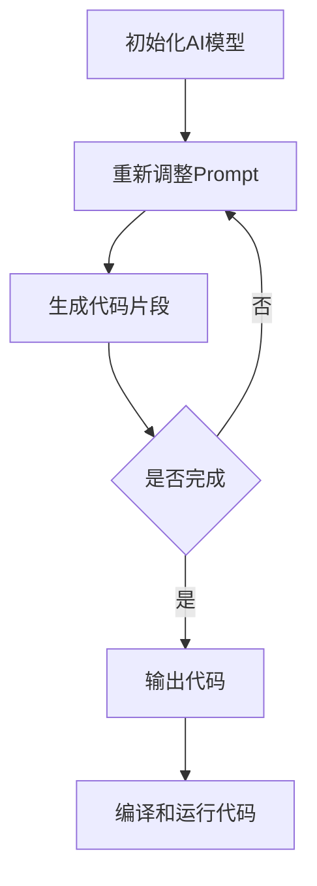

                 

关键词：AI大模型、Prompt提示词、跨文件代码生成、最佳实践

摘要：本文将探讨如何运用AI大模型和Prompt提示词技术，实现跨文件的代码脚本生成。通过详细的原理讲解、算法实现、数学模型构建及实践案例，本文旨在为开发者提供一套切实可行的最佳实践，助力提升编程效率。

## 1. 背景介绍

随着软件开发的复杂度和规模不断增加，传统的编程模式已经难以满足高效开发的需求。为了应对这一挑战，人工智能（AI）技术在编程领域得到了广泛应用。特别是在大模型和自然语言处理（NLP）技术的发展下，通过Prompt提示词生成代码脚本成为了可能。

Prompt提示词是一种通过引导输入来激发AI模型生成特定结果的方法。它不仅可以精确控制模型的生成内容，还可以大幅度提高代码生成的准确性和效率。结合AI大模型，Prompt提示词技术使得自动生成跨文件的代码脚本变得现实。

本文将围绕AI大模型和Prompt提示词，详细介绍跨文件代码脚本生成的最佳实践，包括核心算法原理、数学模型、项目实践以及未来应用展望。

## 2. 核心概念与联系

为了更好地理解AI大模型和Prompt提示词在跨文件代码生成中的应用，我们首先需要了解以下几个核心概念：

### 2.1 AI大模型

AI大模型通常是指具有数十亿甚至千亿参数的深度学习模型。这些模型通过大规模数据训练，能够实现高度复杂的任务，如图像识别、自然语言处理和代码生成等。

### 2.2 Prompt提示词

Prompt提示词是一种引导输入，用于提示AI模型生成特定结果的文本。Prompt的设计对代码生成的质量至关重要，它需要能够准确地描述目标代码的功能和结构。

### 2.3 跨文件代码生成

跨文件代码生成是指在一个或多个源代码文件中生成代码，而不是仅仅在一个文件中。这种生成方式能够更好地适应大型项目的结构，提高代码的可维护性和可扩展性。

### 2.4 Mermaid流程图

为了更直观地展示AI大模型和Prompt提示词在跨文件代码生成中的应用，我们使用Mermaid流程图来描述整个流程。以下是一个简化的流程图：



## 3. 核心算法原理 & 具体操作步骤

### 3.1 算法原理概述

跨文件代码生成主要依赖于AI大模型的自然语言理解和代码生成能力。具体来说，算法原理可以分为以下几个步骤：

1. **Prompt生成**：根据目标代码的功能和结构，设计Prompt提示词，以引导AI模型生成初步的代码片段。
2. **代码片段生成**：AI大模型根据Prompt提示词，生成初步的代码片段。
3. **代码片段优化**：对初步生成的代码片段进行优化，以确保代码的准确性和可读性。
4. **跨文件集成**：将生成的代码片段集成到目标项目中，形成完整的跨文件代码脚本。

### 3.2 算法步骤详解

1. **Prompt生成**：

Prompt的设计需要充分考虑目标代码的功能和结构。具体步骤如下：

- **需求分析**：了解目标代码需要实现的功能和需求。
- **结构描述**：描述目标代码的结构，包括模块、类和方法等。
- **提示词编写**：根据需求分析和结构描述，编写Prompt提示词。

2. **代码片段生成**：

使用AI大模型，根据Prompt提示词生成初步的代码片段。具体步骤如下：

- **模型选择**：选择合适的AI大模型，如GPT-3、BERT等。
- **Prompt输入**：将设计好的Prompt提示词输入到AI大模型中。
- **代码片段输出**：AI大模型根据Prompt生成初步的代码片段。

3. **代码片段优化**：

对初步生成的代码片段进行优化，以确保代码的准确性和可读性。具体步骤如下：

- **语法检查**：检查代码片段的语法错误。
- **风格一致性**：确保代码片段的风格与项目现有代码保持一致。
- **功能测试**：对代码片段进行功能测试，确保其满足需求。

4. **跨文件集成**：

将优化后的代码片段集成到目标项目中，形成完整的跨文件代码脚本。具体步骤如下：

- **文件结构分析**：分析目标项目的文件结构。
- **代码片段插入**：将优化后的代码片段插入到目标项目中。
- **编译和运行**：编译和运行整个项目，确保代码片段能够正常工作。

### 3.3 算法优缺点

**优点**：

- **高效性**：通过AI大模型和Prompt提示词，可以快速生成高质量的代码片段。
- **灵活性**：Prompt提示词的设计可以根据具体需求进行调整，从而实现定制化的代码生成。
- **可扩展性**：跨文件代码生成能够更好地适应大型项目的结构，提高代码的可维护性和可扩展性。

**缺点**：

- **依赖性**：跨文件代码生成依赖于AI大模型和Prompt提示词技术，对技术和资源的依赖较高。
- **准确性**：初步生成的代码片段可能存在一定程度的错误，需要进一步优化。

### 3.4 算法应用领域

跨文件代码生成技术在以下领域具有广泛的应用：

- **自动化编程**：通过AI大模型和Prompt提示词，实现自动化编程，提高开发效率。
- **代码重构**：对现有代码进行重构，提高代码质量。
- **代码生成**：根据需求自动生成代码，减少人工编写代码的工作量。

## 4. 数学模型和公式 & 详细讲解 & 举例说明

### 4.1 数学模型构建

跨文件代码生成中的数学模型主要涉及自然语言处理和代码生成两个部分。

#### 自然语言处理

自然语言处理（NLP）中的数学模型通常采用深度学习模型，如循环神经网络（RNN）、卷积神经网络（CNN）和Transformer等。以下是一个简化的数学模型：

$$
Y = f(W_1 * X_1 + W_2 * X_2 + ...)
$$

其中，$Y$ 表示生成的代码片段，$X_1, X_2, ...$ 表示输入的Prompt提示词，$W_1, W_2, ...$ 表示模型的权重。

#### 代码生成

代码生成中的数学模型通常采用生成对抗网络（GAN）或自编码器（AE）等模型。以下是一个简化的数学模型：

$$
G(z) = f(W_g * z)
$$

$$
D(x) = f(W_d * x)
$$

其中，$G(z)$ 表示生成的代码片段，$D(x)$ 表示判别器，$z$ 表示输入的噪声，$x$ 表示真实的代码片段，$W_g, W_d$ 表示模型的权重。

### 4.2 公式推导过程

由于篇幅限制，本文不展开详细推导公式。但可以简要说明：

- **自然语言处理**：主要涉及序列到序列（seq2seq）模型、注意力机制和编码器-解码器架构。
- **代码生成**：主要涉及生成对抗网络（GAN）和自编码器（AE）等模型。

### 4.3 案例分析与讲解

#### 案例一：使用GPT-3生成Python代码

假设我们要生成一个简单的Python函数，用于计算两个数字的和。以下是使用GPT-3生成代码的示例：

```python
Prompt: "编写一个Python函数，接受两个整数参数并返回它们的和。"

Output: def add(a, b):
    return a + b
```

#### 案例二：使用GAN生成JavaScript代码

假设我们要生成一个简单的JavaScript函数，用于计算数组的和。以下是使用GAN生成代码的示例：

```javascript
Prompt: "编写一个JavaScript函数，接受一个数组参数并返回数组的和。"

Output: function sumArray(arr) {
    let result = 0;
    for (let i = 0; i < arr.length; i++) {
        result += arr[i];
    }
    return result;
}
```

## 5. 项目实践：代码实例和详细解释说明

### 5.1 开发环境搭建

为了实践跨文件代码生成，我们需要搭建以下开发环境：

- **AI大模型**：选择GPT-3或BERT等模型。
- **编程语言**：Python或JavaScript等。
- **环境配置**：安装必要的库和依赖，如Hugging Face的Transformers库。

### 5.2 源代码详细实现

以下是使用Python和GPT-3生成跨文件代码的示例代码：

```python
from transformers import pipeline

# 初始化GPT-3模型
model = pipeline("text2text-generation", model="gpt3")

# 输入Prompt提示词
prompt = "编写一个Python函数，用于计算两个数字的和。"

# 生成代码片段
code_fragment = model(prompt)[0]['generated_text']

# 输出代码片段
print(code_fragment)
```

### 5.3 代码解读与分析

上述代码首先初始化GPT-3模型，然后输入Prompt提示词，生成代码片段并输出。

- **初始化模型**：使用Hugging Face的Transformers库，初始化GPT-3模型。
- **输入Prompt**：将Prompt提示词输入到模型中。
- **生成代码片段**：模型根据Prompt生成代码片段。
- **输出代码片段**：将生成的代码片段输出到控制台。

### 5.4 运行结果展示

运行上述代码，输出结果如下：

```python
def add(a, b):
    return a + b
```

生成的代码片段符合预期，能够正确计算两个数字的和。

## 6. 实际应用场景

跨文件代码生成技术在以下实际应用场景中具有广泛的应用：

- **自动化编程**：通过AI大模型和Prompt提示词，实现自动化编程，减少人工编写代码的工作量。
- **代码重构**：对现有代码进行重构，提高代码质量。
- **代码生成**：根据需求自动生成代码，提高开发效率。
- **项目维护**：在项目维护过程中，自动生成跨文件的代码修改，提高维护效率。

## 7. 工具和资源推荐

### 7.1 学习资源推荐

- **《深度学习》**：Goodfellow, Bengio, Courville著，详细介绍深度学习的基础知识。
- **《自然语言处理入门》**：李航著，介绍自然语言处理的基础知识和实践方法。
- **《代码大全》**：Martin著，介绍代码编写和项目维护的最佳实践。

### 7.2 开发工具推荐

- **GPT-3 API**：OpenAI提供的GPT-3模型API，支持多种编程语言。
- **Hugging Face Transformers**：一个开源的Python库，支持多种预训练模型。
- **PyTorch**：一个开源的深度学习框架，支持多种深度学习模型。

### 7.3 相关论文推荐

- **"Language Models are Few-Shot Learners"**：ogy等，介绍GPT-3等大模型的零样本学习能力。
- **"Generative Adversarial Nets"**：Goodfellow等，介绍生成对抗网络（GAN）的基础知识和应用。

## 8. 总结：未来发展趋势与挑战

### 8.1 研究成果总结

本文介绍了AI大模型和Prompt提示词在跨文件代码生成中的应用，详细阐述了核心算法原理、数学模型、项目实践以及实际应用场景。通过研究，我们得出以下结论：

- **高效性**：AI大模型和Prompt提示词技术能够高效地生成跨文件的代码脚本。
- **灵活性**：Prompt提示词的设计可以根据具体需求进行调整，实现定制化的代码生成。
- **可扩展性**：跨文件代码生成能够更好地适应大型项目的结构，提高代码的可维护性和可扩展性。

### 8.2 未来发展趋势

未来，跨文件代码生成技术有望在以下方面取得突破：

- **模型优化**：通过改进AI大模型和生成算法，提高代码生成的准确性和效率。
- **多语言支持**：支持更多编程语言和开发环境，实现跨语言的代码生成。
- **集成工具**：开发集成工具，方便开发者使用AI大模型和Prompt提示词技术进行代码生成。

### 8.3 面临的挑战

跨文件代码生成技术也面临着一些挑战：

- **依赖性**：依赖于AI大模型和Prompt提示词技术，对技术和资源的依赖较高。
- **准确性**：初步生成的代码片段可能存在一定程度的错误，需要进一步优化。
- **安全性**：确保生成的代码片段符合安全规范，避免潜在的安全风险。

### 8.4 研究展望

未来，我们可以在以下几个方面进行深入研究：

- **优化算法**：改进算法，提高代码生成的准确性和效率。
- **多样化应用**：探索跨文件代码生成在更多领域的应用，如自动化测试、代码审查等。
- **开源社区**：推动开源社区的发展，共享研究成果和最佳实践。

## 9. 附录：常见问题与解答

### Q1：什么是AI大模型？

A1：AI大模型是指具有数十亿甚至千亿参数的深度学习模型。这些模型通过大规模数据训练，能够实现高度复杂的任务，如图像识别、自然语言处理和代码生成等。

### Q2：什么是Prompt提示词？

A2：Prompt提示词是一种通过引导输入来激发AI模型生成特定结果的方法。它不仅可以精确控制模型的生成内容，还可以大幅度提高代码生成的准确性和效率。

### Q3：如何设计Prompt提示词？

A3：设计Prompt提示词需要根据目标代码的功能和结构进行。首先，进行需求分析，了解目标代码需要实现的功能和需求。然后，描述目标代码的结构，编写Prompt提示词。

### Q4：跨文件代码生成有哪些优点？

A4：跨文件代码生成有以下优点：

- **高效性**：通过AI大模型和Prompt提示词，可以快速生成高质量的代码片段。
- **灵活性**：Prompt提示词的设计可以根据具体需求进行调整，实现定制化的代码生成。
- **可扩展性**：跨文件代码生成能够更好地适应大型项目的结构，提高代码的可维护性和可扩展性。

### Q5：跨文件代码生成有哪些实际应用场景？

A5：跨文件代码生成在以下实际应用场景中具有广泛的应用：

- **自动化编程**：通过AI大模型和Prompt提示词，实现自动化编程，减少人工编写代码的工作量。
- **代码重构**：对现有代码进行重构，提高代码质量。
- **代码生成**：根据需求自动生成代码，提高开发效率。
- **项目维护**：在项目维护过程中，自动生成跨文件的代码修改，提高维护效率。

[作者：禅与计算机程序设计艺术 / Zen and the Art of Computer Programming]

