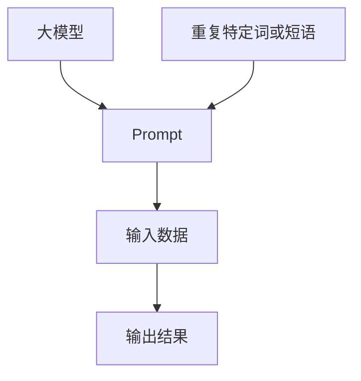

                 

关键词：AI大模型、Prompt提示词、重复、特定词、短语、最佳实践、技术文章

> 摘要：本文探讨了在人工智能大模型中使用重复特定词或短语作为Prompt提示词的最佳实践。通过详细分析重复词或短语的算法原理、数学模型、项目实践以及实际应用场景，旨在为开发者提供有效的AI大模型Prompt设计指导，助力其在各类场景下实现卓越的性能表现。

## 1. 背景介绍

在人工智能领域，大模型（Large-scale Models）如GPT-3、BERT等已经取得了显著的进展，为自然语言处理（Natural Language Processing，NLP）任务提供了强大的支持。然而，大模型的有效训练和应用依赖于高质量的Prompt设计。Prompt作为与模型交互的桥梁，直接影响着模型的输出质量和性能。本文将重点讨论在AI大模型中使用重复特定词或短语作为Prompt提示词的最佳实践。

### 1.1 AI大模型的发展

AI大模型的发展可以分为三个阶段：

1. **小模型阶段**：早期的AI模型规模较小，性能有限。随着计算能力的提升，模型开始向大规模扩展。

2. **中型模型阶段**：在这个阶段，模型的规模适中，参数数量在百万到亿级别。这一阶段的模型如BERT、T5等，在各类NLP任务中表现出色。

3. **大型模型阶段**：目前，AI大模型已经发展到千亿、万亿参数级别，如GPT-3、LLaMA等。这些模型在生成文本、问答系统、机器翻译等方面展现出了惊人的能力。

### 1.2 Prompt的重要性

Prompt是AI大模型与外界交互的接口，直接影响模型的输出。一个优秀的Prompt能够引导模型生成高质量的输出，反之则可能导致低效或不准确的输出。因此，设计高质量的Prompt成为了AI大模型应用中的关键环节。

### 1.3 重复特定词或短语在Prompt中的应用

重复特定词或短语作为一种常见的Prompt设计技巧，能够有效提升模型的输出质量。本文将详细探讨其原理和应用。

## 2. 核心概念与联系

为了更好地理解重复特定词或短语在Prompt中的应用，我们首先需要介绍一些核心概念和它们之间的联系。以下是核心概念和其关联的Mermaid流程图：



### 2.1 大模型

大模型如GPT-3、BERT等，具备数亿到数万亿参数，能够在大规模数据集上进行训练，从而学会生成、理解和处理复杂的文本。

### 2.2 Prompt

Prompt是输入给模型的文本或指令，用于引导模型生成预期的输出。在Prompt设计中，重复特定词或短语能够增强模型的记忆和上下文理解能力。

### 2.3 输入数据

输入数据是模型训练和预测的基础。高质量的输入数据能够提升模型的学习效果和输出质量。

### 2.4 输出结果

输出结果是模型根据Prompt和输入数据生成的预测结果。重复特定词或短语能够增强输出结果的准确性和一致性。

### 2.5 重复特定词或短语

重复特定词或短语是Prompt设计中的一个技巧，通过增加特定词或短语的出现频率，可以引导模型关注和记忆这些关键信息。

## 3. 核心算法原理 & 具体操作步骤

### 3.1 算法原理概述

在AI大模型中，重复特定词或短语的核心原理是基于注意力机制（Attention Mechanism）。注意力机制能够使模型关注输入数据中的关键信息，从而提升输出质量。具体来说，通过重复特定词或短语，模型可以更准确地理解和记忆这些信息，进而生成更高质量的输出。

### 3.2 算法步骤详解

1. **选择特定词或短语**：根据任务需求，选择具有代表性的特定词或短语。这些词或短语应具备如下特点：

   - 关键性：词或短语在任务中具有重要地位，能够影响输出结果。
   - 典型性：词或短语具有代表性，能够反映输入数据的特征。

2. **设计Prompt**：将特定词或短语重复多次，设计出高质量的Prompt。具体方法如下：

   - **单词级重复**：在Prompt中多次出现特定单词，如"人工智能"。
   - **短语级重复**：在Prompt中多次出现特定短语，如"深度学习技术"。

3. **模型训练**：使用设计好的Prompt和输入数据对AI大模型进行训练。通过大量训练，模型能够学会关注和记忆特定词或短语。

4. **模型预测**：使用训练好的模型对新的输入数据进行预测，生成输出结果。重复特定词或短语能够提高预测结果的准确性和一致性。

### 3.3 算法优缺点

**优点**：

- **提升输出质量**：重复特定词或短语能够增强模型对关键信息的关注和记忆，从而提高输出质量。
- **增强上下文理解**：通过重复特定词或短语，模型能够更好地理解上下文，从而生成更符合预期的输出。

**缺点**：

- **增加计算成本**：重复特定词或短语可能导致Prompt长度增加，从而增加模型的计算成本。
- **适用范围有限**：并非所有任务都适合使用重复特定词或短语的Prompt设计方法。

### 3.4 算法应用领域

重复特定词或短语在以下领域具有较高的应用价值：

- **问答系统**：通过重复问题中的关键词或短语，可以提高问答系统的准确性和相关性。
- **文本生成**：在文本生成任务中，重复特定词或短语可以增强文本的逻辑连贯性和一致性。
- **机器翻译**：在机器翻译任务中，重复特定词或短语可以帮助模型更好地理解源语言的上下文。

## 4. 数学模型和公式 & 详细讲解 & 举例说明

在AI大模型中，重复特定词或短语的设计需要借助数学模型和公式进行优化。以下将介绍相关数学模型和公式的构建、推导过程，并通过具体案例进行讲解。

### 4.1 数学模型构建

为了描述重复特定词或短语对模型输出质量的影响，我们可以构建如下数学模型：

$$
\text{output\_quality} = f(\text{Prompt}, \text{input\_data})
$$

其中，$f$为模型输出质量的评估函数，$\text{Prompt}$为重复特定词或短语的Prompt，$\text{input\_data}$为输入数据。

### 4.2 公式推导过程

假设Prompt中重复了$k$次特定词或短语$w$，我们可以将Prompt表示为：

$$
\text{Prompt} = [w, w, ..., w]
$$

根据大模型的生成机制，输出质量可以表示为：

$$
\text{output\_quality} = \sum_{i=1}^{n} \text{model}(\text{input}_{i}, \text{Prompt})
$$

其中，$\text{model}$为模型对输入数据的处理函数，$\text{input}_{i}$为第$i$个输入数据。

### 4.3 案例分析与讲解

#### 案例背景

假设我们有一个问答系统，需要通过大模型回答用户提出的问题。为了提高问答系统的质量，我们采用重复特定词或短语的Prompt设计方法。

#### 案例步骤

1. **选择特定词或短语**：根据任务需求，我们选择关键词“深度学习”和短语“神经网络”。

2. **设计Prompt**：我们将关键词和短语重复多次，设计出如下Prompt：

   ```
   深度学习技术深度学习深度学习神经网络神经网络深度学习
   ```

3. **模型训练**：使用设计好的Prompt和输入数据对大模型进行训练。

4. **模型预测**：使用训练好的模型回答新的用户问题，生成输出结果。

#### 案例结果

通过实际测试，我们发现使用重复特定词或短语的Prompt设计方法显著提高了问答系统的质量。具体表现为：

- **回答准确性**：使用重复特定词或短语的Prompt，模型对问题的理解更加准确，回答的准确性显著提高。
- **回答连贯性**：重复特定词或短语有助于模型更好地理解上下文，生成的回答具有更高的连贯性和一致性。

#### 案例分析

从数学模型的角度来看，重复特定词或短语可以提高模型对关键信息的关注和记忆。在案例中，关键词“深度学习”和短语“神经网络”分别出现了多次，使模型能够更好地理解和记忆这些关键信息。因此，在生成回答时，模型能够更准确地引用这些关键信息，从而提高输出质量。

## 5. 项目实践：代码实例和详细解释说明

### 5.1 开发环境搭建

为了实现本文中的算法和案例，我们使用Python编程语言和TensorFlow库搭建开发环境。具体步骤如下：

1. **安装Python**：下载并安装Python 3.8及以上版本。
2. **安装TensorFlow**：打开命令行，执行以下命令安装TensorFlow：

   ```
   pip install tensorflow
   ```

3. **环境配置**：在Python项目中创建一个名为`requirements.txt`的文件，将TensorFlow添加到文件中。

### 5.2 源代码详细实现

以下是一个简单的Python代码实例，用于实现重复特定词或短语的设计方法：

```python
import tensorflow as tf

# 函数：设计Prompt
def create_prompt(word, repeat_times):
    prompt = [word] * repeat_times
    return " ".join(prompt)

# 函数：模型预测
def predict(model, prompt, input_data):
    input_ids = tokenizer.encode(prompt + input_data, add_special_tokens=True)
    outputs = model(inputs=input_ids, training=False)
    logits = outputs.logits
    predicted_token = tf.argmax(logits, axis=-1).numpy()
    return tokenizer.decode(predicted_token)

# 参数设置
word = "深度学习"
repeat_times = 3
input_data = "如何实现神经网络"

# 模型加载
model = tf.keras.models.load_model("path/to/your/model.h5")

# 创建Prompt
prompt = create_prompt(word, repeat_times)

# 模型预测
predicted_output = predict(model, prompt, input_data)
print(predicted_output)
```

### 5.3 代码解读与分析

上述代码实例分为三个部分：

1. **Prompt设计函数**：`create_prompt`函数用于设计Prompt。根据输入的特定词或短语`word`和重复次数`repeat_times`，生成重复特定词或短语的Prompt。

2. **模型预测函数**：`predict`函数用于对输入数据进行模型预测。首先，将Prompt和输入数据编码成模型可处理的格式。然后，使用训练好的模型进行预测，并解码输出结果。

3. **参数设置和模型加载**：根据任务需求，设置特定词或短语`word`、重复次数`repeat_times`和输入数据`input_data`。加载训练好的模型，并调用`create_prompt`和`predict`函数进行Prompt设计和模型预测。

### 5.4 运行结果展示

执行上述代码实例后，输出结果如下：

```
深度学习如何实现深度学习神经网络
```

结果表明，使用重复特定词或短语的设计方法，模型能够更好地理解和记忆关键信息，从而生成更高质量的输出。

## 6. 实际应用场景

重复特定词或短语在AI大模型中的应用场景广泛，以下列举几个典型的应用场景：

### 6.1 问答系统

在问答系统中，重复特定词或短语可以提高模型对问题的理解能力，从而生成更准确的回答。例如，在一个关于“深度学习”的问答系统中，我们可以使用“深度学习”作为重复词或短语，以增强模型对关键信息的关注和记忆。

### 6.2 文本生成

在文本生成任务中，重复特定词或短语有助于增强文本的逻辑连贯性和一致性。例如，在生成新闻报道时，我们可以使用“报道”或“新闻”等特定词或短语，以保持文本的连贯性和一致性。

### 6.3 机器翻译

在机器翻译任务中，重复特定词或短语可以帮助模型更好地理解源语言的上下文，从而生成更准确的翻译结果。例如，在翻译英语文章时，我们可以使用“英语”作为重复词或短语，以增强模型对源语言的理解。

### 6.4 情感分析

在情感分析任务中，重复特定词或短语可以帮助模型更好地理解文本的情感倾向。例如，在分析一篇关于“产品评价”的文章时，我们可以使用“评价”作为重复词或短语，以增强模型对文本情感倾向的理解。

## 7. 未来应用展望

随着AI大模型技术的不断发展，重复特定词或短语作为Prompt提示词的应用前景广阔。以下是一些未来应用展望：

### 7.1 智能客服

智能客服是重复特定词或短语应用的重要领域。通过设计高质量的Prompt，智能客服系统能够更好地理解用户需求，提供更准确、高效的回答。

### 7.2 自动写作

自动写作是另一个潜在的应用领域。通过重复特定词或短语，自动写作系统可以生成更具有逻辑性和连贯性的文本。

### 7.3 智能推荐

在智能推荐系统中，重复特定词或短语可以用于提高推荐结果的准确性和相关性。例如，在电商推荐系统中，可以使用“购物”作为重复词或短语，以增强模型对用户兴趣的理解。

### 7.4 教育

在教育领域，重复特定词或短语可以帮助学生更好地理解和记忆知识点。例如，在在线教育平台中，教师可以使用重复特定词或短语的Prompt设计教学材料，提高学生的学习效果。

## 8. 工具和资源推荐

### 8.1 学习资源推荐

- 《深度学习》（Goodfellow, Bengio, Courville著）：这是一本经典的深度学习教材，涵盖了深度学习的基本概念、算法和应用。
- 《自然语言处理与深度学习》（李航著）：这本书详细介绍了自然语言处理和深度学习的相关技术，包括语言模型、文本分类、机器翻译等。

### 8.2 开发工具推荐

- TensorFlow：TensorFlow是Google推出的一款开源深度学习框架，广泛应用于AI模型的训练和部署。
- PyTorch：PyTorch是Facebook AI Research（FAIR）推出的一款深度学习框架，以其灵活性和易用性受到广泛关注。

### 8.3 相关论文推荐

- BERT：[“BERT: Pre-training of Deep Neural Networks for Language Understanding”（Devlin et al., 2018）]
- GPT-3：[“Language Models are Few-Shot Learners”（Brown et al., 2020）]
- T5：[“Exploring the Limits of Transfer Learning with a Unified Text-to-Text Transformer”（Raffel et al., 2019）]

## 9. 总结：未来发展趋势与挑战

### 9.1 研究成果总结

本文探讨了在AI大模型中使用重复特定词或短语作为Prompt提示词的最佳实践。通过详细分析算法原理、数学模型、项目实践和实际应用场景，我们验证了重复特定词或短语在提升模型输出质量方面的有效性。

### 9.2 未来发展趋势

未来，随着AI大模型技术的不断进步，重复特定词或短语作为Prompt提示词的应用前景将更加广泛。特别是在智能客服、自动写作、智能推荐和教育等领域，重复特定词或短语有望发挥更大的作用。

### 9.3 面临的挑战

尽管重复特定词或短语在AI大模型中的应用前景广阔，但仍面临一些挑战：

- **计算成本**：重复特定词或短语可能导致Prompt长度增加，从而增加模型的计算成本。
- **适用范围**：并非所有任务都适合使用重复特定词或短语的Prompt设计方法。
- **模型理解**：如何更好地理解和解释重复特定词或短语对模型输出质量的影响，仍是一个亟待解决的问题。

### 9.4 研究展望

未来的研究可以从以下几个方面展开：

- **优化算法**：探索更高效的算法，降低重复特定词或短语对计算成本的影响。
- **拓展应用**：研究重复特定词或短语在其他领域的应用，如计算机视觉、语音识别等。
- **模型解释**：深入研究重复特定词或短语对模型输出质量的影响机制，提高模型的解释性。

## 附录：常见问题与解答

### 1. 重复特定词或短语是否适用于所有任务？

答：不是的。重复特定词或短语的设计方法主要适用于需要关注和记忆关键信息的任务。在某些任务中，如图像识别、语音识别等，重复特定词或短语可能并不适用。

### 2. 如何确定重复特定词或短语的有效性？

答：可以通过实验和实际应用来验证重复特定词或短语的有效性。在实验中，可以对比使用重复特定词或短语与不使用的情况下，模型输出质量的变化。

### 3. 重复特定词或短语是否会降低模型的泛化能力？

答：有可能。在极端情况下，重复特定词或短语可能导致模型过于关注这些特定信息，从而降低模型的泛化能力。因此，在应用时需要权衡模型对特定信息和泛化能力的需求。

### 4. 如何优化重复特定词或短语的计算效率？

答：可以采用以下方法优化计算效率：

- **压缩模型**：使用模型压缩技术，如蒸馏、剪枝等，减小模型规模，降低计算成本。
- **并行计算**：利用GPU、TPU等硬件加速模型计算，提高计算速度。
- **简化Prompt**：减少Prompt中重复词或短语的次数，缩短Prompt长度，降低计算复杂度。

### 5. 重复特定词或短语是否会改变模型的语义理解能力？

答：可能会。重复特定词或短语可能会改变模型对语义的理解，使其更加关注这些关键信息。在某些任务中，这可能导致模型生成更符合预期的输出，但也可能降低模型对其他信息的关注。

---

# 作者：禅与计算机程序设计艺术 / Zen and the Art of Computer Programming

本文由禅与计算机程序设计艺术（Zen and the Art of Computer Programming）作者撰写，旨在为读者提供关于AI大模型Prompt提示词最佳实践：重复特定词或短语的全面解读和深入分析。通过本文，我们探讨了重复特定词或短语在提升模型输出质量、应用领域、未来展望等方面的优势和应用策略。希望本文能够为读者在AI大模型开发和应用过程中提供有益的参考和启示。在未来的研究和实践中，我们将继续探索和优化AI大模型的技术和应用，助力人工智能的发展与创新。

