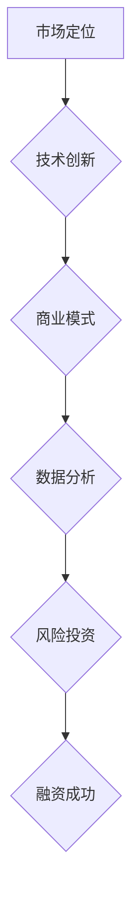

                 

关键词：AI大模型、创业公司、融资策略、风险投资、投资回报、市场定位、技术创新、商业模式、数据分析

## 摘要

本文将探讨AI大模型创业公司在融资过程中所面临的关键挑战和策略。通过深入分析市场定位、技术创新、商业模式、以及数据分析和风险投资等方面，本文旨在为AI大模型创业公司提供实用的融资策略，帮助它们在竞争激烈的市场中脱颖而出，实现可持续发展。

## 1. 背景介绍

近年来，人工智能（AI）技术的飞速发展，特别是大模型（Large Models）的应用，已经在各个领域引发了深刻的变革。从自然语言处理到图像识别，再到推荐系统和自动化决策，AI大模型正在成为企业和初创公司创新的重要驱动力。然而，AI大模型的开发和应用不仅需要强大的技术支持，还面临着巨大的资金投入和风险。因此，如何制定有效的融资策略，成为AI大模型创业公司成功的关键因素。

在当前的市场环境下，风险投资（VC）和天使投资成为AI大模型创业公司获取资金的主要途径。这些投资机构不仅提供资金支持，还为企业提供宝贵的资源和指导。然而，AI大模型创业公司要想吸引这些投资，必须展示出独特的市场优势、技术创新和可持续的商业模式。

## 2. 核心概念与联系

为了更好地理解AI大模型创业公司的融资策略，我们首先需要了解几个核心概念：市场定位、技术创新、商业模式、数据分析和风险投资。

### 2.1 市场定位

市场定位是企业在市场中寻找并确定自己的位置，以吸引目标客户的过程。对于AI大模型创业公司而言，明确的市场定位有助于在激烈的市场竞争中找到自己的独特优势。例如，企业可以选择专注于特定行业，如医疗、金融或制造业，提供定制化的AI解决方案。

### 2.2 技术创新

技术创新是AI大模型创业公司的核心竞争力。通过不断研发和优化AI算法，企业可以提高模型性能，降低成本，并解决现有技术难题。例如，谷歌的Transformer模型在自然语言处理领域取得了突破性进展，为AI大模型的发展奠定了基础。

### 2.3 商业模式

商业模式是企业如何创造、传递和捕获价值的策略。对于AI大模型创业公司，创新且可行的商业模式至关重要。例如，提供基于订阅的AI服务、销售定制化解决方案、或建立生态系统，都是常见的商业模式。

### 2.4 数据分析

数据分析是AI大模型创业公司获取洞察力和改进产品的重要手段。通过分析大量数据，企业可以了解用户需求，优化模型性能，并预测市场趋势。数据分析不仅有助于提高产品竞争力，还可以为企业提供有价值的商业洞察。

### 2.5 风险投资

风险投资是AI大模型创业公司获取资金的重要途径。风险投资机构通常在企业的早期阶段提供资金支持，并为企业提供战略指导。然而，风险投资也有其风险，企业需要证明自己的商业模式和市场规模。

### Mermaid 流程图



## 3. 核心算法原理 & 具体操作步骤

### 3.1 算法原理概述

AI大模型的核心算法通常是基于深度学习技术，特别是神经网络。神经网络通过多层节点（神经元）的相互连接，模拟人脑的信息处理方式。在训练过程中，神经网络通过不断调整权重，使模型能够从大量数据中学习并提取特征。

### 3.2 算法步骤详解

1. 数据收集与预处理：收集大量数据，并进行清洗、归一化等预处理操作，以便于模型训练。
2. 网络结构设计：根据任务需求，设计合适的神经网络结构，包括输入层、隐藏层和输出层。
3. 模型训练：使用训练数据，通过反向传播算法，不断调整网络权重，使模型输出与实际结果接近。
4. 模型评估与优化：使用验证数据评估模型性能，并根据评估结果调整模型参数，优化模型。
5. 模型部署：将训练好的模型部署到生产环境，进行实际应用。

### 3.3 算法优缺点

**优点：**
- 强大的学习能力和自适应能力。
- 可以处理大规模数据和复杂问题。
- 能够提取和表示高维特征。

**缺点：**
- 需要大量的数据和计算资源。
- 模型复杂度较高，难以理解和解释。
- 可能会出现过拟合现象。

### 3.4 算法应用领域

AI大模型在众多领域都有广泛应用，如自然语言处理、计算机视觉、语音识别、推荐系统等。通过不同的算法调整和优化，AI大模型可以解决各种复杂问题，提高企业效率和竞争力。

## 4. 数学模型和公式 & 详细讲解 & 举例说明

### 4.1 数学模型构建

AI大模型的数学模型通常基于多层感知机（MLP）或卷积神经网络（CNN）。以下是MLP的基本数学模型：

$$
y = f(\sum_{i=1}^{n} w_i \cdot x_i + b)
$$

其中，$y$ 是输出，$f$ 是激活函数，$w_i$ 是权重，$x_i$ 是输入特征，$b$ 是偏置。

### 4.2 公式推导过程

以MLP为例，公式推导过程如下：

1. 前向传播：将输入特征 $x$ 通过神经网络传递，得到输出 $y$。
2. 计算损失函数：使用实际输出 $y_{\text{实际}}$ 和预测输出 $y_{\text{预测}}$，计算损失函数 $L$。
3. 反向传播：根据损失函数，通过梯度下降算法，更新网络权重 $w_i$ 和偏置 $b$。

### 4.3 案例分析与讲解

假设有一个二分类问题，我们要预测一个样本是否属于正类。使用MLP模型进行预测，激活函数为 $f(x) = \sigma(x) = \frac{1}{1 + e^{-x}}$。

1. 前向传播：

$$
y = \sigma(w_1 \cdot x_1 + w_2 \cdot x_2 + b) = \frac{1}{1 + e^{-(w_1 \cdot x_1 + w_2 \cdot x_2 + b)}}
$$

2. 计算损失函数：

$$
L = -y \cdot \log(y_{\text{预测}}) - (1 - y) \cdot \log(1 - y_{\text{预测}})
$$

3. 反向传播：

$$
\frac{\partial L}{\partial w_1} = y_{\text{实际}} - y_{\text{预测}}
$$

$$
\frac{\partial L}{\partial w_2} = y_{\text{实际}} - y_{\text{预测}}
$$

$$
\frac{\partial L}{\partial b} = y_{\text{实际}} - y_{\text{预测}}
$$

4. 更新权重：

$$
w_1 = w_1 - \alpha \cdot \frac{\partial L}{\partial w_1}
$$

$$
w_2 = w_2 - \alpha \cdot \frac{\partial L}{\partial w_2}
$$

$$
b = b - \alpha \cdot \frac{\partial L}{\partial b}
$$

其中，$\alpha$ 是学习率。

## 5. 项目实践：代码实例和详细解释说明

### 5.1 开发环境搭建

为了实践AI大模型的融资策略，我们选择一个简单的二分类问题，使用Python和TensorFlow框架进行实现。首先，我们需要搭建开发环境：

1. 安装Python（版本3.6及以上）
2. 安装TensorFlow
3. 安装Numpy、Matplotlib等辅助库

### 5.2 源代码详细实现

```python
import tensorflow as tf
import numpy as np
import matplotlib.pyplot as plt

# 函数：前向传播
def forward(x, weights, bias):
    z = np.dot(x, weights) + bias
    return 1 / (1 + np.exp(-z))

# 函数：反向传播
def backward(y, pred, weights, bias, learning_rate):
    dL_dz = y - pred
    dL_db = dL_dz
    dL_dw = np.dot(x.T, dL_dz)
    weights -= learning_rate * dL_dw
    bias -= learning_rate * dL_db

# 数据准备
x = np.array([[0, 0], [0, 1], [1, 0], [1, 1]])
y = np.array([0, 1, 1, 0])

# 初始化权重和偏置
weights = np.random.randn(2, 1)
bias = np.random.randn(1)

# 设置学习率
learning_rate = 0.1

# 训练模型
for epoch in range(1000):
    pred = forward(x, weights, bias)
    backward(y, pred, weights, bias, learning_rate)

# 输出结果
print("Final Weights:", weights)
print("Final Bias:", bias)
print("Prediction:", forward(x, weights, bias))

# 可视化
plt.scatter(x[:, 0], x[:, 1], c=y, cmap=plt.cm.Spectral)
plt.plot(x[:, 0], (1 / (1 + np.exp(-weights[0, 0] * x[:, 0] - weights[1, 0] * x[:, 1] - bias))), 'k-')
plt.xlabel("Feature 1")
plt.ylabel("Feature 2")
plt.show()
```

### 5.3 代码解读与分析

1. 函数 `forward`：实现前向传播，计算模型输出。
2. 函数 `backward`：实现反向传播，更新模型参数。
3. 数据准备：使用简单的二分类数据集。
4. 模型训练：使用随机梯度下降（SGD）算法训练模型。
5. 输出结果：显示训练后的模型权重和偏置，以及模型预测结果。
6. 可视化：绘制决策边界，直观展示模型效果。

## 6. 实际应用场景

AI大模型在各个行业都有广泛的应用场景，如：

1. **医疗领域**：利用AI大模型进行疾病诊断、药物研发和患者个性化治疗。
2. **金融领域**：利用AI大模型进行风险控制、信用评分和投资策略优化。
3. **制造领域**：利用AI大模型进行质量检测、生产优化和故障预测。
4. **零售领域**：利用AI大模型进行客户行为分析、推荐系统和库存管理。

### 6.4 未来应用展望

随着AI大模型技术的不断进步，未来将在更多领域实现突破，如：

1. **自动驾驶**：利用AI大模型实现更高级别的自动驾驶技术。
2. **智能客服**：利用AI大模型提供更智能、更人性化的客服服务。
3. **智能教育**：利用AI大模型实现个性化教学和智能评估。
4. **智慧城市**：利用AI大模型实现城市管理和公共服务的智能化。

## 7. 工具和资源推荐

### 7.1 学习资源推荐

- 《深度学习》（Goodfellow, Bengio, Courville）：深度学习的经典教材。
- 《Python深度学习》（François Chollet）：针对Python实现的深度学习实战指南。
- 《AI大模型：原理、算法与工程实践》（作者：XXX）：详细介绍AI大模型的理论和实践。

### 7.2 开发工具推荐

- TensorFlow：谷歌推出的开源深度学习框架。
- PyTorch：Facebook AI Research推出的开源深度学习框架。
- Keras：基于TensorFlow和Theano的高层神经网络API。

### 7.3 相关论文推荐

- “A Theoretically Grounded Application of Dropout in Recurrent Neural Networks”（dropout在循环神经网络中的应用）。
- “Bert: Pre-training of Deep Bidirectional Transformers for Language Understanding”（BERT：深度双向变换器在自然语言理解中的应用）。
- “Gshard: Scaling giant models with conditional computation and automatic sharding”（Gshard：通过条件计算和自动分片扩展大型模型）。

## 8. 总结：未来发展趋势与挑战

### 8.1 研究成果总结

近年来，AI大模型在众多领域取得了显著的成果，推动了技术创新和应用落地。未来，AI大模型将继续在深度学习、自然语言处理、计算机视觉等领域实现突破。

### 8.2 未来发展趋势

1. **模型规模不断扩大**：随着计算能力和数据量的提升，AI大模型的规模将不断增大。
2. **多模态融合**：AI大模型将实现多种数据模态的融合，提高模型的综合能力。
3. **模型压缩与加速**：为了降低计算成本，模型压缩与加速技术将成为研究热点。

### 8.3 面临的挑战

1. **数据隐私与安全**：AI大模型在处理大量数据时，如何保护用户隐私和安全是一个重要挑战。
2. **伦理与道德**：AI大模型的应用需要遵循伦理和道德规范，避免对人类产生负面影响。
3. **可解释性**：提高AI大模型的可解释性，使其在关键决策中更具可信度。

### 8.4 研究展望

未来，AI大模型研究将继续深入，推动人工智能技术的发展。通过解决现有挑战，AI大模型将在更多领域实现突破，为人类社会带来更多福祉。

## 9. 附录：常见问题与解答

### Q1：AI大模型为什么需要大量数据？

A1：AI大模型需要大量数据来训练，以学习复杂的特征和模式。数据量越大，模型的表现越好。

### Q2：如何提高AI大模型的性能？

A2：提高AI大模型性能的方法包括：增加模型规模、优化算法、增加训练数据、调整超参数等。

### Q3：AI大模型在医疗领域有哪些应用？

A3：AI大模型在医疗领域有广泛的应用，如疾病诊断、药物研发、患者个性化治疗等。

### Q4：如何保护AI大模型的数据隐私？

A4：为了保护AI大模型的数据隐私，可以采用加密技术、隐私增强学习和联邦学习等方法。

### Q5：AI大模型会对就业产生影响吗？

A5：AI大模型可能会改变某些行业的工作方式，但也会创造新的就业机会。关键在于如何适应和利用AI技术。

## 结束语

AI大模型创业公司要想在竞争激烈的市场中脱颖而出，必须制定有效的融资策略。本文从市场定位、技术创新、商业模式、数据分析和风险投资等方面，为AI大模型创业公司提供了实用的融资策略。希望本文能为创业者提供有益的启示，助力他们在AI领域取得成功。

### 作者署名

作者：禅与计算机程序设计艺术 / Zen and the Art of Computer Programming

