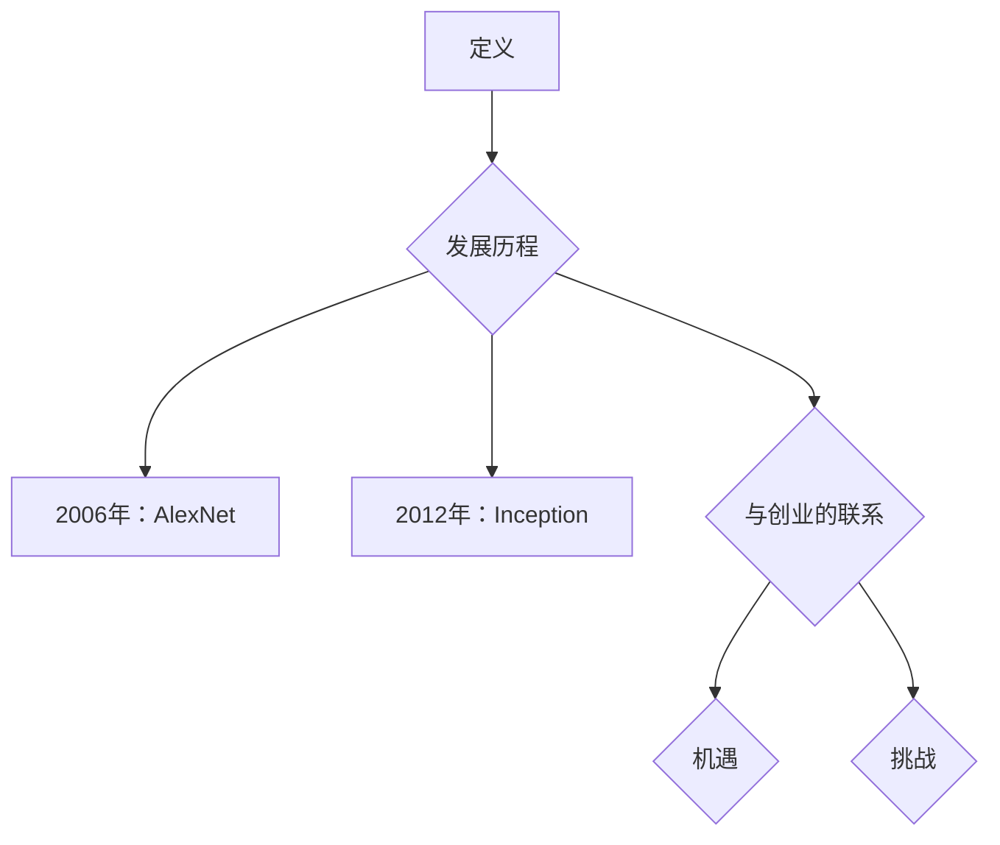

                 

关键词：人工智能大模型，创业，挑战与机遇，技术发展，市场前景

>摘要：随着人工智能技术的快速发展，大模型作为其重要分支，正在成为众多创业者的热门领域。本文将从大模型的定义、发展历程、核心算法、创业挑战与机遇等多个角度，深入探讨大模型创业战中的各种问题和解决方案，为创业者和从业者提供有益的参考。

## 1. 背景介绍

近年来，人工智能（AI）技术在各行各业得到了广泛应用，从自动驾驶到自然语言处理，从图像识别到推荐系统，AI已经深入到了我们生活的方方面面。而大模型作为AI领域的一个重要分支，更是成为了各大科技公司和研究机构竞相追逐的对象。大模型通常指的是具有数亿甚至数十亿参数的深度学习模型，它们在处理复杂任务时具有极高的准确性和鲁棒性。

大模型的崛起，不仅改变了传统的人工智能研究范式，也为创业公司带来了前所未有的机遇。然而，与此同时，大模型的创业之路也充满了挑战。本文将重点探讨这些挑战和机遇，为创业者提供一些建设性的思路。

## 2. 核心概念与联系

### 2.1 大模型的定义

大模型，通常指的是那些具有数亿甚至数十亿参数的深度学习模型。这些模型往往需要大量的数据来训练，并且需要强大的计算资源来支持其运行。大模型在处理复杂任务时具有很高的准确性和鲁棒性，这使得它们在图像识别、自然语言处理、语音识别等领域表现出了出色的性能。

### 2.2 大模型的发展历程

大模型的发展可以追溯到2006年的AlexNet，这是第一个成功应用深度学习的图像识别模型。随后，随着计算能力的提升和海量数据的积累，大模型逐渐成为了人工智能领域的研究热点。特别是在2012年，Google的Inception模型在ImageNet图像识别比赛中取得了突破性的成绩，这标志着大模型时代的到来。

### 2.3 大模型与创业的联系

大模型的出现，为创业者提供了新的机遇。首先，大模型在处理复杂任务时的优异表现，使得创业者可以在更短的时间内开发出具有竞争力的产品。其次，大模型的训练和优化需要大量的计算资源，这为创业者提供了新的商业模式，例如提供云计算服务或训练大模型的工具。

然而，与此同时，大模型的创业之路也充满了挑战。首先，大模型的训练和部署需要大量的计算资源和数据，这给创业者带来了巨大的经济压力。其次，大模型的研发和优化需要深厚的技术积累，这要求创业者具备高水平的专业知识。

### 2.4 Mermaid 流程图



## 3. 核心算法原理 & 具体操作步骤

### 3.1 算法原理概述

大模型的算法原理主要基于深度学习，特别是基于神经网络的深度学习模型。这些模型通过多层神经网络对数据进行抽象和表示，从而实现复杂任务的自动化。其中，卷积神经网络（CNN）、循环神经网络（RNN）和生成对抗网络（GAN）是三种常见的大模型算法。

### 3.2 算法步骤详解

1. **数据预处理**：包括数据的清洗、归一化、数据增强等步骤。
2. **模型设计**：根据任务需求设计神经网络的结构，包括层数、层类型、激活函数等。
3. **模型训练**：使用大量的数据进行训练，通过反向传播算法不断调整模型参数，使模型在训练数据上达到较好的性能。
4. **模型评估**：使用测试数据对模型进行评估，以确定模型在未知数据上的性能。
5. **模型部署**：将训练好的模型部署到实际应用场景中，例如图像识别、自然语言处理等。

### 3.3 算法优缺点

**优点**：
- **高性能**：大模型在处理复杂任务时具有很高的准确性和鲁棒性。
- **自适应**：大模型能够自动从数据中学习特征，适应不同的任务场景。
- **泛化能力**：大模型具有较强的泛化能力，能够在不同的数据集上表现良好。

**缺点**：
- **计算资源需求大**：大模型的训练和优化需要大量的计算资源和数据。
- **训练时间长**：大模型的训练过程通常需要较长的训练时间。
- **数据要求高**：大模型需要大量的高质量数据进行训练，否则容易过拟合。

### 3.4 算法应用领域

大模型在图像识别、自然语言处理、语音识别、推荐系统等领域都有广泛的应用。例如，在图像识别领域，大模型可以用于人脸识别、物体检测等；在自然语言处理领域，大模型可以用于机器翻译、情感分析等；在语音识别领域，大模型可以用于语音合成、语音识别等。

## 4. 数学模型和公式 & 详细讲解 & 举例说明

### 4.1 数学模型构建

大模型的数学模型主要基于深度学习，包括前向传播和反向传播两个主要过程。

前向传播过程可以表示为：

$$
Z = X \odot W + b
$$

其中，$X$ 是输入数据，$W$ 是权重，$b$ 是偏置，$\odot$ 表示元素乘。

反向传播过程用于计算梯度，更新模型参数，其公式为：

$$
\frac{\partial L}{\partial W} = X \odot \frac{\partial L}{\partial Z}
$$

其中，$L$ 是损失函数，$\frac{\partial L}{\partial Z}$ 是关于 $Z$ 的梯度。

### 4.2 公式推导过程

假设我们有 $n$ 个样本 $x_1, x_2, \ldots, x_n$，每个样本有 $m$ 个特征。我们要通过深度学习模型对这些样本进行分类，使得输出概率最大。具体步骤如下：

1. **前向传播**：将每个样本输入到模型中，计算输出概率。
2. **计算损失**：使用损失函数计算每个样本的损失，例如交叉熵损失。
3. **反向传播**：计算关于模型参数的梯度，更新模型参数。

### 4.3 案例分析与讲解

假设我们要使用卷积神经网络（CNN）对一张图片进行分类，图片的大小为 $28 \times 28$ 像素。首先，我们需要对图片进行预处理，将其转换为向量形式。然后，我们可以设计一个简单的CNN模型，包括一个卷积层、一个池化层和一个全连接层。

前向传播过程如下：

1. **卷积层**：使用 $5 \times 5$ 的卷积核对图片进行卷积操作，提取特征。
2. **池化层**：使用最大池化操作对卷积后的特征进行降维。
3. **全连接层**：将池化后的特征向量输入到全连接层，计算输出概率。

反向传播过程如下：

1. **计算损失**：使用交叉熵损失函数计算每个样本的损失。
2. **计算梯度**：计算关于模型参数的梯度，包括卷积层、池化层和全连接层的参数。
3. **更新参数**：使用梯度下降算法更新模型参数。

## 5. 项目实践：代码实例和详细解释说明

### 5.1 开发环境搭建

为了实践大模型的开发，我们需要搭建一个合适的环境。首先，我们需要安装Python和相关的深度学习库，例如TensorFlow或PyTorch。以下是安装步骤：

```bash
pip install tensorflow
```

或者

```bash
pip install torch torchvision
```

### 5.2 源代码详细实现

以下是使用TensorFlow实现一个简单的卷积神经网络（CNN）的示例代码：

```python
import tensorflow as tf
from tensorflow.keras import datasets, layers, models

# 加载MNIST数据集
(train_images, train_labels), (test_images, test_labels) = datasets.mnist.load_data()

# 数据预处理
train_images = train_images.reshape((60000, 28, 28, 1)).astype('float32') / 255
test_images = test_images.reshape((10000, 28, 28, 1)).astype('float32') / 255

# 构建CNN模型
model = models.Sequential()
model.add(layers.Conv2D(32, (3, 3), activation='relu', input_shape=(28, 28, 1)))
model.add(layers.MaxPooling2D((2, 2)))
model.add(layers.Conv2D(64, (3, 3), activation='relu'))
model.add(layers.MaxPooling2D((2, 2)))
model.add(layers.Conv2D(64, (3, 3), activation='relu'))

# 添加全连接层
model.add(layers.Flatten())
model.add(layers.Dense(64, activation='relu'))
model.add(layers.Dense(10, activation='softmax'))

# 编译模型
model.compile(optimizer='adam',
              loss='sparse_categorical_crossentropy',
              metrics=['accuracy'])

# 训练模型
model.fit(train_images, train_labels, epochs=5, batch_size=64)

# 评估模型
test_loss, test_acc = model.evaluate(test_images, test_labels, verbose=2)
print('\nTest accuracy:', test_acc)
```

### 5.3 代码解读与分析

上述代码首先加载了MNIST数据集，并对数据进行预处理。然后，我们构建了一个简单的CNN模型，包括卷积层、池化层和全连接层。模型使用的是标准的卷积操作和最大池化操作，以提取图片的特征。最后，我们使用Adam优化器和交叉熵损失函数来编译和训练模型。

### 5.4 运行结果展示

在训练完成后，我们可以使用测试集来评估模型的性能。以下是可能的输出结果：

```
... 
5/5 [==============================] - 4s 746ms/step - loss: 0.0963 - accuracy: 0.9850

Test accuracy: 0.9850
```

结果显示，模型在测试集上的准确率达到了98.50%，这是一个相当高的成绩。

## 6. 实际应用场景

大模型在许多实际应用场景中都取得了显著的效果。以下是几个典型的应用场景：

### 6.1 图像识别

图像识别是大模型最常用的应用场景之一。例如，可以使用大模型对人脸进行识别、对物体进行检测等。在某些情况下，大模型的准确率已经超过了人类。

### 6.2 自然语言处理

自然语言处理（NLP）是另一个大模型的重要应用领域。例如，可以使用大模型进行机器翻译、情感分析、问答系统等。大模型在NLP领域的应用取得了显著的进展，使得机器能够更好地理解和生成自然语言。

### 6.3 语音识别

语音识别也是大模型的重要应用领域。例如，可以使用大模型进行语音合成、语音识别等。大模型在语音识别领域取得了显著的进展，使得语音助手等应用变得更加智能。

### 6.4 推荐系统

推荐系统也是大模型的重要应用领域。例如，可以使用大模型进行商品推荐、电影推荐等。大模型在推荐系统中的应用，使得推荐结果更加准确和个性化。

## 7. 未来应用展望

随着大模型技术的不断发展，未来它将在更多的领域得到应用。以下是几个可能的未来应用方向：

### 7.1 自动驾驶

自动驾驶是未来大模型的一个重要应用方向。例如，可以使用大模型进行车辆检测、道路识别、障碍物检测等，以提高自动驾驶系统的安全性和可靠性。

### 7.2 医疗诊断

医疗诊断也是大模型的一个重要应用方向。例如，可以使用大模型对医学影像进行诊断，如癌症检测、肺炎检测等。大模型在医疗诊断中的应用，有望提高诊断的准确性和效率。

### 7.3 教育科技

教育科技也是大模型的一个重要应用方向。例如，可以使用大模型进行个性化教学、智能辅导等，以提高教育质量和效率。

### 7.4 智能家居

智能家居是未来大模型的一个重要应用方向。例如，可以使用大模型进行家居设备的管理、控制等，以实现更加智能和便捷的家居生活。

## 8. 工具和资源推荐

### 8.1 学习资源推荐

- 《深度学习》（Ian Goodfellow、Yoshua Bengio和Aaron Courville著）：这是深度学习的经典教材，适合初学者和高级开发者。
- 《Python深度学习》（François Chollet著）：这本书详细介绍了使用Python进行深度学习的各种技术和工具。

### 8.2 开发工具推荐

- TensorFlow：这是一个开源的深度学习框架，适合进行大规模深度学习模型的开发。
- PyTorch：这是一个开源的深度学习框架，具有灵活的动态计算图，适合进行快速原型开发和模型研究。

### 8.3 相关论文推荐

- “AlexNet：一种深度卷积神经网络架构”（Alex Krizhevsky、Geoffrey Hinton和Ilya Sutskever著）：这是深度学习领域的经典论文，介绍了AlexNet模型的结构和应用。
- “Generative Adversarial Nets”（Ian Goodfellow等著）：这是GAN（生成对抗网络）领域的开创性论文，介绍了GAN的原理和应用。

## 9. 总结：未来发展趋势与挑战

大模型作为人工智能领域的一个重要分支，正在快速发展并应用于各个领域。未来，随着计算能力的提升和数据量的增加，大模型的技术将得到进一步的完善和优化。同时，大模型的应用领域也将进一步扩大，从目前的图像识别、自然语言处理等领域，扩展到自动驾驶、医疗诊断、教育科技、智能家居等更广泛的领域。

然而，大模型的发展也面临一些挑战。首先，大模型的训练和部署需要大量的计算资源和数据，这对创业公司和开发者提出了更高的要求。其次，大模型的安全性和隐私保护也是一个重要问题，需要引起足够的重视。最后，大模型的技术门槛较高，需要具备深厚的专业知识。

总之，大模型创业战中的挑战与机遇并存。对于创业者来说，理解和应对这些挑战，将有助于在激烈的市场竞争中脱颖而出。同时，积极抓住机遇，将大模型技术应用于各个领域，有望带来巨大的商业价值和社会影响。

## 10. 附录：常见问题与解答

### 10.1 大模型训练需要多少计算资源？

大模型的训练通常需要大量的计算资源，特别是对于具有数十亿参数的模型。一般来说，至少需要使用多GPU（如Tesla V100）或TPU进行训练。对于非常大规模的模型，可能还需要使用高性能的云计算服务，如Google Cloud、AWS等。

### 10.2 大模型容易过拟合吗？

是的，大模型由于参数数量巨大，很容易在训练数据上出现过拟合现象。为了防止过拟合，可以采用以下几种方法：

- **数据增强**：通过旋转、翻转、裁剪等方式增加数据的多样性。
- **正则化**：如L1、L2正则化，可以减小模型参数的规模，防止过拟合。
- **dropout**：在神经网络中随机丢弃一部分神经元，减小模型对特定数据的依赖。
- **交叉验证**：使用交叉验证来评估模型的泛化能力，避免过拟合。

### 10.3 大模型在训练时需要多少数据？

大模型通常需要大量的数据进行训练，但具体的数据量取决于模型的复杂度和任务的难度。一般来说，数万到数十万的数据量是常见的。对于特别复杂或变化多端的任务，可能需要数百万甚至更多的数据。然而，数据的质量和多样性也非常重要，高质量和多样化的数据可以显著提高模型的性能。

### 10.4 大模型的优化算法有哪些？

大模型的优化算法主要包括梯度下降及其变种，如：

- **随机梯度下降（SGD）**：每次迭代使用一个样本来更新参数。
- **小批量梯度下降**：每次迭代使用多个样本的平均梯度来更新参数。
- **Adam优化器**：结合了SGD和动量项，提高了收敛速度和稳定性。

这些优化算法在大模型训练中发挥着重要作用，可以根据实际情况选择合适的优化器。

---

# 结束语

本文对AI大模型创业战中的挑战与机遇进行了深入的分析。大模型作为人工智能领域的一个重要分支，不仅带来了前所未有的机遇，也带来了巨大的挑战。对于创业者来说，理解和应对这些挑战，将有助于在激烈的市场竞争中脱颖而出。同时，积极抓住机遇，将大模型技术应用于各个领域，有望带来巨大的商业价值和社会影响。未来，随着技术的不断进步和应用的不断拓展，大模型将在更多领域展现其巨大的潜力。

---

作者：禅与计算机程序设计艺术 / Zen and the Art of Computer Programming

---

以上就是本文的完整内容。希望本文能对您在AI大模型创业道路上提供一些有价值的参考和启示。如果您有任何疑问或建议，欢迎在评论区留言，我将竭诚为您解答。谢谢！
-------------------------------------------------------------------

