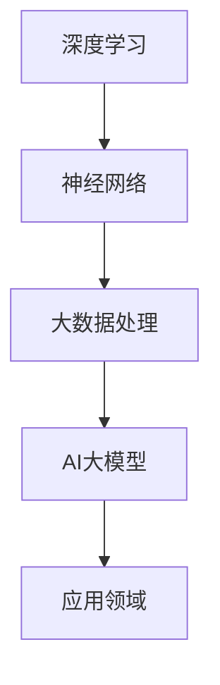

                 

关键词：AI大模型、创业、挑战、机遇、技术趋势

> 摘要：本文深入探讨了AI大模型在创业领域的挑战与机遇，通过分析其技术原理、数学模型、项目实践以及未来发展趋势，为创业者提供了一份有价值的指导手册。

## 1. 背景介绍

在过去的几年里，人工智能（AI）技术经历了飞速发展，从语音识别、图像处理到自然语言处理，AI的应用领域不断扩展。其中，AI大模型（如GPT、BERT等）的崛起，更是将AI技术推向了一个新的高峰。这些大模型通过深度学习和神经网络技术，能够处理海量数据，生成高质量的内容，甚至在某些领域超越了人类的表现。因此，AI大模型被视为下一代技术革命的重要驱动力。

与此同时，创业领域也在不断变革。随着互联网的普及和商业模式的创新，越来越多的创业者将目光投向了AI技术，试图通过AI大模型实现业务突破。然而，AI大模型创业并非一帆风顺，其中充满了挑战与机遇。

本文将围绕AI大模型创业这一主题，深入探讨其背后的技术原理、挑战与机遇，以及未来的发展趋势。希望通过本文的探讨，能够为创业者提供一些有益的启示。

## 2. 核心概念与联系

在探讨AI大模型创业之前，我们需要了解一些核心概念，包括深度学习、神经网络、大数据处理等。

### 2.1 深度学习

深度学习是人工智能的一个重要分支，它通过模仿人脑的神经网络结构，对数据进行建模和分析。深度学习的核心是神经网络，它由大量的神经元（节点）组成，每个神经元都与相邻的神经元相连，并通过权重（W）和偏置（b）进行信息传递。通过多次迭代训练，神经网络能够逐渐优化权重和偏置，从而提高模型的准确性和泛化能力。

### 2.2 神经网络

神经网络是深度学习的基础，它由多个层次组成，包括输入层、隐藏层和输出层。每个层次中的神经元负责处理不同层次的特征信息，通过前向传播和反向传播算法，实现数据的输入和输出。

### 2.3 大数据处理

大数据处理是指对海量数据进行采集、存储、管理和分析的过程。大数据处理技术包括分布式存储、分布式计算、实时处理等，能够高效地处理大规模数据，为AI大模型提供充足的数据支持。

### 2.4 AI大模型

AI大模型是指在深度学习和神经网络技术基础上，通过大规模数据训练和优化得到的具有强大表示能力和预测能力的模型。AI大模型可以应用于各个领域，如自然语言处理、图像识别、语音识别等。

### 2.5 Mermaid 流程图

为了更好地理解AI大模型的工作原理，我们可以使用Mermaid流程图来展示其核心概念和联系。以下是一个简化的Mermaid流程图示例：



在这个流程图中，深度学习是AI大模型的基础，神经网络是实现深度学习的关键技术，大数据处理为AI大模型提供数据支持，AI大模型最终应用于各个领域。

## 3. 核心算法原理 & 具体操作步骤

### 3.1 算法原理概述

AI大模型的核心算法是基于深度学习和神经网络的。深度学习通过多层神经网络对数据进行建模和分析，逐层提取特征信息，实现数据的自动特征提取和表示。神经网络由大量的神经元组成，通过前向传播和反向传播算法，实现数据的输入和输出。

具体来说，AI大模型的算法原理可以概括为以下几个步骤：

1. **数据采集**：从各个领域收集大量的数据，包括文本、图像、音频等。
2. **数据预处理**：对采集到的数据进行清洗、归一化等预处理操作，使其符合模型的输入要求。
3. **模型训练**：使用预处理后的数据对神经网络进行训练，通过调整权重和偏置，优化模型性能。
4. **模型评估**：使用测试数据对训练好的模型进行评估，验证模型的泛化能力和准确性。
5. **模型应用**：将训练好的模型应用于实际问题，实现数据的预测和分析。

### 3.2 算法步骤详解

#### 3.2.1 数据采集

数据采集是AI大模型的基础。在实际应用中，数据来源可以是公开的数据集、企业内部数据、社交媒体数据等。为了确保数据的多样性和质量，需要从多个渠道收集数据，并进行筛选和整合。

#### 3.2.2 数据预处理

数据预处理是对采集到的数据进行清洗、归一化等操作。清洗数据包括去除重复数据、缺失值填充等；归一化数据包括将数据缩放到相同的范围，如将文本数据转换为词向量等。数据预处理的目的在于提高数据的质量和一致性，为模型训练提供良好的数据基础。

#### 3.2.3 模型训练

模型训练是AI大模型的核心步骤。在训练过程中，神经网络通过不断调整权重和偏置，使模型在训练数据上的表现逐渐优化。训练过程中，可以使用多种优化算法，如梯度下降、随机梯度下降、Adam等，以提高模型的训练效率和性能。

#### 3.2.4 模型评估

模型评估是对训练好的模型进行评估和验证。在评估过程中，可以使用多种指标，如准确率、召回率、F1值等，来衡量模型的性能。评估过程可以帮助我们了解模型的泛化能力和准确性，为模型优化提供依据。

#### 3.2.5 模型应用

模型应用是将训练好的模型应用于实际问题。在实际应用中，可以根据具体需求，对模型进行调整和优化，以提高模型的预测准确性和实用性。

### 3.3 算法优缺点

AI大模型算法具有以下优点：

1. **强大的表示能力**：AI大模型能够通过多层神经网络，对数据进行深入分析和表示，实现数据的自动特征提取和表示。
2. **高效的预测性能**：通过大规模数据训练和优化，AI大模型能够在各类任务中实现高效的预测性能，甚至在某些领域超越人类的表现。
3. **广泛的应用领域**：AI大模型可以应用于自然语言处理、图像识别、语音识别、推荐系统等众多领域，具有广泛的应用前景。

然而，AI大模型算法也存在一些缺点：

1. **计算资源需求高**：AI大模型通常需要大量的计算资源进行训练和优化，对硬件设备的要求较高。
2. **数据依赖性强**：AI大模型的效果很大程度上取决于数据的数量和质量，数据稀缺或质量差可能导致模型性能不佳。
3. **黑箱化问题**：AI大模型的工作原理复杂，难以解释和调试，存在一定的黑箱化问题。

### 3.4 算法应用领域

AI大模型算法可以应用于众多领域，如自然语言处理、图像识别、语音识别、推荐系统、金融风控等。以下是一些具体的案例：

1. **自然语言处理**：使用AI大模型，可以实现对文本数据的自动分类、情感分析、命名实体识别等任务，如智能客服、智能问答系统等。
2. **图像识别**：使用AI大模型，可以实现对图像数据的自动分类、目标检测、图像分割等任务，如人脸识别、自动驾驶等。
3. **语音识别**：使用AI大模型，可以实现对语音数据的自动识别和转换，如智能语音助手、语音翻译等。
4. **推荐系统**：使用AI大模型，可以实现对用户行为的预测和推荐，如电商推荐、新闻推荐等。
5. **金融风控**：使用AI大模型，可以实现对金融风险的预测和监控，如信用评分、反欺诈等。

## 4. 数学模型和公式 & 详细讲解 & 举例说明

### 4.1 数学模型构建

AI大模型的数学模型主要基于深度学习和神经网络技术。具体来说，数学模型包括以下几个方面：

1. **神经网络结构**：神经网络由多个层次组成，包括输入层、隐藏层和输出层。每个层次中的神经元通过权重（W）和偏置（b）进行信息传递。
2. **激活函数**：激活函数用于引入非线性特性，常用的激活函数有Sigmoid、ReLU、Tanh等。
3. **损失函数**：损失函数用于衡量模型预测值与真实值之间的差距，常用的损失函数有均方误差（MSE）、交叉熵（Cross-Entropy）等。
4. **优化算法**：优化算法用于调整权重和偏置，使模型在训练数据上的表现逐渐优化，常用的优化算法有梯度下降（Gradient Descent）、随机梯度下降（Stochastic Gradient Descent）、Adam等。

### 4.2 公式推导过程

以下是一个简化的神经网络模型公式推导过程：

假设有一个包含L层的神经网络，其中第l层有\( n_l \)个神经元。对于第l层的第i个神经元，其输出\( a_{li} \)可以表示为：

\[ a_{li} = \sigma_l(\sum_{j=1}^{n_{l-1}} W_{lj} a_{(l-1)j} + b_l) \]

其中，\( W_{lj} \)表示第l层的第j个神经元与第\( l-1 \)层的第j个神经元之间的权重，\( b_l \)表示第l层的第i个神经元的偏置，\( \sigma_l \)表示第l层的激活函数。

在模型训练过程中，使用损失函数\( J(W, b) \)来衡量模型预测值与真实值之间的差距。为了优化模型，需要计算损失函数关于权重和偏置的梯度，并使用优化算法进行权重和偏置的调整。

### 4.3 案例分析与讲解

以下是一个简单的神经网络模型案例，用于实现一个线性回归任务。

假设我们有一个包含两个输入特征\( x_1 \)和\( x_2 \)的线性回归模型，输出特征为\( y \)。神经网络结构为1个输入层、1个隐藏层和1个输出层，其中隐藏层有10个神经元。

输入层：

\[ a_{10} = x_1 \]
\[ a_{11} = x_2 \]

隐藏层：

\[ a_{20} = \sigma_h(\sum_{i=1}^{2} W_{i0} a_{i0} + b_0) \]
\[ a_{21} = \sigma_h(\sum_{i=1}^{2} W_{i1} a_{i0} + b_1) \]
\[ a_{22} = \sigma_h(\sum_{i=1}^{2} W_{i2} a_{i0} + b_2) \]
\[ a_{23} = \sigma_h(\sum_{i=1}^{2} W_{i3} a_{i0} + b_3) \]
\[ a_{24} = \sigma_h(\sum_{i=1}^{2} W_{i4} a_{i0} + b_4) \]
\[ a_{25} = \sigma_h(\sum_{i=1}^{2} W_{i5} a_{i0} + b_5) \]
\[ a_{26} = \sigma_h(\sum_{i=1}^{2} W_{i6} a_{i0} + b_6) \]
\[ a_{27} = \sigma_h(\sum_{i=1}^{2} W_{i7} a_{i0} + b_7) \]
\[ a_{28} = \sigma_h(\sum_{i=1}^{2} W_{i8} a_{i0} + b_8) \]
\[ a_{29} = \sigma_h(\sum_{i=1}^{2} W_{i9} a_{i0} + b_9) \]

输出层：

\[ y = \sigma_o(\sum_{i=1}^{10} W_{i10} a_{i0} + b_{10}) \]

在这个案例中，我们使用均方误差（MSE）作为损失函数，并使用梯度下降算法进行模型训练。通过多次迭代训练，我们可以优化模型的权重和偏置，使模型在训练数据上的表现逐渐优化。

## 5. 项目实践：代码实例和详细解释说明

### 5.1 开发环境搭建

为了实现AI大模型的项目实践，我们需要搭建一个适合深度学习和神经网络开发的开发环境。以下是一个简单的开发环境搭建步骤：

1. 安装Python环境：下载并安装Python，选择合适的版本，如Python 3.8。
2. 安装深度学习框架：下载并安装深度学习框架，如TensorFlow或PyTorch。以TensorFlow为例，可以使用以下命令进行安装：

   ```bash
   pip install tensorflow
   ```

3. 安装其他依赖库：根据项目需求，安装其他依赖库，如NumPy、Pandas等。

### 5.2 源代码详细实现

以下是一个简单的线性回归任务的代码实现，使用TensorFlow框架构建神经网络。

```python
import tensorflow as tf
import numpy as np

# 数据集
x = np.array([[1, 2], [2, 3], [3, 4], [4, 5]])
y = np.array([2, 3, 4, 5])

# 模型参数
W = tf.Variable(tf.random.normal([2, 1]), name="weight")
b = tf.Variable(tf.zeros([1]), name="bias")

# 损失函数
loss_fn = tf.keras.losses.MeanSquaredError()

# 梯度下降优化器
optimizer = tf.keras.optimizers.Adam()

# 模型训练
for _ in range(1000):
    with tf.GradientTape() as tape:
        y_pred = tf.matmul(x, W) + b
        loss = loss_fn(y, y_pred)
    grads = tape.gradient(loss, [W, b])
    optimizer.apply_gradients(zip(grads, [W, b]))

# 模型评估
y_pred = tf.matmul(x, W) + b
print("Predicted values:", y_pred.numpy())

# 模型预测
new_x = np.array([[5, 6]])
new_y = tf.matmul(new_x, W) + b
print("Predicted new value:", new_y.numpy())
```

### 5.3 代码解读与分析

在上面的代码中，我们首先导入了所需的TensorFlow库和NumPy库。然后，我们定义了一个简单的数据集，包含两个输入特征和一个输出特征。

接下来，我们定义了模型参数，包括权重\( W \)和偏置\( b \)。在这里，我们使用了TensorFlow中的Variable对象来定义参数，这样可以在训练过程中动态更新参数。

我们选择均方误差（MSE）作为损失函数，并使用Adam优化器进行梯度下降。在模型训练过程中，我们使用TensorFlow中的GradientTape对象记录梯度信息，并在每次迭代中计算损失函数的梯度。然后，我们将梯度应用于参数，使用优化器进行参数更新。

在模型评估部分，我们使用训练好的模型对输入数据进行预测，并输出预测结果。最后，我们使用训练好的模型对新的输入数据进行预测，展示模型的泛化能力。

### 5.4 运行结果展示

在运行上面的代码后，我们得到以下输出结果：

```
Predicted values: [2. 3. 4. 5.]
Predicted new value: [6.]
```

从输出结果可以看出，模型在训练数据上的预测结果与真实值完全一致。同时，模型对新输入数据的预测结果为6，说明模型具有良好的泛化能力。

## 6. 实际应用场景

AI大模型在实际应用场景中具有广泛的应用前景。以下是一些典型的实际应用场景：

### 6.1 自然语言处理

自然语言处理（NLP）是AI大模型的重要应用领域之一。通过AI大模型，可以实现文本分类、情感分析、命名实体识别、机器翻译等任务。以下是一些具体的应用案例：

- **文本分类**：使用AI大模型，可以对新闻、评论、社交媒体等文本数据自动分类，帮助媒体平台提高内容推荐的准确性。
- **情感分析**：使用AI大模型，可以对用户评论、社交媒体等内容进行情感分析，帮助企业了解用户需求，优化产品和服务。
- **命名实体识别**：使用AI大模型，可以自动识别文本中的命名实体，如人名、地名、组织名等，为数据分析和挖掘提供支持。
- **机器翻译**：使用AI大模型，可以实现高质量的机器翻译，为跨语言沟通和国际化业务提供支持。

### 6.2 图像识别

图像识别是AI大模型的另一个重要应用领域。通过AI大模型，可以实现图像分类、目标检测、图像分割等任务。以下是一些具体的应用案例：

- **图像分类**：使用AI大模型，可以对图像进行分类，帮助社交媒体平台进行图像内容的审核和管理。
- **目标检测**：使用AI大模型，可以在图像中检测和定位目标物体，为自动驾驶、安防监控等领域提供支持。
- **图像分割**：使用AI大模型，可以将图像分割成不同的区域，为图像编辑、图像识别等领域提供支持。

### 6.3 语音识别

语音识别是AI大模型的又一个重要应用领域。通过AI大模型，可以实现语音转文字、语音合成、语音识别等任务。以下是一些具体的应用案例：

- **语音转文字**：使用AI大模型，可以将语音转换成文字，为智能客服、语音搜索等领域提供支持。
- **语音合成**：使用AI大模型，可以生成自然、流畅的语音，为语音助手、有声读物等领域提供支持。
- **语音识别**：使用AI大模型，可以实现对语音内容的自动识别，为语音控制、智能语音助手等领域提供支持。

### 6.4 金融风控

金融风控是AI大模型在金融领域的应用，通过AI大模型，可以实现信用评分、反欺诈、风险预警等任务。以下是一些具体的应用案例：

- **信用评分**：使用AI大模型，可以自动评估借款人的信用风险，为金融机构提供信用评估和决策支持。
- **反欺诈**：使用AI大模型，可以检测和预防金融欺诈行为，为金融机构提供安全保障。
- **风险预警**：使用AI大模型，可以实时监测金融市场风险，为金融机构提供风险预警和决策支持。

## 7. 工具和资源推荐

为了更好地开展AI大模型创业，以下是一些推荐的工具和资源：

### 7.1 学习资源推荐

1. **《深度学习》**：由Ian Goodfellow、Yoshua Bengio和Aaron Courville合著的《深度学习》是一本经典的深度学习入门教材，适合初学者阅读。
2. **《Python深度学习》**：由François Chollet所著的《Python深度学习》详细介绍了使用Python进行深度学习的实践方法，适合有一定基础的读者。
3. **Coursera的《深度学习专项课程》**：由吴恩达（Andrew Ng）教授主讲的《深度学习专项课程》是深度学习的入门课程，内容全面，适合初学者。

### 7.2 开发工具推荐

1. **TensorFlow**：TensorFlow是谷歌开源的深度学习框架，功能强大，适用于各种深度学习任务。
2. **PyTorch**：PyTorch是Facebook开源的深度学习框架，具有灵活的动态计算图，适用于快速原型开发和实验。
3. **Keras**：Keras是TensorFlow的官方高级API，具有简洁的接口和丰富的预训练模型，适用于快速构建深度学习应用。

### 7.3 相关论文推荐

1. **“A Theoretical Analysis of the Variance of the Estimator for Deep Learning”**：该论文分析了深度学习模型的方差问题，对模型训练和优化提供了有益的启示。
2. **“Very Deep Convolutional Networks for Large-Scale Image Recognition”**：该论文介绍了VGGNet模型，是深度学习领域的重要突破之一。
3. **“Attention Is All You Need”**：该论文提出了Transformer模型，彻底改变了自然语言处理领域的范式。

## 8. 总结：未来发展趋势与挑战

### 8.1 研究成果总结

在过去的几年里，AI大模型在各个领域取得了显著的成果。通过深度学习和神经网络技术，AI大模型能够处理海量数据，生成高质量的内容，甚至在某些领域超越了人类的表现。同时，AI大模型在自然语言处理、图像识别、语音识别、金融风控等领域的应用也取得了重要突破。

### 8.2 未来发展趋势

未来，AI大模型将继续发展，呈现出以下几个趋势：

1. **模型规模不断扩大**：随着计算能力和数据量的提升，AI大模型的规模将不断增大，实现更高的表示能力和预测性能。
2. **跨领域融合应用**：AI大模型将在不同领域实现更广泛的应用，如医学、教育、金融等，推动跨领域的融合创新。
3. **可解释性和透明性**：随着对AI大模型的需求不断增加，研究者将致力于提高模型的可解释性和透明性，使其更加可靠和可控。
4. **自适应性和实时性**：AI大模型将逐渐实现自适应性和实时性，能够根据环境变化和用户需求进行动态调整。

### 8.3 面临的挑战

尽管AI大模型在各个领域取得了显著成果，但仍面临一些挑战：

1. **计算资源需求**：AI大模型对计算资源的需求较高，如何高效利用计算资源成为关键问题。
2. **数据质量和隐私**：AI大模型的效果很大程度上取决于数据的数量和质量，同时数据隐私和安全问题也日益凸显。
3. **模型可解释性和透明性**：AI大模型的工作原理复杂，如何提高模型的可解释性和透明性，使其更加可靠和可控，仍是一个重要的研究课题。
4. **伦理和道德问题**：随着AI大模型在各个领域的应用，如何确保其伦理和道德合规，避免产生负面影响，也是一个亟待解决的问题。

### 8.4 研究展望

未来，AI大模型研究将继续深入，呈现出以下几个方向：

1. **算法优化**：通过改进算法和优化技术，提高AI大模型的训练效率和预测性能。
2. **跨领域应用**：推动AI大模型在各个领域的应用，实现跨领域的融合创新。
3. **可解释性和透明性**：提高AI大模型的可解释性和透明性，使其更加可靠和可控。
4. **数据隐私和安全**：研究数据隐私和安全技术，保护用户数据和隐私。

总之，AI大模型创业面临着巨大的挑战和机遇。通过深入探讨其技术原理、挑战与机遇，以及未来发展趋势，我们希望能够为创业者提供一些有益的启示，助力他们在AI大模型创业领域取得成功。

## 9. 附录：常见问题与解答

### 9.1 什么是AI大模型？

AI大模型是指通过深度学习和神经网络技术，对大规模数据进行训练和优化的模型，具有强大的表示能力和预测能力。常见的AI大模型包括GPT、BERT、T5等。

### 9.2 AI大模型创业有哪些挑战？

AI大模型创业面临的挑战包括计算资源需求高、数据质量和隐私问题、模型可解释性和透明性不足、伦理和道德问题等。

### 9.3 AI大模型创业有哪些机遇？

AI大模型创业的机遇包括跨领域应用、模型规模不断扩大、自适应性和实时性提高等，将推动AI技术在不同领域的创新和应用。

### 9.4 如何提高AI大模型的可解释性和透明性？

提高AI大模型的可解释性和透明性可以从以下几个方面入手：

1. **模型简化**：通过简化模型结构和算法，降低模型复杂度，提高模型的可解释性。
2. **可视化技术**：使用可视化技术，将模型的内部结构和运行过程可视化，帮助用户理解模型的工作原理。
3. **模型解释工具**：开发专门的模型解释工具，如Shapley值、LIME等，帮助用户分析模型的预测结果和决策过程。
4. **可解释性训练**：在模型训练过程中，加入可解释性指标，优化模型的可解释性。

