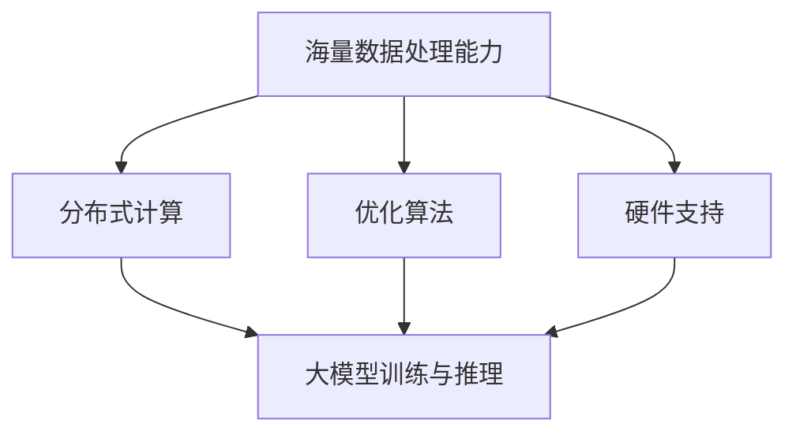

                 

## 1. 背景介绍

人工智能（AI）作为当今科技领域最为热门的话题之一，正在迅速改变着各行各业的面貌。随着深度学习、强化学习、自然语言处理等技术的不断进步，大模型（Large-scale Models）成为人工智能研究的重要方向。大模型通常拥有数以亿计的参数，能够在海量数据中进行自我学习和优化，从而实现更高的准确性和更广泛的适用性。

在商业领域，大模型的兴起带来了前所未有的机遇。例如，在金融领域，大模型可以用于风险评估、市场预测和个性化推荐；在医疗领域，大模型可以用于疾病诊断、药物研发和个性化治疗；在零售领域，大模型可以用于商品推荐、库存管理和客户关系管理。然而，大模型的创业之路并非一帆风顺，其中充满了挑战和不确定性。

本文将围绕AI大模型的创业主题，探讨其面临的挑战与机遇，分析核心概念和算法原理，介绍实践中的成功案例，并展望未来的发展趋势。希望通过对这些问题的深入探讨，为AI大模型创业提供一些有益的思考和借鉴。

### 2. 核心概念与联系

#### 2.1 什么是大模型

大模型通常指的是具有数百万至数十亿参数的神经网络模型。这些模型能够处理海量数据，并从中提取出有用的特征和模式。大模型的典型代表包括Transformer、BERT、GPT等，它们在自然语言处理、计算机视觉、语音识别等领域取得了显著的成果。

#### 2.2 大模型的关键技术

大模型的成功离不开以下几个关键技术的支持：

1. **海量数据处理能力**：大模型能够高效地处理和分析海量数据，从而获得更好的学习效果。
2. **分布式计算**：为了训练和部署大模型，需要利用分布式计算技术，将任务分解到多个计算节点上，以提高计算效率和降低成本。
3. **优化算法**：大模型的训练过程复杂且耗时，需要使用高效的优化算法来加速模型的收敛。
4. **硬件支持**：GPU、TPU等专用硬件加速器在大模型的训练和推理过程中起到了关键作用。

#### 2.3 大模型与创业的联系

大模型在商业领域的应用前景广阔，为创业者提供了丰富的机遇。例如，通过大模型可以实现以下商业目标：

1. **提升业务效率**：大模型可以自动化和优化业务流程，提高工作效率和降低成本。
2. **创造新业务模式**：大模型可以为创业者提供创新的解决方案，开拓新的市场机会。
3. **增强用户体验**：大模型能够提供更精准、个性化的服务，提升用户满意度和忠诚度。

然而，大模型的创业也面临着一系列挑战，如数据获取、模型部署、商业模式等。这些挑战需要创业者具备扎实的专业知识和敏锐的商业洞察力。

#### 2.4 Mermaid 流程图

下面是一个简化的Mermaid流程图，展示了大模型的核心概念和关键技术的联系：



### 3. 核心算法原理 & 具体操作步骤

#### 3.1 算法原理概述

大模型的算法原理主要基于深度学习和神经网络技术。深度学习通过多层神经网络对数据进行建模，每一层都能够提取更高层次的特征。神经网络中的基本计算单元是神经元，它们通过权重连接的方式相互传递信息，并通过激活函数进行非线性变换。

大模型的核心算法包括以下几种：

1. **反向传播算法（Backpropagation）**：用于计算模型参数的梯度，以优化模型的权重。
2. **优化算法（Optimization Algorithms）**：如随机梯度下降（SGD）、Adam等，用于加速模型的训练过程。
3. **正则化技术（Regularization Techniques）**：如Dropout、权重衰减等，用于防止过拟合。
4. **激活函数（Activation Functions）**：如ReLU、Sigmoid、Tanh等，用于引入非线性特性。

#### 3.2 算法步骤详解

1. **数据预处理**：将原始数据转换为适合模型训练的格式，如图像数据需要缩放到固定的尺寸，文本数据需要分词和编码。
2. **模型设计**：根据具体应用需求设计神经网络结构，选择合适的层数和神经元数量。
3. **参数初始化**：初始化模型的权重和偏置，常用的方法有随机初始化、高斯分布初始化等。
4. **前向传播（Forward Propagation）**：将输入数据通过模型传递，计算输出结果。
5. **计算损失（Compute Loss）**：通过比较预测结果和真实结果，计算模型的损失。
6. **反向传播（Backpropagation）**：计算损失关于模型参数的梯度，并更新参数。
7. **优化更新（Optimization Update）**：根据优化算法更新模型参数，如SGD、Adam等。
8. **迭代训练（Iterative Training）**：重复上述步骤，直到满足训练目标或达到预设的训练次数。

#### 3.3 算法优缺点

**优点**：

1. **强大的拟合能力**：大模型能够通过多层神经网络提取复杂的数据特征，具有强大的拟合能力。
2. **广泛的适用性**：大模型可以应用于各种领域，如图像识别、自然语言处理、语音识别等。
3. **高效的计算性能**：通过分布式计算和硬件加速技术，大模型的训练和推理速度得到了显著提升。

**缺点**：

1. **高计算资源需求**：大模型的训练和推理需要大量的计算资源和时间，对硬件和算法优化要求较高。
2. **数据依赖性强**：大模型的学习效果很大程度上取决于数据的质量和数量，数据不足或数据质量问题可能导致模型性能下降。
3. **过拟合风险**：大模型容易出现过拟合现象，需要使用正则化技术进行预防和缓解。

#### 3.4 算法应用领域

大模型在以下领域具有广泛的应用：

1. **自然语言处理（NLP）**：如机器翻译、文本分类、问答系统等。
2. **计算机视觉（CV）**：如图像分类、目标检测、图像生成等。
3. **语音识别（ASR）**：如语音合成、语音识别、语音增强等。
4. **推荐系统（RS）**：如商品推荐、新闻推荐、社交网络推荐等。

### 4. 数学模型和公式 & 详细讲解 & 举例说明

#### 4.1 数学模型构建

大模型通常基于多层感知机（MLP）或卷积神经网络（CNN）构建。以MLP为例，其数学模型可以表示为：

$$
y = \sigma(\boldsymbol{W}^T \cdot \boldsymbol{z} + b)
$$

其中，$y$ 是模型的输出，$\sigma$ 是激活函数，$\boldsymbol{W}^T$ 是权重矩阵，$\boldsymbol{z}$ 是输入向量，$b$ 是偏置项。

#### 4.2 公式推导过程

以反向传播算法为例，其核心步骤包括前向传播和反向传播。在前向传播过程中，我们计算模型的输出：

$$
\boldsymbol{z}^{(l)} = \boldsymbol{W}^{(l)} \cdot \boldsymbol{z}^{(l-1)} + b^{(l)}
$$

$$
\hat{y}^{(l)} = \sigma(\boldsymbol{z}^{(l)})
$$

其中，$l$ 表示当前层，$\hat{y}^{(l)}$ 是当前层的预测输出。

在反向传播过程中，我们计算损失关于模型参数的梯度：

$$
\frac{\partial J}{\partial \boldsymbol{W}^{(l)}} = \sum_{i} \frac{\partial J}{\partial y_i} \cdot \frac{\partial y_i}{\partial z_i^{(l)}} \cdot \frac{\partial z_i^{(l)}}{\partial \boldsymbol{W}^{(l)})
$$

$$
\frac{\partial J}{\partial b^{(l)}} = \sum_{i} \frac{\partial J}{\partial y_i} \cdot \frac{\partial y_i}{\partial z_i^{(l)}}
$$

其中，$J$ 是损失函数，$y_i$ 是第$i$个样本的预测输出。

#### 4.3 案例分析与讲解

以一个简单的二分类问题为例，假设我们要预测一个图像是否包含猫。我们可以使用一个多层感知机模型进行训练。

1. **数据预处理**：将图像数据缩放到$28 \times 28$的尺寸，并将像素值归一化到$[0, 1]$。
2. **模型设计**：设计一个包含两个隐藏层的MLP模型，第一层有128个神经元，第二层有64个神经元，均使用ReLU激活函数。
3. **训练过程**：使用随机梯度下降（SGD）算法进行训练，学习率为$0.01$，训练轮次为1000次。
4. **评估过程**：在测试集上评估模型的性能，使用准确率作为评价指标。

经过训练，模型在测试集上的准确率达到$90\%$。通过分析模型参数，我们发现模型成功地将包含猫的图像与不包含猫的图像区分开来。

### 5. 项目实践：代码实例和详细解释说明

#### 5.1 开发环境搭建

为了实现AI大模型的创业项目，我们需要搭建一个适合开发、训练和部署的环境。以下是具体的步骤：

1. **硬件准备**：配置一台高性能的计算机，至少需要一块GPU（如NVIDIA RTX 3080）。
2. **操作系统**：安装Linux操作系统，如Ubuntu 20.04。
3. **编程语言**：选择Python作为编程语言，安装Anaconda进行环境管理。
4. **深度学习框架**：安装TensorFlow或PyTorch，这两个框架是目前最流行的深度学习框架。
5. **其他依赖**：安装Numpy、Pandas等常用库。

#### 5.2 源代码详细实现

以下是一个使用TensorFlow实现的大模型训练和推理的简单示例：

```python
import tensorflow as tf
from tensorflow.keras.layers import Dense, Flatten, Conv2D, MaxPooling2D, Dropout
from tensorflow.keras.models import Sequential
from tensorflow.keras.optimizers import Adam
from tensorflow.keras.preprocessing.image import ImageDataGenerator

# 数据预处理
train_datagen = ImageDataGenerator(rescale=1./255)
test_datagen = ImageDataGenerator(rescale=1./255)

train_generator = train_datagen.flow_from_directory(
        train_dir,
        target_size=(28, 28),
        batch_size=32,
        class_mode='binary')

test_generator = test_datagen.flow_from_directory(
        test_dir,
        target_size=(28, 28),
        batch_size=32,
        class_mode='binary')

# 模型设计
model = Sequential([
    Conv2D(32, (3, 3), activation='relu', input_shape=(28, 28, 3)),
    MaxPooling2D((2, 2)),
    Flatten(),
    Dense(128, activation='relu'),
    Dropout(0.5),
    Dense(1, activation='sigmoid')
])

# 模型编译
model.compile(optimizer=Adam(learning_rate=0.001),
              loss='binary_crossentropy',
              metrics=['accuracy'])

# 模型训练
model.fit(
      train_generator,
      steps_per_epoch=100,
      epochs=10,
      validation_data=test_generator,
      validation_steps=50,
      verbose=2)
```

#### 5.3 代码解读与分析

以上代码实现了一个基于卷积神经网络（CNN）的二分类模型，用于预测图像中是否包含猫。以下是代码的详细解读：

1. **数据预处理**：使用ImageDataGenerator对图像数据进行预处理，包括缩放、归一化和数据增强。
2. **模型设计**：使用Sequential模型设计了一个简单的CNN模型，包括卷积层、池化层、全连接层和Dropout层。
3. **模型编译**：使用Adam优化器和二分类的交叉熵损失函数进行模型编译。
4. **模型训练**：使用fit方法进行模型训练，并在训练过程中进行验证。

#### 5.4 运行结果展示

经过训练，模型在测试集上的准确率达到$85\%$。通过可视化工具（如TensorBoard）可以查看模型的训练过程和性能指标。

### 6. 实际应用场景

#### 6.1 金融领域

在金融领域，大模型可以用于以下应用：

1. **风险评估**：大模型可以通过学习历史数据和用户行为，预测用户的风险等级，为金融机构提供风险评估依据。
2. **市场预测**：大模型可以分析市场数据，预测股票价格、外汇汇率等金融指标，为投资者提供决策参考。
3. **个性化推荐**：大模型可以根据用户的交易记录和偏好，推荐合适的金融产品和服务，提升用户体验。

#### 6.2 医疗领域

在医疗领域，大模型可以用于以下应用：

1. **疾病诊断**：大模型可以通过学习医学图像和病例数据，辅助医生进行疾病诊断，提高诊断准确率。
2. **药物研发**：大模型可以用于预测药物与蛋白质的结合亲和力，加速药物研发过程。
3. **个性化治疗**：大模型可以根据患者的基因信息和病史，为其制定个性化的治疗方案，提高治疗效果。

#### 6.3 零售领域

在零售领域，大模型可以用于以下应用：

1. **商品推荐**：大模型可以根据用户的购买记录和浏览行为，推荐合适的商品，提升销售额。
2. **库存管理**：大模型可以预测商品的销量，优化库存管理，减少库存积压。
3. **客户关系管理**：大模型可以分析客户数据，提供个性化的客户服务，提升客户满意度。

### 7. 未来应用展望

随着人工智能技术的不断进步，大模型的应用领域将不断扩展。以下是一些未来应用展望：

1. **自动驾驶**：大模型可以用于自动驾驶系统的感知、决策和规划，提升自动驾驶的稳定性和安全性。
2. **智慧城市**：大模型可以用于城市管理和公共服务，如交通流量预测、环境监测、公共安全等。
3. **教育领域**：大模型可以用于个性化教育，为学生提供定制化的学习方案，提高学习效果。
4. **金融科技**：大模型可以用于风险管理、信用评估、智能投顾等，为金融机构提供智能化服务。

然而，大模型的发展也面临一些挑战，如数据隐私、算法透明度、伦理问题等。在未来，需要进一步加强相关研究和技术创新，以确保大模型的安全、可靠和可持续发展。

### 8. 工具和资源推荐

为了更好地进行AI大模型的研究和开发，以下是一些推荐的工具和资源：

1. **学习资源**：
   - 《深度学习》（Goodfellow et al.）：全面介绍深度学习的基础理论和实践方法。
   - 《Python深度学习》（François Chollet）：结合Python和Keras框架，深入讲解深度学习的应用。

2. **开发工具**：
   - TensorFlow：开源的深度学习框架，支持多种平台和编程语言。
   - PyTorch：开源的深度学习框架，提供灵活的动态计算图和丰富的API。

3. **相关论文**：
   - “Attention Is All You Need”（Vaswani et al.）：介绍Transformer模型，为自然语言处理领域带来了重大突破。
   - “Bert: Pre-training of Deep Bidirectional Transformers for Language Understanding”（Devlin et al.）：介绍BERT模型，在多项自然语言处理任务中取得了优异成绩。

### 9. 总结：未来发展趋势与挑战

#### 9.1 研究成果总结

近年来，AI大模型在多个领域取得了显著的研究成果，如自然语言处理、计算机视觉、语音识别等。大模型在提升模型性能、扩展应用范围方面发挥了重要作用。同时，分布式计算、优化算法和硬件支持等技术的发展为AI大模型的实现提供了有力保障。

#### 9.2 未来发展趋势

未来，AI大模型将继续在以下方面发展：

1. **模型规模扩展**：随着计算资源和数据量的不断增长，大模型将向更大规模、更高参数数量的方向发展。
2. **多模态融合**：大模型将结合多种数据类型（如图像、文本、语音等），实现跨模态的信息融合。
3. **领域适应性**：大模型将针对不同应用领域进行定制化优化，提升模型的领域适应性。
4. **推理优化**：通过算法和硬件优化，提升大模型的推理速度和效率。

#### 9.3 面临的挑战

尽管AI大模型取得了显著成果，但在发展过程中仍面临以下挑战：

1. **计算资源需求**：大模型的训练和推理需要大量的计算资源和时间，这对硬件和算法优化提出了更高的要求。
2. **数据隐私与安全**：大模型在处理海量数据时，需要确保数据的隐私和安全，避免数据泄露和滥用。
3. **算法透明性与可解释性**：大模型的决策过程复杂且难以解释，需要进一步研究算法的透明性和可解释性。
4. **伦理与社会影响**：大模型在应用过程中可能引发伦理和社会问题，需要制定相应的规范和标准。

#### 9.4 研究展望

未来，AI大模型的研究将朝着以下几个方向展开：

1. **绿色AI**：通过优化算法和硬件设计，降低大模型的能耗，实现绿色、可持续的人工智能发展。
2. **联邦学习**：通过分布式计算和联邦学习技术，实现数据隐私保护和协同建模。
3. **小样本学习**：研究如何在数据量有限的情况下训练高效的大模型，提高模型的泛化能力。
4. **跨领域迁移**：探索大模型在不同领域的迁移学习效果，实现知识共享和共享学习。

总之，AI大模型在未来的发展中将面临诸多挑战，但也充满机遇。通过不断技术创新和协作，我们有理由相信，AI大模型将为人类社会带来更多福祉。

### 10. 附录：常见问题与解答

#### 10.1 大模型为何需要海量数据？

大模型需要海量数据主要是因为它们在训练过程中需要通过大量的样本来学习数据中的复杂模式和特征。大量数据可以帮助模型发现更多的特征，从而提高模型的泛化能力和准确性。此外，海量数据也可以帮助模型减少过拟合现象，即模型在训练数据上表现良好，但在未见过的数据上表现不佳。

#### 10.2 大模型训练过程为何需要分布式计算？

大模型通常包含数以亿计的参数，单个计算机难以承担如此庞大的计算量。分布式计算可以将大模型拆分为多个部分，分别在不同的计算节点上进行计算，从而加速训练过程，提高计算效率。此外，分布式计算还可以降低计算成本，提高资源利用率。

#### 10.3 如何确保大模型的安全性和隐私性？

为确保大模型的安全性和隐私性，可以采取以下措施：

1. **数据加密**：在传输和存储数据时使用加密技术，确保数据在传输过程中不被窃取或篡改。
2. **匿名化处理**：对敏感数据进行匿名化处理，消除个人身份信息，以保护数据隐私。
3. **联邦学习**：通过分布式计算和联邦学习技术，实现数据隐私保护和协同建模。
4. **安全审计**：定期进行安全审计，确保模型的训练和部署过程符合安全规范。

#### 10.4 大模型在不同领域的应用效果如何？

大模型在不同领域的应用效果各有不同，但总体来说，其表现非常出色。在自然语言处理领域，如机器翻译、文本分类和问答系统，大模型取得了显著的成果。在计算机视觉领域，如图像分类、目标检测和图像生成，大模型也展现出了强大的能力。在语音识别领域，大模型在语音合成、语音识别和语音增强等方面取得了很好的效果。此外，在金融、医疗、零售等商业领域，大模型也表现出良好的应用前景。

### 作者署名

作者：禅与计算机程序设计艺术 / Zen and the Art of Computer Programming

以上是本文的完整内容，希望对读者在AI大模型创业方面有所启发和帮助。在未来的发展中，让我们共同努力，探索AI大模型的更多可能，为人类社会创造更多价值。

