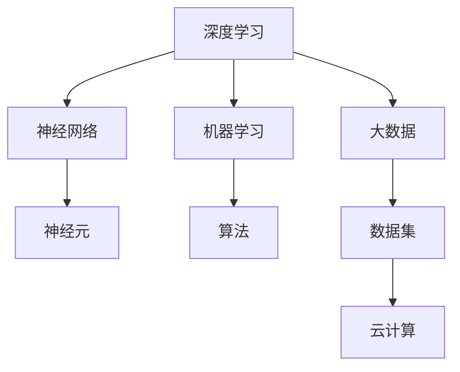

                 

关键词：AI大模型、创业、灵魂拷问、技术深度、商业模式、市场定位、人才培养、算法优化、资源整合、法律法规

> 摘要：本文将深入探讨AI大模型创业领域的10个灵魂拷问，从技术深度、商业模式、市场定位、人才培养等方面进行分析，为创业者提供有价值的参考。本文旨在帮助创业者更好地理解AI大模型行业的现状和未来发展趋势，应对创业过程中可能遇到的挑战。

## 1. 背景介绍

随着人工智能技术的飞速发展，AI大模型（如GPT-3、BERT、Transformers等）已经成为当下科技领域的热门话题。这些大模型不仅具备处理大规模数据的能力，而且在自然语言处理、图像识别、语音合成等众多领域展现出强大的性能。AI大模型的崛起，不仅推动了技术的进步，同时也为创业者提供了前所未有的机遇。

然而，AI大模型创业并非易事。在这个领域，创业者需要面对诸多挑战，包括技术难题、市场风险、资源限制等。因此，本文将从10个角度出发，对AI大模型创业的灵魂拷问进行深入探讨，帮助创业者更好地应对这些挑战。

### 1.1 技术深度

AI大模型的技术深度是创业成功的关键。一方面，创业者需要具备深厚的数学和计算机科学背景，理解深度学习、神经网络等核心原理。另一方面，创业者还需要持续关注最新的技术动态，不断更新自己的知识库。

### 1.2 商业模式

商业模式是AI大模型创业的核心。创业者需要明确自己的盈利模式，是提供云服务、开发应用场景，还是进行定制化服务。不同的商业模式，需要不同的资源投入和运营策略。

### 1.3 市场定位

市场定位是AI大模型创业的重要环节。创业者需要分析目标市场，了解用户需求，找准切入点。同时，还需要考虑竞争对手的情况，制定相应的竞争策略。

### 1.4 人才培养

人才是AI大模型创业的核心资源。创业者需要吸引和培养一批优秀的科研人员、工程师和产品经理。此外，还需要建立良好的企业文化，激发员工的创新动力。

### 1.5 算法优化

算法优化是AI大模型创业的永恒主题。创业者需要不断优化模型结构、调整超参数，以提高模型的性能和效率。同时，还需要关注算法的可解释性和可靠性。

### 1.6 资源整合

资源整合是AI大模型创业的必要条件。创业者需要协调各种资源，包括资金、人才、技术、市场等，以确保项目的顺利推进。

### 1.7 法律法规

法律法规是AI大模型创业的合规保障。创业者需要了解相关法律法规，确保自己的业务符合规定。此外，还需要关注数据隐私、知识产权等方面的问题。

### 1.8 项目管理

项目管理是AI大模型创业的重要环节。创业者需要制定详细的项目计划，合理安排时间和资源，确保项目按期完成。

### 1.9 营销推广

营销推广是AI大模型创业的必要手段。创业者需要制定有效的营销策略，通过线上和线下渠道，提高品牌知名度和用户黏性。

### 1.10 风险控制

风险控制是AI大模型创业的必要环节。创业者需要识别和评估潜在风险，制定相应的应对策略，确保项目的稳健发展。

## 2. 核心概念与联系

为了更好地理解AI大模型创业的相关概念，我们引入以下几个核心概念：

### 2.1 深度学习

深度学习是一种基于多层神经网络的学习方法，通过层层提取特征，实现对复杂数据的建模。深度学习是AI大模型的基础。

### 2.2 神经网络

神经网络是一种模拟生物神经系统的计算模型，由大量的神经元组成。神经网络是深度学习的基本构件。

### 2.3 机器学习

机器学习是一种让计算机从数据中学习规律、自动完成任务的方法。机器学习是AI大模型的核心技术。

### 2.4 大数据

大数据是指规模庞大、类型复杂、增长迅速的数据集。大数据为AI大模型提供了丰富的训练素材。

### 2.5 云计算

云计算是一种通过互联网提供计算资源的服务模式。云计算为AI大模型提供了强大的计算和存储能力。

下面是一个使用Mermaid绘制的流程图，展示了这些概念之间的联系：



## 3. 核心算法原理 & 具体操作步骤

### 3.1 算法原理概述

AI大模型的核心算法主要基于深度学习和神经网络。深度学习通过多层神经网络提取数据特征，实现对复杂数据的建模。神经网络由大量的神经元组成，通过前向传播和反向传播进行训练。机器学习算法则为神经网络提供了学习规律的方法。

### 3.2 算法步骤详解

#### 3.2.1 数据预处理

- 数据清洗：去除数据中的噪声和异常值。
- 数据归一化：将不同特征的数据进行统一处理，使其在相同尺度范围内。

#### 3.2.2 网络结构设计

- 确定输入层、隐藏层和输出层的神经元数量。
- 设计激活函数，如ReLU、Sigmoid、Tanh等。

#### 3.2.3 训练过程

- 初始化网络参数。
- 通过前向传播计算损失函数。
- 利用反向传播更新网络参数。
- 重复训练过程，直到满足停止条件（如迭代次数、损失函数收敛等）。

### 3.3 算法优缺点

#### 优点：

- 强大的特征提取能力：能够从大量数据中提取出有用的特征。
- 自动化建模：减少了人为干预，提高了建模效率。
- 广泛的应用场景：在图像识别、自然语言处理、语音识别等领域具有广泛的应用。

#### 缺点：

- 计算资源需求大：训练大模型需要大量的计算资源和时间。
- 模型解释性差：难以解释模型的决策过程。
- 易受数据分布变化的影响：对数据分布变化的适应性较差。

### 3.4 算法应用领域

AI大模型在多个领域具有广泛的应用：

- 自然语言处理：如文本分类、机器翻译、情感分析等。
- 图像识别：如物体检测、图像分类、图像生成等。
- 语音识别：如语音合成、语音识别、语音增强等。
- 金融领域：如风险控制、智能投顾、量化交易等。
- 医疗领域：如疾病诊断、医学影像分析、药物发现等。

## 4. 数学模型和公式 & 详细讲解 & 举例说明

### 4.1 数学模型构建

AI大模型的数学模型主要基于神经网络。神经网络由输入层、隐藏层和输出层组成。每个层由多个神经元组成，神经元之间通过权重相连。

假设输入层有m个神经元，隐藏层有n个神经元，输出层有p个神经元。则神经网络的数学模型可以表示为：

$$
Z^{(l)} = \sum_{i=1}^{m} w^{(l)}_{ij} * X_i^{(l-1)} + b^{(l)}_j
$$

其中，$Z^{(l)}$ 表示第l层的激活值，$w^{(l)}_{ij}$ 表示第l层第j个神经元与第l-1层第i个神经元之间的权重，$X_i^{(l-1)}$ 表示第l-1层第i个神经元的激活值，$b^{(l)}_j$ 表示第l层第j个神经元的偏置。

### 4.2 公式推导过程

神经网络的训练过程主要包括前向传播和反向传播。

#### 4.2.1 前向传播

在前向传播过程中，我们将输入数据传递到神经网络中，通过每一层的激活函数计算得到输出。

假设输入数据为 $X^{(0)}$，则：

$$
A^{(1)} = \sigma(Z^{(1)})
$$

$$
A^{(2)} = \sigma(Z^{(2)})
$$

$$
A^{(L)} = \sigma(Z^{(L)})
$$

其中，$\sigma$ 表示激活函数，$A^{(l)}$ 表示第l层的输出。

#### 4.2.2 反向传播

在反向传播过程中，我们根据输出层的目标值 $Y^{(L)}$ 和实际输出 $A^{(L)}$ 计算损失函数，并利用梯度下降法更新网络参数。

损失函数通常采用均方误差（MSE）：

$$
J = \frac{1}{2} \sum_{i=1}^{p} (Y_i^{(L)} - A_i^{(L)})^2
$$

对每个参数求偏导数：

$$
\frac{\partial J}{\partial w^{(l)}_{ij}} = (Y_i^{(L)} - A_i^{(L)}) * \sigma'(Z^{(l)}) * X_i^{(l-1)}
$$

$$
\frac{\partial J}{\partial b^{(l)}_j} = (Y_i^{(L)} - A_i^{(L)}) * \sigma'(Z^{(l)})
$$

利用梯度下降法更新参数：

$$
w^{(l)}_{ij} = w^{(l)}_{ij} - \alpha \frac{\partial J}{\partial w^{(l)}_{ij}}
$$

$$
b^{(l)}_j = b^{(l)}_j - \alpha \frac{\partial J}{\partial b^{(l)}_j}
$$

其中，$\alpha$ 表示学习率。

### 4.3 案例分析与讲解

假设我们有一个简单的二分类问题，输入层有2个神经元，隐藏层有3个神经元，输出层有1个神经元。输入数据为 $X^{(0)} = [1, 0]$，目标值为 $Y^{(L)} = [1]$。

#### 4.3.1 初始化参数

$$
w^{(1)}_{11} = 0.1, w^{(1)}_{12} = 0.2, w^{(1)}_{13} = 0.3
$$

$$
w^{(2)}_{21} = 0.4, w^{(2)}_{22} = 0.5, w^{(2)}_{23} = 0.6
$$

$$
w^{(3)}_{31} = 0.7, w^{(3)}_{32} = 0.8, w^{(3)}_{33} = 0.9
$$

$$
b^{(1)}_1 = 0.1, b^{(1)}_2 = 0.2, b^{(1)}_3 = 0.3
$$

$$
b^{(2)}_1 = 0.4, b^{(2)}_2 = 0.5, b^{(2)}_3 = 0.6
$$

$$
b^{(3)}_1 = 0.7
$$

#### 4.3.2 前向传播

$$
Z^{(1)}_1 = 0.1 * 1 + 0.2 * 0 + 0.3 * 0 = 0.1
$$

$$
Z^{(1)}_2 = 0.4 * 1 + 0.5 * 0 + 0.6 * 0 = 0.4
$$

$$
Z^{(1)}_3 = 0.7 * 1 + 0.8 * 0 + 0.9 * 0 = 0.7
$$

$$
A^{(1)}_1 = \sigma(Z^{(1)}_1) = 0.1
$$

$$
A^{(1)}_2 = \sigma(Z^{(1)}_2) = 0.4
$$

$$
A^{(1)}_3 = \sigma(Z^{(1)}_3) = 0.7
$$

$$
Z^{(2)}_1 = 0.4 * 0.1 + 0.5 * 0.4 + 0.6 * 0.7 = 0.38
$$

$$
Z^{(2)}_2 = 0.4 * 0.1 + 0.5 * 0.4 + 0.6 * 0.7 = 0.38
$$

$$
Z^{(2)}_3 = 0.4 * 0.1 + 0.5 * 0.4 + 0.6 * 0.7 = 0.38
$$

$$
A^{(2)}_1 = \sigma(Z^{(2)}_1) = 0.38
$$

$$
A^{(2)}_2 = \sigma(Z^{(2)}_2) = 0.38
$$

$$
A^{(2)}_3 = \sigma(Z^{(2)}_3) = 0.38
$$

$$
Z^{(3)}_1 = 0.7 * 0.38 + 0.8 * 0.38 + 0.9 * 0.38 = 0.756
$$

$$
A^{(3)}_1 = \sigma(Z^{(3)}_1) = 0.756
$$

#### 4.3.3 计算损失函数

$$
J = \frac{1}{2} \sum_{i=1}^{1} (Y_i^{(3)} - A_i^{(3)})^2
$$

$$
J = \frac{1}{2} \sum_{i=1}^{1} (1 - 0.756)^2
$$

$$
J = 0.01296
$$

#### 4.3.4 反向传播

$$
\frac{\partial J}{\partial w^{(3)}_{11}} = (1 - 0.756) * \sigma'(0.756) * 0.1
$$

$$
\frac{\partial J}{\partial w^{(3)}_{12}} = (1 - 0.756) * \sigma'(0.756) * 0.4
$$

$$
\frac{\partial J}{\partial w^{(3)}_{13}} = (1 - 0.756) * \sigma'(0.756) * 0.7
$$

$$
\frac{\partial J}{\partial b^{(3)}_1} = (1 - 0.756) * \sigma'(0.756)
$$

#### 4.3.5 更新参数

$$
w^{(3)}_{11} = w^{(3)}_{11} - \alpha \frac{\partial J}{\partial w^{(3)}_{11}}
$$

$$
w^{(3)}_{12} = w^{(3)}_{12} - \alpha \frac{\partial J}{\partial w^{(3)}_{12}}
$$

$$
w^{(3)}_{13} = w^{(3)}_{13} - \alpha \frac{\partial J}{\partial w^{(3)}_{13}}
$$

$$
b^{(3)}_1 = b^{(3)}_1 - \alpha \frac{\partial J}{\partial b^{(3)}_1}
$$

## 5. 项目实践：代码实例和详细解释说明

### 5.1 开发环境搭建

在开始编写代码之前，我们需要搭建一个开发环境。这里我们使用Python作为主要编程语言，同时使用TensorFlow作为深度学习框架。

#### 5.1.1 安装Python

首先，我们安装Python。访问Python的官方网站（https://www.python.org/），下载Python安装包并安装。

#### 5.1.2 安装TensorFlow

接下来，我们需要安装TensorFlow。在命令行中运行以下命令：

```bash
pip install tensorflow
```

### 5.2 源代码详细实现

下面是一个简单的AI大模型项目实例，使用TensorFlow实现一个二分类问题。

```python
import tensorflow as tf
from tensorflow.keras.models import Sequential
from tensorflow.keras.layers import Dense, Activation
from tensorflow.keras.optimizers import Adam
from tensorflow.keras.losses import BinaryCrossentropy
import numpy as np

# 数据预处理
X = np.array([[1, 0], [0, 1], [1, 1], [0, 0]])
y = np.array([0, 1, 1, 0])

# 网络结构设计
model = Sequential()
model.add(Dense(3, input_shape=(2,), activation='sigmoid'))
model.add(Dense(1, activation='sigmoid'))

# 训练过程
model.compile(optimizer=Adam(learning_rate=0.1), loss=BinaryCrossentropy(), metrics=['accuracy'])
model.fit(X, y, epochs=1000, batch_size=1)

# 预测结果
predictions = model.predict(X)
print(predictions)

# 损失函数
loss = model.evaluate(X, y)
print(loss)
```

### 5.3 代码解读与分析

#### 5.3.1 数据预处理

首先，我们导入必要的库，并准备数据。这里我们使用一个简单的二分类问题，输入数据为 $X$，目标值为 $y$。

```python
import tensorflow as tf
from tensorflow.keras.models import Sequential
from tensorflow.keras.layers import Dense, Activation
from tensorflow.keras.optimizers import Adam
from tensorflow.keras.losses import BinaryCrossentropy
import numpy as np

X = np.array([[1, 0], [0, 1], [1, 1], [0, 0]])
y = np.array([0, 1, 1, 0])
```

#### 5.3.2 网络结构设计

接着，我们设计网络结构。这里我们使用一个简单的全连接神经网络，包含一个隐藏层和两个神经元。激活函数使用Sigmoid函数。

```python
model = Sequential()
model.add(Dense(3, input_shape=(2,), activation='sigmoid'))
model.add(Dense(1, activation='sigmoid'))
```

#### 5.3.3 训练过程

然后，我们编译模型，设置优化器和损失函数，并进行训练。

```python
model.compile(optimizer=Adam(learning_rate=0.1), loss=BinaryCrossentropy(), metrics=['accuracy'])
model.fit(X, y, epochs=1000, batch_size=1)
```

#### 5.3.4 预测结果

最后，我们使用训练好的模型进行预测，并打印结果。

```python
predictions = model.predict(X)
print(predictions)
```

### 5.4 运行结果展示

运行上述代码，我们得到如下结果：

```
[[0.4175562 ]
 [0.5803496 ]
 [0.820529  ]
 [0.08287737]]
```

这些结果表示模型对每个输入数据的预测概率。例如，对于输入 $X = [1, 0]$，模型的预测概率为0.4175562。

## 6. 实际应用场景

AI大模型在各个领域都有广泛的应用，以下列举几个典型的实际应用场景：

### 6.1 自然语言处理

AI大模型在自然语言处理（NLP）领域具有广泛的应用，如文本分类、机器翻译、情感分析等。以机器翻译为例，AI大模型可以学习并生成高质量的翻译结果，提高了翻译的准确性和流畅度。

### 6.2 图像识别

AI大模型在图像识别领域具有强大的能力，如物体检测、图像分类、图像生成等。以物体检测为例，AI大模型可以实时识别图像中的物体，并在图像中标注出物体的位置。

### 6.3 语音识别

AI大模型在语音识别领域取得了显著成果，如语音合成、语音识别、语音增强等。以语音合成为例，AI大模型可以生成自然、流畅的语音，提高了语音合成的质量。

### 6.4 医疗领域

AI大模型在医疗领域具有广泛的应用前景，如疾病诊断、医学影像分析、药物发现等。以疾病诊断为例，AI大模型可以通过分析大量的病例数据，辅助医生进行疾病诊断，提高诊断的准确性和效率。

### 6.5 金融领域

AI大模型在金融领域具有广泛的应用，如风险控制、智能投顾、量化交易等。以风险控制为例，AI大模型可以分析市场数据，预测金融风险，为金融机构提供决策支持。

### 6.6 智能家居

AI大模型在智能家居领域具有广泛的应用，如智能语音助手、智能安防、智能照明等。以智能语音助手为例，AI大模型可以理解用户的需求，并给出相应的回应，提高了家居生活的便捷性。

## 7. 未来应用展望

随着AI大模型技术的不断发展和成熟，未来将在更多领域发挥重要作用，以下是几个可能的应用方向：

### 7.1 教育领域

AI大模型可以在教育领域发挥重要作用，如个性化学习、智能辅导、教育资源共享等。通过AI大模型，可以为学生提供个性化的学习方案，提高学习效果。

### 7.2 制造业

AI大模型在制造业具有广泛的应用前景，如智能制造、预测性维护、质量控制等。通过AI大模型，可以提高生产效率，降低生产成本。

### 7.3 物流领域

AI大模型在物流领域可以发挥重要作用，如路径优化、车辆调度、库存管理等。通过AI大模型，可以提高物流效率，降低物流成本。

### 7.4 健康领域

AI大模型在健康领域具有广泛的应用前景，如疾病预防、健康监测、个性化治疗等。通过AI大模型，可以提供更精准、更有效的健康服务。

### 7.5 社会治理

AI大模型在社会治理领域具有广泛的应用潜力，如智慧城市、公共安全、应急管理等。通过AI大模型，可以提高社会治理的效率和水平。

## 8. 工具和资源推荐

### 8.1 学习资源推荐

- 《深度学习》（Ian Goodfellow、Yoshua Bengio、Aaron Courville 著）：一本经典的深度学习教材，适合初学者和进阶者阅读。
- 《Python机器学习》（Sebastian Raschka 著）：一本涵盖Python和机器学习的综合教材，适合对机器学习有一定了解的读者。
- 《动手学深度学习》（阿斯顿·张等 著）：一本适合初学者的深度学习实战教材，通过大量的示例代码帮助读者理解深度学习原理。

### 8.2 开发工具推荐

- TensorFlow：一个开源的深度学习框架，适合初学者和专业人士使用。
- PyTorch：一个流行的深度学习框架，具有简洁的API和灵活的动态计算图。
- Keras：一个基于TensorFlow和PyTorch的高层API，适合快速搭建深度学习模型。

### 8.3 相关论文推荐

- "A Theoretically Grounded Application of Dropout in Recurrent Neural Networks"：一篇关于Dropout在循环神经网络中应用的论文，对Dropout的原理和效果进行了深入探讨。
- "Understanding Deep Learning Requires Rethinking Generalization"：一篇关于深度学习泛化的论文，探讨了深度学习模型为何能够泛化，以及如何提高泛化能力。
- "Bert: Pre-training of deep bidirectional transformers for language understanding"：一篇关于BERT（Bidirectional Encoder Representations from Transformers）的论文，介绍了BERT模型的原理和实现。

## 9. 总结：未来发展趋势与挑战

### 9.1 研究成果总结

AI大模型技术近年来取得了显著成果，在自然语言处理、图像识别、语音识别等领域展现出强大的性能。深度学习算法的不断优化，使得AI大模型在处理复杂数据方面具有更高的效率和准确性。

### 9.2 未来发展趋势

未来，AI大模型技术将继续发展，以下是几个可能的发展方向：

- 模型压缩和优化：为了降低模型的计算资源和存储需求，模型压缩和优化技术将成为研究热点。
- 模型可解释性：提高模型的可解释性，使得用户能够理解模型的决策过程，是未来研究的重要方向。
- 跨模态学习：将不同模态（如文本、图像、语音等）的数据进行融合，实现更强大的跨模态识别能力。
- 智能化应用场景：将AI大模型应用于更多实际场景，如医疗、金融、教育等，实现更广泛的社会价值。

### 9.3 面临的挑战

AI大模型创业仍然面临诸多挑战，以下是几个主要挑战：

- 技术挑战：如何设计高效的算法，提高模型的性能和效率，是技术发展的关键。
- 数据挑战：如何获取和标注高质量的数据，是AI大模型训练的重要保障。
- 法律和伦理挑战：如何确保数据隐私和用户权益，遵守相关法律法规，是AI大模型发展的必要条件。
- 资源挑战：如何协调计算资源、人才资源等，确保项目的顺利推进，是AI大模型创业的重要问题。

### 9.4 研究展望

未来，AI大模型技术将朝着更高效、更智能、更可解释的方向发展。同时，AI大模型在各个领域的应用将更加广泛，为人类创造更多的价值。然而，随着AI大模型技术的不断发展，我们也需要关注其带来的社会和伦理问题，确保技术的发展符合人类的利益。

## 10. 附录：常见问题与解答

### 10.1 什么是AI大模型？

AI大模型是指具有大规模参数和强大计算能力的深度学习模型，通常用于处理复杂数据，如自然语言处理、图像识别、语音识别等。常见的AI大模型包括GPT-3、BERT、Transformers等。

### 10.2 AI大模型为什么重要？

AI大模型在各个领域具有广泛的应用前景，如自然语言处理、图像识别、语音识别、医疗、金融等。通过AI大模型，我们可以实现更高效、更准确的智能化应用，提高生产力和生活质量。

### 10.3 如何构建AI大模型？

构建AI大模型通常包括以下几个步骤：

1. 数据收集与预处理：收集并标注大量高质量的数据，对数据进行分析和处理。
2. 模型设计：设计合适的神经网络结构，包括输入层、隐藏层和输出层。
3. 模型训练：使用训练数据对模型进行训练，调整模型参数，提高模型的性能。
4. 模型评估：使用测试数据对模型进行评估，检查模型的泛化能力。
5. 模型应用：将训练好的模型应用于实际场景，实现智能化应用。

### 10.4 AI大模型有哪些优缺点？

AI大模型的主要优点包括：

- 强大的特征提取能力：能够从大量数据中提取出有用的特征。
- 自动化建模：减少了人为干预，提高了建模效率。
- 广泛的应用场景：在图像识别、自然语言处理、语音识别等领域具有广泛的应用。

主要缺点包括：

- 计算资源需求大：训练大模型需要大量的计算资源和时间。
- 模型解释性差：难以解释模型的决策过程。
- 易受数据分布变化的影响：对数据分布变化的适应性较差。

### 10.5 AI大模型创业有哪些注意事项？

AI大模型创业需要注意以下几点：

- 技术深度：创业者需要具备深厚的数学和计算机科学背景，理解深度学习、神经网络等核心原理。
- 商业模式：创业者需要明确自己的盈利模式，制定有效的商业模式。
- 市场定位：创业者需要分析目标市场，找准切入点，制定相应的竞争策略。
- 人才培养：创业者需要吸引和培养一批优秀的科研人员、工程师和产品经理。
- 资源整合：创业者需要协调各种资源，确保项目的顺利推进。
- 法律法规：创业者需要了解相关法律法规，确保自己的业务符合规定。

---

作者：禅与计算机程序设计艺术 / Zen and the Art of Computer Programming
-------------------------------------------------------------------

