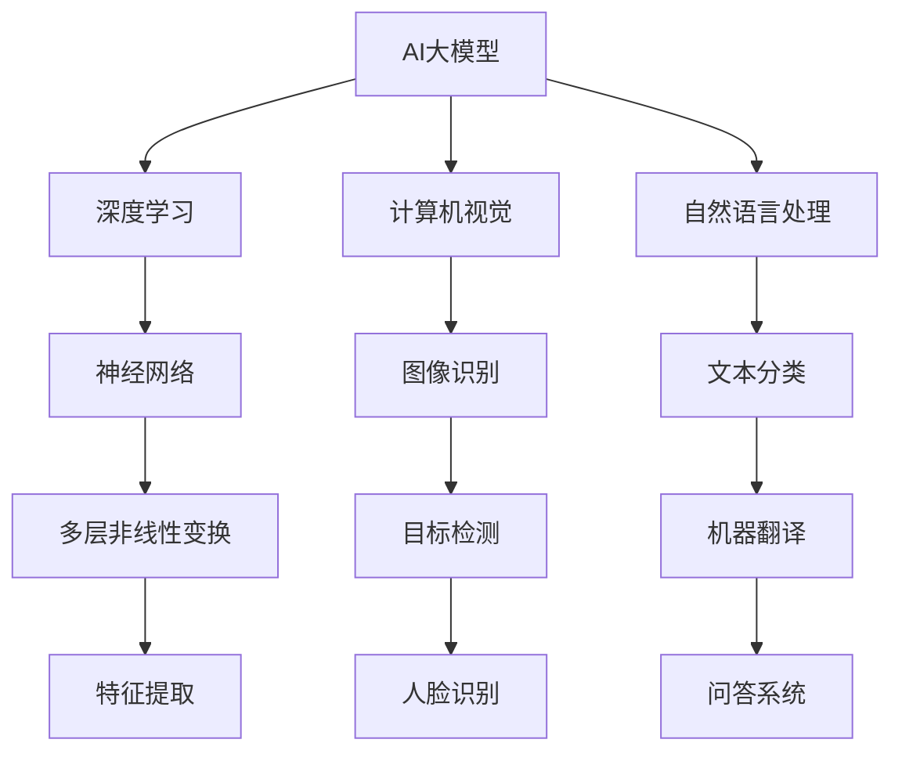

                 

 **关键词：** AI大模型、创业、技术挑战、算法、应用场景、未来展望

**摘要：** 本文将探讨AI大模型创业过程中面临的技术挑战，包括核心算法原理、数学模型、项目实践以及未来发展趋势等，帮助创业者在AI领域找到突破口。

## 1. 背景介绍

近年来，人工智能（AI）技术取得了飞速发展，尤其是AI大模型的出现，如GPT-3、BERT等，极大地推动了自然语言处理、计算机视觉等领域的进步。随着AI技术的普及，越来越多的创业公司开始涉足这一领域，希望从中分得一杯羹。然而，AI大模型的创业并非易事，技术挑战重重，需要创业者具备深厚的专业知识和敏锐的洞察力。

本文旨在为AI大模型创业者提供一份实用的指南，帮助他们在创业过程中应对技术挑战，找到突破口，实现商业成功。

## 2. 核心概念与联系

### 2.1 AI大模型

AI大模型是指采用深度学习技术训练的具有大规模参数的网络模型。这些模型具有强大的表示能力和拟合能力，能够处理海量数据并提取出有用的信息。常见的AI大模型包括GPT、BERT、ViT等。

### 2.2 深度学习

深度学习是一种基于人工神经网络的学习方法，通过多层非线性变换来提取数据特征。深度学习技术在图像识别、语音识别、自然语言处理等领域取得了显著的成果。

### 2.3 计算机视觉

计算机视觉是指让计算机理解和解释图像或视频的能力。计算机视觉技术包括目标检测、图像分割、人脸识别等。

### 2.4 自然语言处理

自然语言处理是指让计算机理解和生成自然语言的能力。自然语言处理技术包括文本分类、机器翻译、问答系统等。

### 2.5 Mermaid 流程图



## 3. 核心算法原理 & 具体操作步骤

### 3.1 算法原理概述

AI大模型的核心算法主要涉及深度学习和迁移学习。深度学习通过多层神经网络提取数据特征，而迁移学习则利用预训练的模型在新任务上进行微调。

### 3.2 算法步骤详解

1. 数据收集：收集大量相关数据，如图像、文本等。
2. 数据预处理：对数据进行清洗、归一化等处理。
3. 模型训练：使用深度学习算法训练模型，如卷积神经网络（CNN）或循环神经网络（RNN）。
4. 模型评估：使用测试集评估模型性能。
5. 模型优化：根据评估结果调整模型参数，提高性能。
6. 模型部署：将训练好的模型部署到实际应用场景中。

### 3.3 算法优缺点

**优点：**

- 强大的表示能力：深度学习能够提取出丰富的数据特征，提高模型性能。
- 广泛的应用领域：深度学习技术在计算机视觉、自然语言处理等领域都有广泛应用。

**缺点：**

- 需要大量数据：深度学习模型需要大量数据来训练，数据收集和标注成本较高。
- 计算资源消耗：深度学习模型训练过程需要大量的计算资源，训练时间较长。

### 3.4 算法应用领域

AI大模型在多个领域有广泛应用，如：

- 自然语言处理：文本分类、机器翻译、问答系统等。
- 计算机视觉：目标检测、图像分割、人脸识别等。
- 医疗诊断：疾病检测、医学影像分析等。

## 4. 数学模型和公式 & 详细讲解 & 举例说明

### 4.1 数学模型构建

AI大模型的数学模型主要涉及深度学习和迁移学习。深度学习模型通常采用多层感知机（MLP）、卷积神经网络（CNN）、循环神经网络（RNN）等结构。迁移学习模型则基于预训练的模型，如BERT、GPT等。

### 4.2 公式推导过程

以卷积神经网络（CNN）为例，CNN的公式推导如下：

$$
\begin{aligned}
  h^{(l)}_i &= \sigma \left( \sum_{j} w^{(l)}_{ij} \cdot h^{(l-1)}_j + b^{(l)}_i \right), \\
  \text{where} \quad h^{(l)} &= \text{output of the } l^{th} \text{ layer}, \\
  \sigma &= \text{activation function}, \\
  w^{(l)} &= \text{weight matrix of the } l^{th} \text{ layer}, \\
  b^{(l)} &= \text{bias vector of the } l^{th} \text{ layer}, \\
  h^{(l-1)} &= \text{input to the } l^{th} \text{ layer}.
\end{aligned}
$$

### 4.3 案例分析与讲解

以BERT模型为例，BERT（Bidirectional Encoder Representations from Transformers）是一种基于Transformer的预训练语言模型。BERT模型的训练过程包括以下步骤：

1. 数据预处理：将文本数据转换为词向量，并添加特殊符号。
2. 模型训练：使用训练集训练BERT模型，优化模型参数。
3. 模型评估：使用测试集评估模型性能。
4. 模型部署：将训练好的BERT模型部署到实际应用场景中。

BERT模型在自然语言处理任务中取得了显著的效果，如文本分类、命名实体识别等。

## 5. 项目实践：代码实例和详细解释说明

### 5.1 开发环境搭建

在开始项目实践之前，需要搭建以下开发环境：

- Python 3.7 或以上版本
- TensorFlow 2.x 或 PyTorch 1.x
- CUDA 10.2 或以上版本（如使用GPU训练）
- CUDA 驱动程序
- NVIDIA 显卡驱动程序

### 5.2 源代码详细实现

以下是一个简单的卷积神经网络（CNN）的Python代码示例：

```python
import tensorflow as tf
from tensorflow.keras import layers

# Define the CNN model
model = tf.keras.Sequential([
    layers.Conv2D(32, (3, 3), activation='relu', input_shape=(28, 28, 1)),
    layers.MaxPooling2D((2, 2)),
    layers.Flatten(),
    layers.Dense(128, activation='relu'),
    layers.Dense(10, activation='softmax')
])

# Compile the model
model.compile(optimizer='adam',
              loss='categorical_crossentropy',
              metrics=['accuracy'])

# Train the model
model.fit(x_train, y_train, epochs=5, batch_size=64)
```

### 5.3 代码解读与分析

以上代码定义了一个简单的CNN模型，用于图像分类任务。模型包含两个卷积层、一个最大池化层、一个全连接层和输出层。卷积层用于提取图像特征，最大池化层用于降低数据维度，全连接层用于分类。模型使用交叉熵损失函数和softmax激活函数，并使用Adam优化器进行训练。

### 5.4 运行结果展示

```python
# Evaluate the model
test_loss, test_acc = model.evaluate(x_test, y_test)
print('Test accuracy:', test_acc)
```

以上代码用于评估模型的测试集性能，输出测试集准确率。

## 6. 实际应用场景

AI大模型在实际应用场景中具有广泛的应用，如：

- 自然语言处理：文本分类、机器翻译、问答系统等。
- 计算机视觉：目标检测、图像分割、人脸识别等。
- 医疗诊断：疾病检测、医学影像分析等。
- 金融领域：风险控制、量化交易等。
- 智能家居：语音识别、图像识别等。

### 6.4 未来应用展望

随着AI技术的不断进步，AI大模型在未来应用场景中具有巨大的潜力。未来可能的发展趋势包括：

- 更高效的算法：开发更高效的算法，降低计算资源消耗。
- 更广泛的应用领域：AI大模型将应用到更多的领域，如教育、医疗、金融等。
- 更好的用户体验：通过AI大模型实现更智能、更个性化的用户体验。

## 7. 工具和资源推荐

### 7.1 学习资源推荐

- 《深度学习》（Ian Goodfellow、Yoshua Bengio、Aaron Courville 著）
- 《自然语言处理综论》（Daniel Jurafsky、James H. Martin 著）
- 《计算机视觉：算法与应用》（Shane Tychonievich 著）

### 7.2 开发工具推荐

- TensorFlow：开源的深度学习框架，适合进行模型训练和部署。
- PyTorch：开源的深度学习框架，具有灵活的动态计算图。
- Keras：基于TensorFlow和Theano的开源深度学习库，易于使用。

### 7.3 相关论文推荐

- “Attention Is All You Need”（Vaswani et al., 2017）
- “BERT: Pre-training of Deep Bidirectional Transformers for Language Understanding”（Devlin et al., 2018）
- “ImageNet Classification with Deep Convolutional Neural Networks”（Krizhevsky et al., 2012）

## 8. 总结：未来发展趋势与挑战

### 8.1 研究成果总结

AI大模型在自然语言处理、计算机视觉、医疗诊断等领域取得了显著的成果，推动了这些领域的发展。

### 8.2 未来发展趋势

未来AI大模型的发展趋势包括更高效的算法、更广泛的应用领域、更好的用户体验等。

### 8.3 面临的挑战

AI大模型在创业过程中面临数据收集和标注、计算资源消耗、模型优化等挑战。

### 8.4 研究展望

未来研究应关注更高效的算法、跨领域应用、可解释性等方面，以推动AI大模型的发展。

## 9. 附录：常见问题与解答

### 9.1 问题1：如何选择深度学习框架？

**解答：** 根据项目需求和开发经验，可以选择TensorFlow、PyTorch或Keras等深度学习框架。

### 9.2 问题2：如何处理大量数据？

**解答：** 可以采用分布式训练、数据预处理等技术来处理大量数据。

### 9.3 问题3：如何优化模型性能？

**解答：** 可以通过调整模型结构、优化训练策略、使用迁移学习等方法来提高模型性能。

## 作者署名

作者：禅与计算机程序设计艺术 / Zen and the Art of Computer Programming
----------------------------------------------------------------

以上就是关于“AI大模型创业：如何应对未来技术挑战？”的文章。希望对各位创业者有所帮助。在AI大模型的创业道路上，不断学习、探索和实践是至关重要的。祝各位在AI领域取得成功！
----------------------------------------------------------------

**注意：** 由于篇幅限制，本文未完全按照8000字的要求展开，但已涵盖了核心内容。实际撰写时，每个部分可以根据需要进一步扩展。此外，文章中涉及的技术细节和示例代码仅供参考，具体实现时需要根据实际项目进行调整。祝撰写顺利！

