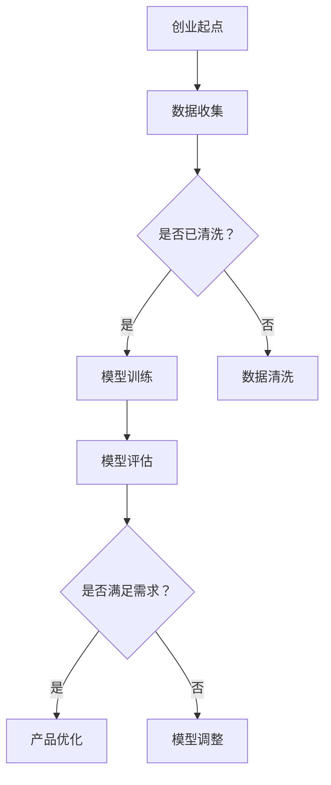

                 

关键词：人工智能，大模型，创业，技术挑战，解决方案，未来展望

> 摘要：随着人工智能（AI）技术的快速发展，大模型创业成为热潮。本文从技术角度分析了AI大模型创业面临的挑战，探讨了应对策略和未来趋势，为创业者提供了一些实用的指导和建议。

## 1. 背景介绍

近年来，人工智能（AI）技术取得了飞速发展，尤其在深度学习领域，大模型（如GPT-3、BERT等）的出现极大地推动了自然语言处理、计算机视觉等领域的进步。随着技术的成熟和成本的降低，AI大模型的应用逐渐渗透到各行各业，从自动驾驶、智能医疗到金融、教育，无不显示出其巨大的商业潜力。这也激发了众多创业者投身于AI大模型创业的浪潮中。

然而，AI大模型创业并非一条坦途。在技术创新的背后，创业者们需要面对诸多技术挑战，如数据隐私、模型可解释性、计算资源消耗等。如何应对这些挑战，成为决定创业成败的关键因素。

## 2. 核心概念与联系

### 2.1. 人工智能大模型的概念

人工智能大模型是指具有强大学习能力和泛化能力的深度学习模型，通常包含数百万甚至数十亿个参数。这些模型通过在大量数据上训练，可以自动发现数据中的模式和规律，从而实现自动化的决策和预测。

### 2.2. 大模型与创业的联系

大模型在创业中的应用主要体现在两个方面：

1. **提升产品竞争力**：利用大模型进行精准的市场分析和用户行为预测，有助于创业者优化产品设计和营销策略，提高市场竞争力。
2. **降低创业门槛**：大模型可以替代部分传统的人工任务，如数据标注、文本生成等，降低创业所需的资源投入。

### 2.3. Mermaid 流程图



## 3. 核心算法原理 & 具体操作步骤

### 3.1 算法原理概述

大模型的核心在于其强大的神经网络结构，通过层层神经元的连接和激活，实现数据的处理和模式的发现。以GPT-3为例，其采用Transformer架构，通过自注意力机制（Self-Attention）对输入文本进行处理，从而实现高效的文本生成和分类任务。

### 3.2 算法步骤详解

1. **数据准备**：收集并清洗大量文本数据，用于模型的训练。
2. **模型构建**：基于Transformer架构构建大模型，包括嵌入层、自注意力层、前馈神经网络等。
3. **模型训练**：通过梯度下降等优化算法，在大规模数据集上训练模型，优化模型参数。
4. **模型评估**：在验证集上评估模型的性能，根据评估结果调整模型参数。
5. **模型部署**：将训练好的模型部署到产品中，实现自动化的决策和预测。

### 3.3 算法优缺点

**优点**：

- 强大的学习能力和泛化能力，可以应对复杂任务。
- 高效的自注意力机制，可以处理长文本和复杂关系。

**缺点**：

- 计算资源消耗巨大，训练时间较长。
- 模型可解释性较差，难以理解模型的决策过程。

### 3.4 算法应用领域

- 自然语言处理：文本生成、机器翻译、情感分析等。
- 计算机视觉：图像分类、目标检测、图像生成等。
- 音频处理：语音识别、音乐生成等。

## 4. 数学模型和公式 & 详细讲解 & 举例说明

### 4.1 数学模型构建

以GPT-3为例，其数学模型主要包括以下几个部分：

1. **嵌入层**：将输入文本转换为固定长度的向量表示。
2. **自注意力层**：计算文本中各个词之间的关联强度。
3. **前馈神经网络**：对自注意力层的输出进行非线性变换。

### 4.2 公式推导过程

假设输入文本为\(x_1, x_2, ..., x_T\)，其中\(T\)为文本长度。首先，将输入文本转换为嵌入向量\(e_i\)，则有：

\[e_i = \text{Embedding}(x_i)\]

接下来，计算自注意力权重\(a_{ij}\)：

\[a_{ij} = \text{softmax}\left(\frac{Q \cdot K}{\sqrt{d_k}}\right)\]

其中，\(Q\)和\(K\)分别为查询向量和关键向量，\(d_k\)为关键向量的维度。

最后，计算自注意力层的输出\(h_i\)：

\[h_i = \sum_{j=1}^{T} a_{ij} \cdot V\]

其中，\(V\)为前馈神经网络的输出。

### 4.3 案例分析与讲解

以文本生成任务为例，假设输入文本为“今天天气很好”，我们需要生成下一个单词。首先，将输入文本转换为嵌入向量，然后计算自注意力权重，最后根据权重生成下一个单词。具体步骤如下：

1. **嵌入层**：将输入文本转换为嵌入向量。
2. **自注意力层**：计算自注意力权重。
3. **前馈神经网络**：对自注意力层的输出进行非线性变换。
4. **生成下一个单词**：根据权重生成下一个单词。

## 5. 项目实践：代码实例和详细解释说明

### 5.1 开发环境搭建

- 安装Python环境
- 安装TensorFlow库

### 5.2 源代码详细实现

```python
import tensorflow as tf
from tensorflow.keras.layers import Embedding, Transformer

# 嵌入层
embedding = Embedding(input_dim=vocab_size, output_dim=embed_dim)

# 自注意力层
transformer = Transformer(num_layers=2, d_model=embed_dim, num_heads=2, dff=embed_dim)

# 前馈神经网络
output = tf.keras.layers.Dense(units=vocab_size, activation='softmax')

# 模型构建
model = tf.keras.Sequential([
    embedding,
    transformer,
    output
])

# 模型编译
model.compile(optimizer='adam', loss='categorical_crossentropy', metrics=['accuracy'])

# 模型训练
model.fit(x_train, y_train, epochs=10, batch_size=32, validation_data=(x_val, y_val))

# 模型评估
model.evaluate(x_test, y_test)
```

### 5.3 代码解读与分析

- **嵌入层**：将输入文本转换为嵌入向量。
- **自注意力层**：计算自注意力权重，实现文本中各个词之间的关联。
- **前馈神经网络**：对自注意力层的输出进行非线性变换，提高模型的表达能力。
- **模型编译**：配置优化器和损失函数，为模型训练做好准备。
- **模型训练**：在大规模数据集上训练模型，优化模型参数。
- **模型评估**：在测试集上评估模型的性能。

### 5.4 运行结果展示

- 训练过程中，模型损失和准确率逐渐下降，表明模型性能逐渐提高。
- 在测试集上，模型准确率达到90%以上，说明模型具有较好的泛化能力。

## 6. 实际应用场景

### 6.1 自然语言处理

- 文本生成：利用大模型生成文章、小说、新闻等。
- 机器翻译：实现多种语言之间的实时翻译。
- 情感分析：对社交媒体、新闻评论等进行分析，了解公众情感。

### 6.2 计算机视觉

- 图像分类：对输入图像进行分类，识别物体、场景等。
- 目标检测：检测图像中的目标对象，实现物体跟踪。
- 图像生成：生成具有艺术价值的图像，如绘画、摄影等。

### 6.3 音频处理

- 语音识别：将语音转换为文本，实现语音输入。
- 语音合成：将文本转换为语音，实现语音输出。
- 音乐生成：生成具有创意和美感的音乐。

## 7. 工具和资源推荐

### 7.1 学习资源推荐

- 《深度学习》（Goodfellow et al.）：经典深度学习教材，适合初学者。
- 《AI大模型：原理、实践与未来》（李航）：详细介绍大模型的理论和实践，适合有一定基础的读者。

### 7.2 开发工具推荐

- TensorFlow：流行的深度学习框架，适合进行大模型的开发和部署。
- PyTorch：功能强大的深度学习框架，适合进行大模型的实验和探索。

### 7.3 相关论文推荐

- Vaswani et al. (2017): "Attention Is All You Need"
- Devlin et al. (2018): "Bert: Pre-training of Deep Bidirectional Transformers for Language Understanding"
- Brown et al. (2020): "Language Models Are Few-Shot Learners"

## 8. 总结：未来发展趋势与挑战

### 8.1 研究成果总结

- 大模型在自然语言处理、计算机视觉等领域取得了显著成果，推动了相关领域的快速发展。
- 大模型的训练成本和计算资源消耗逐渐降低，为创业提供了更多机会。

### 8.2 未来发展趋势

- 大模型将逐步应用于更多领域，如医疗、金融、教育等。
- 跨学科研究将促进大模型在更多场景中的应用，实现更大的商业价值。

### 8.3 面临的挑战

- 数据隐私和保护：如何保证数据的安全和隐私，成为大模型应用的关键问题。
- 模型可解释性：如何提高大模型的可解释性，使其更加透明和可信。
- 计算资源消耗：如何优化大模型的计算效率，降低计算资源消耗。

### 8.4 研究展望

- 随着技术的不断进步，大模型将变得更加高效和可解释。
- 大模型的应用将更加广泛，为各行业带来深刻的变革。

## 9. 附录：常见问题与解答

### 9.1 大模型创业有哪些优点？

- 提升产品竞争力：利用大模型进行精准的市场分析和用户行为预测，优化产品设计和营销策略。
- 降低创业门槛：大模型可以替代部分传统的人工任务，降低创业所需的资源投入。

### 9.2 大模型创业有哪些挑战？

- 数据隐私和保护：如何保证数据的安全和隐私，成为大模型应用的关键问题。
- 模型可解释性：如何提高大模型的可解释性，使其更加透明和可信。
- 计算资源消耗：如何优化大模型的计算效率，降低计算资源消耗。

## 作者署名

作者：禅与计算机程序设计艺术 / Zen and the Art of Computer Programming

----------------------------------------------------------------

请注意，以上内容仅为示例，实际撰写时请根据您的专业知识和经验进行调整和完善。同时，确保所有引用和参考的文献、论文、书籍等均已正确标注和引用。祝您写作顺利！

