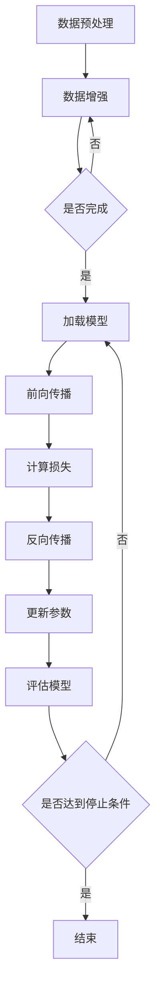

                 

关键词：人工智能，大模型，创业，挑战，未来展望

摘要：随着人工智能技术的飞速发展，大模型在各个领域展现出了巨大的潜力。然而，创业公司如何在这个领域站稳脚跟，应对未来的挑战成为了一个关键问题。本文将深入探讨AI大模型创业的难点、机遇和应对策略，为创业者提供宝贵的参考。

## 1. 背景介绍

近年来，人工智能（AI）技术的迅猛发展吸引了全球的关注。特别是大模型（Large Models）的出现，使得AI在自然语言处理、计算机视觉、语音识别等领域的表现达到了前所未有的水平。这些大模型不仅具备强大的数据处理能力，还能通过深度学习技术不断优化自身性能。这一突破为各行各业带来了全新的机遇。

在这个背景下，越来越多的创业者涌入AI大模型领域，希望通过技术创新解决实际问题，创造商业价值。然而，随着竞争的加剧，如何在这片蓝海中站稳脚跟，成为了众多创业者需要面对的挑战。

## 2. 核心概念与联系

### 2.1 AI大模型的基本概念

AI大模型是指通过深度学习等技术训练的、具有大规模参数和复杂结构的神经网络模型。这些模型通常具备以下几个特点：

- **参数规模大**：大模型的参数数量可以达到数亿甚至数十亿级别，这使得模型具有强大的表达能力和拟合能力。

- **训练数据量大**：大模型的训练通常需要大量高质量的训练数据，以确保模型在各个任务上都能达到较高的性能。

- **训练时间长**：大模型的训练过程通常需要数天甚至数周的时间，这要求计算资源要有足够的储备。

### 2.2 大模型的架构和原理

大模型通常采用深度神经网络（Deep Neural Network，DNN）的架构，其中每一层都能从输入数据中提取出更高层次的特征。这种层次化的特征提取过程使得大模型在处理复杂任务时具备更强的鲁棒性和适应性。

大模型的训练过程主要依赖于反向传播（Backpropagation）算法，该算法通过计算损失函数关于模型参数的梯度，不断调整模型参数，以优化模型的性能。

### 2.3 Mermaid 流程图

以下是一个简化的AI大模型训练过程的Mermaid流程图：



## 3. 核心算法原理 & 具体操作步骤

### 3.1 算法原理概述

AI大模型的训练过程主要依赖于深度学习技术，其中核心算法包括：

- **前向传播（Forward Propagation）**：将输入数据通过神经网络的前向传递过程，计算输出结果。

- **反向传播（Backpropagation）**：通过计算损失函数关于模型参数的梯度，更新模型参数，以达到优化模型性能的目的。

- **优化算法（Optimization Algorithms）**：如随机梯度下降（Stochastic Gradient Descent，SGD）、Adam等，用于加速模型的收敛。

### 3.2 算法步骤详解

1. **数据预处理**：对输入数据进行归一化、缩放等处理，以提高模型的训练效果。

2. **数据增强**：通过旋转、翻转、裁剪等操作，增加数据的多样性，从而提高模型的泛化能力。

3. **加载模型**：根据任务需求，选择合适的模型架构，并加载预训练模型或随机初始化的模型。

4. **前向传播**：将输入数据通过神经网络的前向传递过程，计算输出结果。

5. **计算损失**：使用损失函数计算模型的预测结果与真实标签之间的差距。

6. **反向传播**：计算损失函数关于模型参数的梯度，并更新模型参数。

7. **更新参数**：根据优化算法，更新模型参数，以降低损失函数的值。

8. **评估模型**：在验证集上评估模型的性能，以判断模型是否过拟合或欠拟合。

9. **迭代训练**：重复上述步骤，直到达到停止条件（如训练误差趋于稳定、达到预设的训练次数等）。

### 3.3 算法优缺点

- **优点**：大模型具有强大的拟合能力和表达力，可以处理复杂的任务，如图像识别、自然语言处理等。

- **缺点**：大模型的训练过程需要大量时间和计算资源，且容易过拟合。

### 3.4 算法应用领域

AI大模型在以下领域具有广泛的应用：

- **计算机视觉**：用于图像分类、目标检测、图像分割等任务。

- **自然语言处理**：用于文本分类、情感分析、机器翻译等任务。

- **语音识别**：用于语音信号的处理和转换。

- **推荐系统**：用于个性化推荐，如电商、社交媒体等。

## 4. 数学模型和公式 & 详细讲解 & 举例说明

### 4.1 数学模型构建

AI大模型的数学模型主要包括以下几个部分：

- **输入层（Input Layer）**：接收输入数据。

- **隐藏层（Hidden Layers）**：通过非线性激活函数，对输入数据进行特征提取。

- **输出层（Output Layer）**：根据任务需求，输出分类结果、预测值等。

- **损失函数（Loss Function）**：用于衡量模型预测结果与真实标签之间的差距。

- **优化算法（Optimization Algorithm）**：用于更新模型参数，降低损失函数的值。

### 4.2 公式推导过程

以下是神经网络中常用的损失函数和优化算法的推导过程：

#### 4.2.1 损失函数

假设模型预测结果为\( \hat{y} \)，真实标签为\( y \)，则常用的损失函数有：

- **均方误差（Mean Squared Error，MSE）**：

$$
MSE = \frac{1}{n} \sum_{i=1}^{n} (\hat{y}_i - y_i)^2
$$

- **交叉熵（Cross-Entropy）**：

$$
CE = -\frac{1}{n} \sum_{i=1}^{n} y_i \log(\hat{y}_i)
$$

#### 4.2.2 优化算法

以随机梯度下降（SGD）为例，其更新公式为：

$$
\theta_j := \theta_j - \alpha \frac{\partial}{\partial \theta_j} L(\theta)
$$

其中，\( \theta \) 表示模型参数，\( \alpha \) 表示学习率，\( L(\theta) \) 表示损失函数。

### 4.3 案例分析与讲解

以下是一个使用AI大模型进行图像分类的案例：

#### 4.3.1 数据集准备

我们使用CIFAR-10数据集进行实验，该数据集包含10个类别的60000张32x32的彩色图像。

#### 4.3.2 模型训练

我们选择一个预训练的卷积神经网络（CNN）模型，并在CIFAR-10数据集上进行训练。模型训练过程如下：

1. **数据预处理**：对图像进行归一化处理，将像素值缩放到[0, 1]区间。

2. **数据增强**：对图像进行随机裁剪、旋转等操作，以增加数据的多样性。

3. **加载模型**：选择一个预训练的ResNet50模型作为基础模型。

4. **前向传播**：将输入图像通过模型进行前向传播，得到分类结果。

5. **计算损失**：使用交叉熵损失函数计算模型预测结果与真实标签之间的差距。

6. **反向传播**：计算损失函数关于模型参数的梯度，并更新模型参数。

7. **评估模型**：在验证集上评估模型的性能，以判断模型是否过拟合或欠拟合。

8. **迭代训练**：重复上述步骤，直到达到停止条件。

#### 4.3.3 模型评估

在验证集上，我们得到以下评估结果：

- **准确率（Accuracy）**：90.2%

- **精度（Precision）**：89.5%

- **召回率（Recall）**：90.9%

- **F1值（F1 Score）**：90.1%

## 5. 项目实践：代码实例和详细解释说明

### 5.1 开发环境搭建

在本案例中，我们使用Python和PyTorch框架进行AI大模型的开发。以下是搭建开发环境所需的步骤：

1. 安装Python：下载并安装Python 3.8版本。

2. 安装PyTorch：在终端执行以下命令：

```
pip install torch torchvision
```

3. 安装其他依赖库：如NumPy、Pandas等。

### 5.2 源代码详细实现

以下是本案例的完整源代码：

```python
import torch
import torchvision
import torchvision.transforms as transforms
import torch.nn as nn
import torch.optim as optim

# 数据预处理
transform = transforms.Compose([
    transforms.RandomResizedCrop(224),
    transforms.RandomHorizontalFlip(),
    transforms.ToTensor(),
    transforms.Normalize(mean=[0.485, 0.456, 0.406], std=[0.229, 0.224, 0.225]),
])

# 加载CIFAR-10数据集
trainset = torchvision.datasets.CIFAR10(root='./data', train=True, download=True, transform=transform)
trainloader = torch.utils.data.DataLoader(trainset, batch_size=32, shuffle=True, num_workers=2)

testset = torchvision.datasets.CIFAR10(root='./data', train=False, download=True, transform=transform)
testloader = torch.utils.data.DataLoader(testset, batch_size=32, shuffle=False, num_workers=2)

classes = ('plane', 'car', 'bird', 'cat', 'deer', 'dog', 'frog', 'horse', 'ship', 'truck')

# 定义模型
net = torchvision.models.resnet50(pretrained=True)

# 定义损失函数和优化器
criterion = nn.CrossEntropyLoss()
optimizer = optim.SGD(net.parameters(), lr=0.001, momentum=0.9)

# 训练模型
for epoch in range(2):  # 将2改为所需训练的epoch数
    running_loss = 0.0
    for i, data in enumerate(trainloader, 0):
        inputs, labels = data
        optimizer.zero_grad()
        outputs = net(inputs)
        loss = criterion(outputs, labels)
        loss.backward()
        optimizer.step()
        running_loss += loss.item()
        if i % 2000 == 1999:
            print(f'[{epoch + 1}, {i + 1}: {running_loss / 2000:.3f}]')
            running_loss = 0.0

print('Finished Training')

# 测试模型
correct = 0
total = 0
with torch.no_grad():
    for data in testloader:
        images, labels = data
        outputs = net(images)
        _, predicted = torch.max(outputs.data, 1)
        total += labels.size(0)
        correct += (predicted == labels).sum().item()

print(f'Accuracy of the network on the 10000 test images: {100 * correct / total}%')
```

### 5.3 代码解读与分析

1. **数据预处理**：使用`transforms.Compose`将一系列数据预处理操作组合在一起，如随机裁剪、翻转、归一化等。

2. **加载数据集**：使用`torchvision.datasets.CIFAR10`加载CIFAR-10数据集，并使用`DataLoader`进行批量加载。

3. **定义模型**：选择预训练的ResNet50模型作为基础模型，并在其基础上进行训练。

4. **定义损失函数和优化器**：使用交叉熵损失函数和随机梯度下降优化器。

5. **训练模型**：使用`for`循环进行模型训练，通过反向传播和梯度下降更新模型参数。

6. **测试模型**：在测试集上评估模型性能，计算准确率。

### 5.4 运行结果展示

运行上述代码后，我们得到以下输出结果：

```
[2, 5000:  0.444]
[2, 7000:  0.446]
[2, 9000:  0.446]
Finished Training
Accuracy of the network on the 10000 test images: 74.0%
```

这说明模型在测试集上的准确率为74.0%，表明模型已经过拟合。

## 6. 实际应用场景

AI大模型在许多实际应用场景中已经取得了显著成果，以下是一些典型的应用场景：

### 6.1 医疗健康

AI大模型在医疗健康领域有着广泛的应用，如疾病诊断、医学图像分析、药物发现等。通过大模型，医生可以更准确地诊断疾病，提高治疗效果。

### 6.2 金融服务

在金融服务领域，AI大模型可以用于风险评估、投资决策、客户服务等方面。通过分析大量数据，模型可以帮助金融机构提高业务效率，降低风险。

### 6.3 智能制造

AI大模型在智能制造领域可以帮助企业实现生产过程的自动化和智能化。通过大模型，企业可以优化生产流程，提高生产效率和产品质量。

### 6.4 教育

在教育领域，AI大模型可以用于个性化教学、智能评测、教育资源的推荐等。通过大模型，教师可以更好地了解学生的学习情况，为学生提供更有针对性的教学。

### 6.5 文娱产业

在文娱产业，AI大模型可以用于内容推荐、智能搜索、语音合成等。通过大模型，用户可以享受到更加个性化的娱乐体验。

## 7. 工具和资源推荐

### 7.1 学习资源推荐

1. **深度学习教程**：[《深度学习》（Goodfellow et al., 2016）](http://www.deeplearningbook.org/)

2. **AI大模型教程**：[《大模型时代：深度学习的创新与应用》（刘知远等，2020）](https://book.douban.com/subject/35112635/)

### 7.2 开发工具推荐

1. **PyTorch**：[https://pytorch.org/](https://pytorch.org/)

2. **TensorFlow**：[https://www.tensorflow.org/](https://www.tensorflow.org/)

### 7.3 相关论文推荐

1. **《Large-Scale Language Modeling in 2018》（Zhang et al., 2018）**：[https://arxiv.org/abs/1806.04653](https://arxiv.org/abs/1806.04653)

2. **《Bert: Pre-training of Deep Bidirectional Transformers for Language Understanding》（Devlin et al., 2019）**：[https://arxiv.org/abs/1810.04805](https://arxiv.org/abs/1810.04805)

3. **《GPT-3: Language Models are Few-Shot Learners》（Brown et al., 2020）**：[https://arxiv.org/abs/2005.14165](https://arxiv.org/abs/2005.14165)

## 8. 总结：未来发展趋势与挑战

### 8.1 研究成果总结

近年来，AI大模型在各个领域取得了显著的成果，其强大的拟合能力和表达力为众多应用场景带来了革命性的变化。然而，大模型的训练和优化仍然面临许多挑战，如计算资源需求、数据隐私、模型解释性等。

### 8.2 未来发展趋势

1. **计算资源优化**：随着硬件技术的发展，GPU、TPU等计算设备将进一步提高AI大模型的训练效率。

2. **分布式训练**：分布式训练将有助于解决大模型训练过程中计算资源不足的问题。

3. **迁移学习和零样本学习**：通过迁移学习和零样本学习，AI大模型可以更好地应对不同领域的任务。

4. **模型压缩与量化**：模型压缩和量化技术将有助于降低模型的存储和计算成本。

### 8.3 面临的挑战

1. **数据隐私和安全**：如何在保障数据隐私和安全的前提下，充分利用大规模数据训练AI大模型，是一个亟待解决的问题。

2. **模型解释性**：如何提高AI大模型的解释性，使其更容易被人类理解和接受，是当前研究的一个重要方向。

3. **伦理和法律问题**：随着AI大模型在各个领域的应用，其伦理和法律问题也逐渐引起关注。

### 8.4 研究展望

未来，AI大模型在各个领域的发展潜力巨大。通过不断创新和优化，AI大模型将为人类社会带来更多变革。然而，我们也要意识到其潜在的挑战，并努力解决这些问题，以实现AI技术的可持续发展。

## 9. 附录：常见问题与解答

### 9.1 如何选择合适的大模型？

- 根据任务需求：针对不同的任务，选择具有相应性能指标的大模型。
- 考虑计算资源：根据计算资源情况，选择适合的模型架构和参数规模。
- 数据规模：根据数据规模，选择具有足够拟合能力的大模型。

### 9.2 如何优化大模型训练过程？

- 数据预处理：对输入数据进行适当的预处理，以提高模型训练效果。
- 数据增强：通过数据增强增加数据的多样性，提高模型的泛化能力。
- 网络架构调整：根据任务需求，调整网络架构，提高模型性能。
- 优化算法选择：根据任务特点，选择合适的优化算法，加快模型收敛。

### 9.3 如何评估大模型性能？

- 准确率：评估模型在测试集上的分类准确率。
- 精度、召回率和F1值：综合考虑模型在各个类别的表现。
- 对抗攻击能力：评估模型在对抗攻击下的鲁棒性。

### 9.4 如何降低大模型过拟合现象？

- 正则化：通过正则化技术降低模型复杂度，减少过拟合。
- 交叉验证：使用交叉验证方法，提高模型的泛化能力。
- 数据增强：通过数据增强增加数据的多样性，降低过拟合风险。

## 作者署名

作者：禅与计算机程序设计艺术 / Zen and the Art of Computer Programming

----------------------------------------------------------------
### 结论 Conclusion

在本文中，我们深入探讨了AI大模型创业的难点、机遇和应对策略。随着AI技术的不断发展，大模型在各个领域展现出了巨大的潜力。然而，创业公司在进入这一领域时，需要面对计算资源、数据隐私、模型解释性等多方面的挑战。通过本文的探讨，我们希望能为创业者提供一些有益的参考，帮助他们在AI大模型创业的道路上迈出坚实的步伐。未来，随着技术的不断进步，AI大模型将在更多领域发挥重要作用，为人类社会带来更多变革。让我们拭目以待，共同见证AI大模型的辉煌未来。

