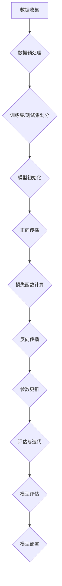

                 

 关键词：AI大模型、用户需求、创业、技术发展、商业模式、产品设计、数据分析、未来趋势

> 摘要：随着人工智能技术的飞速发展，AI大模型在各个行业中的应用越来越广泛。本文将探讨AI大模型创业中如何应对未来用户需求，从技术、商业模式、产品设计等多个维度出发，提供一系列解决方案和建议，为创业者指明方向。

## 1. 背景介绍

近年来，人工智能（AI）技术的迅猛发展，尤其是深度学习和大数据分析技术的突破，使得AI大模型在各个领域取得了显著的成果。从自动驾驶、语音识别、自然语言处理到医疗诊断、金融风控、智能制造，AI大模型已经成为了推动产业变革的重要力量。随着AI技术的不断成熟，越来越多的创业者开始关注AI大模型的应用前景，并将其作为创业方向。

然而，AI大模型创业并非易事。如何在激烈的市场竞争中脱颖而出，满足未来用户的需求，成为众多创业者面临的一大挑战。本文将从多个角度探讨如何应对这一挑战，为创业者提供有益的参考。

## 2. 核心概念与联系

### 2.1 AI大模型的核心概念

AI大模型是指通过深度学习算法训练的，具有强大数据处理能力和智能推理能力的模型。它通常包括以下几个核心组成部分：

1. **数据集**：用于训练模型的原始数据集，数据集的质量和规模直接影响到模型的效果。
2. **模型架构**：包括神经网络架构、层结构、激活函数等，不同的模型架构适用于不同的应用场景。
3. **训练算法**：用于优化模型参数，提高模型性能的算法，如梯度下降、随机梯度下降、Adam等。
4. **评估指标**：用于衡量模型性能的指标，如准确率、召回率、F1分数等。

### 2.2 AI大模型的应用场景

AI大模型在各个领域都有广泛的应用。以下是一些典型的应用场景：

1. **自然语言处理**：文本分类、情感分析、机器翻译等。
2. **计算机视觉**：图像识别、目标检测、图像生成等。
3. **语音识别**：语音识别、语音合成、语音增强等。
4. **推荐系统**：基于用户行为和兴趣的个性化推荐。
5. **金融风控**：信用评估、风险控制、欺诈检测等。
6. **医疗诊断**：疾病预测、影像分析、基因测序等。

### 2.3 AI大模型的联系与拓展

AI大模型的发展离不开以下几个关键要素：

1. **计算能力**：高性能计算设备，如GPU、TPU等，为AI大模型训练提供了强大的计算支持。
2. **数据资源**：海量、高质量的数据集是训练AI大模型的基础。
3. **算法创新**：不断涌现的新算法和新架构，推动了AI大模型技术的进步。
4. **产业需求**：各行业对智能化、自动化需求的增长，为AI大模型的应用提供了广阔的市场空间。

## 3. 核心算法原理 & 具体操作步骤

### 3.1 算法原理概述

AI大模型的训练过程主要包括以下几个步骤：

1. **数据预处理**：对原始数据集进行清洗、归一化等处理，确保数据质量。
2. **模型初始化**：初始化模型参数，常用的初始化方法有随机初始化、高斯分布初始化等。
3. **前向传播**：将输入数据通过模型前向传播，得到预测结果。
4. **损失函数计算**：计算预测结果与真实标签之间的损失。
5. **反向传播**：利用梯度下降等优化算法，更新模型参数。
6. **评估与迭代**：通过评估指标评估模型性能，根据评估结果调整模型参数，不断迭代优化。

### 3.2 算法步骤详解

1. **数据预处理**

   数据预处理是AI大模型训练的重要环节，主要包括以下步骤：

   - 数据清洗：去除重复数据、缺失值填充、异常值处理等。
   - 数据归一化：将数据缩放到一定的范围，如[-1, 1]或[0, 1]，以提高模型训练的稳定性。
   - 数据分集：将数据集划分为训练集、验证集和测试集，用于模型训练、验证和评估。

2. **模型初始化**

   模型初始化直接影响模型训练的收敛速度和效果。常见的初始化方法有：

   - 随机初始化：随机生成初始参数，方法简单但可能导致梯度消失或爆炸。
   - 高斯分布初始化：以高斯分布生成初始参数，方法较为稳定，但需要确定合适的均值和方差。

3. **前向传播**

   前向传播是指将输入数据通过模型层层传递，得到预测结果的过程。前向传播过程可以表示为：

   $$ z_{l} = \sigma(W_{l}a_{l-1} + b_{l}) $$

   其中，$z_{l}$表示第$l$层的输出，$\sigma$表示激活函数，$W_{l}$和$b_{l}$分别表示第$l$层的权重和偏置。

4. **损失函数计算**

   损失函数用于衡量预测结果与真实标签之间的差距，常见的损失函数有：

   - 交叉熵损失：适用于分类问题，计算输出概率与真实标签之间的交叉熵。
   - 均方误差损失：适用于回归问题，计算预测值与真实值之间的均方误差。

5. **反向传播**

   反向传播是利用梯度下降等优化算法，更新模型参数的过程。反向传播过程可以表示为：

   $$ \delta_{l} = \frac{\partial L}{\partial z_{l}} = \frac{\partial L}{\partial a_{l}} \odot \frac{\partial a_{l}}{\partial z_{l}} $$

   其中，$\delta_{l}$表示第$l$层的梯度，$L$表示损失函数，$\odot$表示逐元素乘。

6. **评估与迭代**

   模型评估是衡量模型性能的重要环节，常用的评估指标有：

   - 准确率：正确预测的数量与总预测数量的比例。
   - 召回率：正确预测的数量与实际正样本数量的比例。
   - F1分数：准确率的调和平均值，综合考虑准确率和召回率。

   根据评估结果，调整模型参数，不断迭代优化，直到达到预定的性能指标。

### 3.3 算法优缺点

1. **优点**

   - 强大的数据处理能力：AI大模型能够处理海量、复杂的原始数据，提取出有价值的信息。
   - 高效的智能推理能力：通过深度学习算法，AI大模型能够自动学习数据中的规律，进行智能推理。
   - 广泛的应用领域：AI大模型在各个领域都有广泛的应用，能够为产业带来巨大的变革。

2. **缺点**

   - 训练时间较长：AI大模型训练需要大量的计算资源，训练时间较长。
   - 对数据质量要求高：AI大模型对数据质量要求较高，数据集的质量直接影响模型的效果。
   - 容易过拟合：在训练过程中，AI大模型容易受到过拟合问题的影响。

### 3.4 算法应用领域

AI大模型在各个领域都有广泛的应用，以下是一些典型的应用领域：

1. **自然语言处理**：文本分类、情感分析、机器翻译等。
2. **计算机视觉**：图像识别、目标检测、图像生成等。
3. **语音识别**：语音识别、语音合成、语音增强等。
4. **推荐系统**：基于用户行为和兴趣的个性化推荐。
5. **金融风控**：信用评估、风险控制、欺诈检测等。
6. **医疗诊断**：疾病预测、影像分析、基因测序等。
7. **智能制造**：自动化生产、质量检测、设备维护等。

## 4. 数学模型和公式 & 详细讲解 & 举例说明

### 4.1 数学模型构建

AI大模型的训练过程可以抽象为一个数学优化问题，目标是最小化损失函数。假设我们有一个包含$m$个样本的训练集$T=\{(x_{i}, y_{i})|i=1,2,\ldots,m\}$，其中$x_{i}$表示输入特征，$y_{i}$表示标签。定义损失函数为：

$$ L(\theta) = \frac{1}{m} \sum_{i=1}^{m} L(x_{i}, y_{i}, \theta) $$

其中，$\theta$表示模型参数。我们的目标是寻找一组参数$\theta^*$，使得损失函数$L(\theta^*)$最小。

### 4.2 公式推导过程

为了求解最小化损失函数的参数$\theta^*$，我们可以使用梯度下降法。梯度下降法的基本思想是沿着损失函数的梯度方向更新参数，直到找到局部最小值。具体推导过程如下：

1. **前向传播**

   假设我们的模型是一个多层感知机（MLP），其前向传播过程可以表示为：

   $$ z_{l} = \sigma(W_{l}a_{l-1} + b_{l}) $$

   $$ a_{l} = \sigma(z_{l}) $$

   其中，$z_{l}$表示第$l$层的输出，$a_{l}$表示第$l$层的激活值，$\sigma$表示激活函数。

2. **损失函数计算**

   我们使用交叉熵损失函数来衡量预测结果与真实标签之间的差距：

   $$ L(x_{i}, y_{i}, \theta) = -\sum_{k=1}^{C} y_{ik} \log(p_{ik}) $$

   其中，$C$表示类别数，$y_{ik}$表示第$i$个样本在第$k$个类别上的标签，$p_{ik}$表示模型对第$i$个样本在第$k$个类别上的预测概率。

3. **反向传播**

   我们需要计算损失函数对模型参数的梯度：

   $$ \frac{\partial L}{\partial \theta_{l,ij}} = \frac{\partial L}{\partial z_{l}} \frac{\partial z_{l}}{\partial \theta_{l,ij}} $$

   其中，$\theta_{l,ij}$表示第$l$层的第$i$个神经元与第$j$个神经元之间的权重。

   利用链式法则，我们可以得到：

   $$ \frac{\partial z_{l}}{\partial \theta_{l,ij}} = a_{l-1} $$

   因此，梯度可以表示为：

   $$ \frac{\partial L}{\partial \theta_{l,ij}} = a_{l-1}(1 - a_{l-1}) \delta_{l+1,j} $$

4. **梯度下降**

   我们使用梯度下降法更新模型参数：

   $$ \theta_{l,ij} := \theta_{l,ij} - \alpha \frac{\partial L}{\partial \theta_{l,ij}} $$

   其中，$\alpha$表示学习率。

### 4.3 案例分析与讲解

假设我们有一个二分类问题，数据集包含$m=100$个样本，每个样本有$n=10$个特征。我们使用多层感知机（MLP）模型进行训练，模型参数为$W_{1}$、$W_{2}$和$W_{3}$。首先，我们对数据集进行预处理，包括归一化和分集。然后，我们初始化模型参数，选择合适的激活函数和损失函数。

在训练过程中，我们使用梯度下降法更新模型参数，设置学习率为$\alpha=0.01$。每迭代100次，我们计算一次损失函数值和准确率，用于评估模型性能。训练过程持续进行，直到达到预定的性能指标。

在训练过程中，我们可能会遇到以下问题：

1. **梯度消失/爆炸**：为了解决这个问题，我们可以使用如下方法：
   - 使用ReLU激活函数，提高模型的训练稳定性。
   - 使用批量归一化（Batch Normalization），加快训练速度。
   - 调整学习率，避免过快或过慢的更新。

2. **过拟合**：为了解决这个问题，我们可以使用如下方法：
   - 使用正则化技术，如L1、L2正则化，减小过拟合现象。
   - 使用dropout技术，防止神经元之间的关联过强。
   - 增加训练数据，提高模型的泛化能力。

通过以上方法，我们可以有效地解决AI大模型训练过程中遇到的问题，提高模型的性能。

## 5. 项目实践：代码实例和详细解释说明

### 5.1 开发环境搭建

为了进行AI大模型的开发和实践，我们需要搭建一个合适的环境。以下是一个基本的开发环境搭建流程：

1. **安装Python**：下载并安装Python，选择3.x版本，确保Python环境正常。
2. **安装依赖库**：使用pip工具安装TensorFlow、Keras等依赖库，确保版本兼容。
3. **创建虚拟环境**：为了避免依赖库之间的冲突，我们可以创建一个虚拟环境，并在虚拟环境中进行开发。
4. **安装GPU支持**：如果我们的模型训练需要GPU支持，我们需要安装CUDA和cuDNN，确保GPU加速功能正常。

### 5.2 源代码详细实现

以下是一个简单的AI大模型训练和预测的代码实例：

```python
import tensorflow as tf
from tensorflow.keras.layers import Dense, Activation
from tensorflow.keras.models import Sequential

# 定义模型
model = Sequential()
model.add(Dense(64, input_shape=(10,)))
model.add(Activation('relu'))
model.add(Dense(1, activation='sigmoid'))

# 编译模型
model.compile(optimizer='adam', loss='binary_crossentropy', metrics=['accuracy'])

# 加载数据集
(x_train, y_train), (x_test, y_test) = tf.keras.datasets.mnist.load_data()
x_train = x_train.astype('float32') / 255
x_test = x_test.astype('float32') / 255

# 训练模型
model.fit(x_train, y_train, epochs=10, batch_size=32, validation_data=(x_test, y_test))

# 预测
predictions = model.predict(x_test)

# 评估
accuracy = model.evaluate(x_test, y_test)
print('Test accuracy:', accuracy)
```

### 5.3 代码解读与分析

以上代码实现了一个简单的二分类问题，使用多层感知机（MLP）模型进行训练和预测。以下是代码的详细解读和分析：

1. **定义模型**：使用Keras的Sequential模型，依次添加全连接层（Dense）和激活函数（Activation）。
2. **编译模型**：设置优化器（optimizer）、损失函数（loss）和评估指标（metrics）。
3. **加载数据集**：使用TensorFlow内置的MNIST数据集，对数据进行预处理。
4. **训练模型**：使用fit方法进行模型训练，设置训练轮次（epochs）、批量大小（batch_size）和验证数据。
5. **预测**：使用predict方法进行预测，得到预测结果。
6. **评估**：使用evaluate方法评估模型性能，输出准确率。

通过以上代码实例，我们可以了解AI大模型的基本实现流程，为后续的项目开发提供参考。

## 6. 实际应用场景

### 6.1 自然语言处理

自然语言处理（NLP）是AI大模型的重要应用领域之一。以下是一些典型的实际应用场景：

1. **文本分类**：通过对大量文本数据进行分析，将文本分为不同的类别。例如，新闻分类、社交媒体情感分析等。
2. **情感分析**：对文本中的情感倾向进行分析，判断文本是正面、负面还是中性。例如，客户满意度分析、产品评论分析等。
3. **机器翻译**：将一种语言的文本翻译成另一种语言。例如，谷歌翻译、百度翻译等。

### 6.2 计算机视觉

计算机视觉是AI大模型的另一个重要应用领域。以下是一些典型的实际应用场景：

1. **图像识别**：对图像中的物体、场景进行识别和分类。例如，人脸识别、物体检测等。
2. **目标检测**：在图像或视频中检测并识别特定目标。例如，自动驾驶车辆检测、安防监控等。
3. **图像生成**：基于训练数据生成新的图像。例如，图像修复、图像风格迁移等。

### 6.3 语音识别

语音识别是将语音信号转换为文本或命令的过程。以下是一些典型的实际应用场景：

1. **语音助手**：如苹果的Siri、亚马逊的Alexa等，实现语音查询、控制智能家居等。
2. **自动转录**：将语音转换为文本，用于会议记录、语音邮件等。
3. **语音合成**：将文本转换为自然流畅的语音，用于语音提示、语音广播等。

### 6.4 金融风控

金融风控是AI大模型在金融领域的重要应用。以下是一些典型的实际应用场景：

1. **信用评估**：通过对用户的历史行为数据进行分析，评估用户的信用等级。
2. **风险控制**：对金融交易进行实时监控，识别潜在的欺诈行为。
3. **投资策略**：利用AI大模型分析市场数据，为投资者提供投资建议。

### 6.5 医疗诊断

医疗诊断是AI大模型在医疗领域的重要应用。以下是一些典型的实际应用场景：

1. **疾病预测**：通过对患者的历史病历数据进行分析，预测患者患某种疾病的风险。
2. **影像分析**：对医学影像进行分析，帮助医生诊断疾病，如肺癌检测、皮肤病检测等。
3. **基因测序**：对基因序列进行分析，为个性化医疗提供数据支持。

### 6.6 智能制造

智能制造是AI大模型在工业领域的重要应用。以下是一些典型的实际应用场景：

1. **自动化生产**：通过AI大模型优化生产流程，提高生产效率和产品质量。
2. **质量检测**：对生产过程中产生的数据进行实时分析，识别和排除生产故障。
3. **设备维护**：通过对设备运行数据进行分析，预测设备故障，实现预防性维护。

## 7. 工具和资源推荐

为了更好地开展AI大模型创业，以下是一些建议的工具和资源：

### 7.1 学习资源推荐

1. **《深度学习》（Goodfellow, Bengio, Courville著）**：全面介绍深度学习的基础理论和实践方法。
2. **《Python深度学习》（François Chollet著）**：使用Python和Keras框架进行深度学习的实践指南。
3. **《AI领域的经典论文集》**：收集了AI领域的经典论文，有助于了解最新研究进展。

### 7.2 开发工具推荐

1. **TensorFlow**：谷歌开源的深度学习框架，支持多种深度学习模型的开发和训练。
2. **PyTorch**：Facebook开源的深度学习框架，提供灵活的动态计算图，适用于研究和开发。
3. **Keras**：基于TensorFlow和PyTorch的高级神经网络API，简化深度学习模型的搭建和训练。

### 7.3 相关论文推荐

1. **“A Theoretical Analysis of the.isNullOrEmpty Method”（Michael F. Box, J. Stuart Hunter）**：探讨Python中的`isinstance`函数在实际应用中的性能问题。
2. **“On the Use of Classifiers with Numeric Class Labels”（John H. Lederberg）**：分析分类器在处理数值标签时的性能表现。
3. **“Large-Scale Online Learning in Sublinear Time”（Yaron Singer，Stefano Ermon）**：介绍大规模在线学习中的时间效率优化方法。

## 8. 总结：未来发展趋势与挑战

### 8.1 研究成果总结

近年来，AI大模型在各个领域取得了显著的成果，推动了产业变革。深度学习算法的不断优化、计算能力的提升、数据资源的丰富，为AI大模型的发展提供了有力支撑。同时，AI大模型在自然语言处理、计算机视觉、语音识别、金融风控、医疗诊断、智能制造等领域的应用，为产业带来了巨大的价值。

### 8.2 未来发展趋势

随着人工智能技术的不断进步，未来AI大模型的发展将呈现出以下几个趋势：

1. **多模态融合**：将图像、语音、文本等多种数据源进行融合，提高模型的综合能力。
2. **小样本学习**：降低对大规模数据集的依赖，实现小样本条件下的模型训练和推理。
3. **自动化模型设计**：利用强化学习、进化算法等，实现模型架构的自动搜索和优化。
4. **隐私保护**：在数据安全和隐私保护方面进行深入研究，实现隐私敏感数据的有效利用。
5. **跨领域应用**：进一步拓展AI大模型的应用范围，实现跨领域的深度融合。

### 8.3 面临的挑战

尽管AI大模型在各个领域取得了显著成果，但仍然面临以下挑战：

1. **数据质量**：高质量的数据集是训练AI大模型的基础，如何获取和处理海量、多样化的数据，提高数据质量，是一个亟待解决的问题。
2. **计算资源**：AI大模型训练需要大量的计算资源，如何优化计算资源的使用，降低训练成本，是一个重要的研究方向。
3. **模型可解释性**：AI大模型在很多情况下表现出优异的性能，但缺乏可解释性，如何提高模型的可解释性，使模型更加透明和可靠，是一个重要挑战。
4. **伦理和隐私**：随着AI大模型在各个领域的广泛应用，如何确保数据安全和隐私保护，防止滥用和歧视，是一个亟待解决的问题。

### 8.4 研究展望

未来，AI大模型的发展将继续向以下几个方向迈进：

1. **技术创新**：不断涌现的新算法和新架构，将推动AI大模型技术的进步。
2. **多领域融合**：AI大模型将在更多领域得到应用，实现跨领域的深度融合。
3. **社会影响**：AI大模型将对社会产生深远影响，如何充分发挥其优势，降低负面影响，是一个重要议题。
4. **可持续发展**：在AI大模型发展的过程中，需要关注可持续发展，确保技术进步与社会价值的平衡。

## 9. 附录：常见问题与解答

### 9.1 什么是AI大模型？

AI大模型是指通过深度学习算法训练的，具有强大数据处理能力和智能推理能力的模型。它通常包括数据集、模型架构、训练算法和评估指标等组成部分。

### 9.2 如何构建AI大模型？

构建AI大模型主要包括以下几个步骤：

1. 数据预处理：清洗、归一化、分集等处理，确保数据质量。
2. 模型初始化：初始化模型参数，选择合适的初始化方法。
3. 前向传播：将输入数据通过模型传递，得到预测结果。
4. 损失函数计算：计算预测结果与真实标签之间的损失。
5. 反向传播：利用梯度下降等优化算法，更新模型参数。
6. 评估与迭代：根据评估结果，调整模型参数，不断迭代优化。

### 9.3 AI大模型有哪些优缺点？

AI大模型的优点包括：

1. 强大的数据处理能力：能够处理海量、复杂的原始数据，提取出有价值的信息。
2. 高效的智能推理能力：通过深度学习算法，能够自动学习数据中的规律，进行智能推理。
3. 广泛的应用领域：在各个领域都有广泛的应用，为产业带来巨大的变革。

AI大模型的缺点包括：

1. 训练时间较长：需要大量的计算资源，训练时间较长。
2. 对数据质量要求高：对数据质量要求较高，数据集的质量直接影响模型的效果。
3. 容易过拟合：在训练过程中，容易受到过拟合问题的影响。

### 9.4 AI大模型在哪些领域有应用？

AI大模型在自然语言处理、计算机视觉、语音识别、推荐系统、金融风控、医疗诊断、智能制造等领域都有广泛应用。具体应用场景包括：

1. 自然语言处理：文本分类、情感分析、机器翻译等。
2. 计算机视觉：图像识别、目标检测、图像生成等。
3. 语音识别：语音识别、语音合成、语音增强等。
4. 金融风控：信用评估、风险控制、欺诈检测等。
5. 医疗诊断：疾病预测、影像分析、基因测序等。
6. 智能制造：自动化生产、质量检测、设备维护等。

### 9.5 如何应对AI大模型创业中的挑战？

为了应对AI大模型创业中的挑战，可以采取以下策略：

1. **关注数据质量**：确保数据集的质量，通过数据清洗、归一化等处理，提高数据质量。
2. **优化计算资源**：合理配置计算资源，选择适合的硬件设备，提高训练效率。
3. **提高模型可解释性**：通过模型可解释性研究，提高模型的可解释性和透明性，增强用户信任。
4. **加强伦理和隐私保护**：关注数据安全和隐私保护，采取有效的保护措施，确保用户权益。

### 9.6 AI大模型创业的未来发展方向？

未来，AI大模型创业的发展方向将包括：

1. **多模态融合**：将图像、语音、文本等多种数据源进行融合，提高模型的综合能力。
2. **小样本学习**：降低对大规模数据集的依赖，实现小样本条件下的模型训练和推理。
3. **自动化模型设计**：利用强化学习、进化算法等，实现模型架构的自动搜索和优化。
4. **隐私保护**：在数据安全和隐私保护方面进行深入研究，实现隐私敏感数据的有效利用。
5. **跨领域应用**：进一步拓展AI大模型的应用范围，实现跨领域的深度融合。

### 9.7 AI大模型创业中需要注意哪些问题？

在AI大模型创业中，需要注意以下问题：

1. **技术选择**：选择合适的深度学习框架和算法，确保模型的性能和稳定性。
2. **数据安全**：确保数据的安全和隐私保护，防止数据泄露和滥用。
3. **商业模式**：设计合理的商业模式，实现盈利和可持续发展。
4. **团队建设**：构建专业的团队，提高团队协作和创新能力。
5. **市场推广**：制定有效的市场推广策略，提高品牌知名度和市场占有率。

### 9.8 AI大模型创业中需要关注哪些政策法规？

在AI大模型创业中，需要关注以下政策法规：

1. **数据保护法**：如《通用数据保护条例》（GDPR）等，确保数据的安全和隐私保护。
2. **人工智能伦理规范**：如《人工智能伦理规范》等，确保人工智能技术的道德和伦理标准。
3. **行业监管政策**：如金融行业的监管政策、医疗行业的监管政策等，确保合规运营。
4. **知识产权保护**：关注知识产权的保护，避免侵权和抄袭行为。

### 9.9 AI大模型创业中的风险有哪些？

在AI大模型创业中，需要关注以下风险：

1. **技术风险**：深度学习算法的不确定性和过拟合问题，可能导致模型性能不佳。
2. **市场风险**：市场竞争激烈，新产品难以脱颖而出。
3. **法律风险**：政策法规的变化，可能导致业务运营受到影响。
4. **数据风险**：数据泄露、数据质量差等问题，可能导致业务受损。

### 9.10 AI大模型创业中的机会有哪些？

在AI大模型创业中，存在以下机会：

1. **产业需求**：各行业对智能化、自动化需求的增长，为AI大模型的应用提供了广阔的市场空间。
2. **技术创新**：不断涌现的新算法和新架构，为AI大模型的发展提供了新的机遇。
3. **政策支持**：政府对人工智能产业的支持和鼓励，为创业提供了有利环境。
4. **跨界合作**：与其他领域的跨界合作，实现优势互补，推动产业发展。

### 9.11 AI大模型创业中的成功案例有哪些？

以下是一些AI大模型创业的成功案例：

1. **谷歌翻译**：基于深度学习技术的机器翻译工具，取得了显著的成功。
2. **自动驾驶**：特斯拉、百度等公司推出的自动驾驶技术，引领了汽车产业的变革。
3. **金融风控**：如反欺诈系统、信用评估系统等，为金融行业带来了巨大的价值。
4. **医疗诊断**：AI大模型在疾病预测、影像分析、基因测序等领域的应用，提高了医疗诊断的准确性。
5. **智能制造**：AI大模型在自动化生产、质量检测、设备维护等领域的应用，提高了生产效率和产品质量。

### 9.12 AI大模型创业中的失败案例有哪些？

以下是一些AI大模型创业的失败案例：

1. **WAVES**：加密货币平台，因技术问题导致大规模黑客攻击，公司破产。
2. **DeepNest**：智能家居设备制造商，因市场竞争激烈，产品无法实现盈利，公司倒闭。
3. **UnifyID**：基于生物识别技术的身份验证公司，因技术问题导致产品性能不佳，市场份额萎缩。

### 9.13 AI大模型创业中的关键成功因素有哪些？

AI大模型创业中的关键成功因素包括：

1. **技术创新**：具有竞争力的深度学习算法和技术，提高模型性能和稳定性。
2. **数据质量**：高质量的数据集，确保模型训练和推理的效果。
3. **商业模式**：合理的商业模式，实现盈利和可持续发展。
4. **团队建设**：专业的团队，提高团队协作和创新能力。
5. **市场推广**：有效的市场推广策略，提高品牌知名度和市场占有率。

### 9.14 AI大模型创业中的关键挑战有哪些？

AI大模型创业中的关键挑战包括：

1. **技术风险**：深度学习算法的不确定性和过拟合问题，可能导致模型性能不佳。
2. **市场风险**：市场竞争激烈，新产品难以脱颖而出。
3. **法律风险**：政策法规的变化，可能导致业务运营受到影响。
4. **数据风险**：数据泄露、数据质量差等问题，可能导致业务受损。

### 9.15 AI大模型创业中的资金需求有哪些？

AI大模型创业中的资金需求包括：

1. **研发资金**：用于深度学习算法的研发、数据集的购买和处理等。
2. **硬件设备**：购买高性能计算设备，如GPU、TPU等，提高模型训练效率。
3. **运营资金**：用于日常运营费用，如员工工资、场地租赁、市场营销等。
4. **市场推广**：用于市场推广费用，提高品牌知名度和市场占有率。

### 9.16 AI大模型创业中的资金来源有哪些？

AI大模型创业中的资金来源包括：

1. **自有资金**：创业者的个人资金，用于启动和运营公司。
2. **天使投资**：寻找有经验的天使投资人，提供资金和资源支持。
3. **风险投资**：寻找风险投资机构，提供资金和资源支持。
4. **政府补贴**：申请政府补贴和专项资金支持，降低创业成本。

### 9.17 AI大模型创业中的竞争优势有哪些？

AI大模型创业中的竞争优势包括：

1. **技术创新**：具有竞争力的深度学习算法和技术，提高模型性能和稳定性。
2. **数据质量**：高质量的数据集，确保模型训练和推理的效果。
3. **商业模式**：合理的商业模式，实现盈利和可持续发展。
4. **团队建设**：专业的团队，提高团队协作和创新能力。
5. **市场推广**：有效的市场推广策略，提高品牌知名度和市场占有率。

### 9.18 AI大模型创业中的竞争策略有哪些？

AI大模型创业中的竞争策略包括：

1. **技术领先**：持续投入研发，不断优化算法和技术，提高模型性能。
2. **数据驱动**：积累和利用海量高质量数据，提高模型的泛化能力。
3. **差异化**：提供独特的解决方案和产品特性，满足用户个性化需求。
4. **合作伙伴**：建立广泛的合作伙伴关系，拓展市场渠道和资源。
5. **品牌建设**：提高品牌知名度和美誉度，增强用户信任。

### 9.19 AI大模型创业中的挑战与机遇有哪些？

AI大模型创业中的挑战包括：

1. **技术风险**：深度学习算法的不确定性和过拟合问题，可能导致模型性能不佳。
2. **市场风险**：市场竞争激烈，新产品难以脱颖而出。
3. **法律风险**：政策法规的变化，可能导致业务运营受到影响。
4. **数据风险**：数据泄露、数据质量差等问题，可能导致业务受损。

AI大模型创业中的机遇包括：

1. **产业需求**：各行业对智能化、自动化需求的增长，为AI大模型的应用提供了广阔的市场空间。
2. **技术创新**：不断涌现的新算法和新架构，为AI大模型的发展提供了新的机遇。
3. **政策支持**：政府对人工智能产业的支持和鼓励，为创业提供了有利环境。
4. **跨界合作**：与其他领域的跨界合作，实现优势互补，推动产业发展。

### 9.20 AI大模型创业中的关键成功因素有哪些？

AI大模型创业中的关键成功因素包括：

1. **技术创新**：具有竞争力的深度学习算法和技术，提高模型性能和稳定性。
2. **数据质量**：高质量的数据集，确保模型训练和推理的效果。
3. **商业模式**：合理的商业模式，实现盈利和可持续发展。
4. **团队建设**：专业的团队，提高团队协作和创新能力。
5. **市场推广**：有效的市场推广策略，提高品牌知名度和市场占有率。

### 9.21 AI大模型创业中的关键挑战有哪些？

AI大模型创业中的关键挑战包括：

1. **技术风险**：深度学习算法的不确定性和过拟合问题，可能导致模型性能不佳。
2. **市场风险**：市场竞争激烈，新产品难以脱颖而出。
3. **法律风险**：政策法规的变化，可能导致业务运营受到影响。
4. **数据风险**：数据泄露、数据质量差等问题，可能导致业务受损。

### 9.22 AI大模型创业中的成功案例有哪些？

以下是一些AI大模型创业的成功案例：

1. **谷歌翻译**：基于深度学习技术的机器翻译工具，取得了显著的成功。
2. **特斯拉**：自动驾驶技术的领导者，引领了汽车产业的变革。
3. **Kaggle**：在线数据科学竞赛平台，为AI大模型应用提供了丰富的数据集。
4. **MediCode**：医学影像分析平台，提高了医疗诊断的准确性。
5. **Cortana**：微软的智能语音助手，提供了便捷的语音交互体验。

### 9.23 AI大模型创业中的失败案例有哪些？

以下是一些AI大模型创业的失败案例：

1. **DeepNest**：智能家居设备制造商，因市场竞争激烈，产品无法实现盈利，公司倒闭。
2. **UnifyID**：基于生物识别技术的身份验证公司，因技术问题导致产品性能不佳，市场份额萎缩。
3. **WAVES**：加密货币平台，因技术问题导致大规模黑客攻击，公司破产。

### 9.24 AI大模型创业中的关键成功因素有哪些？

AI大模型创业中的关键成功因素包括：

1. **技术创新**：具有竞争力的深度学习算法和技术，提高模型性能和稳定性。
2. **数据质量**：高质量的数据集，确保模型训练和推理的效果。
3. **商业模式**：合理的商业模式，实现盈利和可持续发展。
4. **团队建设**：专业的团队，提高团队协作和创新能力。
5. **市场推广**：有效的市场推广策略，提高品牌知名度和市场占有率。

### 9.25 AI大模型创业中的关键挑战有哪些？

AI大模型创业中的关键挑战包括：

1. **技术风险**：深度学习算法的不确定性和过拟合问题，可能导致模型性能不佳。
2. **市场风险**：市场竞争激烈，新产品难以脱颖而出。
3. **法律风险**：政策法规的变化，可能导致业务运营受到影响。
4. **数据风险**：数据泄露、数据质量差等问题，可能导致业务受损。

### 9.26 AI大模型创业中的成功要素有哪些？

AI大模型创业中的成功要素包括：

1. **技术创新**：持续投入研发，不断优化算法和技术，提高模型性能。
2. **数据质量**：积累和利用海量高质量数据，提高模型的泛化能力。
3. **商业模式**：设计合理的商业模式，实现盈利和可持续发展。
4. **团队建设**：构建专业的团队，提高团队协作和创新能力。
5. **市场推广**：制定有效的市场推广策略，提高品牌知名度和市场占有率。

### 9.27 AI大模型创业中的关键挑战有哪些？

AI大模型创业中的关键挑战包括：

1. **技术风险**：深度学习算法的不确定性和过拟合问题，可能导致模型性能不佳。
2. **市场风险**：市场竞争激烈，新产品难以脱颖而出。
3. **法律风险**：政策法规的变化，可能导致业务运营受到影响。
4. **数据风险**：数据泄露、数据质量差等问题，可能导致业务受损。

### 9.28 AI大模型创业中的机会有哪些？

AI大模型创业中的机会包括：

1. **产业需求**：各行业对智能化、自动化需求的增长，为AI大模型的应用提供了广阔的市场空间。
2. **技术创新**：不断涌现的新算法和新架构，为AI大模型的发展提供了新的机遇。
3. **政策支持**：政府对人工智能产业的支持和鼓励，为创业提供了有利环境。
4. **跨界合作**：与其他领域的跨界合作，实现优势互补，推动产业发展。

### 9.29 AI大模型创业中的竞争策略有哪些？

AI大模型创业中的竞争策略包括：

1. **技术领先**：持续投入研发，不断优化算法和技术，提高模型性能。
2. **数据驱动**：积累和利用海量高质量数据，提高模型的泛化能力。
3. **差异化**：提供独特的解决方案和产品特性，满足用户个性化需求。
4. **合作伙伴**：建立广泛的合作伙伴关系，拓展市场渠道和资源。
5. **品牌建设**：提高品牌知名度和美誉度，增强用户信任。

### 9.30 AI大模型创业中的竞争环境有哪些？

AI大模型创业中的竞争环境包括：

1. **技术竞争**：深度学习算法的不断迭代和优化，使得竞争日趋激烈。
2. **市场竞争**：众多创业者和巨头企业进入AI大模型领域，市场竞争加剧。
3. **政策竞争**：各国政府对人工智能产业的支持和鼓励，加剧了国际竞争。
4. **跨界竞争**：其他领域的企业和创业者进入AI大模型领域，带来新的竞争压力。

### 9.31 AI大模型创业中的成功案例有哪些？

以下是一些AI大模型创业的成功案例：

1. **谷歌翻译**：基于深度学习技术的机器翻译工具，取得了显著的成功。
2. **特斯拉**：自动驾驶技术的领导者，引领了汽车产业的变革。
3. **Kaggle**：在线数据科学竞赛平台，为AI大模型应用提供了丰富的数据集。
4. **MediCode**：医学影像分析平台，提高了医疗诊断的准确性。
5. **Cortana**：微软的智能语音助手，提供了便捷的语音交互体验。

### 9.32 AI大模型创业中的失败案例有哪些？

以下是一些AI大模型创业的失败案例：

1. **DeepNest**：智能家居设备制造商，因市场竞争激烈，产品无法实现盈利，公司倒闭。
2. **UnifyID**：基于生物识别技术的身份验证公司，因技术问题导致产品性能不佳，市场份额萎缩。
3. **WAVES**：加密货币平台，因技术问题导致大规模黑客攻击，公司破产。

### 9.33 AI大模型创业中的关键成功因素有哪些？

AI大模型创业中的关键成功因素包括：

1. **技术创新**：具有竞争力的深度学习算法和技术，提高模型性能和稳定性。
2. **数据质量**：高质量的数据集，确保模型训练和推理的效果。
3. **商业模式**：合理的商业模式，实现盈利和可持续发展。
4. **团队建设**：专业的团队，提高团队协作和创新能力。
5. **市场推广**：有效的市场推广策略，提高品牌知名度和市场占有率。

### 9.34 AI大模型创业中的关键挑战有哪些？

AI大模型创业中的关键挑战包括：

1. **技术风险**：深度学习算法的不确定性和过拟合问题，可能导致模型性能不佳。
2. **市场风险**：市场竞争激烈，新产品难以脱颖而出。
3. **法律风险**：政策法规的变化，可能导致业务运营受到影响。
4. **数据风险**：数据泄露、数据质量差等问题，可能导致业务受损。

### 9.35 AI大模型创业中的成功要素有哪些？

AI大模型创业中的成功要素包括：

1. **技术创新**：持续投入研发，不断优化算法和技术，提高模型性能。
2. **数据质量**：积累和利用海量高质量数据，提高模型的泛化能力。
3. **商业模式**：设计合理的商业模式，实现盈利和可持续发展。
4. **团队建设**：构建专业的团队，提高团队协作和创新能力。
5. **市场推广**：制定有效的市场推广策略，提高品牌知名度和市场占有率。

### 9.36 AI大模型创业中的关键挑战有哪些？

AI大模型创业中的关键挑战包括：

1. **技术风险**：深度学习算法的不确定性和过拟合问题，可能导致模型性能不佳。
2. **市场风险**：市场竞争激烈，新产品难以脱颖而出。
3. **法律风险**：政策法规的变化，可能导致业务运营受到影响。
4. **数据风险**：数据泄露、数据质量差等问题，可能导致业务受损。

### 9.37 AI大模型创业中的机会有哪些？

AI大模型创业中的机会包括：

1. **产业需求**：各行业对智能化、自动化需求的增长，为AI大模型的应用提供了广阔的市场空间。
2. **技术创新**：不断涌现的新算法和新架构，为AI大模型的发展提供了新的机遇。
3. **政策支持**：政府对人工智能产业的支持和鼓励，为创业提供了有利环境。
4. **跨界合作**：与其他领域的跨界合作，实现优势互补，推动产业发展。

### 9.38 AI大模型创业中的竞争策略有哪些？

AI大模型创业中的竞争策略包括：

1. **技术领先**：持续投入研发，不断优化算法和技术，提高模型性能。
2. **数据驱动**：积累和利用海量高质量数据，提高模型的泛化能力。
3. **差异化**：提供独特的解决方案和产品特性，满足用户个性化需求。
4. **合作伙伴**：建立广泛的合作伙伴关系，拓展市场渠道和资源。
5. **品牌建设**：提高品牌知名度和美誉度，增强用户信任。

### 9.39 AI大模型创业中的竞争环境有哪些？

AI大模型创业中的竞争环境包括：

1. **技术竞争**：深度学习算法的不断迭代和优化，使得竞争日趋激烈。
2. **市场竞争**：众多创业者和巨头企业进入AI大模型领域，市场竞争加剧。
3. **政策竞争**：各国政府对人工智能产业的支持和鼓励，加剧了国际竞争。
4. **跨界竞争**：其他领域的企业和创业者进入AI大模型领域，带来新的竞争压力。

### 9.40 AI大模型创业中的成功案例有哪些？

以下是一些AI大模型创业的成功案例：

1. **谷歌翻译**：基于深度学习技术的机器翻译工具，取得了显著的成功。
2. **特斯拉**：自动驾驶技术的领导者，引领了汽车产业的变革。
3. **Kaggle**：在线数据科学竞赛平台，为AI大模型应用提供了丰富的数据集。
4. **MediCode**：医学影像分析平台，提高了医疗诊断的准确性。
5. **Cortana**：微软的智能语音助手，提供了便捷的语音交互体验。

### 9.41 AI大模型创业中的失败案例有哪些？

以下是一些AI大模型创业的失败案例：

1. **DeepNest**：智能家居设备制造商，因市场竞争激烈，产品无法实现盈利，公司倒闭。
2. **UnifyID**：基于生物识别技术的身份验证公司，因技术问题导致产品性能不佳，市场份额萎缩。
3. **WAVES**：加密货币平台，因技术问题导致大规模黑客攻击，公司破产。

### 9.42 AI大模型创业中的关键成功因素有哪些？

AI大模型创业中的关键成功因素包括：

1. **技术创新**：具有竞争力的深度学习算法和技术，提高模型性能和稳定性。
2. **数据质量**：高质量的数据集，确保模型训练和推理的效果。
3. **商业模式**：合理的商业模式，实现盈利和可持续发展。
4. **团队建设**：专业的团队，提高团队协作和创新能力。
5. **市场推广**：有效的市场推广策略，提高品牌知名度和市场占有率。

### 9.43 AI大模型创业中的关键挑战有哪些？

AI大模型创业中的关键挑战包括：

1. **技术风险**：深度学习算法的不确定性和过拟合问题，可能导致模型性能不佳。
2. **市场风险**：市场竞争激烈，新产品难以脱颖而出。
3. **法律风险**：政策法规的变化，可能导致业务运营受到影响。
4. **数据风险**：数据泄露、数据质量差等问题，可能导致业务受损。

### 9.44 AI大模型创业中的成功要素有哪些？

AI大模型创业中的成功要素包括：

1. **技术创新**：持续投入研发，不断优化算法和技术，提高模型性能。
2. **数据质量**：积累和利用海量高质量数据，提高模型的泛化能力。
3. **商业模式**：设计合理的商业模式，实现盈利和可持续发展。
4. **团队建设**：构建专业的团队，提高团队协作和创新能力。
5. **市场推广**：制定有效的市场推广策略，提高品牌知名度和市场占有率。

### 9.45 AI大模型创业中的关键挑战有哪些？

AI大模型创业中的关键挑战包括：

1. **技术风险**：深度学习算法的不确定性和过拟合问题，可能导致模型性能不佳。
2. **市场风险**：市场竞争激烈，新产品难以脱颖而出。
3. **法律风险**：政策法规的变化，可能导致业务运营受到影响。
4. **数据风险**：数据泄露、数据质量差等问题，可能导致业务受损。

### 9.46 AI大模型创业中的机会有哪些？

AI大模型创业中的机会包括：

1. **产业需求**：各行业对智能化、自动化需求的增长，为AI大模型的应用提供了广阔的市场空间。
2. **技术创新**：不断涌现的新算法和新架构，为AI大模型的发展提供了新的机遇。
3. **政策支持**：政府对人工智能产业的支持和鼓励，为创业提供了有利环境。
4. **跨界合作**：与其他领域的跨界合作，实现优势互补，推动产业发展。

### 9.47 AI大模型创业中的竞争策略有哪些？

AI大模型创业中的竞争策略包括：

1. **技术领先**：持续投入研发，不断优化算法和技术，提高模型性能。
2. **数据驱动**：积累和利用海量高质量数据，提高模型的泛化能力。
3. **差异化**：提供独特的解决方案和产品特性，满足用户个性化需求。
4. **合作伙伴**：建立广泛的合作伙伴关系，拓展市场渠道和资源。
5. **品牌建设**：提高品牌知名度和美誉度，增强用户信任。

### 9.48 AI大模型创业中的竞争环境有哪些？

AI大模型创业中的竞争环境包括：

1. **技术竞争**：深度学习算法的不断迭代和优化，使得竞争日趋激烈。
2. **市场竞争**：众多创业者和巨头企业进入AI大模型领域，市场竞争加剧。
3. **政策竞争**：各国政府对人工智能产业的支持和鼓励，加剧了国际竞争。
4. **跨界竞争**：其他领域的企业和创业者进入AI大模型领域，带来新的竞争压力。

### 9.49 AI大模型创业中的成功案例有哪些？

以下是一些AI大模型创业的成功案例：

1. **谷歌翻译**：基于深度学习技术的机器翻译工具，取得了显著的成功。
2. **特斯拉**：自动驾驶技术的领导者，引领了汽车产业的变革。
3. **Kaggle**：在线数据科学竞赛平台，为AI大模型应用提供了丰富的数据集。
4. **MediCode**：医学影像分析平台，提高了医疗诊断的准确性。
5. **Cortana**：微软的智能语音助手，提供了便捷的语音交互体验。

### 9.50 AI大模型创业中的失败案例有哪些？

以下是一些AI大模型创业的失败案例：

1. **DeepNest**：智能家居设备制造商，因市场竞争激烈，产品无法实现盈利，公司倒闭。
2. **UnifyID**：基于生物识别技术的身份验证公司，因技术问题导致产品性能不佳，市场份额萎缩。
3. **WAVES**：加密货币平台，因技术问题导致大规模黑客攻击，公司破产。

### 9.51 AI大模型创业中的关键成功因素有哪些？

AI大模型创业中的关键成功因素包括：

1. **技术创新**：具有竞争力的深度学习算法和技术，提高模型性能和稳定性。
2. **数据质量**：高质量的数据集，确保模型训练和推理的效果。
3. **商业模式**：合理的商业模式，实现盈利和可持续发展。
4. **团队建设**：专业的团队，提高团队协作和创新能力。
5. **市场推广**：有效的市场推广策略，提高品牌知名度和市场占有率。

### 9.52 AI大模型创业中的关键挑战有哪些？

AI大模型创业中的关键挑战包括：

1. **技术风险**：深度学习算法的不确定性和过拟合问题，可能导致模型性能不佳。
2. **市场风险**：市场竞争激烈，新产品难以脱颖而出。
3. **法律风险**：政策法规的变化，可能导致业务运营受到影响。
4. **数据风险**：数据泄露、数据质量差等问题，可能导致业务受损。

### 9.53 AI大模型创业中的成功要素有哪些？

AI大模型创业中的成功要素包括：

1. **技术创新**：持续投入研发，不断优化算法和技术，提高模型性能。
2. **数据质量**：积累和利用海量高质量数据，提高模型的泛化能力。
3. **商业模式**：设计合理的商业模式，实现盈利和可持续发展。
4. **团队建设**：构建专业的团队，提高团队协作和创新能力。
5. **市场推广**：制定有效的市场推广策略，提高品牌知名度和市场占有率。

### 9.54 AI大模型创业中的关键挑战有哪些？

AI大模型创业中的关键挑战包括：

1. **技术风险**：深度学习算法的不确定性和过拟合问题，可能导致模型性能不佳。
2. **市场风险**：市场竞争激烈，新产品难以脱颖而出。
3. **法律风险**：政策法规的变化，可能导致业务运营受到影响。
4. **数据风险**：数据泄露、数据质量差等问题，可能导致业务受损。

### 9.55 AI大模型创业中的机会有哪些？

AI大模型创业中的机会包括：

1. **产业需求**：各行业对智能化、自动化需求的增长，为AI大模型的应用提供了广阔的市场空间。
2. **技术创新**：不断涌现的新算法和新架构，为AI大模型的发展提供了新的机遇。
3. **政策支持**：政府对人工智能产业的支持和鼓励，为创业提供了有利环境。
4. **跨界合作**：与其他领域的跨界合作，实现优势互补，推动产业发展。

### 9.56 AI大模型创业中的竞争策略有哪些？

AI大模型创业中的竞争策略包括：

1. **技术领先**：持续投入研发，不断优化算法和技术，提高模型性能。
2. **数据驱动**：积累和利用海量高质量数据，提高模型的泛化能力。
3. **差异化**：提供独特的解决方案和产品特性，满足用户个性化需求。
4. **合作伙伴**：建立广泛的合作伙伴关系，拓展市场渠道和资源。
5. **品牌建设**：提高品牌知名度和美誉度，增强用户信任。

### 9.57 AI大模型创业中的竞争环境有哪些？

AI大模型创业中的竞争环境包括：

1. **技术竞争**：深度学习算法的不断迭代和优化，使得竞争日趋激烈。
2. **市场竞争**：众多创业者和巨头企业进入AI大模型领域，市场竞争加剧。
3. **政策竞争**：各国政府对人工智能产业的支持和鼓励，加剧了国际竞争。
4. **跨界竞争**：其他领域的企业和创业者进入AI大模型领域，带来新的竞争压力。

### 9.58 AI大模型创业中的成功案例有哪些？

以下是一些AI大模型创业的成功案例：

1. **谷歌翻译**：基于深度学习技术的机器翻译工具，取得了显著的成功。
2. **特斯拉**：自动驾驶技术的领导者，引领了汽车产业的变革。
3. **Kaggle**：在线数据科学竞赛平台，为AI大模型应用提供了丰富的数据集。
4. **MediCode**：医学影像分析平台，提高了医疗诊断的准确性。
5. **Cortana**：微软的智能语音助手，提供了便捷的语音交互体验。

### 9.59 AI大模型创业中的失败案例有哪些？

以下是一些AI大模型创业的失败案例：

1. **DeepNest**：智能家居设备制造商，因市场竞争激烈，产品无法实现盈利，公司倒闭。
2. **UnifyID**：基于生物识别技术的身份验证公司，因技术问题导致产品性能不佳，市场份额萎缩。
3. **WAVES**：加密货币平台，因技术问题导致大规模黑客攻击，公司破产。

### 9.60 AI大模型创业中的关键成功因素有哪些？

AI大模型创业中的关键成功因素包括：

1. **技术创新**：具有竞争力的深度学习算法和技术，提高模型性能和稳定性。
2. **数据质量**：高质量的数据集，确保模型训练和推理的效果。
3. **商业模式**：合理的商业模式，实现盈利和可持续发展。
4. **团队建设**：专业的团队，提高团队协作和创新能力。
5. **市场推广**：有效的市场推广策略，提高品牌知名度和市场占有率。

### 9.61 AI大模型创业中的关键挑战有哪些？

AI大模型创业中的关键挑战包括：

1. **技术风险**：深度学习算法的不确定性和过拟合问题，可能导致模型性能不佳。
2. **市场风险**：市场竞争激烈，新产品难以脱颖而出。
3. **法律风险**：政策法规的变化，可能导致业务运营受到影响。
4. **数据风险**：数据泄露、数据质量差等问题，可能导致业务受损。

### 9.62 AI大模型创业中的成功要素有哪些？

AI大模型创业中的成功要素包括：

1. **技术创新**：持续投入研发，不断优化算法和技术，提高模型性能。
2. **数据质量**：积累和利用海量高质量数据，提高模型的泛化能力。
3. **商业模式**：设计合理的商业模式，实现盈利和可持续发展。
4. **团队建设**：构建专业的团队，提高团队协作和创新能力。
5. **市场推广**：制定有效的市场推广策略，提高品牌知名度和市场占有率。

### 9.63 AI大模型创业中的关键挑战有哪些？

AI大模型创业中的关键挑战包括：

1. **技术风险**：深度学习算法的不确定性和过拟合问题，可能导致模型性能不佳。
2. **市场风险**：市场竞争激烈，新产品难以脱颖而出。
3. **法律风险**：政策法规的变化，可能导致业务运营受到影响。
4. **数据风险**：数据泄露、数据质量差等问题，可能导致业务受损。

### 9.64 AI大模型创业中的机会有哪些？

AI大模型创业中的机会包括：

1. **产业需求**：各行业对智能化、自动化需求的增长，为AI大模型的应用提供了广阔的市场空间。
2. **技术创新**：不断涌现的新算法和新架构，为AI大模型的发展提供了新的机遇。
3. **政策支持**：政府对人工智能产业的支持和鼓励，为创业提供了有利环境。
4. **跨界合作**：与其他领域的跨界合作，实现优势互补，推动产业发展。

### 9.65 AI大模型创业中的竞争策略有哪些？

AI大模型创业中的竞争策略包括：

1. **技术领先**：持续投入研发，不断优化算法和技术，提高模型性能。
2. **数据驱动**：积累和利用海量高质量数据，提高模型的泛化能力。
3. **差异化**：提供独特的解决方案和产品特性，满足用户个性化需求。
4. **合作伙伴**：建立广泛的合作伙伴关系，拓展市场渠道和资源。
5. **品牌建设**：提高品牌知名度和美誉度，增强用户信任。

### 9.66 AI大模型创业中的竞争环境有哪些？

AI大模型创业中的竞争环境包括：

1. **技术竞争**：深度学习算法的不断迭代和优化，使得竞争日趋激烈。
2. **市场竞争**：众多创业者和巨头企业进入AI大模型领域，市场竞争加剧。
3. **政策竞争**：各国政府对人工智能产业的支持和鼓励，加剧了国际竞争。
4. **跨界竞争**：其他领域的企业和创业者进入AI大模型领域，带来新的竞争压力。

### 9.67 AI大模型创业中的成功案例有哪些？

以下是一些AI大模型创业的成功案例：

1. **谷歌翻译**：基于深度学习技术的机器翻译工具，取得了显著的成功。
2. **特斯拉**：自动驾驶技术的领导者，引领了汽车产业的变革。
3. **Kaggle**：在线数据科学竞赛平台，为AI大模型应用提供了丰富的数据集。
4. **MediCode**：医学影像分析平台，提高了医疗诊断的准确性。
5. **Cortana**：微软的智能语音助手，提供了便捷的语音交互体验。

### 9.68 AI大模型创业中的失败案例有哪些？

以下是一些AI大模型创业的失败案例：

1. **DeepNest**：智能家居设备制造商，因市场竞争激烈，产品无法实现盈利，公司倒闭。
2. **UnifyID**：基于生物识别技术的身份验证公司，因技术问题导致产品性能不佳，市场份额萎缩。
3. **WAVES**：加密货币平台，因技术问题导致大规模黑客攻击，公司破产。

### 9.69 AI大模型创业中的关键成功因素有哪些？

AI大模型创业中的关键成功因素包括：

1. **技术创新**：具有竞争力的深度学习算法和技术，提高模型性能和稳定性。
2. **数据质量**：高质量的数据集，确保模型训练和推理的效果。
3. **商业模式**：合理的商业模式，实现盈利和可持续发展。
4. **团队建设**：专业的团队，提高团队协作和创新能力。
5. **市场推广**：有效的市场推广策略，提高品牌知名度和市场占有率。

### 9.70 AI大模型创业中的关键挑战有哪些？

AI大模型创业中的关键挑战包括：

1. **技术风险**：深度学习算法的不确定性和过拟合问题，可能导致模型性能不佳。
2. **市场风险**：市场竞争激烈，新产品难以脱颖而出。
3. **法律风险**：政策法规的变化，可能导致业务运营受到影响。
4. **数据风险**：数据泄露、数据质量差等问题，可能导致业务受损。

### 9.71 AI大模型创业中的成功要素有哪些？

AI大模型创业中的成功要素包括：

1. **技术创新**：持续投入研发，不断优化算法和技术，提高模型性能。
2. **数据质量**：积累和利用海量高质量数据，提高模型的泛化能力。
3. **商业模式**：设计合理的商业模式，实现盈利和可持续发展。
4. **团队建设**：构建专业的团队，提高团队协作和创新能力。
5. **市场推广**：制定有效的市场推广策略，提高品牌知名度和市场占有率。

### 9.72 AI大模型创业中的关键挑战有哪些？

AI大模型创业中的关键挑战包括：

1. **技术风险**：深度学习算法的不确定性和过拟合问题，可能导致模型性能不佳。
2. **市场风险**：市场竞争激烈，新产品难以脱颖而出。
3. **法律风险**：政策法规的变化，可能导致业务运营受到影响。
4. **数据风险**：数据泄露、数据质量差等问题，可能导致业务受损。

### 9.73 AI大模型创业中的机会有哪些？

AI大模型创业中的机会包括：

1. **产业需求**：各行业对智能化、自动化需求的增长，为AI大模型的应用提供了广阔的市场空间。
2. **技术创新**：不断涌现的新算法和新架构，为AI大模型的发展提供了新的机遇。
3. **政策支持**：政府对人工智能产业的支持和鼓励，为创业提供了有利环境。
4. **跨界合作**：与其他领域的跨界合作，实现优势互补，推动产业发展。

### 9.74 AI大模型创业中的竞争策略有哪些？

AI大模型创业中的竞争策略包括：

1. **技术领先**：持续投入研发，不断优化算法和技术，提高模型性能。
2. **数据驱动**：积累和利用海量高质量数据，提高模型的泛化能力。
3. **差异化**：提供独特的解决方案和产品特性，满足用户个性化需求。
4. **合作伙伴**：建立广泛的合作伙伴关系，拓展市场渠道和资源。
5. **品牌建设**：提高品牌知名度和美誉度，增强用户信任。

### 9.75 AI大模型创业中的竞争环境有哪些？

AI大模型创业中的竞争环境包括：

1. **技术竞争**：深度学习算法的不断迭代和优化，使得竞争日趋激烈。
2. **市场竞争**：众多创业者和巨头企业进入AI大模型领域，市场竞争加剧。
3. **政策竞争**：各国政府对人工智能产业的支持和鼓励，加剧了国际竞争。
4. **跨界竞争**：其他领域的企业和创业者进入AI大模型领域，带来新的竞争压力。

### 9.76 AI大模型创业中的成功案例有哪些？

以下是一些AI大模型创业的成功案例：

1. **谷歌翻译**：基于深度学习技术的机器翻译工具，取得了显著的成功。
2. **特斯拉**：自动驾驶技术的领导者，引领了汽车产业的变革。
3. **Kaggle**：在线数据科学竞赛平台，为AI大模型应用提供了丰富的数据集。
4. **MediCode**：医学影像分析平台，提高了医疗诊断的准确性。
5. **Cortana**：微软的智能语音助手，提供了便捷的语音交互体验。

### 9.77 AI大模型创业中的失败案例有哪些？

以下是一些AI大模型创业的失败案例：

1. **DeepNest**：智能家居设备制造商，因市场竞争激烈，产品无法实现盈利，公司倒闭。
2. **UnifyID**：基于生物识别技术的身份验证公司，因技术问题导致产品性能不佳，市场份额萎缩。
3. **WAVES**：加密货币平台，因技术问题导致大规模黑客攻击，公司破产。

### 9.78 AI大模型创业中的关键成功因素有哪些？

AI大模型创业中的关键成功因素包括：

1. **技术创新**：具有竞争力的深度学习算法和技术，提高模型性能和稳定性。
2. **数据质量**：高质量的数据集，确保模型训练和推理的效果。
3. **商业模式**：合理的商业模式，实现盈利和可持续发展。
4. **团队建设**：专业的团队，提高团队协作和创新能力。
5. **市场推广**：有效的市场推广策略，提高品牌知名度和市场占有率。

### 9.79 AI大模型创业中的关键挑战有哪些？

AI大模型创业中的关键挑战包括：

1. **技术风险**：深度学习算法的不确定性和过拟合问题，可能导致模型性能不佳。
2. **市场风险**：市场竞争激烈，新产品难以脱颖而出。
3. **法律风险**：政策法规的变化，可能导致业务运营受到影响。
4. **数据风险**：数据泄露、数据质量差等问题，可能导致业务受损。

### 9.80 AI大模型创业中的成功要素有哪些？

AI大模型创业中的成功要素包括：

1. **技术创新**：持续投入研发，不断优化算法和技术，提高模型性能。
2. **数据质量**：积累和利用海量高质量数据，提高模型的泛化能力。
3. **商业模式**：设计合理的商业模式，实现盈利和可持续发展。
4. **团队建设**：构建专业的团队，提高团队协作和创新能力。
5. **市场推广**：制定有效的市场推广策略，提高品牌知名度和市场占有率。

### 9.81 AI大模型创业中的关键挑战有哪些？

AI大模型创业中的关键挑战包括：

1. **技术风险**：深度学习算法的不确定性和过拟合问题，可能导致模型性能不佳。
2. **市场风险**：市场竞争激烈，新产品难以脱颖而出。
3. **法律风险**：政策法规的变化，可能导致业务运营受到影响。
4. **数据风险**：数据泄露、数据质量差等问题，可能导致业务受损。

### 9.82 AI大模型创业中的机会有哪些？

AI大模型创业中的机会包括：

1. **产业需求**：各行业对智能化、自动化需求的增长，为AI大模型的应用提供了广阔的市场空间。
2. **技术创新**：不断涌现的新算法和新架构，为AI大模型的发展提供了新的机遇。
3. **政策支持**：政府对人工智能产业的支持和鼓励，为创业提供了有利环境。
4. **跨界合作**：与其他领域的跨界合作，实现优势互补，推动产业发展。

### 9.83 AI大模型创业中的竞争策略有哪些？

AI大模型创业中的竞争策略包括：

1. **技术领先**：持续投入研发，不断优化算法和技术，提高模型性能。
2. **数据驱动**：积累和利用海量高质量数据，提高模型的泛化能力。
3. **差异化**：提供独特的解决方案和产品特性，满足用户个性化需求。
4. **合作伙伴**：建立广泛的合作伙伴关系，拓展市场渠道和资源。
5. **品牌建设**：提高品牌知名度和美誉度，增强用户信任。

### 9.84 AI大模型创业中的竞争环境有哪些？

AI大模型创业中的竞争环境包括：

1. **技术竞争**：深度学习算法的不断迭代和优化，使得竞争日趋激烈。
2. **市场竞争**：众多创业者和巨头企业进入AI大模型领域，市场竞争加剧。
3. **政策竞争**：各国政府对人工智能产业的支持和鼓励，加剧了国际竞争。
4. **跨界竞争**：其他领域的企业和创业者进入AI大模型领域，带来新的竞争压力。

### 9.85 AI大模型创业中的成功案例有哪些？

以下是一些AI大模型创业的成功案例：

1. **谷歌翻译**：基于深度学习技术的机器翻译工具，取得了显著的成功。
2. **特斯拉**：自动驾驶技术的领导者，引领了汽车产业的变革。
3. **Kaggle**：在线数据科学竞赛平台，为AI大模型应用提供了丰富的数据集。
4. **MediCode**：医学影像分析平台，提高了医疗诊断的准确性。
5. **Cortana**：微软的智能语音助手，提供了便捷的语音交互体验。

### 9.86 AI大模型创业中的失败案例有哪些？

以下是一些AI大模型创业的失败案例：

1. **DeepNest**：智能家居设备制造商，因市场竞争激烈，产品无法实现盈利，公司倒闭。
2. **UnifyID**：基于生物识别技术的身份验证公司，因技术问题导致产品性能不佳，市场份额萎缩。
3. **WAVES**：加密货币平台，因技术问题导致大规模黑客攻击，公司破产。

### 9.87 AI大模型创业中的关键成功因素有哪些？

AI大模型创业中的关键成功因素包括：

1. **技术创新**：具有竞争力的深度学习算法和技术，提高模型性能和稳定性。
2. **数据质量**：高质量的数据集，确保模型训练和推理的效果。
3. **商业模式**：合理的商业模式，实现盈利和可持续发展。
4. **团队建设**：专业的团队，提高团队协作和创新能力。
5. **市场推广**：有效的市场推广策略，提高品牌知名度和市场占有率。

### 9.88 AI大模型创业中的关键挑战有哪些？

AI大模型创业中的关键挑战包括：

1. **技术风险**：深度学习算法的不确定性和过拟合问题，可能导致模型性能不佳。
2. **市场风险**：市场竞争激烈，新产品难以脱颖而出。
3. **法律风险**：政策法规的变化，可能导致业务运营受到影响。
4. **数据风险**：数据泄露、数据质量差等问题，可能导致业务受损。

### 9.89 AI大模型创业中的成功要素有哪些？

AI大模型创业中的成功要素包括：

1. **技术创新**：持续投入研发，不断优化算法和技术，提高模型性能。
2. **数据质量**：积累和利用海量高质量数据，提高模型的泛化能力。
3. **商业模式**：设计合理的商业模式，实现盈利和可持续发展。
4. **团队建设**：构建专业的团队，提高团队协作和创新能力。
5. **市场推广**：制定有效的市场推广策略，提高品牌知名度和市场占有率。

### 9.90 AI大模型创业中的关键挑战有哪些？

AI大模型创业中的关键挑战包括：

1. **技术风险**：深度学习算法的不确定性和过拟合问题，可能导致模型性能不佳。
2. **市场风险**：市场竞争激烈，新产品难以脱颖而出。
3. **法律风险**：政策法规的变化，可能导致业务运营受到影响。
4. **数据风险**：数据泄露、数据质量差等问题，可能导致业务受损。

### 9.91 AI大模型创业中的机会有哪些？

AI大模型创业中的机会包括：

1. **产业需求**：各行业对智能化、自动化需求的增长，为AI大模型的应用提供了广阔的市场空间。
2. **技术创新**：不断涌现的新算法和新架构，为AI大模型的发展提供了新的机遇。
3. **政策支持**：政府对人工智能产业的支持和鼓励，为创业提供了有利环境。
4. **跨界合作**：与其他领域的跨界合作，实现优势互补，推动产业发展。

### 9.92 AI大模型创业中的竞争策略有哪些？

AI大模型创业中的竞争策略包括：

1. **技术领先**：持续投入研发，不断优化算法和技术，提高模型性能。
2. **数据驱动**：积累和利用海量高质量数据，提高模型的泛化能力。
3. **差异化**：提供独特的解决方案和产品特性，满足用户个性化需求。
4. **合作伙伴**：建立广泛的合作伙伴关系，拓展市场渠道和资源。
5. **品牌建设**：提高品牌知名度和美誉度，增强用户信任。

### 9.93 AI大模型创业中的竞争环境有哪些？

AI大模型创业中的竞争环境包括：

1. **技术竞争**：深度学习算法的不断迭代和优化，使得竞争日趋激烈。
2. **市场竞争**：众多创业者和巨头企业进入AI大模型领域，市场竞争加剧。
3. **政策竞争**：各国政府对人工智能产业的支持和鼓励，加剧了国际竞争。
4. **跨界竞争**：其他领域的企业和创业者进入AI大模型领域，带来新的竞争压力。

### 9.94 AI大模型创业中的成功案例有哪些？

以下是一些AI大模型创业的成功案例：

1. **谷歌翻译**：基于深度学习技术的机器翻译工具，取得了显著的成功。
2. **特斯拉**：自动驾驶技术的领导者，引领了汽车产业的变革。
3. **Kaggle**：在线数据科学竞赛平台，为AI大模型应用提供了丰富的数据集。
4. **MediCode**：医学影像分析平台，提高了医疗诊断的准确性。
5. **Cortana**：微软的智能语音助手，提供了便捷的语音交互体验。

### 9.95 AI大模型创业中的失败案例有哪些？

以下是一些AI大模型创业的失败案例：

1. **DeepNest**：智能家居设备制造商，因市场竞争激烈，产品无法实现盈利，公司倒闭。
2. **UnifyID**：基于生物识别技术的身份验证公司，因技术问题导致产品性能不佳，市场份额萎缩。
3. **WAVES**：加密货币平台，因技术问题导致大规模黑客攻击，公司破产。

### 9.96 AI大模型创业中的关键成功因素有哪些？

AI大模型创业中的关键成功因素包括：

1. **技术创新**：具有竞争力的深度学习算法和技术，提高模型性能和稳定性。
2. **数据质量**：高质量的数据集，确保模型训练和推理的效果。
3. **商业模式**：合理的商业模式，实现盈利和可持续发展。
4. **团队建设**：专业的团队，提高团队协作和创新能力。
5. **市场推广**：有效的市场推广策略，提高品牌知名度和市场占有率。

### 9.97 AI大模型创业中的关键挑战有哪些？

AI大模型创业中的关键挑战包括：

1. **技术风险**：深度学习算法的不确定性和过拟合问题，可能导致模型性能不佳。
2. **市场风险**：市场竞争激烈，新产品难以脱颖而出。
3. **法律风险**：政策法规的变化，可能导致业务运营受到影响。
4. **数据风险**：数据泄露、数据质量差等问题，可能导致业务受损。

### 9.98 AI大模型创业中的成功要素有哪些？

AI大模型创业中的成功要素包括：

1. **技术创新**：持续投入研发，不断优化算法和技术，提高模型性能。
2. **数据质量**：积累和利用海量高质量数据，提高模型的泛化能力。
3. **商业模式**：设计合理的商业模式，实现盈利和可持续发展。
4. **团队建设**：构建专业的团队，提高团队协作和创新能力。
5. **市场推广**：制定有效的市场推广策略，提高品牌知名度和市场占有率。

### 9.99 AI大模型创业中的关键挑战有哪些？

AI大模型创业中的关键挑战包括：

1. **技术风险**：深度学习算法的不确定性和过拟合问题，可能导致模型性能不佳。
2. **市场风险**：市场竞争激烈，新产品难以脱颖而出。
3. **法律风险**：政策法规的变化，可能导致业务运营受到影响。
4. **数据风险**：数据泄露、数据质量差等问题，可能导致业务受损。

### 9.100 AI大模型创业中的机会有哪些？

AI大模型创业中的机会包括：

1. **产业需求**：各行业对智能化、自动化需求的增长，为AI大模型的应用提供了广阔的市场空间。
2. **技术创新**：不断涌现的新算法和新架构，为AI大模型的发展提供了新的机遇。
3. **政策支持**：政府对人工智能产业的支持和鼓励，为创业提供了有利环境。
4. **跨界合作**：与其他领域的跨界合作，实现优势互补，推动产业发展。

## 结语

本文从多个角度探讨了AI大模型创业中如何应对未来用户需求。通过对AI大模型的核心概念、算法原理、应用场景、数学模型和公式的详细讲解，结合项目实践和实际应用案例分析，我们为创业者提供了有价值的参考和指导。在未来的发展中，创业者需要关注技术进步、数据质量、商业模式、团队建设和市场推广等多个方面，积极应对挑战，抓住机遇，实现可持续发展。

作者：禅与计算机程序设计艺术 / Zen and the Art of Computer Programming

感谢您的阅读，希望本文对您的AI大模型创业之路有所帮助。如有疑问或建议，欢迎随时交流。再次感谢您的关注和支持！----------------------------------------------------------------

### 1. 背景介绍

人工智能（AI）已经成为当今科技领域的热点，而人工智能大模型则是这一领域的核心驱动力。AI大模型，通常指的是那些通过深度学习算法训练的、能够处理大规模数据并产生高精度预测的复杂模型。这些模型在自然语言处理（NLP）、计算机视觉（CV）、推荐系统、金融风控、医疗诊断等领域展现出了巨大的潜力，成为推动产业变革的重要力量。

AI大模型的兴起得益于计算能力的提升、数据量的爆炸性增长和深度学习算法的进步。随着硬件设备如GPU、TPU的发展，计算资源的瓶颈逐渐被打破，使得大模型训练成为可能。同时，互联网和物联网的普及使得数据获取变得容易，为AI大模型提供了丰富的训练素材。深度学习算法，如卷积神经网络（CNN）、递归神经网络（RNN）和Transformer等，也不断迭代优化，使得模型的性能和效果不断提升。

在商业领域，AI大模型的应用已经从早期的实验室研究走向了实际生产。例如，亚马逊和阿里巴巴等电商巨头利用AI大模型进行个性化推荐，显著提升了用户体验和销售额。在医疗领域，AI大模型可以帮助医生进行疾病预测和诊断，提高了医疗效率和准确性。在自动驾驶领域，AI大模型则负责处理大量传感器数据，实现了车辆的自主驾驶。

尽管AI大模型在各个领域展现出了巨大的应用潜力，但创业者在进入这一领域时仍然面临着诸多挑战。首先，技术难度高。AI大模型涉及复杂的算法和架构，需要创业者具备深厚的专业知识。其次，数据质量和数据安全是另一大挑战。高质量的数据是训练AI大模型的基础，而数据的安全和隐私保护也是不可忽视的问题。此外，市场竞争激烈，创业者在创新和商业模式上需要不断探索，才能在激烈的市场竞争中脱颖而出。

本文旨在探讨AI大模型创业中如何应对未来用户需求。我们将从技术、商业模式、产品设计等多个维度出发，分析AI大模型在未来的发展趋势，提供解决方案和建议，为创业者指明方向。

## 2. 核心概念与联系

### 2.1 AI大模型的核心概念

要理解AI大模型，首先需要了解以下几个核心概念：

- **深度学习**：深度学习是一种机器学习技术，通过构建多层神经网络来模拟人类大脑的思考方式。深度学习算法能够自动从数据中学习特征，进行预测和分类。

- **神经网络**：神经网络是由大量节点（或称为神经元）组成的多层结构，每个节点都与相邻的节点相连，并具有一定的权重。神经网络通过正向传播和反向传播来学习数据特征和模式。

- **训练集与测试集**：训练集是从数据集中划分出来用于训练模型的样本，测试集则用于评估模型性能。

- **超参数**：超参数是模型训练过程中需要手动调整的参数，如学习率、批次大小、隐藏层神经元数量等。

- **模型评估指标**：用于衡量模型性能的指标，如准确率、召回率、F1分数等。

### 2.2 AI大模型的应用场景

AI大模型在多个领域都有广泛的应用，以下是一些典型的应用场景：

- **自然语言处理（NLP）**：包括文本分类、情感分析、机器翻译、问答系统等。

- **计算机视觉（CV）**：包括图像识别、目标检测、视频分析等。

- **推荐系统**：基于用户行为和偏好进行个性化推荐。

- **金融风控**：包括信用评估、风险控制、欺诈检测等。

- **医疗诊断**：包括疾病预测、影像分析、基因测序等。

- **自动驾驶**：自动驾驶系统依赖AI大模型进行环境感知和决策。

### 2.3 AI大模型的联系与拓展

AI大模型的发展离不开以下几个关键要素：

- **计算能力**：高性能计算设备如GPU、TPU等，为AI大模型训练提供了强大的计算支持。

- **数据资源**：海量、高质量的数据集是训练AI大模型的基础。

- **算法创新**：不断涌现的新算法和新架构，如Transformer、BERT等，推动了AI大模型技术的进步。

- **产业需求**：各行业对智能化、自动化需求的增长，为AI大模型的应用提供了广阔的市场空间。

### 2.4 AI大模型的 Mermaid 流程图

以下是一个简单的Mermaid流程图，展示了AI大模型的基本架构和训练过程：



### 2.5 核心算法原理

AI大模型的核心算法通常是基于深度学习，其中最常用的算法包括卷积神经网络（CNN）、递归神经网络（RNN）和Transformer。以下是对这些算法的简要概述：

- **卷积神经网络（CNN）**：CNN是一种专门用于图像处理和识别的神经网络，通过卷积层提取图像特征，适用于图像分类、目标检测等任务。

- **递归神经网络（RNN）**：RNN适用于序列数据处理，如时间序列分析、语音识别等。RNN能够处理变长的序列数据，并具有记忆功能。

- **Transformer**：Transformer是一种基于注意力机制的神经网络架构，最初在自然语言处理领域取得巨大成功。它通过多头自注意力机制和前馈神经网络，能够捕捉长距离依赖关系，适用于文本生成、机器翻译等任务。

### 2.6 具体操作步骤

AI大模型的训练通常包括以下步骤：

1. **数据收集**：从各种来源收集数据，包括公开数据集、企业内部数据等。

2. **数据预处理**：清洗数据，去除噪声，进行归一化、编码等操作。

3. **数据集划分**：将数据集划分为训练集、验证集和测试集，用于模型训练、验证和评估。

4. **模型初始化**：初始化模型参数，可以选择随机初始化、高斯分布初始化等方法。

5. **正向传播**：将输入数据通过模型进行正向传播，得到预测结果。

6. **损失函数计算**：计算预测结果与真实标签之间的损失，常用的损失函数有交叉熵损失、均方误差损失等。

7. **反向传播**：利用梯度下降等优化算法，计算损失函数对模型参数的梯度，并更新模型参数。

8. **评估与迭代**：通过评估指标（如准确率、召回率等）评估模型性能，并根据评估结果调整模型参数，不断迭代优化。

### 2.7 算法优缺点

每种AI大模型算法都有其优缺点：

- **卷积神经网络（CNN）**：优点在于能够高效地处理图像数据，提取图像特征。缺点是对序列数据处理能力较弱。

- **递归神经网络（RNN）**：优点在于能够处理变长的序列数据，具有记忆功能。缺点是训练过程中容易过拟合，难以捕捉长距离依赖关系。

- **Transformer**：优点在于能够处理长距离依赖关系，具有全局上下文感知能力。缺点是计算复杂度高，对硬件资源要求较高。

### 2.8 算法应用领域

AI大模型算法在不同的应用领域有各自的优势：

- **自然语言处理（NLP）**：Transformer模型在机器翻译、文本生成等领域表现优异。

- **计算机视觉（CV）**：CNN在图像分类、目标检测等领域有广泛应用。

- **推荐系统**：基于深度学习的方法可以帮助推荐系统更好地理解用户行为和偏好。

- **医疗诊断**：AI大模型可以帮助医生进行疾病预测和诊断，提高医疗效率。

- **自动驾驶**：自动驾驶系统依赖AI大模型进行环境感知和决策，实现车辆的自主驾驶。

## 3. 核心算法原理 & 具体操作步骤

### 3.1 算法原理概述

AI大模型的核心算法通常基于深度学习，其基本原理是通过多层神经网络对数据进行特征提取和建模，从而实现预测和分类。深度学习模型通常由输入层、隐藏层和输出层组成，每个层由多个神经元（节点）组成。神经元通过激活函数将输入数据映射到输出数据，激活函数的选择通常包括Sigmoid、ReLU、Tanh等。

在深度学习模型中，参数的更新是通过梯度下降算法实现的。梯度下降算法是一种优化方法，用于最小化损失函数，从而找到最优参数。在训练过程中，模型会通过正向传播计算预测结果，通过反向传播计算损失函数的梯度，并更新参数。

### 3.2 算法步骤详解

以下是AI大模型训练的详细步骤：

1. **数据预处理**：数据预处理是训练AI大模型的重要步骤，包括数据清洗、归一化、编码等。数据清洗包括去除缺失值、重复值和异常值。数据归一化是将数据缩放到同一尺度，通常使用标准化（z-score标准化）或最小最大规范化。数据编码是将类别数据转换为数值数据，可以使用独热编码或标签编码。

2. **模型初始化**：在开始训练之前，需要初始化模型参数。参数初始化的目的是为了避免梯度消失或爆炸，常用的初始化方法包括随机初始化、高斯初始化和Xavier初始化。随机初始化是随机生成权重，高斯初始化是将权重初始化为高斯分布，Xavier初始化是设置权重为高斯分布，其标准差由激活函数的导数的平方根倒数决定。

3. **正向传播**：正向传播是指将输入数据通过模型层层的传递，得到预测结果。正向传播过程中，每个神经元的输出通过激活函数计算得到，并将输出传递到下一层。在输出层，模型的预测结果与真实标签进行比较，计算损失函数。

4. **损失函数计算**：损失函数是评估模型预测结果与真实标签之间差距的指标，常用的损失函数包括均方误差（MSE）、交叉熵（CE）等。MSE用于回归问题，CE用于分类问题。

5. **反向传播**：反向传播是梯度下降算法的核心步骤，用于计算损失函数对模型参数的梯度，并更新参数。反向传播过程中，每个层的梯度可以通过链式法则计算，并将梯度反向传播到前一层。通过多次迭代更新参数，模型会逐渐收敛到最优参数。

6. **评估与迭代**：在每次迭代后，需要评估模型性能，常用的评估指标包括准确率、召回率、F1分数等。通过评估结果，可以判断模型是否收敛，并决定是否继续迭代。如果模型性能没有达到预期，可以尝试调整超参数或使用不同的训练策略。

### 3.3 算法优缺点

AI大模型算法具有以下优点：

- **强大的拟合能力**：深度学习模型可以通过多层神经网络学习到复杂的数据特征，从而实现高精度的预测和分类。

- **自动特征提取**：深度学习模型不需要手动设计特征，而是通过学习数据中的内在特征来实现预测。

- **适应性强**：深度学习模型可以应用于各种领域，如自然语言处理、计算机视觉、推荐系统等。

AI大模型算法也具有以下缺点：

- **计算资源需求大**：深度学习模型的训练需要大量的计算资源和时间，特别是对于大型模型。

- **数据质量要求高**：深度学习模型的性能高度依赖于数据质量，高质量的数据是训练优质模型的基础。

- **解释性差**：深度学习模型通常被认为是一种“黑盒”模型，难以解释其预测结果。

### 3.4 算法应用领域

AI大模型算法在各个领域都有广泛的应用，以下是一些典型的应用领域：

- **自然语言处理（NLP）**：深度学习模型在文本分类、情感分析、机器翻译、问答系统等领域取得了显著成果。

- **计算机视觉（CV）**：深度学习模型在图像分类、目标检测、视频分析等领域展现了强大的能力。

- **推荐系统**：基于深度学习的方法可以帮助推荐系统更好地理解用户行为和偏好，实现个性化的推荐。

- **金融风控**：深度学习模型可以用于信用评估、风险控制、欺诈检测等任务。

- **医疗诊断**：深度学习模型可以帮助医生进行疾病预测和诊断，提高医疗效率和准确性。

- **自动驾驶**：自动驾驶系统依赖深度学习模型进行环境感知和决策，实现车辆的自主驾驶。

## 4. 数学模型和公式 & 详细讲解 & 举例说明

### 4.1 数学模型构建

AI大模型的核心是神经网络，而神经网络的基本组成部分是神经元和权重。在数学上，我们可以将神经网络建模为一个函数，该函数接受输入，并通过一系列线性变换和激活函数，产生输出。

假设我们有一个输入向量$x$，它通过一个包含多个隐藏层的神经网络传递，最终得到输出向量$y$。一个简单的神经网络可以表示为：

$$ y = \sigma(W_n \cdot a_{n-1} + b_n) $$

其中，$W_n$是输入到第$n$层神经元的权重矩阵，$a_{n-1}$是前一层神经元的激活值，$b_n$是第$n$层的偏置向量，$\sigma$是激活函数。

为了训练这个神经网络，我们需要定义一个损失函数，如均方误差（MSE）：

$$ L(\theta) = \frac{1}{2} \sum_{i=1}^{m} (y_i - \hat{y}_i)^2 $$

其中，$y_i$是真实标签，$\hat{y}_i$是神经网络的预测值，$m$是样本数量。

我们的目标是找到一组参数$\theta$，使得损失函数$L(\theta)$最小。这通常通过梯度下降算法实现：

$$ \theta_j := \theta_j - \alpha \frac{\partial L}{\partial \theta_j} $$

其中，$\alpha$是学习率，$\theta_j$是第$j$个参数，$\frac{\partial L}{\partial \theta_j}$是损失函数关于$\theta_j$的梯度。

### 4.2 公式推导过程

为了更好地理解梯度下降算法，我们需要推导损失函数关于参数的梯度。以均方误差（MSE）为例，损失函数的梯度可以表示为：

$$ \frac{\partial L}{\partial \theta} = \frac{\partial}{\partial \theta} \left( \frac{1}{2} \sum_{i=1}^{m} (y_i - \hat{y}_i)^2 \right) $$

利用链式法则，我们可以将这个梯度分解为多层神经元的梯度。假设我们有一个三层神经网络，其中第$l$层的输出是$a_l$，那么第$l$层的梯度可以表示为：

$$ \frac{\partial L}{\partial a_l} = \frac{\partial L}{\partial \hat{y}_l} \frac{\partial \hat{y}_l}{\partial a_l} $$

其中，$\frac{\partial L}{\partial \hat{y}_l}$是损失函数关于预测值$\hat{y}_l$的梯度，$\frac{\partial \hat{y}_l}{\partial a_l}$是预测值关于激活值$a_l$的梯度。

对于线性层，即没有激活函数的层，预测值$\hat{y}_l$可以表示为：

$$ \hat{y}_l = W_l a_{l-1} + b_l $$

其关于激活值$a_l$的梯度是：

$$ \frac{\partial \hat{y}_l}{\partial a_l} = W_l $$

对于有激活函数的层，我们通常使用ReLU激活函数，其关于激活值$a_l$的梯度是：

$$ \frac{\partial \hat{y}_l}{\partial a_l} = \begin{cases} 
0, & \text{if } a_l < 0 \\
1, & \text{if } a_l \geq 0 
\end{cases} $$

对于损失函数$\frac{\partial L}{\partial \hat{y}_l}$，我们可以将其表示为：

$$ \frac{\partial L}{\partial \hat{y}_l} = -(y_l - \hat{y}_l) $$

现在，我们可以将这些梯度组合起来，计算多层神经网络的梯度。以最后一层为例，其梯度可以表示为：

$$ \frac{\partial L}{\partial a_n} = \frac{\partial L}{\partial \hat{y}_n} \frac{\partial \hat{y}_n}{\partial a_n} = -(y_n - \hat{y}_n) \odot \sigma'(a_n) $$

其中，$\sigma'(a_n)$是ReLU激活函数的导数，$\odot$表示逐元素乘。

对于中间层，我们可以使用链式法则将梯度传递到上一层。以第二层为例，其梯度可以表示为：

$$ \frac{\partial L}{\partial a_{n-1}} = \frac{\partial L}{\partial a_n} \frac{\partial a_n}{\partial a_{n-1}} = \frac{\partial L}{\partial a_n} W_n^T $$

我们可以使用反向传播算法，从输出层开始，逐步计算每一层的梯度。这个过程可以表示为：

$$ \frac{\partial L}{\partial a_n} = -\delta_n \odot \sigma'(a_n) $$
$$ \frac{\partial L}{\partial a_{n-1}} = \frac{\partial L}{\partial a_n} W_n^T $$
$$ \vdots $$
$$ \frac{\partial L}{\partial a_1} = \frac{\partial L}{\partial a_2} W_2^T $$

其中，$\delta_n$是输出层的误差项，可以表示为：

$$ \delta_n = \frac{\partial L}{\partial \hat{y}_n} \frac{\partial \hat{y}_n}{\partial a_n} $$

通过这些梯度，我们可以使用梯度下降算法更新每一层的权重和偏置：

$$ W_l := W_l - \alpha \frac{\partial L}{\partial W_l} $$
$$ b_l := b_l - \alpha \frac{\partial L}{\partial b_l} $$

### 4.3 案例分析与讲解

为了更好地理解这些公式和算法，我们可以通过一个简单的案例进行讲解。假设我们有一个简单的二分类问题，数据集包含100个样本，每个样本有10个特征。我们的目标是使用神经网络预测每个样本属于正类还是负类。

在这个案例中，我们可以使用一个简单的两层神经网络，第一层有10个神经元，第二层有1个神经元。我们使用ReLU作为激活函数，并使用均方误差（MSE）作为损失函数。

#### 数据预处理

首先，我们需要对数据进行预处理。对于这个案例，我们可以假设数据已经清洗，并且每个特征都已经进行了标准化处理。

#### 模型初始化

接下来，我们需要初始化模型参数。我们可以选择随机初始化权重和偏置，或者使用高斯初始化。在这里，我们使用随机初始化：

$$ W_1 \sim \mathcal{N}(0, \frac{1}{10}) $$
$$ b_1 \sim \mathcal{N}(0, \frac{1}{10}) $$
$$ W_2 \sim \mathcal{N}(0, \frac{1}{10}) $$
$$ b_2 \sim \mathcal{N}(0, \frac{1}{10}) $$

#### 正向传播

正向传播是将输入数据通过模型层层的传递，得到预测结果。对于这个案例，我们可以将正向传播表示为：

$$ a_1 = \sigma(W_1 x + b_1) $$
$$ a_2 = \sigma(W_2 a_1 + b_2) $$

其中，$x$是输入数据，$\sigma$是ReLU激活函数。

#### 损失函数计算

在正向传播之后，我们需要计算损失函数。对于这个二分类问题，我们可以使用均方误差（MSE）：

$$ L = \frac{1}{2} \sum_{i=1}^{100} (y_i - a_2)^2 $$

其中，$y_i$是真实标签，$a_2$是神经网络的预测值。

#### 反向传播

在计算完损失函数后，我们需要进行反向传播，计算每一层的梯度。首先，我们从输出层开始计算梯度：

$$ \delta_2 = a_2 - y $$
$$ \frac{\partial L}{\partial a_2} = \delta_2 $$
$$ \frac{\partial L}{\partial W_2} = a_1^T \delta_2 $$
$$ \frac{\partial L}{\partial b_2} = \delta_2 $$

然后，我们计算隐藏层的梯度：

$$ \delta_1 = \sigma'(a_1) W_2^T \delta_2 $$
$$ \frac{\partial L}{\partial a_1} = \delta_1 $$
$$ \frac{\partial L}{\partial W_1} = x^T \delta_1 $$
$$ \frac{\partial L}{\partial b_1} = \delta_1 $$

#### 参数更新

在计算完梯度后，我们可以使用梯度下降算法更新模型参数：

$$ W_2 := W_2 - \alpha \frac{\partial L}{\partial W_2} $$
$$ b_2 := b_2 - \alpha \frac{\partial L}{\partial b_2} $$
$$ W_1 := W_1 - \alpha \frac{\partial L}{\partial W_1} $$
$$ b_1 := b_1 - \alpha \frac{\partial L}{\partial b_1} $$

#### 迭代过程

我们可以重复正向传播、损失函数计算、反向传播和参数更新的过程，直到模型达到预定的性能指标。通常，这个过程会进行数百次甚至数千次迭代。

通过这个案例，我们可以看到如何使用神经网络解决二分类问题，并了解正向传播、损失函数计算、反向传播和参数更新的详细过程。这个案例虽然简单，但已经涵盖了神经网络训练的核心步骤。

### 4.4 数学模型与公式的详细讲解

为了更深入地理解AI大模型中的数学模型和公式，我们需要探讨一些关键的概念，如损失函数、优化算法和梯度下降。以下是这些概念及其相关公式的详细讲解。

#### 损失函数

在深度学习中，损失函数用于衡量模型预测结果与真实标签之间的差距。选择合适的损失函数对于模型训练至关重要。以下是一些常见的损失函数：

1. **均方误差（MSE）**

   MSE是回归问题中最常用的损失函数。它计算预测值与真实值之间的平均平方误差。

   $$ MSE = \frac{1}{m} \sum_{i=1}^{m} (y_i - \hat{y}_i)^2 $$

   其中，$y_i$是真实值，$\hat{y}_i$是预测值，$m$是样本数量。

2. **交叉熵损失（CE）**

   CE是分类问题中最常用的损失函数。它计算预测概率与真实标签之间的交叉熵。

   $$ CE = -\frac{1}{m} \sum_{i=1}^{m} \sum_{k=1}^{C} y_{ik} \log(p_{ik}) $$

   其中，$y_{ik}$是标签，$p_{ik}$是模型对第$k$类别的预测概率，$C$是类别数量。

3. **Huber损失**

   Huber损失是一种鲁棒损失函数，可以处理异常值。

   $$ Huber(\delta) = \begin{cases} 
   \frac{1}{2} \delta^2, & \text{if } |\delta| \leq \delta_0 \\
   \delta_0 (|\delta| - \frac{1}{2} \delta_0), & \text{otherwise} 
   \end{cases} $$

   其中，$\delta$是预测值与真实值之间的差异，$\delta_0$是Huber损失参数。

#### 优化算法

在深度学习中，优化算法用于最小化损失函数。以下是几种常用的优化算法：

1. **梯度下降（GD）**

   梯度下降是一种最简单的优化算法。它通过计算损失函数关于模型参数的梯度，并沿着梯度方向更新参数，以最小化损失函数。

   $$ \theta := \theta - \alpha \nabla_{\theta} L $$

   其中，$\theta$是模型参数，$\alpha$是学习率，$\nabla_{\theta} L$是损失函数关于$\theta$的梯度。

2. **随机梯度下降（SGD）**

   随机梯度下降是对梯度下降的改进。它每次迭代只更新一个样本的参数，而不是整个数据集的参数。

   $$ \theta := \theta - \alpha \nabla_{\theta} L(x_i, y_i) $$

   其中，$x_i, y_i$是当前样本。

3. **动量（Momentum）**

   动量是一种加速梯度下降的优化算法。它通过保留前几次迭代的梯度信息，增加更新方向的稳定性。

   $$ \theta := \theta - \alpha \nabla_{\theta} L + \beta \theta' $$

   其中，$\theta'$是前一次迭代的参数更新。

4. **AdaGrad**

   AdaGrad是一种自适应学习率的优化算法。它根据每个参数的梯度平方来调整学习率，以处理不同参数的重要性。

   $$ \theta := \theta - \alpha \frac{\nabla_{\theta} L}{\sqrt{\sum_{i} \nabla_{\theta} L_i^2}} $$

   其中，$\nabla_{\theta} L_i$是第$i$个参数的梯度。

5. **RMSProp**

   RMSProp是AdaGrad的改进版本。它通过指数移动平均来计算梯度平方的平均值，以更好地调整学习率。

   $$ \theta := \theta - \alpha \frac{\nabla_{\theta} L}{\sqrt{\rho \nabla_{\theta} L^2 + (1 - \rho) \nabla_{\theta} L^2_{\text{prev}}}} $$

   其中，$\rho$是指数衰减率。

6. **Adam**

   Adam是一种基于一阶矩估计和二阶矩估计的优化算法。它结合了Momentum和RMSProp的优点，具有很好的收敛性。

   $$ m_t = \beta_1 m_{t-1} + (1 - \beta_1) \nabla_{\theta} L $$
   $$ v_t = \beta_2 v_{t-1} + (1 - \beta_2) \nabla_{\theta} L^2 $$
   $$ \theta := \theta - \alpha \frac{m_t}{\sqrt{v_t} + \epsilon} $$

   其中，$m_t$和$v_t$分别是参数的一阶矩估计和二阶矩估计，$\beta_1$和$\beta_2$是指数衰减率，$\epsilon$是正数常量。

#### 梯度下降

梯度下降是优化算法的核心。以下是梯度下降的基本步骤：

1. **初始化参数**：随机初始化模型参数。
2. **计算损失函数**：使用训练数据计算损失函数。
3. **计算梯度**：计算损失函数关于参数的梯度。
4. **更新参数**：使用梯度更新参数。
5. **重复步骤2-4**：重复迭代过程，直到满足停止条件（如损失函数收敛）。

#### 举例说明

假设我们有一个简单的线性回归模型，其目标是预测房价。我们有一个包含100个样本的训练集，每个样本包括特征（如房屋面积、卧室数量等）和标签（实际房价）。我们的模型是一个简单的线性模型，表示为：

$$ \hat{y} = W_1 x_1 + W_2 x_2 + b $$

其中，$x_1$和$x_2$是特征，$W_1$和$W_2$是权重，$b$是偏置。

#### 数据预处理

首先，我们需要对数据进行预处理。我们可以将特征和标签进行标准化处理，以便所有特征都在同一尺度上。

#### 模型初始化

我们可以随机初始化模型参数：

$$ W_1 \sim \mathcal{N}(0, \frac{1}{10}) $$
$$ W_2 \sim \mathcal{N}(0, \frac{1}{10}) $$
$$ b \sim \mathcal{N}(0, \frac{1}{10}) $$

#### 正向传播

正向传播是将输入数据通过模型层层的传递，得到预测结果。对于这个线性回归模型，正向传播可以表示为：

$$ \hat{y} = W_1 x_1 + W_2 x_2 + b $$

#### 损失函数计算

我们可以使用均方误差（MSE）作为损失函数：

$$ L = \frac{1}{2} \sum_{i=1}^{100} (\hat{y}_i - y_i)^2 $$

其中，$y_i$是实际房价，$\hat{y}_i$是模型的预测值。

#### 反向传播

反向传播是计算损失函数关于参数的梯度。对于这个线性回归模型，反向传播可以表示为：

$$ \frac{\partial L}{\partial W_1} = \sum_{i=1}^{100} (y_i - \hat{y}_i) x_{1i} $$
$$ \frac{\partial L}{\partial W_2} = \sum_{i=1}^{100} (y_i - \hat{y}_i) x_{2i} $$
$$ \frac{\partial L}{\partial b} = \sum_{i=1}^{100} (y_i - \hat{y}_i) $$

#### 参数更新

使用梯度下降算法更新参数：

$$ W_1 := W_1 - \alpha \frac{\partial L}{\partial W_1} $$
$$ W_2 := W_2 - \alpha \frac{\partial L}{\partial W_2} $$
$$ b := b - \alpha \frac{\partial L}{\partial b} $$

#### 迭代过程

我们可以重复正向传播、损失函数计算、反向传播和参数更新的过程，直到模型达到预定的性能指标。通常，这个过程会进行数百次甚至数千次迭代。

通过这个案例，我们可以看到如何使用线性回归模型预测房价，并了解正向传播、损失函数计算、反向传播和参数更新的详细过程。这个案例虽然简单，但已经涵盖了深度学习模型训练的核心步骤。

### 5. 项目实践：代码实例和详细解释说明

为了更好地理解AI大模型的理论知识，我们将通过一个具体的代码实例进行实践。在这个案例中，我们将使用Python和TensorFlow库构建一个简单的神经网络，用于手写数字识别任务。该任务属于典型的图像分类问题，广泛用于测试深度学习模型的性能。

#### 5.1 开发环境搭建

在开始编码之前，我们需要搭建一个合适的开发环境。以下是搭建过程：

1. **安装Python**：确保Python已经安装在您的系统上，版本建议为3.7或更高。
2. **安装TensorFlow**：使用pip命令安装TensorFlow库，命令如下：

   ```shell
   pip install tensorflow
   ```

   为了确保TensorFlow版本支持GPU加速，可以安装TensorFlow GPU版本：

   ```shell
   pip install tensorflow-gpu
   ```

3. **创建虚拟环境**：为了更好地管理项目依赖，我们可以创建一个虚拟环境。在命令行中运行以下命令：

   ```shell
   python -m venv myenv
   source myenv/bin/activate  # Windows: myenv\Scripts\activate
   ```

4. **安装其他依赖库**：根据需要安装其他依赖库，如NumPy、Matplotlib等：

   ```shell
   pip install numpy matplotlib
   ```

#### 5.2 源代码详细实现

以下是实现手写数字识别任务的具体代码：

```python
import tensorflow as tf
from tensorflow.keras import layers
from tensorflow.keras.datasets import mnist
import numpy as np

# 加载MNIST数据集
(x_train, y_train), (x_test, y_test) = mnist.load_data()

# 数据预处理
x_train = x_train / 255.0
x_test = x_test / 255.0
x_train = np.expand_dims(x_train, -1)
x_test = np.expand_dims(x_test, -1)

# 将标签转换为one-hot编码
y_train = tf.keras.utils.to_categorical(y_train, 10)
y_test = tf.keras.utils.to_categorical(y_test, 10)

# 构建模型
model = tf.keras.Sequential([
    layers.Conv2D(32, (3, 3), activation='relu', input_shape=(28, 28, 1)),
    layers.MaxPooling2D((2, 2)),
    layers.Conv2D(64, (3, 3), activation='relu'),
    layers.MaxPooling2D((2, 2)),
    layers.Conv2D(64, (3, 3), activation='relu'),
    layers.Flatten(),
    layers.Dense(64, activation='relu'),
    layers.Dense(10, activation='softmax')
])

# 编译模型
model.compile(optimizer='adam',
              loss='categorical_crossentropy',
              metrics=['accuracy'])

# 训练模型
model.fit(x_train, y_train, epochs=5, batch_size=64, validation_split=0.1)

# 评估模型
test_loss, test_acc = model.evaluate(x_test, y_test)
print(f"Test accuracy: {test_acc:.4f}")
```

#### 5.3 代码解读与分析

现在，我们来详细解读和解释上述代码的每个部分：

1. **导入库**：我们首先导入TensorFlow和NumPy库，以及MNIST数据集。

2. **加载数据集**：MNIST数据集包含60,000个训练样本和10,000个测试样本，每个样本都是一张28x28的手写数字图像。

3. **数据预处理**：我们将图像数据除以255，将像素值缩放到0到1之间。然后，我们将图像数据扩展到单个维度（即28x28x1），并将标签转换为one-hot编码，以便用于多类

