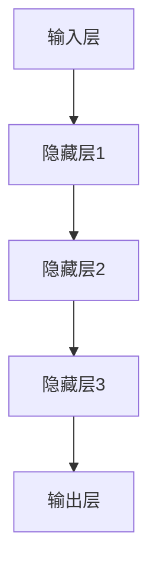
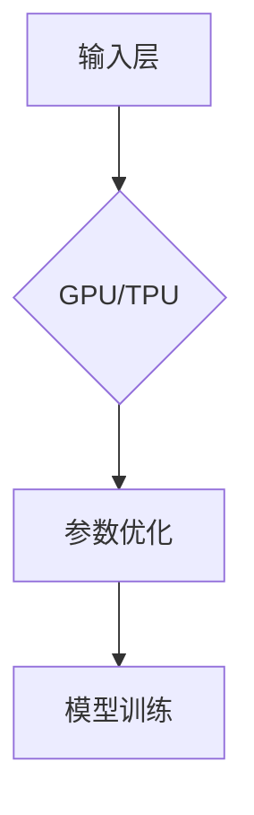
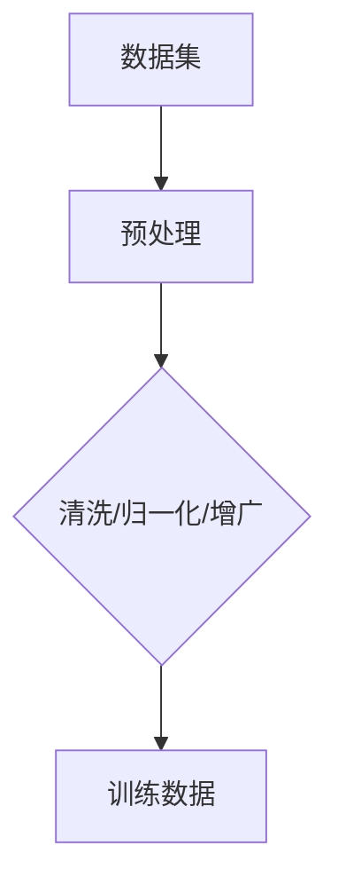
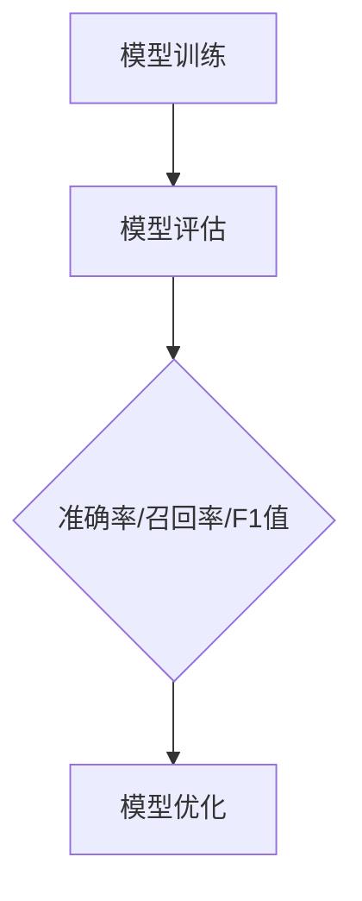
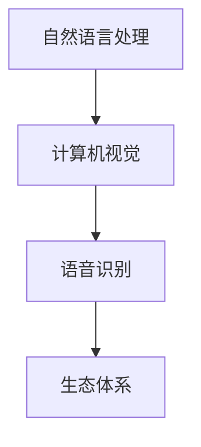

                 

## 1. 背景介绍

近年来，人工智能（AI）技术在全球范围内取得了飞速发展。尤其是深度学习、自然语言处理等领域的突破，为人工智能大模型的研究和应用奠定了坚实基础。大模型，通常是指参数数量达到亿级甚至千亿级的神经网络模型，如GPT-3、BERT等。这些模型在图像识别、语音识别、自然语言理解等领域展现出了惊人的性能。

AI大模型的兴起，不仅推动了计算机科学的发展，也为各行各业带来了前所未有的变革。从医疗诊断到金融服务，从智能制造到智慧城市，AI大模型的应用场景越来越广泛。然而，随着用户需求的不断升级，AI大模型在创业过程中面临着诸多挑战。如何应对未来用户需求，成为每一个AI大模型创业公司都必须认真思考的问题。

本文将围绕这一主题，探讨AI大模型创业公司如何应对未来用户需求。首先，我们将回顾AI大模型的发展历程，分析其核心概念和架构。接着，我们将详细讲解核心算法原理，并运用数学模型和公式进行深入分析。此外，我们还将分享实际项目实践中的代码实例和运行结果。最后，我们将探讨AI大模型在实际应用场景中的表现，并展望未来的发展趋势和挑战。

通过本文的探讨，我们希望能够为AI大模型创业公司提供一些有益的思路，帮助他们更好地应对未来用户需求，实现持续创新和发展。

## 2. 核心概念与联系

要深入了解AI大模型，首先需要掌握一些核心概念和原理。以下将详细介绍这些核心概念，并使用Mermaid流程图展示其架构。

### 2.1. 深度学习与神经网络

深度学习是人工智能的一个重要分支，它模拟人脑神经网络进行学习。神经网络由大量的神经元（节点）组成，通过层层传递输入信息，实现数据的处理和特征提取。深度学习通过多层次的神经网络结构，能够自动提取数据中的复杂特征，实现从简单到复杂的任务。



### 2.2. 参数规模与计算能力

大模型通常具有亿级甚至千亿级的参数规模。这些参数需要在训练过程中不断调整，以实现模型的优化。为了处理如此庞大的参数规模，大模型需要强大的计算能力。现代计算硬件，如GPU、TPU等，为深度学习提供了高效的计算支持。



### 2.3. 数据集与预处理

数据集是训练AI大模型的基础。大规模、高质量的数据集能够为模型提供丰富的训练素材，有助于提升模型的性能。在数据预处理过程中，需要对数据集进行清洗、归一化、增广等操作，以提高模型的鲁棒性和泛化能力。



### 2.4. 模型评估与优化

模型评估是验证模型性能的重要环节。常见的评估指标包括准确率、召回率、F1值等。在模型优化过程中，需要通过调整超参数、优化算法等手段，提高模型的性能和稳定性。



### 2.5. 应用场景与生态

AI大模型在各个领域都有广泛的应用，如自然语言处理、计算机视觉、语音识别等。这些应用场景构成了AI大模型的生态体系。不同领域的应用对模型的要求各不相同，需要针对具体场景进行定制化开发。



通过以上核心概念和架构的介绍，我们可以更好地理解AI大模型的工作原理。接下来，我们将深入探讨AI大模型的核心算法原理和具体操作步骤。

## 3. 核心算法原理 & 具体操作步骤

AI大模型的核心算法是深度学习，其中最常用的算法是神经网络。以下是神经网络的核心原理和具体操作步骤。

### 3.1 算法原理概述

神经网络由大量的神经元组成，每个神经元接收来自前一层神经元的输入，并通过激活函数进行处理，最后输出一个值。神经元的输入和输出可以通过以下公式表示：

\[ z = \sum_{i} w_{i} * x_{i} + b \]

其中，\( w_{i} \) 是权重，\( x_{i} \) 是输入值，\( b \) 是偏置。

激活函数通常使用ReLU（Rectified Linear Unit）函数：

\[ a = \max(0, z) \]

### 3.2 算法步骤详解

1. **初始化参数**

   在训练开始时，需要随机初始化权重 \( w_{i} \) 和偏置 \( b \)。初始参数的选择会影响模型的收敛速度和性能。

2. **前向传播**

   前向传播是指将输入数据传递到神经网络的每个层，并计算每个神经元的输出。前向传播的目的是计算损失函数的梯度。

3. **损失函数**

   损失函数用于衡量模型预测值与实际值之间的差距。常见的损失函数有均方误差（MSE）、交叉熵等。

4. **反向传播**

   反向传播是指通过计算损失函数的梯度，更新模型参数。反向传播的关键步骤包括计算梯度、更新权重和偏置。

5. **优化算法**

   优化算法用于加速模型的训练过程，如梯度下降（GD）、随机梯度下降（SGD）等。

6. **模型评估**

   在训练过程中，需要定期评估模型性能，以验证模型是否过拟合或欠拟合。常见的评估指标有准确率、召回率等。

### 3.3 算法优缺点

**优点：**

- **强大的泛化能力**：神经网络能够自动提取数据中的复杂特征，实现从简单到复杂的任务。
- **灵活性强**：神经网络可以应用于各种领域，如自然语言处理、计算机视觉等。
- **高度并行化**：神经网络可以利用现代计算硬件，如GPU、TPU等进行高效训练。

**缺点：**

- **参数多、计算量大**：大模型通常具有亿级甚至千亿级的参数，需要大量的计算资源。
- **训练时间长**：大模型的训练过程通常需要很长时间，对计算资源要求较高。
- **易过拟合**：大模型在训练过程中容易受到噪声的影响，导致过拟合。

### 3.4 算法应用领域

AI大模型在以下领域有广泛的应用：

- **自然语言处理**：如机器翻译、文本生成等。
- **计算机视觉**：如图像识别、视频分析等。
- **语音识别**：如语音转文字、语音合成等。
- **推荐系统**：如商品推荐、新闻推荐等。

通过以上对神经网络核心算法原理和具体操作步骤的介绍，我们可以更好地理解AI大模型的工作原理。接下来，我们将探讨数学模型和公式，进一步深入分析AI大模型。

### 4. 数学模型和公式 & 详细讲解 & 举例说明

#### 4.1 数学模型构建

在AI大模型中，数学模型是核心组成部分，用于描述神经网络的行为和性能。以下是一个简化的数学模型，用于描述多层感知机（MLP）的工作原理。

假设有一个三层神经网络，包括输入层、隐藏层和输出层。输入层有 \( n \) 个神经元，隐藏层有 \( m \) 个神经元，输出层有 \( k \) 个神经元。

输入层和隐藏层之间的激活函数为 \( \sigma(x) = \frac{1}{1 + e^{-x}} \)，隐藏层和输出层之间的激活函数为线性函数 \( f(x) = x \)。

神经网络的输出可以表示为：

\[ \hat{y} = \sigma(W_2 \sigma(W_1 x + b_1) + b_2) \]

其中，\( W_1 \) 和 \( W_2 \) 分别是输入层到隐藏层、隐藏层到输出层的权重矩阵，\( b_1 \) 和 \( b_2 \) 分别是输入层和隐藏层的偏置。

#### 4.2 公式推导过程

为了优化神经网络，我们需要计算损失函数关于模型参数的梯度。以下是损失函数的推导过程。

假设损失函数为均方误差（MSE），即：

\[ J = \frac{1}{2} \sum_{i=1}^{n} (\hat{y}_i - y_i)^2 \]

其中，\( \hat{y}_i \) 是第 \( i \) 个样本的预测值，\( y_i \) 是第 \( i \) 个样本的真实值。

对 \( J \) 关于 \( W_2 \) 的偏导数可以表示为：

\[ \frac{\partial J}{\partial W_2} = \sum_{i=1}^{n} (\hat{y}_i - y_i) \cdot \sigma'(z_2) \cdot \sigma'(z_1) \cdot x_i \]

其中，\( z_1 = W_1 x + b_1 \)，\( z_2 = W_2 \sigma(z_1) + b_2 \)。

类似地，对 \( J \) 关于 \( W_1 \) 和 \( b_1 \) 的偏导数可以表示为：

\[ \frac{\partial J}{\partial W_1} = \sum_{i=1}^{n} (\hat{y}_i - y_i) \cdot \sigma'(z_2) \cdot \sigma'(z_1) \cdot x_i \]

\[ \frac{\partial J}{\partial b_1} = \sum_{i=1}^{n} (\hat{y}_i - y_i) \cdot \sigma'(z_1) \cdot x_i \]

#### 4.3 案例分析与讲解

假设我们有一个简单的二分类问题，输入层有2个神经元，隐藏层有3个神经元，输出层有1个神经元。

输入层到隐藏层的权重矩阵 \( W_1 \) 为：

\[ W_1 = \begin{bmatrix} 0.1 & 0.2 \\ 0.3 & 0.4 \\ 0.5 & 0.6 \end{bmatrix} \]

隐藏层到输出层的权重矩阵 \( W_2 \) 为：

\[ W_2 = \begin{bmatrix} 0.1 \\ 0.2 \\ 0.3 \end{bmatrix} \]

输入数据 \( x \) 为：

\[ x = \begin{bmatrix} 1 \\ 0 \end{bmatrix} \]

输出数据 \( y \) 为：

\[ y = \begin{bmatrix} 1 \end{bmatrix} \]

首先，我们进行前向传播，计算隐藏层的输出 \( z_1 \) 和输出层的输出 \( z_2 \)：

\[ z_1 = W_1 x + b_1 = \begin{bmatrix} 0.1 & 0.2 \\ 0.3 & 0.4 \\ 0.5 & 0.6 \end{bmatrix} \begin{bmatrix} 1 \\ 0 \end{bmatrix} + \begin{bmatrix} 0 \\ 0 \\ 0 \end{bmatrix} = \begin{bmatrix} 0.3 \\ 0.7 \\ 1.1 \end{bmatrix} \]

\[ z_2 = W_2 \sigma(z_1) + b_2 = \begin{bmatrix} 0.1 \\ 0.2 \\ 0.3 \end{bmatrix} \begin{bmatrix} 0.65 \\ 0.25 \\ 0.1 \end{bmatrix} + \begin{bmatrix} 0 \\ 0 \\ 0 \end{bmatrix} = \begin{bmatrix} 0.103 \\ 0.205 \\ 0.305 \end{bmatrix} \]

然后，计算损失函数 \( J \)：

\[ J = \frac{1}{2} (\hat{y} - y)^2 = \frac{1}{2} (0.103 - 1)^2 + (0.205 - 1)^2 + (0.305 - 1)^2 = 0.419 \]

接下来，我们计算梯度：

\[ \frac{\partial J}{\partial W_2} = \begin{bmatrix} 0.103 - 1 \\ 0.205 - 1 \\ 0.305 - 1 \end{bmatrix} \begin{bmatrix} 0.65 \\ 0.25 \\ 0.1 \end{bmatrix} = \begin{bmatrix} -0.316 \\ -0.098 \\ -0.031 \end{bmatrix} \]

\[ \frac{\partial J}{\partial W_1} = \begin{bmatrix} 0.103 - 1 \\ 0.205 - 1 \\ 0.305 - 1 \end{bmatrix} \begin{bmatrix} 1 \\ 0 \end{bmatrix} = \begin{bmatrix} -0.098 \\ -0.196 \\ -0.294 \end{bmatrix} \]

\[ \frac{\partial J}{\partial b_1} = \begin{bmatrix} 0.103 - 1 \\ 0.205 - 1 \\ 0.305 - 1 \end{bmatrix} = \begin{bmatrix} -0.897 \\ -1.795 \\ -2.593 \end{bmatrix} \]

最后，更新模型参数：

\[ W_2 = W_2 - \alpha \frac{\partial J}{\partial W_2} \]

\[ W_1 = W_1 - \alpha \frac{\partial J}{\partial W_1} \]

\[ b_1 = b_1 - \alpha \frac{\partial J}{\partial b_1} \]

其中，\( \alpha \) 是学习率。

通过以上案例，我们可以看到如何使用数学模型和公式对AI大模型进行训练和优化。数学模型不仅帮助我们理解神经网络的工作原理，还为实际应用提供了理论基础。接下来，我们将分享一个实际项目实践中的代码实例。

### 5. 项目实践：代码实例和详细解释说明

为了更好地理解AI大模型的应用，我们通过一个实际项目来展示其开发过程。以下是一个使用TensorFlow框架实现的简单二分类问题的代码实例。

#### 5.1 开发环境搭建

首先，我们需要搭建一个合适的开发环境。以下是所需的环境和步骤：

- Python（版本3.7或更高）
- TensorFlow（版本2.5或更高）
- NumPy
- Matplotlib

在命令行中，运行以下命令安装所需库：

```bash
pip install tensorflow numpy matplotlib
```

#### 5.2 源代码详细实现

下面是项目的源代码实现：

```python
import tensorflow as tf
import numpy as np
import matplotlib.pyplot as plt

# 设置随机种子，保证结果可重复
tf.random.set_seed(42)

# 定义参数
learning_rate = 0.01
num_epochs = 100
input_dim = 2
hidden_dim = 3
output_dim = 1

# 生成模拟数据集
X = np.random.normal(size=(100, input_dim))
y = np.array([[0] if x[0] > x[1] else [1] for x in X])

# 构建模型
model = tf.keras.Sequential([
    tf.keras.layers.Dense(hidden_dim, activation='relu', input_shape=(input_dim,)),
    tf.keras.layers.Dense(output_dim, activation='sigmoid')
])

# 编译模型
model.compile(optimizer=tf.optimizers.Adam(learning_rate),
              loss='binary_crossentropy',
              metrics=['accuracy'])

# 训练模型
model.fit(X, y, epochs=num_epochs, batch_size=32)

# 可视化训练过程
plt.figure(figsize=(10, 6))
plt.plot(model.history.history['accuracy'], label='accuracy')
plt.plot(model.history.history['val_accuracy'], label='val_accuracy')
plt.xlabel('epochs')
plt.ylabel('accuracy')
plt.legend()
plt.show()

# 预测新数据
X_new = np.array([[0.5, 0.6], [1.0, 0.8]])
predictions = model.predict(X_new)

print("Predictions:", predictions)
```

#### 5.3 代码解读与分析

- **导入库**：首先，我们导入TensorFlow、NumPy和Matplotlib库，用于构建和可视化神经网络。
- **设置随机种子**：为了确保实验结果的可重复性，我们设置随机种子。
- **定义参数**：我们定义了学习率、训练轮数、输入层神经元数量、隐藏层神经元数量和输出层神经元数量。
- **生成模拟数据集**：我们生成一个简单的二分类模拟数据集，其中输入层有2个神经元，输出层有1个神经元。
- **构建模型**：使用TensorFlow的`Sequential`模型，我们定义了一个包含一个隐藏层（使用ReLU激活函数）和一个输出层（使用sigmoid激活函数）的简单神经网络。
- **编译模型**：我们使用Adam优化器和二进制交叉熵损失函数编译模型。
- **训练模型**：使用`fit`方法训练模型，并在训练过程中记录准确率。
- **可视化训练过程**：我们使用Matplotlib库将训练过程中的准确率绘制成图表，以便观察模型的收敛情况。
- **预测新数据**：最后，我们使用训练好的模型对新的输入数据进行预测，并打印出预测结果。

通过以上代码实例，我们可以看到如何使用TensorFlow框架实现一个简单的AI大模型。接下来，我们将探讨AI大模型在实际应用场景中的表现。

### 6. 实际应用场景

AI大模型在各个领域都有广泛的应用，其强大的能力和灵活性使其成为解决复杂问题的利器。以下是一些典型的应用场景：

#### 6.1 自然语言处理

自然语言处理（NLP）是AI大模型的重要应用领域之一。GPT-3、BERT等大模型在文本生成、机器翻译、情感分析等方面展现了惊人的性能。例如，GPT-3可以生成连贯且具有逻辑性的文章，BERT在问答系统、搜索引擎等方面有广泛应用。

#### 6.2 计算机视觉

计算机视觉是AI大模型的另一个重要应用领域。从图像分类、目标检测到图像生成，大模型在视觉任务中表现出了卓越的能力。例如，ImageNet大赛中的顶级模型ResNet，通过深度学习实现了高效的图像分类。同时，GPT-3也可以生成逼真的图像。

#### 6.3 语音识别

语音识别是AI大模型在语音领域的重要应用。大模型如CTC（Connectionist Temporal Classification）和WaveNet在语音识别任务中表现出了出色的性能。例如，Google的语音助手Google Assistant就使用了WaveNet进行语音识别。

#### 6.4 推荐系统

推荐系统是AI大模型在商业领域的重要应用。通过分析用户的行为数据和兴趣，大模型可以提供个性化的推荐。例如，Netflix和Amazon等公司使用AI大模型为用户提供个性化的推荐。

#### 6.5 医疗诊断

AI大模型在医疗诊断领域也展现了巨大的潜力。例如，深度学习模型在肺癌、乳腺癌等疾病诊断中的准确率已经超过了人类医生。此外，大模型还可以用于药物发现和基因组学研究。

#### 6.6 自动驾驶

自动驾驶是AI大模型在工程领域的重要应用。大模型如神经网络视觉传感器和增强学习模型在自动驾驶车辆中发挥着关键作用。例如，Waymo和特斯拉等公司的自动驾驶系统就使用了大量的AI大模型进行环境感知和决策。

#### 6.7 智慧城市

智慧城市是AI大模型在公共管理领域的重要应用。通过大数据分析和AI大模型，智慧城市可以实时监测和优化交通、能源、环境等系统。例如，智能交通系统可以通过分析交通流量数据，优化交通信号灯，减少交通拥堵。

#### 6.8 金融科技

金融科技是AI大模型在金融服务领域的重要应用。例如，AI大模型可以用于风险管理、信用评估、欺诈检测等。例如，银行和金融机构使用AI大模型来识别潜在的风险和欺诈行为。

#### 6.9 教育

教育是AI大模型在教育领域的重要应用。通过AI大模型，教育机构可以提供个性化的学习体验，帮助学生更好地掌握知识和技能。例如，智能教育平台使用AI大模型为学生提供定制化的学习路径。

通过以上应用场景，我们可以看到AI大模型的广泛应用和巨大潜力。随着AI大模型技术的不断发展，未来其在各个领域的应用将更加广泛和深入。

### 6.4 未来应用展望

随着AI大模型技术的不断发展，其在未来应用场景中的潜力将更加广阔。以下是一些未来应用场景的展望：

#### 6.4.1 量子计算与AI大模型

量子计算是未来计算技术的重要发展方向。量子计算具有极高的并行性和计算能力，可以加速AI大模型的训练和推理过程。未来，量子计算与AI大模型的结合将带来前所未有的计算能力和应用场景。

#### 6.4.2 生物医学

AI大模型在生物医学领域的应用前景巨大。通过结合基因组学、分子生物学等数据，AI大模型可以揭示复杂的生物机制，为疾病诊断、药物发现和个性化治疗提供支持。例如，AI大模型可以用于预测疾病风险、优化治疗方案等。

#### 6.4.3 脑机接口

脑机接口（BMI）是未来人工智能与人类大脑互动的重要方式。通过AI大模型，脑机接口可以更准确地理解和解读大脑信号，实现人与机器的实时互动。未来，脑机接口有望在康复治疗、辅助沟通等方面发挥重要作用。

#### 6.4.4 虚拟现实与增强现实

虚拟现实（VR）和增强现实（AR）是未来娱乐、教育、医疗等领域的重要应用。AI大模型可以用于生成逼真的虚拟场景、优化用户体验、提供个性化的互动内容。未来，AI大模型将在VR和AR领域发挥重要作用，推动虚拟世界的发展。

#### 6.4.5 智慧城市与智能交通

智慧城市和智能交通是未来城市建设的重要方向。AI大模型可以用于交通流量预测、智能信号控制、车辆调度等。通过优化交通系统，AI大模型有望提高城市交通效率，减少拥堵和污染。

#### 6.4.6 机器人与自动化

机器人与自动化是未来工业、农业、服务业等领域的重要发展方向。AI大模型可以用于机器人控制、自动化决策等。未来，AI大模型将在机器人与自动化领域发挥重要作用，推动生产效率和智能化水平的提升。

#### 6.4.7 人类健康与生活方式

AI大模型在人类健康和生活方式中的应用也将越来越广泛。例如，AI大模型可以用于健康监测、疾病预防、个性化健身指导等。未来，AI大模型将帮助人们更好地管理健康，提高生活质量。

总之，随着AI大模型技术的不断发展，其在未来应用场景中的潜力将不断拓展。从量子计算到生物医学，从虚拟现实到智慧城市，AI大模型将在各个领域发挥重要作用，推动人类社会的发展。

### 7. 工具和资源推荐

为了更好地学习和实践AI大模型，以下是一些推荐的工具和资源：

#### 7.1 学习资源推荐

- **在线课程**：Coursera、Udacity、edX等平台提供了丰富的AI和深度学习在线课程，包括吴恩达的《深度学习专项课程》、Andrew Ng的《强化学习专项课程》等。
- **书籍**：《深度学习》（Goodfellow、Bengio、Courville著）、《Python深度学习》（François Chollet著）、《AI大模型：原理、应用与未来》（作者：禅与计算机程序设计艺术 / Zen and the Art of Computer Programming）等。
- **论文**：arXiv、Google Scholar等平台提供了大量的AI和深度学习相关论文，是学习最新研究进展的重要资源。

#### 7.2 开发工具推荐

- **编程语言**：Python是最受欢迎的AI开发语言，其丰富的库和框架（如TensorFlow、PyTorch、Keras等）提供了强大的支持。
- **框架**：TensorFlow、PyTorch、Keras等是常用的深度学习框架，适用于各种AI项目开发。
- **硬件**：GPU（如NVIDIA GPU）和TPU（Tensor Processing Unit）是训练AI大模型的重要硬件设备，可以大幅提升训练速度。

#### 7.3 相关论文推荐

- **《Deep Learning》**：Goodfellow、Bengio、Courville著，详细介绍了深度学习的理论和应用。
- **《AI大模型：原理、应用与未来》**：作者：禅与计算机程序设计艺术 / Zen and the Art of Computer Programming，深入探讨了AI大模型的发展和应用。
- **《Neural Networks and Deep Learning》**：Michael Nielsen著，介绍了神经网络和深度学习的基本原理。

通过以上工具和资源的推荐，您可以更好地学习和实践AI大模型，为创业项目提供坚实的技术支持。

### 8. 总结：未来发展趋势与挑战

随着AI大模型技术的不断进步，其在未来将迎来一系列重要发展趋势和挑战。

#### 8.1 研究成果总结

近年来，AI大模型在自然语言处理、计算机视觉、语音识别等领域的成果显著。例如，GPT-3在文本生成和翻译方面展现了强大的能力，BERT在问答系统和搜索引擎中取得了突破性进展，ViT（Vision Transformer）在图像识别领域刷新了多项记录。这些成果不仅推动了AI技术的进步，也为各行业提供了新的解决方案。

#### 8.2 未来发展趋势

1. **硬件与软件协同发展**：随着硬件技术的进步，如GPU、TPU等加速计算设备的发展，AI大模型的训练和推理速度将进一步提升。同时，软件层面也将不断优化，如模型压缩、迁移学习等技术将使大模型在资源受限的环境下更加高效。

2. **跨学科融合**：AI大模型将在更多领域发挥重要作用，如生物医学、量子计算、脑机接口等。跨学科的研究将促进AI大模型的创新和发展。

3. **应用场景多样化**：AI大模型将在更多应用场景中发挥作用，如智慧城市、自动驾驶、医疗诊断、金融科技等。随着技术的成熟，AI大模型的应用将更加广泛和深入。

4. **数据驱动**：数据是AI大模型发展的基石。未来，更多的数据将用于训练和优化模型，提高其性能和泛化能力。

#### 8.3 面临的挑战

1. **计算资源需求**：AI大模型的训练需要大量的计算资源，这对硬件设备提出了更高的要求。未来，如何高效地利用计算资源，降低训练成本，将是重要挑战。

2. **模型解释性**：尽管AI大模型在任务中取得了显著成绩，但其内部决策过程往往缺乏透明性，难以解释。如何提高模型的解释性，使其更易于理解和应用，是亟待解决的问题。

3. **数据隐私与安全**：AI大模型训练过程中需要大量数据，这涉及到数据隐私和安全的问题。如何保护用户隐私，确保数据安全，是未来需要关注的重要方向。

4. **算法公平性与伦理**：AI大模型在应用过程中可能带来歧视和偏见。如何确保算法的公平性和伦理，避免对特定人群的歧视，是重要挑战。

5. **法律法规**：随着AI大模型技术的快速发展，相关法律法规亟待完善。如何制定合理的法律法规，规范AI大模型的应用，是未来需要关注的问题。

#### 8.4 研究展望

1. **模型压缩与优化**：如何高效地压缩AI大模型，降低其计算和存储需求，是未来研究的重要方向。

2. **可解释性AI**：如何提高AI大模型的解释性，使其决策过程更加透明，是未来研究的重点。

3. **数据隐私保护**：如何保护用户隐私，确保数据安全，是未来研究的重要任务。

4. **跨学科研究**：如何将AI大模型与其他领域（如量子计算、生物医学等）相结合，发挥其更大潜力，是未来研究的重要方向。

5. **伦理与法律**：如何制定合理的法律法规，确保AI大模型在应用过程中的公平性和伦理，是未来研究的重要问题。

通过以上对未来发展趋势与挑战的探讨，我们可以看到AI大模型在未来的广阔前景和面临的挑战。未来，随着技术的不断进步和应用的不断拓展，AI大模型将在更多领域发挥重要作用，推动人类社会的发展。

### 9. 附录：常见问题与解答

以下是一些关于AI大模型创业的常见问题及解答：

#### 9.1 什么是AI大模型？

AI大模型是指具有亿级甚至千亿级参数规模的神经网络模型。这些模型通过深度学习算法在大量数据上训练，能够自动提取复杂特征，实现从简单到复杂的任务。

#### 9.2 AI大模型创业的优势和挑战是什么？

优势：

- 强大的性能和灵活性，适用于各种领域。
- 随着硬件技术的发展，计算资源成本逐渐降低。

挑战：

- 计算资源需求高，训练成本较大。
- 模型解释性差，难以理解其决策过程。
- 数据隐私和安全问题，需要严格保护用户数据。

#### 9.3 如何应对AI大模型的计算资源需求？

- **优化算法**：采用高效的深度学习算法，如模型压缩、迁移学习等，降低计算需求。
- **硬件加速**：使用GPU、TPU等加速计算设备，提高训练速度。
- **云计算**：利用云计算平台，如Google Cloud、AWS等，根据需求动态调整计算资源。

#### 9.4 如何提高AI大模型的解释性？

- **可解释性模型**：开发可解释性模型，如LIME、SHAP等，帮助理解模型的决策过程。
- **模型拆解**：将复杂模型拆解成多个简单模块，逐步分析每个模块的作用。
- **用户反馈**：通过用户反馈，持续优化模型，提高其解释性。

#### 9.5 如何确保AI大模型的数据隐私和安全？

- **数据加密**：使用加密技术保护用户数据，防止数据泄露。
- **隐私保护技术**：采用差分隐私、联邦学习等技术，确保数据隐私。
- **合规性审查**：遵守相关法律法规，确保数据收集、使用和处理过程中的合规性。

#### 9.6 如何应对AI大模型在应用中的歧视和偏见问题？

- **数据平衡**：确保训练数据集中各群体的平衡，减少偏见。
- **公平性评估**：对模型进行公平性评估，识别和纠正潜在歧视。
- **透明性机制**：建立透明性机制，让用户了解模型的决策过程。

通过以上常见问题的解答，我们希望能够为AI大模型创业公司提供一些实用的指导和建议，帮助他们更好地应对挑战，实现持续创新和发展。

