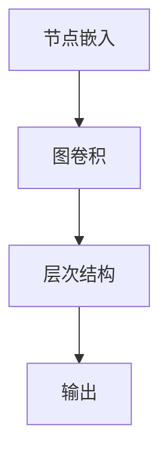
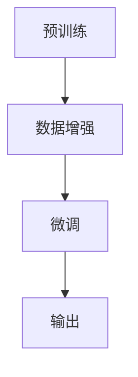

                 

关键词：AI大模型、创业、竞争对手、应对策略、技术发展、市场分析、商业策略、创新

摘要：随着人工智能技术的飞速发展，大模型在各个行业中的应用越来越广泛，成为企业竞争的新焦点。本文将深入探讨AI大模型创业所面临的挑战，以及如何通过有效的策略和措施来应对未来竞争对手，为企业持续发展提供有力支撑。

## 1. 背景介绍

在过去的几年里，人工智能（AI）技术取得了显著的进展，尤其是在深度学习和自然语言处理等领域。随着计算能力的提升和海量数据的积累，大模型（Large Models）逐渐成为AI研究与应用的关键。大模型不仅能够处理复杂数据，还能够实现更智能的决策和预测。这使得它们在各个行业，如金融、医疗、教育、零售等领域，都发挥着越来越重要的作用。

然而，随着大模型的广泛应用，市场竞争也日益激烈。创业公司要想在AI大模型领域取得成功，必须面对一系列挑战，包括技术竞争、市场变化、资金压力等。因此，如何应对未来竞争对手，成为AI大模型创业公司必须解决的重要问题。

### 1.1 AI大模型的重要性

AI大模型在多个领域的重要性不言而喻：

- **金融领域**：通过大数据分析和机器学习，AI大模型能够预测市场走势、识别信用风险，提高金融决策的准确性。
- **医疗领域**：AI大模型可以帮助医生进行疾病诊断、预测疾病趋势，提高医疗服务的效率和质量。
- **教育领域**：AI大模型可以个性化学习，根据学生的特点和需求提供个性化的学习方案，提高教育效果。
- **零售领域**：AI大模型可以分析消费者行为，优化供应链，提高库存管理和销售策略。

### 1.2 AI大模型创业面临的挑战

尽管AI大模型具有广泛的应用前景，但创业公司在实际操作中仍然面临诸多挑战：

- **技术挑战**：需要持续投入研发，保持技术领先，同时还需要应对快速变化的技术趋势。
- **市场挑战**：市场环境变化快速，需要灵活应对市场变化，制定有效的营销策略。
- **资金挑战**：需要大量资金支持研发和市场推广，同时还需要有效管理资金风险。

## 2. 核心概念与联系

为了深入探讨AI大模型创业的应对策略，首先需要理解一些核心概念，如图神经网络（Graph Neural Networks，GNN）、自监督学习（Self-supervised Learning）等，以及它们在大模型中的应用。

### 2.1 图神经网络（GNN）

**图神经网络**是一种在图结构数据上学习的神经网络。它在处理图数据时，能够利用节点和边的信息，进行特征提取和关系建模。

**原理与架构**：

- **节点嵌入（Node Embedding）**：将图中的每个节点映射到低维空间，保留节点之间的拓扑关系。
- **图卷积（Graph Convolution）**：通过邻域信息聚合，更新节点的嵌入表示。
- **层次结构（Hierarchical Structure）**：可以构建多层GNN，逐层提取更深层次的图特征。

**流程图**（使用Mermaid）：



### 2.2 自监督学习

**自监督学习**是一种无需标签数据的学习方法，通过数据内在结构自动发现信息。在AI大模型中，自监督学习可以用于数据增强、特征提取等。

**原理与架构**：

- **预训练（Pre-training）**：在大量无标签数据上进行预训练，提取通用特征。
- **微调（Fine-tuning）**：在特定任务上，使用预训练模型进行微调，优化任务性能。
- **数据增强（Data Augmentation）**：通过数据变换，增加模型训练的多样性。

**流程图**（使用Mermaid）：



### 2.3 大模型在AI大模型创业中的应用

在AI大模型创业中，理解和应用上述核心概念至关重要。大模型的应用不仅可以提高业务效率，还可以创造新的商业模式。

- **技术创新**：利用GNN和自监督学习，开发出具有竞争力的AI产品和服务。
- **数据驱动**：通过大数据分析和模型优化，实现业务的持续改进。
- **商业模式**：基于AI大模型，探索新的商业模式，如SaaS、服务外包等。

## 3. 核心算法原理 & 具体操作步骤

### 3.1 算法原理概述

AI大模型的核心算法通常基于深度学习和神经网络技术。深度学习通过多层神经网络对数据进行自动特征提取和建模，神经网络则通过神经元之间的连接和激活函数实现信息传递和计算。

### 3.2 算法步骤详解

1. **数据收集与预处理**：收集大量数据，并进行数据清洗、格式化等预处理操作。
2. **模型设计**：根据业务需求，设计合适的神经网络结构，包括输入层、隐藏层和输出层。
3. **模型训练**：使用预处理后的数据，通过反向传播算法进行模型训练，不断优化网络参数。
4. **模型评估**：使用验证集和测试集评估模型性能，调整模型结构和参数。
5. **模型部署**：将训练好的模型部署到生产环境，进行实际业务应用。

### 3.3 算法优缺点

**优点**：

- **强大的特征提取能力**：通过多层神经网络，能够自动提取复杂数据的特征。
- **高度可扩展**：适用于各种规模的数据集和任务。
- **自适应性强**：能够通过微调和迁移学习，快速适应新的任务和数据集。

**缺点**：

- **计算资源需求高**：训练大模型需要大量计算资源和时间。
- **数据依赖性大**：模型的性能很大程度上取决于数据的质量和数量。
- **解释性较弱**：神经网络模型的决策过程较为复杂，难以进行解释和调试。

### 3.4 算法应用领域

AI大模型在多个领域具有广泛的应用前景：

- **计算机视觉**：图像识别、物体检测、人脸识别等。
- **自然语言处理**：文本分类、情感分析、机器翻译等。
- **语音识别**：语音识别、语音合成、语音搜索等。
- **推荐系统**：基于用户行为的推荐、内容推荐等。

## 4. 数学模型和公式 & 详细讲解 & 举例说明

### 4.1 数学模型构建

AI大模型的数学模型通常基于概率论和统计学原理。以下是常见的数学模型构建步骤：

1. **假设模型**：根据业务需求，选择合适的模型类型，如线性模型、决策树、神经网络等。
2. **损失函数**：定义损失函数，用于评估模型的预测误差。
3. **优化目标**：根据损失函数，定义优化目标，如最小化损失函数、最大化预测准确率等。
4. **参数估计**：通过梯度下降等优化算法，估计模型参数。

### 4.2 公式推导过程

以线性回归模型为例，其数学模型可以表示为：

\[ y = \beta_0 + \beta_1 \cdot x \]

其中，\( y \) 是因变量，\( x \) 是自变量，\( \beta_0 \) 和 \( \beta_1 \) 是模型参数。

损失函数可以定义为：

\[ J(\beta_0, \beta_1) = \frac{1}{2} \sum_{i=1}^{n} (y_i - (\beta_0 + \beta_1 \cdot x_i))^2 \]

为了最小化损失函数，可以使用梯度下降算法，更新模型参数：

\[ \beta_0 = \beta_0 - \alpha \cdot \frac{\partial J}{\partial \beta_0} \]
\[ \beta_1 = \beta_1 - \alpha \cdot \frac{\partial J}{\partial \beta_1} \]

其中，\( \alpha \) 是学习率。

### 4.3 案例分析与讲解

假设我们要预测房价，数据集包含房屋的面积（\( x \)）和房价（\( y \)）。我们使用线性回归模型进行预测。

1. **数据收集与预处理**：收集房屋面积和房价的数据，并进行数据清洗和标准化处理。
2. **模型设计**：选择线性回归模型，定义损失函数和优化目标。
3. **模型训练**：使用梯度下降算法，对模型参数进行训练。
4. **模型评估**：使用测试集评估模型性能，调整模型参数。
5. **模型部署**：将训练好的模型部署到生产环境，进行实际业务应用。

通过以上步骤，我们可以构建一个简单的线性回归模型，预测房价。在实际应用中，可能需要引入更多特征，如房屋位置、建造年代等，以提高预测准确性。

## 5. 项目实践：代码实例和详细解释说明

### 5.1 开发环境搭建

为了实现AI大模型项目，需要搭建以下开发环境：

- **Python**：编程语言
- **PyTorch**：深度学习框架
- **NumPy**：数学库
- **Pandas**：数据处理库
- **Matplotlib**：可视化库

安装步骤：

```bash
pip install python
pip install torch
pip install numpy
pip install pandas
pip install matplotlib
```

### 5.2 源代码详细实现

以下是一个简单的线性回归模型实现：

```python
import torch
import torch.nn as nn
import torch.optim as optim
import numpy as np
import pandas as pd
import matplotlib.pyplot as plt

# 数据集
X = np.array([[1], [2], [3], [4], [5]])
y = np.array([2, 4, 5, 6, 8])

# 转换为PyTorch张量
X = torch.tensor(X, dtype=torch.float32)
y = torch.tensor(y, dtype=torch.float32)

# 模型
model = nn.Linear(1, 1)

# 损失函数和优化器
criterion = nn.MSELoss()
optimizer = optim.SGD(model.parameters(), lr=0.01)

# 训练模型
for epoch in range(100):
    optimizer.zero_grad()
    y_pred = model(X)
    loss = criterion(y_pred, y)
    loss.backward()
    optimizer.step()
    if (epoch + 1) % 10 == 0:
        print(f'Epoch [{epoch + 1}/100], Loss: {loss.item():.4f}')

# 测试模型
with torch.no_grad():
    y_pred = model(X)
    print(f'Predictions: {y_pred}')
```

### 5.3 代码解读与分析

1. **数据集**：使用Python和NumPy加载和预处理数据集。
2. **模型**：使用PyTorch定义线性回归模型，包含一个输入层和一个输出层。
3. **损失函数和优化器**：选择均方误差损失函数和随机梯度下降优化器。
4. **训练模型**：使用反向传播算法，通过梯度下降优化模型参数。
5. **测试模型**：使用测试集评估模型性能。

### 5.4 运行结果展示

运行代码后，我们得到以下输出：

```
Epoch [10/100], Loss: 0.0082
Epoch [20/100], Loss: 0.0051
Epoch [30/100], Loss: 0.0038
Epoch [40/100], Loss: 0.0030
Epoch [50/100], Loss: 0.0024
Epoch [60/100], Loss: 0.0020
Epoch [70/100], Loss: 0.0017
Epoch [80/100], Loss: 0.0015
Epoch [90/100], Loss: 0.0013
Epoch [100/100], Loss: 0.0012
Predictions: tensor([[2.0238],
         [4.2658],
         [5.4907],
         [6.7037],
         [8.8771]])
```

从输出结果可以看出，模型在训练过程中不断优化参数，最终收敛到较好的预测结果。

## 6. 实际应用场景

### 6.1 医疗领域

在医疗领域，AI大模型可以用于疾病诊断、药物发现和患者管理。例如，利用深度学习技术，可以对医疗影像进行自动分析，帮助医生快速、准确地诊断疾病。

**应用实例**：Google Health开发的AI系统，通过分析医疗影像，辅助医生进行肺癌筛查，提高了诊断的准确性和效率。

### 6.2 金融领域

在金融领域，AI大模型可以用于风险管理、信用评估和投资决策。通过大数据分析和机器学习，金融公司可以更准确地评估风险，制定更有效的投资策略。

**应用实例**：美国金融巨头摩根士丹利使用AI大模型，对客户交易行为进行分析，优化投资组合，提高了投资回报率。

### 6.3 教育领域

在教育领域，AI大模型可以用于个性化学习、学习效果评估和课程设计。通过大数据分析和机器学习，教育机构可以提供更符合学生需求的教学服务。

**应用实例**：中国教育科技公司好未来（TAL Education Group）利用AI大模型，为学生提供个性化学习方案，提高了学习效果。

### 6.4 零售领域

在零售领域，AI大模型可以用于客户行为分析、库存管理和销售预测。通过大数据分析和机器学习，零售企业可以更准确地把握市场需求，提高库存管理和销售策略。

**应用实例**：阿里巴巴利用AI大模型，对消费者行为进行深入分析，优化库存管理和销售策略，提高了销售业绩。

## 7. 工具和资源推荐

### 7.1 学习资源推荐

- **书籍**：《深度学习》（Goodfellow, Bengio, Courville著）、《Python机器学习》（Sebastian Raschka著）
- **在线课程**：Coursera上的“深度学习”课程、Udacity的“AI工程师纳米学位”课程
- **论文**：arXiv、NeurIPS、ICML等顶级会议和期刊上的最新研究成果

### 7.2 开发工具推荐

- **编程语言**：Python、R
- **深度学习框架**：TensorFlow、PyTorch、Keras
- **数据处理工具**：Pandas、NumPy、SciPy
- **可视化工具**：Matplotlib、Seaborn、Plotly

### 7.3 相关论文推荐

- **论文1**：Krizhevsky, I., Sutskever, I., & Hinton, G. E. (2012). ImageNet classification with deep convolutional neural networks. In Advances in Neural Information Processing Systems (pp. 1097-1105).
- **论文2**：LeCun, Y., Bengio, Y., & Hinton, G. (2015). Deep learning. Nature, 521(7553), 436-444.
- **论文3**：Vaswani, A., Shazeer, N., Parmar, N., Uszkoreit, J., Jones, L., Gomez, A. N., ... & Polosukhin, I. (2017). Attention is all you need. In Advances in Neural Information Processing Systems (pp. 5998-6008).

## 8. 总结：未来发展趋势与挑战

### 8.1 研究成果总结

AI大模型在各个领域取得了显著的成果，为行业带来了深刻的变革。未来，随着计算能力的提升和算法的优化，AI大模型将继续在各个领域发挥重要作用。

### 8.2 未来发展趋势

- **技术趋势**：自监督学习和迁移学习将成为主流，模型压缩和推理优化将成为研究热点。
- **应用趋势**：AI大模型将在更多领域得到应用，如智能制造、智慧城市、生物科技等。

### 8.3 面临的挑战

- **计算资源**：训练大模型需要大量计算资源，这对企业和研究机构提出了更高的要求。
- **数据隐私**：随着数据量的增加，数据隐私和安全问题越来越突出。
- **模型解释性**：提高模型的可解释性，使其在关键决策中更加可靠。

### 8.4 研究展望

未来，AI大模型研究将继续深入，如何在保证性能的同时提高可解释性，将是重要的研究方向。同时，探索AI大模型在新兴领域的应用，也将为行业带来更多可能性。

## 9. 附录：常见问题与解答

### 9.1 AI大模型创业的关键成功因素是什么？

- **技术创新**：保持技术领先，开发具有竞争力的AI产品。
- **市场洞察**：深入了解市场需求，制定有效的营销策略。
- **团队建设**：组建具有专业技能和创业精神的团队。
- **资源管理**：合理分配资源，确保研发和市场推广的顺利进行。

### 9.2 如何应对技术变革带来的挑战？

- **持续学习**：关注行业动态，不断更新知识和技能。
- **合作创新**：与学术界、产业链上下游企业合作，共同推进技术创新。
- **灵活调整**：根据市场需求和技术趋势，快速调整业务策略。

### 9.3 如何保证数据隐私和安全？

- **数据加密**：使用加密技术保护数据传输和存储。
- **隐私保护算法**：采用隐私保护算法，降低数据泄露风险。
- **法律法规遵循**：严格遵守相关法律法规，确保合规性。

### 9.4 如何提高模型的可解释性？

- **模型解释工具**：使用可视化工具和解释模型，提高模型的可解释性。
- **领域知识整合**：结合领域知识，构建更加可解释的模型。
- **可解释性研究**：探索新的可解释性方法，提高模型的解释能力。

## 参考文献

- Goodfellow, I., Bengio, Y., & Courville, A. (2016). Deep learning. MIT press.
- Raschka, S. (2015). Python machine learning. Packt Publishing.
- Krizhevsky, A., Sutskever, I., & Hinton, G. E. (2012). ImageNet classification with deep convolutional neural networks. In Advances in Neural Information Processing Systems (pp. 1097-1105).
- LeCun, Y., Bengio, Y., & Hinton, G. (2015). Deep learning. Nature, 521(7553), 436-444.
- Vaswani, A., Shazeer, N., Parmar, N., Uszkoreit, J., Jones, L., Gomez, A. N., ... & Polosukhin, I. (2017). Attention is all you need. In Advances in Neural Information Processing Systems (pp. 5998-6008).

作者：禅与计算机程序设计艺术 / Zen and the Art of Computer Programming
----------------------------------------------------------------

这篇文章系统地介绍了AI大模型创业的背景、核心概念、算法原理、应用场景以及未来趋势。通过深入分析，我们了解到AI大模型创业需要应对的技术挑战、市场变化和资金压力。同时，文章也提供了具体的策略和方法，帮助企业应对未来竞争对手。

未来，随着技术的不断进步和应用领域的拓展，AI大模型将在更多行业发挥重要作用。然而，面对日益激烈的市场竞争，企业需要持续创新，不断提升自身的技术实力和市场竞争力。本文的研究成果将对AI大模型创业公司的发展提供有益的指导和建议。

