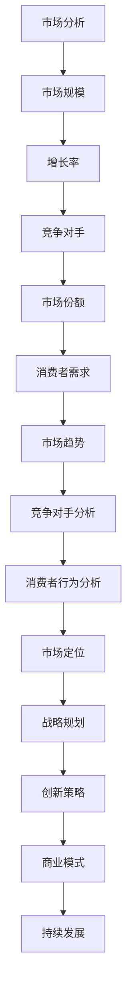
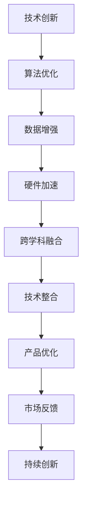
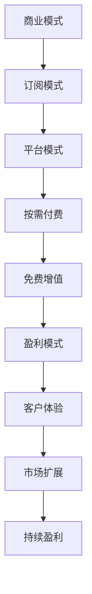
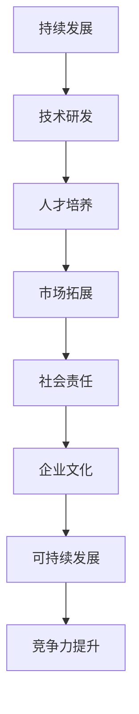

                 

关键词：AI大模型、创业、竞争对手、策略、技术创新、市场分析、商业模式、持续发展。

> 摘要：本文将探讨AI大模型创业企业在面对未来激烈市场竞争时，应如何制定有效的战略，利用技术创新和商业模式创新来巩固和提升自身的竞争力。通过对市场环境的深入分析，结合实际案例，本文提出了具体的应对策略，旨在为AI大模型创业企业提供有益的参考。

## 1. 背景介绍

近年来，人工智能（AI）技术的迅猛发展，尤其是大模型技术的突破，为各行各业带来了深刻的变革。从自然语言处理到计算机视觉，从推荐系统到自动驾驶，AI大模型的应用已经渗透到我们生活的方方面面。随着技术的成熟和应用的广泛，越来越多的创业企业投身于AI大模型领域，希望在这一新兴市场中占据一席之地。

然而，市场竞争日益激烈，未来竞争对手层出不穷。如何应对这些挑战，成为AI大模型创业企业必须面对的问题。本文将从以下几个方面进行探讨：

- **市场环境分析**：了解当前市场状况，分析行业趋势和竞争对手。
- **技术创新策略**：通过技术创新提升企业的核心竞争力。
- **商业模式创新**：利用创新的商业模式来创造额外的竞争优势。
- **持续发展**：探讨企业在长期发展过程中如何保持竞争力。

## 2. 核心概念与联系

### 2.1 市场环境分析

市场环境分析是制定竞争战略的第一步。它包括对市场规模、增长率、主要竞争对手、市场份额、消费者需求等方面的研究。

#### Mermaid 流程图

### 2.2 技术创新策略

技术创新是提高企业核心竞争力的关键。AI大模型创业企业可以通过以下几个方面进行技术创新：

- **算法优化**：通过改进算法，提高模型的准确性和效率。
- **数据增强**：利用更多的数据来训练模型，提高模型的泛化能力。
- **硬件加速**：使用高性能硬件来加速模型训练和推理。
- **跨学科融合**：将AI技术与其他领域（如生物学、物理学等）相结合，创造新的应用场景。

#### Mermaid 流程图

### 2.3 商业模式创新

商业模式创新是创造额外竞争优势的重要手段。AI大模型创业企业可以通过以下几个方面进行商业模式创新：

- **订阅模式**：提供按需订阅的服务，降低客户的初始投资。
- **平台模式**：构建一个开放的生态系统，吸引第三方开发者和服务提供商。
- **按需付费**：根据客户的实际使用情况收费，提高客户满意度。
- **免费增值**：提供免费的基础服务，通过增值服务来盈利。

#### Mermaid 流程图

### 2.4 持续发展

持续发展是企业在长期竞争中保持竞争力的关键。AI大模型创业企业可以通过以下几个方面来实现持续发展：

- **技术研发**：持续投资于技术研发，保持技术领先。
- **人才培养**：重视人才培养，建立强大的技术团队。
- **市场拓展**：不断开拓新的市场，扩大业务范围。
- **社会责任**：承担社会责任，提升企业形象。

#### Mermaid 流程图

## 3. 核心算法原理 & 具体操作步骤

### 3.1 算法原理概述

AI大模型的核心是深度学习算法。深度学习通过多层神经网络对大量数据进行学习，从而实现复杂模式的识别和预测。以下是一些常见的深度学习算法：

- **卷积神经网络（CNN）**：适用于图像处理。
- **循环神经网络（RNN）**：适用于序列数据处理。
- **Transformer模型**：适用于自然语言处理。

### 3.2 算法步骤详解

#### 卷积神经网络（CNN）

1. **数据预处理**：对图像数据进行归一化处理。
2. **卷积操作**：通过卷积层提取图像特征。
3. **池化操作**：对卷积结果进行池化处理，减小数据维度。
4. **全连接层**：将池化结果输入全连接层进行分类。

#### 循环神经网络（RNN）

1. **数据预处理**：对序列数据进行编码。
2. **输入层**：将编码后的数据输入RNN。
3. **隐藏层**：通过RNN对序列数据进行学习。
4. **输出层**：将隐藏层输出进行解码，得到预测结果。

#### Transformer模型

1. **编码器**：对输入文本进行编码，生成序列表示。
2. **注意力机制**：通过注意力机制关注序列中的重要信息。
3. **解码器**：根据编码器的输出生成预测结果。

### 3.3 算法优缺点

#### 卷积神经网络（CNN）

**优点**：能够高效地处理图像数据，提取丰富的图像特征。

**缺点**：在处理序列数据时表现较差，不适合文本等非图像数据。

#### 循环神经网络（RNN）

**优点**：能够处理序列数据，适用于自然语言处理等任务。

**缺点**：训练过程容易出现梯度消失或爆炸问题，难以处理长序列。

#### Transformer模型

**优点**：能够高效地处理长序列数据，性能优异。

**缺点**：结构复杂，计算量大，对硬件要求较高。

### 3.4 算法应用领域

- **图像识别**：应用于物体检测、人脸识别等领域。
- **自然语言处理**：应用于文本分类、机器翻译、问答系统等领域。
- **序列数据处理**：应用于时间序列分析、股票预测等领域。

## 4. 数学模型和公式 & 详细讲解 & 举例说明

### 4.1 数学模型构建

在深度学习算法中，数学模型是核心。以下以卷积神经网络（CNN）为例，介绍其数学模型的构建。

#### 卷积神经网络（CNN）

1. **输入层**：假设输入数据为 $X \in \mathbb{R}^{m \times n}$，其中 $m$ 为样本数量，$n$ 为特征维度。

2. **卷积层**：假设卷积核大小为 $k \times k$，步长为 $s$，则有：

   $$ 
   h(x) = \text{Conv}(X, W) + b 
   $$
   
   其中，$h(x)$ 为卷积结果，$W$ 为卷积核权重，$b$ 为偏置。

3. **池化层**：假设池化窗口大小为 $p \times p$，则有：

   $$ 
   p(h(x)) = \max(h(x)) 
   $$
   
   其中，$p(h(x))$ 为池化结果。

4. **全连接层**：假设全连接层输入为 $h(x)$，则有：

   $$ 
   y = \text{ReLU}(W^T h(x) + b') 
   $$
   
   其中，$y$ 为输出结果，$W^T$ 为全连接层权重，$b'$ 为偏置。

### 4.2 公式推导过程

#### 卷积层

卷积操作的数学表达式为：

$$ 
h(x)_{ij} = \sum_{k=1}^{k=n} \sum_{l=1}^{l=n} W_{kl} X_{kl} + b 
$$

其中，$h(x)_{ij}$ 为卷积结果在 $(i, j)$ 位置上的值，$W_{kl}$ 为卷积核在 $(k, l)$ 位置上的值，$X_{kl}$ 为输入数据在 $(k, l)$ 位置上的值，$b$ 为偏置。

#### 池化层

池化操作的数学表达式为：

$$ 
p(h(x))_{ij} = \max(h(x)_{i-\frac{p}{2}, i+\frac{p}{2}}, \ldots, h(x)_{j-\frac{p}{2}, j+\frac{p}{2}}) 
$$

其中，$p(h(x))_{ij}$ 为池化结果在 $(i, j)$ 位置上的值。

#### 全连接层

全连接层的数学表达式为：

$$ 
y_{i} = \sum_{j=1}^{j=n} W_{ij} h(x)_{j} + b' 
$$

其中，$y_{i}$ 为输出结果在 $i$ 位置上的值，$W_{ij}$ 为全连接层权重在 $(i, j)$ 位置上的值，$h(x)_{j}$ 为卷积层输出在 $j$ 位置上的值，$b'$ 为偏置。

### 4.3 案例分析与讲解

#### 案例背景

假设有一个手写数字识别任务，输入图像大小为 $28 \times 28$，我们需要使用卷积神经网络来识别图像中的数字。

#### 案例步骤

1. **数据预处理**：将输入图像数据进行归一化处理，使其在 $[0, 1]$ 范围内。

2. **卷积层**：使用一个大小为 $5 \times 5$ 的卷积核进行卷积操作，步长为 $1$，偏置为 $0$。得到一个 $24 \times 24$ 的大

