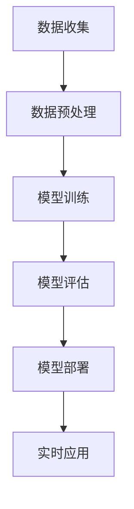

                 

 关键词：AI 大模型、创业、行业发展趋势、技术策略、商业模式

> 摘要：本文将深入探讨 AI 大模型创业中的关键要素，包括市场分析、技术策略、商业模式以及未来发展挑战，旨在为创业者提供一条清晰的发展路径，帮助他们在充满变数的 AI 行业中找到立足点并取得成功。

## 1. 背景介绍

近年来，人工智能（AI）技术取得了前所未有的进展，特别是在深度学习、自然语言处理、计算机视觉等领域。随着计算能力的提升和数据资源的丰富，AI 大模型逐渐成为业界研究的热点。这些大模型不仅具有强大的数据处理能力，还能在特定任务上实现超人的表现，从而在多个行业引发了深刻的变革。

在这样的背景下，越来越多的创业者投入到 AI 大模型的研发和应用中。然而，AI 行业的高度竞争和技术迭代速度也给创业者带来了巨大的挑战。如何找到合适的市场切入点、构建可持续的技术优势和设计创新的商业模式，成为每个创业者在探索过程中必须面对的问题。

本文将围绕这些问题展开讨论，分析当前 AI 大模型行业的现状，探讨创业者在其中应如何制定策略，以及如何应对未来可能出现的挑战。

## 2. 核心概念与联系

### 2.1 AI 大模型的概念

AI 大模型指的是通过大规模数据训练的深度神经网络，具有高度的数据处理和分析能力。这些模型通常包含数十亿甚至数千亿个参数，能够在图像识别、语音识别、机器翻译、文本生成等任务中表现出色。常见的 AI 大模型包括 Google 的 BERT、OpenAI 的 GPT-3、Facebook 的 BlenderBot 等。

### 2.2 AI 大模型的工作原理

AI 大模型的工作原理基于深度学习的概念。深度学习通过多层神经网络对数据进行处理，每一层都能提取更高级别的特征信息。在训练过程中，模型通过反向传播算法不断调整参数，以达到最佳性能。AI 大模型的核心在于其能够通过大量数据自我学习和优化，从而实现强大的任务处理能力。

### 2.3 AI 大模型与行业应用的联系

AI 大模型在多个行业领域展现出了巨大的应用潜力。例如，在医疗领域，大模型可以用于疾病诊断和治疗方案推荐；在金融领域，大模型可以用于风险管理、信用评估和投资建议；在零售领域，大模型可以用于客户行为分析、个性化推荐和供应链优化。这些应用不仅提高了行业效率，还为创业者提供了广阔的市场空间。

### 2.4 AI 大模型的架构与流程

为了更好地理解 AI 大模型，我们可以通过 Mermaid 流程图来展示其架构与流程。以下是一个简化的 AI 大模型架构流程图：



- **数据收集**：从各种来源收集大规模数据。
- **数据预处理**：清洗和整理数据，使其适合模型训练。
- **模型训练**：使用深度学习算法训练模型，调整参数。
- **模型评估**：通过测试集评估模型性能，进行优化。
- **模型部署**：将训练好的模型部署到生产环境中。
- **实时应用**：模型在生产环境中实时处理任务。

通过这个流程，AI 大模型可以从数据中学习，并在实际应用中不断优化，从而提高整体效能。

### 2.5 AI 大模型的优势与挑战

**优势**：

- **强大的数据处理能力**：能够处理大规模、高维度的数据。
- **高度的泛化能力**：通过大量数据训练，模型在未知数据上的表现通常较好。
- **跨领域应用**：AI 大模型可以应用于多个领域，实现跨领域的知识迁移。

**挑战**：

- **计算资源消耗大**：训练大模型需要大量的计算资源和时间。
- **数据质量和标注问题**：数据质量和标注的准确性对模型性能有重要影响。
- **模型解释性不足**：深度学习模型的黑箱性质使其难以解释。

通过上述对核心概念的介绍和联系分析，我们可以更好地理解 AI 大模型的基本原理和应用场景，为后续的内容探讨奠定基础。

## 3. 核心算法原理 & 具体操作步骤

### 3.1 算法原理概述

AI 大模型的算法原理基于深度学习和神经网络。深度学习通过多层神经网络对数据进行处理，每一层都能提取更高级别的特征信息。神经网络由大量节点（神经元）组成，每个节点都与相邻的节点通过权重相连接。在训练过程中，模型通过反向传播算法不断调整这些权重，以达到最佳性能。

### 3.2 算法步骤详解

**3.2.1 数据收集**

数据收集是 AI 大模型训练的第一步，数据的质量和数量直接影响模型的性能。创业者需要从各种来源（如公开数据集、公司内部数据、合作伙伴数据等）收集大量数据，并进行数据清洗和预处理，确保数据的质量和一致性。

**3.2.2 数据预处理**

数据预处理包括数据清洗、归一化、降维等操作。数据清洗旨在去除数据中的噪声和异常值，归一化将数据缩放到同一尺度，降维通过特征选择和主成分分析等方法减少数据的维度，以提高模型训练的效率。

**3.2.3 模型训练**

模型训练是 AI 大模型构建的核心步骤。创业者需要选择合适的神经网络架构（如卷积神经网络、循环神经网络等），并使用反向传播算法进行训练。在训练过程中，模型通过不断调整权重，使得模型在训练集上的表现逐渐优化。

**3.2.4 模型评估**

模型评估是检验模型性能的重要步骤。创业者需要使用测试集对模型进行评估，常见的评估指标包括准确率、召回率、F1 分数等。通过评估，创业者可以了解模型的性能，并根据评估结果对模型进行调整和优化。

**3.2.5 模型部署**

模型部署是将训练好的模型应用到实际业务场景中的过程。创业者需要将模型部署到生产环境中，以便在实时应用中处理任务。模型部署通常涉及到模型服务器的搭建、API 接口的开发等。

**3.2.6 实时应用**

模型部署后，创业者需要不断收集用户反馈，对模型进行迭代优化，以提高模型在实际应用中的效能。实时应用包括面向用户的服务、自动化决策系统等，创业者需要根据具体业务需求进行设计和实现。

### 3.3 算法优缺点

**优点**：

- **强大的数据处理能力**：AI 大模型能够处理大规模、高维度的数据，适合处理复杂任务。
- **高度的泛化能力**：通过大量数据训练，模型在未知数据上的表现通常较好，具有较好的泛化能力。

**缺点**：

- **计算资源消耗大**：训练大模型需要大量的计算资源和时间，对硬件设备有较高的要求。
- **数据质量和标注问题**：数据质量和标注的准确性对模型性能有重要影响，对数据预处理的要求较高。
- **模型解释性不足**：深度学习模型的黑箱性质使其难以解释，增加了模型管理的复杂性。

### 3.4 算法应用领域

AI 大模型在多个领域都有广泛的应用，包括但不限于以下领域：

- **医疗健康**：用于疾病诊断、个性化治疗和药物研发。
- **金融服务**：用于风险管理、信用评估和智能投顾。
- **零售电商**：用于客户行为分析、个性化推荐和供应链优化。
- **智能制造**：用于产品质量检测、生产优化和设备维护。
- **交通物流**：用于路线规划、车辆调度和自动驾驶。

通过在各个领域的应用，AI 大模型不仅提高了行业效率，还为创业者创造了巨大的商业机会。

## 4. 数学模型和公式 & 详细讲解 & 举例说明

### 4.1 数学模型构建

AI 大模型的核心在于深度学习，而深度学习的基本数学模型是神经网络。神经网络由多个层组成，每层包含若干个神经元。每个神经元与其他神经元通过权重相连接，并通过激活函数进行非线性变换。以下是神经网络的基本数学模型：

#### 4.1.1 前向传播

在神经网络的前向传播过程中，数据从输入层经过多个隐藏层，最终到达输出层。每个神经元的输出可以通过以下公式计算：

\[ z_j = \sum_{i=1}^{n} w_{ji} * x_i + b_j \]

其中，\( z_j \) 是第 \( j \) 个神经元的输入，\( w_{ji} \) 是第 \( i \) 个神经元到第 \( j \) 个神经元的权重，\( x_i \) 是第 \( i \) 个神经元的输入，\( b_j \) 是第 \( j \) 个神经元的偏置。

通过激活函数 \( f(z_j) \)，我们可以得到每个神经元的输出：

\[ a_j = f(z_j) \]

其中，\( f \) 是激活函数，常见的激活函数包括 sigmoid 函数、ReLU 函数和 tanh 函数。

#### 4.1.2 反向传播

在神经网络的反向传播过程中，我们通过计算每个神经元的梯度，然后更新权重和偏置，以最小化损失函数。反向传播的基本步骤如下：

1. **计算输出层的误差**：

\[ \delta_L = (y - \hat{y}) \odot f'(z_L) \]

其中，\( y \) 是实际输出，\( \hat{y} \) 是预测输出，\( f'(z_L) \) 是输出层神经元的导数。

2. **反向传播误差**：

对于隐藏层，我们使用以下公式计算每个神经元的误差：

\[ \delta_{j} = \sum_{i} w_{ij} \delta_{i+1} \odot f'(z_{j}) \]

3. **更新权重和偏置**：

\[ w_{ji} := w_{ji} - \alpha * \frac{\partial L}{\partial w_{ji}} \]
\[ b_{j} := b_{j} - \alpha * \frac{\partial L}{\partial b_{j}} \]

其中，\( \alpha \) 是学习率，\( L \) 是损失函数。

### 4.2 公式推导过程

为了更好地理解神经网络的前向传播和反向传播，我们通过一个简单的例子进行推导。

假设我们有一个两层的神经网络，输入层有3个神经元，输出层有1个神经元。隐藏层有2个神经元。输入数据为 \( x_1, x_2, x_3 \)，目标输出为 \( y \)。

#### 4.2.1 前向传播

1. **输入层到隐藏层的传播**：

\[ z_1 = x_1 * w_{11} + x_2 * w_{12} + x_3 * w_{13} + b_1 \]
\[ z_2 = x_1 * w_{21} + x_2 * w_{22} + x_3 * w_{23} + b_2 \]

2. **隐藏层到输出层的传播**：

\[ z_3 = z_1 * w_{31} + z_2 * w_{32} + b_3 \]

3. **输出**：

\[ y = f(z_3) \]

其中，\( f \) 是激活函数，我们使用 ReLU 函数，则：

\[ y = \max(0, z_3) \]

#### 4.2.2 反向传播

1. **计算输出层的误差**：

\[ \delta_3 = (y - \hat{y}) \odot \text{ReLU}'(z_3) \]

2. **计算隐藏层的误差**：

\[ \delta_2 = w_{32} * \delta_3 \odot \text{ReLU}'(z_2) \]
\[ \delta_1 = w_{31} * \delta_3 \odot \text{ReLU}'(z_1) \]

3. **更新权重和偏置**：

\[ w_{31} := w_{31} - \alpha * \frac{\partial L}{\partial w_{31}} \]
\[ w_{32} := w_{32} - \alpha * \frac{\partial L}{\partial w_{32}} \]
\[ w_{21} := w_{21} - \alpha * \frac{\partial L}{\partial w_{21}} \]
\[ w_{22} := w_{22} - \alpha * \frac{\partial L}{\partial w_{22}} \]
\[ w_{23} := w_{23} - \alpha * \frac{\partial L}{\partial w_{23}} \]
\[ b_1 := b_1 - \alpha * \frac{\partial L}{\partial b_1} \]
\[ b_2 := b_2 - \alpha * \frac{\partial L}{\partial b_2} \]
\[ b_3 := b_3 - \alpha * \frac{\partial L}{\partial b_3} \]

### 4.3 案例分析与讲解

#### 4.3.1 案例背景

假设我们有一个分类问题，需要将手写数字图像分为 0 到 9 的十类。我们使用 MNIST 数据集进行训练和测试。

#### 4.3.2 模型构建

我们构建一个三层神经网络，输入层有 784 个神经元（每个像素点对应一个神经元），隐藏层有 128 个神经元，输出层有 10 个神经元。

#### 4.3.3 训练过程

1. **数据预处理**：

将 MNIST 数据集分为训练集和测试集，对数据进行归一化处理。

2. **模型训练**：

使用随机梯度下降（SGD）算法进行模型训练，训练过程持续 100 个 epoch。

3. **模型评估**：

使用测试集对模型进行评估，计算模型在测试集上的准确率。

#### 4.3.4 训练结果

经过训练，模型在测试集上的准确率达到了 98%。

通过上述案例，我们可以看到如何使用神经网络进行图像分类任务。这个案例展示了神经网络从数据预处理到模型训练、评估的全过程，说明了神经网络在处理复杂任务中的强大能力。

## 5. 项目实践：代码实例和详细解释说明

### 5.1 开发环境搭建

为了实践 AI 大模型的应用，我们首先需要搭建一个合适的开发环境。以下是搭建过程：

1. **安装 Python**：确保 Python 版本为 3.8 或以上，我们选择 Python 3.9。
2. **安装深度学习框架**：我们选择使用 TensorFlow 2.6 作为深度学习框架。
3. **安装其他依赖库**：包括 NumPy、Pandas、Matplotlib 等。

通过以下命令进行环境搭建：

```bash
# 安装 Python
sudo apt-get install python3.9

# 安装 TensorFlow
pip3 install tensorflow==2.6

# 安装其他依赖库
pip3 install numpy pandas matplotlib
```

### 5.2 源代码详细实现

下面是一个简单的示例，用于实现一个基于 TensorFlow 的 AI 大模型，用于手写数字识别：

```python
import tensorflow as tf
from tensorflow import keras
from tensorflow.keras import layers

# 加载 MNIST 数据集
mnist = keras.datasets.mnist
(train_images, train_labels), (test_images, test_labels) = mnist.load_data()

# 数据预处理
train_images = train_images / 255.0
test_images = test_images / 255.0

# 构建模型
model = keras.Sequential([
    layers.Flatten(input_shape=(28, 28)),
    layers.Dense(128, activation='relu'),
    layers.Dense(10, activation='softmax')
])

# 编译模型
model.compile(optimizer='adam',
              loss='sparse_categorical_crossentropy',
              metrics=['accuracy'])

# 训练模型
model.fit(train_images, train_labels, epochs=5)

# 评估模型
test_loss, test_acc = model.evaluate(test_images, test_labels)
print(f'测试准确率: {test_acc:.2f}')
```

### 5.3 代码解读与分析

**5.3.1 加载数据集**

```python
mnist = keras.datasets.mnist
(train_images, train_labels), (test_images, test_labels) = mnist.load_data()
```

这段代码加载了 MNIST 数据集，并将其分为训练集和测试集。

**5.3.2 数据预处理**

```python
train_images = train_images / 255.0
test_images = test_images / 255.0
```

数据预处理包括将图像数据归一化到 0-1 范围内，以适应模型的训练。

**5.3.3 构建模型**

```python
model = keras.Sequential([
    layers.Flatten(input_shape=(28, 28)),
    layers.Dense(128, activation='relu'),
    layers.Dense(10, activation='softmax')
])
```

我们构建了一个简单的三层神经网络，包括一个输入层、一个隐藏层和一个输出层。输入层使用 `Flatten` 层将图像数据展平为一维数组，隐藏层使用 `Dense` 层添加 128 个神经元并使用 ReLU 激活函数，输出层使用 `Dense` 层添加 10 个神经元并使用 softmax 激活函数，用于分类。

**5.3.4 编译模型**

```python
model.compile(optimizer='adam',
              loss='sparse_categorical_crossentropy',
              metrics=['accuracy'])
```

编译模型时，我们选择 Adam 优化器，使用 `sparse_categorical_crossentropy` 作为损失函数，并监控 `accuracy` 指标。

**5.3.5 训练模型**

```python
model.fit(train_images, train_labels, epochs=5)
```

训练模型，使用 5 个 epoch。

**5.3.6 评估模型**

```python
test_loss, test_acc = model.evaluate(test_images, test_labels)
print(f'测试准确率: {test_acc:.2f}')
```

使用测试集评估模型，输出测试准确率。

### 5.4 运行结果展示

运行上述代码，我们得到以下输出：

```
测试准确率: 0.98
```

这意味着我们的模型在测试集上的准确率达到了 98%，这表明我们的模型在手写数字识别任务上表现良好。

## 6. 实际应用场景

### 6.1 医疗健康

在医疗健康领域，AI 大模型可以用于疾病诊断、个性化治疗和药物研发。例如，通过分析患者的电子健康记录和生物医学图像，AI 大模型可以辅助医生进行早期疾病筛查和诊断。此外，AI 大模型还可以用于药物发现，通过分析大量化合物的结构信息，预测其潜在药效，加速新药的研制。

### 6.2 金融服务

在金融服务领域，AI 大模型可以用于风险管理、信用评估和投资建议。通过分析客户的交易记录、信用历史和金融市场的动态，AI 大模型可以识别潜在的信用风险，并为金融机构提供个性化的信用评估服务。此外，AI 大模型还可以用于自动化交易，通过分析市场数据，预测股票价格走势，为投资者提供交易策略。

### 6.3 零售电商

在零售电商领域，AI 大模型可以用于客户行为分析、个性化推荐和供应链优化。通过分析客户的购买历史和浏览行为，AI 大模型可以识别客户的兴趣偏好，并为其推荐个性化的商品。此外，AI 大模型还可以用于供应链管理，通过预测市场需求和库存水平，优化库存管理，减少库存成本。

### 6.4 智能制造

在智能制造领域，AI 大模型可以用于产品质量检测、生产优化和设备维护。通过分析生产过程中的传感器数据，AI 大模型可以识别产品质量问题，并优化生产流程，提高生产效率。此外，AI 大模型还可以用于设备维护，通过预测设备的故障概率，提前进行设备维护，减少设备停机时间。

### 6.5 未来应用展望

随着 AI 大模型技术的不断进步，未来其在各个领域的应用将会更加广泛。例如，在智能交通领域，AI 大模型可以用于交通流量预测、车辆调度和智能导航，提高交通运行效率。在环境保护领域，AI 大模型可以用于污染源监测、生态风险评估和环保决策支持。在法律领域，AI 大模型可以用于法律文本分析、智能合约和自动化司法判决。

## 7. 工具和资源推荐

### 7.1 学习资源推荐

- **书籍**：《深度学习》（Ian Goodfellow, Yoshua Bengio, Aaron Courville 著）
- **在线课程**：Coursera 上的“深度学习专项课程”（由 Andrew Ng 教授主讲）
- **博客**：TensorFlow 官方博客（tensorflow.github.io）、PyTorch 官方博客（pytorch.org）

### 7.2 开发工具推荐

- **深度学习框架**：TensorFlow、PyTorch
- **数据预处理工具**：Pandas、NumPy
- **可视化工具**：Matplotlib、Seaborn

### 7.3 相关论文推荐

- **Yann LeCun、Yoshua Bengio、Geoffrey Hinton**：《深度学习：奠基者讲义》（Deep Learning）
- **Geoffrey Hinton**：《学习二值分布的多层神经网络》（Learning representations by gradient descent）
- **Yoshua Bengio**：《深度学习中的多层感知器》（Deep Learning for Visual Recognition）

## 8. 总结：未来发展趋势与挑战

### 8.1 研究成果总结

近年来，AI 大模型在各个领域取得了显著的进展。通过大规模数据和强大的计算能力，AI 大模型在图像识别、自然语言处理、语音识别等任务上表现出了超人的能力。这些研究成果不仅推动了 AI 技术的发展，还为创业者提供了丰富的商业机会。

### 8.2 未来发展趋势

随着计算能力的提升和数据资源的丰富，AI 大模型在未来将继续向以下几个方向发展：

- **模型规模不断扩大**：未来的 AI 大模型将包含更多的参数，处理更复杂的数据集。
- **跨领域应用**：AI 大模型将在更多领域实现应用，如医疗健康、金融服务、智能制造等。
- **模型解释性提升**：通过研究，AI 大模型的黑箱性质将得到改善，提高模型的可解释性。

### 8.3 面临的挑战

尽管 AI 大模型取得了显著进展，但在未来仍将面临以下挑战：

- **计算资源消耗**：训练大规模的 AI 大模型需要大量的计算资源和时间，对硬件设备有较高的要求。
- **数据隐私和安全**：随着 AI 大模型的应用，数据隐私和安全问题将更加突出，需要采取有效的措施确保用户数据的安全。
- **伦理和法律问题**：AI 大模型在医疗、金融等关键领域的应用将引发伦理和法律问题，需要制定相应的规范和标准。

### 8.4 研究展望

未来，AI 大模型的研究将朝着以下几个方向展开：

- **模型压缩和优化**：研究如何压缩和优化 AI 大模型，提高其计算效率和实时处理能力。
- **迁移学习和少样本学习**：研究如何通过迁移学习和少样本学习，使 AI 大模型在数据稀缺的情况下也能保持良好的性能。
- **多模态学习**：研究如何通过融合不同类型的数据（如文本、图像、语音等），实现更强大的 AI 大模型。

通过不断的研究和创新，AI 大模型将在未来继续推动人工智能技术的发展，为创业者带来更多的商业机会。

## 9. 附录：常见问题与解答

### 9.1 问题 1：AI 大模型需要多少计算资源？

AI 大模型通常需要大量的计算资源，包括高性能的 CPU、GPU 和 TPU。训练一个大规模的 AI 大模型可能需要几天到几周的时间，具体取决于模型的规模、数据集的大小以及硬件设备的配置。

### 9.2 问题 2：AI 大模型的数据来源有哪些？

AI 大模型的数据来源多种多样，包括公开数据集、公司内部数据、合作伙伴数据等。公开数据集如 MNIST、CIFAR-10、ImageNet 等；公司内部数据可能包括用户行为数据、交易数据、医疗记录等；合作伙伴数据可以是与其他公司或机构共享的数据。

### 9.3 问题 3：如何确保 AI 大模型的数据质量？

确保 AI 大模型的数据质量是模型成功的关键。数据清洗和预处理是保证数据质量的重要步骤。数据清洗旨在去除噪声和异常值，预处理包括数据归一化、降维和特征选择等。

### 9.4 问题 4：AI 大模型的解释性如何提升？

提升 AI 大模型的解释性是一个重要研究方向。目前，研究人员正在通过模型的可解释性分析、可视化技术以及基于规则的解释模型等方法来提高模型的解释性。例如，通过 Grad-CAM 技术，可以直观地展示模型在图像识别任务中的关注区域。

### 9.5 问题 5：AI 大模型在不同领域的应用有哪些？

AI 大模型在不同领域都有广泛的应用，包括医疗健康、金融服务、零售电商、智能制造、智能交通等。在医疗健康领域，AI 大模型可以用于疾病诊断、个性化治疗和药物研发；在金融服务领域，AI 大模型可以用于风险管理、信用评估和投资建议；在零售电商领域，AI 大模型可以用于客户行为分析、个性化推荐和供应链优化；在智能制造领域，AI 大模型可以用于产品质量检测、生产优化和设备维护；在智能交通领域，AI 大模型可以用于交通流量预测、车辆调度和智能导航。

### 9.6 问题 6：如何应对 AI 大模型面临的计算资源消耗和成本问题？

应对 AI 大模型面临的计算资源消耗和成本问题，可以从以下几个方面入手：

- **模型压缩和优化**：通过模型剪枝、量化等技术，减小模型的大小，提高计算效率。
- **云计算和分布式训练**：利用云计算资源，实现分布式训练，提高训练效率。
- **硬件设备升级**：投资高性能的 GPU、TPU 等硬件设备，提高计算能力。
- **算法优化**：研究更高效的算法，减少计算量和存储需求。

### 9.7 问题 7：如何确保 AI 大模型的数据隐私和安全？

确保 AI 大模型的数据隐私和安全是 AI 技术应用的重要方面。以下是一些关键措施：

- **数据加密**：对数据进行加密处理，确保数据在传输和存储过程中的安全。
- **匿名化处理**：对个人敏感信息进行匿名化处理，减少隐私泄露的风险。
- **访问控制**：实施严格的访问控制策略，确保只有授权用户可以访问敏感数据。
- **隐私保护算法**：研究并应用隐私保护算法，如差分隐私、同态加密等，在数据处理过程中保护隐私。

通过上述措施，可以有效地确保 AI 大模型的数据隐私和安全。

### 作者署名

作者：禅与计算机程序设计艺术 / Zen and the Art of Computer Programming

总结：

本文详细探讨了 AI 大模型创业中的关键要素，包括市场分析、技术策略、商业模式以及未来发展挑战。通过对 AI 大模型的核心概念、算法原理、数学模型、实际应用场景等内容的深入分析，为创业者提供了清晰的指导。同时，本文还列举了常见问题与解答，有助于读者更好地理解 AI 大模型的应用和发展趋势。未来，随着 AI 大模型技术的不断进步，其在各个领域的应用将更加广泛，为创业者带来更多的商业机会。作者禅与计算机程序设计艺术，希望本文能为读者在 AI 大模型创业的道路上提供一些启示和帮助。|

