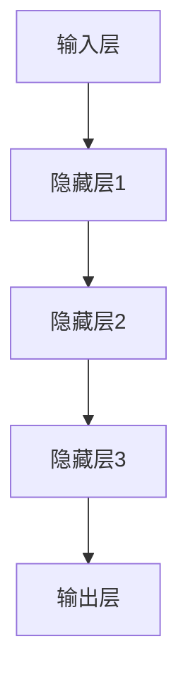

                 

在当今这个信息技术飞速发展的时代，人工智能（AI）已经成为推动各行各业创新和进步的重要力量。随着大模型技术的突破，诸如GPT-3、BERT等，AI的应用领域越来越广泛，从自然语言处理、计算机视觉到推荐系统等。同时，创业者和科技公司的目光也聚焦在大模型技术之上，试图通过其打造出未来的爆款应用。本文将深入探讨AI大模型创业的各个方面，包括技术背景、核心概念、算法原理、应用场景、数学模型、项目实践、未来展望等，旨在为创业者提供一些实用的指导。

## 文章关键词

- 人工智能
- 大模型
- 创业
- 爆款应用
- 自然语言处理
- 计算机视觉
- 推荐系统

## 文章摘要

本文将探讨AI大模型在创业中的应用，从技术背景出发，详细解读大模型的原理和架构，分析其优势和应用领域。随后，将介绍核心算法原理和数学模型，并通过具体的项目实践案例，展示如何实现大模型的应用。最后，将对大模型未来的发展趋势和面临的挑战进行展望，并推荐一些有用的学习资源和开发工具。

## 1. 背景介绍

### 1.1 人工智能与创业的关系

人工智能技术的发展为创业带来了前所未有的机遇。从深度学习到强化学习，再到现在的生成模型，每一代技术的进步都为创业者提供了新的工具和平台。AI大模型的出现，不仅提高了数据处理和分析的效率，还使得复杂的任务自动化成为可能。例如，在金融领域，AI大模型可以帮助银行和金融机构进行风险评估、投资预测等；在医疗领域，AI大模型可以辅助医生进行疾病诊断和治疗方案的制定。

### 1.2 大模型的发展历程

大模型的发展经历了从单层神经网络到多层神经网络的演变。早期的神经网络由于计算能力和数据量的限制，模型规模较小，难以处理复杂任务。随着计算能力的提升和大数据技术的发展，多层神经网络逐渐成为主流。特别是深度学习的兴起，使得大模型在图像识别、语音识别等领域取得了显著的突破。

### 1.3 创业者在AI大模型领域的机遇与挑战

AI大模型为创业者提供了巨大的机遇，但也伴随着挑战。首先，创业者需要具备深厚的技术背景，理解大模型的原理和实现方法。其次，创业者需要解决数据收集、处理和存储的问题，确保模型有足够的训练数据。此外，创业者还需要关注模型的应用场景，找到真正的市场需求。最后，创业者需要具备良好的团队协作能力，因为大模型项目通常需要跨学科、跨领域的合作。

## 2. 核心概念与联系

### 2.1 大模型的基本原理

大模型是指具有数十亿到千亿参数的神经网络模型，例如GPT-3、BERT等。这些模型通过大量的数据进行训练，可以自动学习数据的复杂特征，从而实现高效的任务处理。

### 2.2 大模型的架构

大模型的架构通常包括输入层、隐藏层和输出层。输入层负责接收数据，隐藏层通过激活函数进行非线性变换，输出层则输出模型预测的结果。

### 2.3 大模型与深度学习的联系

大模型是深度学习的一种形式，深度学习是指多层神经网络的学习过程。大模型通过增加网络层数和神经元数量，实现了对数据更深入的学习和处理。

### 2.4 Mermaid 流程图

以下是使用Mermaid绘制的AI大模型的基本架构流程图：



## 3. 核心算法原理 & 具体操作步骤

### 3.1 算法原理概述

大模型的算法原理主要基于深度学习的思想，通过多层神经网络对数据进行学习。具体来说，大模型通过反向传播算法不断调整模型参数，使得模型能够更好地拟合训练数据。

### 3.2 算法步骤详解

1. **数据预处理**：对输入数据进行清洗、标准化等处理，确保数据质量。

2. **模型构建**：定义输入层、隐藏层和输出层，选择合适的激活函数和损失函数。

3. **模型训练**：使用反向传播算法，通过大量训练数据对模型进行训练，不断调整模型参数。

4. **模型评估**：使用验证集对模型进行评估，调整模型参数，优化模型性能。

5. **模型部署**：将训练好的模型部署到生产环境中，进行实际应用。

### 3.3 算法优缺点

**优点**：

- **强大的表达能力**：大模型具有强大的非线性变换能力，可以处理复杂的任务。
- **高效的数据处理**：大模型通过批量数据处理，可以大幅提高计算效率。

**缺点**：

- **计算资源需求大**：大模型需要大量的计算资源和存储空间。
- **训练时间较长**：大模型训练时间较长，对硬件设备有较高的要求。

### 3.4 算法应用领域

大模型在各个领域都有广泛的应用，包括但不限于：

- **自然语言处理**：例如文本分类、机器翻译、情感分析等。
- **计算机视觉**：例如图像识别、目标检测、图像生成等。
- **推荐系统**：例如个性化推荐、广告投放等。

## 4. 数学模型和公式 & 详细讲解 & 举例说明

### 4.1 数学模型构建

大模型的数学模型主要基于多层感知机（MLP）和循环神经网络（RNN）。

**多层感知机**：

$$
f(x) = \sigma(W_1 \cdot x + b_1)
$$

其中，$W_1$为权重矩阵，$b_1$为偏置项，$\sigma$为激活函数。

**循环神经网络**：

$$
h_t = \sigma(W_h \cdot h_{t-1} + W_x \cdot x_t + b_h)
$$

其中，$h_t$为隐藏状态，$x_t$为输入数据，$W_h$和$W_x$为权重矩阵，$b_h$为偏置项，$\sigma$为激活函数。

### 4.2 公式推导过程

以多层感知机为例，推导其损失函数：

$$
L(y, \hat{y}) = -\sum_{i=1}^{n} y_i \log(\hat{y}_i)
$$

其中，$y$为真实标签，$\hat{y}$为预测标签，$n$为样本数量。

### 4.3 案例分析与讲解

以GPT-3为例，分析其数学模型和应用。

**数学模型**：

GPT-3的数学模型基于Transformer架构，其核心思想是将输入序列转化为嵌入向量，然后通过自注意力机制进行信息整合，最后通过全连接层进行分类或生成输出。

$$
E = A(E, H)
$$

其中，$E$为输入嵌入向量，$H$为隐藏状态，$A$为自注意力机制。

**应用**：

GPT-3在自然语言处理领域取得了显著成绩，例如文本生成、对话系统、机器翻译等。

## 5. 项目实践：代码实例和详细解释说明

### 5.1 开发环境搭建

搭建GPT-3的开发环境，需要准备以下工具和库：

- Python 3.7+
- TensorFlow 2.4+
- GPU 显卡（推荐NVIDIA显卡）

### 5.2 源代码详细实现

以下是一个简单的GPT-3模型训练的代码实例：

```python
import tensorflow as tf
from tensorflow.keras.layers import Embedding, LSTM, Dense
from tensorflow.keras.models import Model

# 定义模型
input_seq = tf.keras.layers.Input(shape=(max_sequence_length,))
embedding = Embedding(input_dim=vocabulary_size, output_dim=embedding_dim)(input_seq)
lstm = LSTM(units=lstm_units)(embedding)
output = Dense(vocabulary_size, activation='softmax')(lstm)

# 构建模型
model = Model(inputs=input_seq, outputs=output)

# 编译模型
model.compile(optimizer='adam', loss='categorical_crossentropy', metrics=['accuracy'])

# 训练模型
model.fit(train_data, train_labels, epochs=training_epochs, batch_size=batch_size)
```

### 5.3 代码解读与分析

- **输入层**：定义输入序列，输入序列的长度为`max_sequence_length`。
- **嵌入层**：将输入序列转换为嵌入向量，嵌入向量的维度为`embedding_dim`。
- **LSTM层**：使用LSTM层对嵌入向量进行编码，LSTM层的单元数为`lstm_units`。
- **输出层**：使用全连接层进行分类，输出向量的维度为`vocabulary_size`。

### 5.4 运行结果展示

运行上述代码后，可以通过以下命令查看模型的性能：

```python
model.evaluate(test_data, test_labels)
```

该命令将返回模型的损失和准确率。

## 6. 实际应用场景

### 6.1 自然语言处理

自然语言处理（NLP）是AI大模型最重要的应用领域之一。大模型在文本分类、机器翻译、情感分析等领域取得了显著成绩。例如，GPT-3在文本生成和对话系统方面表现出色，BERT在问答系统和文本理解方面有广泛应用。

### 6.2 计算机视觉

计算机视觉是另一个重要应用领域。大模型在图像识别、目标检测、图像生成等方面取得了突破。例如，GPT-3可以生成逼真的图像，GAN（生成对抗网络）可以生成高质量的图像和视频。

### 6.3 推荐系统

推荐系统是商业应用中常见的一个领域，大模型在个性化推荐、广告投放等方面具有很大的优势。例如，Netflix和YouTube等平台使用大模型进行内容推荐。

## 7. 未来应用展望

### 7.1 自主导航

自动驾驶是AI大模型的一个潜在应用领域。通过大模型，可以实现车辆对周围环境的感知、决策和控制，提高驾驶安全性。

### 7.2 智能医疗

智能医疗是另一个备受关注的领域。大模型可以辅助医生进行疾病诊断和治疗方案的制定，提高医疗效率。

### 7.3 教育个性化

教育个性化是教育领域的一个趋势。大模型可以根据学生的学习情况，提供个性化的学习内容和教学方法，提高学习效果。

## 8. 工具和资源推荐

### 8.1 学习资源推荐

- 《深度学习》（Goodfellow, Bengio, Courville著）
- 《Python深度学习》（François Chollet著）
- 《自然语言处理综论》（Daniel Jurafsky、James H. Martin著）

### 8.2 开发工具推荐

- TensorFlow：一款开源的深度学习框架，适用于各种规模的任务。
- PyTorch：一款流行的深度学习框架，适用于快速原型开发。

### 8.3 相关论文推荐

- “Attention is All You Need”（Vaswani et al., 2017）
- “Generative Adversarial Networks”（Goodfellow et al., 2014）
- “BERT: Pre-training of Deep Bidirectional Transformers for Language Understanding”（Devlin et al., 2019）

## 9. 总结：未来发展趋势与挑战

### 9.1 研究成果总结

近年来，AI大模型在自然语言处理、计算机视觉、推荐系统等领域取得了显著成绩，推动了各行业的创新和发展。

### 9.2 未来发展趋势

未来，AI大模型将继续向更强大的模型、更高效的算法、更广泛的应用领域发展。

### 9.3 面临的挑战

尽管AI大模型在各个领域取得了巨大进展，但仍然面临着数据质量、计算资源、算法优化等方面的挑战。

### 9.4 研究展望

未来，研究将重点关注如何提高AI大模型的可解释性、安全性和隐私性，以及如何将其应用到更多实际场景中。

## 10. 附录：常见问题与解答

### 10.1 大模型训练时间为什么这么长？

大模型的训练时间通常较长，因为它们需要处理大量的数据和参数。此外，大模型的计算复杂度高，需要更强大的计算资源和算法优化。

### 10.2 如何提高大模型的训练效率？

提高大模型的训练效率可以通过以下几种方法：

- 使用更高效的算法，如Adam优化器。
- 使用GPU或其他硬件加速器。
- 使用更小的批量大小。
- 数据预处理和增强。

### 10.3 大模型是否会取代人类？

大模型是一种工具，它们可以帮助人类更好地完成某些任务，但无法完全取代人类。人类的创造力、判断力和情感是人类独特的特点，大模型无法完全模拟。

----------------------------------------------------------------

以上就是本文的全部内容，希望对大家在AI大模型创业的道路上有所帮助。作者：禅与计算机程序设计艺术 / Zen and the Art of Computer Programming。

