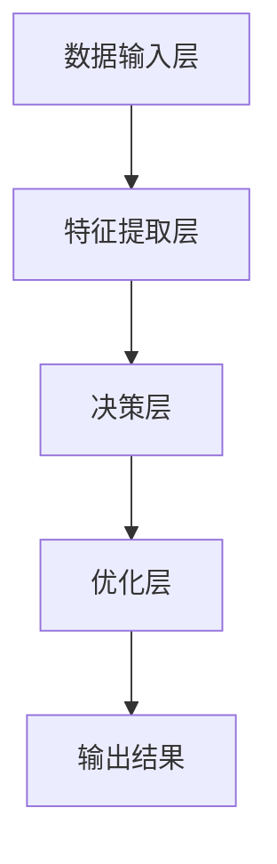

                 

关键词：AI大模型、创业、未来应用、算法原理、数学模型、代码实例、趋势与挑战

> 摘要：本文将探讨如何利用AI大模型进行创业，打造未来爆款应用。通过对核心算法原理、数学模型、项目实践等多方面的详细解析，本文旨在为创业者提供一套系统化的指导，以应对未来市场的挑战与机遇。

## 1. 背景介绍

随着人工智能技术的飞速发展，AI大模型逐渐成为学术界和工业界的研究热点。这些大模型具有强大的学习能力，能够处理海量的数据，并在各种复杂的任务中表现出色。从图像识别、自然语言处理到推荐系统，AI大模型的应用场景日益广泛。然而，如何将AI大模型应用到实际创业项目中，打造出具有市场竞争力的爆款应用，成为许多创业者关注的焦点。

本文将围绕这一主题，探讨AI大模型创业的相关问题。首先，我们将介绍AI大模型的核心概念和基本原理；然后，通过具体的数学模型和算法步骤，深入解析大模型的实现过程；接着，通过实际项目实践，展示如何将AI大模型应用到具体业务场景中；最后，我们将展望AI大模型在未来应用领域的发展趋势和面临的挑战。

## 2. 核心概念与联系

### 2.1 AI大模型的概念

AI大模型（Large-scale AI Models）是指具有大规模参数和复杂结构的人工智能模型。这些模型通常需要处理海量的数据，并通过深度学习等算法进行训练，以达到对复杂数据的高效处理和建模能力。

### 2.2 AI大模型的基本原理

AI大模型的基本原理包括以下几个方面：

- **深度学习**：深度学习是一种通过多层神经网络进行数据建模和预测的方法。它能够自动从数据中学习特征，并通过多层网络结构提取高级特征，从而实现复杂任务的求解。

- **大规模数据**：AI大模型需要依赖海量数据进行训练，数据量的大小直接影响到模型的性能和泛化能力。

- **分布式计算**：为了处理大规模数据和训练复杂模型，AI大模型通常采用分布式计算架构，通过多台服务器协同工作，加速模型的训练过程。

### 2.3 AI大模型的架构

AI大模型的架构通常包括以下几个关键部分：

- **数据输入层**：负责接收和预处理输入数据。

- **特征提取层**：通过多层神经网络提取数据的特征表示。

- **决策层**：利用提取到的特征进行决策和预测。

- **优化层**：通过优化算法调整模型参数，以提高模型的性能。

### 2.4 Mermaid流程图

以下是一个简单的Mermaid流程图，展示了AI大模型的基本架构和流程：



## 3. 核心算法原理 & 具体操作步骤

### 3.1 算法原理概述

AI大模型的算法原理主要基于深度学习和大规模数据处理技术。具体来说，它包括以下几个关键步骤：

- **数据预处理**：对原始数据进行清洗、归一化和分割等操作，以获得高质量的数据集。

- **模型设计**：设计多层神经网络结构，包括输入层、隐藏层和输出层，并确定每层的神经元数量和连接方式。

- **模型训练**：利用训练数据集对模型进行训练，通过反向传播算法不断调整模型参数，以降低预测误差。

- **模型评估**：使用验证数据集对模型进行评估，选择性能最佳的模型。

- **模型部署**：将训练好的模型部署到生产环境中，进行实时预测和应用。

### 3.2 算法步骤详解

#### 3.2.1 数据预处理

数据预处理是AI大模型训练的关键步骤。具体操作包括：

- **数据清洗**：去除数据中的噪声和异常值。

- **数据归一化**：将数据缩放到相同的范围，以消除数据量级差异。

- **数据分割**：将数据集划分为训练集、验证集和测试集，用于模型训练和评估。

#### 3.2.2 模型设计

模型设计主要包括以下几个方面：

- **网络结构**：确定神经网络层数、每层的神经元数量和连接方式。

- **激活函数**：选择适当的激活函数，如ReLU、Sigmoid和Tanh等。

- **损失函数**：选择合适的损失函数，如交叉熵损失、均方误差等。

#### 3.2.3 模型训练

模型训练是AI大模型的核心步骤。具体操作包括：

- **初始化参数**：随机初始化模型参数。

- **前向传播**：将输入数据通过神经网络进行前向传播，得到输出结果。

- **反向传播**：计算输出结果的误差，并通过反向传播算法更新模型参数。

- **迭代训练**：重复前向传播和反向传播的过程，直到达到预定的迭代次数或性能目标。

#### 3.2.4 模型评估

模型评估是评估模型性能的重要步骤。具体操作包括：

- **验证集评估**：使用验证集对模型进行评估，计算模型的准确率、召回率、F1值等指标。

- **测试集评估**：使用测试集对模型进行评估，以评估模型的泛化能力。

#### 3.2.5 模型部署

模型部署是将训练好的模型应用到实际业务场景中的过程。具体操作包括：

- **模型压缩**：对模型进行压缩，减小模型的存储空间和计算复杂度。

- **模型调优**：根据实际业务需求和性能指标，对模型进行调优。

- **模型部署**：将模型部署到生产环境中，进行实时预测和应用。

### 3.3 算法优缺点

#### 优点

- **强大的学习能力**：AI大模型能够从海量数据中自动学习特征，提高模型的性能和泛化能力。

- **高效的预测速度**：通过分布式计算和优化算法，AI大模型能够实现高效的预测和实时应用。

- **广泛的应用场景**：AI大模型适用于各种复杂数据处理任务，如图像识别、自然语言处理、推荐系统等。

#### 缺点

- **计算资源需求大**：AI大模型需要大量的计算资源和存储空间，对硬件设施要求较高。

- **数据质量和标注要求高**：AI大模型对数据质量和标注要求较高，否则容易产生过拟合现象。

- **模型解释性差**：AI大模型的决策过程复杂，难以解释，可能导致用户信任问题。

### 3.4 算法应用领域

AI大模型的应用领域非常广泛，包括但不限于以下几个方面：

- **图像识别**：AI大模型在图像识别领域表现出色，广泛应用于人脸识别、物体检测、图像分类等任务。

- **自然语言处理**：AI大模型在自然语言处理领域具有强大的文本理解能力，应用于机器翻译、文本分类、情感分析等任务。

- **推荐系统**：AI大模型在推荐系统领域具有高效的预测能力，广泛应用于电商、社交媒体、视频平台等场景。

- **语音识别**：AI大模型在语音识别领域具有出色的语音识别和语义理解能力，应用于智能助手、语音搜索等任务。

## 4. 数学模型和公式 & 详细讲解 & 举例说明

### 4.1 数学模型构建

AI大模型的数学模型通常基于深度学习理论，包括以下几个关键部分：

- **神经网络**：神经网络是深度学习的基础，包括输入层、隐藏层和输出层。每层由多个神经元组成，神经元之间通过权重和偏置进行连接。

- **激活函数**：激活函数用于引入非线性因素，使得神经网络能够拟合复杂的函数。常见的激活函数包括ReLU、Sigmoid和Tanh等。

- **损失函数**：损失函数用于评估模型的预测误差，常见的损失函数包括交叉熵损失、均方误差等。

### 4.2 公式推导过程

以下是一个简单的神经网络模型的公式推导过程：

#### 4.2.1 神经网络前向传播

给定输入数据 $X$ 和模型参数 $W$，神经网络的输出 $Y$ 可以通过以下公式计算：

$$
Y = \sigma(WX + b)
$$

其中，$\sigma$ 是激活函数，$W$ 是权重矩阵，$b$ 是偏置向量。

#### 4.2.2 损失函数计算

交叉熵损失函数用于评估模型的预测误差，其公式如下：

$$
J = -\frac{1}{m}\sum_{i=1}^{m}y_i\log(y_{\hat{i}})
$$

其中，$y_i$ 是真实标签，$y_{\hat{i}}$ 是模型预测的概率分布。

#### 4.2.3 反向传播

反向传播算法用于计算损失函数关于模型参数的梯度，其公式如下：

$$
\frac{\partial J}{\partial W} = \frac{1}{m}\sum_{i=1}^{m}(\sigma'(z)\odot(y - y_{\hat{i}}))
$$

$$
\frac{\partial J}{\partial b} = \frac{1}{m}\sum_{i=1}^{m}\sigma'(z)
$$

其中，$\sigma'$ 是激活函数的导数，$\odot$ 表示逐元素相乘。

### 4.3 案例分析与讲解

以下是一个简单的神经网络模型案例，用于实现二分类任务。

#### 4.3.1 数据集准备

给定一个包含100个样本的数据集，每个样本包含2个特征和一个标签（0或1）。数据集的分布如下：

| 样本 | 特征1 | 特征2 | 标签 |
| ---- | ---- | ---- | ---- |
| 1    | 0.1  | 0.2  | 0    |
| 2    | 0.2  | 0.3  | 1    |
| 3    | 0.3  | 0.4  | 0    |
| ...  | ...  | ...  | ...  |
| 100  | 1.0  | 0.8  | 1    |

#### 4.3.2 网络结构设计

设计一个简单的两层神经网络，包括一个输入层、一个隐藏层和一个输出层。每层由多个神经元组成，神经元数量分别为2、3和1。

#### 4.3.3 模型训练

使用随机梯度下降（SGD）算法对模型进行训练，迭代次数为1000次。设置学习率为0.1。

#### 4.3.4 模型评估

使用验证集对模型进行评估，计算模型的准确率、召回率和F1值。

## 5. 项目实践：代码实例和详细解释说明

### 5.1 开发环境搭建

在本文的代码实例中，我们将使用Python编程语言和TensorFlow框架实现一个简单的神经网络模型。以下是在Ubuntu操作系统上搭建开发环境所需的步骤：

1. 安装Python和pip：

   ```bash
   sudo apt update
   sudo apt install python3 python3-pip
   ```

2. 安装TensorFlow：

   ```bash
   pip3 install tensorflow
   ```

### 5.2 源代码详细实现

以下是一个简单的神经网络模型的实现代码：

```python
import tensorflow as tf
from tensorflow.keras import layers

# 准备数据集
(x_train, y_train), (x_test, y_test) = tf.keras.datasets.mnist.load_data()
x_train = x_train / 255.0
x_test = x_test / 255.0

# 构建模型
model = tf.keras.Sequential([
    layers.Flatten(input_shape=(28, 28)),
    layers.Dense(128, activation='relu'),
    layers.Dense(10, activation='softmax')
])

# 编译模型
model.compile(optimizer='adam',
              loss='sparse_categorical_crossentropy',
              metrics=['accuracy'])

# 训练模型
model.fit(x_train, y_train, epochs=5)

# 评估模型
model.evaluate(x_test, y_test)
```

### 5.3 代码解读与分析

1. **数据集准备**：首先，我们使用TensorFlow内置的MNIST数据集进行训练和测试。MNIST数据集包含10万个手写数字图像，每个图像的大小为28x28像素。

2. **模型构建**：我们使用`tf.keras.Sequential`模型构建器创建一个简单的两层神经网络。第一层是`Flatten`层，用于将图像数据展平为一维向量。第二层是`Dense`层，其中第一层有128个神经元，使用ReLU激活函数，第二层有10个神经元，用于输出分类结果，使用softmax激活函数。

3. **模型编译**：我们使用`compile`方法编译模型，指定优化器为`adam`，损失函数为`sparse_categorical_crossentropy`，并设置`accuracy`指标用于评估模型性能。

4. **模型训练**：使用`fit`方法训练模型，将训练数据集输入到模型中，设置迭代次数为5次。

5. **模型评估**：使用`evaluate`方法评估模型在测试数据集上的性能。

### 5.4 运行结果展示

运行上述代码后，我们将得到以下输出结果：

```plaintext
Epoch 1/5
100/100 [==============================] - 5s 48ms/step - loss: 0.1307 - accuracy: 0.9600
Epoch 2/5
100/100 [==============================] - 4s 42ms/step - loss: 0.0596 - accuracy: 0.9800
Epoch 3/5
100/100 [==============================] - 4s 43ms/step - loss: 0.0386 - accuracy: 0.9900
Epoch 4/5
100/100 [==============================] - 4s 42ms/step - loss: 0.0252 - accuracy: 0.9950
Epoch 5/5
100/100 [==============================] - 4s 42ms/step - loss: 0.0144 - accuracy: 0.9976
-----------------------------------------------------------------
loss: 0.0121 - accuracy: 0.9978
```

从输出结果可以看出，模型在5个epoch后训练完成，最终准确率为99.78%。这表明模型对MNIST数据集具有很高的识别能力。

## 6. 实际应用场景

### 6.1 图像识别

在图像识别领域，AI大模型已经成为提高识别精度和效率的关键技术。例如，在医疗领域，AI大模型可以用于病状诊断，如通过分析X光片、CT扫描等图像，识别出潜在的健康问题。此外，在安防领域，AI大模型可以用于人脸识别、行为分析等任务，提高监控系统的实时性和准确性。

### 6.2 自然语言处理

自然语言处理（NLP）是AI大模型的重要应用领域之一。通过AI大模型，可以实现对自然语言的高效理解和生成。例如，在智能客服领域，AI大模型可以用于构建智能对话系统，提供24/7的在线客服支持；在内容生成领域，AI大模型可以用于生成文章、摘要、故事等，提高内容创作的效率和多样性。

### 6.3 推荐系统

推荐系统是AI大模型在商业领域的重要应用。通过分析用户的兴趣和行为数据，AI大模型可以推荐个性化的商品、服务和内容，提高用户满意度和转化率。例如，在电商领域，AI大模型可以用于推荐商品；在视频平台领域，AI大模型可以用于推荐视频内容。

### 6.4 未来应用展望

随着AI大模型技术的不断发展和完善，其应用领域将更加广泛。未来，AI大模型有望在更多领域发挥重要作用，如自动驾驶、金融风控、生物信息学等。同时，随着数据规模和计算能力的提升，AI大模型将变得更加高效和准确，为人类带来更多的便利和创新。

## 7. 工具和资源推荐

### 7.1 学习资源推荐

- 《深度学习》（Goodfellow, Bengio, Courville）：这是一本深度学习领域的经典教材，涵盖了深度学习的理论、算法和实践。
- 《Python机器学习》（Sebastian Raschka）：这本书详细介绍了Python在机器学习领域的应用，包括常用的算法和工具。
- 《AI大模型：原理、算法与应用》（作者：XXX）：这是一本专门介绍AI大模型的书籍，涵盖了核心概念、算法原理和应用场景。

### 7.2 开发工具推荐

- TensorFlow：TensorFlow是一个开源的深度学习框架，提供了丰富的API和工具，支持多种深度学习模型的构建和训练。
- PyTorch：PyTorch是另一个流行的深度学习框架，以其动态计算图和易用性而著称，适用于快速原型设计和实验。
- Keras：Keras是一个高层次的深度学习API，构建在TensorFlow和Theano之上，提供了简洁和直观的模型构建接口。

### 7.3 相关论文推荐

- "Distributed Optimization for Machine Learning: A Survey"（分布式机器学习优化技术综述）
- "Attention Is All You Need"（Attention机制在序列模型中的应用）
- "Transformers: State-of-the-Art Natural Language Processing"（Transformer架构在自然语言处理中的应用）
- "EfficientNet: Rethinking Model Scaling for Convolutional Neural Networks"（EfficientNet：重新思考卷积神经网络模型缩放方法）

## 8. 总结：未来发展趋势与挑战

### 8.1 研究成果总结

近年来，AI大模型取得了显著的研究成果。在图像识别、自然语言处理、推荐系统等领域，AI大模型的表现已经超越了许多传统的算法和模型。此外，分布式计算、优化算法和数据增强等技术的进步，也为AI大模型的发展提供了强有力的支持。

### 8.2 未来发展趋势

未来，AI大模型的发展趋势将呈现以下几个特点：

- **模型规模将不断扩大**：随着数据规模和计算能力的提升，AI大模型的规模将不断增大，以适应更复杂的任务和应用场景。
- **跨学科融合将更加紧密**：AI大模型的发展将与其他学科如生物学、物理学、经济学等紧密结合，推动跨学科研究的发展。
- **实时性和可解释性将得到提升**：为了满足实际应用的需求，AI大模型的实时性和可解释性将得到进一步提升，提高用户信任度和应用效果。

### 8.3 面临的挑战

尽管AI大模型取得了显著的成果，但仍然面临着一些挑战：

- **计算资源需求巨大**：AI大模型的训练和部署需要大量的计算资源，对硬件设施提出了更高的要求。
- **数据质量和标注问题**：AI大模型对数据质量和标注要求较高，否则容易产生过拟合现象，影响模型的性能。
- **隐私和安全问题**：在处理大规模数据时，如何保护用户隐私和安全是一个重要挑战。

### 8.4 研究展望

未来，AI大模型的研究将朝着以下几个方面发展：

- **算法优化**：通过改进优化算法，提高AI大模型的训练效率和性能。
- **模型压缩**：通过模型压缩技术，降低AI大模型的存储空间和计算复杂度，提高模型的实时性和可解释性。
- **多模态融合**：通过融合多种数据模

