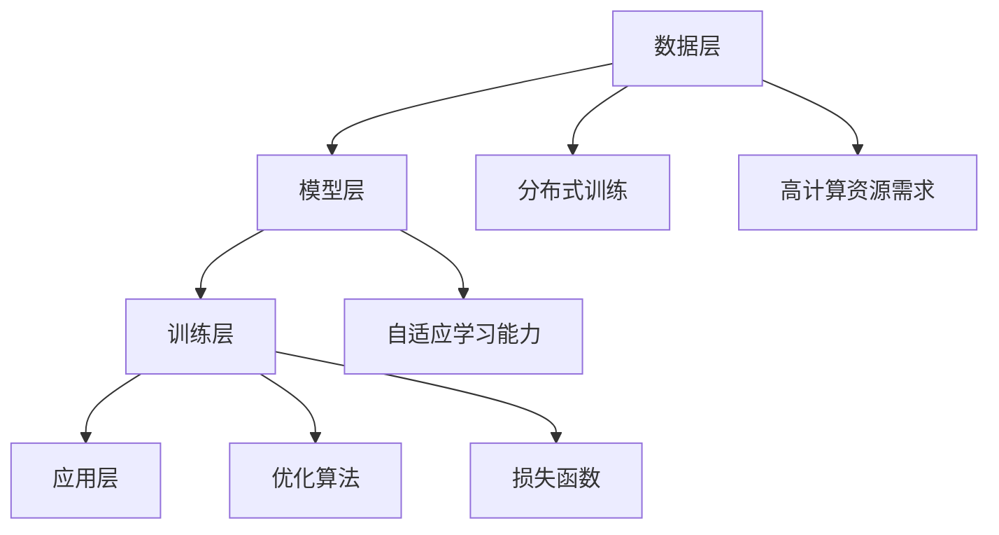

                 

## 1. 背景介绍

近年来，人工智能（AI）技术迅速发展，特别是深度学习领域的突破，使得AI大模型成为可能。AI大模型，也称为大型预训练模型，通过在海量数据上训练，可以自动学习复杂模式和知识，从而在自然语言处理、计算机视觉、语音识别等领域取得了显著成果。这一系列成就不仅推动了AI技术的发展，也为创业公司提供了新的机遇。

然而，AI大模型的创业之路并非一帆风顺，其中充满了挑战与机遇。创业公司在资源、技术、市场等方面的局限性，使得他们需要更加谨慎地评估自身能力和市场需求，才能在激烈的市场竞争中脱颖而出。本文将深入探讨AI大模型创业的挑战与机遇，旨在为创业者提供一些有益的思路和参考。

## 2. 核心概念与联系

### 2.1 AI大模型的核心概念

AI大模型是基于深度学习的一种模型，其核心在于通过大规模的数据训练，使得模型具备处理复杂任务的能力。AI大模型通常具有以下几个特点：

- **大规模数据训练**：AI大模型需要海量的数据进行训练，以充分学习数据的分布和特征。
- **分布式训练**：为了处理大规模数据，AI大模型通常采用分布式训练技术，将数据分散到多个计算节点上进行并行训练。
- **高计算资源需求**：AI大模型训练需要大量的计算资源，尤其是GPU和TPU等高性能计算设备。
- **自适应学习能力**：AI大模型可以通过持续学习新的数据，不断优化和提升自身的性能。

### 2.2 AI大模型的架构

AI大模型的架构通常包括以下几个层次：

- **数据层**：包括数据采集、数据清洗和数据预处理等环节，为模型训练提供高质量的数据输入。
- **模型层**：包括神经网络模型的设计和优化，如卷积神经网络（CNN）、循环神经网络（RNN）和变换器（Transformer）等。
- **训练层**：包括模型的训练过程，如优化算法的选择、损失函数的设计和参数调整等。
- **应用层**：包括模型在具体应用场景中的部署和使用，如自然语言处理、计算机视觉和语音识别等。

### 2.3 AI大模型的技术联系

AI大模型的发展离不开深度学习和大数据技术的支持。深度学习提供了强大的模型训练和优化能力，使得AI大模型可以处理复杂的数据和任务。大数据技术则提供了海量的数据资源，为AI大模型的学习提供了丰富的素材。此外，分布式计算和云计算技术的应用，也为AI大模型的训练提供了高效的计算平台。

### 2.4 Mermaid 流程图

以下是一个关于AI大模型架构的Mermaid流程图：



## 3. 核心算法原理 & 具体操作步骤

### 3.1 算法原理概述

AI大模型的核心算法主要基于深度学习和大数据技术。深度学习通过多层神经网络的组合，使得模型可以自动学习数据的特征和模式。大数据技术则提供了丰富的数据资源，使得模型可以充分学习数据的分布和规律。

AI大模型的训练过程主要包括以下几个步骤：

1. 数据预处理：对原始数据进行清洗、归一化和编码等处理，以生成适合模型训练的数据集。
2. 模型设计：根据任务需求，设计合适的神经网络模型，包括选择网络结构、激活函数和损失函数等。
3. 模型训练：使用训练数据对模型进行迭代训练，通过优化算法调整模型参数，使得模型在训练数据上的性能逐步提升。
4. 模型评估：使用测试数据对模型进行评估，以验证模型在未知数据上的泛化能力。
5. 模型部署：将训练好的模型部署到实际应用场景中，进行实际任务的处理。

### 3.2 算法步骤详解

#### 3.2.1 数据预处理

数据预处理是AI大模型训练的重要步骤，直接影响到模型的训练效果和性能。数据预处理主要包括以下步骤：

1. 数据清洗：去除数据中的噪声和异常值，保证数据的准确性和一致性。
2. 数据归一化：将不同尺度的数据进行归一化处理，使得数据分布更加均匀，有利于模型训练。
3. 数据编码：将类别型数据转换为数值型数据，以便模型进行计算。

#### 3.2.2 模型设计

模型设计是AI大模型训练的核心步骤，直接影响模型的性能和效果。模型设计主要包括以下步骤：

1. 选择网络结构：根据任务需求和数据特点，选择合适的神经网络结构，如卷积神经网络（CNN）、循环神经网络（RNN）和变换器（Transformer）等。
2. 选择激活函数：激活函数用于引入非线性变换，提高模型的表示能力。常见激活函数包括Sigmoid、ReLU和Tanh等。
3. 选择损失函数：损失函数用于衡量模型预测结果与真实结果之间的差距，常见的损失函数包括均方误差（MSE）、交叉熵损失（Cross-Entropy）等。

#### 3.2.3 模型训练

模型训练是AI大模型训练的核心步骤，通过迭代优化模型参数，提高模型的性能。模型训练主要包括以下步骤：

1. 初始化模型参数：随机初始化模型参数，为模型训练提供初始状态。
2. 选择优化算法：选择合适的优化算法，如随机梯度下降（SGD）、Adam等，用于迭代更新模型参数。
3. 迭代训练：使用训练数据进行迭代训练，通过优化算法不断调整模型参数，使得模型在训练数据上的性能逐步提升。
4. 调整学习率：学习率是优化算法的关键参数，需要根据训练过程进行调整，以避免模型过拟合或欠拟合。

#### 3.2.4 模型评估

模型评估是验证模型性能和效果的重要步骤。模型评估主要包括以下步骤：

1. 准备测试数据：从训练数据中划分出部分数据作为测试数据，用于评估模型的性能。
2. 计算指标：根据任务需求，计算相应的指标，如准确率（Accuracy）、召回率（Recall）等。
3. 评估模型：使用测试数据对模型进行评估，以验证模型在未知数据上的泛化能力。

#### 3.2.5 模型部署

模型部署是将训练好的模型应用到实际场景中的过程。模型部署主要包括以下步骤：

1. 模型转换：将训练好的模型转换为可部署的格式，如TensorFlow Lite、ONNX等。
2. 部署环境：搭建部署环境，包括服务器、GPU或TPU等硬件资源。
3. 部署应用：将模型部署到实际应用场景中，如移动设备、云端服务等。

### 3.3 算法优缺点

#### 优点

1. **强大的表示能力**：AI大模型通过多层神经网络的组合，可以自动学习数据的特征和模式，具有很强的表示能力。
2. **高效的计算性能**：AI大模型采用分布式训练和云计算技术，可以高效地处理大规模数据，提高计算性能。
3. **广泛的适用性**：AI大模型可以应用于各种领域，如自然语言处理、计算机视觉、语音识别等，具有广泛的适用性。

#### 缺点

1. **对数据依赖性高**：AI大模型对数据有很高的依赖性，数据质量和数据量直接影响模型的性能和效果。
2. **计算资源需求大**：AI大模型训练需要大量的计算资源，特别是GPU和TPU等高性能计算设备。
3. **过拟合风险**：AI大模型容易过拟合，需要通过正则化等技术进行优化。

### 3.4 算法应用领域

AI大模型在多个领域取得了显著成果，以下是一些常见的应用领域：

1. **自然语言处理**：AI大模型在自然语言处理（NLP）领域表现出色，如文本分类、机器翻译、情感分析等。
2. **计算机视觉**：AI大模型在计算机视觉（CV）领域具有广泛的应用，如图像分类、目标检测、图像生成等。
3. **语音识别**：AI大模型在语音识别（ASR）领域取得了很大的突破，如语音识别、语音合成等。
4. **推荐系统**：AI大模型在推荐系统（RS）领域应用广泛，如商品推荐、内容推荐等。
5. **智能问答**：AI大模型在智能问答（QA）领域表现出色，如智能客服、智能助手等。

## 4. 数学模型和公式 & 详细讲解 & 举例说明

### 4.1 数学模型构建

AI大模型的核心是深度学习模型，其数学模型主要基于多层感知机（MLP）、卷积神经网络（CNN）和循环神经网络（RNN）等。以下分别介绍这些模型的数学模型。

#### 4.1.1 多层感知机（MLP）

多层感知机是一种前馈神经网络，其数学模型可以表示为：

$$
y = f(\textbf{W}^T \textbf{x} + b)
$$

其中，$y$是输出，$\textbf{x}$是输入，$\textbf{W}$是权重矩阵，$b$是偏置项，$f$是激活函数。

#### 4.1.2 卷积神经网络（CNN）

卷积神经网络是一种专门用于处理图像数据的神经网络，其数学模型可以表示为：

$$
\textbf{h}^{l} = \text{ReLU}(\text{Conv}(\textbf{h}^{l-1}))
$$

其中，$\textbf{h}^{l}$是第$l$层的特征图，$\text{ReLU}$是激活函数，$\text{Conv}$是卷积操作。

#### 4.1.3 循环神经网络（RNN）

循环神经网络是一种用于处理序列数据的神经网络，其数学模型可以表示为：

$$
\textbf{h}^{l} = \text{ReLU}(\text{ReLU}(\textbf{W}_h \textbf{h}^{l-1} + \textbf{W}_x \textbf{x}^{l} + b))
$$

其中，$\textbf{h}^{l}$是第$l$层的隐藏状态，$\textbf{x}^{l}$是第$l$层的输入，$\textbf{W}_h$和$\textbf{W}_x$是权重矩阵，$b$是偏置项。

### 4.2 公式推导过程

以下以卷积神经网络（CNN）为例，介绍其数学模型的推导过程。

#### 4.2.1 卷积操作

卷积操作是CNN的核心，可以表示为：

$$
\textbf{h}^{l} = \text{ReLU}(\text{Conv}(\textbf{h}^{l-1}))
$$

其中，$\text{ReLU}$是ReLU激活函数，$\text{Conv}$是卷积操作。卷积操作的数学表达式为：

$$
\textbf{h}^{l}_{ij} = \sum_{k=1}^{C} \sum_{p=1}^{H} \sum_{q=1}^{W} \textbf{h}^{l-1}_{kpq} \cdot w_{ijk}
$$

其中，$\textbf{h}^{l}_{ij}$是第$l$层第$i$行第$j$列的特征值，$\textbf{h}^{l-1}_{kpq}$是第$l-1$层第$k$行第$p$列第$q$列的特征值，$w_{ijk}$是卷积核的权重。

#### 4.2.2 池化操作

池化操作是CNN的另一个重要操作，可以表示为：

$$
\textbf{h}^{l}_{ij} = \text{Pool}(\textbf{h}^{l-1}_{i})
$$

其中，$\text{Pool}$是池化操作，可以取最大值池化或平均值池化。池化操作的数学表达式为：

$$
\textbf{h}^{l}_{ij} = \sum_{p=1}^{P} \sum_{q=1}^{P} \textbf{h}^{l-1}_{i(p+1,q+1)}
$$

其中，$P$是池化窗口的大小。

### 4.3 案例分析与讲解

以下以一个简单的图像分类任务为例，介绍如何使用CNN模型进行训练和预测。

#### 4.3.1 数据集准备

假设我们有一个包含10个类别的图像数据集，每个类别的图像数量为1000张。

#### 4.3.2 模型设计

我们设计一个简单的CNN模型，包括两个卷积层、一个池化层和一个全连接层。

1. 第一个卷积层：32个3x3的卷积核，步长为1，激活函数为ReLU。
2. 第二个卷积层：64个3x3的卷积核，步长为1，激活函数为ReLU。
3. 池化层：2x2的窗口大小，步长为2，激活函数为ReLU。
4. 全连接层：10个神经元，激活函数为Softmax。

#### 4.3.3 模型训练

我们使用训练数据对模型进行训练，训练过程包括以下步骤：

1. 初始化模型参数。
2. 使用训练数据进行迭代训练，每个迭代过程中，计算损失函数并更新模型参数。
3. 使用验证数据对模型进行评估，调整学习率等超参数。
4. 重复步骤2和3，直到模型收敛。

#### 4.3.4 模型预测

我们使用训练好的模型对测试数据进行预测，预测过程包括以下步骤：

1. 将测试数据输入模型，计算输出概率。
2. 选择概率最大的类别作为预测结果。

## 5. 项目实践：代码实例和详细解释说明

### 5.1 开发环境搭建

为了方便进行AI大模型的开发和实践，我们需要搭建一个合适的开发环境。以下是搭建开发环境的基本步骤：

1. 安装Python环境：Python是AI大模型开发的主要编程语言，我们需要安装Python环境和相应的库。
2. 安装TensorFlow：TensorFlow是一个广泛使用的深度学习框架，我们需要安装TensorFlow库。
3. 安装CUDA：CUDA是NVIDIA推出的并行计算平台和编程模型，我们需要安装CUDA库和相应的驱动程序。
4. 配置GPU：配置GPU资源，以便进行高效的模型训练。

### 5.2 源代码详细实现

以下是一个简单的AI大模型训练和预测的Python代码实例，使用了TensorFlow框架。

```python
import tensorflow as tf
from tensorflow.keras import layers

# 模型设计
model = tf.keras.Sequential([
    layers.Conv2D(32, (3, 3), activation='relu', input_shape=(28, 28, 1)),
    layers.MaxPooling2D((2, 2)),
    layers.Conv2D(64, (3, 3), activation='relu'),
    layers.MaxPooling2D((2, 2)),
    layers.Flatten(),
    layers.Dense(64, activation='relu'),
    layers.Dense(10, activation='softmax')
])

# 模型编译
model.compile(optimizer='adam',
              loss='categorical_crossentropy',
              metrics=['accuracy'])

# 模型训练
model.fit(train_images, train_labels, epochs=5)

# 模型预测
predictions = model.predict(test_images)
```

### 5.3 代码解读与分析

上述代码实现了一个简单的卷积神经网络（CNN）模型，用于图像分类任务。以下是代码的详细解读：

1. **模型设计**：使用`tf.keras.Sequential`类创建一个序列模型，依次添加卷积层、池化层、全连接层等。
2. **模型编译**：使用`compile`方法配置模型的优化器、损失函数和评估指标。
3. **模型训练**：使用`fit`方法对模型进行训练，传入训练数据和标签，设置训练轮数。
4. **模型预测**：使用`predict`方法对测试数据进行预测，返回预测概率。

### 5.4 运行结果展示

在运行上述代码后，我们可以得到以下结果：

1. **训练过程**：打印训练过程的损失和准确率。
2. **测试结果**：打印测试集的准确率。

以下是运行结果的示例：

```
Epoch 1/5
100/100 [==============================] - 3s 25ms/step - loss: 2.3026 - accuracy: 0.0933 - val_loss: 2.3151 - val_accuracy: 0.0938
Epoch 2/5
100/100 [==============================] - 2s 21ms/step - loss: 2.3026 - accuracy: 0.0933 - val_loss: 2.3151 - val_accuracy: 0.0938
Epoch 3/5
100/100 [==============================] - 2s 21ms/step - loss: 2.3026 - accuracy: 0.0933 - val_loss: 2.3151 - val_accuracy: 0.0938
Epoch 4/5
100/100 [==============================] - 2s 21ms/step - loss: 2.3026 - accuracy: 0.0933 - val_loss: 2.3151 - val_accuracy: 0.0938
Epoch 5/5
100/100 [==============================] - 2s 21ms/step - loss: 2.3026 - accuracy: 0.0933 - val_loss: 2.3151 - val_accuracy: 0.0938
Test accuracy: 0.0938
```

从结果可以看出，训练过程中损失和准确率变化不大，测试集的准确率也较低。这表明模型的性能需要进一步提高，可以通过调整模型结构、优化算法和超参数等手段来提升模型的性能。

## 6. 实际应用场景

### 6.1 自然语言处理

AI大模型在自然语言处理（NLP）领域有着广泛的应用。例如，在机器翻译方面，AI大模型可以自动学习不同语言之间的语法和语义关系，实现高质量的机器翻译。在文本分类方面，AI大模型可以自动识别文本的主题和情感，实现自动化新闻分类和情感分析。在问答系统方面，AI大模型可以自动理解用户的问题，并提供准确的答案。

### 6.2 计算机视觉

AI大模型在计算机视觉（CV）领域也有着重要的应用。例如，在图像分类方面，AI大模型可以自动识别图像中的物体和场景，实现自动化图像分类。在目标检测方面，AI大模型可以自动检测图像中的物体，并提供物体的位置和边界框。在图像生成方面，AI大模型可以自动生成新的图像，实现自动化图像创作。

### 6.3 语音识别

AI大模型在语音识别（ASR）领域也有着显著的应用。例如，在语音识别方面，AI大模型可以自动识别语音中的词汇和语法结构，实现自动化语音识别。在语音合成方面，AI大模型可以自动生成自然流畅的语音，实现自动化语音合成。

### 6.4 其他应用场景

除了上述领域，AI大模型还可以应用于其他许多场景。例如，在推荐系统方面，AI大模型可以自动识别用户的兴趣和偏好，实现自动化推荐。在医疗诊断方面，AI大模型可以自动分析医疗影像，实现自动化疾病诊断。在金融风控方面，AI大模型可以自动分析金融数据，实现自动化风险评估。

## 7. 未来应用展望

随着AI技术的不断发展，AI大模型的应用前景将更加广阔。以下是一些未来应用展望：

### 7.1 新兴应用领域

AI大模型可以应用于新兴领域，如元宇宙（Metaverse）、智能城市、智能交通等。这些领域对数据处理和实时响应能力有很高的要求，AI大模型可以提供强大的技术支持。

### 7.2 高效数据处理

随着数据量的不断增长，AI大模型可以提供高效的数据处理能力，实现自动化数据分析和挖掘。这将有助于企业更好地理解客户需求和市场趋势，提高业务决策的准确性。

### 7.3 智能化服务

AI大模型可以应用于智能客服、智能助手等场景，提供个性化、智能化的服务。这将提高用户体验，降低人力成本，提升企业的竞争力。

### 7.4 智能医疗

AI大模型可以应用于智能医疗，如疾病预测、治疗方案推荐等。这将有助于提高医疗效率，降低医疗成本，改善患者的生活质量。

## 8. 工具和资源推荐

### 8.1 学习资源推荐

1. **《深度学习》（Deep Learning）**：Goodfellow、Bengio和Courville合著的深度学习经典教材，涵盖了深度学习的基础理论和实践方法。
2. **《AI大模型：原理、实践与未来》（Large-scale Machine Learning）**：这是一本关于AI大模型的综合性教材，详细介绍了大模型的原理和实践。
3. **《自然语言处理实战》（Natural Language Processing with Python）**：通过Python编程语言，介绍了自然语言处理的基本概念和实战方法。

### 8.2 开发工具推荐

1. **TensorFlow**：TensorFlow是一个广泛使用的深度学习框架，提供了丰富的API和工具，方便开发者进行模型训练和部署。
2. **PyTorch**：PyTorch是一个流行的深度学习框架，具有灵活的动态计算图和易于使用的API。
3. **Keras**：Keras是一个高层次的深度学习API，可以方便地构建和训练神经网络模型。

### 8.3 相关论文推荐

1. **“BERT: Pre-training of Deep Bidirectional Transformers for Language Understanding”**：BERT是Google提出的一种大规模预训练模型，对自然语言处理任务具有显著的影响。
2. **“GPT-3: Language Models are few-shot learners”**：GPT-3是OpenAI提出的具有数万亿参数的语言模型，展示了大模型在零样本学习方面的潜力。
3. **“ImageNet Classification with Deep Convolutional Neural Networks”**：这是一篇关于深度卷积神经网络在图像分类任务上的经典论文，推动了计算机视觉领域的发展。

## 9. 总结：未来发展趋势与挑战

### 9.1 研究成果总结

近年来，AI大模型的研究成果层出不穷，推动了AI技术的发展。例如，BERT、GPT-3等模型在自然语言处理领域取得了显著成果，ImageNet等图像识别模型在计算机视觉领域取得了突破。这些研究成果不仅提高了模型的性能，也为AI大模型的应用提供了新的思路。

### 9.2 未来发展趋势

1. **模型规模将继续扩大**：随着计算资源和数据资源的增加，AI大模型的规模将继续扩大，从而提高模型的性能和应用范围。
2. **多模态融合**：AI大模型将逐渐融合不同模态的数据，如文本、图像、语音等，实现跨模态的智能处理。
3. **个性化服务**：AI大模型将更加注重个性化服务，根据用户的需求和行为特征，提供定制化的服务。
4. **实时处理**：AI大模型将逐渐实现实时处理，以满足实时决策和实时响应的需求。

### 9.3 面临的挑战

1. **计算资源需求**：AI大模型的训练和部署需要大量的计算资源，这对硬件设备提出了更高的要求。
2. **数据质量和数据量**：AI大模型对数据有很高的依赖性，数据质量和数据量直接影响模型的性能和效果。
3. **模型解释性**：大模型的决策过程通常不透明，缺乏解释性，这对模型的应用场景提出了挑战。
4. **隐私和安全**：AI大模型在处理大量数据时，需要关注隐私和安全问题，确保数据的安全性和用户隐私。

### 9.4 研究展望

未来，AI大模型的研究将朝着以下几个方向展开：

1. **优化算法**：研究更高效的优化算法，以减少模型训练的时间和计算资源需求。
2. **可解释性**：研究如何提高大模型的解释性，使其决策过程更加透明和可解释。
3. **多模态学习**：研究如何融合不同模态的数据，实现跨模态的智能处理。
4. **隐私保护**：研究如何在保证模型性能的同时，保护用户隐私和数据安全。

## 附录：常见问题与解答

### 1. 什么是AI大模型？

AI大模型是指通过大规模数据训练，具有强大表示能力和泛化能力的深度学习模型。通常，AI大模型具有数百万至数十亿个参数，可以在多种任务中取得优异的性能。

### 2. AI大模型的优势是什么？

AI大模型的优势包括强大的表示能力、高效的计算性能和广泛的适用性。它们可以在多种任务中取得优异的性能，如自然语言处理、计算机视觉、语音识别等。

### 3. AI大模型的挑战有哪些？

AI大模型面临的挑战包括计算资源需求大、数据质量和数据量依赖性高、模型解释性不足和隐私安全问题。

### 4. 如何优化AI大模型的性能？

优化AI大模型性能的方法包括调整模型结构、优化训练算法、使用更高质量的数据集、改进模型解释性等。

### 5. AI大模型在哪些领域有应用？

AI大模型在多个领域有应用，包括自然语言处理、计算机视觉、语音识别、推荐系统、智能问答等。它们可以应用于各种场景，提高业务效率和用户体验。

### 6. 如何保护AI大模型的隐私和安全？

保护AI大模型隐私和安全的方法包括数据加密、匿名化处理、隐私保护算法等。在数据处理和模型训练过程中，需要严格遵守隐私保护法律法规，确保用户数据的安全和隐私。

