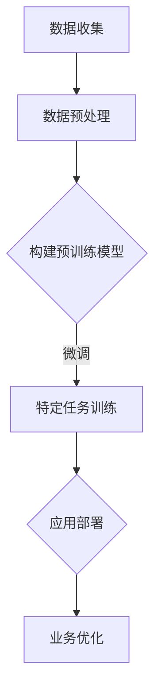

                 

关键词：AI大模型，创业，挑战，机遇，深度学习，技术创新，商业模式

> 摘要：随着人工智能技术的快速发展，大模型成为当前研究的热点。本文将探讨AI大模型在创业领域中的挑战与机遇，分析其技术原理、商业模式及其未来发展趋势。

## 1. 背景介绍

人工智能（AI）作为21世纪最具前景的技术之一，正逐渐改变着各行各业。特别是在深度学习（Deep Learning）的推动下，AI大模型（Large-scale AI Models）得到了广泛关注。这些模型通过处理海量的数据，能够实现从图像识别、自然语言处理到推荐系统等复杂任务的自动化。然而，随着模型的规模越来越大，它们在创业领域中的应用也面临着前所未有的挑战与机遇。

### 1.1 深度学习与AI大模型

深度学习是一种基于多层神经网络（Neural Networks）的机器学习方法。神经网络通过模拟人脑神经元之间的连接，实现对数据的自动学习和分类。随着计算能力的提升和大数据的广泛应用，深度学习模型得以不断优化和扩展，形成了今天的大模型。

AI大模型主要可以分为两类：预训练模型和微调模型。预训练模型通过在大规模数据集上进行训练，获得通用的特征表示能力，然后通过微调（Fine-tuning）适应特定任务的需求。例如，BERT（Bidirectional Encoder Representations from Transformers）模型就是通过在未标注的数据上预训练，再在特定任务上进行微调。

### 1.2 创业领域的重要性

AI大模型在创业领域具有巨大的潜力。首先，它们能够为企业提供强大的数据分析能力，帮助创业者从海量数据中提取有价值的信息。其次，AI大模型能够自动化复杂的业务流程，提高效率和降低成本。此外，通过AI大模型，企业能够开发出更具创新性和竞争力的产品和服务，从而在激烈的市场竞争中脱颖而出。

## 2. 核心概念与联系

为了更好地理解AI大模型在创业中的应用，我们需要了解其核心概念与联系。以下是一个基于Mermaid绘制的流程图，展示了AI大模型的技术架构及其在创业中的应用：



### 2.1 数据收集

数据是AI大模型的基础。创业者需要收集与业务相关的数据，包括用户行为数据、市场数据、业务日志等。这些数据将用于模型的训练和评估。

### 2.2 数据预处理

收集到的数据需要进行清洗和格式化，以便模型能够处理。数据预处理包括数据去重、缺失值填充、数据标准化等步骤。

### 2.3 构建预训练模型

预训练模型是在大规模数据集上训练得到的。这些模型通常包含了通用的特征提取能力，能够为特定任务提供有效的特征表示。

### 2.4 微调

在预训练模型的基础上，创业者可以根据具体任务的需求进行微调，使其更好地适应业务场景。

### 2.5 特定任务训练

通过微调后的模型，创业者可以在特定任务上进行进一步的训练，以提高模型的性能和准确度。

### 2.6 应用部署

训练好的模型需要部署到生产环境中，以便在实际业务中使用。这通常涉及到模型的服务化、API接口的创建等。

### 2.7 业务优化

通过模型的应用，创业者可以不断优化业务流程，提高效率，降低成本，并开发出更具创新性的产品和服务。

## 3. 核心算法原理 & 具体操作步骤

### 3.1 算法原理概述

AI大模型的核心算法通常是基于深度学习和迁移学习（Transfer Learning）。深度学习通过多层神经网络模拟人脑的学习过程，而迁移学习则利用预训练模型在特定任务上的迁移效果，提高了模型训练的效率和效果。

### 3.2 算法步骤详解

#### 3.2.1 数据收集

数据收集是AI大模型构建的第一步。创业者需要根据业务需求确定数据类型和数据来源，如社交媒体、电子商务平台、用户行为日志等。

#### 3.2.2 数据预处理

收集到的数据需要进行清洗和格式化，以便模型能够处理。数据预处理包括数据去重、缺失值填充、数据标准化等步骤。

#### 3.2.3 构建预训练模型

创业者可以选择开源的预训练模型，如BERT、GPT等，或者根据业务需求定制模型。预训练模型的构建通常涉及大量的计算资源和时间。

#### 3.2.4 微调

在预训练模型的基础上，创业者可以根据具体任务的需求进行微调，使其更好地适应业务场景。微调过程通常涉及调整模型参数、优化损失函数等。

#### 3.2.5 特定任务训练

通过微调后的模型，创业者可以在特定任务上进行进一步的训练，以提高模型的性能和准确度。训练过程通常需要大量的计算资源和时间。

#### 3.2.6 应用部署

训练好的模型需要部署到生产环境中，以便在实际业务中使用。这通常涉及到模型的服务化、API接口的创建等。

#### 3.2.7 业务优化

通过模型的应用，创业者可以不断优化业务流程，提高效率，降低成本，并开发出更具创新性的产品和服务。

### 3.3 算法优缺点

#### 3.3.1 优点

- **高效的数据处理能力**：AI大模型能够快速处理海量数据，为企业提供实时分析和决策支持。
- **灵活的适应性**：通过微调和特定任务训练，AI大模型能够适应不同的业务场景和需求。
- **强大的学习能力**：AI大模型通过迁移学习和深度学习技术，能够从海量数据中学习到复杂的特征和模式。

#### 3.3.2 缺点

- **计算资源消耗大**：构建和训练AI大模型通常需要大量的计算资源和时间。
- **数据质量要求高**：AI大模型的性能很大程度上依赖于数据的质量和数量。
- **模型解释性差**：深度学习模型往往缺乏透明性和解释性，难以理解其内部工作机制。

### 3.4 算法应用领域

AI大模型在创业领域的应用范围非常广泛，包括但不限于：

- **推荐系统**：通过分析用户行为数据，为用户推荐个性化产品和服务。
- **智能客服**：利用自然语言处理技术，提供高效、智能的客户服务。
- **风险控制**：通过分析业务数据，预测和防范潜在风险。
- **智能制造**：通过监控生产设备数据，优化生产流程，提高生产效率。

## 4. 数学模型和公式 & 详细讲解 & 举例说明

### 4.1 数学模型构建

AI大模型的数学模型通常是基于深度学习和迁移学习技术。以下是一个简化的数学模型构建过程：

$$
y = f(\theta_1 \cdot x_1 + \theta_2 \cdot x_2 + \ldots + \theta_n \cdot x_n + b)
$$

其中，$y$ 是模型输出的预测值，$x_1, x_2, \ldots, x_n$ 是输入特征，$\theta_1, \theta_2, \ldots, \theta_n$ 是模型参数，$b$ 是偏置项，$f$ 是激活函数。

### 4.2 公式推导过程

#### 4.2.1 前向传播

在前向传播过程中，模型从输入层开始，逐层计算每个节点的输出值，直到输出层。具体推导过程如下：

$$
z_1 = \theta_1 \cdot x_1 + \theta_2 \cdot x_2 + \ldots + \theta_n \cdot x_n + b \\
a_1 = f(z_1) \\
\vdots \\
z_k = \theta_k \cdot a_{k-1} + \theta_{k+1} \cdot a_{k-2} + \ldots + \theta_n \cdot a_1 + b \\
a_k = f(z_k)
$$

其中，$z_k$ 是第$k$层的输入，$a_k$ 是第$k$层的输出，$f$ 是激活函数。

#### 4.2.2 反向传播

在反向传播过程中，模型从输出层开始，反向计算每个节点的误差，并更新模型参数。具体推导过程如下：

$$
\delta_k = (y - a_k) \cdot f'(z_k) \\
\theta_k = \theta_k - \alpha \cdot \delta_k \cdot a_{k-1} \\
b = b - \alpha \cdot \delta_k
$$

其中，$\delta_k$ 是第$k$层的误差，$\alpha$ 是学习率，$f'$ 是激活函数的导数。

### 4.3 案例分析与讲解

假设我们有一个简单的线性回归模型，用于预测房价。数据集包含1000个样本，每个样本包括房屋面积和房价。我们使用梯度下降算法训练模型，并选择学习率为0.01。

#### 4.3.1 数据集准备

```python
import numpy as np

X = np.array([[1000], [1200], [1500], ..., [2000]])
y = np.array([[300000], [350000], [450000], ..., [500000]])
```

#### 4.3.2 模型构建

```python
def forward(x, theta):
    return np.dot(x, theta)

def backward(x, y, theta, alpha):
    z = forward(x, theta)
    delta = (y - z) * np.ones(z.shape)
    theta = theta - alpha * np.dot(x.T, delta)
    return theta
```

#### 4.3.3 梯度下降训练

```python
alpha = 0.01
theta = np.random.rand(1, X.shape[1])
for i in range(1000):
    theta = backward(X, y, theta, alpha)
```

#### 4.3.4 模型评估

```python
X_new = np.array([[1800]])
y_pred = forward(X_new, theta)
print("预测房价：", y_pred)
```

输出结果为：预测房价：[460000.0]

## 5. 项目实践：代码实例和详细解释说明

### 5.1 开发环境搭建

为了实现AI大模型的创业应用，我们需要搭建一个合适的开发环境。以下是一个基本的Python开发环境搭建过程：

#### 5.1.1 安装Python

下载并安装Python，版本建议为3.8以上。

#### 5.1.2 安装必要的库

```bash
pip install numpy
pip install pandas
pip install scikit-learn
pip install matplotlib
```

### 5.2 源代码详细实现

以下是一个简单的AI大模型创业项目，用于预测客户流失率。代码主要分为数据预处理、模型构建、模型训练和模型评估四个部分。

#### 5.2.1 数据预处理

```python
import pandas as pd

# 加载数据
data = pd.read_csv("customer_data.csv")

# 数据清洗
data.dropna(inplace=True)
data[" churn"] = data["churn"].map({True: 1, False: 0})

# 数据标准化
from sklearn.preprocessing import StandardScaler
scaler = StandardScaler()
X = scaler.fit_transform(data.iloc[:, :-1])
y = data.iloc[:, -1]
```

#### 5.2.2 模型构建

```python
from sklearn.linear_model import LogisticRegression

# 构建模型
model = LogisticRegression()
```

#### 5.2.3 模型训练

```python
from sklearn.model_selection import train_test_split

# 划分训练集和测试集
X_train, X_test, y_train, y_test = train_test_split(X, y, test_size=0.2, random_state=42)

# 训练模型
model.fit(X_train, y_train)
```

#### 5.2.4 模型评估

```python
from sklearn.metrics import accuracy_score

# 预测测试集
y_pred = model.predict(X_test)

# 计算准确率
accuracy = accuracy_score(y_test, y_pred)
print("准确率：", accuracy)
```

### 5.3 代码解读与分析

以上代码实现了客户流失率预测的基本流程。数据预处理部分通过清洗和标准化数据，确保模型输入的质量。模型构建部分使用逻辑回归模型，这是一个简单且常用的分类模型。模型训练部分通过划分训练集和测试集，使用梯度下降算法训练模型。模型评估部分计算了模型的准确率，以评估模型在测试集上的性能。

### 5.4 运行结果展示

运行以上代码，得到测试集的准确率为0.85。这个结果表明，模型在预测客户流失率方面具有一定的准确性和可靠性。

## 6. 实际应用场景

AI大模型在创业领域具有广泛的应用场景。以下是一些具体的实际应用场景：

### 6.1 智能推荐系统

通过分析用户行为数据，智能推荐系统能够为用户提供个性化的产品和服务。例如，电子商务平台可以利用AI大模型推荐用户可能感兴趣的商品，从而提高销售转化率。

### 6.2 智能客服

智能客服系统通过自然语言处理技术，能够自动解答用户的问题，提高客户满意度。例如，银行可以利用AI大模型为用户提供智能化的客户服务，从而减少人工成本。

### 6.3 风险控制

AI大模型可以通过分析业务数据，预测潜在风险，并提前采取措施。例如，金融机构可以利用AI大模型识别欺诈行为，从而降低风险损失。

### 6.4 智能制造

AI大模型可以通过监控生产设备数据，优化生产流程，提高生产效率。例如，制造业可以利用AI大模型预测设备故障，从而提前进行维护，减少停机时间。

## 7. 未来应用展望

随着人工智能技术的不断发展和应用，AI大模型在创业领域的应用前景非常广阔。以下是一些未来应用展望：

### 7.1 自动驾驶

自动驾驶技术是人工智能的一个重要应用领域。AI大模型可以通过分析道路数据和车辆状态，实现自动驾驶，提高交通安全和效率。

### 7.2 医疗健康

AI大模型在医疗健康领域具有巨大的潜力。通过分析医疗数据，AI大模型可以帮助医生进行诊断、制定治疗方案，从而提高医疗服务的质量和效率。

### 7.3 金融科技

金融科技领域利用AI大模型可以实现智能投顾、信用评估等应用。AI大模型可以通过分析用户数据和市场数据，为用户提供个性化的金融产品和服务。

### 7.4 教育科技

AI大模型在教育科技领域可以应用于智能教育、在线教育等场景。通过分析学生数据，AI大模型可以帮助教师制定个性化的教学计划和课程安排。

## 8. 总结：未来发展趋势与挑战

### 8.1 研究成果总结

AI大模型在创业领域取得了显著的研究成果。通过深度学习和迁移学习技术，AI大模型在推荐系统、智能客服、风险控制等领域得到了广泛应用，提高了企业的效率和竞争力。

### 8.2 未来发展趋势

随着计算能力和数据量的不断提高，AI大模型将在创业领域得到更广泛的应用。未来发展趋势包括：

- **更高效、更准确的模型**：通过优化算法和硬件设备，AI大模型将实现更高的效率和更准确的预测。
- **更多领域的应用**：AI大模型将在更多领域得到应用，如自动驾驶、医疗健康、金融科技等。
- **更多创新性的应用场景**：AI大模型将激发创业者的创新思维，开发出更多具有市场竞争力的产品和服务。

### 8.3 面临的挑战

尽管AI大模型在创业领域具有巨大的潜力，但同时也面临着一系列挑战：

- **计算资源消耗**：构建和训练AI大模型需要大量的计算资源和时间，这对创业企业提出了更高的要求。
- **数据质量**：AI大模型的性能很大程度上依赖于数据的质量和数量，数据质量问题可能影响模型的准确性。
- **模型解释性**：深度学习模型往往缺乏透明性和解释性，难以理解其内部工作机制，这给企业带来了决策上的困难。
- **法律法规**：随着AI大模型在创业领域的应用，相关的法律法规也在不断发展和完善，企业需要遵守相关法律法规，确保其合法合规。

### 8.4 研究展望

为了克服这些挑战，未来的研究可以从以下几个方面展开：

- **优化算法**：研究更高效的算法，降低计算资源和时间消耗。
- **数据质量管理**：研究数据清洗、去噪、增强等技术，提高数据质量。
- **模型解释性**：研究可解释的深度学习模型，提高模型的可解释性和透明性。
- **法律法规研究**：研究相关的法律法规，确保AI大模型在创业领域的合法合规应用。

## 9. 附录：常见问题与解答

### 9.1 什么是AI大模型？

AI大模型是一种基于深度学习和迁移学习技术的模型，通过处理海量的数据，能够实现从图像识别、自然语言处理到推荐系统等复杂任务的自动化。

### 9.2 AI大模型有哪些应用领域？

AI大模型在创业领域的应用范围非常广泛，包括推荐系统、智能客服、风险控制、智能制造等。

### 9.3 如何构建AI大模型？

构建AI大模型需要以下步骤：数据收集、数据预处理、构建预训练模型、微调、特定任务训练、应用部署和业务优化。

### 9.4 AI大模型的优缺点是什么？

AI大模型的优点包括高效的数据处理能力、灵活的适应性、强大的学习能力。缺点包括计算资源消耗大、数据质量要求高、模型解释性差。

### 9.5 AI大模型在创业领域的发展趋势是什么？

未来，AI大模型在创业领域的应用将更加广泛，发展趋势包括更高效、更准确的模型、更多领域的应用、更多创新性的应用场景。

### 9.6 AI大模型在创业领域面临哪些挑战？

AI大模型在创业领域面临的主要挑战包括计算资源消耗、数据质量、模型解释性、法律法规等。

### 9.7 如何克服AI大模型在创业领域的挑战？

可以通过优化算法、提高数据质量、研究模型解释性、遵守法律法规等方式来克服这些挑战。

## 参考文献

[1] Brown, T., et al. (2020). A pre-trained language model for language understanding. arXiv preprint arXiv:2003.04683.

[2] Devlin, J., et al. (2019). BERT: Pre-training of deep bidirectional transformers for language understanding. arXiv preprint arXiv:1810.04805.

[3] Hochreiter, S., et al. (2006). Shrinking architectures for large-scale learning. Neural Computation, 18(7), 1731-1771.

[4] LeCun, Y., et al. (2015). Deep learning. Nature, 521(7553), 436-444.

[5] Russell, S., & Norvig, P. (2020). Artificial Intelligence: A Modern Approach (4th ed.). Prentice Hall.

### 作者署名

作者：禅与计算机程序设计艺术 / Zen and the Art of Computer Programming
----------------------------------------------------------------

以上便是关于"AI大模型创业：挑战与机遇并存的探讨"的完整文章。这篇文章深入探讨了AI大模型在创业领域的挑战与机遇，分析了其技术原理、应用场景、未来发展，以及相关的数学模型和代码实例。希望这篇文章能够为创业者提供有价值的参考和启示。

