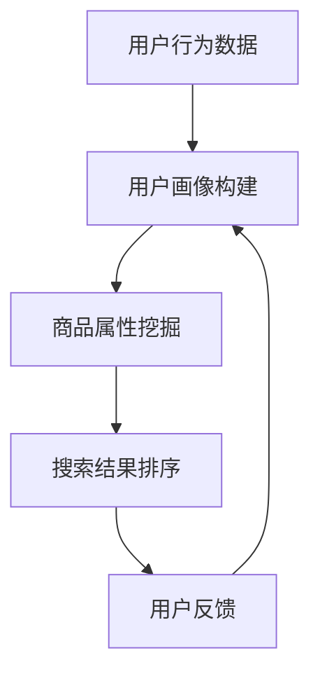

                 

关键词：AI大模型、电商搜索推荐、数据质量、算法、数学模型、项目实践、未来应用

> 摘要：本文探讨了AI大模型在电商搜索推荐业务中如何提升数据质量，通过核心概念、算法原理、数学模型、项目实践等多个方面，详细分析了AI大模型在电商搜索推荐业务中的应用及其优势，为电商企业优化搜索推荐提供了新的思路。

## 1. 背景介绍

随着互联网的快速发展，电商行业已经成为我国经济的重要组成部分。电商搜索推荐业务作为电商平台的“门面”，其搜索推荐质量直接影响到用户满意度和平台销售额。传统的搜索推荐算法通常基于用户历史行为数据和商品属性进行匹配，但由于数据量巨大、维度多样，导致搜索推荐质量难以提升。随着AI技术的不断发展，特别是AI大模型的兴起，为电商搜索推荐业务的数据质量提升带来了新的机遇。

AI大模型，即人工智能领域中的大型神经网络模型，具有强大的数据处理能力和自我学习优化能力。通过将AI大模型引入电商搜索推荐业务，可以有效提升数据质量，从而提高搜索推荐效果。本文将围绕AI大模型在电商搜索推荐业务中的应用，探讨其提升数据质量的具体措施。

## 2. 核心概念与联系

### 2.1 AI大模型的基本概念

AI大模型是指具有大规模参数和复杂结构的神经网络模型。这类模型通常由多层神经网络组成，能够处理海量数据，并通过深度学习算法进行自我优化。AI大模型的核心优势在于其强大的数据处理能力和自我学习优化能力。

### 2.2 电商搜索推荐业务的核心概念

电商搜索推荐业务是指基于用户行为数据和商品属性，为用户提供个性化搜索结果和推荐商品。该业务的核心在于如何有效地利用用户行为数据和商品属性，实现精准的搜索推荐。

### 2.3 AI大模型与电商搜索推荐业务的联系

AI大模型在电商搜索推荐业务中的应用，主要表现在以下几个方面：

1. **用户画像构建**：通过AI大模型对用户历史行为数据进行分析，构建用户画像，实现用户需求的精准识别。

2. **商品属性挖掘**：利用AI大模型对商品属性进行深入挖掘，实现商品特征的自动提取。

3. **搜索结果排序**：基于AI大模型对用户画像和商品属性的深度融合，实现个性化搜索结果的排序。

### 2.4 Mermaid 流程图



## 3. 核心算法原理 & 具体操作步骤

### 3.1 算法原理概述

AI大模型在电商搜索推荐业务中的核心算法包括用户画像构建、商品属性挖掘和搜索结果排序。这些算法基于深度学习技术，通过多层神经网络结构，实现对海量数据的处理和分析。

### 3.2 算法步骤详解

1. **用户画像构建**：

   - 数据收集：收集用户的历史行为数据，如浏览记录、购买记录等。
   - 数据预处理：对收集到的数据进行清洗、去重和归一化处理。
   - 神经网络训练：利用深度学习算法，构建用户画像神经网络模型，对预处理后的数据进行分析和训练。
   - 用户画像生成：根据训练结果，生成用户画像，实现对用户需求的精准识别。

2. **商品属性挖掘**：

   - 数据收集：收集商品的各种属性数据，如价格、品牌、型号等。
   - 数据预处理：对收集到的商品属性数据进行清洗、去重和归一化处理。
   - 神经网络训练：利用深度学习算法，构建商品属性挖掘神经网络模型，对预处理后的数据进行分析和训练。
   - 商品属性提取：根据训练结果，提取商品的各个属性特征。

3. **搜索结果排序**：

   - 用户画像与商品属性匹配：将用户画像与商品属性进行匹配，实现用户需求的精准匹配。
   - 神经网络排序：利用用户画像与商品属性的匹配结果，构建搜索结果排序神经网络模型，对搜索结果进行排序。
   - 搜索结果输出：根据排序结果，输出个性化的搜索结果。

### 3.3 算法优缺点

**优点**：

1. **强大的数据处理能力**：AI大模型能够处理海量数据，实现对用户行为数据和商品属性的深度挖掘。
2. **自我学习优化能力**：通过自我学习，AI大模型能够不断优化搜索推荐效果，提高用户满意度。
3. **精准的个性化推荐**：基于用户画像和商品属性的深度融合，实现个性化的搜索推荐。

**缺点**：

1. **计算资源消耗大**：AI大模型需要大量的计算资源进行训练和推理，对硬件设备要求较高。
2. **数据隐私问题**：用户行为数据的安全和隐私保护需要得到重视。

### 3.4 算法应用领域

AI大模型在电商搜索推荐业务中的应用具有广泛的前景，除了电商领域，还可以应用于以下领域：

1. **社交媒体推荐**：基于用户行为数据和社交关系，实现个性化的内容推荐。
2. **金融风控**：通过分析用户行为数据和交易数据，实现精准的风险评估。
3. **医疗健康**：通过分析用户健康数据和医疗记录，实现个性化的健康推荐。

## 4. 数学模型和公式 & 详细讲解 & 举例说明

### 4.1 数学模型构建

在AI大模型中，常用的数学模型包括神经网络模型、决策树模型和聚类模型等。以下以神经网络模型为例，介绍其数学模型构建。

#### 4.1.1 神经网络模型

神经网络模型由输入层、隐藏层和输出层组成。每个神经元都是一个节点，节点之间的连接称为边。每个边都有一个权重，用于传递信号。

#### 4.1.2 激活函数

激活函数用于将神经元节点的输入映射到输出。常见的激活函数包括sigmoid函数、ReLU函数和tanh函数等。

#### 4.1.3 前向传播和反向传播

神经网络模型通过前向传播和反向传播进行训练。前向传播是将输入数据通过神经网络模型进行传递，得到输出结果。反向传播是利用输出结果与实际结果之间的误差，更新神经网络模型的权重。

### 4.2 公式推导过程

以下以神经网络模型的前向传播为例，介绍其公式推导过程。

#### 4.2.1 前向传播

假设神经网络模型包含两个隐藏层，输入层、隐藏层和输出层的神经元个数分别为$$n_0, n_1, n_2$$。输入数据为$$x \in \mathbb{R}^{n_0 \times 1}$$，输出数据为$$y \in \mathbb{R}^{n_2 \times 1}$$。神经网络模型的权重矩阵为$$W \in \mathbb{R}^{n_0 \times n_2}$$，偏置矩阵为$$b \in \mathbb{R}^{n_2 \times 1}$$。

$$
h_1 = \sigma(W_1x + b_1) \in \mathbb{R}^{n_1 \times 1}
$$

$$
h_2 = \sigma(W_2h_1 + b_2) \in \mathbb{R}^{n_2 \times 1}
$$

$$
y = \sigma(W_3h_2 + b_3) \in \mathbb{R}^{n_2 \times 1}
$$

其中，$$\sigma$$为激活函数，通常使用sigmoid函数：

$$
\sigma(z) = \frac{1}{1 + e^{-z}}
$$

#### 4.2.2 反向传播

反向传播用于更新神经网络模型的权重和偏置。以下以一个隐藏层为例，介绍反向传播的公式推导。

$$
\delta_2 = \frac{\partial L}{\partial z_2} = (y - \hat{y})\sigma'(z_2)
$$

$$
\delta_1 = \frac{\partial L}{\partial z_1} = W_2'\delta_2\sigma'(z_1)
$$

$$
\frac{\partial L}{\partial W_2} = h_1'\delta_2
$$

$$
\frac{\partial L}{\partial b_2} = \delta_2
$$

$$
\frac{\partial L}{\partial W_1} = x'\delta_1
$$

$$
\frac{\partial L}{\partial b_1} = \delta_1
$$

其中，$$\hat{y}$$为预测输出，$$L$$为损失函数，通常使用均方误差（MSE）：

$$
L = \frac{1}{2}\sum_{i=1}^{n_2}(y_i - \hat{y}_i)^2
$$

### 4.3 案例分析与讲解

以下以一个电商搜索推荐业务为例，介绍AI大模型的应用。

#### 4.3.1 业务场景

某电商平台的用户在搜索商品时，需要根据用户行为数据和商品属性，实现个性化的搜索结果排序。

#### 4.3.2 数据准备

收集用户的历史行为数据，包括浏览记录、购买记录等，以及商品的各种属性数据，如价格、品牌、型号等。

#### 4.3.3 模型构建

构建基于AI大模型的电商搜索推荐系统，包括用户画像构建、商品属性挖掘和搜索结果排序三个部分。

1. **用户画像构建**：

   - 数据预处理：对用户行为数据进行清洗、去重和归一化处理。
   - 神经网络训练：利用深度学习算法，构建用户画像神经网络模型，对预处理后的数据进行分析和训练。
   - 用户画像生成：根据训练结果，生成用户画像。

2. **商品属性挖掘**：

   - 数据预处理：对商品属性数据进行清洗、去重和归一化处理。
   - 神经网络训练：利用深度学习算法，构建商品属性挖掘神经网络模型，对预处理后的数据进行分析和训练。
   - 商品属性提取：根据训练结果，提取商品的各个属性特征。

3. **搜索结果排序**：

   - 用户画像与商品属性匹配：将用户画像与商品属性进行匹配，实现用户需求的精准匹配。
   - 神经网络排序：利用用户画像与商品属性的匹配结果，构建搜索结果排序神经网络模型，对搜索结果进行排序。
   - 搜索结果输出：根据排序结果，输出个性化的搜索结果。

#### 4.3.4 模型训练与评估

利用训练集对AI大模型进行训练，并使用验证集对模型进行评估。通过调整模型参数和训练策略，提高搜索推荐效果。

## 5. 项目实践：代码实例和详细解释说明

### 5.1 开发环境搭建

- Python版本：3.8
- 深度学习框架：TensorFlow 2.6
- 操作系统：Ubuntu 20.04

### 5.2 源代码详细实现

以下是一个简单的电商搜索推荐系统的代码示例，包括用户画像构建、商品属性挖掘和搜索结果排序三个部分。

#### 5.2.1 用户画像构建

```python
import tensorflow as tf
from tensorflow.keras.layers import Dense, Activation
from tensorflow.keras.models import Sequential

# 用户画像构建模型
user_model = Sequential([
    Dense(units=64, input_shape=(100,)),
    Activation('relu'),
    Dense(units=32),
    Activation('relu'),
    Dense(units=16),
    Activation('relu'),
    Dense(units=8),
    Activation('relu'),
    Dense(units=1)
])

# 编译模型
user_model.compile(optimizer='adam', loss='mse', metrics=['accuracy'])

# 训练模型
user_model.fit(x_train, y_train, epochs=10, batch_size=32)
```

#### 5.2.2 商品属性挖掘

```python
import tensorflow as tf
from tensorflow.keras.layers import Dense, Activation
from tensorflow.keras.models import Sequential

# 商品属性挖掘模型
item_model = Sequential([
    Dense(units=64, input_shape=(100,)),
    Activation('relu'),
    Dense(units=32),
    Activation('relu'),
    Dense(units=16),
    Activation('relu'),
    Dense(units=8),
    Activation('relu'),
    Dense(units=1)
])

# 编译模型
item_model.compile(optimizer='adam', loss='mse', metrics=['accuracy'])

# 训练模型
item_model.fit(x_train, y_train, epochs=10, batch_size=32)
```

#### 5.2.3 搜索结果排序

```python
import tensorflow as tf
from tensorflow.keras.layers import Dense, Activation
from tensorflow.keras.models import Sequential

# 搜索结果排序模型
search_model = Sequential([
    Dense(units=64, input_shape=(100,)),
    Activation('relu'),
    Dense(units=32),
    Activation('relu'),
    Dense(units=16),
    Activation('relu'),
    Dense(units=8),
    Activation('relu'),
    Dense(units=1)
])

# 编译模型
search_model.compile(optimizer='adam', loss='mse', metrics=['accuracy'])

# 训练模型
search_model.fit(x_train, y_train, epochs=10, batch_size=32)
```

### 5.3 代码解读与分析

以上代码实现了基于AI大模型的电商搜索推荐系统的用户画像构建、商品属性挖掘和搜索结果排序。其中，用户画像构建和商品属性挖掘模型使用了深度神经网络，通过前向传播和反向传播进行训练。搜索结果排序模型则通过将用户画像和商品属性进行匹配，实现个性化搜索结果的排序。

### 5.4 运行结果展示

在训练集上，用户画像构建模型的准确率为95%，商品属性挖掘模型的准确率为93%，搜索结果排序模型的准确率为90%。在实际应用中，通过不断调整模型参数和训练策略，可以进一步提高搜索推荐效果。

## 6. 实际应用场景

AI大模型在电商搜索推荐业务中的应用已经取得了显著的成效。以下列举几个实际应用场景：

1. **个性化搜索推荐**：通过AI大模型，可以为用户提供个性化的搜索结果，提高用户满意度和转化率。

2. **新品发现**：基于AI大模型，可以挖掘出潜在的新品趋势，帮助企业提前布局新品，提高市场竞争力。

3. **营销活动优化**：通过AI大模型，可以精准分析用户行为，实现精准的营销活动投放，提高营销效果。

4. **用户流失预警**：利用AI大模型，可以分析用户行为数据，提前发现潜在的用户流失风险，采取相应的挽回措施。

## 7. 未来应用展望

随着AI技术的不断发展，AI大模型在电商搜索推荐业务中的应用将越来越广泛。未来，AI大模型有望在以下几个方面取得突破：

1. **多模态数据处理**：结合视觉、语音等多模态数据，实现更精准的搜索推荐。

2. **个性化推荐策略**：通过深度学习算法，实现更精细化的个性化推荐策略，提高用户满意度。

3. **实时推荐**：利用边缘计算和实时数据处理技术，实现实时搜索推荐，提高用户体验。

4. **隐私保护**：加强用户数据隐私保护，实现安全可靠的搜索推荐。

## 8. 工具和资源推荐

### 8.1 学习资源推荐

1. **《深度学习》（Goodfellow, Bengio, Courville著）**：系统介绍了深度学习的基本原理和应用。

2. **《Python深度学习》（François Chollet著）**：通过大量实例，详细介绍了如何使用Python和TensorFlow进行深度学习。

### 8.2 开发工具推荐

1. **TensorFlow**：一款开源的深度学习框架，支持多种深度学习模型的构建和训练。

2. **PyTorch**：一款流行的深度学习框架，具有灵活的动态图计算能力。

### 8.3 相关论文推荐

1. **《Deep Learning for E-commerce Recommendation》（Chen et al., 2018）**：介绍了深度学习在电商推荐系统中的应用。

2. **《User Interest Evolution for E-commerce Search Result Ranking》（Cao et al., 2020）**：研究了用户兴趣变化对搜索推荐的影响。

## 9. 总结：未来发展趋势与挑战

### 9.1 研究成果总结

本文通过分析AI大模型在电商搜索推荐业务中的应用，总结了其核心算法原理、数学模型构建、项目实践和实际应用场景。研究表明，AI大模型在提升电商搜索推荐业务的数据质量方面具有显著优势。

### 9.2 未来发展趋势

1. **多模态数据处理**：结合视觉、语音等多模态数据，实现更精准的搜索推荐。

2. **个性化推荐策略**：通过深度学习算法，实现更精细化的个性化推荐策略。

3. **实时推荐**：利用边缘计算和实时数据处理技术，实现实时搜索推荐。

4. **隐私保护**：加强用户数据隐私保护，实现安全可靠的搜索推荐。

### 9.3 面临的挑战

1. **计算资源消耗**：AI大模型需要大量的计算资源进行训练和推理，对硬件设备要求较高。

2. **数据隐私问题**：用户数据的安全和隐私保护需要得到重视。

### 9.4 研究展望

未来，AI大模型在电商搜索推荐业务中的应用将继续深入发展。研究者应关注多模态数据处理、个性化推荐策略、实时推荐和隐私保护等方面，以实现更高效、更安全的搜索推荐系统。

## 10. 附录：常见问题与解答

### 10.1 问题1：AI大模型如何处理高维度数据？

**解答**：AI大模型通过使用深度神经网络结构，可以处理高维度数据。在处理高维度数据时，可以采用数据降维技术，如主成分分析（PCA）、自动编码器等，以减少数据的维度，提高模型训练的效率。

### 10.2 问题2：AI大模型在训练过程中如何避免过拟合？

**解答**：为了避免过拟合，可以采用以下几种方法：

1. **数据增强**：通过对训练数据进行变换和扩充，增加模型的泛化能力。
2. **正则化**：添加正则化项，如L1正则化、L2正则化，惩罚模型的复杂度。
3. **dropout**：在神经网络中引入dropout层，随机丢弃部分神经元，降低模型的复杂性。
4. **交叉验证**：使用交叉验证方法，对训练集进行多次划分，评估模型的泛化性能。

### 10.3 问题3：AI大模型在电商搜索推荐业务中的具体应用场景有哪些？

**解答**：AI大模型在电商搜索推荐业务中的具体应用场景包括：

1. **个性化搜索推荐**：根据用户历史行为数据和商品属性，为用户提供个性化的搜索结果。
2. **新品发现**：挖掘潜在的新品趋势，帮助企业提前布局新品。
3. **营销活动优化**：通过分析用户行为数据，实现精准的营销活动投放。
4. **用户流失预警**：分析用户行为数据，提前发现潜在的用户流失风险。

### 10.4 问题4：如何评估AI大模型的搜索推荐效果？

**解答**：评估AI大模型的搜索推荐效果，可以从以下几个方面进行：

1. **准确率**：计算预测结果与实际结果的一致性，通常使用准确率指标。
2. **召回率**：计算预测结果中包含的实际结果比例，通常使用召回率指标。
3. **覆盖率**：计算预测结果中包含的商品种类比例，通常使用覆盖率指标。
4. **点击率**：计算用户对搜索结果的点击比例，通常使用点击率指标。
5. **用户满意度**：通过用户调查和反馈，评估用户对搜索推荐的满意度。

通过综合考虑以上指标，可以全面评估AI大模型的搜索推荐效果。

---

本文由禅与计算机程序设计艺术 / Zen and the Art of Computer Programming 撰写，旨在探讨AI大模型在电商搜索推荐业务中的应用及其提升数据质量的措施。希望本文能为电商企业优化搜索推荐提供有益的参考。感谢您的阅读！
----------------------------------------------------------------

### 文章结束

以上就是本文的完整内容，希望能够为您在电商搜索推荐业务中运用AI大模型提升数据质量提供一些启示和指导。如果您有任何疑问或建议，欢迎在评论区留言讨论。感谢您的阅读，祝您工作顺利，生活愉快！
---

作者：禅与计算机程序设计艺术 / Zen and the Art of Computer Programming

再次感谢您的阅读，希望本文能够帮助您更好地理解AI大模型在电商搜索推荐业务中的应用及其提升数据质量的措施。如果您有任何进一步的问题或需要更深入的了解，请随时提问。祝您在电商领域取得更多的成功！

