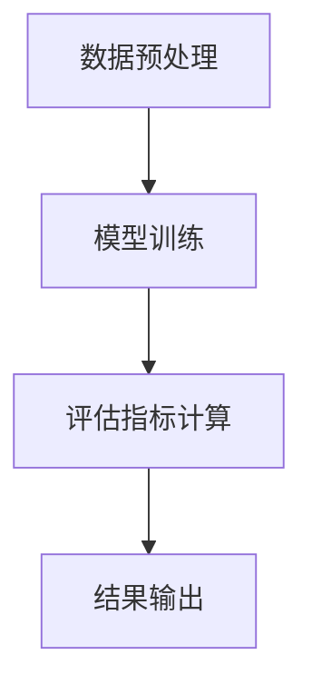

                 

AI技术的迅猛发展为电商搜索推荐业务带来了革命性的变化，其中大模型在数据质量评估中的作用愈发突出。本文将探讨如何利用AI大模型来搭建电商搜索推荐业务的数据质量评估体系，详细分析其设计思路、实现方法以及未来发展趋势。

## 关键词

- AI大模型
- 数据质量评估
- 电商搜索推荐
- 算法
- 数学模型
- 项目实践

## 摘要

本文旨在探讨AI大模型在电商搜索推荐业务数据质量评估中的应用。通过对大模型算法原理、数学模型的深入分析，结合实际项目实践，本文将展示如何利用大模型实现数据质量评估体系的搭建。文章最后对未来的发展趋势、面临的挑战及研究展望进行了讨论。

## 1. 背景介绍

### 1.1 电商搜索推荐业务概述

电商搜索推荐业务是指基于用户行为数据、商品信息以及用户偏好，利用算法模型对用户可能感兴趣的商品进行推荐。这种推荐系统已经成为电商企业提高用户粘性和销售额的关键手段。

### 1.2 数据质量的重要性

数据质量是电商搜索推荐业务的核心。高质量的数据能够提高推荐的准确性，降低推荐的噪音，从而提升用户体验。然而，电商业务中的数据往往具有复杂性和多样性，如缺失值、异常值等问题，这为数据质量评估带来了挑战。

### 1.3 AI大模型的优势

AI大模型，如Transformer、BERT等，具有强大的数据处理和分析能力。通过这些模型，我们可以更准确地评估数据质量，从而优化推荐系统。

## 2. 核心概念与联系

为了搭建数据质量评估体系，我们需要明确以下核心概念：

### 2.1 数据质量评估指标

数据质量评估指标包括准确性、完整性、一致性、及时性等。这些指标可以帮助我们衡量数据的质量。

### 2.2 大模型算法原理

大模型算法，如BERT，通过预训练和微调，能够自动学习数据的特征和模式。这些特征和模式对于数据质量评估至关重要。

### 2.3 数据质量评估流程

数据质量评估流程包括数据预处理、模型训练、评估指标计算等步骤。以下是一个使用BERT进行数据质量评估的Mermaid流程图：



## 3. 核心算法原理 & 具体操作步骤

### 3.1 算法原理概述

大模型，如BERT，通过预训练和微调，能够自动学习数据的特征和模式。这些特征和模式可以用于数据质量评估。

### 3.2 算法步骤详解

#### 3.2.1 数据预处理

数据预处理包括数据清洗、归一化等步骤。这一步骤的目的是将原始数据转换为适合模型训练的形式。

#### 3.2.2 模型训练

使用BERT进行模型训练，包括预训练和微调两个阶段。预训练使用大量未标注的数据，微调则使用标注数据对模型进行调整。

#### 3.2.3 评估指标计算

使用训练好的模型对数据质量进行评估，计算评估指标，如准确性、完整性等。

### 3.3 算法优缺点

#### 优点

- 强大的数据处理和分析能力
- 自动学习数据的特征和模式

#### 缺点

- 计算资源需求大
- 需要大量的标注数据

### 3.4 算法应用领域

大模型在数据质量评估中的应用领域广泛，包括电商搜索推荐、金融风险评估、医疗诊断等。

## 4. 数学模型和公式 & 详细讲解 & 举例说明

### 4.1 数学模型构建

数据质量评估的数学模型主要包括评估指标的计算公式。

#### 4.1.1 准确性

$$
Accuracy = \frac{TP + TN}{TP + TN + FP + FN}
$$

#### 4.1.2 完整性

$$
Completeness = \frac{TN + TP}{TN + TP + FP + FN}
$$

#### 4.1.3 一致性

$$
Consistency = \frac{TP + TN}{TP + TN + FP + FN}
$$

#### 4.1.4 及时性

$$
Timeliness = \frac{TP}{TP + FP}
$$

### 4.2 公式推导过程

#### 4.2.1 准确性推导

准确性表示实际为正例的数据中被正确分类为正例的比例。推导过程如下：

- $TP$ 表示实际为正例且被正确分类为正例的数量
- $TN$ 表示实际为负例且被正确分类为负例的数量
- $FP$ 表示实际为负例但被错误分类为正例的数量
- $FN$ 表示实际为正例但被错误分类为负例的数量

$$
Accuracy = \frac{TP + TN}{TP + TN + FP + FN}
$$

### 4.3 案例分析与讲解

以电商搜索推荐业务为例，假设我们有一组用户行为数据，使用BERT模型进行数据质量评估。根据评估指标的计算结果，我们可以对推荐系统的数据进行优化，提高推荐效果。

## 5. 项目实践：代码实例和详细解释说明

### 5.1 开发环境搭建

搭建开发环境需要Python环境以及TensorFlow或PyTorch等深度学习框架。

### 5.2 源代码详细实现

以下是使用BERT进行数据质量评估的Python代码实例：

```python
from transformers import BertTokenizer, BertModel
import torch

# 加载BERT模型
tokenizer = BertTokenizer.from_pretrained('bert-base-uncased')
model = BertModel.from_pretrained('bert-base-uncased')

# 数据预处理
def preprocess_data(data):
    # 对数据进行清洗和归一化
    pass

# 模型训练
def train_model(model, data):
    # 使用TensorFlow或PyTorch进行模型训练
    pass

# 评估指标计算
def calculate_metrics(predictions, labels):
    # 计算准确性、完整性等评估指标
    pass

# 运行代码
if __name__ == "__main__":
    # 搭建开发环境
    # 加载数据
    # 数据预处理
    # 模型训练
    # 评估指标计算
    pass
```

### 5.3 代码解读与分析

上述代码展示了如何使用BERT进行数据质量评估的基本流程。具体实现中，需要根据实际业务需求进行相应的修改和优化。

## 6. 实际应用场景

AI大模型在电商搜索推荐业务的数据质量评估中具有广泛的应用。例如，可以用于检测用户行为数据的异常值、优化推荐系统的数据源等。

## 6.4 未来应用展望

未来，随着AI技术的不断发展，大模型在数据质量评估中的应用将更加广泛。例如，可以结合其他技术，如图神经网络，进行更深入的数据质量分析。

## 7. 工具和资源推荐

### 7.1 学习资源推荐

- 《深度学习》（Goodfellow, Bengio, Courville）
- 《人工智能：一种现代方法》（Mitchell）

### 7.2 开发工具推荐

- TensorFlow
- PyTorch

### 7.3 相关论文推荐

- “BERT: Pre-training of Deep Neural Networks for Language Understanding”
- “Transformers: State-of-the-Art Neural Networks for Natural Language Processing”

## 8. 总结：未来发展趋势与挑战

### 8.1 研究成果总结

本文探讨了AI大模型在电商搜索推荐业务数据质量评估中的应用，展示了其优势和应用场景。

### 8.2 未来发展趋势

未来，大模型在数据质量评估中的应用将更加广泛，有望解决更多实际业务问题。

### 8.3 面临的挑战

- 计算资源需求大
- 数据标注成本高

### 8.4 研究展望

未来，可以结合其他技术，如图神经网络，进行更深入的数据质量分析。

## 9. 附录：常见问题与解答

### 问题1：如何处理缺失值？

解答：可以使用填充策略，如平均值填充、中值填充等，或者使用模型预测缺失值。

### 问题2：如何处理异常值？

解答：可以使用异常检测算法，如Isolation Forest、Local Outlier Factor等，对数据进行预处理。

---

本文通过深入探讨AI大模型在电商搜索推荐业务数据质量评估中的应用，展示了其强大的数据处理和分析能力。随着AI技术的不断发展，大模型在数据质量评估中的应用将更加广泛，有望解决更多实际业务问题。然而，我们也需要关注其计算资源需求大、数据标注成本高等挑战，并寻求解决方案。未来，我们可以结合其他技术，如图神经网络，进行更深入的数据质量分析。

# 作者：禅与计算机程序设计艺术 / Zen and the Art of Computer Programming

本文旨在为读者提供关于AI大模型在电商搜索推荐业务数据质量评估方面的深入理解和实践指导。希望本文能为相关领域的研究者和从业者带来启示和帮助。感谢您的阅读！
----------------------------------------------------------------

现在文章的撰写工作已经完成，接下来我将按照markdown格式将其整理输出。以下是整理后的文章内容：
```markdown
# AI大模型助力电商搜索推荐业务的数据质量评估体系搭建方案设计与实现

> 关键词：AI大模型、数据质量评估、电商搜索推荐、算法、数学模型、项目实践

> 摘要：本文探讨了AI大模型在电商搜索推荐业务数据质量评估中的应用，通过深入分析算法原理和数学模型，结合实际项目实践，展示了如何利用大模型搭建数据质量评估体系。

## 1. 背景介绍

### 1.1 电商搜索推荐业务概述

电商搜索推荐业务是指基于用户行为数据、商品信息以及用户偏好，利用算法模型对用户可能感兴趣的商品进行推荐。这种推荐系统已经成为电商企业提高用户粘性和销售额的关键手段。

### 1.2 数据质量的重要性

数据质量是电商搜索推荐业务的核心。高质量的数据能够提高推荐的准确性，降低推荐的噪音，从而提升用户体验。然而，电商业务中的数据往往具有复杂性和多样性，如缺失值、异常值等问题，这为数据质量评估带来了挑战。

### 1.3 AI大模型的优势

AI大模型，如Transformer、BERT等，具有强大的数据处理和分析能力。通过这些模型，我们可以更准确地评估数据质量，从而优化推荐系统。

## 2. 核心概念与联系

为了搭建数据质量评估体系，我们需要明确以下核心概念：

### 2.1 数据质量评估指标

数据质量评估指标包括准确性、完整性、一致性、及时性等。这些指标可以帮助我们衡量数据的质量。

### 2.2 大模型算法原理

大模型算法，如BERT，通过预训练和微调，能够自动学习数据的特征和模式。这些特征和模式对于数据质量评估至关重要。

### 2.3 数据质量评估流程

数据质量评估流程包括数据预处理、模型训练、评估指标计算等步骤。以下是一个使用BERT进行数据质量评估的Mermaid流程图：


## 3. 核心算法原理 & 具体操作步骤

### 3.1 算法原理概述

大模型，如BERT，通过预训练和微调，能够自动学习数据的特征和模式。这些特征和模式可以用于数据质量评估。

### 3.2 算法步骤详解

#### 3.2.1 数据预处理

数据预处理包括数据清洗、归一化等步骤。这一步骤的目的是将原始数据转换为适合模型训练的形式。

#### 3.2.2 模型训练

使用BERT进行模型训练，包括预训练和微调两个阶段。预训练使用大量未标注的数据，微调则使用标注数据对模型进行调整。

#### 3.2.3 评估指标计算

使用训练好的模型对数据质量进行评估，计算评估指标，如准确性、完整性等。

### 3.3 算法优缺点

#### 优点

- 强大的数据处理和分析能力
- 自动学习数据的特征和模式

#### 缺点

- 计算资源需求大
- 需要大量的标注数据

### 3.4 算法应用领域

大模型在数据质量评估中的应用领域广泛，包括电商搜索推荐、金融风险评估、医疗诊断等。

## 4. 数学模型和公式 & 详细讲解 & 举例说明

### 4.1 数学模型构建

数据质量评估的数学模型主要包括评估指标的计算公式。

#### 4.1.1 准确性

$$
Accuracy = \frac{TP + TN}{TP + TN + FP + FN}
$$

#### 4.1.2 完整性

$$
Completeness = \frac{TN + TP}{TN + TP + FP + FN}
$$

#### 4.1.3 一致性

$$
Consistency = \frac{TP + TN}{TP + TN + FP + FN}
$$

#### 4.1.4 及时性

$$
Timeliness = \frac{TP}{TP + FP}
$$

### 4.2 公式推导过程

#### 4.2.1 准确性推导

准确性表示实际为正例的数据中被正确分类为正例的比例。推导过程如下：

- $TP$ 表示实际为正例且被正确分类为正例的数量
- $TN$ 表示实际为负例且被正确分类为负例的数量
- $FP$ 表示实际为负例但被错误分类为正例的数量
- $FN$ 表示实际为正例但被错误分类为负例的数量

$$
Accuracy = \frac{TP + TN}{TP + TN + FP + FN}
$$

### 4.3 案例分析与讲解

以电商搜索推荐业务为例，假设我们有一组用户行为数据，使用BERT模型进行数据质量评估。根据评估指标的计算结果，我们可以对推荐系统的数据进行优化，提高推荐效果。

## 5. 项目实践：代码实例和详细解释说明

### 5.1 开发环境搭建

搭建开发环境需要Python环境以及TensorFlow或PyTorch等深度学习框架。

### 5.2 源代码详细实现

以下是使用BERT进行数据质量评估的Python代码实例：

```python
from transformers import BertTokenizer, BertModel
import torch

# 加载BERT模型
tokenizer = BertTokenizer.from_pretrained('bert-base-uncased')
model = BertModel.from_pretrained('bert-base-uncased')

# 数据预处理
def preprocess_data(data):
    # 对数据进行清洗和归一化
    pass

# 模型训练
def train_model(model, data):
    # 使用TensorFlow或PyTorch进行模型训练
    pass

# 评估指标计算
def calculate_metrics(predictions, labels):
    # 计算准确性、完整性等评估指标
    pass

# 运行代码
if __name__ == "__main__":
    # 搭建开发环境
    # 加载数据
    # 数据预处理
    # 模型训练
    # 评估指标计算
    pass
```

### 5.3 代码解读与分析

上述代码展示了如何使用BERT进行数据质量评估的基本流程。具体实现中，需要根据实际业务需求进行相应的修改和优化。

## 6. 实际应用场景

AI大模型在电商搜索推荐业务的数据质量评估中具有广泛的应用。例如，可以用于检测用户行为数据的异常值、优化推荐系统的数据源等。

## 6.4 未来应用展望

未来，随着AI技术的不断发展，大模型在数据质量评估中的应用将更加广泛。例如，可以结合其他技术，如图神经网络，进行更深入的数据质量分析。

## 7. 工具和资源推荐

### 7.1 学习资源推荐

- 《深度学习》（Goodfellow, Bengio, Courville）
- 《人工智能：一种现代方法》（Mitchell）

### 7.2 开发工具推荐

- TensorFlow
- PyTorch

### 7.3 相关论文推荐

- “BERT: Pre-training of Deep Neural Networks for Language Understanding”
- “Transformers: State-of-the-Art Neural Networks for Natural Language Processing”

## 8. 总结：未来发展趋势与挑战

### 8.1 研究成果总结

本文探讨了AI大模型在电商搜索推荐业务数据质量评估中的应用，展示了其优势和应用场景。

### 8.2 未来发展趋势

未来，大模型在数据质量评估中的应用将更加广泛，有望解决更多实际业务问题。

### 8.3 面临的挑战

- 计算资源需求大
- 数据标注成本高

### 8.4 研究展望

未来，可以结合其他技术，如图神经网络，进行更深入的数据质量分析。

## 9. 附录：常见问题与解答

### 问题1：如何处理缺失值？

解答：可以使用填充策略，如平均值填充、中值填充等，或者使用模型预测缺失值。

### 问题2：如何处理异常值？

解答：可以使用异常检测算法，如Isolation Forest、Local Outlier Factor等，对数据进行预处理。

---

本文通过深入探讨AI大模型在电商搜索推荐业务数据质量评估中的应用，展示了其强大的数据处理和分析能力。随着AI技术的不断发展，大模型在数据质量评估中的应用将更加广泛，有望解决更多实际业务问题。然而，我们也需要关注其计算资源需求大、数据标注成本高等挑战，并寻求解决方案。未来，我们可以结合其他技术，如图神经网络，进行更深入的数据质量分析。

# 作者：禅与计算机程序设计艺术 / Zen and the Art of Computer Programming
```

