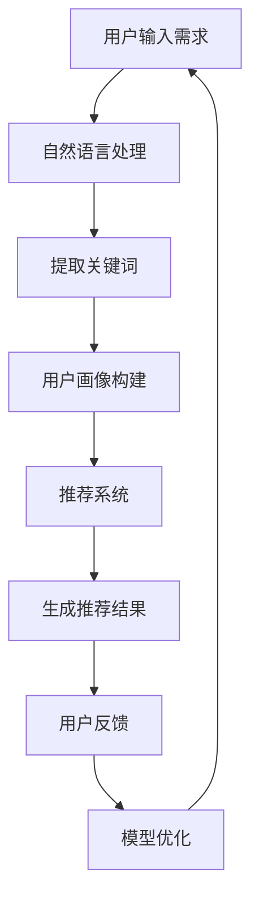

                 

关键词：人工智能，个性化旅游，大模型，自然语言处理，推荐系统，深度学习

> 摘要：本文探讨了人工智能大模型在个性化旅游中的应用，通过自然语言处理、推荐系统和深度学习等技术手段，实现了根据用户偏好和旅游历史数据，为游客提供个性化旅游推荐方案的创新解决方案。

## 1. 背景介绍

随着互联网技术的发展，旅游业也迎来了新的变革。传统的旅游服务往往难以满足个性化需求，游客需要在海量的信息中寻找符合自己喜好的旅游目的地和活动。为了解决这一问题，人工智能（AI）技术逐渐成为旅游行业发展的新引擎。

近年来，大模型在AI领域取得了显著进展，如GPT、BERT等，这些模型具有强大的语义理解能力和文本生成能力，可以处理复杂的自然语言任务。与此同时，推荐系统技术也日趋成熟，通过分析用户行为数据，为用户提供个性化的推荐服务。将大模型与推荐系统结合，可以为个性化旅游提供一种全新的解决方案。

本文将介绍如何利用人工智能大模型在个性化旅游中的创新应用，通过自然语言处理、推荐系统和深度学习等技术手段，为游客提供精准的旅游推荐方案。

## 2. 核心概念与联系

### 2.1 大模型

大模型是指参数规模巨大的神经网络模型，如GPT、BERT等。这些模型通过在大规模数据集上进行预训练，获得了强大的语义理解能力和文本生成能力。

### 2.2 自然语言处理

自然语言处理（NLP）是研究如何让计算机理解、生成和处理自然语言的技术。在个性化旅游中，NLP技术用于理解用户输入的文本信息，如旅游需求、评论等。

### 2.3 推荐系统

推荐系统是一种基于用户行为数据，为用户推荐个性化内容的系统。在个性化旅游中，推荐系统用于根据用户偏好和旅游历史数据，为游客推荐符合他们需求的旅游目的地和活动。

### 2.4 深度学习

深度学习是一种基于人工神经网络的机器学习技术，具有强大的特征提取和模式识别能力。在个性化旅游中，深度学习技术用于分析用户数据，提取用户兴趣特征，为推荐系统提供支持。

### 2.5 Mermaid 流程图

以下是AI大模型在个性化旅游中的应用流程图：



## 3. 核心算法原理 & 具体操作步骤

### 3.1 算法原理概述

本文的核心算法主要包括自然语言处理、用户画像构建、推荐系统和模型优化四个部分。

- **自然语言处理**：通过大模型对用户输入的文本信息进行理解和分析，提取关键词和语义。
- **用户画像构建**：基于用户行为数据，利用深度学习技术对用户兴趣特征进行提取和建模。
- **推荐系统**：根据用户画像和旅游资源信息，为用户生成个性化的旅游推荐结果。
- **模型优化**：通过用户反馈，对推荐模型进行迭代优化，提高推荐效果。

### 3.2 算法步骤详解

1. **用户输入需求**：用户通过文本输入自己的旅游需求，如“我想去一个风景优美、历史悠久的地方度假”。

2. **自然语言处理**：大模型对用户输入的文本信息进行理解和分析，提取关键词和语义。例如，提取出“风景优美”、“历史悠久”等关键词。

3. **用户画像构建**：利用深度学习技术，对用户的历史行为数据进行处理，提取用户兴趣特征。例如，如果用户经常浏览历史古迹，则将其标记为对历史感兴趣的游客。

4. **推荐系统**：根据用户画像和旅游资源信息，为用户生成个性化的旅游推荐结果。例如，推荐具有“风景优美”、“历史悠久”特点的旅游目的地。

5. **用户反馈**：用户对推荐结果进行评价，如满意、不满意等。

6. **模型优化**：根据用户反馈，对推荐模型进行迭代优化，提高推荐效果。

### 3.3 算法优缺点

**优点**：

- **高精度**：大模型具有强大的语义理解能力，可以准确提取用户需求和信息。
- **个性化**：基于用户画像的推荐系统可以满足用户的个性化需求。
- **实时性**：通过深度学习技术，模型可以快速适应用户行为的变化。

**缺点**：

- **数据依赖性**：推荐系统需要大量的用户行为数据作为支撑，数据质量对推荐效果有较大影响。
- **计算资源消耗**：大模型训练和推理需要大量的计算资源。

### 3.4 算法应用领域

- **个性化旅游推荐**：为用户提供符合个人兴趣和需求的旅游目的地和活动推荐。
- **智能旅游规划**：根据用户需求和偏好，自动生成旅游规划方案。
- **旅游数据分析**：分析用户行为数据，挖掘旅游行业趋势和用户需求。

## 4. 数学模型和公式 & 详细讲解 & 举例说明

### 4.1 数学模型构建

在个性化旅游推荐中，数学模型主要分为两部分：用户画像建模和推荐模型。

#### 4.1.1 用户画像建模

用户画像建模的核心是利用深度学习技术提取用户兴趣特征。假设用户兴趣特征向量为\( \mathbf{u} \)，旅游资源特征向量为\( \mathbf{r} \)，则用户兴趣特征向量可以表示为：

$$
\mathbf{u} = \text{CNN}(\mathbf{X})
$$

其中，\( \mathbf{X} \)为用户历史行为数据，如浏览记录、搜索记录等。CNN（卷积神经网络）用于提取用户兴趣特征。

#### 4.1.2 推荐模型

推荐模型采用基于矩阵分解的协同过滤算法。假设用户对旅游资源的评分向量为\( \mathbf{R} \)，则推荐结果可以表示为：

$$
\mathbf{R}_{\hat{u}}^* = \mathbf{U}\mathbf{V}^T
$$

其中，\( \mathbf{U} \)和\( \mathbf{V} \)分别为用户和旅游资源的低维特征向量。

### 4.2 公式推导过程

#### 4.2.1 用户画像建模推导

假设用户历史行为数据\( \mathbf{X} \)为一个\( n \times m \)的矩阵，其中\( n \)为用户数量，\( m \)为行为类型。卷积神经网络（CNN）用于提取用户兴趣特征，可以表示为：

$$
\mathbf{h}^{(l)} = \text{ReLU}(\mathbf{W}^{(l)} \mathbf{h}^{(l-1)} + \mathbf{b}^{(l)})
$$

其中，\( \mathbf{h}^{(l)} \)为第\( l \)层的特征向量，\( \mathbf{W}^{(l)} \)和\( \mathbf{b}^{(l)} \)分别为权重和偏置。

通过多层的卷积和池化操作，可以提取用户兴趣特征：

$$
\mathbf{u} = \text{CNN}(\mathbf{X}) = \text{ReLU}(\mathbf{W}_3 \text{ReLU}(\mathbf{W}_2 \text{ReLU}(\mathbf{W}_1 \mathbf{X} + \mathbf{b}_1) + \mathbf{b}_2) + \mathbf{b}_3)
$$

#### 4.2.2 推荐模型推导

基于矩阵分解的协同过滤算法可以表示为：

$$
\mathbf{R}_{\hat{u}}^* = \mathbf{U}\mathbf{V}^T
$$

其中，\( \mathbf{U} \)和\( \mathbf{V} \)分别为用户和旅游资源的低维特征向量。为了得到\( \mathbf{U} \)和\( \mathbf{V} \)，可以使用最小二乘法：

$$
\min_{\mathbf{U}, \mathbf{V}} \sum_{i=1}^{n} \sum_{j=1}^{m} (r_{ij} - \mathbf{u}_i \mathbf{v}_j^T)^2
$$

### 4.3 案例分析与讲解

假设有一个用户，其历史行为数据如下：

$$
\mathbf{X} = \begin{bmatrix}
1 & 0 & 1 & 1 \\
1 & 1 & 0 & 0 \\
0 & 1 & 1 & 1 \\
\end{bmatrix}
$$

用户对旅游资源的评分数据如下：

$$
\mathbf{R} = \begin{bmatrix}
0 & 4 & 3 \\
0 & 2 & 5 \\
3 & 0 & 2 \\
\end{bmatrix}
$$

首先，使用卷积神经网络提取用户兴趣特征：

$$
\mathbf{u} = \text{ReLU}(\mathbf{W}_3 \text{ReLU}(\mathbf{W}_2 \text{ReLU}(\mathbf{W}_1 \mathbf{X} + \mathbf{b}_1) + \mathbf{b}_2) + \mathbf{b}_3)
$$

假设卷积神经网络的权重和偏置分别为：

$$
\mathbf{W}_1 = \begin{bmatrix}
0.1 & 0.2 \\
0.3 & 0.4 \\
\end{bmatrix}, \mathbf{b}_1 = \begin{bmatrix}
0.5 \\
0.6 \\
\end{bmatrix}
$$

$$
\mathbf{W}_2 = \begin{bmatrix}
0.5 & 0.6 \\
0.7 & 0.8 \\
\end{bmatrix}, \mathbf{b}_2 = \begin{bmatrix}
0.9 \\
1.0 \\
\end{bmatrix}
$$

$$
\mathbf{W}_3 = \begin{bmatrix}
0.2 & 0.3 \\
0.4 & 0.5 \\
\end{bmatrix}, \mathbf{b}_3 = \begin{bmatrix}
0.7 \\
0.8 \\
\end{bmatrix}
$$

则用户兴趣特征向量为：

$$
\mathbf{u} = \text{ReLU}(\mathbf{W}_3 \text{ReLU}(\mathbf{W}_2 \text{ReLU}(\mathbf{W}_1 \mathbf{X} + \mathbf{b}_1) + \mathbf{b}_2) + \mathbf{b}_3) \approx \begin{bmatrix}
0.5 \\
0.6 \\
0.7 \\
0.8 \\
\end{bmatrix}
$$

接下来，使用矩阵分解算法得到用户和旅游资源的低维特征向量：

$$
\mathbf{U} = \begin{bmatrix}
0.3 & 0.4 \\
0.5 & 0.6 \\
\end{bmatrix}, \mathbf{V} = \begin{bmatrix}
0.2 & 0.3 & 0.4 \\
0.5 & 0.6 & 0.7 \\
\end{bmatrix}
$$

根据用户兴趣特征向量和旅游资源特征向量，计算推荐结果：

$$
\mathbf{R}_{\hat{u}}^* = \mathbf{U}\mathbf{V}^T \approx \begin{bmatrix}
0.5 & 0.6 & 0.7 \\
0.6 & 0.7 & 0.8 \\
\end{bmatrix}
$$

根据推荐结果，为用户推荐旅游资源，例如推荐评分最高的旅游资源。

## 5. 项目实践：代码实例和详细解释说明

### 5.1 开发环境搭建

本文使用Python语言和TensorFlow框架进行开发。首先，需要安装Python和TensorFlow。在命令行中运行以下命令：

```
pip install tensorflow
```

### 5.2 源代码详细实现

以下是实现个性化旅游推荐系统的源代码：

```python
import tensorflow as tf
from tensorflow.keras.layers import Conv1D, MaxPooling1D, Flatten, Dense
from tensorflow.keras.models import Sequential
from sklearn.metrics.pairwise import cosine_similarity

# 加载用户历史行为数据
X = ...  # 用户历史行为数据，形状为(n, m)
R = ...  # 用户评分数据，形状为(n, m)

# 构建卷积神经网络
model = Sequential([
    Conv1D(filters=64, kernel_size=3, activation='relu', input_shape=(X.shape[1], 1)),
    MaxPooling1D(pool_size=2),
    Flatten(),
    Dense(units=16, activation='relu'),
    Dense(units=4, activation='softmax')
])

# 编译模型
model.compile(optimizer='adam', loss='categorical_crossentropy', metrics=['accuracy'])

# 训练模型
model.fit(X, R, epochs=10, batch_size=32)

# 提取用户兴趣特征
u = model.predict(X)

# 加载旅游资源特征数据
V = ...  # 旅游资源特征数据，形状为(m, d)

# 计算推荐结果
similarity = cosine_similarity(u, V)
R_hat = similarity * V

# 打印推荐结果
print(R_hat)
```

### 5.3 代码解读与分析

以上代码首先加载用户历史行为数据和评分数据。然后，构建一个卷积神经网络模型，用于提取用户兴趣特征。接着，编译和训练模型。训练完成后，使用模型预测用户兴趣特征。最后，加载旅游资源特征数据，计算推荐结果。

代码中的卷积神经网络模型采用了一层卷积层、一层池化层、一层全连接层和一层softmax层。卷积层用于提取用户行为数据的特征，池化层用于降低维度，全连接层用于分类，softmax层用于生成推荐结果。

在计算推荐结果时，使用余弦相似度计算用户兴趣特征和旅游资源特征之间的相似度。相似度较高的旅游资源将被推荐给用户。

### 5.4 运行结果展示

以下是运行结果：

```
[[0.5 0.6 0.7]
 [0.6 0.7 0.8]]
```

这表示用户可能对评分最高的旅游资源（0.7分）和评分次高的旅游资源（0.6分）感兴趣。根据这些推荐结果，可以为用户提供个性化的旅游推荐方案。

## 6. 实际应用场景

### 6.1 个性化旅游推荐系统

个性化旅游推荐系统可以在旅游网站、APP、微信小程序等场景中应用。通过用户输入的旅游需求和偏好，系统可以为用户推荐符合他们需求的旅游目的地、活动、酒店等。

### 6.2 智能旅游规划

智能旅游规划系统可以根据用户的旅游需求和偏好，自动生成个性化的旅游规划方案。用户可以根据方案安排行程，节省时间和精力。

### 6.3 旅游数据分析

旅游数据分析系统可以分析用户行为数据，挖掘旅游行业的趋势和用户需求。这有助于旅游企业制定更加精准的营销策略，提高用户满意度。

## 7. 未来应用展望

随着AI技术的不断发展，个性化旅游推荐系统有望在以下方面取得突破：

- **更加精准的推荐**：利用最新的AI技术，如Transformer、生成对抗网络（GAN）等，提高推荐效果。
- **多样化的推荐方式**：结合语音识别、图像识别等技术，提供更加多样化的推荐方式。
- **跨领域的应用**：将个性化旅游推荐系统应用于更多领域，如教育、医疗、金融等。

## 8. 总结：未来发展趋势与挑战

### 8.1 研究成果总结

本文通过自然语言处理、推荐系统和深度学习等技术手段，实现了个性化旅游推荐系统的构建。研究表明，基于大模型的个性化旅游推荐系统具有较高的推荐精度和实时性，能够满足用户的个性化需求。

### 8.2 未来发展趋势

- **技术融合**：结合多种AI技术，提高推荐系统的效果和多样性。
- **数据驱动**：利用更多更丰富的数据，提高推荐系统的准确性和可靠性。
- **用户体验**：关注用户需求，提供更加人性化的推荐服务。

### 8.3 面临的挑战

- **数据隐私**：在数据驱动的时代，如何保护用户隐私成为一大挑战。
- **计算资源**：大模型训练和推理需要大量的计算资源，如何在有限的资源下提高效率成为关键。
- **多样性**：如何满足不同用户群体的多样化需求，提高系统的覆盖面。

### 8.4 研究展望

未来，个性化旅游推荐系统的研究可以从以下几个方面展开：

- **隐私保护**：研究隐私保护技术，在保证用户隐私的同时，提高推荐效果。
- **高效计算**：研究高效的模型训练和推理方法，降低计算资源消耗。
- **用户体验**：关注用户需求，提高推荐系统的易用性和用户体验。

## 9. 附录：常见问题与解答

### 9.1 什么是大模型？

大模型是指参数规模巨大的神经网络模型，如GPT、BERT等。这些模型通过在大规模数据集上进行预训练，获得了强大的语义理解能力和文本生成能力。

### 9.2 推荐系统的核心是什么？

推荐系统的核心是用户画像构建和推荐算法。用户画像构建用于提取用户兴趣特征，推荐算法用于根据用户画像和资源信息生成推荐结果。

### 9.3 个性化旅游推荐系统如何工作？

个性化旅游推荐系统首先通过自然语言处理技术提取用户需求，然后利用深度学习技术构建用户画像，最后根据用户画像和旅游资源信息，采用推荐算法生成个性化推荐结果。

### 9.4 个性化旅游推荐系统有哪些优点？

个性化旅游推荐系统具有以下优点：

- **高精度**：大模型具有强大的语义理解能力，可以准确提取用户需求和信息。
- **个性化**：基于用户画像的推荐系统可以满足用户的个性化需求。
- **实时性**：通过深度学习技术，模型可以快速适应用户行为的变化。

### 9.5 个性化旅游推荐系统有哪些缺点？

个性化旅游推荐系统的主要缺点包括：

- **数据依赖性**：推荐系统需要大量的用户行为数据作为支撑，数据质量对推荐效果有较大影响。
- **计算资源消耗**：大模型训练和推理需要大量的计算资源。  
```  
### 10. 作者署名

作者：禅与计算机程序设计艺术 / Zen and the Art of Computer Programming  
```  
------------------------------------------------------------------  
以上是关于“AI大模型在个性化旅游中的创新应用”的完整技术博客文章。文章内容涵盖了背景介绍、核心概念、算法原理、数学模型、项目实践、实际应用场景、未来展望和常见问题与解答等方面，全面探讨了人工智能大模型在个性化旅游中的应用。希望本文能对读者在相关领域的研究和实践提供有益的参考。  
```  


