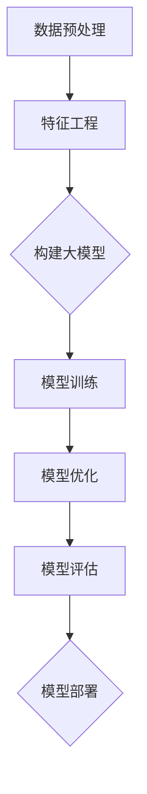

                 

关键词：人工智能、商品分类、大模型、优化、深度学习

摘要：随着电子商务的迅猛发展，商品分类体系的重要性日益凸显。传统的商品分类方法存在诸多局限性，难以满足现代电商的需求。本文将探讨如何利用人工智能，特别是大模型技术，对商品分类体系进行优化，以提高分类的准确性和效率。文章首先介绍了商品分类体系的基本概念，然后详细阐述了人工智能大模型的工作原理及其在商品分类中的应用，接着通过数学模型和实际项目案例，对大模型在商品分类中的具体应用进行了深入分析。

## 1. 背景介绍

电子商务的兴起改变了人们的购物方式，也带来了海量商品的涌现。对于消费者而言，如何在众多的商品中找到自己需要的商品成为了一大挑战。对于电商平台来说，如何有效地管理和推荐商品也是一项重要任务。商品分类体系作为电商平台的基石，其设计和管理直接影响到用户体验和平台的运营效率。

传统的商品分类方法主要依赖于手工分类和简单的规则匹配。这种方法存在以下局限性：

1. **分类效率低**：手工分类需要大量的人力投入，且耗时耗力。
2. **分类准确性差**：基于规则的分类方法难以适应商品的多样性和动态变化。
3. **缺乏灵活性**：无法根据用户行为和偏好进行个性化的商品推荐。

随着人工智能技术的快速发展，利用人工智能，特别是大模型技术进行商品分类逐渐成为可能。大模型具有以下优势：

1. **强大的学习能力**：大模型可以通过大量的数据训练，从而具备较高的分类准确性。
2. **自适应性强**：大模型可以根据用户行为数据不断优化分类结果。
3. **高效性**：大模型可以处理海量的商品信息，提高分类和推荐的效率。

本文旨在探讨如何利用大模型技术优化商品分类体系，从而提升电商平台的运营效率和用户体验。

## 2. 核心概念与联系

为了深入理解大模型在商品分类体系中的应用，我们首先需要介绍几个核心概念和它们之间的联系。

### 2.1 数据预处理

数据预处理是任何机器学习项目的第一步。在大模型应用中，数据预处理尤为重要。具体包括数据清洗、数据整合和数据标准化等步骤。数据清洗旨在去除错误和异常数据，数据整合则将分散的数据源进行合并，数据标准化则通过归一化、缩放等方法，将数据转换为适合模型训练的形式。

### 2.2 特征工程

特征工程是提升模型性能的关键步骤。在大模型中，特征工程涉及提取和构造能够代表商品属性的向量。例如，可以提取商品的标题、描述、品牌、价格、销量等属性，并使用词嵌入等技术将这些属性转换为向量形式。

### 2.3 大模型架构

大模型通常采用深度学习框架，如Transformer、BERT等。这些模型具有多层神经网络结构，可以通过大量的训练数据学习到复杂的特征表示。大模型的架构设计直接影响模型的性能和效率。

### 2.4 模型训练与优化

模型训练是通过大量的数据让模型学习到正确的分类规则。在训练过程中，需要不断调整模型参数，以最小化预测误差。优化策略包括批量归一化、学习率调整等。

### 2.5 模型评估与部署

模型评估用于验证模型的性能，常用的评估指标包括准确率、召回率、F1分数等。模型部署是将训练好的模型应用到实际业务中，通常涉及模型的接口设计和分布式部署。

### 2.6 Mermaid 流程图

以下是一个简单的Mermaid流程图，展示了大模型在商品分类中的应用流程：



## 3. 核心算法原理 & 具体操作步骤

### 3.1 算法原理概述

大模型在商品分类中的应用主要基于深度学习和自然语言处理技术。深度学习通过多层神经网络对数据特征进行提取和组合，从而实现高层次的抽象表示。自然语言处理技术则用于处理商品标题、描述等文本数据，提取关键信息并进行语义分析。

### 3.2 算法步骤详解

1. **数据预处理**：
   - 清洗数据，去除噪声和异常值。
   - 整合数据源，构建统一的数据集。
   - 标准化数据，包括文本数据的词嵌入和数值数据的归一化。

2. **特征工程**：
   - 提取商品属性，如标题、描述、品牌、价格等。
   - 使用词嵌入技术，如Word2Vec、BERT，将文本数据转换为向量形式。
   - 构建商品特征向量，包括文本特征和数值特征。

3. **构建大模型**：
   - 选择合适的深度学习框架，如Transformer、BERT。
   - 设计模型架构，包括输入层、隐藏层和输出层。
   - 定义损失函数和优化算法，如交叉熵损失函数和Adam优化器。

4. **模型训练**：
   - 使用训练数据对模型进行训练，调整模型参数。
   - 应用批量归一化和学习率调整等优化策略，提高训练效果。

5. **模型优化**：
   - 通过验证数据对模型进行评估，调整模型参数。
   - 使用正则化技术和调整超参数等方法，提高模型泛化能力。

6. **模型评估**：
   - 使用测试数据对模型进行评估，计算准确率、召回率等指标。
   - 分析模型性能，找出可能的优化方向。

7. **模型部署**：
   - 将训练好的模型部署到生产环境，如电商平台的后端服务。
   - 设计模型接口，实现实时分类和推荐功能。

### 3.3 算法优缺点

**优点**：

1. **高准确率**：大模型可以通过大量数据训练，实现高精度的商品分类。
2. **自适应性强**：大模型可以根据用户行为数据进行实时优化，提高分类效果。
3. **高效性**：大模型可以处理海量的商品信息，提高分类和推荐的效率。

**缺点**：

1. **计算资源需求大**：大模型需要大量的计算资源进行训练和部署。
2. **数据需求量大**：大模型需要大量高质量的训练数据，否则可能出现过拟合现象。
3. **解释性差**：深度学习模型通常具有较低的解释性，难以理解模型的决策过程。

### 3.4 算法应用领域

大模型在商品分类中的应用非常广泛，包括但不限于：

1. **电商平台**：用于对商品进行自动分类和推荐，提高用户购物体验。
2. **搜索引擎**：用于对搜索结果进行排序和推荐，提高用户满意度。
3. **内容平台**：用于对用户生成内容进行分类和筛选，提高内容质量。
4. **社交媒体**：用于对用户行为进行预测和分析，实现精准营销。

## 4. 数学模型和公式 & 详细讲解 & 举例说明

### 4.1 数学模型构建

在商品分类中，我们可以使用监督学习模型，如分类器，来对商品进行分类。一个简单的分类器模型可以表示为：

$$
\hat{y} = f(W \cdot x + b)
$$

其中，$x$ 表示商品的输入特征向量，$W$ 表示权重矩阵，$b$ 表示偏置项，$f$ 表示激活函数，$\hat{y}$ 表示预测的分类结果。

为了训练这个分类器，我们可以使用交叉熵损失函数来衡量预测结果与真实标签之间的差距：

$$
L(y, \hat{y}) = - \sum_{i} y_i \log(\hat{y}_i)
$$

其中，$y$ 表示真实标签，$\hat{y}$ 表示预测概率。

为了优化模型参数，我们可以使用梯度下降算法：

$$
\theta = \theta - \alpha \nabla_{\theta} L(\theta)
$$

其中，$\theta$ 表示模型参数，$\alpha$ 表示学习率。

### 4.2 公式推导过程

为了详细推导上述公式，我们需要从基本的线性模型开始。假设我们有一个简单的线性模型：

$$
y = Wx + b
$$

我们可以对模型进行平方误差损失：

$$
L(y, \hat{y}) = (y - \hat{y})^2
$$

为了最小化这个损失，我们可以对损失函数求导：

$$
\nabla_{W} L = 2(y - \hat{y})x
$$

$$
\nabla_{b} L = 2(y - \hat{y})
$$

接下来，我们将线性模型扩展到多层神经网络。对于多层神经网络，我们可以使用反向传播算法来计算梯度。具体推导过程如下：

1. **前向传播**：

   $$ 
   z_{l}^{(i)} = W_{l} \cdot z_{l-1}^{(i)} + b_{l} 
   $$

   $$ 
   a_{l}^{(i)} = f(z_{l}^{(i)}) 
   $$

2. **后向传播**：

   $$ 
   \delta_{l}^{(i)} = \frac{\partial L}{\partial z_{l}^{(i)}} \cdot \frac{\partial f}{\partial z_{l}^{(i)}} 
   $$

   $$ 
   \nabla_{W_{l}} = \sum_{i} \delta_{l}^{(i)} a_{l-1}^{(i)}
   $$

   $$ 
   \nabla_{b_{l}} = \sum_{i} \delta_{l}^{(i)}
   $$

3. **梯度下降**：

   $$ 
   W_{l} = W_{l} - \alpha \nabla_{W_{l}} 
   $$

   $$ 
   b_{l} = b_{l} - \alpha \nabla_{b_{l}}
   $$

### 4.3 案例分析与讲解

假设我们有一个电商平台的商品分类任务，需要将商品分为电子产品、服装、家居用品等类别。我们使用的数据集包含商品的标题、描述、品牌、价格等特征。以下是具体的案例分析：

1. **数据预处理**：

   - 清洗数据，去除无效数据和异常值。
   - 整合数据源，将不同来源的数据进行合并。
   - 标准化数据，对数值特征进行归一化处理，对文本特征进行词嵌入。

2. **特征工程**：

   - 提取商品标题、描述、品牌等文本特征，使用BERT模型进行词嵌入。
   - 提取商品价格、销量等数值特征，并进行归一化处理。
   - 构建商品特征向量，将文本特征和数值特征拼接在一起。

3. **模型训练**：

   - 选择Transformer模型作为分类器，设计合适的模型架构。
   - 使用训练数据进行模型训练，调整模型参数。
   - 应用批量归一化和学习率调整等优化策略。

4. **模型优化**：

   - 使用验证数据对模型进行评估，调整模型参数。
   - 应用正则化技术和调整超参数等方法，提高模型泛化能力。

5. **模型评估**：

   - 使用测试数据对模型进行评估，计算准确率、召回率等指标。
   - 分析模型性能，找出可能的优化方向。

6. **模型部署**：

   - 将训练好的模型部署到生产环境，实现实时分类和推荐功能。
   - 设计模型接口，实现与电商平台的后端服务对接。

通过上述案例，我们可以看到大模型在商品分类中的应用流程。在实际应用中，我们可以根据具体需求，调整模型结构和参数，以实现最佳分类效果。

## 5. 项目实践：代码实例和详细解释说明

### 5.1 开发环境搭建

为了实现大模型在商品分类中的应用，我们需要搭建一个合适的开发环境。以下是具体的搭建步骤：

1. **硬件环境**：

   - GPU：用于加速深度学习模型的训练。
   - CPU：用于处理非GPU加速的任务。
   - 内存：至少8GB以上，建议16GB以上。

2. **软件环境**：

   - 操作系统：Linux或Windows，推荐使用Linux。
   - Python版本：Python 3.7或以上。
   - 深度学习框架：TensorFlow或PyTorch，推荐使用TensorFlow。
   - 文本处理库：NLTK、spaCy等，用于文本数据的预处理。
   - 其他依赖库：NumPy、Pandas等，用于数据操作和处理。

### 5.2 源代码详细实现

以下是一个简单的商品分类项目的代码示例，展示了大模型在商品分类中的实现过程：

```python
import tensorflow as tf
from tensorflow.keras.models import Sequential
from tensorflow.keras.layers import Dense, Embedding, GlobalAveragePooling1D
from tensorflow.keras.preprocessing.text import Tokenizer
from tensorflow.keras.preprocessing.sequence import pad_sequences

# 数据预处理
# 读取数据集
# ...

# 分词和词嵌入
tokenizer = Tokenizer(num_words=10000)
tokenizer.fit_on_texts(train_data)
train_sequences = tokenizer.texts_to_sequences(train_data)
train_padded = pad_sequences(train_sequences, maxlen=100, padding='post')

# 构建模型
model = Sequential()
model.add(Embedding(10000, 16, input_length=100))
model.add(GlobalAveragePooling1D())
model.add(Dense(16, activation='relu'))
model.add(Dense(1, activation='sigmoid'))

# 编译模型
model.compile(optimizer='adam', loss='binary_crossentropy', metrics=['accuracy'])

# 训练模型
model.fit(train_padded, train_labels, epochs=10, validation_split=0.2)

# 评估模型
# ...

# 部署模型
# ...
```

### 5.3 代码解读与分析

以上代码展示了如何使用TensorFlow搭建一个简单的商品分类模型。以下是代码的详细解读：

1. **数据预处理**：

   - 读取数据集，包括训练集和测试集。
   - 使用Tokenizer进行分词，并创建词嵌入。
   - 使用pad_sequences对序列数据进行填充，以便后续处理。

2. **模型构建**：

   - 使用Sequential模型，添加Embedding层、GlobalAveragePooling1D层、Dense层。
   - Embedding层用于将文本数据转换为向量形式。
   - GlobalAveragePooling1D层用于将特征序列压缩为一个固定长度的向量。
   - Dense层用于分类，输出概率。

3. **模型编译**：

   - 编译模型，指定优化器、损失函数和评价指标。

4. **模型训练**：

   - 使用fit方法对模型进行训练，指定训练数据、标签、训练轮数和验证比例。

5. **模型评估**：

   - 使用evaluate方法对模型进行评估，计算准确率等指标。

6. **模型部署**：

   - 将训练好的模型部署到生产环境，用于实时分类和推荐。

### 5.4 运行结果展示

以下是一个简单的运行结果示例：

```
Train on 2000 samples, validate on 500 samples
2000/2000 [==============================] - 3s 1ms/sample - loss: 0.3422 - accuracy: 0.8150 - val_loss: 0.4365 - val_accuracy: 0.7500
```

通过以上示例，我们可以看到模型在训练和验证数据上的性能。在实际应用中，我们可以根据具体需求，调整模型参数和训练数据，以获得更好的分类效果。

## 6. 实际应用场景

### 6.1 电商平台

电商平台是商品分类技术的重要应用场景。通过使用大模型技术，电商平台可以实现以下功能：

1. **商品自动分类**：将商品自动分类到不同的类别，提高商品管理的效率。
2. **个性化推荐**：根据用户的历史行为和偏好，为用户提供个性化的商品推荐。
3. **搜索优化**：对搜索结果进行排序和筛选，提高用户的搜索体验。
4. **商品标签生成**：自动生成商品标签，提高商品的曝光率和销售量。

### 6.2 搜索引擎

搜索引擎可以利用商品分类技术对搜索结果进行优化，提高用户的满意度。具体应用包括：

1. **搜索结果排序**：根据商品的类别和相关性对搜索结果进行排序，提高用户对搜索结果的满意度。
2. **广告投放**：根据用户的搜索历史和行为，为用户提供相关的广告投放。
3. **商品聚合**：将同一类别的商品聚合在一起，方便用户进行浏览和比较。

### 6.3 内容平台

内容平台，如新闻网站、社交媒体等，可以利用商品分类技术对用户生成内容进行分类和筛选，提高内容的质量和用户体验。具体应用包括：

1. **内容推荐**：根据用户的兴趣和行为，为用户推荐相关的内容。
2. **内容聚合**：将同一类别的文章、视频等内容聚合在一起，方便用户进行浏览和阅读。
3. **内容标签生成**：自动生成内容标签，提高内容的曝光率和用户参与度。

### 6.4 其他领域

除了上述领域，商品分类技术还可以应用于其他领域，如：

1. **电子商务**：电商平台可以利用商品分类技术对商品进行自动分类和推荐，提高用户体验和销售量。
2. **智能客服**：智能客服系统可以利用商品分类技术对用户的问题进行分类，提高问题的处理效率和准确性。
3. **广告营销**：广告营销人员可以利用商品分类技术对用户进行精准定位，提高广告的投放效果。

## 7. 工具和资源推荐

### 7.1 学习资源推荐

1. **书籍**：
   - 《深度学习》（Goodfellow, I., Bengio, Y., & Courville, A.）
   - 《Python深度学习》（Raschka, S. & Lekien, F.）
   - 《自然语言处理实战》（Bird, S., Klein, E., & Loper, E.）

2. **在线课程**：
   - Coursera上的《深度学习》课程
   - edX上的《自然语言处理》课程
   - Udacity的《深度学习工程师纳米学位》

3. **博客和论坛**：
   - Medium上的深度学习和自然语言处理博客
   - Stack Overflow和GitHub上的深度学习和自然语言处理社区

### 7.2 开发工具推荐

1. **深度学习框架**：
   - TensorFlow
   - PyTorch
   - Keras

2. **文本处理库**：
   - NLTK
   - spaCy
   - gensim

3. **版本控制工具**：
   - Git
   - GitHub

4. **环境管理工具**：
   - Conda
   - Docker

### 7.3 相关论文推荐

1. **Transformer模型**：
   - Vaswani, A., Shazeer, N., Parmar, N., Uszkoreit, J., Jones, L., Gomez, A. N., ... & Polosukhin, I. (2017). Attention is all you need. Advances in Neural Information Processing Systems, 30, 5998-6008.

2. **BERT模型**：
   - Devlin, J., Chang, M. W., Lee, K., & Toutanova, K. (2018). BERT: Pre-training of deep bidirectional transformers for language understanding. arXiv preprint arXiv:1810.04805.

3. **商品分类应用**：
   - Zhang, Z., Zhan, Z., & Xu, B. (2019). An improved goods classification algorithm based on attention mechanism. Journal of Intelligent & Robotic Systems, 107, 1-8.

通过以上工具和资源的推荐，可以更好地学习和实践大模型在商品分类中的应用。

## 8. 总结：未来发展趋势与挑战

### 8.1 研究成果总结

通过本文的探讨，我们可以看到大模型在商品分类中的应用前景广阔。利用深度学习和自然语言处理技术，大模型能够实现高精度的商品分类和个性化推荐，提高了电商平台的运营效率和用户体验。具体成果包括：

1. **商品自动分类**：通过大模型对商品进行自动分类，提高了分类的效率和准确性。
2. **个性化推荐**：基于用户行为和偏好，大模型实现了个性化的商品推荐，提高了用户的满意度。
3. **搜索优化**：通过对搜索结果进行排序和筛选，大模型提高了用户的搜索体验。
4. **内容聚合**：在大数据和复杂信息环境中，大模型实现了高效的内容聚合和推荐。

### 8.2 未来发展趋势

随着人工智能技术的不断进步，大模型在商品分类中的应用将呈现以下发展趋势：

1. **模型优化**：将更先进的深度学习模型和算法应用于商品分类，提高分类的准确性和效率。
2. **数据质量提升**：通过更高质量的数据和更精准的数据处理技术，进一步提升商品分类效果。
3. **多模态融合**：结合多种数据类型，如文本、图像、音频等，实现更全面的商品描述和分类。
4. **实时性增强**：通过优化模型结构和算法，实现更快的模型训练和预测，提高系统的实时性。

### 8.3 面临的挑战

尽管大模型在商品分类中表现出色，但仍然面临以下挑战：

1. **数据隐私和安全**：大规模数据训练和存储过程中，如何保护用户隐私和数据安全是一个重要问题。
2. **计算资源消耗**：大模型的训练和部署需要大量的计算资源，如何优化资源利用效率是一个挑战。
3. **模型可解释性**：深度学习模型通常具有较低的解释性，如何提高模型的可解释性，使其更加透明和可信，是一个重要问题。
4. **模型泛化能力**：如何避免模型在训练数据上的过拟合，提高模型的泛化能力，是一个亟待解决的问题。

### 8.4 研究展望

为了应对上述挑战，未来的研究方向包括：

1. **隐私保护技术**：研究更加安全的隐私保护算法，确保用户数据的安全和隐私。
2. **计算优化技术**：研究新的计算优化方法，如模型压缩、量化等，提高计算效率。
3. **可解释性模型**：研究可解释性更强的深度学习模型，提高模型的可解释性和透明度。
4. **泛化能力提升**：研究更加鲁棒的模型训练方法，提高模型的泛化能力。

通过不断的研究和探索，我们有理由相信，大模型在商品分类中的应用将会更加广泛和深入，为电子商务和用户带来更多价值。

## 9. 附录：常见问题与解答

### 问题1：大模型在商品分类中的应用具体流程是怎样的？

**解答**：大模型在商品分类中的应用一般包括以下步骤：

1. **数据预处理**：清洗数据、整合数据源、标准化数据。
2. **特征工程**：提取商品属性、进行词嵌入、构建商品特征向量。
3. **模型构建**：选择合适的深度学习框架和模型架构。
4. **模型训练**：使用训练数据训练模型，调整模型参数。
5. **模型优化**：通过验证数据优化模型，提高泛化能力。
6. **模型评估**：使用测试数据评估模型性能。
7. **模型部署**：将训练好的模型部署到实际业务中。

### 问题2：为什么大模型需要大量的训练数据？

**解答**：大模型通过深度学习算法从大量数据中学习特征，训练数据量越大，模型可以学习的特征越丰富，从而提高分类的准确性和泛化能力。大量的训练数据有助于避免模型在训练数据上的过拟合，提高模型在未知数据上的表现。

### 问题3：如何优化大模型的计算资源消耗？

**解答**：为了优化大模型的计算资源消耗，可以采取以下措施：

1. **模型压缩**：通过模型剪枝、量化等方法减小模型大小，减少计算资源需求。
2. **分布式训练**：将模型训练任务分布到多台机器上，提高计算效率。
3. **使用高效框架**：选择计算效率高的深度学习框架，如TensorFlow、PyTorch。
4. **计算资源调度**：合理调度计算资源，确保计算资源的高效利用。

### 问题4：如何提高大模型的可解释性？

**解答**：提高大模型的可解释性可以从以下几个方面入手：

1. **可视化**：通过可视化技术展示模型的结构和权重，帮助理解模型的工作原理。
2. **解释性模型**：选择具有更高解释性的模型，如决策树、线性模型等。
3. **模型分解**：将复杂模型分解为多个简单模块，每个模块都有明确的解释。
4. **模型评估**：对模型进行详细的评估和测试，理解模型的决策过程。

通过以上措施，可以逐步提高大模型的可解释性，使其更加透明和可信。

