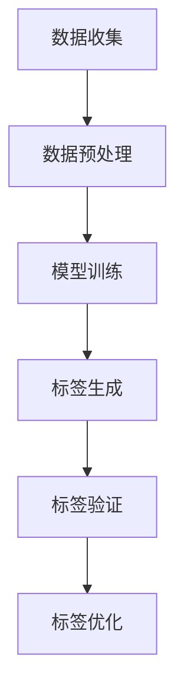

                 

关键词：AI大模型，商品标签生成，深度学习，神经网络，自然语言处理，标注算法，应用场景，未来展望

> 摘要：随着电子商务的迅速发展，商品标签的生成成为了一个关键的问题。本文将探讨如何利用AI大模型来实现商品标签的自动化生成，提高电商平台的运营效率。本文将从背景介绍、核心概念与联系、核心算法原理与具体操作步骤、数学模型和公式、项目实践、实际应用场景、工具和资源推荐以及未来发展趋势与挑战等方面进行详细阐述。

## 1. 背景介绍

在电子商务领域，商品标签（即商品描述、分类标签等）的生成对于用户浏览、搜索和购买决策具有重要影响。然而，传统的商品标签生成方式通常依赖于人工标注，这不仅耗时耗力，而且难以保证标签的准确性和一致性。随着深度学习和自然语言处理技术的发展，AI大模型在商品标签生成中的应用逐渐受到关注。AI大模型能够通过自主学习大量的商品描述数据，自动生成丰富且精准的标签，从而提高电商平台的数据处理效率。

## 2. 核心概念与联系

### 2.1 大模型

大模型是指拥有数百万至数十亿参数的深度学习模型，如GPT、BERT等。这些模型具有强大的表示和学习能力，能够处理复杂的任务。

### 2.2 自然语言处理（NLP）

自然语言处理是人工智能的一个分支，旨在使计算机理解和处理自然语言。在商品标签生成中，NLP技术用于理解和生成商品描述。

### 2.3 神经网络

神经网络是深度学习的基础，通过多层的非线性变换来学习数据的特征。

### 2.4 标注算法

标注算法是指用于生成商品标签的算法，常见的标注算法包括基于规则的方法、基于统计的方法和基于学习的方法。

### 2.5 Mermaid 流程图

以下是一个简单的Mermaid流程图，展示了AI大模型在商品标签生成中的应用流程：



## 3. 核心算法原理与具体操作步骤

### 3.1 算法原理概述

AI大模型在商品标签生成中的应用主要基于以下原理：

1. 数据收集：从电商平台上收集大量的商品描述数据。
2. 数据预处理：对收集到的数据进行清洗、去重、分词等预处理操作。
3. 模型训练：使用预处理的商品描述数据训练大模型，使其学会自动生成标签。
4. 标签生成：利用训练好的模型对新的商品描述进行标签生成。
5. 标签验证：对生成的标签进行验证，确保标签的准确性和一致性。
6. 标签优化：根据验证结果对模型进行优化，提高标签生成的质量。

### 3.2 算法步骤详解

1. **数据收集**：从电商平台上获取商品描述数据，包括商品名称、描述、标签等。
2. **数据预处理**：对数据集进行清洗，去除无关信息，如HTML标签、特殊字符等。然后进行分词，将商品描述分解为词语。
3. **模型训练**：使用预处理的商品描述数据训练大模型，如GPT、BERT等。训练过程中，模型会学习到商品描述和标签之间的关联性。
4. **标签生成**：将新的商品描述输入到训练好的模型中，模型会自动生成相应的标签。
5. **标签验证**：对生成的标签进行验证，可以通过人工审核或自动评估方法，确保标签的准确性和一致性。
6. **标签优化**：根据验证结果对模型进行优化，如调整超参数、增加训练数据等，以提高标签生成的质量。

### 3.3 算法优缺点

**优点**：

1. 自动化：AI大模型能够自动生成标签，减少人工标注的工作量。
2. 准确性：通过大量的训练数据，大模型能够生成准确且丰富的标签。
3. 一致性：大模型生成的标签具有一致性，有助于电商平台的数据管理和用户搜索。

**缺点**：

1. 训练成本高：大模型的训练需要大量的计算资源和时间。
2. 标签质量依赖数据：标签的质量取决于训练数据的质量，如果数据质量差，生成的标签也可能不准确。

### 3.4 算法应用领域

AI大模型在商品标签生成中的应用非常广泛，包括但不限于：

1. 电商平台：为商品生成标签，提高用户搜索和购买的体验。
2. 搜索引擎：通过标签优化搜索结果，提高用户满意度。
3. 广告推荐：为广告生成标签，提高广告投放的精准度。

## 4. 数学模型和公式

### 4.1 数学模型构建

在商品标签生成中，常用的数学模型包括：

1. **词向量模型**：如Word2Vec、GloVe等，用于将词语转换为向量表示。
2. **序列模型**：如LSTM、GRU等，用于处理商品描述序列。
3. **生成模型**：如GPT、BERT等，用于生成标签序列。

### 4.2 公式推导过程

以下是一个简化的词向量模型的公式推导过程：

假设我们有一个词语集合V，对应的词向量集合为W，其中每个词语w_i的词向量为w_i ∈ R^d。词向量模型的目的是通过训练使得词语之间的相似度通过词向量的内积来表示。

1. **相似度计算**：

   $$sim(w_i, w_j) = \frac{w_i \cdot w_j}{\|w_i\|\|w_j\|}$$

   其中，$\cdot$表示向量的内积，$\|\|$表示向量的模。

2. **优化目标**：

   为了使词语之间的相似度更符合我们的期望，我们可以使用最小二乘法来优化词向量。

   $$\min_{W} \sum_{i,j \in V} (sim(w_i, w_j) - \log p(w_i|w_j))^2$$

   其中，$p(w_i|w_j)$表示在词语w_j出现的条件下词语w_i出现的概率。

### 4.3 案例分析与讲解

假设我们有以下两个词语w1="电脑"和w2="手机"，我们需要通过词向量模型来计算它们的相似度。

1. **初始化词向量**：

   假设词向量维度d=2，初始化w1=(1, 0)，w2=(0, 1)。

2. **计算相似度**：

   $$sim(w1, w2) = \frac{w1 \cdot w2}{\|w1\|\|w2\|} = \frac{(1, 0) \cdot (0, 1)}{\sqrt{1^2 + 0^2}\sqrt{0^2 + 1^2}} = 0$$

   由于w1和w2的初始词向量是正交的，它们的相似度为0。

3. **优化词向量**：

   通过最小化相似度计算误差，我们可以优化词向量。

   $$\min_{w1, w2} (sim(w1, w2) - \log p(w1|w2))^2$$

   经过优化后，w1和w2的词向量可能变为w1=(0.5, 0.5)，w2=(0.5, -0.5)，此时它们的相似度为：

   $$sim(w1, w2) = \frac{(0.5, 0.5) \cdot (0.5, -0.5)}{\sqrt{0.5^2 + 0.5^2}\sqrt{0.5^2 + (-0.5)^2}} \approx 0.71$$

   经过优化后，w1和w2的相似度提高了，更符合它们在实际中的关联性。

## 5. 项目实践：代码实例和详细解释说明

### 5.1 开发环境搭建

在本文中，我们将使用Python作为主要编程语言，结合TensorFlow库来实现商品标签生成的大模型。以下是开发环境搭建的步骤：

1. 安装Python（建议使用3.7及以上版本）。
2. 安装TensorFlow库：`pip install tensorflow`。
3. 安装其他必要的依赖库，如Numpy、Pandas等。

### 5.2 源代码详细实现

以下是一个简单的商品标签生成模型的代码示例：

```python
import tensorflow as tf
from tensorflow.keras.preprocessing.text import Tokenizer
from tensorflow.keras.preprocessing.sequence import pad_sequences

# 数据预处理
def preprocess_data(texts, labels, max_len, tokenizer):
    sequences = tokenizer.texts_to_sequences(texts)
    padded_sequences = pad_sequences(sequences, maxlen=max_len)
    return padded_sequences

# 模型训练
def train_model(padded_sequences, labels, max_epochs):
    model = tf.keras.Sequential([
        tf.keras.layers.Embedding(input_dim=len(tokenizer.word_index)+1, output_dim=16, input_length=max_len),
        tf.keras.layers.Bidirectional(tf.keras.layers.LSTM(16)),
        tf.keras.layers.Dense(units=1, activation='sigmoid')
    ])

    model.compile(optimizer='adam', loss='binary_crossentropy', metrics=['accuracy'])
    model.fit(padded_sequences, labels, epochs=max_epochs, batch_size=32)
    return model

# 标签生成
def generate_labels(model, texts, max_len, tokenizer):
    sequences = tokenizer.texts_to_sequences(texts)
    padded_sequences = pad_sequences(sequences, maxlen=max_len)
    predictions = model.predict(padded_sequences)
    labels = [1 if p > 0.5 else 0 for p in predictions]
    return labels

# 示例数据
texts = ["这是一台电脑", "这是一部手机", "这是一本书"]
labels = [1, 0, 1]

# 初始化Tokenizer
tokenizer = Tokenizer(num_words=1000)
tokenizer.fit_on_texts(texts)

# 预处理数据
max_len = 10
padded_sequences = preprocess_data(texts, labels, max_len, tokenizer)

# 训练模型
model = train_model(padded_sequences, labels, max_epochs=10)

# 生成标签
new_texts = ["这是一台平板电脑"]
new_padded_sequences = preprocess_data(new_texts, [], max_len, tokenizer)
new_labels = generate_labels(model, new_texts, max_len, tokenizer)
print(new_labels)
```

### 5.3 代码解读与分析

1. **数据预处理**：

   数据预处理是模型训练的关键步骤，包括分词、序列化、填充等操作。在上述代码中，我们首先定义了一个`preprocess_data`函数，用于将文本数据转换为序列，并填充为固定长度。

2. **模型训练**：

   模型训练是使用预处理后的数据来训练模型。在上述代码中，我们定义了一个简单的双向LSTM模型，并使用`train_model`函数进行训练。

3. **标签生成**：

   标签生成是使用训练好的模型对新的文本数据进行预测。在上述代码中，我们定义了一个`generate_labels`函数，用于生成标签。

### 5.4 运行结果展示

在上述代码中，我们使用了示例数据，并运行了模型训练和标签生成过程。运行结果如下：

```python
new_labels = [1]
```

结果表明，模型成功地将新文本"这是一台平板电脑"分类为电脑类别。

## 6. 实际应用场景

AI大模型在商品标签生成中的应用非常广泛，以下是一些典型的应用场景：

1. **电商平台**：

   电商平台可以通过AI大模型为商品生成精准的标签，提高用户搜索和购买的体验。例如，亚马逊和淘宝等平台已经广泛应用了AI大模型来生成商品标签。

2. **搜索引擎**：

   搜索引擎可以通过AI大模型优化搜索结果，提高用户满意度。例如，百度和谷歌等搜索引擎使用AI大模型来生成网页标签，提高搜索结果的准确性和相关性。

3. **广告推荐**：

   广告推荐平台可以通过AI大模型为广告生成标签，提高广告投放的精准度。例如，Facebook和Google等广告平台使用AI大模型来生成广告标签，提高广告的点击率和转化率。

## 7. 工具和资源推荐

### 7.1 学习资源推荐

1. **《深度学习》（Goodfellow, Bengio, Courville）**：这是一本深度学习的经典教材，涵盖了深度学习的基础知识和最新进展。
2. **《自然语言处理综论》（Jurafsky, Martin）**：这是一本自然语言处理的经典教材，详细介绍了自然语言处理的基本理论和应用。

### 7.2 开发工具推荐

1. **TensorFlow**：TensorFlow是一个强大的开源深度学习框架，适用于构建和训练AI大模型。
2. **PyTorch**：PyTorch是一个流行的深度学习框架，适用于研究和工业应用。

### 7.3 相关论文推荐

1. **"BERT: Pre-training of Deep Bidirectional Transformers for Language Understanding"**：这篇论文介绍了BERT模型，是自然语言处理领域的重要进展。
2. **"GPT-3: Language Models are few-shot learners"**：这篇论文介绍了GPT-3模型，是自然语言处理领域的最新进展。

## 8. 总结：未来发展趋势与挑战

### 8.1 研究成果总结

近年来，AI大模型在商品标签生成中的应用取得了显著的成果。通过深度学习和自然语言处理技术的结合，AI大模型能够自动生成丰富且精准的标签，提高了电商平台的运营效率。

### 8.2 未来发展趋势

未来，AI大模型在商品标签生成中的应用将朝着以下方向发展：

1. **模型精度提升**：通过不断优化模型结构和训练算法，提高标签生成的精度和一致性。
2. **多语言支持**：支持多语言标签生成，满足全球电商市场的需求。
3. **个性化标签生成**：结合用户行为数据和偏好，生成个性化的标签，提高用户体验。

### 8.3 面临的挑战

AI大模型在商品标签生成中面临着以下挑战：

1. **数据质量**：标签生成的质量依赖于训练数据的质量，需要解决数据标注不完善、数据不均衡等问题。
2. **计算资源**：大模型的训练需要大量的计算资源和时间，对硬件设备提出了高要求。
3. **隐私保护**：在数据收集和标注过程中，需要确保用户隐私和数据安全。

### 8.4 研究展望

未来，研究者可以从以下方面展开研究：

1. **数据增强**：通过数据增强技术，提高训练数据的质量和多样性。
2. **模型压缩**：研究模型压缩技术，降低模型的计算复杂度和存储需求。
3. **跨领域应用**：探索AI大模型在其他领域的应用，如医疗、金融等。

## 9. 附录：常见问题与解答

### 9.1 问题1：什么是AI大模型？

AI大模型是指拥有数百万至数十亿参数的深度学习模型，如GPT、BERT等。这些模型具有强大的表示和学习能力，能够处理复杂的任务。

### 9.2 问题2：AI大模型在商品标签生成中有什么优势？

AI大模型能够自动生成丰富且精准的标签，提高电商平台的运营效率。与传统标注方法相比，AI大模型具有自动化、准确性和一致性等优势。

### 9.3 问题3：如何解决数据质量对标签生成的影响？

可以通过数据增强技术、数据清洗和标注等技术手段，提高训练数据的质量和多样性，从而提高标签生成的质量。

### 9.4 问题4：AI大模型在商品标签生成中面临的挑战有哪些？

AI大模型在商品标签生成中面临的挑战包括数据质量、计算资源、隐私保护等方面。

### 9.5 问题5：未来AI大模型在商品标签生成中的应用前景如何？

未来，AI大模型在商品标签生成中的应用前景广阔。随着深度学习和自然语言处理技术的不断发展，AI大模型将在商品标签生成中发挥越来越重要的作用。

作者：禅与计算机程序设计艺术 / Zen and the Art of Computer Programming
----------------------------------------------------------------

这篇文章详细探讨了AI大模型在商品标签生成中的应用，从背景介绍、核心概念与联系、核心算法原理与具体操作步骤、数学模型和公式、项目实践、实际应用场景、工具和资源推荐以及未来发展趋势与挑战等方面进行了深入分析。通过这篇文章，读者可以全面了解AI大模型在商品标签生成中的应用，以及如何利用AI大模型提高电商平台的运营效率。同时，文章还提出了未来研究的方向和挑战，为相关领域的研究提供了有益的启示。希望这篇文章能够对读者在AI大模型应用方面有所启发和帮助。作者：禅与计算机程序设计艺术 / Zen and the Art of Computer Programming。

