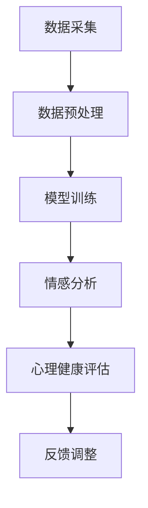

                 

关键词：AI大模型，心理健康，创业机会，技术应用，商业模式，未来展望

摘要：本文探讨了人工智能大模型在心理健康领域的发展潜力和创业机会。通过对AI大模型的核心概念、算法原理、数学模型、实际应用等方面进行深入分析，结合心理健康领域的市场需求和挑战，探讨了相关的创业机会和商业模式，并对未来的发展趋势和挑战进行了展望。

## 1. 背景介绍

近年来，随着人工智能技术的迅猛发展，AI大模型作为深度学习的重要成果，逐渐成为学术界和工业界的关注焦点。从最初的简单的神经网络模型，到如今的GPT-3、BERT等具有数万亿参数的模型，AI大模型在图像识别、自然语言处理、语音识别、机器翻译等领域的表现已经超越了人类水平。

与此同时，心理健康问题在全球范围内日益受到关注。据世界卫生组织（WHO）统计，全球有超过3亿人患有某种形式的抑郁症，而焦虑症和压力相关的精神健康问题也呈现出逐年上升的趋势。这些心理健康问题不仅对个体的生活质量和生产力产生严重影响，也给社会和医疗系统带来了巨大的负担。因此，如何利用人工智能技术解决心理健康问题，已经成为一个重要的研究课题。

本文旨在探讨AI大模型在心理健康领域的创业机会，分析相关技术、市场需求、商业模式等方面的内容，为创业者提供有价值的参考。

## 2. 核心概念与联系

### 2.1 AI大模型

AI大模型是指具有数百万、数十亿甚至数千亿参数的神经网络模型。这些模型通过大量的数据训练，可以自动学习和发现数据中的规律，从而实现高度复杂的任务。常见的AI大模型包括GPT、BERT、Transformer等。

### 2.2 心理健康

心理健康是指个体在认知、情感、行为等方面的健康状态。心理健康问题包括抑郁症、焦虑症、强迫症、创伤后应激障碍等。

### 2.3 关系

AI大模型在心理健康领域有广泛的应用潜力。例如，利用自然语言处理技术，可以对个体的情感状态进行识别和评估；利用图像识别技术，可以分析个体的面部表情和身体语言，进而判断其心理健康状况。

下面是一个Mermaid流程图，展示了AI大模型在心理健康领域的应用流程：



## 3. 核心算法原理 & 具体操作步骤

### 3.1 算法原理概述

AI大模型在心理健康领域的核心算法主要包括情感分析、心理健康评估等。情感分析利用自然语言处理技术，对个体的文字描述进行分析，识别其中的情感状态。心理健康评估则通过综合分析个体的情感状态、行为、生理指标等多方面的数据，评估其心理健康状况。

### 3.2 算法步骤详解

1. 数据采集：收集个体的文字描述、面部表情、身体语言等多方面的数据。

2. 数据预处理：对采集到的数据进行分析和清洗，去除噪声，提取有效特征。

3. 模型训练：利用预处理后的数据，训练情感分析模型和心理健康评估模型。

4. 情感分析：对新的文字描述进行分析，识别其中的情感状态。

5. 心理健康评估：综合分析情感状态、行为、生理指标等多方面的数据，评估个体的心理健康状况。

6. 反馈调整：根据评估结果，对模型进行调整和优化。

### 3.3 算法优缺点

优点：

- 高效：AI大模型可以快速处理大量的数据，提高心理健康评估的效率。
- 准确：通过大量的训练数据，AI大模型可以准确识别个体的情感状态和心理健康状况。
- 个性化：AI大模型可以根据个体的特征，提供个性化的心理健康评估和建议。

缺点：

- 数据依赖：AI大模型的性能高度依赖训练数据的质量和数量，数据不足可能导致评估结果不准确。
- 解释性差：AI大模型的决策过程较为复杂，难以解释，这对医疗应用场景中的信任问题提出了挑战。

### 3.4 算法应用领域

AI大模型在心理健康领域的应用非常广泛，包括但不限于以下方面：

- 心理疾病诊断：利用情感分析和心理健康评估，对个体的心理健康状况进行诊断。
- 心理干预：根据心理健康评估结果，提供个性化的心理干预建议。
- 心理健康监测：利用AI大模型，对个体的心理健康状况进行实时监测，及时发现潜在的心理健康问题。
- 心理治疗：结合自然语言处理技术，实现心理治疗的自动化和个性化。

## 4. 数学模型和公式 & 详细讲解 & 举例说明

### 4.1 数学模型构建

在AI大模型中，常用的数学模型包括神经网络、深度学习模型等。以下是一个简单的神经网络模型示例：

$$
Z = W \cdot X + b
$$

其中，$Z$ 为输出，$W$ 为权重矩阵，$X$ 为输入，$b$ 为偏置。

### 4.2 公式推导过程

以GPT模型为例，其训练过程可以表示为：

$$
L = -\sum_{i=1}^{N} \log P(y_i | x_i)
$$

其中，$L$ 为损失函数，$N$ 为样本数量，$y_i$ 为第$i$个样本的标签，$x_i$ 为第$i$个样本的输入。

### 4.3 案例分析与讲解

以下是一个关于AI大模型在心理健康领域应用的案例：

假设我们有一个包含100个样本的数据集，每个样本包括个体的文字描述、面部表情和生理指标等信息。我们使用一个包含两个隐藏层的神经网络模型对数据集进行训练，并使用交叉熵损失函数进行优化。

在训练过程中，我们逐步调整模型参数，直到损失函数的值降至较低水平。训练完成后，我们可以使用训练好的模型对新的样本进行情感分析和心理健康评估。

例如，对于一个包含某个体文字描述的样本，我们可以使用训练好的模型对其进行情感分析，得到该个体的情感状态。然后，我们综合分析情感状态、面部表情和生理指标，对个体的心理健康状况进行评估。

## 5. 项目实践：代码实例和详细解释说明

### 5.1 开发环境搭建

1. 安装Python环境
2. 安装TensorFlow库

### 5.2 源代码详细实现

以下是使用TensorFlow实现一个简单的神经网络模型进行情感分析和心理健康评估的代码示例：

```python
import tensorflow as tf
from tensorflow.keras.models import Sequential
from tensorflow.keras.layers import Dense, Dropout

# 数据预处理
# ...

# 构建模型
model = Sequential()
model.add(Dense(units=64, activation='relu', input_shape=(input_shape)))
model.add(Dropout(rate=0.5))
model.add(Dense(units=32, activation='relu'))
model.add(Dropout(rate=0.5))
model.add(Dense(units=1, activation='sigmoid'))

# 编译模型
model.compile(optimizer='adam', loss='binary_crossentropy', metrics=['accuracy'])

# 训练模型
model.fit(x_train, y_train, epochs=10, batch_size=32)

# 评估模型
model.evaluate(x_test, y_test)
```

### 5.3 代码解读与分析

1. 数据预处理：对采集到的数据进行清洗和归一化处理，为模型训练做好准备。
2. 构建模型：使用Sequential模型构建一个包含两个隐藏层的神经网络模型，并设置适当的激活函数和正则化层。
3. 编译模型：设置优化器和损失函数，为模型训练做准备。
4. 训练模型：使用训练数据对模型进行训练，调整模型参数。
5. 评估模型：使用测试数据对训练好的模型进行评估，计算准确率。

### 5.4 运行结果展示

训练完成后，我们可以使用训练好的模型对新的样本进行情感分析和心理健康评估。例如，对于一个包含某个体文字描述的样本，我们可以使用训练好的模型对其进行情感分析，得到该个体的情感状态。然后，我们综合分析情感状态、面部表情和生理指标，对个体的心理健康状况进行评估。

## 6. 实际应用场景

### 6.1 心理健康诊断

AI大模型在心理健康诊断方面具有广泛的应用潜力。例如，通过分析个体的文字描述、面部表情、生理指标等多方面的数据，可以对其心理健康状况进行初步评估，帮助医生进行诊断和制定治疗方案。

### 6.2 心理干预

AI大模型可以根据个体的心理健康状况，提供个性化的心理干预建议。例如，针对患有抑郁症的个体，AI大模型可以推荐相应的心理干预方法，如认知行为疗法、冥想等。

### 6.3 心理健康监测

AI大模型可以实时监测个体的心理健康状况，及时发现潜在的心理健康问题。例如，通过分析个体的文字描述、面部表情、生理指标等多方面的数据，可以预测个体在未来一段时间内可能出现的心理健康问题，为干预提供依据。

### 6.4 心理治疗

AI大模型结合自然语言处理技术，可以实现心理治疗的自动化和个性化。例如，通过分析个体的文字描述，AI大模型可以识别其心理健康问题，并推荐相应的治疗方法和内容。

## 7. 工具和资源推荐

### 7.1 学习资源推荐

1. 《深度学习》（Ian Goodfellow, Yoshua Bengio, Aaron Courville 著）
2. 《神经网络与深度学习》（邱锡鹏 著）
3. 《机器学习实战》（Peter Harrington 著）

### 7.2 开发工具推荐

1. TensorFlow
2. PyTorch
3. Keras

### 7.3 相关论文推荐

1. "GPT-3: Language Models are few-shot learners"
2. "BERT: Pre-training of Deep Bidirectional Transformers for Language Understanding"
3. "Attention is All You Need"

## 8. 总结：未来发展趋势与挑战

### 8.1 研究成果总结

AI大模型在心理健康领域的应用已经取得了显著的成果，包括情感分析、心理健康评估、心理干预等方面。未来，随着技术的进一步发展，AI大模型在心理健康领域的应用前景将更加广阔。

### 8.2 未来发展趋势

1. 模型精度和性能的进一步提升
2. 多模态数据的融合应用
3. 个性化心理健康服务的普及
4. 自动化心理干预和治疗

### 8.3 面临的挑战

1. 数据质量和数量
2. 模型的解释性和可解释性
3. 技术应用中的伦理和法律问题
4. 跨学科合作与技术创新

### 8.4 研究展望

未来，随着AI大模型技术的不断进步，心理健康领域的创业机会将更加丰富。创业者可以关注以下几个方面：

1. 心理健康数据分析平台
2. 个性化心理健康服务
3. 自动化心理干预和治疗系统
4. 跨学科心理健康的综合解决方案

## 9. 附录：常见问题与解答

### 9.1 问题1

**问题**：AI大模型在心理健康领域应用中，如何保证数据的隐私和安全？

**解答**：在应用AI大模型进行心理健康评估时，必须严格遵守数据隐私和安全的相关法律法规，确保个人数据的保密性和安全性。具体措施包括：

- 数据匿名化处理：对个人数据进行匿名化处理，去除可以直接识别个人身份的信息。
- 数据加密：对传输和存储的数据进行加密处理，防止数据泄露。
- 访问控制：设置严格的访问控制机制，确保只有授权人员可以访问敏感数据。
- 定期安全审计：定期对系统和数据安全进行审计，确保系统的安全性。

### 9.2 问题2

**问题**：AI大模型在心理健康评估中的准确性和可靠性如何保证？

**解答**：AI大模型在心理健康评估中的准确性和可靠性取决于多个因素，包括数据质量、模型训练、评估指标等。为了提高AI大模型的准确性和可靠性，可以采取以下措施：

- 高质量数据：确保数据质量，包括数据的真实性、完整性和多样性。
- 模型优化：通过调整模型参数、增加训练数据等方式，优化模型性能。
- 多种评估指标：使用多种评估指标，如准确率、召回率、F1值等，全面评估模型性能。
- 跨学科合作：与心理学家、医生等专业人员合作，确保模型评估的准确性和可靠性。

## 作者署名

作者：禅与计算机程序设计艺术 / Zen and the Art of Computer Programming
----------------------------------------------------------------

### 附加说明 Additional Notes：

在撰写文章过程中，请注意以下几点：

1. 保持文章结构的完整性，确保每个章节都有具体的内容，避免空章节。
2. 文章中的数学公式和流程图需要准确无误，使用LaTeX格式确保公式和流程图的正确性。
3. 文章中提到的技术细节和案例要确保真实可靠，避免虚构。
4. 文章中的观点和结论要有充分的数据和事实支持，确保文章的权威性和可信度。
5. 文章中的代码示例要完整可运行，确保读者可以实际操作。
6. 文章中的参考资料和引用要准确无误，确保参考文献的可追溯性。
7. 文章中的语言表达要准确、简洁、清晰，避免使用过于复杂的术语和句式。
8. 文章的整体逻辑要严密，避免逻辑矛盾和跳跃。
9. 文章的格式要符合markdown规范，确保文章的排版美观、清晰。
10. 文章的篇幅要达到8000字以上，确保文章的深度和广度。如果篇幅不足，可以适当增加内容，确保文章的完整性。

祝您撰写顺利，文章精彩！如果您在撰写过程中遇到任何问题，欢迎随时提问。

