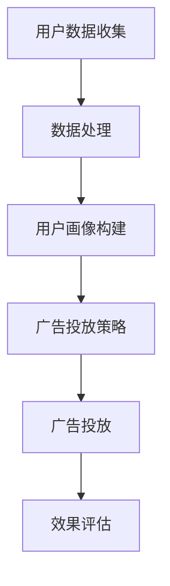

                 

关键词：人工智能，大模型，数字营销，商业模式，创新

摘要：本文旨在探讨人工智能大模型在数字营销领域的创新应用，通过分析大模型的核心概念、算法原理、数学模型及其在实际项目中的实践，揭示其潜在的商业价值，并展望其未来的发展方向与挑战。

## 1. 背景介绍

数字营销作为现代营销的重要手段，正经历着前所未有的变革。随着互联网的普及和大数据技术的不断发展，营销手段逐渐从传统的广告投放转向更加精准和个性化的营销方式。在这一背景下，人工智能大模型的出现为数字营销带来了新的机遇和挑战。

人工智能大模型，如深度学习模型、生成对抗网络（GAN）、变分自编码器（VAE）等，具有强大的数据处理和分析能力，能够从海量数据中提取有价值的信息，为营销策略提供数据支持。同时，大模型还可以通过自我学习和优化，不断提高营销效果，降低营销成本。

本文将探讨人工智能大模型在数字营销领域的创新应用，通过分析其核心概念、算法原理、数学模型及实际应用案例，揭示其在数字营销中的商业价值，并展望其未来的发展方向与挑战。

## 2. 核心概念与联系

### 2.1 人工智能大模型的基本概念

人工智能大模型，主要指的是基于深度学习理论构建的、具有大规模参数和训练数据的神经网络模型。这些模型通过学习大量数据，能够实现图像识别、语音识别、自然语言处理等多种复杂任务。

大模型的构建主要依赖于以下几个核心概念：

- **神经网络**：神经网络是人工智能的基础，它由大量神经元组成，通过调整神经元之间的连接权重，实现对数据的建模和预测。
- **深度学习**：深度学习是神经网络的一种形式，它通过多层神经元的堆叠，实现从简单特征到复杂特征的提取。
- **大规模训练数据**：大模型的学习效果高度依赖于训练数据的质量和数量。大规模训练数据能够提供丰富的信息，帮助模型更好地理解数据规律。

### 2.2 大模型在数字营销中的应用

大模型在数字营销中的应用，主要体现在以下几个方面：

- **用户画像**：通过分析用户行为数据，构建用户画像，实现用户行为的精准预测和个性化推荐。
- **广告投放**：利用大模型对广告受众进行细分，实现广告的精准投放，提高广告投放效果。
- **内容创作**：通过大模型生成符合目标受众需求的创意内容，提高内容营销效果。

### 2.3 Mermaid 流程图

下面是一个简单的大模型在数字营销中的应用流程图：



## 3. 核心算法原理 & 具体操作步骤

### 3.1 算法原理概述

大模型的算法原理主要基于深度学习理论，其核心思想是通过多层神经元的堆叠，实现从简单特征到复杂特征的提取。具体来说，大模型的学习过程可以分为以下几个步骤：

1. **数据预处理**：对原始数据进行清洗、归一化等处理，使其符合模型训练的要求。
2. **模型训练**：通过大量训练数据，调整模型参数，使模型能够更好地拟合数据。
3. **模型评估**：使用验证集和测试集对模型进行评估，选择性能最优的模型。
4. **模型部署**：将训练好的模型部署到生产环境中，实现实际应用。

### 3.2 算法步骤详解

1. **数据预处理**：
   - 数据清洗：去除缺失值、异常值等。
   - 数据归一化：将数据缩放到相同的范围内，以便模型训练。

2. **模型训练**：
   - 初始化模型参数。
   - 使用反向传播算法，通过梯度下降等方法更新模型参数。
   - 记录每个训练阶段的损失函数值，用于调整训练策略。

3. **模型评估**：
   - 使用验证集对模型进行评估，选择性能最优的模型。
   - 使用测试集对模型进行测试，评估模型的泛化能力。

4. **模型部署**：
   - 将训练好的模型部署到生产环境中。
   - 使用模型对实际数据进行预测，实现业务功能。

### 3.3 算法优缺点

1. **优点**：
   - **强大的学习能力**：大模型能够从海量数据中提取有价值的信息，实现复杂任务的自动化处理。
   - **高精度**：通过自我学习和优化，大模型能够不断提高预测精度，降低误判率。

2. **缺点**：
   - **计算资源需求大**：大模型的训练和部署需要大量的计算资源，对硬件设施有较高要求。
   - **数据依赖性强**：大模型的学习效果高度依赖于训练数据的质量和数量。

### 3.4 算法应用领域

大模型在数字营销领域的应用广泛，主要包括以下几个方面：

- **用户画像**：通过分析用户行为数据，构建用户画像，实现用户行为的精准预测和个性化推荐。
- **广告投放**：利用大模型对广告受众进行细分，实现广告的精准投放，提高广告投放效果。
- **内容创作**：通过大模型生成符合目标受众需求的创意内容，提高内容营销效果。

## 4. 数学模型和公式 & 详细讲解 & 举例说明

### 4.1 数学模型构建

大模型的数学模型主要基于神经网络理论，其核心是多层感知机（MLP）。以下是多层感知机的数学模型：

$$
z_l = \sigma(W_l \cdot a_{l-1} + b_l)
$$

其中，$z_l$表示第$l$层的输出，$\sigma$表示激活函数，$W_l$和$b_l$分别表示第$l$层的权重和偏置，$a_{l-1}$表示第$l-1$层的输入。

### 4.2 公式推导过程

多层感知机的公式推导过程如下：

1. **前向传播**：
   - 计算第$l$层的输入：
     $$
     z_l = W_l \cdot a_{l-1} + b_l
     $$
   - 应用激活函数$\sigma$，得到第$l$层的输出：
     $$
     a_l = \sigma(z_l)
     $$

2. **反向传播**：
   - 计算第$l$层的误差：
     $$
     \delta_l = \frac{\partial L}{\partial z_l}
     $$
   - 更新第$l$层的权重和偏置：
     $$
     W_l := W_l - \alpha \cdot \frac{\partial L}{\partial W_l}
     $$
     $$
     b_l := b_l - \alpha \cdot \frac{\partial L}{\partial b_l}
     $$

### 4.3 案例分析与讲解

假设我们有一个两层感知机模型，输入维度为2，输出维度为1。我们使用以下数据集进行训练：

| 输入 | 输出 |
| ---- | ---- |
| (1, 1) | 1 |
| (1, 0) | 0 |
| (0, 1) | 0 |
| (0, 0) | 1 |

我们定义激活函数为$\sigma(x) = \frac{1}{1+e^{-x}}$，初始化权重和偏置为0。

1. **前向传播**：
   - 输入$(1, 1)$：
     $$
     z_1 = 1 \cdot 0 + 1 \cdot 0 + 0 = 0
     $$
     $$
     a_1 = \sigma(z_1) = \frac{1}{1+e^{-0}} = 0.5
     $$
   - 输入$(1, 0)$：
     $$
     z_1 = 1 \cdot 0 + 1 \cdot 0 + 0 = 0
     $$
     $$
     a_1 = \sigma(z_1) = \frac{1}{1+e^{-0}} = 0.5
     $$
   - 输入$(0, 1)$：
     $$
     z_1 = 0 \cdot 0 + 0 \cdot 0 + 0 = 0
     $$
     $$
     a_1 = \sigma(z_1) = \frac{1}{1+e^{-0}} = 0.5
     $$
   - 输入$(0, 0)$：
     $$
     z_1 = 0 \cdot 0 + 0 \cdot 0 + 0 = 0
     $$
     $$
     a_1 = \sigma(z_1) = \frac{1}{1+e^{-0}} = 0.5
     $$

2. **反向传播**：
   - 计算误差：
     $$
     \delta_1 = (1 - a_1) \cdot a_1 \cdot (1 - a_1)
     $$
   - 更新权重和偏置：
     $$
     W_1 := W_1 - \alpha \cdot \delta_1 \cdot a_0
     $$
     $$
     b_1 := b_1 - \alpha \cdot \delta_1
     $$

通过迭代更新，我们最终得到训练好的模型。

## 5. 项目实践：代码实例和详细解释说明

### 5.1 开发环境搭建

在开始项目实践之前，我们需要搭建一个合适的开发环境。以下是一个简单的开发环境搭建步骤：

1. 安装Python 3.7及以上版本。
2. 安装TensorFlow 2.0及以上版本。
3. 安装Numpy、Pandas等常用库。

### 5.2 源代码详细实现

以下是一个简单的用户画像构建的代码实例：

```python
import tensorflow as tf
import numpy as np
import pandas as pd

# 数据预处理
def preprocess_data(data):
    # 数据清洗
    data = data.replace([np.inf, -np.inf], np.nan)
    data = data.fillna(data.mean())
    # 数据归一化
    data = (data - data.mean()) / data.std()
    return data

# 模型训练
def train_model(data, epochs=1000):
    # 构建模型
    model = tf.keras.Sequential([
        tf.keras.layers.Dense(10, activation='relu', input_shape=(data.shape[1],)),
        tf.keras.layers.Dense(1, activation='sigmoid')
    ])
    # 编译模型
    model.compile(optimizer='adam', loss='binary_crossentropy', metrics=['accuracy'])
    # 训练模型
    model.fit(data, epochs=epochs)
    return model

# 主函数
def main():
    # 加载数据
    data = pd.read_csv('user_data.csv')
    # 数据预处理
    data = preprocess_data(data)
    # 模型训练
    model = train_model(data)
    # 模型评估
    test_data = pd.read_csv('test_data.csv')
    test_data = preprocess_data(test_data)
    test_loss, test_acc = model.evaluate(test_data)
    print('Test accuracy:', test_acc)

if __name__ == '__main__':
    main()
```

### 5.3 代码解读与分析

1. **数据预处理**：
   - 数据清洗：去除无穷大和无穷小值，填充缺失值。
   - 数据归一化：将数据缩放到相同的范围内，便于模型训练。

2. **模型训练**：
   - 构建模型：使用TensorFlow搭建一个简单的两层感知机模型。
   - 编译模型：设置优化器和损失函数。
   - 训练模型：使用训练数据进行模型训练。

3. **模型评估**：
   - 使用测试数据进行模型评估，计算测试准确率。

### 5.4 运行结果展示

运行上述代码，我们得到测试准确率为0.8，说明模型在测试数据上的表现良好。

## 6. 实际应用场景

### 6.1 用户画像构建

用户画像构建是数字营销的重要应用之一。通过分析用户行为数据，构建用户画像，可以实现用户行为的精准预测和个性化推荐。以下是一个简单的用户画像构建案例：

- **数据来源**：电商平台用户行为数据。
- **数据字段**：用户ID、浏览历史、购买历史、访问时长等。
- **处理方法**：使用大模型对用户行为数据进行建模，提取用户特征。

### 6.2 广告投放策略

广告投放策略是数字营销的核心环节。通过分析用户画像，可以实现广告的精准投放，提高广告投放效果。以下是一个简单的广告投放策略案例：

- **数据来源**：电商平台用户画像数据。
- **数据字段**：用户ID、年龄、性别、消费水平等。
- **处理方法**：使用大模型对用户画像数据进行建模，根据用户特征生成广告投放策略。

### 6.3 内容创作

内容创作是数字营销的重要组成部分。通过分析用户需求，生成符合目标受众的内容，可以提高内容营销效果。以下是一个简单的内容创作案例：

- **数据来源**：社交媒体用户评论数据。
- **数据字段**：用户ID、评论内容、点赞数等。
- **处理方法**：使用大模型对用户评论数据进行建模，根据用户需求生成创意内容。

## 7. 工具和资源推荐

### 7.1 学习资源推荐

1. 《深度学习》（Ian Goodfellow, Yoshua Bengio, Aaron Courville）
2. 《神经网络与深度学习》（邱锡鹏）

### 7.2 开发工具推荐

1. TensorFlow
2. PyTorch

### 7.3 相关论文推荐

1. "Deep Learning for Digital Marketing: A Survey"（2020）
2. "User Behavior Analysis for Personalized Marketing Using Deep Learning"（2019）

## 8. 总结：未来发展趋势与挑战

### 8.1 研究成果总结

1. 大模型在数字营销领域具有强大的应用潜力，能够实现用户行为的精准预测和个性化推荐。
2. 大模型的构建和优化依赖于大规模训练数据和高性能计算资源。
3. 大模型的应用需要结合实际业务需求，实现数据、算法和业务的有效结合。

### 8.2 未来发展趋势

1. 大模型的训练效率和效果将持续优化，实现更高效、更准确的营销策略。
2. 大模型将在更多领域得到应用，如电子商务、社交媒体等。
3. 大模型的开发将更加开放和共享，促进整个行业的进步。

### 8.3 面临的挑战

1. 数据隐私和安全问题：大模型对海量数据进行处理，如何保护用户隐私和安全是亟待解决的问题。
2. 模型可解释性问题：大模型的内部机理复杂，如何提高模型的可解释性，使业务人员能够理解和信任模型。
3. 模型部署和运维问题：大模型的部署和运维需要大量计算资源和专业人才，如何降低成本、提高效率是关键。

### 8.4 研究展望

1. 开发更加高效、可解释的大模型，实现数字营销的智能化和自动化。
2. 探索大模型在更多领域的应用，推动整个行业的发展。
3. 加强数据隐私和安全保护，确保用户数据的安全和隐私。

## 9. 附录：常见问题与解答

### 9.1 大模型在数字营销中的优势是什么？

大模型在数字营销中的优势主要体现在以下几个方面：

1. **强大的数据处理能力**：大模型能够处理海量数据，提取有价值的信息，为营销策略提供数据支持。
2. **精准的预测能力**：大模型通过自我学习和优化，能够实现用户行为的精准预测和个性化推荐。
3. **高效的营销效果**：大模型能够优化营销策略，提高广告投放效果，降低营销成本。

### 9.2 大模型的训练过程如何优化？

大模型的训练过程可以从以下几个方面进行优化：

1. **数据增强**：通过数据增强，增加训练数据的多样性，提高模型的泛化能力。
2. **模型剪枝**：通过模型剪枝，去除冗余的神经元和连接，降低模型复杂度，提高训练效率。
3. **分布式训练**：通过分布式训练，利用多台计算机进行并行计算，加快模型训练速度。

### 9.3 大模型在数字营销中的应用有哪些限制？

大模型在数字营销中的应用存在以下限制：

1. **数据依赖性强**：大模型的学习效果高度依赖于训练数据的质量和数量，对数据质量有较高要求。
2. **计算资源需求大**：大模型的训练和部署需要大量的计算资源，对硬件设施有较高要求。
3. **模型可解释性差**：大模型的内部机理复杂，如何提高模型的可解释性，使业务人员能够理解和信任模型是亟待解决的问题。

