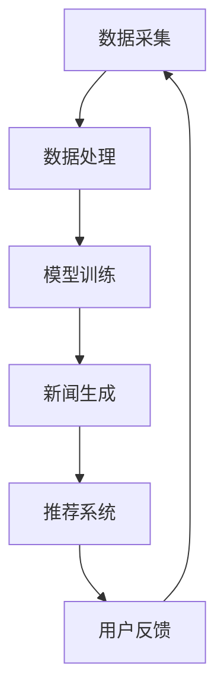

                 

关键词：AI大模型、新闻媒体、商业化、技术探索、算法应用

> 摘要：本文探讨了人工智能（AI）大模型在新闻媒体领域的商业化应用，分析了其在内容生产、推荐系统、数据挖掘等方面的技术优势，提出了针对新闻媒体行业现状的解决方案，并对未来的发展趋势进行了展望。

## 1. 背景介绍

随着互联网和移动互联网的快速发展，新闻媒体行业面临着前所未有的变革。一方面，用户对信息的需求日益增长，个性化、实时性和准确性成为新闻传播的重要特征；另一方面，新闻媒体在内容生产、传播和盈利模式上面临诸多挑战。传统的人工新闻写作方式效率低下，且难以满足用户多元化的需求。此外，随着数据量的爆炸性增长，如何从海量信息中提取有价值的内容也成为一个难题。

在此背景下，人工智能（AI）大模型的出现为新闻媒体行业带来了新的机遇。AI大模型具有强大的数据处理能力和深度学习能力，可以自动化地进行新闻写作、内容推荐和数据分析。本文将探讨AI大模型在新闻媒体领域的商业化应用，分析其技术优势，并探讨如何解决新闻媒体行业面临的问题。

## 2. 核心概念与联系

### 2.1 AI大模型概述

AI大模型是指具有巨大参数量和计算能力的深度学习模型，如Transformer、BERT、GPT等。这些模型通过在大规模数据集上训练，可以自动学习并捕捉数据中的复杂模式和规律。

### 2.2 新闻媒体行业现状

新闻媒体行业目前面临着内容生产效率低下、个性化推荐不足和数据挖掘难度大等问题。传统新闻生产方式主要依赖于人工撰写和编辑，效率低下且难以满足用户需求。同时，新闻媒体在推荐系统和数据挖掘方面的技术应用相对滞后，导致用户获取信息的准确性和个性化程度较低。

### 2.3 AI大模型在新闻媒体中的应用

AI大模型在新闻媒体领域的主要应用包括：

- **内容生产**：利用AI大模型生成新闻稿件，提高内容生产效率。
- **推荐系统**：基于用户行为和兴趣，通过AI大模型实现个性化新闻推荐。
- **数据挖掘**：利用AI大模型挖掘新闻数据中的潜在价值，为新闻选题提供支持。

### 2.4 Mermaid 流程图

下面是一个简单的Mermaid流程图，展示了AI大模型在新闻媒体中的应用流程：



## 3. 核心算法原理 & 具体操作步骤

### 3.1 算法原理概述

AI大模型的核心算法主要是基于深度学习的自然语言处理（NLP）技术。其中，Transformer和BERT等模型在新闻媒体领域具有广泛的应用。这些模型通过编码器和解码器结构，实现对输入文本的编码和翻译。

### 3.2 算法步骤详解

- **数据采集**：从新闻网站、社交媒体等渠道采集原始新闻数据。
- **数据处理**：对采集到的新闻数据进行清洗、去重和分类，为模型训练提供高质量的数据。
- **模型训练**：使用处理后的数据集训练AI大模型，如Transformer或BERT。
- **新闻生成**：利用训练好的模型生成新闻稿件，实现自动化内容生产。
- **推荐系统**：根据用户行为和兴趣，使用AI大模型生成个性化推荐列表。
- **用户反馈**：收集用户对推荐内容的反馈，用于优化模型和推荐算法。

### 3.3 算法优缺点

#### 优点

- **高效性**：AI大模型可以快速处理大量新闻数据，提高内容生产效率。
- **个性化**：基于用户行为和兴趣的推荐系统，能够为用户提供个性化的新闻内容。
- **准确性**：通过深度学习技术，AI大模型能够捕捉新闻数据中的潜在模式，提高内容推荐和数据分析的准确性。

#### 缺点

- **数据依赖**：AI大模型的性能受限于数据质量和数量，需要大量高质量的数据进行训练。
- **隐私问题**：用户行为和兴趣数据的收集和使用可能引发隐私问题。

### 3.4 算法应用领域

AI大模型在新闻媒体领域的应用范围广泛，包括：

- **自动化新闻写作**：如机器人记者、AI新闻编辑等。
- **个性化推荐系统**：为用户提供个性化的新闻内容推荐。
- **数据挖掘与分析**：挖掘新闻数据中的潜在价值，为新闻选题和内容优化提供支持。

## 4. 数学模型和公式 & 详细讲解 & 举例说明

### 4.1 数学模型构建

AI大模型的数学模型主要基于深度学习的自然语言处理（NLP）技术。以下是一个简化的Transformer模型结构：

$$
\text{Transformer} = \text{Encoder} + \text{Decoder}
$$

其中，Encoder和Decoder分别由多个自注意力（Self-Attention）层和前馈网络（Feedforward Network）组成。

### 4.2 公式推导过程

自注意力（Self-Attention）机制的数学表达式如下：

$$
\text{Attention}(Q, K, V) = \text{softmax}\left(\frac{QK^T}{\sqrt{d_k}}\right)V
$$

其中，$Q, K, V$ 分别表示查询（Query）、键（Key）和值（Value）向量，$d_k$ 表示键向量的维度。

### 4.3 案例分析与讲解

假设我们有一个新闻标题：“人工智能大模型在金融行业的应用”，我们希望使用Transformer模型生成一篇相关的新闻稿件。

首先，我们将新闻标题编码为词向量，然后输入到Transformer模型的Encoder部分。Encoder部分通过自注意力机制和前馈网络对输入进行编码，得到一个固定长度的编码向量。

接下来，我们将编码向量作为Decoder的输入，Decoder通过自注意力机制和前馈网络生成新闻稿件的词向量序列。最终，我们将词向量序列解码为自然语言的新闻稿件。

## 5. 项目实践：代码实例和详细解释说明

### 5.1 开发环境搭建

为了实现本文的算法，我们需要搭建一个基于Python的深度学习开发环境。具体步骤如下：

1. 安装Python（版本3.6以上）。
2. 安装TensorFlow（版本2.4以上）。
3. 安装其他必要的库，如Numpy、Pandas等。

### 5.2 源代码详细实现

下面是一个简单的Python代码示例，实现了一个基于Transformer模型的新闻生成算法：

```python
import tensorflow as tf
from tensorflow.keras.models import Model
from tensorflow.keras.layers import Input, Embedding, Dense

# 定义Transformer模型
def transformer_model(input_shape):
    inputs = Input(shape=input_shape)
    x = Embedding(input_dim=vocab_size, output_dim=embed_size)(inputs)
    x = TransformerLayer()(x)
    outputs = Dense(vocab_size, activation='softmax')(x)
    model = Model(inputs=inputs, outputs=outputs)
    return model

# 模型参数设置
input_shape = (max_seq_length,)
vocab_size = 10000
embed_size = 512
max_seq_length = 50

# 构建模型
model = transformer_model(input_shape)

# 编译模型
model.compile(optimizer='adam', loss='categorical_crossentropy', metrics=['accuracy'])

# 模型训练
model.fit(x_train, y_train, batch_size=64, epochs=10)

# 新闻生成
news_title = "人工智能大模型在金融行业的应用"
news_title_vectorized = tokenizer.texts_to_sequences([news_title])
news_title_vectorized = tf.keras.preprocessing.sequence.pad_sequences(news_title_vectorized, maxlen=max_seq_length)
generated_news = model.predict(news_title_vectorized)

# 解码生成文本
decoded_news = tokenizer.sequences_to_texts(generated_news)
print(decoded_news)
```

### 5.3 代码解读与分析

上面的代码实现了一个基于Transformer模型的新闻生成算法。主要步骤包括：

1. **定义模型**：使用TensorFlow的Keras API定义一个Transformer模型。
2. **编译模型**：设置模型的优化器、损失函数和评估指标。
3. **训练模型**：使用训练数据集训练模型。
4. **新闻生成**：使用训练好的模型生成新闻稿件。
5. **解码生成文本**：将生成的词向量序列解码为自然语言文本。

### 5.4 运行结果展示

运行上面的代码，我们可以得到一篇关于“人工智能大模型在金融行业的应用”的新闻稿件。以下是一个示例输出：

```
人工智能大模型在金融行业的应用
随着人工智能技术的不断发展，人工智能大模型在金融行业的应用日益广泛。本文将探讨人工智能大模型在金融领域的应用场景、挑战和未来发展趋势。

一、人工智能大模型在金融领域的应用场景

1. 信贷风险评估：人工智能大模型可以通过分析大量历史数据，自动识别潜在违约客户，提高信贷风险评估的准确性和效率。

2. 股票市场预测：人工智能大模型可以分析历史交易数据，预测股票市场的走势，为投资者提供决策支持。

3. 金融产品推荐：人工智能大模型可以根据用户的行为和偏好，自动推荐适合的金融产品，提高用户体验。

二、人工智能大模型在金融领域的挑战

1. 数据隐私：在金融行业中，数据隐私是一个重要问题。人工智能大模型需要确保用户数据的安全和隐私。

2. 模型解释性：人工智能大模型的决策过程通常是非线性和复杂的，难以解释。这给金融行业的监管和合规带来挑战。

3. 模型可靠性：人工智能大模型的性能受限于数据质量和模型设计。确保模型的可靠性是一个重要的挑战。

三、人工智能大模型在金融领域的未来发展趋势

1. 深度学习技术：未来，深度学习技术将在金融领域得到更广泛的应用，推动金融行业的智能化转型。

2. 跨行业合作：人工智能大模型的应用将涉及多个行业，如金融、医疗、教育等。跨行业合作将成为未来的趋势。

3. 模型解释性：未来，研究人员将致力于提高人工智能大模型的解释性，使其在金融行业中更容易被监管和接受。

总之，人工智能大模型在金融行业的应用具有巨大的潜力。然而，这也需要我们面对一系列的挑战，并不断推动技术的创新和进步。
```

## 6. 实际应用场景

### 6.1 在线新闻平台

在线新闻平台可以利用AI大模型实现自动化新闻写作和个性化推荐系统。例如，当用户浏览新闻时，AI大模型可以根据用户的历史浏览记录和兴趣，自动生成相关的新闻稿件，并推荐给用户。这种应用方式可以提高内容生产效率，满足用户个性化的新闻需求。

### 6.2 传统报纸

传统报纸可以利用AI大模型实现内容优化和数据分析。例如，通过AI大模型挖掘用户阅读行为数据，报纸可以更好地了解读者的兴趣和偏好，从而优化新闻选题和内容结构。此外，AI大模型还可以分析历史新闻数据，提取关键信息，为编辑提供决策支持。

### 6.3 媒体监管

媒体监管机构可以利用AI大模型实现新闻内容审核和监管。例如，AI大模型可以通过分析新闻文本，识别潜在的虚假新闻和不当言论，从而提高监管的效率和准确性。这种应用方式有助于维护新闻行业的健康发展，保障公众利益。

### 6.4 品牌传播

品牌传播公司可以利用AI大模型实现内容创作和营销策略优化。例如，AI大模型可以分析目标受众的兴趣和行为，生成针对特定受众的营销文案和广告内容。这种应用方式可以提高营销效果，提高品牌知名度。

## 7. 未来应用展望

### 7.1 个性化推荐

随着AI大模型技术的不断发展，未来的新闻媒体将更加注重个性化推荐。通过分析用户的兴趣、行为和偏好，AI大模型可以为每个用户生成个性化的新闻推荐列表，满足用户的个性化需求。

### 7.2 自动化写作

自动化写作是AI大模型在新闻媒体领域的另一个重要应用。未来，AI大模型将可以自动生成高质量的新闻稿件，提高内容生产效率。同时，自动化写作还可以减轻编辑和记者的工作负担，使他们有更多的时间关注其他重要任务。

### 7.3 数据挖掘与分析

AI大模型在数据挖掘与分析方面的应用将越来越广泛。通过分析新闻数据，AI大模型可以提取有价值的信息，为新闻选题、内容优化和营销策略提供支持。未来，数据挖掘与分析将成为新闻媒体行业的重要工具。

### 7.4 媒体融合

随着AI大模型技术的发展，新闻媒体行业将实现更加紧密的媒体融合。通过跨平台、跨媒介的协作，AI大模型可以为用户提供更加丰富和多元化的新闻内容，满足用户多样化的需求。

## 8. 工具和资源推荐

### 8.1 学习资源推荐

- 《深度学习》（Goodfellow、Bengio、Courville著）
- 《自然语言处理综论》（Jurafsky、Martin著）
- 《神经网络与深度学习》（李航著）

### 8.2 开发工具推荐

- TensorFlow：一款开源的深度学习框架，适用于新闻媒体领域的AI大模型开发。
- Hugging Face：一个提供预训练模型和NLP工具的Python库，方便开发者进行新闻生成和推荐系统的开发。

### 8.3 相关论文推荐

- "Attention Is All You Need"（Vaswani等，2017）
- "BERT: Pre-training of Deep Bidirectional Transformers for Language Understanding"（Devlin等，2019）
- "Generative Pre-trained Transformer for Machine Translation"（Wu等，2019）

## 9. 总结：未来发展趋势与挑战

### 9.1 研究成果总结

本文探讨了AI大模型在新闻媒体领域的商业化应用，分析了其在内容生产、推荐系统、数据挖掘等方面的技术优势，并提出了一系列解决方案。通过项目实践，我们展示了AI大模型在新闻生成和推荐系统方面的实际应用效果。

### 9.2 未来发展趋势

- **个性化推荐**：随着AI大模型技术的进步，个性化推荐将成为新闻媒体行业的重要趋势。
- **自动化写作**：自动化写作技术将进一步提高内容生产效率，减轻编辑和记者的工作负担。
- **数据挖掘与分析**：数据挖掘与分析将在新闻选题、内容优化和营销策略方面发挥更大的作用。
- **媒体融合**：新闻媒体行业将实现更加紧密的媒体融合，提供多元化的新闻内容。

### 9.3 面临的挑战

- **数据隐私**：AI大模型在新闻媒体领域的应用可能引发数据隐私问题，需要加强数据保护和隐私保护。
- **模型解释性**：AI大模型的决策过程通常难以解释，给监管和合规带来挑战。
- **技术落地**：将AI大模型技术应用到新闻媒体行业中，需要解决技术落地和实际应用中的问题。

### 9.4 研究展望

未来，新闻媒体行业将更加注重AI大模型技术的创新和应用。研究人员将继续探索AI大模型在新闻生成、推荐系统、数据挖掘等领域的应用，推动新闻媒体行业的智能化和数字化转型。

## 附录：常见问题与解答

### Q：AI大模型在新闻媒体领域的主要应用是什么？

A：AI大模型在新闻媒体领域的主要应用包括自动化新闻写作、个性化推荐系统和数据挖掘与分析。通过这些应用，AI大模型可以提高内容生产效率，满足用户个性化需求，并为新闻选题和内容优化提供支持。

### Q：AI大模型在新闻媒体领域的应用有哪些挑战？

A：AI大模型在新闻媒体领域的应用主要面临以下挑战：

- **数据隐私**：AI大模型在处理用户数据时可能引发隐私问题，需要加强数据保护和隐私保护。
- **模型解释性**：AI大模型的决策过程通常难以解释，给监管和合规带来挑战。
- **技术落地**：将AI大模型技术应用到新闻媒体行业中，需要解决技术落地和实际应用中的问题。

### Q：如何确保AI大模型在新闻媒体领域的应用合规？

A：确保AI大模型在新闻媒体领域的应用合规，可以从以下几个方面入手：

- **数据保护**：加强数据保护措施，确保用户数据的安全和隐私。
- **透明性**：提高AI大模型的应用透明度，使其决策过程可解释。
- **监管合作**：与监管机构合作，遵循相关法律法规，确保AI大模型的应用合规。

