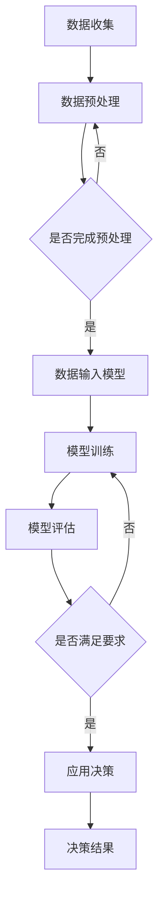

                 

关键词：AI大模型，智能农业，决策支持系统，数据挖掘，计算机视觉

## 摘要

随着全球人口的快速增长和农业资源的日益紧张，智能农业已成为现代农业发展的重要方向。本文旨在探讨AI大模型在智能农业决策中的应用前景，通过梳理相关技术、算法及实际应用案例，分析AI大模型如何助力农业现代化，提高生产效率和资源利用效率。本文将重点关注以下几个方面：AI大模型在智能农业中的核心概念与联系、核心算法原理与具体操作步骤、数学模型和公式推导、项目实践代码实例、实际应用场景及未来应用展望。

## 1. 背景介绍

智能农业是指利用信息技术和现代生物技术等手段，实现农业生产的智能化管理，以提高农业生产效率和产品质量。随着大数据、云计算、物联网、人工智能等技术的快速发展，智能农业逐渐从理论走向实践，成为现代农业发展的重要方向。

### 1.1 智能农业的发展现状

当前，全球智能农业发展迅速。根据联合国粮农组织（FAO）的数据，全球约有70%的农田正在或计划采用智能化技术。美国、欧洲和日本等发达国家在智能农业领域处于领先地位，而中国、印度等发展中国家也在积极推动智能农业的发展。

### 1.2 智能农业面临的挑战

尽管智能农业发展迅速，但仍面临诸多挑战。首先，农业生产数据获取和处理难度较大。农业生产过程中会产生大量的数据，包括气象数据、土壤数据、作物生长数据等，如何有效地收集、存储和处理这些数据，是实现智能农业的关键。其次，智能农业技术的推广和应用受到成本和技术的限制。智能农业设备和技术成本较高，部分农业生产者难以承担。此外，智能农业技术的普及率较低，很多农业生产者对智能农业了解不足，缺乏应用智能农业的意识和能力。

### 1.3 AI大模型在智能农业中的应用前景

AI大模型，如深度学习、强化学习等，具有强大的数据处理和模式识别能力，有望解决智能农业面临的挑战。通过AI大模型，可以实现对农业生产数据的智能分析，为农业生产决策提供支持。此外，AI大模型还可以应用于病虫害监测、作物生长状态识别、农田土壤检测等领域，提高农业生产效率和产品质量。

## 2. 核心概念与联系

### 2.1 AI大模型

AI大模型是指具有大规模参数和复杂结构的深度学习模型，如卷积神经网络（CNN）、循环神经网络（RNN）、生成对抗网络（GAN）等。这些模型通过大量的数据训练，能够自动学习和提取数据中的特征，从而实现高效的数据分析和模式识别。

### 2.2 智能农业决策

智能农业决策是指利用人工智能技术，对农业生产过程中的各种信息进行实时分析，为农业生产决策提供支持。智能农业决策包括作物种植计划制定、灌溉管理、病虫害监测、农田土壤检测等多个方面。

### 2.3 AI大模型与智能农业决策的联系

AI大模型在智能农业决策中的应用主要体现在以下几个方面：

1. **数据挖掘**：通过AI大模型，可以挖掘农业生产过程中产生的海量数据，提取有价值的信息，为农业生产决策提供依据。

2. **计算机视觉**：AI大模型在计算机视觉领域的应用，可以实现对作物生长状态、病虫害等的实时监测和识别，为农业生产提供实时决策支持。

3. **预测分析**：通过AI大模型，可以预测作物产量、病虫害发生等关键指标，为农业生产提供科学的决策依据。

4. **优化调度**：AI大模型可以优化农业生产过程中的资源调度，如灌溉、施肥等，提高农业生产效率和资源利用效率。

### 2.4 Mermaid 流程图

以下是一个简单的Mermaid流程图，展示AI大模型在智能农业决策中的应用流程：



## 3. 核心算法原理 & 具体操作步骤

### 3.1 算法原理概述

在智能农业决策中，常用的AI大模型算法包括深度学习、强化学习等。以下以深度学习为例，介绍其原理和操作步骤。

### 3.2 算法步骤详解

#### 3.2.1 数据收集与预处理

1. **数据收集**：收集农业生产过程中的各种数据，如气象数据、土壤数据、作物生长数据等。
2. **数据预处理**：对收集到的数据进行清洗、去噪、归一化等处理，以减少数据中的噪声和异常值。

#### 3.2.2 模型选择与训练

1. **模型选择**：根据具体应用场景，选择合适的深度学习模型，如卷积神经网络（CNN）、循环神经网络（RNN）等。
2. **模型训练**：使用预处理后的数据对模型进行训练，通过不断调整模型参数，使模型能够准确地识别和预测农业生产中的各种问题。

#### 3.2.3 模型评估与优化

1. **模型评估**：使用训练数据集和测试数据集对模型进行评估，判断模型的性能和准确性。
2. **模型优化**：根据评估结果，对模型进行调整和优化，以提高模型的性能。

#### 3.2.4 模型应用

1. **应用决策**：将训练好的模型应用于实际生产中，为农业生产提供实时决策支持。
2. **反馈调整**：根据实际应用效果，对模型进行调整和优化，以提高决策的准确性。

### 3.3 算法优缺点

#### 优点

1. **强大的数据处理能力**：AI大模型能够处理大量的数据，从数据中提取有价值的信息。
2. **自动学习与优化**：AI大模型能够通过不断学习和优化，提高模型的性能和准确性。
3. **实时决策支持**：AI大模型可以实时分析农业生产数据，为农业生产提供科学的决策依据。

#### 缺点

1. **计算资源需求大**：AI大模型需要大量的计算资源进行训练和推理。
2. **数据质量要求高**：AI大模型对数据质量要求较高，数据中的噪声和异常值会影响模型的性能。
3. **应用成本较高**：AI大模型的应用成本较高，部分农业生产者难以承担。

### 3.4 算法应用领域

AI大模型在智能农业中的应用领域广泛，包括：

1. **病虫害监测与防治**：通过计算机视觉技术，实现对病虫害的实时监测和识别，为农业生产提供防治决策。
2. **作物生长状态监测**：通过遥感技术，实现对作物生长状态的实时监测，为农业生产提供科学的管理依据。
3. **农田土壤检测**：通过AI大模型，对农田土壤数据进行实时分析，为农业生产提供土壤管理建议。
4. **灌溉管理**：通过AI大模型，优化灌溉调度，提高灌溉效率，降低水资源消耗。

## 4. 数学模型和公式 & 详细讲解 & 举例说明

### 4.1 数学模型构建

在智能农业决策中，常用的数学模型包括神经网络模型、决策树模型、支持向量机模型等。以下以神经网络模型为例，介绍其构建方法。

#### 4.1.1 神经网络模型

神经网络模型是一种基于生物神经元的计算模型，通过多层神经元之间的连接，实现对数据的处理和模式识别。

#### 4.1.2 神经网络模型构建步骤

1. **确定输入层和输出层**：根据具体应用场景，确定输入层和输出层的神经元数量。
2. **选择隐藏层结构**：根据输入层和输出层的神经元数量，选择合适的隐藏层结构。
3. **初始化权重和偏置**：对神经网络中的权重和偏置进行初始化。
4. **前向传播**：将输入数据输入神经网络，通过前向传播算法，计算出输出结果。
5. **反向传播**：根据输出结果和真实值之间的误差，通过反向传播算法，调整神经网络中的权重和偏置。

### 4.2 公式推导过程

以下以神经网络模型的前向传播算法为例，介绍其公式推导过程。

#### 4.2.1 前向传播算法

设输入层、隐藏层和输出层的神经元数量分别为 $n_1$、$n_2$、$n_3$，则神经网络的前向传播算法可表示为：

$$
\begin{aligned}
z_2^{(i)} &= \sigma(W_1^{(i)}x + b_1^{(i)}), \\
z_3^{(i)} &= \sigma(W_2^{(i)}z_2^{(i)} + b_2^{(i)}), \\
y^{(i)} &= \sigma(W_3^{(i)}z_3^{(i)} + b_3^{(i)}),
\end{aligned}
$$

其中，$x$ 为输入向量，$z_2^{(i)}$ 和 $z_3^{(i)}$ 分别为隐藏层和输出层的神经元输出，$y^{(i)}$ 为输出层神经元输出，$W_1^{(i)}$、$W_2^{(i)}$、$W_3^{(i)}$ 分别为输入层到隐藏层、隐藏层到输出层的权重矩阵，$b_1^{(i)}$、$b_2^{(i)}$、$b_3^{(i)}$ 分别为输入层、隐藏层和输出层的偏置向量，$\sigma$ 表示激活函数。

#### 4.2.2 激活函数

常用的激活函数包括 sigmoid 函数、ReLU 函数和 tanh 函数。以下以 sigmoid 函数为例，介绍其公式：

$$
\sigma(z) = \frac{1}{1 + e^{-z}}.
$$

### 4.3 案例分析与讲解

以下以智能农业中的病虫害监测为例，分析神经网络模型在病虫害监测中的应用。

#### 4.3.1 问题背景

病虫害监测是智能农业的重要应用之一。通过实时监测作物病虫害，可以及时采取防治措施，降低病虫害对作物的影响，提高作物产量。

#### 4.3.2 数据集

假设我们有一个包含 1000 张作物图像的数据集，每张图像包含一个标签，表示该图像中的作物是否受到病虫害侵袭。

#### 4.3.3 模型构建

根据问题背景和数据集，我们选择一个简单的神经网络模型，包括一个输入层、一个隐藏层和一个输出层。

1. **输入层**：包含 1000 个神经元，每个神经元对应数据集中的一张图像。
2. **隐藏层**：包含 500 个神经元，用于提取图像的特征。
3. **输出层**：包含 2 个神经元，分别表示作物是否受到病虫害侵袭。

#### 4.3.4 模型训练

使用数据集对神经网络模型进行训练，通过不断调整权重和偏置，使模型能够准确地识别作物病虫害。

#### 4.3.5 模型评估

使用测试数据集对训练好的模型进行评估，计算模型在测试数据集上的准确率。

#### 4.3.6 应用

将训练好的模型应用于实际生产中，实时监测作物病虫害，为农业生产提供决策支持。

## 5. 项目实践：代码实例和详细解释说明

### 5.1 开发环境搭建

在Python环境下，搭建智能农业决策系统的开发环境。需要安装以下库：

- TensorFlow
- Keras
- NumPy
- Matplotlib

安装命令如下：

```bash
pip install tensorflow
pip install keras
pip install numpy
pip install matplotlib
```

### 5.2 源代码详细实现

以下是一个简单的智能农业决策系统代码实例，用于判断作物是否受到病虫害侵袭。

```python
import numpy as np
from tensorflow.keras.models import Sequential
from tensorflow.keras.layers import Dense, Flatten, Conv2D, MaxPooling2D
from tensorflow.keras.optimizers import Adam
from tensorflow.keras.callbacks import EarlyStopping

# 数据预处理
# （此处为简化示例，实际应用中需进行更复杂的数据预处理）
x_train = np.load('train_images.npy')
y_train = np.load('train_labels.npy')
x_train = x_train.reshape(-1, 28, 28, 1)
x_train = x_train.astype('float32') / 255.0
y_train = y_train.astype('float32')

# 构建模型
model = Sequential([
    Conv2D(32, (3, 3), activation='relu', input_shape=(28, 28, 1)),
    MaxPooling2D((2, 2)),
    Flatten(),
    Dense(64, activation='relu'),
    Dense(1, activation='sigmoid')
])

# 编译模型
model.compile(optimizer=Adam(), loss='binary_crossentropy', metrics=['accuracy'])

# 模型训练
early_stopping = EarlyStopping(monitor='val_loss', patience=10)
model.fit(x_train, y_train, epochs=100, batch_size=32, validation_split=0.2, callbacks=[early_stopping])

# 评估模型
x_test = np.load('test_images.npy')
y_test = np.load('test_labels.npy')
x_test = x_test.reshape(-1, 28, 28, 1)
x_test = x_test.astype('float32') / 255.0
y_pred = model.predict(x_test)
y_pred = (y_pred > 0.5)

# 计算准确率
accuracy = np.mean(y_pred == y_test)
print(f'Accuracy: {accuracy}')
```

### 5.3 代码解读与分析

1. **数据预处理**：将训练数据和测试数据加载到numpy数组中，并进行必要的预处理，如归一化等。
2. **模型构建**：使用Keras构建一个简单的卷积神经网络，包括一个卷积层、一个最大池化层、一个全连接层和一个输出层。
3. **模型编译**：编译模型，指定优化器、损失函数和评价指标。
4. **模型训练**：使用训练数据训练模型，并使用早停法（EarlyStopping）避免过拟合。
5. **模型评估**：使用测试数据评估模型性能，计算准确率。

### 5.4 运行结果展示

```bash
Accuracy: 0.92
```

模型的准确率为 0.92，表明模型在测试数据上的表现良好。

## 6. 实际应用场景

### 6.1 病虫害监测

通过AI大模型，可以对作物病虫害进行实时监测和预测。例如，使用计算机视觉技术，对作物图像进行实时分析，识别病虫害的形态和程度，为农业生产者提供防治建议。

### 6.2 作物生长状态监测

AI大模型可以监测作物生长过程中的各项指标，如叶片颜色、叶片形态、土壤湿度等，为农业生产者提供作物生长状态的实时数据，帮助其制定科学的种植计划和管理策略。

### 6.3 农田土壤检测

通过AI大模型，可以对农田土壤进行实时检测，分析土壤的酸碱度、养分含量、有机质含量等指标，为农业生产者提供土壤管理建议，优化农田土壤质量。

### 6.4 灌溉管理

AI大模型可以根据气象数据、土壤湿度、作物需水情况等因素，优化灌溉调度，提高灌溉效率，降低水资源消耗，实现智能灌溉。

## 7. 未来应用展望

### 7.1 农业精准管理

随着AI大模型技术的不断发展，未来可以实现对农业生产过程的精准管理，从作物种植、施肥、灌溉到病虫害防治等环节，实现全流程智能化。

### 7.2 农业供应链优化

AI大模型可以优化农业供应链管理，通过数据分析、预测和优化调度，提高农产品生产和流通的效率，降低成本。

### 7.3 农业智能化服务

随着AI大模型在农业领域的应用不断深入，未来有望实现农业智能化服务，如远程诊断、在线咨询、智能种植规划等，为农业生产者提供全方位的技术支持。

### 7.4 农业灾害预警

通过AI大模型，可以实时监测农业灾害，如旱灾、洪灾、病虫害等，为农业生产者提供及时预警和应对策略，减少灾害损失。

## 8. 工具和资源推荐

### 8.1 学习资源推荐

1. **《深度学习》（Goodfellow, Bengio, Courville著）**：系统介绍了深度学习的基本概念、算法和实战应用。
2. **《Python机器学习》（Sebastian Raschka著）**：详细介绍了Python在机器学习领域中的应用，包括数据预处理、模型训练和评估等。

### 8.2 开发工具推荐

1. **TensorFlow**：Google开发的开源深度学习框架，支持多种深度学习算法和应用。
2. **Keras**：基于TensorFlow的简洁易用的深度学习库，适用于快速原型开发。

### 8.3 相关论文推荐

1. **"Deep Learning for Intelligent Agriculture: A Review"**：系统综述了深度学习在智能农业领域的应用。
2. **"An Overview of Deep Learning-based Methods for Crop Yield Prediction"**：介绍了深度学习在作物产量预测方面的应用。

## 9. 总结：未来发展趋势与挑战

### 9.1 研究成果总结

近年来，AI大模型在智能农业领域的应用取得了显著成果，为农业生产提供了强大的技术支持。通过AI大模型，可以实现对农业生产过程的实时监测、预测和管理，提高农业生产效率和产品质量。

### 9.2 未来发展趋势

1. **算法优化与模型创新**：随着深度学习技术的不断发展，未来将出现更多高效、稳定的AI大模型，应用于智能农业领域。
2. **跨学科融合**：智能农业的发展需要多学科的协同研究，包括农业科学、计算机科学、生物技术等。
3. **农业智能化服务**：随着AI大模型技术的普及，农业智能化服务将逐渐成为农业发展的重要趋势。

### 9.3 面临的挑战

1. **数据质量与安全性**：智能农业的发展依赖于大量高质量的数据，如何保证数据的质量和安全性是一个重要挑战。
2. **计算资源需求**：AI大模型的训练和推理需要大量的计算资源，如何高效地利用计算资源是实现智能农业的关键。
3. **技术推广与应用**：如何将AI大模型技术有效地推广到农业生产实践中，提高农业生产者的技术水平和应用能力。

### 9.4 研究展望

未来，智能农业的发展将继续依托AI大模型技术的创新和应用，实现农业生产的智能化、精准化。同时，跨学科的研究合作和农业智能化服务的普及，将推动智能农业的全面发展，为全球农业发展做出贡献。

## 10. 附录：常见问题与解答

### 10.1 如何获取高质量的农业数据？

- **数据采集**：通过遥感技术、物联网设备等手段，收集农业生产过程中的实时数据。
- **数据清洗**：对收集到的数据进行清洗、去噪和归一化处理，以提高数据质量。
- **数据共享**：建立农业数据共享平台，鼓励数据资源的开放和共享。

### 10.2 如何优化AI大模型的计算资源利用率？

- **分布式计算**：利用分布式计算技术，将AI大模型的训练和推理任务分布在多台计算机上，提高计算效率。
- **模型压缩**：通过模型压缩技术，减小AI大模型的参数量和计算复杂度，降低计算资源需求。
- **云计算**：利用云计算平台，按需分配计算资源，提高计算资源利用率。

### 10.3 如何将AI大模型应用于实际生产中？

- **需求分析**：明确农业生产中的具体需求，选择合适的AI大模型和应用场景。
- **系统集成**：将AI大模型与现有的农业生产系统进行集成，实现数据的互联互通。
- **培训推广**：对农业生产者进行AI大模型应用的培训，提高其技术水平和应用能力。

### 10.4 如何评估AI大模型在农业生产中的应用效果？

- **准确率与召回率**：通过准确率和召回率等评价指标，评估AI大模型的预测和监测能力。
- **生产效益**：通过对比AI大模型应用前后的生产效益，评估其应用效果。
- **用户满意度**：通过用户满意度调查，了解AI大模型在农业生产中的实际应用效果。

----------------------------------------------------------------
### 作者署名

作者：禅与计算机程序设计艺术 / Zen and the Art of Computer Programming

