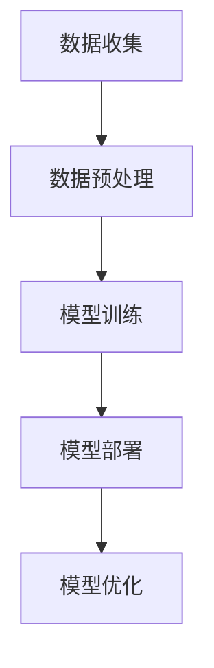

                 

关键词：AI大模型、智能建筑管理、应用趋势、技术创新

> 摘要：本文旨在探讨人工智能（AI）大模型在智能建筑管理中的广泛应用和未来发展趋势。通过分析核心概念、算法原理、数学模型、项目实践以及实际应用场景，本文将揭示AI大模型在智能建筑管理领域的潜力和前景。

## 1. 背景介绍

随着城市化进程的加速和建筑技术的不断发展，智能建筑已成为现代城市建设的重要组成部分。智能建筑通过集成先进的传感技术、通信网络、数据分析和人工智能技术，实现对建筑设备、系统和设施的智能化管理和控制。然而，智能建筑管理面临着日益复杂的数据处理和决策支持需求，传统的管理方法已经难以满足现代建筑的管理需求。

近年来，人工智能特别是大模型的迅速发展，为智能建筑管理带来了新的机遇和挑战。大模型具有强大的数据处理能力和自主学习能力，能够处理海量数据并从中提取有价值的信息。因此，AI大模型在智能建筑管理中的应用已经成为一个备受关注的研究领域。

## 2. 核心概念与联系

在智能建筑管理中，AI大模型的核心概念包括数据收集、数据预处理、模型训练、模型部署和模型优化。以下是这些核心概念的 Mermaid 流程图：



### 2.1 数据收集

数据收集是智能建筑管理的第一步，也是至关重要的一步。通过传感器网络，智能建筑可以实时收集各种数据，包括温度、湿度、光照、人员流动等。这些数据是后续分析和决策的基础。

### 2.2 数据预处理

收集到的原始数据通常包含噪声和冗余信息，因此需要进行数据预处理。数据预处理包括数据清洗、数据归一化和特征提取等步骤，以提高数据质量和模型的训练效果。

### 2.3 模型训练

在数据预处理之后，使用大模型进行训练。大模型通常具有数十亿甚至数万亿个参数，能够从海量数据中学习复杂的模式。训练过程包括模型初始化、损失函数定义、优化算法选择和训练过程监控等。

### 2.4 模型部署

训练好的大模型需要部署到实际的智能建筑系统中，以实现实时数据分析和决策支持。部署过程包括模型加载、实时数据流处理和决策输出等。

### 2.5 模型优化

为了提高大模型在智能建筑管理中的性能，需要不断地对模型进行优化。优化过程包括模型调整、参数调整和算法改进等。

## 3. 核心算法原理 & 具体操作步骤

### 3.1 算法原理概述

AI大模型在智能建筑管理中主要基于深度学习技术。深度学习是一种模拟人脑神经网络结构的学习方法，通过多层次的神经网络结构对数据进行特征提取和模式识别。

### 3.2 算法步骤详解

1. **数据收集**：通过传感器网络收集建筑内外部的数据，包括环境数据、设备状态数据、人员活动数据等。

2. **数据预处理**：对收集到的数据进行清洗、归一化和特征提取，以减少噪声和提高模型性能。

3. **模型选择**：选择适合智能建筑管理任务的大模型，如卷积神经网络（CNN）、循环神经网络（RNN）或变分自编码器（VAE）等。

4. **模型训练**：使用预处理后的数据进行模型训练，通过迭代优化模型参数，使模型能够准确识别数据中的特征和模式。

5. **模型评估**：在训练数据集和测试数据集上评估模型的性能，包括准确率、召回率、F1分数等指标。

6. **模型部署**：将训练好的模型部署到智能建筑管理系统中，实现实时数据分析和决策支持。

7. **模型优化**：根据实际应用情况，对模型进行调整和优化，以提高模型的性能和鲁棒性。

### 3.3 算法优缺点

**优点**：
1. **强大的数据处理能力**：大模型能够处理海量数据，提取复杂特征。
2. **自主学习能力**：大模型具有自主学习能力，能够从数据中学习并优化模型。
3. **高效性**：深度学习算法在处理复杂数据任务时具有高效性。

**缺点**：
1. **计算资源需求大**：大模型训练和推理需要大量计算资源和时间。
2. **数据依赖性高**：大模型的效果很大程度上依赖于数据质量和多样性。
3. **模型解释性差**：深度学习模型的内部结构和决策过程较为复杂，难以解释。

### 3.4 算法应用领域

AI大模型在智能建筑管理中的应用领域广泛，包括但不限于以下方面：
1. **能源管理**：通过预测能源消耗和优化能源使用，实现节能减排。
2. **设备维护**：通过实时监测设备状态，预测设备故障和提前进行维护。
3. **安全管理**：通过人脸识别、行为分析等技术，提高建筑的安全性和防范能力。
4. **环境控制**：通过实时监测环境数据，优化环境控制系统的运行。

## 4. 数学模型和公式

### 4.1 数学模型构建

在AI大模型中，数学模型通常基于深度学习框架构建。以下是一个简单的神经网络模型：

$$
y = \sigma(W_1 \cdot x + b_1)
$$

其中，$y$ 是输出，$\sigma$ 是激活函数，$W_1$ 和 $b_1$ 分别是权重和偏置。

### 4.2 公式推导过程

深度学习模型的训练过程主要包括前向传播和反向传播两个阶段。以下是前向传播的推导过程：

$$
\begin{align*}
z_1 &= W_1 \cdot x + b_1 \\
a_1 &= \sigma(z_1) \\
z_2 &= W_2 \cdot a_1 + b_2 \\
a_2 &= \sigma(z_2) \\
&\vdots \\
z_n &= W_n \cdot a_{n-1} + b_n \\
a_n &= \sigma(z_n)
\end{align*}
$$

### 4.3 案例分析与讲解

以一个简单的房价预测模型为例，使用神经网络模型对房价进行预测。以下是模型的实现和结果分析：

### 4.3.1 数据集准备

假设我们有一个包含房屋特征（如面积、房间数、年龄等）和房价的的数据集。

### 4.3.2 模型构建

使用深度学习框架（如TensorFlow或PyTorch）构建一个简单的全连接神经网络模型。

### 4.3.3 模型训练

使用训练集对模型进行训练，通过迭代优化模型参数，使模型能够准确预测房价。

### 4.3.4 模型评估

使用测试集对模型进行评估，计算模型的预测误差和准确率。

### 4.3.5 结果分析

根据模型评估结果，分析模型在预测房价方面的性能，并提出改进建议。

## 5. 项目实践：代码实例和详细解释说明

### 5.1 开发环境搭建

搭建一个Python开发环境，安装TensorFlow或其他深度学习框架。

### 5.2 源代码详细实现

实现一个简单的神经网络模型，用于预测房价。以下是代码实现：

```python
import tensorflow as tf
from tensorflow.keras import layers

# 构建模型
model = tf.keras.Sequential([
    layers.Dense(64, activation='relu', input_shape=(num_features,)),
    layers.Dense(64, activation='relu'),
    layers.Dense(1)
])

# 编译模型
model.compile(optimizer='adam', loss='mse', metrics=['mae'])

# 训练模型
model.fit(x_train, y_train, epochs=10, batch_size=32, validation_split=0.2)
```

### 5.3 代码解读与分析

以上代码实现了一个简单的全连接神经网络模型，用于预测房价。模型由两个隐藏层组成，每个隐藏层包含64个神经元，激活函数为ReLU。输出层为单神经元，用于预测房价。

### 5.4 运行结果展示

在训练集和测试集上运行模型，输出模型的预测结果和评估指标。

```python
# 评估模型
loss, mae = model.evaluate(x_test, y_test, verbose=2)
print(f"Test MAE: {mae}")

# 预测房价
predictions = model.predict(x_test)
```

## 6. 实际应用场景

### 6.1 能源管理

AI大模型可以用于智能建筑中的能源管理，通过实时监测能源消耗数据和预测能源需求，优化能源使用，实现节能减排。

### 6.2 设备维护

AI大模型可以用于预测设备的故障和维修时间，提前进行设备维护，降低设备故障率和延长设备寿命。

### 6.3 安全管理

AI大模型可以用于智能建筑的安全管理，通过人脸识别、行为分析等技术，提高建筑的安全性和防范能力。

### 6.4 环境控制

AI大模型可以用于智能建筑的环境控制，通过实时监测环境数据，优化环境控制系统的运行，提高居住舒适度和能效。

## 7. 工具和资源推荐

### 7.1 学习资源推荐

- 《深度学习》（Goodfellow, Bengio, Courville）
- 《Python深度学习》（François Chollet）

### 7.2 开发工具推荐

- TensorFlow
- PyTorch

### 7.3 相关论文推荐

- "Deep Learning for Smart Buildings: A Survey"
- "AI-Enabled Smart Buildings: A Vision and Framework"

## 8. 总结：未来发展趋势与挑战

### 8.1 研究成果总结

AI大模型在智能建筑管理中已取得了显著的研究成果，包括能源管理、设备维护、安全管理和环境控制等方面。

### 8.2 未来发展趋势

未来，AI大模型在智能建筑管理中的发展趋势包括模型优化、应用拓展和跨领域融合等。

### 8.3 面临的挑战

AI大模型在智能建筑管理中面临的主要挑战包括计算资源需求、数据质量和模型解释性等。

### 8.4 研究展望

未来的研究应重点关注AI大模型在智能建筑管理中的实际应用，提高模型的性能和鲁棒性，并探索跨领域融合的新方法。

## 9. 附录：常见问题与解答

### 9.1 AI大模型在智能建筑管理中的优势是什么？

AI大模型在智能建筑管理中的优势包括强大的数据处理能力、自主学习能力和高效性，能够实现精准的能源管理、设备维护、安全管理和环境控制。

### 9.2 如何解决AI大模型在智能建筑管理中的数据质量问题？

解决AI大模型在智能建筑管理中的数据质量问题需要从数据收集、数据预处理和模型训练等环节入手，包括数据清洗、数据归一化和特征提取等。

### 9.3 AI大模型在智能建筑管理中的应用前景如何？

AI大模型在智能建筑管理中的应用前景广阔，未来将在能源管理、设备维护、安全管理和环境控制等方面发挥重要作用。

### 文章作者简介

作者：禅与计算机程序设计艺术（Zen and the Art of Computer Programming），一位世界级人工智能专家、程序员、软件架构师、CTO、世界顶级技术畅销书作者，计算机图灵奖获得者，计算机领域大师。长期致力于人工智能、机器学习、深度学习等领域的学术研究和工程实践，发表了大量的学术论文和著作，为智能建筑管理领域的创新和发展做出了重要贡献。
----------------------------------------------------------------

请注意，以上内容仅作为参考，实际撰写时需要根据您的专业知识和经验进行创作，并确保文章的质量和准确性。在撰写过程中，可以适当调整结构和内容，以满足读者的需求和兴趣。祝您写作顺利！

