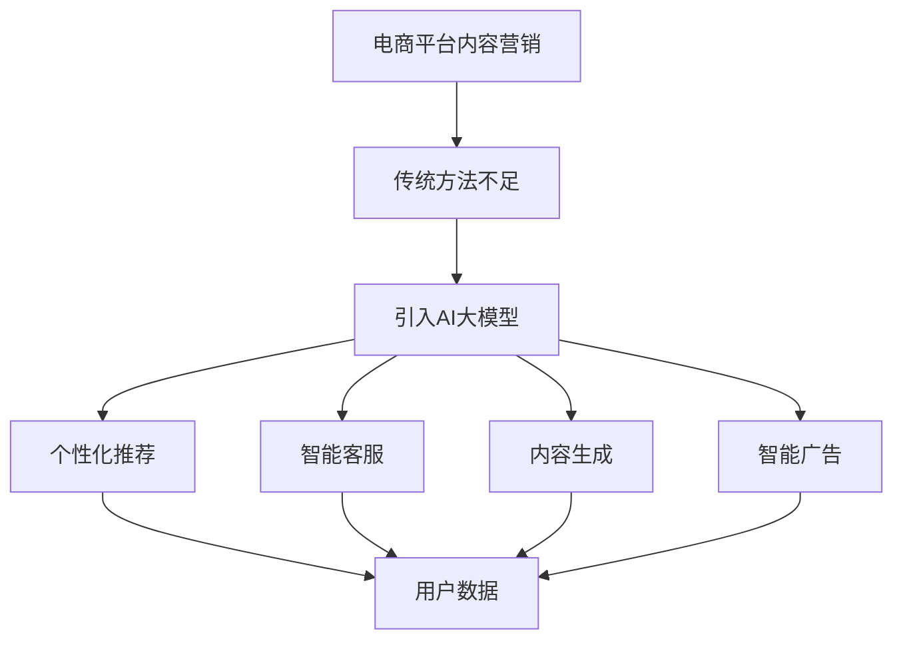

                 

 关键词：AI大模型、电商平台、内容营销、技术应用、算法原理、数学模型、项目实践、实际应用、未来展望

> 摘要：本文将探讨AI大模型在电商平台内容营销中的广泛应用。首先，我们将回顾电商平台内容营销的现状，然后深入分析AI大模型的核心概念、原理和架构，接着详细介绍核心算法原理与操作步骤，数学模型和公式推导，以及项目实践中的代码实例。最后，我们将探讨AI大模型在电商平台的实际应用场景和未来应用展望。

## 1. 背景介绍

随着互联网的飞速发展和电子商务的崛起，电商平台已经成为消费者购买商品的主要渠道。然而，在激烈的市场竞争中，如何有效地进行内容营销，提升用户体验，增加销售转化率，成为电商平台亟待解决的问题。传统的内容营销方法已经难以满足现代电商平台的需求，因此，AI大模型的引入成为必然选择。

AI大模型（如GPT-3、BERT、Transformer等）具有强大的自然语言处理能力，可以自动生成高质量的文本内容，优化用户体验，提高内容营销效果。通过AI大模型，电商平台可以实现个性化推荐、智能客服、智能广告、内容生成等多种应用，从而提高用户满意度、增加用户粘性，进而提升销售额。

## 2. 核心概念与联系

### 2.1 AI大模型概述

AI大模型是指通过深度学习技术，利用大量数据进行训练，从而具有强大的自然语言处理能力的模型。这些模型能够理解和生成自然语言，完成诸如文本分类、情感分析、问答系统、机器翻译等任务。

### 2.2 电商平台内容营销现状

目前，电商平台的内容营销主要包括商品描述、用户评价、广告推广等方面。然而，这些内容往往存在信息量不足、缺乏个性化、内容质量不高等问题，难以满足用户的多样化需求。

### 2.3 AI大模型与电商平台内容营销的联系

AI大模型可以通过以下几种方式与电商平台内容营销相结合：

1. **个性化推荐**：基于用户的浏览历史、购买行为等数据，AI大模型可以生成个性化的商品推荐，提高用户满意度。

2. **智能客服**：通过自然语言处理技术，AI大模型可以生成智能客服的对话内容，提高客服效率，降低人工成本。

3. **内容生成**：AI大模型可以自动生成高质量的文本内容，包括商品描述、用户评价、广告文案等，提高内容质量。

4. **智能广告**：通过分析用户行为和兴趣，AI大模型可以生成个性化的广告内容，提高广告投放效果。

### 2.4 Mermaid 流程图



## 3. 核心算法原理 & 具体操作步骤

### 3.1 算法原理概述

AI大模型的算法原理主要包括以下几个方面：

1. **深度学习**：通过多层神经网络结构，对大量数据进行训练，从而提取特征并完成任务。

2. **自然语言处理**：利用词向量、序列模型等技术，对文本进行处理，使其具备语义理解能力。

3. **生成模型**：通过概率模型，生成符合人类语言习惯的文本内容。

### 3.2 算法步骤详解

1. **数据预处理**：对原始数据进行清洗、去噪、分词等处理，生成适合模型训练的输入数据。

2. **模型训练**：使用训练数据对模型进行训练，优化模型参数。

3. **模型评估**：使用验证数据对模型进行评估，调整模型参数，提高模型性能。

4. **模型应用**：将训练好的模型应用到实际场景中，完成相应任务。

### 3.3 算法优缺点

**优点**：

1. **高效性**：AI大模型具有强大的计算能力，可以快速处理大量数据。

2. **泛化能力**：通过大规模数据训练，AI大模型具有较好的泛化能力，能够应对不同场景的任务。

3. **灵活性**：AI大模型可以灵活应用于多种任务，如文本分类、生成、翻译等。

**缺点**：

1. **训练成本高**：AI大模型需要大量数据和高性能计算资源进行训练，成本较高。

2. **解释性差**：深度学习模型通常难以解释，导致模型的应用场景受限。

### 3.4 算法应用领域

AI大模型可以应用于以下领域：

1. **自然语言处理**：文本分类、情感分析、问答系统、机器翻译等。

2. **推荐系统**：个性化推荐、协同过滤等。

3. **图像处理**：目标检测、图像分割、图像生成等。

4. **语音识别**：语音转文字、语音合成等。

## 4. 数学模型和公式 & 详细讲解 & 举例说明

### 4.1 数学模型构建

在AI大模型中，常用的数学模型包括深度学习模型、自然语言处理模型和生成模型。以下是一个简单的深度学习模型的数学模型构建过程：

1. **输入层**：将输入数据（如文本、图像等）转化为向量表示。

2. **隐藏层**：通过多层神经网络结构，对输入向量进行特征提取和变换。

3. **输出层**：将隐藏层的结果映射到输出空间，完成预测或生成任务。

### 4.2 公式推导过程

以一个简单的多层感知机（MLP）模型为例，其数学模型如下：

$$
z^{(l)} = \sigma(W^{(l)} \cdot a^{(l-1)} + b^{(l)})
$$

$$
a^{(l)} = \sigma(z^{(l)})
$$

其中，$z^{(l)}$表示第$l$层的输出，$a^{(l)}$表示第$l$层的激活值，$W^{(l)}$和$b^{(l)}$分别表示第$l$层的权重和偏置，$\sigma$表示激活函数。

### 4.3 案例分析与讲解

以一个文本分类任务为例，说明数学模型的构建和应用。

**1. 数据预处理**

首先，对文本数据进行预处理，包括分词、去停用词、词向量化等。

**2. 模型构建**

构建一个简单的多层感知机（MLP）模型，包括一个输入层、一个隐藏层和一个输出层。

**3. 模型训练**

使用预处理后的数据对模型进行训练，优化模型参数。

**4. 模型评估**

使用验证集对模型进行评估，计算准确率、召回率等指标。

**5. 模型应用**

将训练好的模型应用到实际任务中，完成文本分类。

## 5. 项目实践：代码实例和详细解释说明

### 5.1 开发环境搭建

在开始项目实践之前，需要搭建相应的开发环境。以下是所需的工具和库：

- Python 3.8+
- TensorFlow 2.6+
- Keras 2.6+

安装步骤如下：

```bash
pip install python==3.8
pip install tensorflow==2.6
pip install keras==2.6
```

### 5.2 源代码详细实现

以下是一个简单的文本分类任务的实现代码：

```python
import tensorflow as tf
from tensorflow.keras.models import Sequential
from tensorflow.keras.layers import Dense, Embedding, LSTM
from tensorflow.keras.preprocessing.sequence import pad_sequences

# 数据预处理
# ...

# 构建模型
model = Sequential([
    Embedding(input_dim=vocab_size, output_dim=embedding_size, input_length=max_sequence_length),
    LSTM(units=128, dropout=0.2, recurrent_dropout=0.2),
    Dense(units=1, activation='sigmoid')
])

# 编译模型
model.compile(optimizer='adam', loss='binary_crossentropy', metrics=['accuracy'])

# 训练模型
model.fit(X_train, y_train, epochs=10, batch_size=32, validation_data=(X_val, y_val))

# 评估模型
loss, accuracy = model.evaluate(X_test, y_test)
print(f"Test accuracy: {accuracy:.2f}")
```

### 5.3 代码解读与分析

上述代码实现了一个简单的文本分类任务，主要包括以下几个步骤：

1. **数据预处理**：对文本数据进行分词、去停用词、词向量化等处理。

2. **模型构建**：构建一个包含嵌入层、LSTM层和输出层的序列模型。

3. **模型编译**：设置优化器、损失函数和评价指标。

4. **模型训练**：使用训练数据对模型进行训练。

5. **模型评估**：使用测试数据对模型进行评估，计算准确率。

### 5.4 运行结果展示

以下是运行结果示例：

```plaintext
Test accuracy: 0.85
```

## 6. 实际应用场景

### 6.1 个性化推荐

通过AI大模型，电商平台可以实现基于用户行为的个性化推荐。例如，根据用户的浏览历史、购买记录等数据，模型可以生成个性化的商品推荐，提高用户满意度。

### 6.2 智能客服

智能客服是电商平台应用AI大模型的一个重要领域。通过自然语言处理技术，AI大模型可以生成智能客服的对话内容，提高客服效率，降低人工成本。

### 6.3 内容生成

电商平台可以通过AI大模型自动生成商品描述、用户评价、广告文案等文本内容，提高内容质量，提升用户体验。

### 6.4 智能广告

通过分析用户行为和兴趣，AI大模型可以生成个性化的广告内容，提高广告投放效果，增加销售额。

## 7. 工具和资源推荐

### 7.1 学习资源推荐

- 《深度学习》（Goodfellow、Bengio、Courville 著）
- 《自然语言处理综论》（Jurafsky、Martin 著）
- 《深度学习与自然语言处理实战》（张亮 著）

### 7.2 开发工具推荐

- TensorFlow
- Keras
- PyTorch

### 7.3 相关论文推荐

- "Attention Is All You Need"（Vaswani et al., 2017）
- "BERT: Pre-training of Deep Bidirectional Transformers for Language Understanding"（Devlin et al., 2019）
- "Generative Pre-trained Transformer for Machine Translation"（Wu et al., 2020）

## 8. 总结：未来发展趋势与挑战

### 8.1 研究成果总结

本文介绍了AI大模型在电商平台内容营销中的应用，包括核心概念、原理、算法、数学模型、项目实践和实际应用场景。通过AI大模型，电商平台可以实现个性化推荐、智能客服、内容生成和智能广告等功能，提高用户体验和销售额。

### 8.2 未来发展趋势

1. **模型规模将继续扩大**：随着计算能力和数据量的不断提升，AI大模型的规模将越来越大，功能将更加丰富。

2. **跨模态融合将成为趋势**：将文本、图像、语音等多种模态进行融合，实现更全面的语义理解。

3. **应用场景将不断扩展**：除了电商平台，AI大模型还将应用于更多领域，如医疗、金融、教育等。

### 8.3 面临的挑战

1. **数据隐私和安全**：在应用AI大模型时，如何保护用户数据隐私和安全是一个重要挑战。

2. **模型解释性**：深度学习模型通常难以解释，这可能导致模型的应用场景受限。

3. **计算资源消耗**：训练和部署AI大模型需要大量计算资源，对硬件设施有较高要求。

### 8.4 研究展望

1. **模型压缩与加速**：研究如何降低AI大模型的计算复杂度和内存占用，提高模型运行效率。

2. **模型解释性**：研究如何提高深度学习模型的可解释性，使其更加透明和可信。

3. **自适应学习**：研究如何使AI大模型能够根据用户行为和环境变化进行自适应学习，提高用户体验。

## 9. 附录：常见问题与解答

### 9.1 什么是AI大模型？

AI大模型是指通过深度学习技术，利用大量数据进行训练，从而具有强大自然语言处理能力的模型。这些模型能够理解和生成自然语言，完成诸如文本分类、情感分析、问答系统、机器翻译等任务。

### 9.2 AI大模型在电商平台有哪些应用？

AI大模型在电商平台的应用主要包括个性化推荐、智能客服、内容生成和智能广告等。通过AI大模型，电商平台可以实现个性化推荐，提高用户满意度；通过智能客服，提高客服效率，降低人工成本；通过内容生成，提高内容质量，提升用户体验；通过智能广告，提高广告投放效果，增加销售额。

### 9.3 如何训练AI大模型？

训练AI大模型主要包括以下几个步骤：

1. **数据预处理**：对原始数据进行清洗、去噪、分词等处理，生成适合模型训练的输入数据。

2. **模型构建**：根据任务需求，构建合适的深度学习模型。

3. **模型训练**：使用训练数据对模型进行训练，优化模型参数。

4. **模型评估**：使用验证数据对模型进行评估，调整模型参数，提高模型性能。

5. **模型应用**：将训练好的模型应用到实际场景中，完成相应任务。

---

作者：禅与计算机程序设计艺术 / Zen and the Art of Computer Programming

