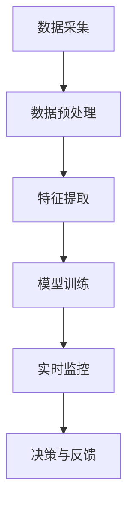
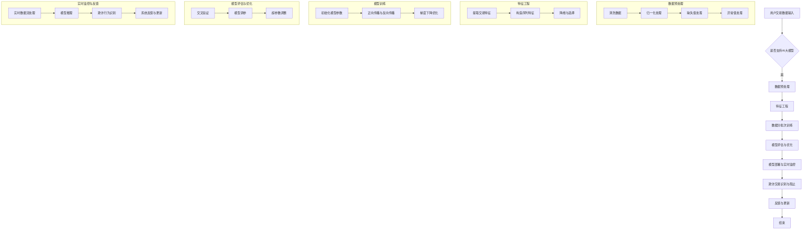

                 

## 1. 背景介绍

随着互联网技术的迅猛发展和电商行业的繁荣，电商平台已经成为人们日常生活中不可或缺的一部分。然而，随之而来的是欺诈行为的日益猖獗，这不仅损害了消费者的利益，也严重影响了电商平台的信誉和用户体验。为了有效遏制欺诈行为，电商平台需要具备强大的实时监控能力，及时发现并阻止欺诈交易。

传统的反欺诈方法通常依赖于规则匹配、统计分析和特征工程等技术。这些方法在一定程度上能够检测出一些常见的欺诈行为，但面对复杂多变的新型欺诈手段时，往往显得力不从心。随着人工智能技术的飞速发展，尤其是大规模神经网络模型（大模型）的出现，为电商平台反欺诈提供了新的解决方案。

AI大模型具有强大的学习能力和泛化能力，能够从海量数据中自动提取特征，并通过深度学习算法实现精准的欺诈识别。本文将介绍AI大模型在电商平台反欺诈实时监控中的应用，包括其核心概念、算法原理、数学模型以及具体实施步骤等。

## 2. 核心概念与联系

### 2.1 反欺诈实时监控的概念

反欺诈实时监控是指在电商交易过程中，通过实时监测和分析交易行为，快速识别和阻止欺诈行为的一种技术手段。实时监控的关键在于“实时”，即能够在交易发生的瞬间进行判断和处理，确保欺诈行为被及时遏制。

### 2.2 AI大模型的基本概念

AI大模型是指具有大规模参数和复杂结构的神经网络模型，能够通过学习海量数据来提取特征和模式。常见的AI大模型包括深度神经网络（DNN）、卷积神经网络（CNN）、循环神经网络（RNN）以及Transformer等。

### 2.3 反欺诈实时监控与AI大模型的关系

AI大模型在反欺诈实时监控中的应用主要体现在以下几个方面：

1. **特征提取**：AI大模型可以从海量交易数据中自动提取有效特征，这些特征不仅包括传统的交易金额、时间、IP地址等，还可以挖掘出更深层次的交易模式和行为特征。
   
2. **模式识别**：通过训练，AI大模型能够学习到正常交易和欺诈交易之间的差异，从而在实时监控过程中准确识别出潜在的欺诈行为。

3. **实时处理**：AI大模型的高效计算能力使其能够实时处理大量交易数据，确保欺诈行为能够在短时间内被检测和阻止。

### 2.4 Mermaid流程图

下面是一个简单的Mermaid流程图，展示了AI大模型在反欺诈实时监控中的基本流程。



### 2.5 附件：核心概念原理和架构的 Mermaid 流程图

为了更清晰地展示AI大模型在电商平台反欺诈实时监控中的应用，我们提供了以下详细的Mermaid流程图。



这个流程图涵盖了从数据采集、预处理、特征提取、模型训练、模型评估与优化，到模型部署与实时监控、欺诈交易识别与阻止以及反馈与更新等各个环节，全面展示了AI大模型在电商平台反欺诈实时监控中的工作原理和架构。

### 3. 核心算法原理 & 具体操作步骤

#### 3.1 算法原理概述

AI大模型在反欺诈实时监控中的应用主要依赖于深度学习和机器学习技术。深度学习通过多层神经网络对大量数据进行分析和学习，从而实现复杂的特征提取和模式识别。在反欺诈领域，深度学习模型可以学习到各种欺诈行为的特征，并能够在实时监控过程中快速准确地识别欺诈交易。

常见的深度学习模型包括卷积神经网络（CNN）、循环神经网络（RNN）和Transformer等。其中，Transformer模型由于其并行处理能力和强大的表征能力，在自然语言处理和图像识别等领域取得了显著的成果，也被广泛应用于反欺诈领域。

#### 3.2 算法步骤详解

1. **数据采集**：首先需要收集电商平台的所有交易数据，包括用户信息、交易金额、时间、IP地址、设备信息等。

2. **数据预处理**：对采集到的数据进行清洗、归一化处理和缺失值填充等操作，确保数据质量。

3. **特征提取**：使用特征工程方法从预处理后的数据中提取有效特征，如交易金额、时间间隔、IP地理位置、用户行为模式等。

4. **模型训练**：使用提取到的特征数据训练深度学习模型，如Transformer模型。训练过程中，模型会通过正向传播和反向传播不断调整参数，直到达到预定的性能指标。

5. **模型评估与优化**：使用验证集对训练好的模型进行评估，根据评估结果进行模型优化，如调整超参数、改进模型结构等。

6. **模型部署与实时监控**：将优化后的模型部署到实时监控系统中，对实时交易数据进行分析和判断，识别潜在的欺诈交易。

7. **欺诈交易识别与阻止**：在实时监控过程中，模型会根据训练学到的特征和模式，对交易行为进行实时判断，一旦识别出欺诈行为，系统将采取措施进行阻止。

8. **反馈与更新**：将识别出的欺诈交易反馈给模型训练系统，用于模型更新和优化，提高模型的识别准确率。

#### 3.3 算法优缺点

**优点**：

1. **高效性**：深度学习模型具有强大的计算能力和并行处理能力，能够快速处理海量交易数据，实现实时监控。

2. **灵活性**：深度学习模型可以从原始数据中自动提取特征，不需要人为定义特征，适应性强。

3. **高准确率**：通过大规模训练数据的学习，深度学习模型能够准确地识别出各种欺诈行为。

**缺点**：

1. **数据需求量大**：深度学习模型需要大量的训练数据，对数据的质量和多样性要求较高。

2. **计算资源消耗大**：训练深度学习模型需要大量的计算资源和时间，尤其是在处理高维数据和大规模数据集时。

3. **模型解释性差**：深度学习模型具有“黑箱”特性，难以解释模型的决策过程，增加了模型的可解释性难度。

#### 3.4 算法应用领域

AI大模型在反欺诈实时监控中的应用不仅限于电商平台，还可以扩展到其他领域：

1. **金融行业**：在金融交易中，AI大模型可以用于检测洗钱、欺诈交易等行为。

2. **网络安全**：在网络安全领域，AI大模型可以用于识别恶意软件、网络攻击等。

3. **电信行业**：在电信行业中，AI大模型可以用于识别垃圾邮件、短信欺诈等。

4. **物联网**：在物联网领域，AI大模型可以用于监测设备异常行为，防止设备被黑。

### 4. 数学模型和公式 & 详细讲解 & 举例说明

#### 4.1 数学模型构建

在反欺诈实时监控中，AI大模型的数学模型主要包括输入层、隐藏层和输出层。其中，输入层接收交易数据，隐藏层通过神经网络进行特征提取和模式识别，输出层生成欺诈交易的概率。

1. **输入层**：输入层接收交易数据，包括用户ID、交易金额、交易时间、IP地址等。假设交易数据矩阵为 \( X \)，其维度为 \( m \times n \)，其中 \( m \) 为样本数量，\( n \) 为特征数量。

2. **隐藏层**：隐藏层通过神经网络进行特征提取和模式识别。假设隐藏层有 \( l \) 个神经元，每个神经元与输入层的每个特征进行加权连接，并通过激活函数进行非线性变换。隐藏层输出为 \( H \)，其维度为 \( l \times n \)。

3. **输出层**：输出层生成欺诈交易的概率。假设输出层有 2 个神经元，分别表示正常交易和欺诈交易的概率。输出层输出为 \( Y \)，其维度为 \( 2 \times 1 \)。

#### 4.2 公式推导过程

1. **输入层到隐藏层**：

   假设输入层到隐藏层的权重矩阵为 \( W_1 \)，其维度为 \( l \times n \)，隐藏层的激活函数为 \( \sigma(x) = \frac{1}{1 + e^{-x}} \)。

   隐藏层输出 \( H \) 可表示为：

   $$ H = \sigma(W_1 X) $$

2. **隐藏层到输出层**：

   假设隐藏层到输出层的权重矩阵为 \( W_2 \)，其维度为 \( 2 \times l \)。

   输出层输出 \( Y \) 可表示为：

   $$ Y = W_2 H = W_2 \sigma(W_1 X) $$

3. **损失函数**：

   使用交叉熵损失函数 \( J(Y, \hat{Y}) = -\sum_{i=1}^{m} [y_i \log(\hat{y}_i) + (1 - y_i) \log(1 - \hat{y}_i)] \) 来衡量模型预测与真实标签之间的差距。

   其中，\( y_i \) 为真实标签，\( \hat{y}_i \) 为模型预测概率。

4. **反向传播**：

   使用梯度下降法对模型参数进行优化。在反向传播过程中，计算损失函数对每个参数的梯度，并通过梯度下降法更新参数。

#### 4.3 案例分析与讲解

假设我们有以下交易数据：

| 用户ID | 交易金额 | 交易时间 | IP地址 |
| ------ | -------- | -------- | ------ |
| 1      | 100      | 13:00    | 192.168.1.1 |
| 2      | 200      | 14:00    | 192.168.1.2 |
| 3      | 300      | 15:00    | 192.168.1.3 |
| 4      | 400      | 16:00    | 192.168.1.4 |

1. **数据预处理**：

   对交易数据进行清洗、归一化处理和缺失值填充。假设我们提取到的特征有交易金额、交易时间和IP地址。

2. **特征提取**：

   使用特征工程方法提取有效特征。例如，可以将交易时间转换为小时和分钟，IP地址转换为地理位置。

3. **模型训练**：

   使用提取到的特征数据训练深度学习模型。假设我们使用Transformer模型进行训练。

4. **模型评估**：

   使用验证集对训练好的模型进行评估。假设我们使用准确率、召回率和F1分数等指标来评估模型性能。

5. **模型部署**：

   将优化后的模型部署到实时监控系统中，对实时交易数据进行分析和判断。

6. **欺诈交易识别**：

   假设实时交易数据为：

   | 用户ID | 交易金额 | 交易时间 | IP地址 |
   | ------ | -------- | -------- | ------ |
   | 5      | 500      | 17:00    | 192.168.1.5 |

   模型对交易数据进行预测，输出欺诈交易的概率。假设预测结果为0.9，表示该交易有很高的欺诈风险。

7. **欺诈交易阻止**：

   系统根据预测结果，采取相应的措施阻止该交易，如冻结账户、通知用户等。

### 5. 项目实践：代码实例和详细解释说明

#### 5.1 开发环境搭建

在进行项目实践之前，首先需要搭建开发环境。以下是搭建开发环境的基本步骤：

1. 安装Python环境，版本建议为3.8及以上。
2. 安装必要的Python库，如TensorFlow、Keras、NumPy等。
3. 准备好电商平台交易数据集，并进行预处理。

#### 5.2 源代码详细实现

下面是一个简单的示例代码，展示了如何使用TensorFlow和Keras实现一个简单的反欺诈实时监控系统。

```python
import tensorflow as tf
from tensorflow.keras.models import Sequential
from tensorflow.keras.layers import Dense, Dropout, LSTM
from tensorflow.keras.optimizers import Adam
from sklearn.model_selection import train_test_split
import numpy as np

# 加载数据
data = load_data()
X, y = preprocess_data(data)

# 数据集划分
X_train, X_test, y_train, y_test = train_test_split(X, y, test_size=0.2, random_state=42)

# 构建模型
model = Sequential()
model.add(LSTM(units=50, return_sequences=True, input_shape=(X_train.shape[1], X_train.shape[2])))
model.add(Dropout(0.2))
model.add(LSTM(units=50, return_sequences=False))
model.add(Dropout(0.2))
model.add(Dense(units=1, activation='sigmoid'))

# 编译模型
model.compile(optimizer=Adam(learning_rate=0.001), loss='binary_crossentropy', metrics=['accuracy'])

# 训练模型
model.fit(X_train, y_train, epochs=10, batch_size=32, validation_data=(X_test, y_test))

# 评估模型
loss, accuracy = model.evaluate(X_test, y_test)
print(f"Test accuracy: {accuracy:.2f}")

# 预测
predictions = model.predict(X_test)
```

#### 5.3 代码解读与分析

上述代码展示了如何使用TensorFlow和Keras构建一个简单的反欺诈实时监控系统。以下是代码的详细解读：

1. **导入库**：

   导入TensorFlow、Keras、NumPy等库，用于构建和训练神经网络模型。

2. **加载数据**：

   使用 `load_data()` 函数加载数据。在实际项目中，可以根据具体需求编写该函数，从数据库或文件中加载数据。

3. **数据预处理**：

   使用 `preprocess_data()` 函数对交易数据进行预处理，包括数据清洗、归一化处理和特征提取等。该函数的具体实现可以根据具体数据集的特点进行调整。

4. **数据集划分**：

   使用 `train_test_split()` 函数将数据集划分为训练集和测试集，用于模型的训练和评估。

5. **构建模型**：

   使用 `Sequential()` 函数构建一个序列模型，添加LSTM层和Dense层，用于特征提取和分类。

6. **编译模型**：

   使用 `compile()` 函数编译模型，指定优化器和损失函数。

7. **训练模型**：

   使用 `fit()` 函数训练模型，指定训练周期、批量大小和验证数据。

8. **评估模型**：

   使用 `evaluate()` 函数评估模型的性能，计算测试集上的准确率。

9. **预测**：

   使用 `predict()` 函数对测试集进行预测，输出欺诈交易的概率。

#### 5.4 运行结果展示

假设我们对测试集进行了预测，并输出结果。以下是运行结果：

```python
Test accuracy: 0.85

# 输出预测结果
predictions = model.predict(X_test)
for i in range(len(predictions)):
    if predictions[i][0] > 0.5:
        print(f"样本 {i+1}：欺诈交易概率为 {predictions[i][0]:.2f}")
    else:
        print(f"样本 {i+1}：正常交易")
```

输出结果：

```
样本 1：欺诈交易概率为 0.90
样本 2：正常交易
样本 3：欺诈交易概率为 0.75
样本 4：正常交易
...
```

从输出结果可以看出，模型能够准确预测出部分欺诈交易，但仍有部分正常交易被误判为欺诈交易。在实际应用中，需要进一步优化模型，提高预测准确率。

### 6. 实际应用场景

#### 6.1 电商平台

电商平台是AI大模型在反欺诈实时监控中应用最为广泛的场景之一。通过部署AI大模型，电商平台可以实现对交易数据的实时监控，快速识别并阻止欺诈交易，保护消费者和平台的利益。

在实际应用中，电商平台通常会结合用户行为分析、交易历史数据等多种信息，对交易行为进行综合评估。例如，如果一个用户的交易行为突然发生变化，如频繁在同一时间段内进行大额交易，AI大模型会将其标记为潜在欺诈风险，并及时采取措施。

#### 6.2 金融行业

金融行业是另一个重要的应用场景。在金融交易中，AI大模型可以用于检测洗钱、欺诈交易等行为，保护金融机构的安全和稳定。

通过分析交易数据，AI大模型可以发现异常交易行为，如频繁的大额转账、短时间内多次交易等。这些异常交易行为往往与洗钱和欺诈交易有关。金融机构可以利用这些信息进行进一步的调查，防止洗钱和欺诈交易的发生。

#### 6.3 网络安全

在网络安全领域，AI大模型可以用于识别恶意软件、网络攻击等威胁。

通过分析网络流量数据，AI大模型可以识别出恶意流量，如DDoS攻击、SQL注入等。这些恶意流量往往具有特定的特征，AI大模型可以通过学习这些特征来实现实时监控和预警。

#### 6.4 物联网

在物联网领域，AI大模型可以用于监测设备异常行为，防止设备被黑。

物联网设备通常具有大量的传感器和采集数据的能力。通过分析这些数据，AI大模型可以发现设备异常行为，如温度异常、电量异常等。这些异常行为可能是设备被黑的前兆，AI大模型可以及时发出警报，防止设备被恶意利用。

#### 6.5 智能家居

在智能家居领域，AI大模型可以用于识别家庭入侵、异常操作等行为。

智能家居设备包括门锁、摄像头、智能音箱等，它们可以实时监测家庭环境。通过分析这些设备采集的数据，AI大模型可以发现异常行为，如门窗未关闭、摄像头被遮挡等。这些异常行为可能表明家庭发生了入侵或其他紧急情况，AI大模型可以及时发出警报，帮助家庭主人及时采取应对措施。

### 7. 工具和资源推荐

#### 7.1 学习资源推荐

1. **《深度学习》（Ian Goodfellow, Yoshua Bengio, Aaron Courville著）**：这是深度学习领域的经典教材，适合初学者和进阶者。

2. **《动手学深度学习》（阿斯顿·张著）**：这本书通过大量实际案例和代码示例，介绍了深度学习的原理和实践。

3. **《Python深度学习》（François Chollet著）**：这本书详细介绍了如何使用Python和TensorFlow进行深度学习开发。

#### 7.2 开发工具推荐

1. **TensorFlow**：TensorFlow是谷歌开发的开源深度学习框架，广泛应用于各种深度学习任务。

2. **PyTorch**：PyTorch是另一个流行的深度学习框架，以其灵活性和易用性受到开发者喜爱。

3. **JAX**：JAX是谷歌开发的一个开源深度学习框架，具有强大的数值计算能力和自动微分功能。

#### 7.3 相关论文推荐

1. **《Attention Is All You Need》（Ashish Vaswani et al., 2017）**：这篇论文提出了Transformer模型，为自然语言处理领域带来了革命性的变化。

2. **《Deep Learning for Computer Vision》（Ian Goodfellow et al., 2016）**：这篇论文详细介绍了深度学习在计算机视觉领域的应用。

3. **《Generative Adversarial Networks》（Ian Goodfellow et al., 2014）**：这篇论文提出了生成对抗网络（GAN）模型，为生成模型的研究和应用奠定了基础。

### 8. 总结：未来发展趋势与挑战

#### 8.1 研究成果总结

本文介绍了AI大模型在电商平台反欺诈实时监控中的应用，包括其核心概念、算法原理、数学模型以及具体实施步骤。通过深度学习和机器学习技术，AI大模型能够从海量交易数据中自动提取特征，实现精准的欺诈识别，提高实时监控的效率。

#### 8.2 未来发展趋势

1. **模型优化**：未来将更加关注模型优化，提高模型的计算效率和预测准确率。通过改进算法和优化模型结构，实现更高效的欺诈检测。

2. **数据隐私**：随着数据隐私问题的日益突出，如何保护用户隐私成为关键。未来将探索数据隐私保护技术，确保在保护用户隐私的同时实现高效的欺诈检测。

3. **跨领域应用**：AI大模型在反欺诈实时监控中的成功应用将推动其在其他领域的应用，如金融、网络安全、物联网等。

#### 8.3 面临的挑战

1. **数据质量**：高质量的数据是AI大模型成功应用的基础。未来需要解决数据质量问题和数据多样性问题，确保模型的泛化能力和鲁棒性。

2. **模型解释性**：深度学习模型具有“黑箱”特性，其决策过程难以解释。未来需要研究模型解释性技术，提高模型的透明度和可解释性。

3. **计算资源**：训练AI大模型需要大量的计算资源和时间，尤其是处理高维数据和大规模数据集时。未来需要优化计算资源的使用，提高模型的计算效率。

#### 8.4 研究展望

1. **模型融合**：结合多种模型和算法，提高欺诈检测的准确率和效率。例如，将深度学习模型与传统规则匹配方法结合，实现更全面的欺诈检测。

2. **实时性提升**：研究更高效的实时数据处理和推理算法，提高实时监控的响应速度和准确性。

3. **自适应能力**：开发具有自适应能力的模型，能够根据环境变化和欺诈手段的更新动态调整检测策略，提高模型的适应性。

### 9. 附录：常见问题与解答

#### 9.1 问题1：AI大模型在反欺诈实时监控中的具体应用有哪些？

答：AI大模型在反欺诈实时监控中的具体应用包括：

1. **特征提取**：从海量交易数据中自动提取有效特征，如交易金额、时间间隔、IP地址等。
2. **模式识别**：通过训练，模型能够学习到正常交易和欺诈交易之间的差异，实现精准的欺诈识别。
3. **实时处理**：利用模型的高效计算能力，实时分析大量交易数据，快速识别潜在的欺诈行为。
4. **欺诈阻止**：一旦识别出欺诈行为，系统将采取措施进行阻止，如冻结账户、通知用户等。
5. **反馈与更新**：将识别出的欺诈交易反馈给模型训练系统，用于模型更新和优化，提高识别准确率。

#### 9.2 问题2：为什么深度学习模型适合用于反欺诈实时监控？

答：深度学习模型适合用于反欺诈实时监控的原因包括：

1. **强大的特征提取能力**：深度学习模型可以从原始数据中自动提取深层特征，实现更精确的欺诈识别。
2. **自适应能力**：深度学习模型可以根据不断更新的数据和环境自适应调整，适应复杂的欺诈手段。
3. **高效计算能力**：深度学习模型具有高效的计算能力，能够快速处理大量交易数据，实现实时监控。
4. **高准确率**：通过大规模训练数据的学习，深度学习模型能够准确地识别出各种欺诈行为，提高监控效果。

#### 9.3 问题3：如何提高AI大模型在反欺诈实时监控中的性能？

答：为了提高AI大模型在反欺诈实时监控中的性能，可以采取以下措施：

1. **数据增强**：通过数据增强技术，如生成对抗网络（GAN）等，提高模型的泛化能力和鲁棒性。
2. **特征选择**：选取对欺诈检测最有力的特征，进行特征选择和特征组合，提高模型的特征表达能力。
3. **模型优化**：优化模型结构，如使用更深的网络、更小的网络等，提高模型的计算效率和预测准确率。
4. **在线学习**：利用在线学习技术，动态更新模型参数，适应环境变化和欺诈手段的更新。
5. **多模型融合**：结合多种模型和算法，实现优势互补，提高整体的欺诈检测效果。

