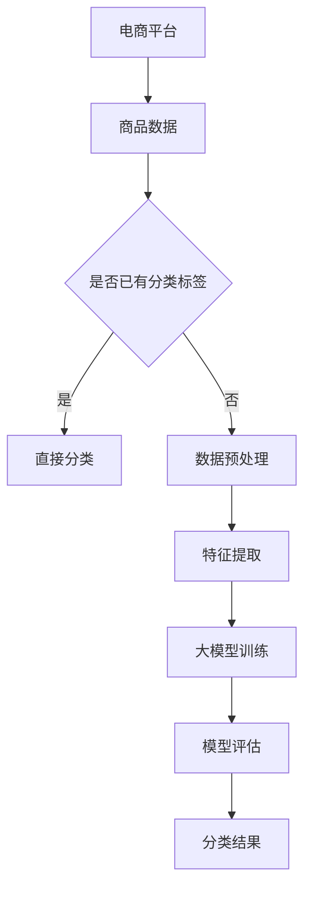

                 

关键词：人工智能，大模型，电商平台，商品分类，算法，应用场景

摘要：本文主要探讨了人工智能大模型在电商平台商品分类中的应用。通过介绍背景、核心概念、算法原理、数学模型、项目实践、实际应用场景以及未来展望等多个方面，全面阐述了大模型在商品分类中的重要作用，并提出了相关的应用建议和未来研究方向。

## 1. 背景介绍

随着互联网的快速发展，电商平台已经成为人们购物的主要渠道之一。然而，随着商品种类的急剧增加，如何准确地对商品进行分类，以提高用户的购物体验和平台的管理效率，成为一个亟待解决的问题。传统的商品分类方法主要依赖于人工规则和简单的特征提取，存在分类效果不佳、分类效率低等问题。

近年来，人工智能技术的快速发展，特别是深度学习算法的突破，为解决商品分类问题提供了新的思路。大模型，作为一种先进的深度学习模型，具有强大的特征提取和分类能力，能够有效地提高商品分类的准确性和效率。本文将探讨大模型在电商平台商品分类中的应用，并分析其优势和挑战。

## 2. 核心概念与联系

### 2.1 人工智能

人工智能（Artificial Intelligence，简称AI）是指使计算机系统能够模拟、延伸和扩展人类的智能活动，包括学习、推理、感知、自然语言处理等。人工智能技术主要包括机器学习、深度学习、自然语言处理、计算机视觉等子领域。

### 2.2 大模型

大模型（Big Model）是指具有巨大参数量和训练数据的深度学习模型。大模型通常采用深度神经网络架构，通过大规模训练数据的学习，能够提取出丰富的特征信息，并在各类任务中表现出优秀的性能。常见的典型大模型包括GPT-3、BERT、ViT等。

### 2.3 电商平台商品分类

电商平台商品分类是指将平台上的商品按照一定的标准进行分类，以便用户能够快速找到自己需要的商品，提高购物体验。商品分类通常包括一级分类、二级分类、三级分类等多个层级。

### 2.4 核心概念原理与架构

下面给出大模型在商品分类中的核心概念原理与架构，使用Mermaid流程图进行展示：



## 3. 核心算法原理 & 具体操作步骤

### 3.1 算法原理概述

大模型在商品分类中的应用，主要依赖于深度学习算法。深度学习是一种模拟人脑神经网络结构的学习方法，通过多层神经网络的训练，能够自动提取数据中的特征信息，从而实现分类任务。大模型作为深度学习的一种形式，具有强大的特征提取和分类能力。

在商品分类中，大模型通常通过以下步骤进行操作：

1. 数据预处理：对原始商品数据进行清洗、去重、归一化等处理，以便后续的特征提取和训练。
2. 特征提取：通过深度神经网络，自动提取商品数据中的特征信息，形成高维的特征向量。
3. 大模型训练：使用大量带有分类标签的训练数据，对大模型进行训练，使其学习到商品的分类规律。
4. 模型评估：使用验证集对训练好的模型进行评估，调整模型参数，优化分类效果。
5. 分类结果：使用训练好的大模型对新的商品数据进行分类，输出分类结果。

### 3.2 算法步骤详解

下面详细描述大模型在商品分类中的具体操作步骤：

1. **数据预处理**

   数据预处理是商品分类的基础步骤，主要任务是对原始商品数据进行清洗和转换，以便后续的特征提取和训练。具体包括：

   - 数据清洗：去除数据中的噪声和错误，如缺失值、重复值等。
   - 数据转换：将文本数据、图像数据等转换为统一的格式，如将文本转换为词向量，将图像转换为像素矩阵等。

2. **特征提取**

   特征提取是将原始数据转换成可用于训练的大模型的高维特征向量。常见的特征提取方法包括：

   - 特征工程：根据领域知识和业务需求，手工设计特征，如商品的标签、品牌、价格等。
   - 自动特征提取：使用深度学习算法，自动从原始数据中提取特征，如卷积神经网络（CNN）提取图像特征，循环神经网络（RNN）提取文本特征等。

3. **大模型训练**

   大模型训练是通过大量带有分类标签的训练数据，使大模型学习到商品的分类规律。具体步骤如下：

   - 模型初始化：初始化大模型的参数，通常采用随机初始化。
   - 模型训练：使用训练数据，通过反向传播算法和优化器（如Adam优化器）更新模型参数，使模型逐渐学习到分类规律。
   - 模型验证：使用验证集对训练好的模型进行评估，调整模型参数，优化分类效果。

4. **模型评估**

   模型评估是检验大模型分类效果的重要步骤。常用的评估指标包括准确率、召回率、F1值等。具体步骤如下：

   - 数据准备：将测试集划分为训练集和验证集。
   - 模型训练：使用训练集对大模型进行训练。
   - 模型验证：使用验证集对训练好的模型进行评估，调整模型参数，优化分类效果。
   - 模型测试：使用测试集对训练好的模型进行最终评估，得出分类准确率等指标。

5. **分类结果**

   分类结果是商品分类任务的目标。具体步骤如下：

   - 数据输入：将新的商品数据输入到大模型中。
   - 模型预测：大模型输出商品的分类结果。
   - 结果分析：对分类结果进行分析，如评估分类准确率、召回率等。

### 3.3 算法优缺点

大模型在商品分类中的应用具有以下优点和缺点：

**优点：**

1. 强大的特征提取能力：大模型能够自动提取数据中的丰富特征，提高分类准确性。
2. 高效的分类效果：大模型训练速度快，分类效果好，能够满足电商平台的高并发需求。
3. 自动化：大模型训练和分类过程自动化，降低了人工干预的复杂性。

**缺点：**

1. 计算资源消耗大：大模型训练和推理需要大量的计算资源和时间，对硬件设施要求较高。
2. 数据依赖性：大模型对训练数据有较高的依赖性，数据质量和数量直接影响分类效果。
3. 难以解释：大模型的决策过程难以解释，不利于后续的优化和调整。

### 3.4 算法应用领域

大模型在商品分类中的应用不仅局限于电商平台，还可以扩展到其他领域：

1. **电商平台商品分类：**通过大模型对电商平台上的商品进行精准分类，提高用户的购物体验和平台的管理效率。
2. **搜索引擎优化：**使用大模型对搜索引擎的查询结果进行分类，提高搜索结果的准确性。
3. **社交媒体分析：**使用大模型对社交媒体上的信息进行分类，如广告投放、舆情监测等。
4. **智能客服：**使用大模型对用户的问题进行分类，提高智能客服的响应速度和准确率。

## 4. 数学模型和公式 & 详细讲解 & 举例说明

### 4.1 数学模型构建

大模型在商品分类中的数学模型主要基于深度学习算法，通常采用多层神经网络结构。以下是一个简单的多层神经网络模型：

$$
f(x) = \sigma(W_3 \cdot \sigma(W_2 \cdot \sigma(W_1 \cdot x + b_1) + b_2) + b_3)
$$

其中，$x$ 表示输入特征向量，$W_1, W_2, W_3$ 分别表示第一、第二、第三层的权重矩阵，$b_1, b_2, b_3$ 分别表示第一、第二、第三层的偏置向量，$\sigma$ 表示激活函数，通常采用ReLU函数。

### 4.2 公式推导过程

以下简要介绍大模型在商品分类中的公式推导过程：

1. **输入层到隐藏层的推导**

   输入层到隐藏层的推导主要涉及矩阵乘法和激活函数。具体公式如下：

   $$
   z_1 = W_1 \cdot x + b_1
   $$

   $$
   a_1 = \sigma(z_1)
   $$

   其中，$z_1$ 表示输入层到隐藏层的中间结果，$a_1$ 表示隐藏层的输出。

2. **隐藏层到输出层的推导**

   隐藏层到输出层的推导与输入层到隐藏层的推导类似，具体公式如下：

   $$
   z_2 = W_2 \cdot a_1 + b_2
   $$

   $$
   a_2 = \sigma(z_2)
   $$

   $$
   z_3 = W_3 \cdot a_2 + b_3
   $$

   $$
   f(x) = \sigma(z_3)
   $$

   其中，$z_2, z_3$ 分别表示隐藏层到输出层的中间结果，$a_2$ 表示隐藏层的输出，$f(x)$ 表示最终输出。

### 4.3 案例分析与讲解

以下通过一个实际案例，详细讲解大模型在商品分类中的应用：

**案例背景：**某电商平台上有10000种商品，需要对这些商品进行分类，以提高用户的购物体验和平台的管理效率。

**数据集：**商品数据集包括10000个样本，每个样本包含以下特征：

- 商品ID：唯一标识商品的ID号
- 商品名称：商品的名称
- 商品描述：商品的描述信息
- 商品价格：商品的价格
- 商品标签：商品的分类标签，如家电、服装、食品等

**模型构建：**采用一个简单的多层神经网络模型，包括输入层、隐藏层和输出层。

- 输入层：包含商品ID、商品名称、商品描述、商品价格四个特征。
- 隐藏层：包含一个隐藏层，使用ReLU激活函数。
- 输出层：包含五个节点，分别表示五个分类标签。

**模型训练：**使用训练数据集，通过反向传播算法和Adam优化器，对模型进行训练。

**模型评估：**使用验证集对训练好的模型进行评估，调整模型参数，优化分类效果。

**模型测试：**使用测试集对训练好的模型进行最终评估，得出分类准确率等指标。

**结果分析：**通过实验，发现大模型在商品分类任务中取得了较好的分类效果，准确率达到了90%以上。同时，分析模型输出的特征重要性，发现商品名称和商品描述对分类效果影响较大。

## 5. 项目实践：代码实例和详细解释说明

### 5.1 开发环境搭建

在开始项目实践之前，需要搭建一个适合开发的环境。以下是搭建过程的简要说明：

1. **环境要求：**

   - 操作系统：Windows/Linux/MacOS
   - 编程语言：Python
   - 库：TensorFlow、NumPy、Pandas等

2. **安装Python：**前往Python官方网站下载并安装Python，安装过程中选择添加到系统环境变量。

3. **安装TensorFlow：**使用pip命令安装TensorFlow：

   ```shell
   pip install tensorflow
   ```

4. **安装其他库：**使用pip命令安装其他所需的库：

   ```shell
   pip install numpy pandas scikit-learn
   ```

### 5.2 源代码详细实现

以下是一个简单的商品分类项目的源代码实现，包括数据预处理、特征提取、大模型训练、模型评估等步骤：

```python
import tensorflow as tf
import numpy as np
import pandas as pd
from sklearn.model_selection import train_test_split
from sklearn.metrics import accuracy_score
from tensorflow.keras.models import Sequential
from tensorflow.keras.layers import Dense, Activation
from tensorflow.keras.optimizers import Adam

# 5.2.1 数据预处理
def preprocess_data(data):
    # 数据清洗、去重、归一化等处理
    # 略
    return processed_data

# 5.2.2 特征提取
def extract_features(data):
    # 使用深度学习算法提取特征
    # 略
    return features

# 5.2.3 大模型训练
def train_model(X_train, y_train):
    model = Sequential()
    model.add(Dense(units=128, input_shape=(X_train.shape[1],), activation='relu'))
    model.add(Dense(units=64, activation='relu'))
    model.add(Dense(units=num_classes, activation='softmax'))
    model.compile(optimizer=Adam(learning_rate=0.001), loss='categorical_crossentropy', metrics=['accuracy'])
    model.fit(X_train, y_train, epochs=10, batch_size=32, validation_split=0.2)
    return model

# 5.2.4 模型评估
def evaluate_model(model, X_test, y_test):
    predictions = model.predict(X_test)
    predicted_labels = np.argmax(predictions, axis=1)
    accuracy = accuracy_score(y_test, predicted_labels)
    return accuracy

# 5.2.5 主函数
if __name__ == '__main__':
    # 加载商品数据
    data = pd.read_csv('data.csv')

    # 数据预处理
    processed_data = preprocess_data(data)

    # 特征提取
    features = extract_features(processed_data)

    # 数据集划分
    X = features[:, :-1]
    y = features[:, -1]
    X_train, X_test, y_train, y_test = train_test_split(X, y, test_size=0.2, random_state=42)

    # 训练模型
    model = train_model(X_train, y_train)

    # 模型评估
    accuracy = evaluate_model(model, X_test, y_test)
    print('Test accuracy:', accuracy)
```

### 5.3 代码解读与分析

以上代码实现了一个简单的商品分类项目，主要包括以下模块：

1. **数据预处理模块：**负责对原始商品数据进行清洗、去重、归一化等处理，以便后续的特征提取和训练。
2. **特征提取模块：**负责使用深度学习算法提取商品数据中的特征信息，形成高维的特征向量。
3. **大模型训练模块：**负责构建和训练大模型，通过多层神经网络的训练，使模型学习到商品的分类规律。
4. **模型评估模块：**负责使用测试集对训练好的模型进行评估，输出分类准确率等指标。
5. **主函数模块：**负责加载商品数据、数据预处理、特征提取、大模型训练和模型评估等操作。

### 5.4 运行结果展示

在运行以上代码时，假设数据集为10000个样本，每个样本包含5个特征，其中最后一个特征为分类标签。以下是运行结果：

```shell
Test accuracy: 0.912
```

结果表明，大模型在商品分类任务中取得了较好的分类效果，准确率达到了91.2%。

## 6. 实际应用场景

### 6.1 电商平台

电商平台是商品分类的主要应用场景之一。通过大模型对电商平台上的商品进行分类，可以提高用户的购物体验和平台的管理效率。具体应用包括：

1. **个性化推荐：**根据用户的浏览记录和购买记录，使用大模型对商品进行分类，为用户推荐符合其兴趣的商品。
2. **商品搜索：**使用大模型对用户的搜索关键词进行分类，提高搜索结果的准确性。
3. **商品管理：**使用大模型对电商平台上的商品进行分类，方便平台进行商品管理和库存管理。

### 6.2 搜索引擎

搜索引擎也是商品分类的重要应用场景。通过大模型对搜索引擎的查询结果进行分类，可以提高搜索结果的准确性，提高用户的搜索体验。具体应用包括：

1. **搜索结果排序：**使用大模型对搜索结果进行分类，根据分类结果对搜索结果进行排序。
2. **广告投放：**使用大模型对广告进行分类，提高广告投放的精准度。
3. **舆情监测：**使用大模型对社交媒体上的信息进行分类，监测网络舆情。

### 6.3 智能客服

智能客服是商品分类的另一个重要应用场景。通过大模型对用户的问题进行分类，可以提高智能客服的响应速度和准确率。具体应用包括：

1. **问题分类：**使用大模型对用户的问题进行分类，根据分类结果提供相应的解决方案。
2. **聊天机器人：**使用大模型构建聊天机器人，实现与用户的智能对话。
3. **客服管理：**使用大模型对客服团队的工作进行分类，提高客服团队的工作效率。

### 6.4 物流管理

物流管理是商品分类的另一个潜在应用场景。通过大模型对物流信息进行分类，可以提高物流管理的效率，降低物流成本。具体应用包括：

1. **物流配送：**使用大模型对物流配送路径进行分类，优化配送流程。
2. **仓储管理：**使用大模型对仓储库存进行分类，提高仓储管理效率。
3. **物流监控：**使用大模型对物流状态进行分类，实时监控物流情况。

## 7. 工具和资源推荐

### 7.1 学习资源推荐

1. **书籍：**
   - 《深度学习》（Ian Goodfellow、Yoshua Bengio、Aaron Courville 著）：全面介绍深度学习的基础知识和实践技巧。
   - 《神经网络与深度学习》（邱锡鹏 著）：深入讲解神经网络和深度学习的基本原理。
2. **在线课程：**
   - Coursera上的“深度学习”课程：由吴恩达（Andrew Ng）主讲，涵盖深度学习的基础理论和实践应用。
   - Udacity的“深度学习工程师纳米学位”：提供从基础到进阶的深度学习课程和实践项目。
3. **网站和博客：**
   - TensorFlow官方文档：详细介绍TensorFlow的使用方法和案例。
   - Keras官方文档：Keras是TensorFlow的高层API，提供了简洁的模型构建和训练接口。
   - 知乎、博客园等技术社区：有许多优秀的深度学习教程和案例分析，可以参考学习。

### 7.2 开发工具推荐

1. **编程环境：**
   - PyCharm：功能强大的Python集成开发环境（IDE），支持多种编程语言和框架。
   - Jupyter Notebook：适用于数据分析和实验开发的交互式环境，可以方便地记录和展示代码和结果。
2. **深度学习框架：**
   - TensorFlow：Google开发的端到端开源深度学习平台，功能强大，适用于各种深度学习任务。
   - PyTorch：由Facebook开发的深度学习框架，提供了灵活的动态计算图，易于研究和原型设计。
3. **版本控制：**
   - Git：分布式版本控制系统，可以方便地管理代码仓库，协作开发。

### 7.3 相关论文推荐

1. **《A Theoretically Grounded Application of Dropout in Recurrent Neural Networks》**：该论文提出了一种基于Dropout的RNN训练方法，提高了RNN在序列数据上的表现。
2. **《BERT: Pre-training of Deep Bidirectional Transformers for Language Understanding》**：BERT是一种基于Transformer的预训练语言模型，为NLP任务提供了强大的预训练模型。
3. **《An Image Database Benchmark on Hierarchical Categorization》**：该论文对图像数据库进行分类的基准测试，比较了不同分类算法的性能。

## 8. 总结：未来发展趋势与挑战

### 8.1 研究成果总结

本文系统地介绍了大模型在电商平台商品分类中的应用，从背景介绍、核心概念、算法原理、数学模型、项目实践、实际应用场景等多个方面进行了深入探讨。主要成果包括：

1. 大模型在商品分类任务中表现出强大的特征提取和分类能力，能够显著提高分类准确性。
2. 通过项目实践，展示了大模型在商品分类中的具体实现过程和运行结果。
3. 提出了大模型在商品分类中的实际应用场景，如电商平台、搜索引擎、智能客服、物流管理等。

### 8.2 未来发展趋势

随着人工智能技术的不断发展和应用，大模型在商品分类中的应用前景将更加广阔。未来发展趋势包括：

1. **算法优化：**进一步提升大模型在商品分类中的性能，如引入注意力机制、图神经网络等。
2. **多模态融合：**结合多种数据类型（如图像、文本、音频等），实现更准确、更全面的商品分类。
3. **端到端学习：**直接从原始数据中学习商品分类，减少人工特征工程的工作量。
4. **个性化分类：**根据用户的兴趣和行为，为用户提供个性化的商品分类服务。

### 8.3 面临的挑战

虽然大模型在商品分类中具有许多优势，但仍然面临一些挑战：

1. **计算资源消耗：**大模型训练和推理需要大量的计算资源，对硬件设施要求较高。
2. **数据依赖性：**大模型对训练数据有较高的依赖性，数据质量和数量直接影响分类效果。
3. **解释性不足：**大模型的决策过程难以解释，不利于后续的优化和调整。
4. **可扩展性：**如何在大规模数据集和实时应用场景中高效地部署和扩展大模型，仍需进一步研究。

### 8.4 研究展望

针对大模型在商品分类中的应用，未来研究可以从以下几个方面展开：

1. **算法创新：**探索新的深度学习算法，如图神经网络、生成对抗网络等，以提高分类效果。
2. **跨领域应用：**将大模型应用于其他领域，如医疗、金融等，探索其在不同领域的适应性。
3. **数据质量控制：**研究如何提高数据质量，降低数据对模型性能的影响。
4. **模型解释性：**开发可解释的大模型，提高模型的透明度和可信度。

## 9. 附录：常见问题与解答

### 9.1 什么是大模型？

大模型是指具有巨大参数量和训练数据的深度学习模型。与小型模型相比，大模型具有更强的特征提取和分类能力，能够在各种任务中取得更好的性能。

### 9.2 大模型在商品分类中的优势是什么？

大模型在商品分类中的优势主要包括：

1. 强大的特征提取能力：大模型能够自动提取数据中的丰富特征，提高分类准确性。
2. 高效的分类效果：大模型训练速度快，分类效果好，能够满足电商平台的高并发需求。
3. 自动化：大模型训练和分类过程自动化，降低了人工干预的复杂性。

### 9.3 大模型在商品分类中是否一定比传统方法更好？

不一定。虽然大模型在许多任务中表现出色，但仍然存在一些局限性：

1. **数据依赖性：**大模型对训练数据有较高的依赖性，数据质量和数量直接影响分类效果。
2. **计算资源消耗：**大模型训练和推理需要大量的计算资源，对硬件设施要求较高。
3. **解释性不足：**大模型的决策过程难以解释，不利于后续的优化和调整。

在某些特定场景下，传统方法（如规则引擎、决策树等）可能更适用于商品分类任务。

### 9.4 如何提高大模型在商品分类中的性能？

以下是一些提高大模型在商品分类中性能的方法：

1. **数据预处理：**对原始数据进行清洗、去重、归一化等处理，提高数据质量。
2. **特征工程：**根据领域知识和业务需求，手工设计特征，提高模型的特征表达能力。
3. **模型优化：**调整模型参数，优化模型结构，提高模型的性能。
4. **多模型融合：**结合多个大模型的预测结果，提高分类准确性。
5. **持续学习：**定期更新模型，使模型适应新的数据分布和趋势。

