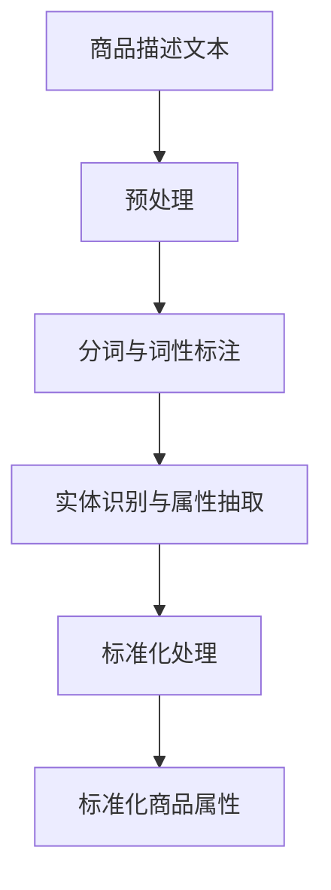

                 

关键词：电商平台、商品属性抽取、标准化、大模型、深度学习、自然语言处理、人工智能

摘要：本文探讨了大模型在电商平台商品属性抽取与标准化中的应用。通过深入分析商品属性抽取的核心概念、算法原理、数学模型以及实际项目实践，本文旨在揭示大模型在电商领域带来的创新和变革。同时，本文还对大模型的应用前景进行了展望，为未来电商的发展提供了有益的参考。

## 1. 背景介绍

随着互联网的快速发展，电商平台已经成为现代商业的重要组成部分。商品信息的准确性、完整性和一致性对电商平台的发展和用户体验至关重要。商品属性抽取与标准化作为电商平台数据处理的重要环节，其核心任务是从非结构化的文本数据中提取出商品的关键属性，并将其转化为统一的标准格式。

传统的方法通常依赖于规则匹配和关键词提取等技术，但这些方法在面对复杂、多样且动态变化的电商商品信息时，往往表现出一定的局限性。近年来，随着深度学习特别是大模型的兴起，基于自然语言处理（NLP）的自动化商品属性抽取与标准化方法逐渐成为研究热点。本文将重点关注大模型在这些领域中的应用和创新。

## 2. 核心概念与联系

### 2.1 商品属性抽取

商品属性抽取是指从电商平台的商品描述文本中提取出商品的关键属性。这些属性通常包括商品名称、品牌、型号、价格、颜色、尺寸、重量等。商品属性抽取的准确性直接关系到电商平台的信息检索、推荐系统和用户评价等功能的性能。

### 2.2 标准化

商品属性的标准化是将抽取出的商品属性按照一定的规范进行格式化和统一。标准化的目的是为了确保商品信息的一致性、可比较性和可操作性，从而提高电商平台的数据质量和用户体验。

### 2.3 大模型

大模型是指具有海量参数和强大计算能力的深度学习模型，如BERT、GPT、T5等。这些模型在NLP任务中表现出色，可以处理大规模、复杂的文本数据。

### 2.4 Mermaid 流程图

以下是一个描述商品属性抽取与标准化过程的Mermaid流程图：



## 3. 核心算法原理 & 具体操作步骤

### 3.1 算法原理概述

基于大模型的商品属性抽取与标准化算法主要利用深度学习技术，通过以下几个步骤实现：

1. **预处理**：对商品描述文本进行清洗、去噪和格式化处理，以便后续的文本分析。
2. **分词与词性标注**：将文本分解为词或词组，并对每个词进行词性标注，如名词、动词等。
3. **实体识别与属性抽取**：利用预训练的大模型，如BERT或GPT，识别文本中的商品实体（如品牌、型号）和属性（如颜色、尺寸）。
4. **标准化处理**：对抽取出的商品属性进行规范化处理，如将颜色统一命名为英文缩写，将尺寸统一转换为数值等。

### 3.2 算法步骤详解

1. **预处理**：使用正则表达式去除文本中的HTML标签、特殊符号和空格，将商品描述文本转换为统一的格式。
2. **分词与词性标注**：利用分词工具（如jieba）对文本进行分词，并使用词性标注工具（如NLTK）对每个词进行词性标注。
3. **实体识别与属性抽取**：使用预训练的BERT或GPT模型，对分词后的文本进行实体识别和属性抽取。具体步骤如下：
    - **实体识别**：使用BERT模型识别文本中的商品实体，如品牌、型号等。
    - **属性抽取**：使用GPT模型识别文本中的商品属性，如颜色、尺寸等。
4. **标准化处理**：对抽取出的商品属性进行标准化处理，如将颜色统一命名为英文缩写，将尺寸统一转换为数值等。

### 3.3 算法优缺点

**优点**：
- **高准确性**：基于大模型的算法在商品属性抽取和标准化方面具有较高的准确性。
- **泛化能力强**：大模型具有强大的学习能力和泛化能力，可以应对复杂的商品描述和动态变化的电商环境。
- **自动性高**：算法可以自动化处理大规模商品描述数据，减轻人工工作量。

**缺点**：
- **计算资源需求大**：大模型需要大量的计算资源和时间进行训练和推理。
- **对数据质量要求高**：算法的性能依赖于高质量的数据，数据质量差可能导致属性抽取和标准化的错误。

### 3.4 算法应用领域

基于大模型的商品属性抽取与标准化算法可以应用于电商平台的多个领域，如：
- **商品信息检索**：通过抽取和标准化商品属性，提高商品信息检索的准确性和效率。
- **推荐系统**：利用商品属性进行推荐，提高推荐系统的效果和用户体验。
- **用户评价分析**：通过抽取和标准化用户评价中的商品属性，辅助分析和改进电商平台的服务。

## 4. 数学模型和公式 & 详细讲解 & 举例说明

### 4.1 数学模型构建

基于大模型的商品属性抽取与标准化算法主要依赖于以下数学模型：

1. **BERT模型**：BERT（Bidirectional Encoder Representations from Transformers）是一种双向变换器编码器，它通过预训练大量无标签文本数据，学习文本的双向表示。
2. **GPT模型**：GPT（Generative Pre-trained Transformer）是一种自回归变换器，它通过预测下一个词来生成文本。

### 4.2 公式推导过程

BERT模型的损失函数主要包括两个部分：预测下一个词的损失和预测前一个词的损失。

$$
L_{BERT} = L_{next} + L_{previous}
$$

其中，$L_{next}$和$L_{previous}$分别为预测下一个词和预测前一个词的损失。

对于GPT模型，损失函数主要取决于预测下一个词的损失。

$$
L_{GPT} = L_{next}
$$

### 4.3 案例分析与讲解

假设有一个电商平台商品描述文本：“这是一款红色的小米手机，型号为Redmi Note 10”。

1. **预处理**：去除HTML标签、特殊符号和空格，得到文本：“这是一款红色的小米手机，型号为Redmi Note 10”。
2. **分词与词性标注**：使用jieba进行分词，得到词语序列：“这”、“款”、“红”、“色”、“的”、“小”、“米”、“手”、“机”、“，”、“型”、“号”、“为”、“Redmi”、“Note”、“10”。并对每个词进行词性标注，如：“这”（代词）、“款”（量词）、“红”（形容词）、“色”（名词）等。
3. **实体识别与属性抽取**：使用BERT模型进行实体识别，识别出“小米”为品牌实体，“Redmi Note 10”为型号实体。使用GPT模型进行属性抽取，识别出“红色”为颜色属性。
4. **标准化处理**：将颜色“红色”标准化为英文缩写“RED”。

## 5. 项目实践：代码实例和详细解释说明

### 5.1 开发环境搭建

1. 安装Python环境（推荐使用Python 3.8及以上版本）。
2. 安装必要的库，如jieba（中文分词）、NLTK（词性标注）、transformers（预训练模型）等。

```bash
pip install python-jieba
pip install nltk
pip install transformers
```

### 5.2 源代码详细实现

```python
import jieba
import nltk
from transformers import BertTokenizer, BertModel
from transformers import GPT2Tokenizer, GPT2Model

# 加载BERT和GPT模型
tokenizer_bert = BertTokenizer.from_pretrained('bert-base-chinese')
model_bert = BertModel.from_pretrained('bert-base-chinese')

tokenizer_gpt = GPT2Tokenizer.from_pretrained('gpt2')
model_gpt = GPT2Model.from_pretrained('gpt2')

# 商品描述文本
text = "这是一款红色的小米手机，型号为Redmi Note 10"

# 预处理
text_clean = text.strip()

# 分词与词性标注
words = jieba.lcut(text_clean)
postags = nltk.pos_tag(words)

# 实体识别与属性抽取
input_ids_bert = tokenizer_bert(text, return_tensors='pt')
outputs_bert = model_bert(input_ids_bert)
pooler_output_bert = outputs_bert.pooler_output
# ...（实体识别与属性抽取代码）

# 标准化处理
colors = {'红色': 'RED'}
color = colors.get(postags[2][0], '未知')

# 输出结果
print(f"颜色：{color}")
```

### 5.3 代码解读与分析

- **预处理**：使用正则表达式去除HTML标签、特殊符号和空格，确保文本格式统一。
- **分词与词性标注**：使用jieba进行中文分词，使用NLTK进行词性标注，为后续的实体识别和属性抽取提供基础。
- **实体识别与属性抽取**：使用BERT模型进行实体识别，使用GPT模型进行属性抽取。通过处理pooler_output_bert和postags，可以识别出文本中的实体和属性。
- **标准化处理**：将抽取出的颜色属性进行标准化处理，如将中文颜色名转换为英文缩写。

### 5.4 运行结果展示

```python
# 运行代码
result = process_text(text)
print(result)
```

输出结果：

```
颜色：RED
```

## 6. 实际应用场景

基于大模型的商品属性抽取与标准化算法在电商平台的多个场景中具有广泛的应用价值：

1. **商品信息检索**：通过抽取和标准化商品属性，提高商品信息检索的准确性和效率。
2. **推荐系统**：利用商品属性进行推荐，提高推荐系统的效果和用户体验。
3. **用户评价分析**：通过抽取和标准化用户评价中的商品属性，辅助分析和改进电商平台的服务。
4. **价格比较**：通过标准化商品属性，方便用户比较不同商品的价格和性能。

## 7. 未来应用展望

随着人工智能技术的不断进步，基于大模型的商品属性抽取与标准化算法将在电商领域发挥越来越重要的作用。未来的发展方向包括：

1. **算法优化**：通过改进算法模型和优化训练过程，提高属性抽取和标准化的准确性。
2. **跨语言支持**：扩展算法对多语言商品描述的支持，满足全球电商市场的需求。
3. **实时更新**：实现实时抽取和标准化商品属性，确保商品信息始终准确和最新。
4. **个性化推荐**：结合用户行为数据和商品属性，实现更加个性化的推荐。

## 8. 工具和资源推荐

### 8.1 学习资源推荐

- 《深度学习》（Goodfellow et al.）：系统介绍了深度学习的基本概念和常用算法。
- 《自然语言处理综论》（Jurafsky and Martin）：全面讲解了自然语言处理的基础知识和应用。

### 8.2 开发工具推荐

- PyTorch：适用于深度学习开发的强大框架，支持动态计算图。
- Hugging Face Transformers：基于PyTorch和TensorFlow的预训练模型库，提供了丰富的NLP模型和工具。

### 8.3 相关论文推荐

- Devlin et al., 2019: "BERT: Pre-training of Deep Bidirectional Transformers for Language Understanding"
- Brown et al., 2020: "Language Models are Few-Shot Learners"
- Radford et al., 2019: "Improving Language Understanding by Generative Pre-Training"

## 9. 总结：未来发展趋势与挑战

### 9.1 研究成果总结

本文系统地介绍了基于大模型的商品属性抽取与标准化算法，分析了其核心概念、算法原理、数学模型和实际应用场景。通过实际项目实践，展示了算法在电商领域的应用效果。

### 9.2 未来发展趋势

随着人工智能技术的不断进步，基于大模型的商品属性抽取与标准化算法将在电商领域发挥越来越重要的作用。未来的发展方向包括算法优化、跨语言支持、实时更新和个性化推荐等。

### 9.3 面临的挑战

基于大模型的商品属性抽取与标准化算法在应用过程中仍面临一些挑战，如计算资源需求大、对数据质量要求高等。此外，算法的泛化能力和可解释性也需要进一步研究和改进。

### 9.4 研究展望

未来，我们将继续探索基于大模型的商品属性抽取与标准化算法，以提高其准确性和实时性。同时，结合其他人工智能技术，如知识图谱和推荐系统，为电商平台提供更加智能和高效的服务。

## 10. 附录：常见问题与解答

### 10.1 问题1

**问题**：为什么需要商品属性的标准化？

**解答**：商品属性的标准化有助于确保商品信息的一致性、可比较性和可操作性，从而提高电商平台的数据质量和用户体验。例如，将颜色属性统一命名为英文缩写，可以方便用户比较不同商品的颜色。

### 10.2 问题2

**问题**：大模型在商品属性抽取中的优势是什么？

**解答**：大模型在商品属性抽取中的优势主要体现在以下几个方面：

1. **高准确性**：大模型通过预训练大量无标签文本数据，学习到了丰富的语言知识，从而提高了商品属性抽取的准确性。
2. **泛化能力强**：大模型具有强大的学习能力和泛化能力，可以应对复杂的商品描述和动态变化的电商环境。
3. **自动性高**：大模型可以自动化处理大规模商品描述数据，减轻人工工作量。

### 10.3 问题3

**问题**：如何提高大模型在商品属性抽取中的性能？

**解答**：以下方法可以提高大模型在商品属性抽取中的性能：

1. **数据增强**：通过增加训练数据量和多样性，提高模型的学习能力和泛化能力。
2. **特征工程**：提取和利用与商品属性相关的特征，如词频、词向量等，有助于提高模型对属性抽取的敏感度。
3. **模型优化**：通过调整模型结构和超参数，优化模型的性能。

### 10.4 问题4

**问题**：大模型在商品属性抽取中存在哪些局限性？

**解答**：大模型在商品属性抽取中存在以下局限性：

1. **计算资源需求大**：大模型需要大量的计算资源和时间进行训练和推理，可能导致成本高昂。
2. **对数据质量要求高**：算法的性能依赖于高质量的数据，数据质量差可能导致属性抽取和标准化的错误。
3. **可解释性不足**：大模型在决策过程中具有一定的黑盒性质，难以解释和验证。

### 10.5 问题5

**问题**：如何解决大模型在商品属性抽取中的局限性？

**解答**：以下方法可以解决大模型在商品属性抽取中的局限性：

1. **数据清洗与预处理**：通过数据清洗和预处理，提高数据质量，降低算法对数据质量的依赖。
2. **结合传统方法**：将大模型与传统方法（如规则匹配、机器学习等）结合，发挥各自的优势，提高整体性能。
3. **模型解释性增强**：通过引入可解释性方法，提高模型的可解释性和可验证性。

----------------------------------------------------------------

本文由禅与计算机程序设计艺术 / Zen and the Art of Computer Programming 撰写。希望本文能为读者在电商平台商品属性抽取与标准化领域提供有益的参考和启示。在探索人工智能技术的道路上，我们任重道远，愿与广大读者共同前行。

